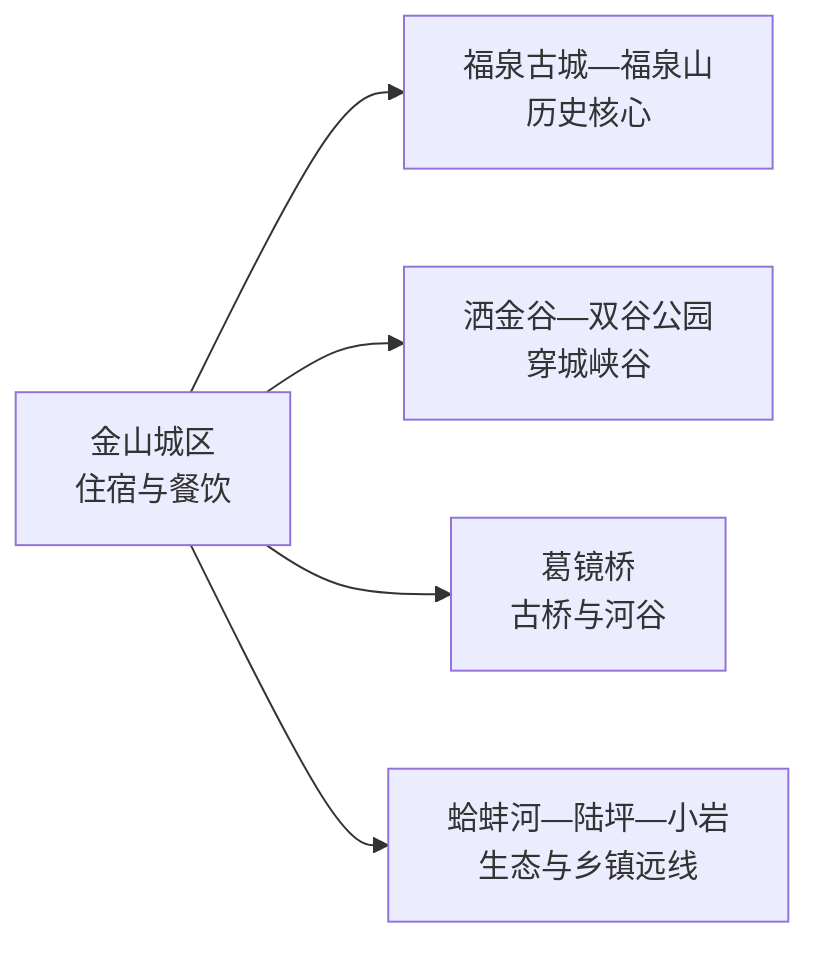
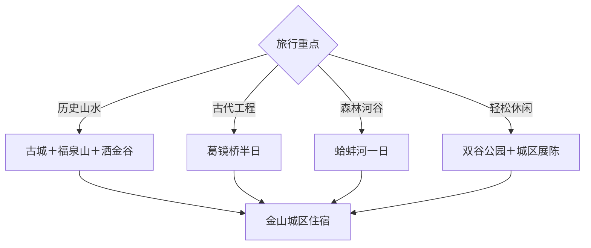

# 福泉旅行指南

福泉位于黔中东部，古城墙、福泉山和穿城峡谷构成紧凑的人文山水核心，葛镜桥、蛤蚌河与乡镇温泉则向市域外缘展开。首访可住 1–2 天：一天看古城与洒金谷，两天再从葛镜桥、蛤蚌河或乡村方向选一条。

本页绑定法定福泉市的 GeoNames 行政记录 **1810938**。该记录位于固定 `cities500` 快照外，只计入法定县级市覆盖。

## 城市速览

| 项目 | 信息 |
|---|---|
| 主线 | 福泉古城—福泉山—洒金谷—葛镜桥—蛤蚌河 |
| 停留 | 古城与峡谷 1 天；加入一条市域远线共 2 天 |
| 住宿 | 金山城区方便步行、餐饮和换乘；远线住宿重视接待与返程 |
| 交通 | 铁路、公路到达后进入城区；葛镜桥、蛤蚌河和陆坪方向用预约车辆 |
| 季节 | 春秋适合古城与峡谷，夏季适合森林河谷；汛期先看水情和地灾 |
| 预算 | 城区游览较节制，远点车辆、景区项目与温泉体验增加支出 |

## 城市格局与游览区域

古城、福泉山和洒金谷可组成一日核心，坡道和峡谷步道仍需留足体力。葛镜桥、蛤蚌河、陆坪温泉和小岩古驿水道分属不同方向，按开放、道路和接待选择其一。峡谷河道、森林公园、桥梁文保区、矿山及磷化工生产区均按正式开放范围活动。

## 主要景点

| 景点 | 区域 | 类型 | 核心体验 | 用时 | 环境 | 体力 | 预约风险 | 天气影响 | 优先级 |
|---|---|---|---|---:|---|---|---|---|---|
| 福泉古城文化旅游景区 | 金山城区 | 古城与街区 | 明代城垣、城门和城市历史 | 2–4小时 | 混合 | 低中 | 中 | 中 | A |
| 福泉山公开游线 | 古城附近 | 山岳与道教文化 | 山城关系、太极文化和登高 | 2–3小时 | 室外为主 | 中 | 中 | 高 | A |
| 洒金谷正式开放区 | 城区峡谷 | 峡谷与水利风景 | 穿城峡谷、河流和步道 | 2–4小时 | 室外 | 中高 | 高 | 很高 | A |
| 双谷生态体育公园 | 城区 | 公园与运动 | 城市休闲、亲子和轻运动 | 1.5–2小时 | 室外 | 低 | 低 | 高 | B |
| 葛镜桥公开参观区 | 市域河谷 | 古桥与文物 | 古代桥梁工程、河谷交通史 | 2–3小时 | 室外 | 中 | 高 | 很高 | A |
| 蛤蚌河正式游线 | 福泉国家森林公园方向 | 森林与河谷 | 森林、溪谷和生态观察 | 半天至1天 | 室外 | 中高 | 很高 | 很高 | B |
| 陆坪董炳温泉当期项目 | 陆坪镇方向 | 温泉与乡镇 | 温泉、乡镇慢游和休息 | 半天 | 混合 | 低 | 很高 | 中 | C |
| 小岩古驿水道公开段 | 市域乡镇 | 古驿与水道 | 河谷航运、古驿交通和乡村 | 半天 | 室外为主 | 中 | 很高 | 很高 | C |
| 福泉市博物馆或地方展陈 | 城区 | 博物馆与地方史 | 古城、桥梁和地方文化线索 | 1.5–2小时 | 室内 | 低 | 高 | 低 | B |
| 阳戏、花灯等当期公开活动 | 城区或乡镇 | 非遗与民俗 | 地方戏曲、灯会和社区文化 | 2–3小时 | 混合 | 低 | 很高 | 中 | B |

## 美食与餐饮

福泉可寻找酸汤、牛肉粉、豆腐圆子、丝娃娃、辣子鸡和黔南家常菜。城区用粉面解决单人餐较方便，酸汤和炒菜适合共享；辣椒、折耳根、花生、肉类和麸质需求在点餐时说明，乡镇远线提前确认午餐。

## 经典行程

### 古城山水一日线
**路线**：福泉古城—福泉山—午餐—洒金谷正式游线。**逻辑**：历史核心与穿城峡谷连贯安排。**预约锚点**：城墙、山门和峡谷开放。**休息**：古城街区。**删除条件**：强降雨时缩短洒金谷段。

### 葛镜桥工程线
**路线**：城区—葛镜桥公开参观区—河谷观景—返城。**逻辑**：围绕古代桥梁与交通史展开。**预约锚点**：开放范围和往返车辆。**休息**：正式服务点。**删除条件**：涨水、桥区维护或道路预警时改博物馆。

### 蛤蚌河森林线
**路线**：城区—蛤蚌河正式入口—森林河谷游线—返城。**逻辑**：自然主题独立一天，减少赶路。**预约锚点**：门票、步道和车辆。**休息**：游客服务区。**删除条件**：山洪、雷暴或地灾预警时取消。

### 温泉乡镇线
**路线**：城区—陆坪董炳温泉当期项目—乡镇午餐—返城。**逻辑**：用低体力活动承接前一日步行。**预约锚点**：营业、泡池、水质公告和车辆。**休息**：温泉接待区。**删除条件**：项目暂停或健康条件不适合时改双谷公园。

### 非遗活动线
**路线**：地方展陈—阳戏或花灯公开活动—黔南晚餐。**逻辑**：按真实活动时间理解地方文化。**预约锚点**：演出日期、场地和座位。**休息**：城区场馆。**删除条件**：没有当期活动时保留古城夜游。

### 亲子低体力线
**路线**：福泉古城短线—午餐—双谷生态体育公园—城区展陈。**逻辑**：步行可分段，退出和休息方便。**预约锚点**：场馆及儿童项目。**休息**：公园服务区。**删除条件**：高温或降雨时保留室内展陈。

### 两日完整线
**路线**：首日古城—福泉山—洒金谷，次日葛镜桥或蛤蚌河。**逻辑**：城市核心与市域远线分日。**预约锚点**：第二日入口、车辆和天气退改。**休息**：连续住金山城区。**删除条件**：只有一天时保留首日核心。

## 住宿区域

金山城区适合古城、洒金谷、餐饮和次日换乘。靠近古城的住宿利于早晚步行，选择时核对坡度与停车；蛤蚌河、陆坪等远线周边住宿更适合慢游，并需确认餐饮、网络、夜间交通和退改。

## 市内交通

到达福泉站、福泉南站或公路客运点后，按实际住宿位置选择接驳。城区核心可步行加短途乘车，葛镜桥、蛤蚌河、陆坪和小岩方向更适合预约车辆。汛期水情、山洪和地灾会影响峡谷与河谷；古城墙、葛镜桥等文物执行保护边界，矿山、磷化工园区及运输通道执行生产管理。

## 不同旅行者须知

历史爱好者优先古城、福泉山与葛镜桥，自然旅行者从洒金谷和蛤蚌河择一，亲子与低体力旅行者选古城短线加双谷公园。非遗旅行者按实际活动日预约，在社区演出或仪式中先征得拍摄同意。

## 行前核对

- 通过福泉市、黔南州文旅渠道核对古城、洒金谷、葛镜桥和蛤蚌河开放。
- 核对铁路到达站、城区接驳、远线车辆、末班返程和驾驶时间。
- 河谷线路查看降雨、水情、山洪、雷暴和地质灾害预警。
- 温泉、非遗、乡村接待和场馆按营业日期、价格与退改预约。

## 来源与更新记录

| 来源 | 支持内容 | 核验日期 |
|---|---|---|
| [福泉市投资指南](https://www.gzfuquan.gov.cn/fqzs/grfw/201804/W020240829438038194916.pdf) | 洒金谷、蛤蚌河、葛镜桥、双谷公园、温泉与民俗资源 | 2026-09-04 |
| [黔南州环境资料中的福泉概况](https://www.qiannan.gov.cn/zwgk/zdlygk/sthj/sthjaqjg/202107/P020220529228905315083.pdf) | 古城垣、葛镜桥、福泉山、洒金谷和蛤蚌河 | 2026-09-04 |
| [GeoNames 1810938](https://www.geonames.org/1810938/) | 福泉市行政记录 | 2026-09-04 |

