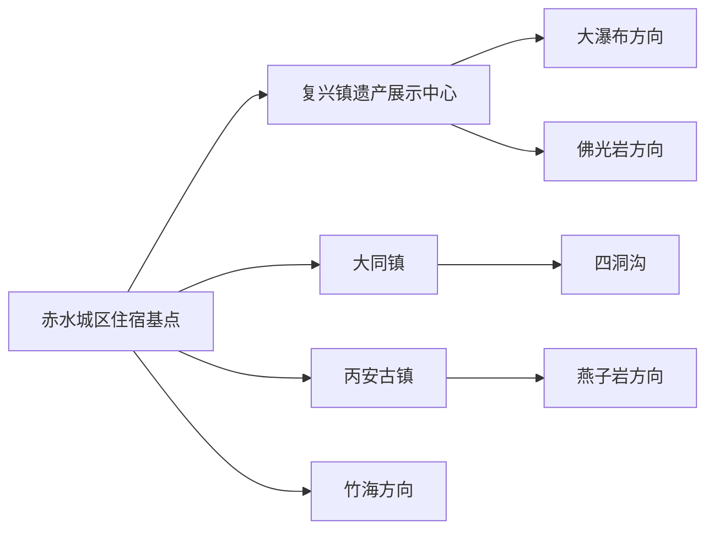
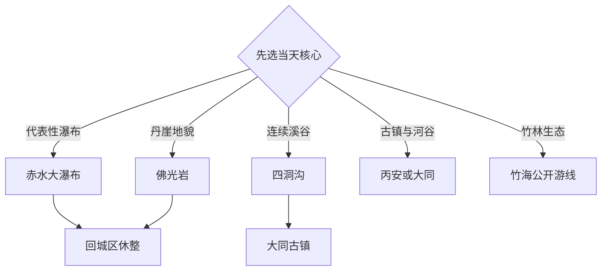

# 赤水旅行指南

赤水位于贵州北部、赤水河畔，旅行重心是丹霞峡谷、瀑布、竹林、古镇与世界自然遗产解说。景点散在市域不同山谷，选一处大型丹霞景区作为当天主线，再用古镇或城市河滨补充，比追求一天多点更从容。固定快照中的 **Datong / GeoNames 1813456** 位于现行赤水市大同镇，页面按法定县级赤水市组织完整旅行范围。

> 建议停留：3–4 天  
> 旅行关键词：丹霞瀑布、竹林生态、河谷古镇  
> 主要体力：中等至较高步行  
> 最近研究：2026-09-03

## 城市速览

| 项目 | 旅行信息 |
|---|---|
| 主要旅行价值 | 用连续数日看懂“丹山、碧水、翠林、飞瀑”组合，并在丙安、大同补充河谷聚落与竹文化 |
| 建议停留 | 3 天覆盖一处核心丹霞、四洞沟和一座古镇；4 天可加入另一处大型景区或竹海方向 |
| 较舒适季节 | 春秋适合山地步行；夏季植被丰茂且水景充足，同时关注高温、强降雨与雷电 |
| 预算特点 | 中等；景区门票、内部交通和分散点位之间的包车或自驾是主要成本 |
| 步行强度 | 中至高；瀑布景区常有长距离栈道、湿滑台阶和明显高差 |
| 主要天气风险 | 强降雨、山洪、落石、雷电、林区火险与冬季低温湿滑 |
| 独行旅行 | 城区和成熟景区易安排，跨谷移动宜提前锁定正规车辆与返程时间 |
| 亲子旅行 | 四洞沟或展示中心更易控制节奏；大型瀑布线按儿童体力删减支线 |
| 长者与低体力旅行 | 优先展示中心、古镇公共区和接驳较完整的景区，逐段确认电梯、索道与台阶 |
| 无障碍信息 | 山地景区连续无障碍通行能力有限，入口、接驳终点和可达观景位需向运营方确认 |

## 城市格局与游览区域

赤水城区位于赤水河沿岸，适合作为多日住宿基点；复兴、大同、丙安及南部山地景区分散在不同公路方向。赤水丹霞旅游区以大瀑布、佛光岩和燕子岩等单元组成，每个单元都有独立入口和内部游线。四洞沟与大同古镇适合同日组合，丙安古镇更适合作为另一条河谷线的文化节点。

| 区域 | 主要内容 | 游览特点 | 与其他区域的关系 |
|---|---|---|---|
| 赤水城区 | 赤水河滨、城市餐饮、公共文化空间 | 坡度相对可控，便于补给和调整 | 适合连续住宿，每日往返一个山地方向 |
| 复兴—丹霞核心 | 遗产展示中心、大瀑布、佛光岩 | 峡谷与瀑布尺度大，台阶和接驳较多 | 大瀑布与佛光岩各按独立大半日或一日安排 |
| 大同方向 | 四洞沟、大同古镇、竹编与河谷 | 水景密集，古镇可作午餐和休整点 | 适合组成一日，先锁定四洞沟游览时段 |
| 丙安方向 | 丙安古镇、赤水河谷、燕子岩接续 | 山地古镇与峡谷并存 | 可按体力二选一，也可分成两日 |
| 竹海方向 | 竹林景观与林业生态 | 公路移动占比高，天气影响明显 | 适合作为第四日兴趣线 |

## 主要景点

优先级用于安排时间：**A** 为首访核心，**B** 为按兴趣补充，**C** 为远线或需要单独半天以上的目的地。同一景区的瀑布、栈道与观景台按一个项目计算。

| 景点 | 区域 | 类型 | 主要看点 | 建议用时 | 室内外 | 体力 | 预约风险 | 天气影响 | 优先级 |
|---|---|---|---|---:|---|---|---|---|---|
| 赤水大瀑布景区 | 丹霞核心 | 瀑布与丹霞 | 大尺度瀑布、峡谷、丹崖与森林 | 5–7 小时 | 室外 | 高 | 中 | 高 | A |
| 佛光岩景区 | 丹霞核心 | 丹霞地貌 | 弧形丹崖、峡谷植被与地质观察 | 5–7 小时 | 室外 | 高 | 中 | 高 | A |
| 燕子岩景区 | 丙安方向 | 峡谷与瀑布 | 森林峡谷、瀑布群和丹霞崖壁 | 4–6 小时 | 室外 | 高 | 中 | 高 | B |
| 中国丹霞赤水世界自然遗产展示中心 | 复兴镇 | 展示与科普 | 遗产价值、地貌演化和生物多样性 | 1.5–2.5 小时 | 室内 | 低 | 低 | 低 | A |
| 四洞沟景区 | 大同方向 | 瀑布与峡谷 | 连续瀑布、溪谷栈道与竹林 | 4–6 小时 | 室外 | 中高 | 中 | 高 | A |
| 大同古镇公共游览区 | 大同镇 | 古镇与社区 | 河谷街巷、竹编和地方生活 | 1.5–3 小时 | 混合 | 中 | 低 | 中 | B |
| 丙安古镇公共游览区 | 丙安镇 | 古镇与历史 | 山地聚落、石阶、赤水河与红色历史 | 2–4 小时 | 混合 | 中高 | 低 | 中高 | A |
| 赤水竹海国家森林公园公开游线 | 竹海方向 | 森林与产业景观 | 竹林尺度、林业生态和观景空间 | 4–6 小时 | 室外 | 中 | 中 | 高 | B |
| 桫椤自然保护主题公开解说点 | 市域山地 | 自然教育 | 桫椤与亚热带森林生态 | 半天 | 室外 | 中 | 中 | 高 | C |
| 赤水城区河滨公共空间 | 城区 | 城市与河流 | 赤水河、城市日常和晚间散步 | 1–2 小时 | 室外 | 低 | 低 | 中 | B |

世界遗产地、自然保护地和森林公园按开放步道游览；核心保护区、封闭林区、未开放河谷与科研监测设施保留明确限制。强降雨或火险管控期间，以闭园和分区公告为准。

## 美食与餐饮

赤水饮食适合围绕竹笋、竹荪、豆花、腊味和黔北家常菜来选。城区餐饮选择最集中，古镇和景区入口更适合解决一餐；早出发的山地日可准备饮水和便携食品，并把热餐放在回城后。

| 菜品或餐饮类型 | 常见区域 | 一个人用餐与常见份量 | 风味、过敏原与饮食限制 | 排队风险与替代方法 |
|---|---|---|---|---|
| 竹笋与竹荪菜 | 城区、大同方向 | 小炒或汤类较易点，部分菌汤适合共享 | 菌类、肉汤底和鸡精可提前询问 | 选择同类家常菜馆即可替代 |
| 豆花与豆花饭 | 城区、乡镇 | 一人份友好 | 蘸水常含辣椒、花生或芝麻 | 午餐高峰前后错峰 |
| 腊肉与筒筒笋 | 城区、古镇 | 通常适合多人共享 | 盐度较高，素食者可改选时蔬与豆制品 | 按明码标价和现做菜选择 |
| 黔北家常菜 | 城区 | 小份菜或粉面更适合独行 | 辣度、动物油和内脏可在点单时确认 | 景区返城后选择更充足 |
| 河鲜类 | 赤水河沿线正规餐馆 | 多按重量计价，适合共享 | 先确认品种、价格和来源 | 以养殖来源、明码标价为选择条件 |

## 经典行程

### 一日经典路线

**路线**：世界自然遗产展示中心 → 赤水大瀑布景区 → 赤水城区河滨。

- **串联逻辑**：先在室内建立丹霞与生态框架，再用完整半日进入代表性瀑布景区，晚间回城补充河谷城市体验。
- **预约锚点**：大瀑布门票、内部交通与当日开放分区。
- **休息安排**：展示中心、景区游客中心和城区餐饮区。
- **时间不足时**：保留展示中心与大瀑布主游线，删除晚间河滨。

### 两日城市路线

**第 1 天**：展示中心 → 赤水大瀑布 → 城区住宿。  
**第 2 天**：四洞沟 → 大同古镇 → 城区。

- **串联逻辑**：第一天看大型丹霞瀑布，第二天用较紧凑的溪谷和古镇补齐竹林与社区维度。
- **预约锚点**：两处景区的开放、接驳与返程车辆。
- **休息安排**：第二天在大同镇安排午餐或下午茶。
- **时间不足时**：第二天保留四洞沟，古镇缩短为一小时公共街巷段。

### 三日深度路线

**第 1 天**：展示中心 → 赤水大瀑布。  
**第 2 天**：佛光岩全天。  
**第 3 天**：丙安古镇 → 赤水河谷公开观景点。

- **串联逻辑**：把两个高体力地貌日分开，中间连续住在城区；第三天转为历史与河谷观察。
- **预约锚点**：佛光岩、大瀑布和第三日正规车辆。
- **休息安排**：每天回城区休息，第三日在丙安镇安排长午休。
- **时间不足时**：两天时在大瀑布与佛光岩中选一处，保留丙安半日。

### 雨天路线

**路线**：遗产展示中心 → 城区公共文化空间 → 城区餐饮与短段河滨。

- **适用条件**：普通小雨且道路正常时采用；暴雨、雷电、山洪或地灾预警时留在安全室内并调整跨谷交通。
- **预约锚点**：展示中心和公共文化空间开放。
- **休息安排**：城区连续室内停留。
- **时间不足时**：保留展示中心，河滨按雨势取消。

### 亲子或低体力路线

**亲子路线**：遗产展示中心 → 四洞沟可承受段 → 大同古镇休息。  
**低体力路线**：遗产展示中心 → 大同古镇公共区 → 赤水城区河滨短段。

- **减负方式**：亲子线在景区入口确认儿童接驳与安全栏杆，按体力原路返回；低体力线用车辆连接三个低强度节点，并优先平缓入口。
- **预约锚点**：四洞沟内部交通和古镇停车落客点。
- **休息安排**：展示中心、大同镇餐饮与城区住宿。
- **时间不足时**：亲子线删除古镇，低体力线删除河滨。

### 古镇与河谷一日路线

**路线**：赤水城区 → 丙安古镇公共区 → 赤水河谷公开观景点 → 返回城区。

- **适用条件**：适合把重点放在聚落、历史与河谷地形，并愿意承担石阶步行的人。
- **预约锚点**：道路状况、停车与古镇开放范围。
- **休息安排**：丙安镇游客服务点和正规餐饮。
- **时间不足时**：保留古镇，河谷观景点按返程时间删除。

### 竹林生态一日路线

**路线**：赤水城区 → 竹海公开游线 → 林业生态解说点 → 返回城区。

- **适用条件**：天气稳定、林区开放且有完整交通安排时执行。
- **预约锚点**：森林公园开放、火险等级与接驳。
- **休息安排**：游客中心与确认营业的沿线服务点。
- **时间不足时**：保留竹海主游线，删除第二处解说点。

## 住宿区域

| 区域 | 优点 | 缺点 | 适合人群 | 交通特点 |
|---|---|---|---|---|
| 赤水城区 | 餐饮、补给和跨方向车辆选择较多 | 每天需要往返山地景区 | 首访、多日旅行、公共交通使用者 | 适合作为统一基点，降低搬运行李成本 |
| 大同镇及四洞沟入口周边 | 早进四洞沟，大同古镇可慢游 | 夜间选择和跨其他方向交通较少 | 溪谷摄影、亲子和慢旅行 | 次日继续大同方向最方便 |
| 丙安镇正规住宿 | 便于早晚体验古镇和河谷 | 石阶、停车与行李搬运需核对 | 古镇摄影与历史主题旅行者 | 适合专门留宿一晚，而非每天跨城往返 |
| 丹霞景区入口周边 | 可减少核心景区当日车程 | 餐饮和晚间活动相对有限 | 早入园、单景区深度游 | 预订时确认实际入口、接驳和退改 |

## 市内交通

| 场景 | 建议与取舍 | 行前需要重查的内容 |
|---|---|---|
| 跨城抵达 | 结合铁路到站与遵义、泸州等方向公路接驳选择路线 | 班次、到站点、末班接驳和道路施工 |
| 城区到景区 | 包车、自驾或当期旅游交通适合分散点位 | 运营日期、上车点、返程时间和票制 |
| 景区内部 | 使用官方观光车、步道和索道等公开设施 | 分区开放、检修、单向游线和末班时间 |
| 古镇步行 | 在公共街巷慢行，提前考虑石阶和雨后湿滑 | 停车落客点、行李转运和临时管控 |
| 自驾 | 每天只安排一个山地方向，预留弯道与雨雾时间 | 山洪、落石、火险、停车容量和充电条件 |

## 不同旅行者须知

| 旅行维度 | 可行条件 | 主要取舍 | 需额外核对 |
|---|---|---|---|
| 独行旅行 | 城区住宿并预约成熟景区接驳 | 晚间返程与跨谷叫车选择较少 | 景区返程车与手机信号 |
| 亲子旅行 | 选择展示中心、四洞沟可承受段和古镇休整 | 溪边、湿滑台阶和长距离步行增加看护负担 | 儿童票、接驳与护栏连续性 |
| 长者或低体力旅行 | 用展示中心、古镇公共区和接驳观景位组合 | 核心瀑布线高差明显 | 电梯、索道、接驳终点与卫生间 |
| 无障碍需求 | 先向运营方确认可到达的具体观景点 | 山地步道和古镇石阶难以连续通行 | 无障碍入口、停车位与陪同规则 |
| 摄影旅行 | 清晨古镇、阴天丹霞和公开观景台均有价值 | 器材增加台阶与雨雾负担 | 三脚架、无人机和商业拍摄规则 |
| 预算有限 | 以城区住宿、河滨和单个核心景区组合 | 分散景点间交通成本较高 | 联票、公共接驳与退改 |
| 晚出发或紧凑行程 | 选择展示中心加城区，或单独一座古镇 | 大型景区需要完整半日以上 | 最晚入园与返程交通 |
| 特殊天气或自然条件 | 根据预警把户外日改为展示中心和城区 | 暴雨、雷电、火险会改变开放范围 | 气象、地灾、河流水位和林区公告 |

## 行前核对

| 核对事项 | 为什么需要重查 | 建议核对时间 | 官方入口 |
|---|---|---|---|
| 丹霞景区开放与票务 | 大瀑布、佛光岩、燕子岩分区和内部交通会调整 | 预约前及到访前一日 | [赤水丹霞旅游区](https://csdxcn.com/) |
| 世界遗产保护信息 | 开放游线、科普活动和保护要求有时效性 | 安排行程时 | [国家林业和草原局](https://www.forestry.gov.cn/lyj/1/kpzrbhd/20260612/675976.html) |
| 跨城与景区交通 | 班次、道路和旅游专线可能变化 | 出发前一周及当天 | [贵州省交通运输厅](https://jt.guizhou.gov.cn/cxfw_0/) |
| 天气与地质风险 | 山洪、落石、雷电和林区火险影响户外游线 | 出发前三日及当天 | [贵州省气象局](https://gz.cma.gov.cn/)、[贵州省自然资源厅](https://zrzy.guizhou.gov.cn/) |
| 古镇与社区活动 | 节庆、展演和接待时段按当期安排 | 排入路线前 | [赤水市人民政府](https://www.gzchishui.gov.cn/) |

## 来源与更新记录

### 主要来源

| 来源 | 类型 | 支持内容 | 核验日期 |
|---|---|---|---|
| [国家林业和草原局：赤水丹霞](https://www.forestry.gov.cn/lyj/1/kpzrbhd/20260612/675976.html) | 国家主管部门 | 世界遗产、丹霞生态、核心景观与复兴镇展示中心 | 2026-09-03 |
| [贵州省公路局：赤水丹霞公路游线](https://glj.guizhou.gov.cn/glzz/zyglglj/xwzx_5377785/xywh_5377791/202508/t20250805_88397139.html) | 省级交通部门 | 佛光岩、大瀑布方向与公路旅行关系 | 2026-09-03 |
| [贵州省民政厅：大同镇四洞沟旁旅居项目](https://mzt.guizhou.gov.cn/xwzx/mzyw/202207/t20220718_75570142.html) | 省级主管部门 | 大同镇、民族村与四洞沟属地关系 | 2026-09-03 |
| [GeoNames 1813456](https://www.geonames.org/1813456/) | 固定开放数据 | Datong 人口点与本页定位锚点 | 2026-09-03 |

### 更新记录

| 日期 | 更新内容 |
|---|---|
| 2026-09-03 | 首次完成赤水县级市映射、资料研究与路线整理 |
