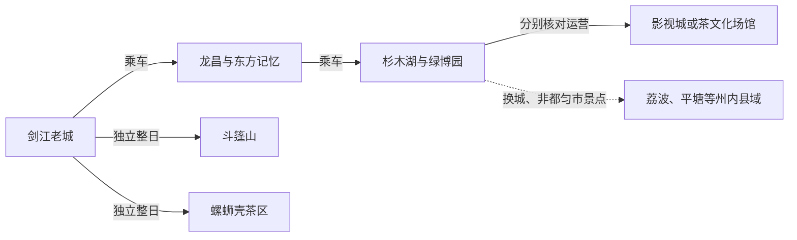
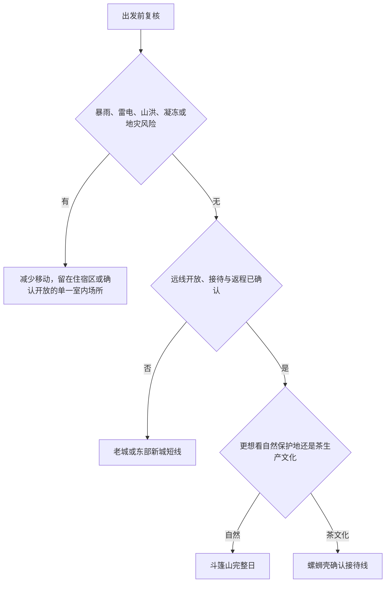

# 都匀旅行指南

都匀是黔南布依族苗族自治州的州府，也是贵州省直辖、黔南州代管的县级市。剑江穿过老城，石板街、百子桥、文峰园和三江堰适合认识“山水桥城”的日常一面；东部新城分布着杉木湖、绿博园、秦汉影视城和茶文化场馆；斗篷山与螺蛳壳茶区则是需要独立安排的山地远线。州府身份不等于整个黔南州：荔波大小七孔、平塘“中国天眼”、独山和福泉等均不在都匀市境内。

> 建议停留：老城与东部新城 2 天；加入斗篷山或一条确认接待的茶山线共 3 天\
> 旅行关键词：剑江、桥城、三线工业遗产、影视场景、都匀毛尖、山地保护\
> 主要体力：老城中等步行；东部节点间乘车；斗篷山和茶山为中至较高强度\
> 最近研究：2026-08-12

## 城市速览

| 项目 | 旅行信息 |
|---|---|
| 主要旅行价值 | 沿剑江认识州府老城与桥梁生活，在东方记忆理解三线建设，在东部新城按当日开放选择绿博园、影视或茶文化内容，再从斗篷山与螺蛳壳茶区中选一条山地远线 |
| 建议停留 | 1 天以老城或东部新城为主；2 天各留一天；3 天再加斗篷山或一处明确接待游客的茶区，不把黔南州其他县景点压入同一日 |
| 较舒适季节 | 春秋通常更适合城市步行与山地活动；夏季植被丰茂但雨水、雷电和山洪风险上升，冬季阴冷、雨雾和道路凝冻会增加体感与接驳负担 |
| 预算特点 | 老城公共空间、公交与普通餐饮较易控制成本；影视城项目、活动票、远郊包车、山地接驳和茶事体验是主要增量 |
| 步行强度 | 剑江老城线可分段步行，但桥头、大路口和湿滑石板会放大负担；杉木湖、绿博园、影视城、茶博园及都匀东站不是一条连续步行线 |
| 主要天气风险 | 短时强降雨、雷电、大雾、山洪、滑坡、落石与城市积水；冬季低温雨雪和凝冻可能影响高速、公路、公交与景区步道 |
| 独行旅行 | 老城和常规公交较易独立安排；斗篷山、茶山与晚间返程须提前锁定正规车辆，不单独进入未开放林地、河谷、茶园或片场 |
| 亲子旅行 | 城市公园、经确认开放的展馆与影视活动可组合；临水岸线、影视道具、拥挤活动、茶园作业路和山地步道需要全程看护 |
| 长者与低体力旅行 | 采用“一处核心＋完整午休＋车辆接驳”的节奏；不把老城石板路、东部大尺度公园和远郊山地排在同一天 |
| 无障碍信息 | 公开资料只证明部分公交设施在改善，不能证明车站、车辆、街区、景区和卫生间之间存在连续无障碍路线；坡道、电梯、轮椅、门宽、下客点和车辆装载条件须逐处确认 |

## 城市格局与游览区域

都匀市法定行政区划代码为 `522701`，是黔南布依族苗族自治州辖县级市和州人民政府驻地。2026 年省政府批复调整匀东镇部分行政区划，随后设立杉木湖街道，省民政厅确定其乡级代码为 `522701011`；据此，都匀现有 6 个街道、4 个镇和 1 个民族乡，仍写“5 街道、4 镇、1 乡”的旧政府概况页已经滞后。县级市代码和市域边界没有因这次乡级调整而变成整个黔南州。

| 区域 | 主要内容 | 游览特点 | 与其他区域的关系 |
|---|---|---|---|
| 剑江老城 | 石板街、百子桥、文峰园、剑江公开岸线、三江堰与城市餐饮 | 适合步行与公交组合；石板、桥面和滨水段遇雨湿滑，水位异常时远离临水边缘 | 可作为住宿和晚餐基地；前往东方记忆或东部新城均需乘车 |
| 龙昌—东方记忆 | 东方机床厂工业遗产、东方记忆景区、三线建设博物馆及当期开放的文化空间 | 厂区历史建筑、展馆、商业街区和仍在管理中的建筑不是同一种开放状态 | 与老城距离可控但不默认连续步行；场馆须按当日公众开放范围进入 |
| 杉木湖—绿博园 | 杉木湖中央公园、绿博园、州级公共服务与东部新城生活 | 公园尺度大、入口多，活动、停车、夜间开放和内部交通会变化 | 靠近都匀东站方向，但站区、公园和场馆仍需公交或车辆连接 |
| 大坪—影视与茶文化场馆 | 秦汉影视城、中国茶文化博览园及经确认开放的茶文化展陈 | 官方名录中的总景区、影视生产、游客项目、场馆展览和临时活动各有运营边界，不能凭园区名称推断全部开放 | 可与杉木湖或绿博园择一组合；不在片场封控和闭馆后寻找侧门 |
| 斗篷山方向 | 斗篷山景区、森林与风景名胜区保护空间 | 山高谷深，入口、步道、防火、天气和返程共同决定是否可行 | 按完整一天安排，不与螺蛳壳茶区或东部新城赶场 |
| 毛尖镇—螺蛳壳—坪阳方向 | 茶园、茶村、当期接待点与都匀毛尖生产文化 | 茶园首先是生产空间，采摘、加工、研学和露营只在明确经营项目内进行 | 选择一个接待点原路往返；不把整片茶山视为免预约公共公园 |

### 城市点、法定实体与最新区划

本页固定城市点为 GeoNames `1811764`。2026-08-12 实时核验的 Wikidata 法定实体为 `Q1207027`，中文标签为“都匀市”，实例为县级市，属性 `P1566` 的值正是 `1811764`。这组标识定位都匀市及其主城，不把黔南州代码 `522700`、州内其他县市或旅游线路营销范围并入本页。

### 影视、茶园与自然保护边界

贵州省 A 级旅游景区名录把中国茶文化博览园、毛尖小镇和秦汉影视城列在“都匀茶文化影视小镇景区”这一总名下。这个总景区名称只说明名录中的归组关系，不表示三个子项目共用一张票、同一入口或同一开放时刻。

秦汉影视城既有游客活动，也承担影视制作。2025 年公开报道和 2026 年节庆信息只能证明特定时段存在旅游产品，不能证明所有宫殿、摄影棚、道具区和机位长期向公众开放。购票前要分别确认开放区、演出或妆造项目、最晚入园、拍摄封控和退改规则；现场以围挡与工作人员指引为准。

中国茶文化博览园承担会展和茶文化展示，但现有可访问的一手资料不足以证明其全年按固定时刻向散客开放，也不足以证明园内每一处展陈同时开放。只有在场馆明确回复公众开放、入口和预约方式后，才将经确认开放的部分作为室内锚点。螺蛳壳、坪阳等茶区有茶旅活动，也仍是茶农生产与居住空间；不擅自采叶、不跨田埂、不进入加工车间、仓库或农户院落，人物拍摄、无人机和商业拍摄须先取得同意。

斗篷山属于都匀斗篷山—剑江风景名胜区的组成部分，景区游览区不等于可以进入全部保护地。核心保护范围、未开放林地、水源地、施工区和森林防火封控区均不进入；遇暴雨、雷电、大雾、落石、山洪或闭园通知时取消远线，不沿林道寻找替代入口。

## 主要景点

优先级用于安排行程，不代表绝对排名：**A** 为首访核心，**B** 为按兴趣补充，**C** 为远郊、运营依赖高或通常需要独立半天以上的目的地。桥梁、园林、河岸和街巷只有在公开通行且安全时才可串联；同一园区内的展演、妆造、展馆和茶事体验按不同产品核对。

### 剑江老城与工业遗产

| 景点 | 区域 | 类型 | 主要看点 | 建议用时 | 室内外 | 体力 | 预约风险 | 天气影响 | 优先级 |
|---|---|---|---|---:|---|---|---|---|---|
| 石板街—百子桥—剑江公开岸线 | 剑江老城 | 历史街巷、桥梁与滨水城市空间 | 石板街的城市商贸、百子桥与剑江桥城景观；只走当日公开岸线，不把沿河所有设施视为同一景区 | 2–4 小时 | 室外为主 | 中；石板与桥面湿滑 | 低；街区活动和局部施工需重查 | 高；暴雨、水位与高温影响明显 | A |
| 文峰园景区 | 老城南段 | 城市园林、历史建筑 | 文峰塔、园林与剑江城市背景；园内活动和临时管控按公告 | 1–2 小时 | 室外为主 | 低至中 | 低至中 | 中 | B |
| 三江堰景区 | 老城北段 | 水利景观与城市公园 | 河流汇合、堰体周边和公开公园空间；不进入非开放水工设施 | 1.5–3 小时 | 室外 | 低至中 | 中；临水区可能临时管控 | 高；暴雨和水位异常时取消 | B |
| 东方记忆景区与三线建设博物馆当期开放区 | 龙昌片区 | 工业遗产、博物馆与文化街区 | 东方机床厂遗产、三线建设叙事和当期公共文化内容；历史建筑、展馆与商业区分别核对 | 2–4 小时 | 混合 | 低至中 | 高；公众开放楼栋、展览和活动会变 | 中 | B |

### 东部新城与运营型场所

| 景点 | 区域 | 类型 | 主要看点 | 建议用时 | 室内外 | 体力 | 预约风险 | 天气影响 | 优先级 |
|---|---|---|---|---:|---|---|---|---|---|
| 杉木湖中央公园 | 杉木湖片区 | 城市公园、湖岸 | 湖岸、城市新景与可随时缩短的公园步行；实际入口、活动与夜间照明按现场 | 1.5–3 小时 | 室外 | 低至中；园区尺度大 | 中 | 高；雷雨、积水和高温时缩短 | B |
| 都匀绿博园 | 东部新城 | 大型园林与城市休闲 | 园林、水体、桥梁及当期开放的公共区域；展园、商业与活动不能自动视为全部持续运营 | 3–6 小时 | 室外为主 | 中；距离长 | 高；入口、开放区、内部交通和活动需重查 | 高 | A |
| 都匀秦汉影视城 | 大坪片区 | 影视基地与游客项目 | 秦汉风格场景、当期实景娱乐、妆造或市集；片场生产区、游客区和收费项目分开 | 3–6 小时 | 混合 | 中 | 很高；拍摄封控、票务、演出与项目变化快 | 中至高 | B |
| 中国茶文化博览园当期开放内容 | 东部新城 | 会展与茶文化展示 | 经确认开放时了解茶文化或参加当期活动；不能从总景区名录或旧规划推定全部展陈常态开放 | 2–4 小时 | 混合 | 低 | 极高；须先取得公众开放、预约和入口确认 | 中；交通受暴雨影响 | C |

### 山地、保护地与茶区

| 景点 | 区域 | 类型 | 主要看点 | 建议用时 | 室内外 | 体力 | 预约风险 | 天气影响 | 优先级 |
|---|---|---|---|---:|---|---|---|---|---|
| 斗篷山景区当期开放游线 | 斗篷山方向 | 山地、森林与风景名胜区 | 正式入口内的森林、峡谷与山地景观；只走开放步道，保护地深处不是自由徒步区 | 完整一天含往返 | 室外 | 高 | 很高；开放、票务、接驳、防火和返程须确认 | 极高 | C |
| 螺蛳壳—坪阳村明确接待线路 | 毛尖镇方向 | 茶园、村寨与生产文化 | 在正式接待点认识都匀毛尖产区、茶园生态与当期茶事体验；居民区和生产区仍有边界 | 完整一天含往返 | 室外为主 | 中至高；坡路与海拔增加负担 | 很高；接待、采茶季、道路和返程须确认 | 极高 | C |

荔波大小七孔位于荔波县，“中国天眼”景区位于平塘县，福泉古城、独山和三都等也各有属地边界。它们可经都匀换乘，但不属于都匀景点，也不应作为都匀一日游的“顺路加点”。

## 美食与餐饮

都匀毛尖既是地方饮品，也是持续运转的农业与加工产业。试饮、购买与进茶山是三件不同的事：在正规门店看产地、等级、净含量、生产者和保质信息；进入茶园或工坊则须以明确接待项目为前提。咖啡因敏感、儿童、孕期或服药者应按个人情况控制饮用量。

| 菜品或餐饮类型 | 常见区域 | 一个人用餐与常见份量 | 风味、过敏原与饮食限制 | 排队风险与替代方法 |
|---|---|---|---|---|
| 都匀毛尖与茶饮 | 正规茶店、城区茶馆及确认接待的茶文化场所 | 一壶可独饮或分享，购茶优先小包装试饮 | 茶含咖啡因；调饮还可能含乳制品、糖、蜂蜜或坚果，须逐项确认 | 节庆和团队体验时段较忙；不必追单店，可选标签完整、可开票的正规经营者 |
| 都匀冲冲糕 | 石板街、生活街区与正规小吃店 | 通常为单个或小份，适合独食 | 糯米或米制品口感黏软，配料可能含黄豆粉、芝麻、花生、糖和食用油 | 热门时段短暂排队；选择制作环境与价格清楚的同类摊店，不为打卡购买过量 |
| 都匀太师饼 | 正规糕点店与伴手礼店 | 单个或盒装，先买小份试味 | 常见面粉、油脂和糖，可能含蛋、乳、芝麻、花生或坚果；看完整配料表 | 节前礼盒需求高；用生产日期、许可和配料清楚的同类糕点替代 |
| 墨冲角角鱼或地方鱼菜 | 城区黔菜馆、墨冲镇确认经营点 | 多按锅或鱼重量计，独食先问小锅、鱼片或单人份 | 鱼刺、辣椒、发酵调料、豆制品和蘸水常见；严重过敏者确认共锅与加工环境 | 周末和团队餐等位较高；不必为一餐远赴墨冲，可在城区选明码标价的鱼菜 |
| 酸汤、米粉与家常黔菜 | 老城、车站与居民生活区 | 粉面适合独食，酸汤锅多为 2–4 人共享 | 汤底可能含辣椒、番茄发酵物、骨汤、大豆、芝麻、花生和葱蒜；素食与过敏需求须逐项说明 | 晚餐和夜市时段较忙；用普通粉面、清汤或家常小炒替代，不因“地方必吃”勉强点大锅 |
| 剑江西岸及老城夜间餐饮 | 西山大桥附近、石板街与老城商业区 | 小吃可少量组合，正餐先问半份或单人套餐 | 烧烤、酸辣、腊味与共用油锅常见；确认肉类、酒精、盐分和交叉接触 | 节假日拥挤且营业变化快；转入居民区正规餐馆或提前用餐，不依赖旧攻略中的单一夜市 |

茶叶、糕点、酒类、工业文创与影视衍生品都是具体经营者的产品。购买时核对产地、材质、授权、价格、发票与退换条件，不把“都匀毛尖”“影视同款”或“非遗”宣传自动理解为官方认证。

## 经典行程

先用天气与开放确认筛掉不可行方向，再选路线。红色或橙色预警、山洪和地质灾害提示、景区闭园、片场封控或场馆无明确回复，都应直接触发缩线或取消。

### 一日经典路线

**路线**：石板街 → 百子桥与剑江公开岸线 → 文峰园 → 城区午餐与长休 → 绿博园当期开放短线 → 返回老城

- **串联逻辑**：上午沿剑江完成老城步行，午后乘车到东部新城，只选择绿博园一处，不把杉木湖、影视城和茶博园都当成步行加点。
- **预约锚点**：绿博园当日入口、开放区域、内部交通与最晚离园是主锚点；滨水段同时查看雨情和水位提示。
- **休息安排**：在老城室内完成午餐和至少一小时休息；绿博园只在游客服务区或有座椅、卫生间的开放区域停留。
- **时间不足时**：删除绿博园，保留石板街—百子桥—文峰园；若上午遇强降雨，连滨水段一并删除。

### 两日城市路线

**路线**：第 1 天石板街—百子桥—文峰园—三江堰；第 2 天绿博园或杉木湖短线 → 午休 → 秦汉影视城当期游客开放区

- **串联逻辑**：第一天集中处理剑江老城，第二天以车辆连接东部两个节点；绿博园与杉木湖二选一，把足够时间留给影视城运营项目。
- **预约锚点**：第一天以滨水安全和三江堰开放为锚点；第二天以影视城拍摄封控、票务、演出、妆造和最晚离园为锚点。
- **休息安排**：两天都在城区或东部正规餐饮区安排完整午休；不在影视道具区、片场通道或湖岸边缘席地休息。
- **时间不足时**：第一天删除三江堰，第二天删除公园段，只保留已购票且确认开放的影视城；影视城无确认则改为公园短线后返程。

### 三日深度路线

**路线**：第 1 天剑江老城；第 2 天东方记忆与东部新城；第 3 天斗篷山开放线或螺蛳壳确认接待线二选一

- **串联逻辑**：前两天认识州府城市、工业遗产和东部新城，第三天只进入一个山地方向，把道路、保护或生产边界和返程余量计入整日。
- **预约锚点**：第三天的正式入口、开放公告、接待联系人、正规车辆、天气、防火与返程共同构成锚点；缺一项就留在城区。
- **休息安排**：第一、二天在城区午休；第三天只在游客中心、镇区或明确接待点用餐和休息，不在林道、河谷、茶田或公路路肩停留。
- **时间不足时**：整段删除第三天，不把斗篷山与茶山各截取一小时；第二天再缩为东方记忆或绿博园一处。

### 雨天路线

**路线**：经确认公众开放的三线建设博物馆或中国茶文化博览园室内展陈二选一 → 室内午餐与长休 → 提前返回住宿区

- **串联逻辑**：普通降雨且道路正常时，只用一处已确认开放的室内场所承接全天；两馆分处不同片区，不为凑数跨城往返。
- **预约锚点**：先取得当日公众开放、预约、入口、停车或下客点的明确回复；任何一馆无回复都不能被视为备用锚点。
- **休息安排**：午间留在同片区有室内候车条件的正规餐饮点，预留换鞋、更衣和车辆等待时间。
- **时间不足时**：只保留已确认的一馆；暴雨、雷电、山洪、地灾或凝冻预警时取消场馆移动，服从属地避险和交通管制。

### 亲子路线

**路线**：杉木湖或绿博园短线二选一 → 午餐与午休 → 秦汉影视城适龄项目或茶文化场馆当期亲子活动二选一

- **串联逻辑**：上午使用可随时退出的公园空间，下午只参加一个年龄与监护规则明确的运营项目；片场和场馆不能在未确认时互作无缝替代。
- **预约锚点**：核对活动年龄、身高、监护、票务、演出音量、推车、卫生间和退改；影视城还要确认当日拍摄封控。
- **休息安排**：保留完整午休和补水时间；不让儿童接触未开放道具、设备、临水边缘或茶叶加工机械。
- **时间不足时**：删除下午项目，只走一处公园短线；高温或雷雨时取消露天段。

### 低体力路线

**路线**：车辆抵达文峰园最近可用下客点 → 园内最短平缓段 → 室内午餐与长休 → 车辆看百子桥或剑江一处公开节点 → 返回住宿

- **串联逻辑**：全天只保留一处园林和一个可从车辆快速退出的城市节点，不把石板街全段、绿博园大环线或远郊山地加入。
- **预约锚点**：逐点确认下客位置、坡度、台阶、座椅、无障碍卫生间、轮椅和车辆回接，不以“公园”或“新建”推断连续可达。
- **休息安排**：午间至少留一小时室内休息，下午每段步行后都回到车辆或固定座椅区。
- **时间不足时**：删除下午节点，只保留文峰园短段与午餐；雨后湿滑时改为住宿区附近活动。

### 斗篷山一日路线

**路线**：都匀城区 → 斗篷山正式入口 → 当期开放短线 → 游客服务区午餐与休息 → 原路返回

- **串联逻辑**：把往返接驳、景区手续和山地步行视为一个完整日，只从正式入口进入，不沿林道、施工便道或保护区边界寻找捷径。
- **预约锚点**：景区开放、门票、步道、接驳、防火、天气、地灾和返程车辆必须在出发前共同确认。
- **休息安排**：在游客服务区或正规经营点休息；步道上按体力提前折返，不在沟谷、崖边、河滩和落石区久留。
- **时间不足时**：只走入口附近正式开放短线并提前返程；若不能保证天黑前离开，整线取消。

### 螺蛳壳茶区一日路线

**路线**：都匀城区 → 毛尖镇或坪阳村明确接待点 → 茶园公开游线或预约茶事 → 正规接待点午餐与休息 → 原路返回

- **串联逻辑**：以一个经营或社区明确接待点为中心理解茶生产文化，不追逐多个观景台、村寨和加工点，也不凭导航穿越茶园作业路。
- **预约锚点**：接待主体、集合点、项目内容、采摘权限、费用、车辆通行、天气、卫生间和返程时间须提前确认。
- **休息安排**：只在接待点、镇区或正规农家乐休息；不在茶田、烘制车间、仓库、农户院落或道路弯道停留。
- **时间不足时**：取消茶事或深处观景，只保留最近的公开短线；无明确接待时整线取消，改在城区正规茶馆品茶。

## 住宿区域

| 区域 | 优点 | 缺点 | 适合人群 | 交通特点 |
|---|---|---|---|---|
| 剑江老城与大十字周边 | 餐饮、日常商业、公交和老城短线集中，便于晚餐与分段步行 | 高峰拥堵、临街噪声、坡度与停车因路段不同 | 首访、独行、餐饮优先和多方向出发者 | 接都匀站较方便；前往都匀东站、绿博园和远郊须预留车程 |
| 都匀站周边 | 普通铁路抵离方便，适合早晚车次和短住 | 与主要老城步行线仍有道路衔接，环境与安静度因门牌不同 | 普铁旅行、预算有限或只住一晚者 | 订房前确认实际站口、上下客点、公交末班和行李搬运 |
| 杉木湖—州政务服务片区 | 靠近东部新城公园、公共服务和部分餐饮住宿 | 片区尺度大，地图相邻不等于可以连续步行 | 公园、会展、亲子活动或东部行程优先者 | 公交与车辆连接老城、都匀东站和绿博园；活动日可能拥堵 |
| 都匀东站周边 | 高铁抵离便捷，适合晚到、早走与行李较多者 | 距老城、斗篷山和茶区均需再接驳，站区夜间服务要重查 | 紧凑行程、高铁联程与重点旅客服务优先者 | 先确认酒店接送、公交末班、网约车上客区与站内服务 |
| 绿博园或影视城邻近住宿 | 可减少特定活动日往返，适合已锁定园区项目者 | 园区活动、餐饮营业、夜间交通和噪声变化较快 | 影视活动、会展或公园慢游者 | 只选地址、消防、停车、退订与夜间叫车可核实的住宿 |

若行程核心转到荔波、平塘、独山或州内其他县，应在对应县域住宿并重新计算交通。把都匀作为州府换乘点，不代表从都匀每天往返所有黔南景点都轻松可行。

## 市内交通

都匀站与都匀东站是不同铁路车站：前者承接普通铁路，后者位于东部高铁片区。车票上的到发站名决定接驳方向，不能只凭“都匀”二字判断。铁路车次、检票口和票务以 12306 出发日查询为准。

| 场景 | 建议与取舍 | 行前需要重查的内容 |
|---|---|---|
| 从都匀站抵达 | 公交、出租车或合规网约车进入剑江老城和住宿区；行李多时不勉强沿大路口步行 | 实际到达站、站口、公交末班、夜间上客点与重点旅客服务 |
| 从都匀东站抵达 | 公交或车辆前往杉木湖、绿博园、影视城或老城；站区和各园区并非出站即达 | 高铁车次、公交改道、网约车上客区、酒店接送和活动日交通 |
| 城区公交 | 2025 年官方信息显示可用“车来了”小程序和“掌上公交”查询到站，适合连接老城、两站与东部新城 | 线路、站名、首末班、临时改道、支付、无障碍车辆和实际到站信息 |
| 老城步行 | 石板街、百子桥、文峰园和部分剑江岸线可分段组合 | 桥头过街、坡度、施工、照明、雨后湿滑、水位与临时封闭 |
| 前往绿博园、影视城或茶博园 | 优先公交或合规车辆，每次围绕一处主目的地安排 | 真实入口、停车、活动交通管制、最晚离园和返程车源 |
| 前往斗篷山或螺蛳壳 | 以运营方或明确接待点确认和正规车辆为前提，不依赖临时拼车 | 县乡道路、雨雾、落石、防火、通信、返程、停车与驾驶员休息 |
| 自驾 | 远郊更灵活，但不进入茶田作业路、林道、保护区、片场后勤区和施工道路 | 停车、充电或加油、道路管制、酒后代驾、轮胎与连续驾驶时间 |

公开资料显示都匀公交已增设部分无障碍通道，但这不等于全部站台、车辆与景点连续可达。铁路需要协助时，可按 12306 重点旅客服务规则提前申请；景区、住宿、公交或包车仍须分别确认。

## 不同旅行者须知

| 旅行维度 | 可行条件 | 主要取舍 | 需额外核对 |
|---|---|---|---|
| 独行旅行 | 老城、常规公交和公共公园较易独立安排 | 山地、茶区、片场晚返与偏远道路车源不稳，不临时搭乘无资质车辆 | 末班交通、住宿前台、手机信号、正规车辆和紧急联系人 |
| 亲子旅行 | 公园短线、确认开放的展馆和适龄影视活动便于组合 | 临水、拥挤演出、影视设备、茶园机械和山地步道增加看护压力 | 年龄身高、监护、推车、卫生间、儿童餐、急救与退改 |
| 长者或低体力旅行 | 每天只保留一个核心点，以车辆连接午餐与住宿 | 石板路、大型园区、山地台阶和连续换乘会累积负担 | 最近下客点、坡道、座椅、电梯、卫生间和返程缓冲 |
| 无障碍需求 | 铁路重点旅客服务和部分公交设施可提供单点支持 | 公开资料不能证明车站—车辆—景区—卫生间全程连续可达 | 逐点确认门宽、坡度、台阶、电梯、轮椅、无障碍卫生间和陪同 |
| 摄影旅行 | 城市公共空间、影视城游客开放区和经允许的茶事活动题材丰富 | 居民、儿童、片场、道具、生产工序、保护地和无人机均有权利与安全边界 | 肖像同意、版权、商业授权、三脚架、闪光灯、无人机与片场封控 |
| 预算有限 | 住老城或车站附近，以公交、公共空间、小吃和单人餐组成城区日 | 影视项目、远郊包车、活动住宿和茶事体验会明显增加支出 | 公交末班、二次消费、明码标价、退订与发票 |
| 晚出发或紧凑行程 | 只保留老城一段或东部一处公园 | 下午不临时增加斗篷山、螺蛳壳或州内其他县景点 | 最晚入场、返程、日落、天气与住宿入住时间 |
| 雨季、凝冻或高温 | 普通小雨可转确认开放的室内场所，稳定天气再安排远线 | 暴雨雷电取消临水与山地，凝冻减少公路移动，高温缩短午后露天活动 | 气象、地灾、山洪、路况、景区关闭、防火和退改公告 |

都匀的布依族、苗族、水族等社区都有具体地域、支系和当代生活。商业演出、公共节庆、村寨接待与居民私人仪式须分开理解；进入住宅、拍摄人物与仪式或记录茶叶生产前先征得同意，不用一种服饰、歌舞或饮食代表整个黔南州。

## 行前核对

| 核对事项 | 为什么需要重查 | 建议核对时间 | 官方入口 |
|---|---|---|---|
| 绿博园、杉木湖与城市公园 | 入口、开放区、活动、内部交通、停车和夜间照明会调整 | 排入路线前及到访当日 | [都匀市人民政府](https://www.duyun.gov.cn/)；[贵州省政府部门关于绿博园与剑江治理的近况](https://fgw.guizhou.gov.cn/ztzl/dstzlxd/202508/t20250821_88499288.html) |
| 秦汉影视城 | 游客区与影视生产区不同，拍摄封控、演出、妆造、票务和最晚入园会变化 | 购票前、到访前一日及当日 | [贵州省 2026 年春节文旅活动](https://drc.guizhou.gov.cn/xwzx/zwyw/202602/t20260212_89507347.html)；[贵州省 2025 年假日旅游报道](https://drc.guizhou.gov.cn/xwzx/zwyw/202510/t20251009_88674799.html)；运营方当期公告 |
| 茶文化影视小镇各子项目 | 总景区名录与中国茶文化博览园、毛尖小镇、秦汉影视城各自的开放、票务和入口不是一回事 | 排入路线前及到访前一日 | [贵州省 A 级旅游景区名录](https://drc.guizhou.gov.cn/xxgk/sqjs/gzfg/202405/t20240523_84672683.html)；[都匀市“十四五”新型城镇化规划](https://www.duyun.gov.cn/zwgk/zdlygk/fzgh/202203/t20220301_81496230.html)；都匀市文旅主管部门与各项目当期回复 |
| 东方记忆与三线建设博物馆 | 历史建筑、街区、展馆和仍在整治或管理中的楼栋开放不同；规划中的博物馆功能不等于每日公众开放 | 到访前三日及当日 | [龙昌历史文化街区保护规划](https://www.duyun.gov.cn/ztzl/cxzt/zzzb/tzgg/202507/P020250722350768917213.pdf)；都匀市文旅主管部门与场馆当期回复 |
| 斗篷山景区 | 票务、入口、步道、接驳、防火、保护要求和天气可能导致分区关闭 | 订车前、出发前一日及当天 | [贵州省 A 级旅游景区名录](https://drc.guizhou.gov.cn/xxgk/sqjs/gzfg/202405/t20240523_84672683.html)；[都匀市公开环境资料](https://www.duyun.gov.cn/ztzl/cxzt/zzzb/tzgg/202505/P020250701302629685036.pdf)；景区当期公告 |
| 螺蛳壳、坪阳与茶事体验 | 茶园是生产空间，采摘季、社区接待、道路、收费和活动权限会变化 | 联系接待点时及出发当天 | [贵州省民政厅：坪阳村与螺蛳壳茶区](https://mzt.guizhou.gov.cn/ztzl/rdzt/gzdmgs/202508/t20250808_88428612.html)；[贵州省农业文旅资料](https://drc.guizhou.gov.cn/xwzx/zwyw/202402/t20240201_83660694.html) |
| 铁路、公交与远郊车辆 | 车次、站口、线路、首末班、改道和车源均会变化 | 购票时、出发前一日及当天 | [中国铁路 12306](https://www.12306.cn/)；[贵州省公共交通出行入口](https://jt.guizhou.gov.cn/cxfw_0/zhjt/gjky/)；[贵州省交通运输厅出行服务](https://jt.guizhou.gov.cn/cxfw_0/) |
| 暴雨、雷电、大雾、凝冻、山洪与地质灾害 | 剑江临水段、城市低洼处、山地、县乡道路和冬季高速都可能受影响 | 出发前三日滚动查看，远线当天再查 | [中国气象局都匀站天气](https://weather.cma.cn/web/weather/57827.html)；[贵州省自然资源厅](https://zrzy.guizhou.gov.cn/)；[贵州省交通运输厅路况](https://jt.guizhou.gov.cn/cxfw_0/lkxx_5948603/gxgllk_5948605/hftcxx_5948606/index.html)；[贵州省应急管理厅](https://yjgl.guizhou.gov.cn/) |
| 无障碍与重点旅客服务 | 单点坡道不等于全程连续可达，园区尺度、石板路和车辆换乘可能中断通行 | 订票、订房和预约场所时 | [12306 重点旅客预约](https://kyfw.12306.cn/otn/view/icentre_qxyyInfo.html)；各场所、住宿与承运方客服 |
| 食品、茶叶与餐饮配料 | 菜单、份量、价格、茶叶批次和过敏原信息会变化 | 消费前 | 经营者当日菜单与产品标签；[贵州省市场监督管理局](https://amr.guizhou.gov.cn/) |

## 来源与更新记录

### 主要来源

| 来源 | 类型 | 支持内容 | 核验日期 |
|---|---|---|---|
| [贵州省民政厅：贵州地名·都匀篇](https://mzt.guizhou.gov.cn/ztzl/rdzt/gzdmgs/202406/t20240619_84889089.html)；[都匀市行政区划](https://www.duyun.gov.cn/ssqc/yxdy/xzqh/) | 政府、地名与行政资料 | 都匀的黔南州府和县级市身份、剑江、石板街、百子桥、文峰塔及市域邻接关系；市政府旧页的乡级数量须结合 2026 年调整理解 | 2026-08-12 |
| [贵州省民政厅：都匀市部分行政区划调整](https://mzt.guizhou.gov.cn/xwzx/mzyw/202603/t20260317_89882106.html)；[省民政厅确定新设街道代码](https://mzt.guizhou.gov.cn/xwzx/mzyw/202604/t20260410_89979579.html)；[2025 年贵州省行政区划代码信息表](https://mzt.guizhou.gov.cn/xwzx/tzgg/202601/t20260128_89347741.html) | 政府、民政资料 | 2026 年匀东镇部分区划调整、杉木湖街道设立及其代码 `522701011`；都匀市法定县级代码 `522701` | 2026-08-12 |
| [都匀市“十四五”新型城镇化规划](https://www.duyun.gov.cn/zwgk/zdlygk/fzgh/202203/t20220301_81496230.html) | 政府规划 | 城市向东部拓展、茶产业、公共服务、交通和防灾等规划背景；规划目标不等于项目当前开放 | 2026-08-12 |
| [贵州省 A 级旅游景区名录](https://drc.guizhou.gov.cn/xxgk/sqjs/gzfg/202405/t20240523_84672683.html) | 政府旅游机构 | 文峰园、三江堰、东方记忆、斗篷山等都匀属地景区名称与等级，以及茶文化影视小镇总名下的子项目；名录票价和运营仍按当期公告复核 | 2026-08-12 |
| [龙昌历史文化街区保护规划](https://www.duyun.gov.cn/ztzl/cxzt/zzzb/tzgg/202507/P020250722350768917213.pdf) | 法定规划 | 东方机床厂工业遗产、三线建设博物馆的保护与功能安排，以及不同建筑的保护和开放边界；不用于证明每日开放 | 2026-08-12 |
| [贵州省 2026 年春节文旅活动](https://drc.guizhou.gov.cn/xwzx/zwyw/202602/t20260212_89507347.html)；[贵州省 2025 年假日旅游报道](https://drc.guizhou.gov.cn/xwzx/zwyw/202510/t20251009_88674799.html) | 政府文旅资料 | 秦汉影视城在特定时段的游客活动与实景娱乐；不据此推定全部片场永久开放 | 2026-08-12 |
| [贵州省 A 级旅游景区名录](https://drc.guizhou.gov.cn/xxgk/sqjs/gzfg/202405/t20240523_84672683.html)；[都匀市“十四五”新型城镇化规划](https://www.duyun.gov.cn/zwgk/zdlygk/fzgh/202203/t20220301_81496230.html) | 政府旅游资料与规划 | 中国茶文化博览园、毛尖小镇与秦汉影视城在总景区名下的关系，以及东部相关项目的规划背景；均不用于证明当日全部开放 | 2026-08-12 |
| [贵州省民政厅：坪阳村与螺蛳壳茶区](https://mzt.guizhou.gov.cn/ztzl/rdzt/gzdmgs/202508/t20250808_88428612.html)；[贵州省农业文旅资料](https://drc.guizhou.gov.cn/xwzx/zwyw/202402/t20240201_83660694.html) | 政府 | 毛尖镇、坪阳村、螺蛳壳茶园与茶旅活动，同时支持茶园生产空间和游客项目分开的写法 | 2026-08-12 |
| [贵州省 A 级旅游景区名录](https://drc.guizhou.gov.cn/xxgk/sqjs/gzfg/202405/t20240523_84672683.html)；[都匀市公开环境资料](https://www.duyun.gov.cn/ztzl/cxzt/zzzb/tzgg/202505/P020250701302629685036.pdf) | 政府旅游与环境资料 | 斗篷山景区身份、景区分区和核心保护范围；不用于推断保护地全部区域开放 | 2026-08-12 |
| [都匀市高标准农田建设规划](https://www.duyun.gov.cn/zwgk/zcwj/zfwj/202412/P020250427353108855372.pdf)；[黔南州水网建设规划](https://www.qiannan.gov.cn/zwgk/jcxxgk/zcwj/bmwj/202410/P020241128381266438528.pdf) | 政府规划 | 湿润多雨、中低山地形、茶叶生产、城市与河流防洪、山洪及超标准洪水应对背景 | 2026-08-12 |
| [贵州省交通运输厅：都匀公交都市建设](https://jt.guizhou.gov.cn/xwzx1/hydt/202506/t20250617_88152106.html)；[中国铁路 12306](https://www.12306.cn/) | 政府交通与铁路运营 | 公交实时查询、部分无障碍通道、都匀铁路票务及两站出行核对 | 2026-08-12 |
| [文化和旅游部：黔南特色美食](https://zhuanti.mct.gov.cn/xcss2024_nlhwzzxc/guizhou/detail/8184.html) | 政府文化和旅游机构 | 都匀太师饼、都匀冲冲糕与墨冲角角鱼等地方餐饮线索 | 2026-08-12 |
| [GeoNames：Duyun 1811764](https://www.geonames.org/1811764/duyun.html) | 开放地名数据，CC BY 4.0 | 固定城市点、坐标与居民点记录 | 2026-08-12 |
| [Wikidata：都匀市 Q1207027](https://www.wikidata.org/wiki/Q1207027) | 开放结构化数据，CC0 | 法定实体、县级市实例与 `P1566=1811764` 的实时对应关系 | 2026-08-12 |

### 更新记录

| 日期 | 更新内容 |
|---|---|
| 2026-08-12 | 首次整理都匀旅行资料；核对法定代码 `522701`、GeoNames `1811764` 与 Wikidata `Q1207027`，纳入 2026 年杉木湖街道设立；明确州府与全州边界，划分老城、东方记忆、东部新城、斗篷山和茶区，并补充片场、场馆、茶园、保护地、雨雾山洪、交通与无障碍条件 |
