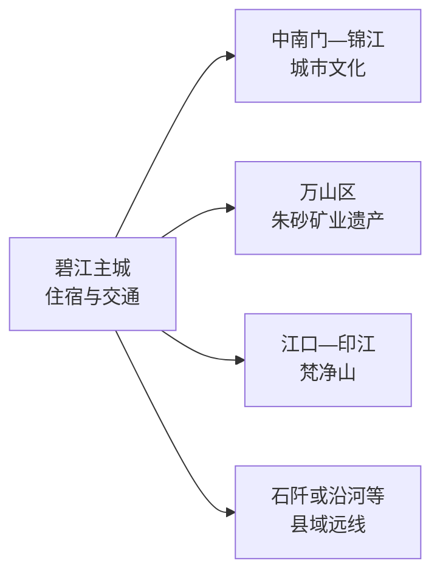
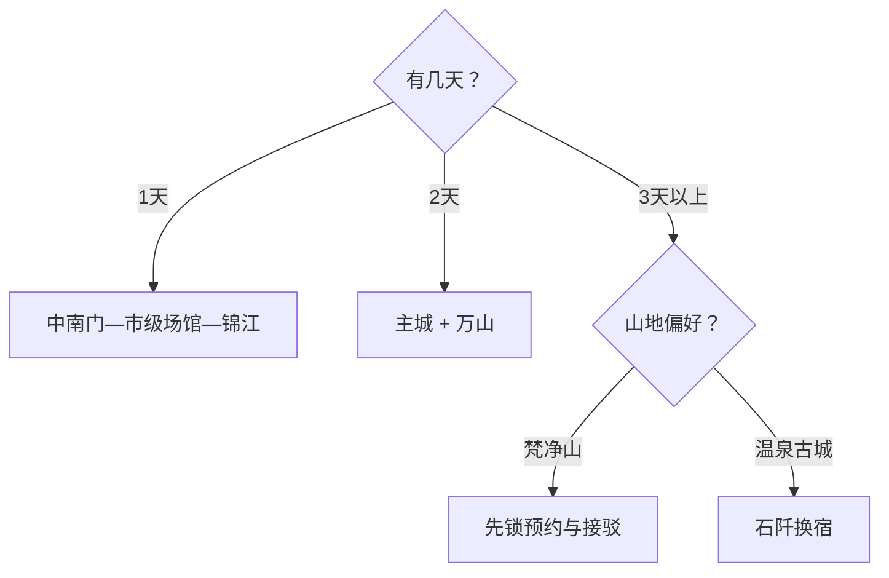

# 铜仁旅行指南

铜仁适合用“锦江主城打底，再选一个山地或矿业方向”的方式旅行。碧江区承担铁路、住宿和城市公共服务；万山区以朱砂矿业遗产为主；梵净山则在江口、印江方向，需要完整一日并提前锁定预约和接驳。

> 建议停留：主城 1 天；主城加万山 2 天；加入梵净山或石阡方向为 3–4 天 
> 旅行关键词：锦江、中南门、矿业遗产、梵净山、黔东山地 
> 无障碍说明：现代场馆可优先询问电梯、坡道和轮椅服务；古城石板路、矿洞、山地索道换乘与远县接驳的设施连续性需向官方确认

## 城市速览

| 项目 | 旅行信息 |
|---|---|
| 主要旅行价值 | 锦江城市史、中南门历史街区、万山朱砂矿业文化，以及梵净山代表的武陵山生态 |
| 建议停留 | 1–4 天；每天只安排一个远线方向 |
| 舒适季节 | 春秋适合主城和山地；夏季避开午后强对流，冬季山地关注结冰 |
| 预算特点 | 主城消费较易控制；梵净山门票、景交、索道和跨县住宿是主要增量 |
| 步行强度 | 主城中等；朱砂古镇中等偏高；梵净山高，索道可减少部分爬升，峰区仍有台阶 |
| 天气风险 | 暴雨、山洪、滑坡、雷电、低能见度和冬季结冰 |
| 独行旅行 | 主城适合独行；远线先锁定返程和住宿 |
| 亲子旅行 | 博物馆、历史街区适合半日；矿洞与高山按年龄、身高和体力取舍 |
| 长者与低体力 | 选一座场馆加一段锦江公共岸线；山地日独立安排 |
| 行前重点 | 景区实名预约、索道和景交、跨县车次、天气预警、边界开放 |

## 城市格局与游览区域

铜仁是法定地级市，代码 `520600`。旅行时把碧江主城、万山矿业方向和各县远线分开，能显著减少折返。

| 区域 | 适合安排 | 行动建议 | 时间尺度 |
|---|---|---|---|
| 碧江主城 | 中南门、锦江、城市展馆 | 住在主城，场馆与街区分段步行 | 1 天 |
| 万山方向 | 朱砂古镇、矿业文化 | 用车辆往返，先核矿洞开放和内部交通 | 1 天 |
| 梵净山方向 | 世界自然遗产、高山生态 | 预约成功后再订接驳和住宿 | 1–2 天 |
| 石阡方向 | 温泉、古城与县域文化 | 适合换宿，并与梵净山分日安排 | 1–2 天 |
| 其他县域 | 松桃、沿河、德江、思南等 | 一次选一县，以属地入口和返程组织 | 每县 1 天起 |

GeoNames `1792592` 是固定库存中的铜仁主城点；法定地级市采用 Wikidata `Q486235` 与代码 `520600`，其 `P1566=1792591` 指向行政记录。城市点用于定位，行政实体用于解释全市边界。

## 主要景点

### 主城与万山

| 景点 | 区域 | 类型 | 主要看点 | 建议用时 | 室内外 | 体力 | 预约风险 | 天气影响 | 优先级 |
|---|---|---|---|---:|---|---|---|---|---|
| 中南门历史文化旅游区 | 碧江 | 历史街区 | 府城、市井、非遗与锦江沿岸空间 | 3–5 小时 | 混合 | 中 | 中 | 中高 | A |
| 铜仁市博物馆或当期市级展馆 | 碧江 | 博物馆 | 黔东历史、民族文化与城市通识 | 2–3 小时 | 室内 | 低 | 中高 | 低 | A |
| 锦江公共岸线代表段 | 碧江 | 城市滨水 | 山水城市格局和日常生活 | 1–2 小时 | 室外 | 低至中 | 低 | 高 | B |
| 大明边城 | 碧江东侧 | 主题景区 | 明代题材展陈与地方文化演艺 | 2–4 小时 | 混合 | 中 | 高 | 中高 | B |
| 朱砂古镇及万山矿业遗产开放区 | 万山 | 工业遗产 | 朱砂采冶、矿业城市记忆和受控矿洞体验 | 4–6 小时 | 混合 | 中高 | 高 | 中高 | A |

### 县域远线

| 景点 | 区域 | 类型 | 主要看点 | 建议用时 | 室内外 | 体力 | 预约风险 | 天气影响 | 优先级 |
|---|---|---|---|---:|---|---|---|---|---|
| 梵净山旅游区 | 江口—印江 | 世界自然遗产、山岳 | 武陵山生态、峰林与高山步道 | 1 天 | 室外 | 高 | 很高 | 很高 | A |
| 石阡古温泉或属地正式温泉区 | 石阡 | 温泉、历史 | 温泉文化与县城休息 | 半日至 1 天 | 混合 | 低至中 | 高 | 中 | B |
| 佛顶山正式开放入口 | 石阡 | 山地生态 | 森林与自然教育 | 1 天 | 室外 | 高 | 高 | 很高 | C |

梵净山按一个完整山岳景区计数，索道、红云金顶、蘑菇石和内部步道不拆成多个景点。朱砂古镇的矿洞、博物馆和街区也按同一运营单元理解。

## 美食与餐饮

| 类型 | 怎么点 | 份量与过敏原 | 选择建议 |
|---|---|---|---|
| 社饭、米豆腐与粉面 | 独行可点一份主食加小菜 | 可能含猪油、腊肉、花生、大豆和辣椒 | 早餐在住宿地附近解决，先问汤底和辣度 |
| 锅巴粉、绿豆粉 | 一碗一份 | 酱料可能含大豆、小麦和花生 | 选择现煮、配料说明清楚的店 |
| 酸汤与地方火锅 | 2–4 人分享更合适 | 注意发酵汤底、鱼类、牛肉、辣椒和共锅接触 | 先问锅底、食材重量和单价 |
| 江口、石阡等县域菜 | 到属地后按当日菜单点 | 腊味、豆制品、野菜名称需确认实际原料 | 把用餐放在既定县域，选择位置顺路的同类餐馆 |

## 经典行程

### 一日经典路线

**路线**：市级场馆 → 中南门历史文化旅游区 → 午餐 → 锦江公共岸线代表段

- **串联逻辑**：先用展陈建立背景，再进入街区和江岸观察城市。
- **预约锚点**：市级场馆开放和中南门当期活动。
- **休息安排**：午餐和傍晚都留在中南门或锦江商圈。
- **时间不足时**：保留场馆与中南门，江岸只走一小段。

### 两日城市路线

**第 1 天**：主城经典路线 
**第 2 天**：主城 → 朱砂古镇 → 主城或万山住宿

- **串联逻辑**：第一天看府城，第二天看矿业城市形成。
- **预约锚点**：朱砂古镇矿洞、景交和演出。
- **休息安排**：矿洞前后在游客服务区休息。
- **时间不足时**：第二天只保留矿业核心展陈。

### 三日深度路线

**第 1 天**：碧江主城 
**第 2 天**：万山矿业遗产 
**第 3 天**：梵净山或石阡二选一

- **串联逻辑**：城市、工业遗产和山地县域各占一天。
- **预约锚点**：第三天景区实名票、接驳和住宿。
- **休息安排**：第三天按景区服务点分段休息。
- **时间不足时**：删除第三天，保持前两天完整。

### 雨天路线

**路线**：市级场馆 → 中南门室内展陈 → 商圈用餐

- **适用条件**：普通降雨且城市道路正常。
- **串联逻辑**：集中在碧江主城，减少山路和临水暴露。
- **预约锚点**：场馆和室内项目开放。
- **休息安排**：每个室内点之间留出交通缓冲。
- **时间不足时**：只保留一座场馆和一顿地方餐。

### 亲子或低体力路线

**亲子路线**：市级场馆 → 中南门短段 → 锦江平缓公共岸线 
**低体力路线**：车辆到场馆 → 午休 → 中南门单一入口短游

- **减负方式**：大型景区独立成日，街区只走一条主线。
- **预约锚点**：场馆电梯、轮椅、亲子服务和朱砂古镇年龄限制。
- **休息安排**：主城商圈和正式游客中心。
- **时间不足时**：保留场馆，取消临水和登高段。

### 远郊路线

**路线**：梵净山与石阡二选一，并在入口所在县域住宿

- **适用条件**：已获得预约、交通和住宿确认。
- **串联逻辑**：一个远线只服务一个核心目的地。
- **预约锚点**：实名票、景交、索道或温泉时段。
- **休息安排**：游客中心、索道站或县城住宿点。
- **时间不足时**：整段取消，改为主城加万山。

## 住宿区域

| 区域 | 优点 | 取舍 | 适合人群 |
|---|---|---|---|
| 碧江主城 | 铁路、餐饮和跨县交通集中 | 去远线仍需早起 | 首访、短住、公共交通旅行 |
| 万山 | 便于矿业遗产深度游 | 夜间选择少于主城 | 摄影、工业遗产主题 |
| 江口或梵净山入口 | 便于清晨入山 | 受景区价格和季节影响 | 已预约梵净山者 |
| 石阡县城 | 温泉与县域休息方便 | 与梵净山方向不同 | 温泉、慢旅行 |

## 市内交通

- 铜仁站、铜仁南站服务范围不同，按票面站名选择住宿和接驳。
- 主城以公交、出租车和网约车分段；去万山和各县先核客运、景区直通车或合规包车。
- 梵净山入口与县城、铁路站不是同一点，把末段接驳和返程班次写进预约计划。
- 山区自驾按天气、道路管制和司机休息控制每日距离。

## 不同旅行者须知

| 情况 | 怎么安排 | 重点核对 |
|---|---|---|
| 独行 | 住碧江，远线跟随正式班次 | 末班、叫车范围、夜间到店 |
| 亲子 | 场馆和街区为主，矿洞与山地独立评估 | 年龄身高、护栏、索道、卫生间 |
| 长者与低体力 | 一天一处大型目的地，车辆分段 | 电梯、落客点、台阶和中途退出 |
| 边境与民族文化摄影 | 先征得人物、住宅和仪式拍摄同意 | 无人机、文保、社区和商业拍摄规则 |
| 山地旅行 | 随身带雨具、保暖层和补水 | 雷电、强降雨、结冰、索道停运 |

安全、法律与保护边界：梵净山自然遗产地只走开放步道；矿洞只参加运营方开放项目；河道、水库、生产矿区、施工路段和地质灾害封控区按管理要求活动。

## 行前核对

| 项目 | 何时核对 | 官方入口 |
|---|---|---|
| 中南门、万山景区开放 | 订房前及出发前一日 | [铜仁旅游频道](https://www.tongren.gov.cn/tourism_column/) |
| 梵净山票务、索道与天气 | 购票前、出发前三日及当天 | 景区官方渠道、贵州文旅和气象预警 |
| 铁路与跨县交通 | 购票时及出发前一日 | [中国铁路 12306](https://www.12306.cn/)及属地交通部门 |
| 暴雨、山洪、滑坡和结冰 | 出发前三日起每日 | [中国气象局](https://www.cma.gov.cn/)及铜仁应急信息 |
| 无障碍条件 | 预约时 | 场馆或景区游客服务中心 |

## 来源与更新记录

| 来源 | 支持内容 | 核验日期 |
|---|---|---|
| [铜仁市政府](https://www.tongren.gov.cn/) | 市情、公共服务与动态入口 | 2026-08-13 |
| [铜仁市 2026 年文旅资料](https://www.tongren.gov.cn/2026/0619/349645.shtml) | 中南门、大明边城及当期文旅活动 | 2026-08-13 |
| [贵州省政府定价景区价格清单（2026 版）](https://fgw.guizhou.gov.cn/zwgk/zdlyxx/jffw/jyfwxsfml/202601/t20260121_89414284.html) | 景区门票与内部交通价格的官方核对入口 | 2026-08-13 |
| [民政部行政区划代码查询](https://dmfw.mca.gov.cn/xzqh/getList?code=52&trimCode=true&maxLevel=3) | `520600` 及所辖县区层级 | 2026-08-13 |
| [GeoNames 1792592](https://www.geonames.org/1792592/tongren.html) | 固定主城点 | 2026-08-13 |
| [Wikidata Q486235](https://www.wikidata.org/wiki/Q486235) | 法定地级市实体与 `P1566=1792591` | 2026-08-13 |

| 日期 | 更新 |
|---|---|
| 2026-08-13 | 首次完成铜仁市指南；建立碧江、万山、梵净山和石阡分层，补充路线、交通、天气、保护地与标识粒度。 |
