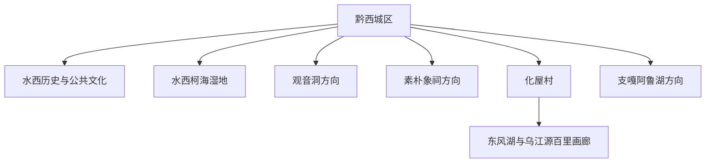
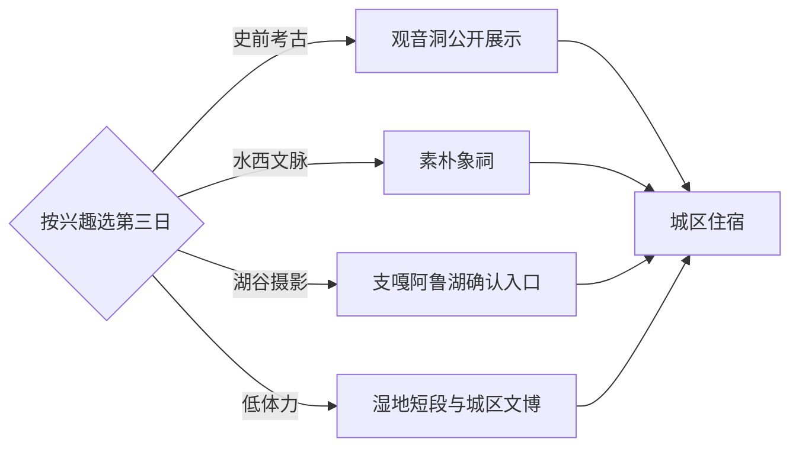

# 黔西旅行指南

黔西位于乌蒙高原东部，旅行主线由水西历史、史前遗址、城市湿地和乌江源高峡平湖组成。城区适合安排城市文脉与餐饮，化屋—东风湖需要完整一日；支嘎阿鲁湖及其他远点按道路、运营和行政边界另行选择。固定快照中的 **Zhongshan / GeoNames 1784317** 位于现行黔西市钟山镇，页面按法定县级黔西市组织完整旅行范围。

> 建议停留：2–3 天  
> 旅行关键词：乌江源、水西文化、喀斯特湖谷  
> 主要体力：中等步行与山地公路移动  
> 最近研究：2026-09-03

## 城市速览

| 项目 | 旅行信息 |
|---|---|
| 主要旅行价值 | 从城区水西文脉延伸到化屋苗寨、东风湖和乌江源高峡平湖 |
| 建议停留 | 2 天覆盖城区与化屋；3 天可加入观音洞、象祠或另一处湖区方向 |
| 较舒适季节 | 春秋适合城市与湖谷组合；夏季较凉爽，同时关注强降雨、低云和山路能见度 |
| 预算特点 | 中等；化屋方向车辆、游船和远线住宿是主要增量 |
| 步行强度 | 中等；城区可分段步行，湖谷路线以山路接驳、观景台和码头步行为主 |
| 主要天气风险 | 暴雨、山洪、滑坡、低能见度、临水大风和冬季凝冻 |
| 独行旅行 | 城区与高铁抵离方便，远线适合预约正规车辆或成熟产品 |
| 亲子旅行 | 湿地、城市公共文化和正规游船较易安排，临崖观景与码头加强陪护 |
| 长者与低体力旅行 | 选择城区、湿地短段和车辆直达观景台，游船上下客设施逐项确认 |
| 无障碍信息 | 城区新建公共空间相对友好，古遗址、村寨和山地码头连续性需向运营方确认 |

## 城市格局与游览区域

黔西城区以水西、莲城、文峰等街道为主要住宿与生活区，高铁站承担跨城抵离。水西柯海湿地和城市公共文化空间可组成半日至一日。化屋村位于黔西市南部东风湖一带，公路进入峡谷后弯急坡长，适合独立安排；观音洞、素朴象祠及其他乡镇点位分散，按单一主题选一天更稳妥。

| 区域 | 主要内容 | 游览特点 | 与其他区域的关系 |
|---|---|---|---|
| 黔西城区 | 水西古城主题空间、公共文化、地方餐饮 | 补给方便，可分段步行 | 与水西柯海湿地组合成一日 |
| 水西柯海方向 | 城市湿地与水域景观 | 适合慢行、观鸟和低强度休整 | 可放在抵达日或城区日后半段 |
| 观音洞方向 | 史前遗址与考古主题 | 以保护、展示和当期开放为前提 | 适合与城区文博组成历史日 |
| 素朴方向 | 象祠、水西历史与乡镇文化 | 点位分散，以公路接驳为主 | 与化屋分日更舒适 |
| 化屋—东风湖 | 苗寨、峡谷、乌江源和正规游船 | 山路和水上活动占比高 | 独立一日，尽量白天往返 |
| 其他湖区远线 | 支嘎阿鲁湖等 | 行程受入口、道路和运营影响 | 确认属地入口后再替换第三日 |

百里杜鹃管理区拥有独立管理边界，花期游览按其官方入口和交通另行安排；本页聚焦黔西市法定范围内的城市与乡镇旅行。

## 主要景点

优先级用于安排时间：**A** 为首访核心，**B** 为按兴趣补充，**C** 为远线、季节性或开放条件更强的目的地。

| 景点 | 区域 | 类型 | 主要看点 | 建议用时 | 室内外 | 体力 | 预约风险 | 天气影响 | 优先级 |
|---|---|---|---|---:|---|---|---|---|---|
| 乌江源百里画廊化屋段 | 化屋—东风湖 | 峡谷与湖泊 | 两源汇流、高峡平湖、喀斯特崖壁 | 5–8 小时 | 室外 | 中 | 中高 | 高 | A |
| 化屋村公共游览区 | 化屋—东风湖 | 村寨与非遗 | 苗寨生活、多声部民歌与苗绣语境 | 2–4 小时 | 混合 | 中 | 中 | 高 | A |
| 东风湖正规游船 | 化屋码头 | 水上游览 | 从水面观察峡谷、崖壁和鸭池河大桥 | 1–2 小时 | 室外 | 中 | 高 | 高 | A |
| 水西柯海国家湿地公园公开区 | 城区方向 | 湿地与城市生态 | 湖面、湿地植被、慢行与观鸟 | 2–4 小时 | 室外 | 低中 | 低 | 中高 | A |
| 水西古城主题公共空间 | 城区 | 历史与城市 | 水西文化线索、城市休闲和夜间餐饮 | 2–3 小时 | 混合 | 低 | 低 | 中 | B |
| 黔西公共文化场馆 | 城区 | 文博与展览 | 地方历史、非遗与城市发展 | 1.5–3 小时 | 室内 | 低 | 中 | 低 | B |
| 观音洞遗址相关公开展示 | 观音洞方向 | 考古与遗址 | 史前人类活动与考古价值 | 2–4 小时 | 混合 | 中 | 高 | 中 | B |
| 素朴象祠公开参观点 | 素朴方向 | 历史与建筑 | 《象祠记》相关历史和地方文化 | 2–3 小时 | 混合 | 中 | 中 | 中 | B |
| 明代古驿道公开段 | 市域乡镇 | 历史道路 | 奢香开驿与西南交通史 | 半天 | 室外 | 中高 | 高 | 高 | C |
| 支嘎阿鲁湖确认开放入口 | 市域远线 | 湖泊与山地 | 高原湖谷和山地景观 | 5–8 小时 | 室外 | 中 | 高 | 高 | C |

观音洞等遗址以获批开放区和讲解动线为准，考古作业区与保护范围保留明确限制；湖库游览选择持证运营船只，码头停航后采用陆上公开观景点调整行程。

## 美食与餐饮

城区适合集中寻找黄粑、牛肉粉、糍粑包豆腐和毕节风味家常菜。化屋一日可在确认接待的村寨餐饮解决午餐，点单时先问份量、辣度和返程时间；节庆体验以社区公开活动为入口，拍摄人物和工艺过程先征得同意。

| 菜品或餐饮类型 | 常见区域 | 一个人用餐与常见份量 | 风味、过敏原与饮食限制 | 排队风险与替代方法 |
|---|---|---|---|---|
| 黔西黄粑 | 城区市场与小吃店 | 单份友好，适合作早餐或加餐 | 糯米与甜味为主，可询问是否含猪油 | 选择当天制作、标价清晰的同类店 |
| 牛肉粉 | 城区 | 一人份友好 | 汤底、辣椒和香菜可分开确认 | 早餐高峰后错峰 |
| 糍粑包豆腐 | 城区与乡镇 | 适合现做现吃 | 豆制品、辣椒和折耳根按口味选择 | 排队时改选烙锅或其他小吃 |
| 毕节烙锅 | 城区餐饮区 | 多人共享更丰富，独行可选小份 | 油、辣椒、花生或芝麻蘸料需确认 | 按食材新鲜和明码标价选择 |
| 苗寨家常菜 | 化屋确认接待点 | 通常适合共享 | 腊肉、酸汤、辣度与过敏原提前沟通 | 提前预约或自备便携午餐 |

## 经典行程

### 一日经典路线

**路线**：水西古城主题公共空间 → 黔西公共文化场馆 → 水西柯海湿地 → 城区晚餐。

- **串联逻辑**：一天留在城区及近郊，以历史、城市生态和地方饮食建立黔西框架。
- **预约锚点**：公共文化场馆开放时段。
- **休息安排**：城区餐饮区和湿地服务点。
- **时间不足时**：保留水西主题空间与湿地，场馆按闭馆日调整。

### 两日城市路线

**第 1 天**：城区水西文化 → 水西柯海湿地。  
**第 2 天**：化屋村 → 东风湖正规游船 → 乌江源陆上观景点。

- **串联逻辑**：第一天完成城市线，第二天整日进入乌江源峡谷，减少来回切换。
- **预约锚点**：第二日车辆、码头游船和天气。
- **休息安排**：化屋村确认接待的餐饮与游客服务点。
- **时间不足时**：第二日保留化屋与一个陆上观景点，游船按运营状况取舍。

### 三日深度路线

**第 1 天**：城区公共文化 → 水西柯海湿地。  
**第 2 天**：化屋—东风湖全天。  
**第 3 天**：观音洞公开展示 → 素朴象祠或一段确认开放的古驿道。

- **串联逻辑**：城市生态、乌江山水和史前—水西历史各占一天，主题清晰且体力递进。
- **预约锚点**：化屋车辆与游船、遗址和象祠开放。
- **休息安排**：每天回城区连续住宿，第三日选择乡镇正规餐饮。
- **时间不足时**：两天时删除第三日；对考古兴趣更高时用第三日替换城区半日。

### 雨天路线

**路线**：黔西公共文化场馆 → 城区餐饮 → 水西主题室内空间 → 近住宿地短段散步。

- **适用条件**：普通降雨且城区道路正常时采用；暴雨、地灾或凝冻预警时减少移动并跟随交通管控。
- **预约锚点**：场馆与室内空间开放。
- **休息安排**：城区室内连续活动。
- **时间不足时**：保留一座场馆和一餐地方风味。

### 亲子或低体力路线

**亲子路线**：公共文化场馆 → 水西柯海湿地短段 → 城区小吃。  
**低体力路线**：车辆到达水西主题空间 → 公共文化场馆 → 湿地平缓入口短段。

- **减负方式**：亲子线把自然观察控制在可随时折返的步道；低体力线减少跨区，逐点确认落客、座椅和卫生间。
- **预约锚点**：场馆、湿地无障碍入口与停车位置。
- **休息安排**：场馆大厅、城区餐饮和湿地服务点。
- **时间不足时**：两条路线都保留场馆，湿地缩短为一个入口段。

### 化屋与乌江源一日路线

**路线**：黔西城区 → 花都里一带公开观景点 → 化屋村 → 正规游船或码头观景 → 返回城区。

- **适用条件**：天气稳定、山路正常并已锁定白天返程车辆时执行。
- **预约锚点**：车辆、游船、码头运营和活动接待。
- **休息安排**：化屋村游客服务点和确认营业的餐饮。
- **时间不足时**：保留化屋村与陆上观景，游船整段删除。

### 历史文化一日路线

**路线**：黔西城区 → 观音洞相关公开展示 → 素朴象祠 → 返回城区。

- **适用条件**：两处均确认开放且有正规车辆时执行；优先选择更感兴趣的一处深度参观。
- **预约锚点**：遗址开放范围、讲解与象祠接待。
- **休息安排**：城区早餐、乡镇午餐和返城晚餐。
- **时间不足时**：保留观音洞或象祠其中一处，另一处改为下次行程。

## 住宿区域

| 区域 | 优点 | 缺点 | 适合人群 | 交通特点 |
|---|---|---|---|---|
| 黔西城区 | 餐饮、补给、场馆和车辆选择集中 | 去化屋仍需较长山路 | 首访、多日旅行、公共交通使用者 | 适合统一住宿并每日选择一个方向 |
| 黔西高铁站接驳区 | 抵离便利，适合晚到早走 | 城市体验与餐饮密度需具体比较 | 紧凑行程和高铁联程 | 订房时确认到城区和次日包车上车点 |
| 化屋村正规住宿 | 便于看早晚峡谷与村寨生活 | 山路、夜间医疗与补给选择较少 | 摄影、慢旅行和乌江源深度游 | 选择有正式接待、消防和退改信息的住宿 |
| 水西主题城区片区 | 晚间餐饮和城市散步方便 | 节庆时段可能嘈杂 | 美食与城市文化旅行者 | 可步行或短途车辆连接部分城区节点 |

## 市内交通

| 场景 | 建议与取舍 | 行前需要重查的内容 |
|---|---|---|
| 从高铁站抵达 | 出站后用公交、出租车或网约车前往城区住宿 | 到站接驳、末班时间与正规上车区 |
| 城区移动 | 公交和短途车辆连接湿地、场馆与餐饮区 | 线路调整、施工和场馆落客点 |
| 前往化屋 | 包车、自驾或当期成熟旅游交通更适合山路 | 道路、返程、停车、游船与天气 |
| 前往乡镇遗址 | 每天选一个主题方向，车辆往返留出余量 | 开放、讲解、路况和手机信号 |
| 自驾 | 白天进入峡谷，弯急坡陡路段采用稳妥速度 | 暴雨、滑坡、雾、凝冻、充电与停车 |

## 不同旅行者须知

| 旅行维度 | 可行条件 | 主要取舍 | 需额外核对 |
|---|---|---|---|
| 独行旅行 | 城区住两晚并预订化屋往返交通 | 偏远点临时返程选择较少 | 司机资质、返程时间和信号 |
| 亲子旅行 | 选择湿地、场馆与正规游船 | 码头、临水和临崖空间增加看护需求 | 救生衣、儿童票与护栏 |
| 长者或低体力旅行 | 车辆直达公开观景点并缩短村寨步行 | 上下船、坡道和古驿道路面较费力 | 码头台阶、落客位置和卫生间 |
| 无障碍需求 | 以城区新建公共空间为主 | 遗址、村寨和山地码头设施连续性有限 | 入口坡度、电梯和陪同规则 |
| 摄影旅行 | 化屋陆上观景和城区湿地题材互补 | 低云、逆光和山路时间影响机位 | 无人机、三脚架与商业拍摄规则 |
| 预算有限 | 城区住宿加湿地、公共文化和一条远线 | 包车与游船抬高单人成本 | 拼车产品资质、票价和退改 |
| 晚出发或紧凑行程 | 保留城区水西主题与湿地 | 化屋需要完整白天 | 最晚入场、日落与返程 |
| 特殊天气或自然条件 | 预警前把远线改为城区室内活动 | 暴雨、雾和凝冻会改变山路与水上运营 | 气象、地灾、公路和码头公告 |

## 行前核对

| 核对事项 | 为什么需要重查 | 建议核对时间 | 官方入口 |
|---|---|---|---|
| 化屋与乌江源运营 | 游船、活动、码头和观景点接待会调整 | 预约前及到访前一日 | [黔西市人民政府](https://www.gzqianxi.gov.cn/) |
| 公共场馆与遗址 | 开放范围、讲解和闭馆日可能变化 | 确定日期后 | [毕节市人民政府](https://www.bijie.gov.cn/) |
| 铁路与道路交通 | 班次、施工、山路和接驳随时段变化 | 出发前一周及当天 | [中国铁路 12306](https://www.12306.cn/)、[贵州省交通运输厅](https://jt.guizhou.gov.cn/cxfw_0/) |
| 天气与地质风险 | 暴雨、滑坡、低能见度和凝冻直接影响远线 | 出发前三日及当天 | [贵州省气象局](https://gz.cma.gov.cn/)、[贵州省自然资源厅](https://zrzy.guizhou.gov.cn/) |
| 跨边界联程 | 百里杜鹃等相邻管理区域使用独立票务和交通 | 加入行程前 | [贵州省文化和旅游厅](https://whhly.guizhou.gov.cn/) |

## 来源与更新记录

### 主要来源

| 来源 | 类型 | 支持内容 | 核验日期 |
|---|---|---|---|
| [新华网：黔西城市文旅概览](https://www.news.cn/travel/20260116/bd32cab0def54dc78d195f2e38c6c26d/c.html) | 中央新闻机构与市政府访谈 | 湖区、湿地、史前遗址、水西文化、非遗与地方风味 | 2026-09-03 |
| [贵州省人大：乌江源百里画廊](https://www.gzrd.gov.cn/gzwh/202508/t20250808_88432765.html) | 省级机关转载 | 化屋、东风湖、陆上观景、公路与正规游船空间关系 | 2026-09-03 |
| [贵州省自然资源厅地灾工作提示](https://zrzy.guizhou.gov.cn/wzgb/zwgk/zfxxgk/fdzdgknr/qtfdxx/yjgl/202308/P020231207604587579799.pdf) | 省级主管部门 | 钟山镇属黔西市及暴雨地质风险背景 | 2026-09-03 |
| [贵州省民政厅：黔西撤县设市通告](https://mzt.guizhou.gov.cn/xwzx/sxxx/202105/t20210508_68021660.html) | 省级主管部门 | 县级黔西市、行政代码与原行政区域承接 | 2026-09-03 |
| [GeoNames 1784317](https://www.geonames.org/1784317/) | 固定开放数据 | Zhongshan 人口点与本页定位锚点 | 2026-09-03 |

### 更新记录

| 日期 | 更新内容 |
|---|---|
| 2026-09-03 | 首次完成黔西县级市映射、资料研究与路线整理 |
