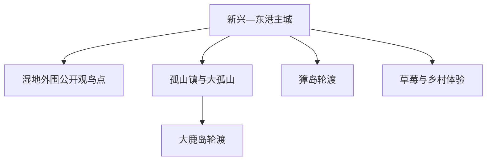
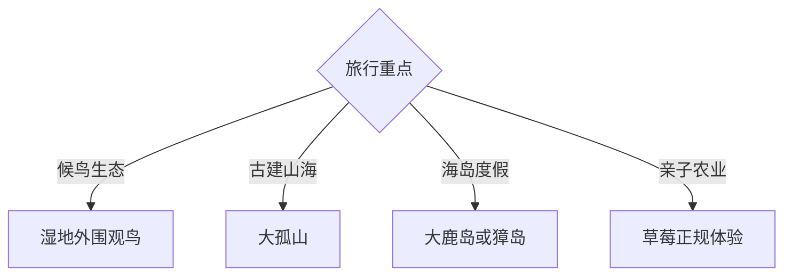

# 东港旅行指南

东港位于鸭绿江入海口和北黄海沿岸，候鸟湿地、海岛渔村、大孤山古建、海鲜与草莓农业构成旅行主线。固定快照中的 **Xinxing / GeoNames 1814470** 对应新兴街道一带；主城、湿地、大鹿岛、獐岛和大孤山分布在长海岸线上，海岛需按船期独立安排。

## 城市速览

| 项目 | 信息 |
|---|---|
| 主线 | 主城—鸭绿江口湿地—大孤山—大鹿岛或獐岛 |
| 停留 | 陆地线 1–2 天；每个海岛另留 1–2 天并预留天气机动 |
| 住宿 | 东港主城便于交通餐饮；孤山镇与海岛住宿适合早船和日落 |
| 交通 | 高铁、公路、港口与轮渡组合，海岛行程由船期和海况决定 |
| 季节 | 春秋候鸟、夏季海岛；台风、浓雾、大风和潮汐需要动态核对 |
| 预算 | 海鲜丰俭由人，轮渡、岛上住宿和跨点车辆是主要增量成本 |

## 城市格局与游览区域

主城是高铁、住宿和海鲜餐饮基地；鸭绿江口湿地沿海岸分布，观鸟应使用官方开放的外围点位。大孤山与大鹿岛可围绕孤山镇组织，獐岛从相应码头进出。自然保护区核心区、养殖生产区、港口作业区、军事与边境水域依法律和现场边界管理。

## 主要景点

| 景点 | 区域 | 类型 | 核心体验 | 用时 | 环境 | 体力 | 研究价值 | 拥挤 | 优先级 |
|---|---|---|---|---:|---|---|---|---|---|
| 鸭绿江口湿地外围公开观鸟点 | 沿海湿地 | 国家级保护区外围 | 候鸟迁徙、潮滩生态与河海交汇 | 半天 | 室外 | 低中 | 很高 | 鸟季中高 | A |
| 大孤山古建筑群依法开放区 | 孤山镇 | 古建与山地 | 辽东古建、山海视野与地方信仰 | 半天 | 混合 | 中高 | 很高 | 节假日中 | A |
| 大鹿岛景区 | 孤山镇外海 | 海岛与历史 | 海岸、渔村、甲午海战记忆与度假 | 1–2天 | 室外 | 中 | 高 | 夏季高 | A |
| 獐岛景区 | 北井子方向外海 | 海岛与渔村 | 海岛生活、海鲜、海岸与潮汐 | 1–2天 | 室外 | 中 | 高 | 夏季高 | A |
| 东港地方文博或公共文化场馆 | 主城区 | 博物馆 | 河海城市史、边贸与农业渔业 | 2–3小时 | 室内 | 低 | 高 | 低 | B |
| 北黄海温泉正规经营区 | 海岸方向 | 温泉 | 海水温泉与滨海休息 | 半天 | 室内 | 低 | 中 | 周末中 | B |
| 草莓现代农业正规体验点 | 市域乡村 | 农业与乡村 | 温室种植、品牌农业与季节采摘 | 2–3小时 | 室内外 | 低 | 高 | 采摘季中 | B |

## 美食与餐饮

东港以黄蚬子、梭子蟹、海鱼、虾贝和草莓最具辨识度。主城适合比较价格和按份点餐，海岛餐饮提前确认计价方式、份量与加工费。海鲜过敏者明确说明接触风险；赶海和自采海产按照开放区域、潮汐与食品安全提示进行。

## 经典行程

### 陆地经典线
**路线**：主城文博—午餐—湿地外围公开观鸟点—海鲜晚餐。**逻辑**：从城市背景进入河海生态。**预约锚点**：观鸟点开放与潮汐。**休息**：主城区。**删除条件**：大风、浓雾或保护调整时保留文博。

### 大孤山一日线
**路线**：主城—孤山镇—大孤山依法开放区—镇区晚餐或返程。**逻辑**：把古建与辽东山海景观放在完整半天。**预约锚点**：景区开放和车辆。**休息**：孤山镇。**删除条件**：雨雪结冰时缩短山路。

### 大鹿岛海岛线
**路线**：孤山镇方向码头—轮渡—大鹿岛—住岛或按船期返程。**逻辑**：轮渡决定整日节奏。**预约锚点**：往返船票、住宿和天气。**休息**：岛上正规经营区。**删除条件**：停航时改大孤山陆地线。

### 獐岛海岛线
**路线**：对应码头—轮渡—獐岛渔村与公开海岸—住岛或返程。**逻辑**：以单岛慢游降低赶船风险。**预约锚点**：船期、住宿与潮汐。**休息**：岛上正规经营区。**删除条件**：停航时改主城与湿地线。

### 候鸟观测线
**路线**：主城—官方开放观鸟点—潮间带外围观察—返程。**逻辑**：围绕潮汐窗口和迁徙季组织。**预约锚点**：鸟讯、潮汐与管护公告。**休息**：游客服务点。**删除条件**：封护、大雾或风力过大时改文博。

### 亲子低体力线
**路线**：地方展陈—正规草莓体验—主城海鲜或非海鲜餐。**逻辑**：室内外切换，步行短且反馈直观。**预约锚点**：采摘季和儿童规则。**休息**：主城。**删除条件**：非采摘季改公共文化场馆。

### 三日山海组合线
**路线**：首日主城与湿地；次日大孤山；第三日大鹿岛或獐岛二选一。**逻辑**：陆地与单个海岛分日。**预约锚点**：第三日船期与住宿。**休息**：主城或孤山镇。**删除条件**：海况变化时取消海岛并增加陆地机动日。

## 住宿区域

东港主城适合高铁抵达、餐饮和湿地陆地线；孤山镇方便大孤山与大鹿岛早船；海岛正规住宿适合日落和渔村体验。海岛订房核对轮渡接送、消防、热水、退改和停航后的处理方式。

## 市内交通

丹东机场通常经丹东市区衔接，东港北站承担高铁出行；公路与地方客运连接孤山及沿海乡镇。海岛轮渡以港口公告为准，预留往返缓冲。自驾在海岸、港区和村镇道路关注停车、潮汐淹水与作业车辆。

## 不同旅行者须知

观鸟者使用望远镜和长焦，保持安静与保护距离；亲子家庭把海岛与赶海放在天气稳定日；长者优先主城、温泉和低坡观鸟点；海鲜过敏者提前规划替代餐。保护区核心区、封滩育护区、养殖设施、港池航道、边境水域与非开放岛礁保留明确限制。

## 行前核对

- 核对候鸟季、潮汐、保护区开放点与现场管护要求。
- 核对大鹿岛、獐岛船期、实名购票、行李和停航退改。
- 核对大孤山、温泉、地方场馆与农业体验营业。
- 核对台风、大风、浓雾、雷雨、海浪和海冰预警。

## 来源与更新记录

| 来源 | 支持内容 | 核验日期 |
|---|---|---|
| [辽宁省文旅厅：东港市大鹿岛景区](https://whly.ln.gov.cn/whly/wlzt/sjly/ajjq/2025120115345033432/index.shtml) | 大鹿岛位置、海岸、历史与景区属性 | 2026-09-03 |
| [辽宁省生态环境厅：鸭绿江口湿地保护区](https://sthj.ln.gov.cn/sthj/hjgl/stbh/A35E44575EBD41E3A7C786FAA5064B4A/index.shtml) | 湿地范围、生态类型、保护对象与边界 | 2026-09-03 |
| [辽宁省政府：东港全域旅游示范区](https://www.ln.gov.cn/web/qmzx/lnsqmzxxtpsnxd/lnzxd/bm/2023122209190492309/index.shtml) | 大孤山、大鹿岛、獐岛、温泉与区域旅游结构 | 2026-09-03 |
| [GeoNames 1814470](https://www.geonames.org/1814470/) | Xinxing 固定人口点与东港主城位置 | 2026-09-03 |

