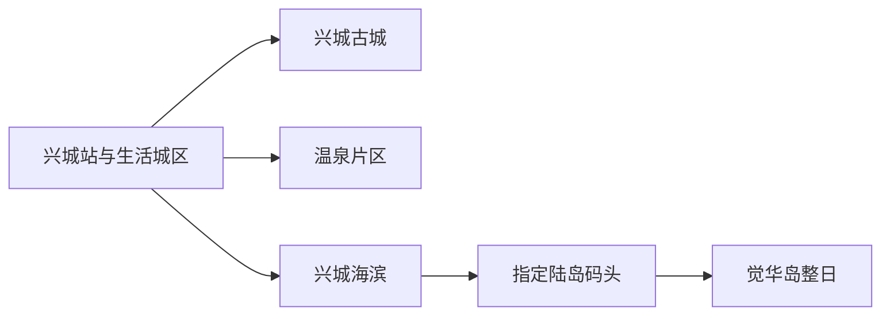
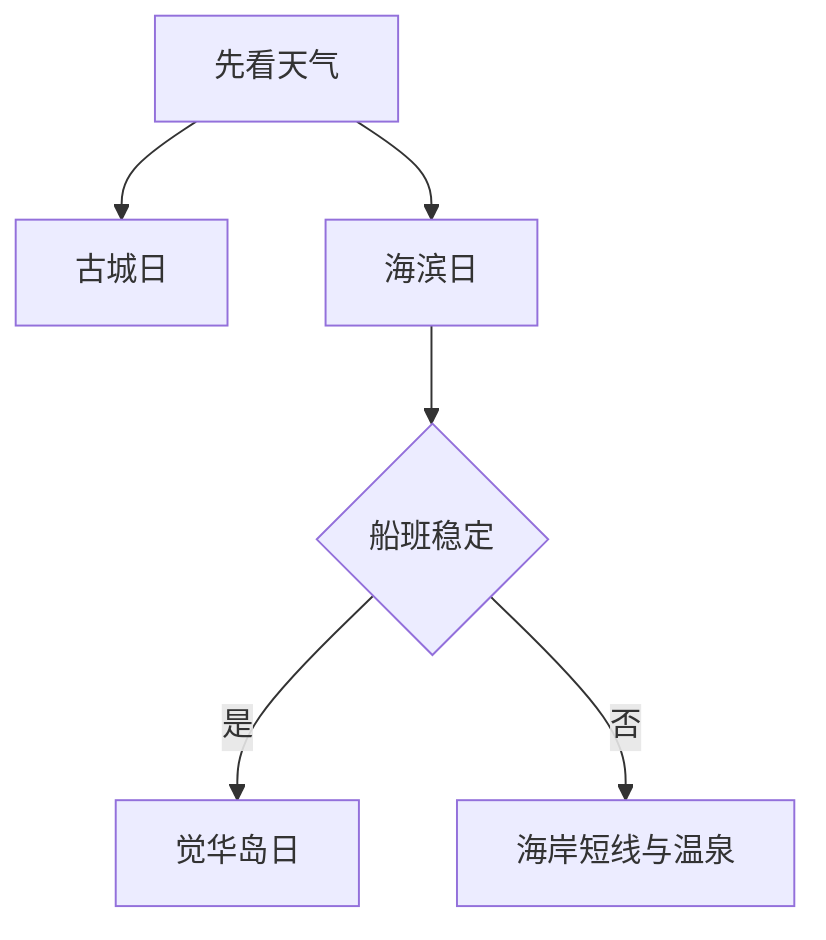

# 兴城旅行指南

兴城把明代古城、温泉、海滨与觉华岛放在一座县级市里，但四者并非连续步行区。最稳妥的安排是古城与城市生活一天、海滨一天；觉华岛依据船班与风浪另留完整一天。温泉选择以持证运营和清晰水质、票制信息为准。

> 建议停留：古城与海滨 2 天；觉华岛另留 1 天
> 关键词：宁远古城、兴城海滨、觉华岛、温泉、辽西走廊
> 体力：古城中等，海滨低至中等，海岛中至高
> 最近研究：2026-08-13

## 城市速览
| 项目 | 旅行信息 |
|---|---|
| 价值 | 同城对照明代卫城、辽西海岸、海岛与温泉生活 |
| 停留 | 2天古城海滨，3天加海岛 |
| 交通 | 兴城站、兴城西站及道路交通，岛线使用指定码头 |
| 季节 | 夏季海滨旺季，冬季低温；船班受风浪海雾影响 |
| 预算 | 古城公共街巷较省，岛船与旺季住宿增加支出 |
| 步行 | 古城石路、海滨栈道和海岛坡路分日处理 |
| 无障碍 | 古城与海岛连续性有限，海滨部分公共段较平缓；设施连续性需向官方确认 |
| 亲子 | 正式浴场、古城短线与合规船线可选 |
| 水域 | 只在开放浴场和救生时段下水 |
| 核心 | 核古城开放、浴场水质、船班、天气与返程 |

## 城市格局与游览区域
兴城市法定代码 `211481`，由葫芦岛市代管；GeoNames `2033766` 与 Wikidata `Q1375638` 的 `P1566` 精确对应。

| 区域 | 重点 | 安排 | 条件 |
|---|---|---|---|
| 古城 | 城墙、街巷、历史建筑 | 半日至1天 | 内部场馆与城墙时段 |
| 生活城区/温泉 | 餐饮、住宿、持证温泉 | 抵达或晚间 | 运营资质与健康规则 |
| 海滨 | 正式浴场、栈道、海岸 | 半日至1天 | 水质、救生、天气 |
| 觉华岛 | 海岛自然与历史遗存 | 独立整日或住一晚 | 船班、风浪、返航 |

## 主要景点
| 名称 | 区域 | 类型 | 价值 | 时长 | 室内外 | 体力 | 无障碍 | 预约 | 优先级 |
|---|---|---|---|---:|---|---|---|---|---|
| 兴城古城景区 | 古城 | 古城、文保 | 明代卫城格局与辽西历史 | 4–7小时 | 混合 | 中 | 低至中 | 建议 | A |
| 古城城墙当期开放段 | 古城 | 城防、观景 | 从城防尺度理解宁远卫 | 1–2小时 | 室外 | 中至高 | 低 | 先核 | A |
| 古城内部开放场馆 | 古城 | 文博、建筑 | 补充地方史与街区生活 | 1–3小时 | 室内 | 低至中 | 逐项确认 | 建议 | B |
| 兴城海滨风景区 | 海滨 | 海岸、浴场 | 正式海滨休闲与辽东湾景观 | 4–8小时 | 室外 | 中 | 中 | 建议核对 | A |
| 兴海栈道与公共海岸段 | 海滨 | 栈道、观景 | 适合不下水的海岸慢游 | 1–3小时 | 室外 | 低至中 | 中 | 通常无需 | B |
| 觉华岛旅游度假区 | 海岛 | 海岛、历史、海岸 | 海岛生态与辽代以来历史遗存 | 6–10小时 | 室外 | 中至高 | 低 | 需要 | A |
| 持证温泉场馆 | 温泉片区 | 温泉、康养 | 作为古城或海滨后的休息项目 | 2–4小时 | 室内 | 低 | 逐项确认 | 建议 | B |

## 美食与餐饮
| 类型 | 点法 | 注意 |
|---|---|---|
| 海鲜与海鲜饺子 | 先问时价、重量和做法 | 水产过敏；选来源清楚且充分加热 |
| 兴城花生与小吃 | 小份购买 | 花生过敏者避开共用器具 |
| 辽西烧烤 | 多人少量拼点 | 腌料含大豆、小麦、芝麻 |
| 家常炖菜 | 2人以上 | 高盐，先点小份配蔬菜 |

## 经典行程

### 一日经典
**路线**：古城城墙或街巷 → 午餐 → 开放场馆 → 城区晚餐。
- **串联逻辑**：完整理解古城，不跨向海滨。
- **预约锚点**：城墙、场馆与演出。
- **休息安排**：午间室内长休。
- **时间不足时**：只走公共街巷与一馆。
### 两日
**第2天**：海滨正式入口 → 午餐 → 栈道短线 → 温泉或返城。
- **串联逻辑**：海岸与休息同日组合。
- **预约锚点**：浴场、温泉。
- **休息安排**：避开正午暴晒。
- **时间不足时**：只留栈道或浴场。
### 三日
**第3天**：指定码头 → 觉华岛 → 岛上单一主线 → 按船票返航。
- **适用条件**：往返船票、风浪和返程稳定。
- **串联逻辑**：海岛独立成日。
- **预约锚点**：实名船票、码头、住宿。
- **休息安排**：岛上服务点午休。
- **时间不足时**：取消海岛，改海滨短线。
### 雨天
**路线**：古城室内场馆 → 午餐 → 持证温泉。
- **适用条件**：城市道路正常。
- **串联逻辑**：室内文化与休息组合。
- **预约锚点**：开馆和温泉。
- **休息安排**：泡浴分段补水。
- **时间不足时**：一馆一餐。
### 亲子
**路线**：古城短线 → 午休 → 正式海滨公共段。
- **适用条件**：天气温和、救生服务开放。
- **串联逻辑**：短历史线加海岸观察。
- **预约锚点**：浴场与船线年龄规则。
- **休息安排**：防晒、补水、换衣。
- **时间不足时**：只留海滨公共段。
### 长者与低体力
**路线**：古城平缓街巷 → 午餐 → 车辆到海滨一处观景点。
- **适用条件**：近距离上下车。
- **串联逻辑**：车辆连接两个低坡度点。
- **预约锚点**：无障碍入口与卫生间。
- **休息安排**：午间长休。
- **时间不足时**：古城一段。

## 住宿区域
| 区域 | 优势 | 取舍 | 适合 | 交通 |
|---|---|---|---|---|
| 古城/兴城站 | 历史街区与餐饮方便 | 去海滨需车辆 | 古城、预算 | 核站名与停车 |
| 海滨—温泉 | 海岸与度假方便 | 旺季价格高 | 亲子、休闲 | 核浴场和码头距离 |
| 觉华岛 | 早晚海岛体验 | 船班与服务有限 | 深度海岛 | 先订返程与持证住宿 |

## 市内交通
| 场景 | 推荐 | 核对 |
|---|---|---|
| 铁路 | 按兴城站/兴城西站票面接驳 | 车次、距离、末班 |
| 古城—海滨 | 公交或短途车辆 | 旺季拥堵、停车 |
| 觉华岛 | 指定码头持证客船 | 实名、风浪、返航、行李 |
| 葫芦岛联程 | 铁路或公路另作跨城 | 到发站与住宿 |

## 不同旅行者须知
| 旅行者 | 怎么选 | 重点 |
|---|---|---|
| 独行 | 古城、海滨正规区域 | 夜间返程、岛船 |
| 亲子 | 正式浴场、古城短线 | 救生、晒伤、走失 |
| 长者 | 古城平缓段、海滨观景 | 台阶、温泉健康规则 |
| 摄影 | 公共城墙、海岸、海岛 | 文保、潮汐、无人机 |
| 自驾 | 古城海滨分日 | 旺季停车、司机休息 |
| 预算有限 | 古城生活区住宿 | 岛船和旺季房价 |

## 行前核对
| 项目 | 时点 | 入口 |
|---|---|---|
| 古城与海滨 | 前一日 | [辽宁省文旅厅](https://whly.ln.gov.cn/) |
| 船班与天气 | 前三日、当天 | [辽宁交通](https://jtt.ln.gov.cn/)；[辽宁气象](https://ln.cma.gov.cn/) |
| 海水浴场水质 | 下水当天 | [辽宁生态环境](https://sthj.ln.gov.cn/sthj/hjzl/hjzlbg/hsyczb/) |
| 铁路 | 购票与前一日 | [12306](https://www.12306.cn/) |
| 行政 | 跨城规划 | [民政部](https://dmfw.mca.gov.cn/xzqh/getList?code=211400&trimCode=false&maxLevel=3) |

## 来源与更新记录
### 主要来源
| 来源 | 支持内容 | 日期 |
|---|---|---|
| [辽宁省兴城综述](https://www.ln.gov.cn/web/sqgk/whly/sjft/x/2026020615345791990/index.shtml) | 古城、海滨、海岛与城市特征 | 2026-08-13 |
| [觉华岛4A资料](https://www.ln.gov.cn/web/sqgk/whly/ajjq/4ajq/2025101516182354599/index.shtml) | 海岛位置、景观与历史 | 2026-08-13 |
| [兴城海滨4A资料](https://whly.ln.gov.cn/whly/wlzt/sjly/ajjq/2025102015174545499/index.shtml) | 海滨身份与功能 | 2026-08-13 |
| [GeoNames 2033766](https://www.geonames.org/2033766/) | 城市点 | 2026-08-13 |
| [Wikidata Q1375638](https://www.wikidata.org/wiki/Q1375638) | 实体与P1566 | 2026-08-13 |
| [行政区划211400](https://dmfw.mca.gov.cn/xzqh/getList?code=211400&trimCode=false&maxLevel=3) | 兴城211481与代管关系 | 2026-08-13 |
### 更新记录
| 日期 | 更新 |
|---|---|
| 2026-08-13 | 首次完成兴城旅行研究；把古城、海滨、温泉与觉华岛分日，迁出葫芦岛父页具体所有权 |
