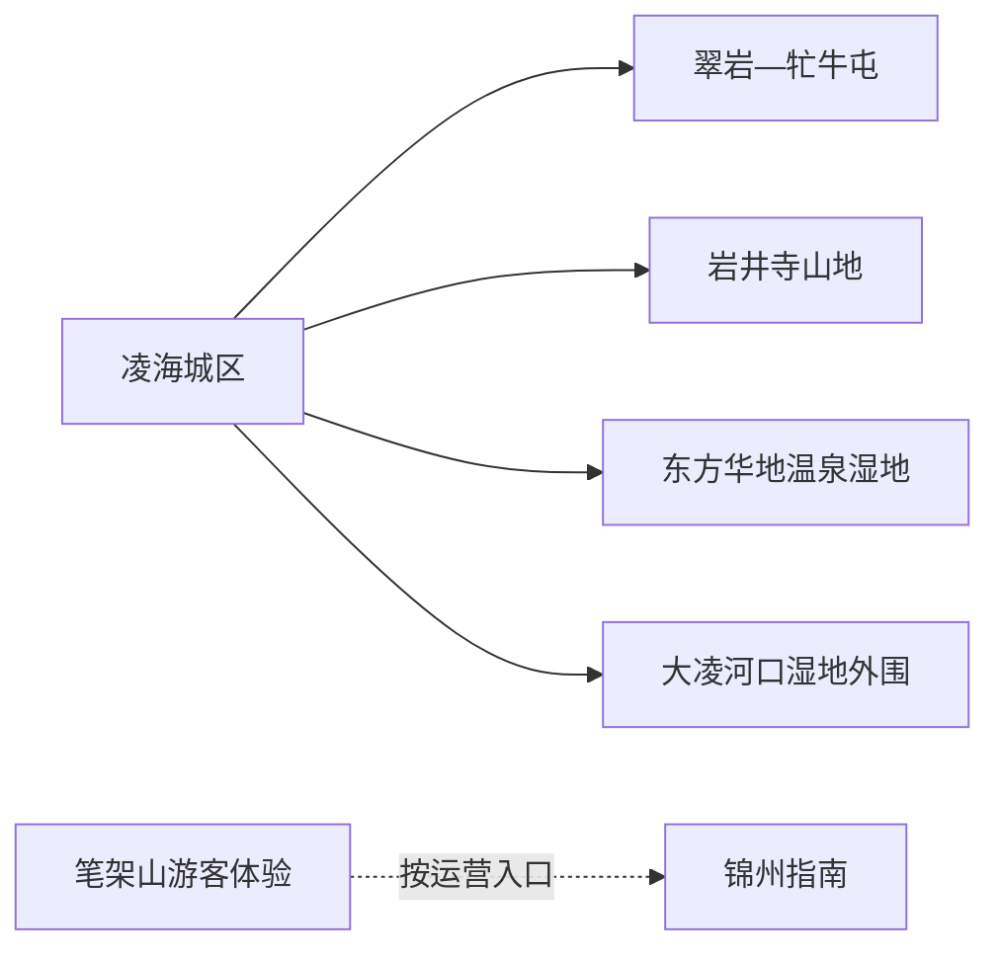
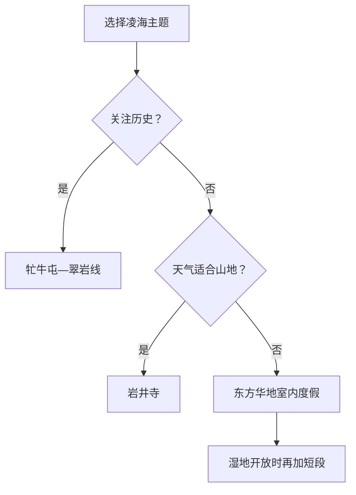

# 凌海旅行指南

凌海位于锦州周边，从城区向翠岩—牤牛屯红色与乡村文化线、岩井寺山地线、东方华地温泉湿地和大凌河口滨海湿地方向展开。各片区相距较远，最实用的安排是住凌海城区或按主题住宿，每天只走一条线；湿地、养殖海域和滨海生产岸线以保护与生产边界为先。

## 城市速览

| 项目 | 信息 |
|---|---|
| 旅行主线 | 凌海城区、牤牛屯前线指挥所旧址、岩井寺、东方华地、大凌河口湿地外围 |
| 建议停留 | 1 天选红色乡村或山地；2 天增加温泉湿地或另一方向 |
| 住宿基地 | 凌海城区交通餐饮方便；度假住宿适合已锁定的单一项目 |
| 步行强度 | 城区低；村落中等；山地中至高；湿地与海岸暴露感强 |
| 主要天气 | 滨海大风、海雾、雷暴、汛情、冬季严寒结冰与森林火险 |
| 预约核心 | 旧址与讲解、景区开放、温泉住宿、湿地管控、县域车辆和返程 |
| 边界重点 | 湿地保护区、滩涂、养殖区、港口、堤防、矿山与林地按管理范围活动 |
| 无障碍 | 城区和度假项目逐点确认；村落山地准备近入口短线 |

## 城市格局与游览区域

凌海市是锦州市代管的县级市，法定代码 `210781`。固定城市点为 GeoNames `2037913`，Wikidata `Q1362450` 对应法定凌海市，目前未列同一 GeoNames 属性。笔架山岛屿登记、景区大陆端运营与锦州滨海管理存在不同口径；本页把笔架山完整游客体验交由[锦州指南](./锦州市.md)说明。

| 区域 | 旅行价值 | 怎么安排 |
|---|---|---|
| 凌海城区 | 到达、住宿、餐饮与补给 | 作为县域基地 |
| 翠岩—牤牛屯 | 锦州前线指挥所旧址、乡村与红色历史 | 留半日至一日 |
| 岩井寺方向 | 山地、宗教文化与森林景观 | 天气稳定时独立一天 |
| 东方华地 | 温泉、湿地环境与度假 | 按运营项目留半日至一日 |
| 大凌河口方向 | 滨海湿地生态与正式观鸟空间 | 只使用官方开放入口和观景点 |

## 主要景点

| 景点 | 所在区域 | 类型 | 核心看点 | 建议用时 | 室内/室外 | 体力 | 预约难度 | 天气敏感度 | 适合旅程 |
|---|---|---|---|---|---|---|---|---|---|
| 东北野战军锦州前线指挥所旧址 | 牤牛屯村 | 红色历史与乡村 | 辽沈战役前线指挥历史、旧址与乡村记忆 | 2–3 小时 | 混合 | 低至中 | 中高 | 中 | A |
| 虎溪民俗文化村等公开项目 | 翠岩—温滴楼方向 | 乡村与民俗 | 民俗文化、乡村慢道与当期活动 | 2–4 小时 | 室外为主 | 中 | 高 | 高 | B |
| 岩井寺旅游景区 | 山地方向 | 宗教与山地 | 山地景观、宗教文化与森林步道 | 4–6 小时 | 混合 | 中至高 | 高 | 极高 | A |
| 东方华地温泉湿地旅游区 | 滨海方向 | 温泉与湿地度假 | 温泉、度假设施与湿地环境 | 半日至 1 天 | 混合 | 低至中 | 高 | 高 | A |
| 九华山风景区 | 城区近郊 | 城市山体与休闲 | 城市近郊绿地、当期文化活动与休闲 | 2–4 小时 | 室外 | 中 | 中 | 高 | B |
| 大凌河口正式开放观景点 | 河口方向 | 滨海湿地 | 河口生态、候鸟与滨海景观 | 2–4 小时 | 室外 | 中 | 高 | 极高 | B |

牤牛屯旧址和村落按正式接待区域参观，纪念空间保持庄重。大凌河口湿地承担生态保护功能，观鸟使用公开道路、观景设施和主管部门允许的范围；潮滩、芦苇湿地核心区、养殖塘、堤防作业段和港区保持保护或生产用途。山地在防火和闭园期间执行现场管理。

## 美食与餐饮

| 类型 | 适合场景 | 份量 | 过敏与饮食提示 | 怎么选 |
|---|---|---|---|---|
| 锦州风味烧烤 | 城区晚餐 | 可按串点，适合单人 | 肉类、海鲜、孜然、花生与共用烤具 | 看标价、熟度和过敏原 |
| 合规海鲜与河鲜 | 城区或正规度假区 | 多适合分享 | 水产过敏、鱼刺、称重和加工费 | 确认品种、来源、重量与总价 |
| 东北炖菜 | 城区正餐 | 常偏大 | 猪肉、大豆、小麦和较高盐油 | 独行问半份或套餐 |
| 沟帮子熏鸡等辽西熟食 | 市场或正规门店 | 可小份 | 禽肉、盐、香料与储存 | 看生产信息、切分和保质期 |
| 苹果等辽西果品 | 市场或正规采摘 | 按斤 | 糖分、清洗和季节 | 选择明码标价、采摘规则清楚的经营者 |

## 经典行程

### 一日红色乡村路线

**路线**：凌海城区 → 牤牛屯前线指挥所旧址 → 午餐 → 同方向公开乡村项目 → 返回

- **串联逻辑**：围绕辽沈战役与乡村记忆形成一条线。
- **预约锚点**：旧址开放、讲解、乡村项目和车辆。
- **休息安排**：午餐长休，下午只走一个短段。
- **时间不足时**：保留前线指挥所旧址。

### 两日首次到访路线

**第 1 天**：牤牛屯—翠岩乡村线 
**第 2 天**：岩井寺或东方华地二选一

- **串联逻辑**：红色历史与山地/温泉分日。
- **预约锚点**：第二日景区、住宿、车辆和天气。
- **休息安排**：两天都在正式服务点午休。
- **时间不足时**：删除第二日。

### 温泉湿地路线

**路线**：城区 → 东方华地正规项目 → 午休 → 温泉或开放湿地短线 → 住宿或返回

- **适用条件**：项目、健康条件和返程已确认。
- **预约锚点**：房型、泡池、儿童规则、湿地步道与退改。
- **休息安排**：分段入池并补水。
- **时间不足时**：只保留一次核心体验。

### 雨雪与大风路线

**路线**：城区公共文化或已预订的室内度假项目 → 午餐 → 休息

- **适用条件**：城市交通正常；大风、暴雪、汛情或火险管制时取消湿地与山地。
- **预约锚点**：天气、道路、场馆与退改。
- **休息安排**：室内为主。
- **时间不足时**：只留一项。

### 亲子路线

**路线**：牤牛屯旧址简明讲解 → 午休 → 服务明确的乡村体验短线

- **串联逻辑**：历史学习与乡村观察集中在同一方向。
- **预约锚点**：讲解、儿童活动、交通与卫生间。
- **休息安排**：户外控制在两小时内。
- **时间不足时**：只留旧址。

### 低体力路线

**路线**：车辆到达牤牛屯旧址 → 午餐长休 → 东方华地室内项目

- **适用条件**：门到门车辆和落客已确认。
- **预约锚点**：轮椅、座椅、电梯、泡池扶手与健康条件。
- **休息安排**：每处只看核心内容。
- **时间不足时**：二选一。

### 湿地观察路线

**路线**：城区早出发 → 官方允许的河口观景入口 → 定点观察 → 午前或天黑前返回

- **适用条件**：主管部门开放、天气和道路稳定。
- **预约锚点**：保护区边界、观鸟设施、风力、潮位与返程。
- **休息安排**：使用正式服务点，准备防风保暖。
- **时间不足时**：缩短观察时段，不向滩涂深处延伸。

## 住宿区域

| 区域 | 优点 | 取舍 | 适合人群 | 核对项 |
|---|---|---|---|---|
| 凌海城区 | 餐饮、交通和多方向出发方便 | 每条远线仍需车辆 | 首访、无车、多日旅行 | 车站接驳、停车、早餐和夜间入住 |
| 东方华地等正规度假住宿 | 接近温泉湿地项目 | 对北部山地与村落不占优 | 度假、低强度旅行 | 资质、房型、供暖、退改与接驳 |
| 乡村正规住宿 | 接近牤牛屯或山地 | 服务选择少、天气敏感 | 红色乡村、自驾 | 消防、供餐、通信和返程 |

## 市内交通

凌海可通过铁路和公路抵达，凌海站、凌海南站等具体停靠以票面和 12306 为准。城区至牤牛屯、岩井寺、东方华地和河口方向都需要独立接驳。

| 场景 | 怎么做 | 行前核对 |
|---|---|---|
| 铁路到达 | 看清完整站名，再转城区或景区 | 车次、站前交通和夜间叫车 |
| 前往乡村山地 | 自驾或正规包车，每天一个方向 | 入口、停车、道路、火险和返程 |
| 前往温泉湿地 | 预订时同步确认准确地址和接驳 | 运营、道路、退改和海滨大风 |
| 与锦州联游 | 凌海与锦州主城分别安排最后一段交通 | 行政边界、景区入口、车站和住宿 |

## 不同旅行者须知

| 旅行者 | 推荐做法 | 重点核对 |
|---|---|---|
| 独行 | 住城区，远线正规车辆 | 返程、司机资质和通信 |
| 亲子 | 旧址加乡村短线或温泉 | 讲解、临水、泡池和卫生间 |
| 长者与低体力 | 旧址或度假项目二选一 | 落客、轮椅、座椅和健康条件 |
| 摄影观鸟 | 河口使用公开观景点 | 保护边界、潮位、风力和无人机 |
| 自驾 | 每天一个方向 | 滨海货车、乡道、结冰、充电和疲劳 |

## 行前核对

- 辽宁省、锦州市与凌海市文旅信息：景区、旧址、活动与临时管理。
- 各运营方：开放、票务、讲解、住宿、停车和退改。
- 辽宁气象、水利、林草、生态环境与应急信息：大风、海雾、汛情、湿地保护与火险。
- 中国铁路 12306：车次、完整站名与退改。

## 来源与更新记录

| 来源 | 支持内容 | 核验日期 |
|---|---|---|
| [辽宁省政府：凌海文体旅游季](https://www.ln.gov.cn/web/ywdt/qsgd/ass_2_1/2024060509121346840/index.shtml) | 东方华地、九华山、岩井寺、乡村项目与前线指挥所旧址 | 2026-09-01 |
| [辽宁省政府：英雄城市与凌海文旅](https://www.ln.gov.cn/web/ywdt/zymtkln/2026033109262672661/index.shtml) | 牤牛屯旧址、大凌河口湿地修复与当前接待 | 2026-09-01 |
| [辽宁省政府：辽西旅游大环线](https://www.ln.gov.cn/web/ywdt/tpxx/2025111310254665129/index.shtml) | 前线指挥所与东方华地的主题线路 | 2026-09-01 |
| [辽宁省农业农村厅：凌海乡村振兴示范带](https://nync.ln.gov.cn/nync/index/nyyw/zsqsnyxxlb/2023110116333595507/index.shtml) | 翠岩—温滴楼、虎溪、前线旧址与乡村项目 | 2026-09-01 |
| [辽宁省政府：锦州 A 级景区](https://www.ln.gov.cn/web/sqgk/whly/ajjq/jz/index.shtml) | 岩井寺与东方华地景区身份 | 2026-09-01 |
| [辽宁省生态环境厅：凌河口湿地保护区](https://sthj.ln.gov.cn/sthj/hjgl/stbh/FA64135BD01B4FD9B7195EEB82DFF41B/index.shtml) | 凌海湿地保护区及保护对象 | 2026-09-01 |
| [Wikidata Q1362450](https://www.wikidata.org/wiki/Q1362450) | 凌海市法定实体 | 2026-09-01 |
| [GeoNames 2037913](https://www.geonames.org/2037913/) | 固定凌海城市点 | 2026-09-01 |
| [中国铁路 12306](https://www.12306.cn/) | 动态车次与购票 | 2026-09-01 |
| [辽宁省气象局](http://ln.cma.gov.cn/) | 气象预警 | 2026-09-01 |

| 日期 | 更新 |
|---|---|
| 2026-09-01 | 首次完成红色乡村、山地、温泉湿地与滨海保护边界研究，并明确笔架山游客体验分工。 |
