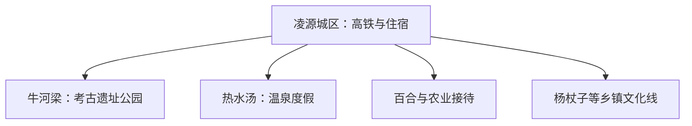

# 凌源旅行指南

凌源的核心组合是牛河梁红山文化遗址、热水汤温泉和辽西山地乡村。城区承担高铁、住宿与餐饮；牛河梁遗址跨凌源与建平边界，参观按国家考古遗址公园的正式入口和开放区组织。

> 建议停留：2 天；加入一条乡村或军工文化线为 3 天<br>
> 旅行关键词：牛河梁、红山文化、热水汤、百合、辽西山地<br>
> 主要体力：场馆低至中等；遗址公园和山地为中等<br>
> 最近研究：2026-08-13

## 城市速览

| 项目 | 旅行信息 |
|---|---|
| 主要旅行价值 | 把红山文化考古、温泉休闲和辽西山地农业组合成两三天主题行程 |
| 建议停留 | 1 天可看牛河梁；2 天增加热水汤与城区；3 天再选一条乡村线 |
| 较舒适季节 | 春秋适合遗址与山地；冬季可做温泉主题，同时留意低温和结冰 |
| 预算特点 | 城区中等，遗址接驳、温泉住宿和远线车辆提高预算 |
| 步行强度 | 博物馆较低，遗址公园、坡地和乡村路线为中等 |
| 主要天气风险 | 大风、雷雨、山洪、森林火险、冬季严寒和道路结冰 |
| 独行旅行 | 高铁与城区住宿方便；遗址、温泉和远线先锁定接驳 |
| 亲子旅行 | 考古博物馆适合研学，户外遗址和温泉项目核年龄与照看规则 |
| 长者与低体力旅行 | 博物馆与温泉分日，减少遗址坡地和连续换乘 |
| 无障碍信息 | 博物馆和新建公共空间可提前确认；遗址、山地和温泉池区资料有限，设施连续性需向官方确认 |

## 城市格局与游览区域

凌源市由朝阳市代管，法定代码 **211382**。GeoNames `2036075` 与 Wikidata `Q1333417`、法定代码精确交叉；另有同 ID 的薄点实体，不另建第二页。牛河梁遗址保护范围跨凌源、建平与喀左的部分区域，本页只承接凌源门户、正式游客入口、住宿和交通，不把跨县保护范围视为连续开放景区。



| 区域 | 主要内容 | 游览特点 | 与其他区域的关系 |
|---|---|---|---|
| 凌源城区 | 交通、住宿、餐饮与公共文化 | 适合抵达日和雨天 | 是各方向基地 |
| 牛河梁方向 | 遗址博物馆、考古遗址公园公开区 | 场馆与户外遗址组合 | 与建平县边界须按具体入口识别 |
| 热水汤方向 | 正式温泉度假区 | 适合单独半日至一日 | 可与牛河梁分日组合 |
| 百合与乡村方向 | 正式农业展示、乡村和山地景区 | 季节性与预约性较强 | 每次选择一个有接待的点 |

## 主要景点

### 考古、城区与温泉

| 景点 | 区域 | 类型 | 主要看点 | 建议用时 | 室内外 | 体力 | 预约风险 | 天气影响 | 优先级 |
|---|---|---|---|---:|---|---|---|---|---|
| 牛河梁国家考古遗址公园公开区 | 牛河梁方向 | 考古遗址、博物馆 | 红山文化遗址、博物馆与正式展示点 | 5–8 小时 | 混合 | 中 | 高 | 高 | A |
| 凌源市博物馆或城市公共展馆 | 城区 | 博物馆 | 地方历史、考古与城市文化 | 1.5–3 小时 | 室内 | 低 | 中 | 低 | B |
| 热水汤温泉度假区正式项目 | 热水汤 | 温泉、度假 | 正规运营池区、住宿和当期康养项目 | 半天至 1 天 | 混合 | 低至中 | 高 | 中 | A |
| 凌河城市公共空间 | 城区 | 城市休闲 | 城市河岸和低强度日常步行 | 1–2 小时 | 室外 | 低 | 低 | 中 | C |

### 农业与乡镇方向

| 景点 | 区域 | 类型 | 主要看点 | 建议用时 | 室内外 | 体力 | 预约风险 | 天气影响 | 优先级 |
|---|---|---|---|---:|---|---|---|---|---|
| 中国百合博览园或正式花卉接待点 | 市域乡镇 | 农业、园艺 | 百合产业、季节花卉和正式展陈 | 3–5 小时 | 混合 | 低至中 | 高 | 高 | B |
| 杨杖子军工文化正式展示点 | 杨杖子方向 | 工业史、红色文化 | 经批准开放的历史展陈和小镇公共空间 | 半天至 1 天 | 混合 | 中 | 高 | 高 | C |
| 青龙河或山地正式景区 | 南部乡镇 | 山地、河谷 | 运营范围内的生态游览线 | 1 天 | 室外 | 中至高 | 高 | 极高 | C |

考古遗址保护区、发掘区和未开放地点按文物保护要求执行；参观以博物馆、游客中心和标示游线为准。温泉项目按运营方健康提示选择水温和时长；矿山、军工生产区和设施厂区属于生产与安全管理空间。

## 美食与餐饮

| 菜品或餐饮类型 | 常见区域 | 一个人用餐与常见份量 | 风味、过敏原与饮食限制 | 排队风险与替代方法 |
|---|---|---|---|---|
| 凌源烧鸡等熟食 | 城区 | 半只或小份更适合一两人 | 含禽肉、盐和香辛料，包装品看冷藏与日期 | 选择有许可和标签的门店 |
| 羊汤、牛羊肉菜 | 城区 | 一碗或小份适合独食 | 含牛羊肉，可能配小麦饼、香菜和辣椒 | 询问清汤与小份选项 |
| 小米、杂粮与家常菜 | 城区及乡镇 | 主食和小炒可单点 | 花生、豆类和荞麦等需留意过敏 | 热门农家餐满位时回城区 |
| 百合主题食品 | 正式展销或餐饮点 | 先选小份试吃 | 配方可能含糖、奶、坚果或药食宣传 | 看完整配料，不把宣传当医疗建议 |

## 经典行程

```mermaid
flowchart TD
    S["先锁定牛河梁开放"] --> N["完整考古日"]
    N --> D{ "是否增加一天" }
    D -->|休闲| H["热水汤温泉"]
    D -->|文化| C["城区与博物馆"]
    H --> T{ "第三天" }
    C --> T
    T -->|有| R["选择一条乡镇线"]
    T -->|无| X["返程"]
```

### 一日经典路线

**路线**：凌源城区或高铁站 → 牛河梁国家考古遗址公园 → 城区住宿或返程

- **串联逻辑**：遗址公园本身需要完整参观与往返，不再叠加温泉或山地。
- **预约锚点**：博物馆开放、遗址游线、讲解、高铁站接驳和返程。
- **休息安排**：游客中心与博物馆内分段休息，午餐使用正式服务点。
- **时间不足时**：优先保留博物馆和一个公开遗址展示点。

### 两日城市路线

**第 1 天**：牛河梁；**第 2 天**：城区公共文化 → 热水汤温泉。

- **串联逻辑**：考古日保持专注，次日用低强度温泉与城区恢复体力。
- **预约锚点**：遗址、温泉时段、住宿、车辆和健康规则。
- **休息安排**：第二天午间回城区或度假区休息。
- **时间不足时**：第二天只留城区展馆或温泉之一。

### 三日深度路线

**第 1 天**：城区；**第 2 天**：牛河梁；**第 3 天**：热水汤或一条农业乡村线。

- **串联逻辑**：先理解地方史，再进入考古核心，最后按兴趣选择休闲或产业。
- **预约锚点**：各场馆、温泉、乡村接待和车辆。
- **休息安排**：每天回城区或已预订度假住宿，避免夜间山路。
- **时间不足时**：删第 3 天乡村线。

### 雨雪天路线

**路线**：城区博物馆或公共展馆 → 午餐 → 温泉正式室内池区或住宿休息

- **适用条件**：城区道路正常且运营方开放；强降雪、结冰或地灾预警时减少跨城移动。
- **预约锚点**：场馆、温泉、道路和铁路运行。
- **休息安排**：短车接驳，温泉控制水温与浸泡时长。
- **时间不足时**：只留一处室内场馆。

### 亲子或低体力路线

**亲子路线**：牛河梁博物馆 → 午休 → 遗址公园短公开段<br>
**低体力路线**：城区展馆 → 午休 → 热水汤正规低强度项目

- **减负方式**：亲子线把户外遗址缩短；低体力线减少坡地并选择近入口池区。
- **预约锚点**：讲解、儿童规则、场馆电梯、温泉健康与陪同规则。
- **休息安排**：两条路线都保留 60–90 分钟一次坐席休息。
- **时间不足时**：亲子只留博物馆；低体力只留城区展馆。

### 远郊一日路线

**路线**：凌源城区 → 一个正式百合产业接待点或杨杖子公开文化点 → 城区

- **适用条件**：活动、接待、道路和返程均确认；两方向择一。
- **预约锚点**：接待主体、花期、车辆、森林防火与天气。
- **休息安排**：在镇区或正式游客服务点午休。
- **时间不足时**：整段改为城区展馆。

## 住宿区域

| 区域 | 优点 | 缺点 | 适合人群 | 交通特点 |
|---|---|---|---|---|
| 凌源城区 | 高铁、餐饮和多方向车辆方便 | 到牛河梁、温泉仍需接驳 | 首访、无车、多日旅行者 | 适合连续住宿 |
| 牛河梁站或遗址方向正规住宿 | 便于早到遗址 | 晚间餐饮和城区活动较少 | 考古主题、次日早班者 | 核对站名、接驳和行李 |
| 热水汤正规度假住宿 | 温泉与住宿集中 | 房价、池区权益和退改差异大 | 低体力、冬季休闲者 | 明确房型是否含池区与接驳 |

## 市内交通

| 场景 | 建议与取舍 | 行前需要重查的内容 |
|---|---|---|
| 铁路抵达 | 凌源站、凌源东站、牛河梁站功能不同，以车票站名安排接驳 | 12306、公交、末班和夜间到达 |
| 前往牛河梁 | 使用官方公交旅游线、景区接驳或正规车辆 | 当前线路、停站、开放入口和返程 |
| 前往热水汤与乡镇 | 县域客运或正规预约车辆 | 班次、道路、司机资质和夜间返程 |
| 自驾 | 适合温泉与乡村方向 | 大风、结冰、山路、停车和充电 |

## 不同旅行者须知

| 旅行维度 | 可行条件 | 主要取舍 | 需额外核对 |
|---|---|---|---|
| 独行旅行 | 高铁、城区和单一景区可闭环 | 乡镇远线提前锁定返程 | 末班与运营方联系 |
| 亲子旅行 | 考古博物馆和正规农业展陈较合适 | 遗址坡地、温泉和山地活动增加照看 | 年龄、讲解、池区与护具 |
| 长者或低体力旅行 | 博物馆与温泉分日 | 户外遗址仍有坡道和距离 | 接驳、电梯、座椅与池区规则 |
| 无障碍需求 | 优先博物馆和新建公共空间 | 遗址、乡村与温泉连续动线资料不足 | 设施连续性需向官方确认 |
| 摄影旅行 | 遗址公园、花卉和辽西山地可分主题 | 文物、无人机和生产基地拍摄有管理要求 | 光线时段、设备与许可 |
| 特殊天气 | 城区和温泉可形成替代 | 雷暴、森林火险与结冰影响远线 | 气象、道路和景区公告 |

## 行前核对

| 核对事项 | 为什么需要重查 | 建议核对时间 | 官方入口 |
|---|---|---|---|
| 牛河梁开放与接驳 | 场馆维护、考古保护和公交会调整 | 预约前及到访前一日 | [辽宁省文旅厅牛河梁资料](https://whly.ln.gov.cn/whly/wlzt/sjly/ajjq/2025111114190360298/index.shtml) |
| 温泉项目 | 池区、房型、健康和检修规则会变化 | 订房前 | [朝阳市文化旅游和广播电视局](https://wlgdj.chaoyang.gov.cn/) |
| 铁路 | 多个车站名称容易混淆 | 购票时及出发当天 | [中国铁路 12306](https://www.12306.cn/) |
| 天气与火险 | 大风、雷暴、结冰和森林火险影响户外 | 出发前三日及当天 | [辽宁省气象局](http://ln.cma.gov.cn/) |

## 来源与更新记录

### 主要来源

| 来源 | 类型 | 支持内容 | 核验日期 |
|---|---|---|---|
| [辽宁省文旅厅：牛河梁国家考古遗址公园](https://whly.ln.gov.cn/whly/wlzt/sjly/ajjq/2025111114190360298/index.shtml) | 省级文旅与文物机构 | 遗址公园、博物馆与公开展示 | 2026-08-13 |
| [辽宁省牛河梁遗址保护条例](https://whly.ln.gov.cn/whly/zfxxgk/fdzdgknr/lzyj/dfxfg/2025122609264496858/index.shtml) | 地方性法规 | 跨凌源、建平、喀左的保护范围和管理边界 | 2026-08-13 |
| [朝阳市文旅局：牛河梁旅游度假区更名公示](https://wlgdj.chaoyang.gov.cn/html/CYWLG/202603/0177276030937081.html) | 地级市文旅部门 | 热水汤温泉旅游度假区的现行名称动态 | 2026-08-13 |
| [凌源文旅品牌资料](https://chaoyang.gov.cn/html/CYSZF/202407/0172230216749271.html) | 朝阳市政府 | 牛河梁、热水汤、青龙河与杨杖子线路 | 2026-08-13 |
| [牛河梁公交旅游线路](https://chaoyang.gov.cn/html/CYSZF/202408/0172307870720850.html) | 朝阳市政府 | 凌源高铁站与遗址公园接驳背景 | 2026-08-13 |
| [民政部行政区划查询](https://dmfw.mca.gov.cn/xzqh/getList?code=21&trimCode=true&maxLevel=3) | 政府开放接口 | 凌源市代码 `211382` 与朝阳代管关系 | 2026-08-13 |
| [GeoNames 2036075](https://www.geonames.org/2036075/lingyuan.html) | 开放地理数据 | 固定城市点与 PPL 分类 | 2026-08-13 |
| [Wikidata Q1333417](https://www.wikidata.org/wiki/Q1333417) | 开放知识图谱 | 凌源市实体、P1566 与法定代码 | 2026-08-13 |

### 更新记录

| 日期 | 更新内容 |
|---|---|
| 2026-08-13 | 首次完成凌源独立旅行研究；朝阳父页只保留跨县考古范围和换城链接。 |
