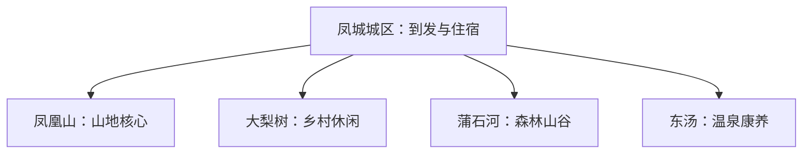
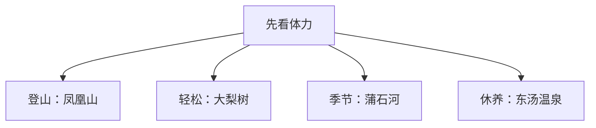

# 凤城旅行指南

凤城以凤凰山为首访核心，大梨树适合乡村休闲，蒲石河和东汤温泉分别代表森林与康养方向。四个方向距离分散，最舒服的安排是每天选择一个主目的地，以凤城城区作为交通和住宿基地。

> 建议停留：2–4 天 
> 旅行关键词：凤凰山、大梨树、蒲石河、东汤温泉、辽东山地 
> 主要体力：城区低，凤凰山与森林景区较高 
> 无障碍提醒：设施连续性需向官方确认；山地步道、温泉池区和景交分别核对

## 城市速览

| 项目 | 信息 |
|---|---|
| 主要旅行价值 | 辽东山地、乡村发展、森林秋色和温泉康养 |
| 建议停留 | 2 天覆盖凤凰山与大梨树；3–4 天增加森林或温泉 |
| 较舒适季节 | 春秋适合登山，冬季温泉与冰雪按运营安排 |
| 预算特点 | 城区平稳，景区门票、索道或景交、温泉和包车增加支出 |
| 步行强度 | 城区低；凤凰山和蒲石河中高至高 |
| 独行旅行 | 成熟景区较易安排，远线先确认返程 |
| 亲子旅行 | 大梨树和短步道较易控制节奏 |
| 长者与低体力旅行 | 选择乡村、温泉和车辆可达观景点 |
| 主要天气风险 | 山雾、雷雨、落石、结冰、森林火险 |
| 行前关键动作 | 先定凤凰山日期，再从乡村、森林、温泉中选一条补充线 |

## 城市格局与游览区域

凤城是丹东市代管的县级市，法定代码 **210682**。城区承担铁路、公路和住宿；凤凰山靠近城区，大梨树、蒲石河、东汤分别在不同乡镇方向。

| 区域 | 主要内容 | 建议节奏 | 选择提示 |
|---|---|---|---|
| 凤城城区 | 到发、住宿、餐饮和公共文化 | 半天 | 适合抵离日 |
| 凤凰山方向 | 山地、历史遗迹与登高 | 1 天 | 按体力和开放线路选短长线 |
| 大梨树方向 | 乡村、农业与红色文化 | 半日至 1 天 | 适合亲子和低体力 |
| 蒲石河方向 | 森林、河谷与季节秋色 | 1 天 | 天气和道路影响较大 |
| 东汤方向 | 温泉与康养 | 半日至 1 天 | 核对池区、住宿与健康提示 |

## 主要景点

| 景点 | 区域 | 类型 | 主要看点 | 建议用时 | 室内外 | 体力 | 预约风险 | 天气影响 | 优先级 |
|---|---|---|---|---:|---|---|---|---|---|
| 凤凰山景区 | 城区近郊 | 山地、历史 | 山岳地貌、栈道、历史遗存与辽东景观 | 1 天 | 室外 | 高 | 高 | 很高 | A |
| 大梨树景区 | 大梨树村 | 乡村、农业 | 乡村建设、农业景观与干字文化 | 半日至 1 天 | 混合 | 低至中 | 中 | 高 | A |
| 蒲石河森林公园正式开放区 | 赛马方向 | 森林、河谷 | 森林、溪谷与季节秋色 | 1 天 | 室外 | 中至高 | 高 | 很高 | B |
| 东汤温泉正式接待项目 | 东汤镇 | 温泉、康养 | 温泉体验与乡镇休闲 | 半日至 1 天 | 混合 | 低 | 高 | 中 | B |
| 鸡冠山—帽盔山方向正式景区 | 市域北部 | 山地、森林 | 辽东山地与季节景观 | 1 天 | 室外 | 高 | 高 | 很高 | C |
| 凤城公共文化场馆 | 城区 | 文博、地方史 | 以当期展览认识凤城历史与地域文化 | 2–3 小时 | 室内 | 低 | 中 | 低 | B |

凤凰山内部登山线、栈道和观景点按一座景区安排。林场、矿区、水库管理区和未开放山路按生产、保护与防火边界使用。

## 美食与餐饮

城区可按辽东家常菜、酸汤子、炖菜、烧烤、山野菜和满族风味选择。山野菜以合法来源和充分加热为前提；酸汤子及发酵米面注意食品安全。大豆、小麦、芝麻、坚果和共锅烹饪是常见过敏原线索。

## 经典行程

### 一日经典路线
**路线**：凤城城区 → 凤凰山完整游览 → 城区晚餐。
- **串联逻辑**：把首访核心单独成日，避免挤入另一条远线。
- **预约锚点**：凤凰山入园、索道或景交。
- **休息安排**：游客中心与山中正式休息点。
- **时间不足时**：选择较短开放线，保留核心景观。

### 两日城市路线
**第 1 天**：凤凰山；**第 2 天**：大梨树与城区。
- **串联逻辑**：高体力日后接低体力乡村日。
- **预约锚点**：两处景区开放。
- **休息安排**：第二天增加午间休息。
- **时间不足时**：第二天只留大梨树半日。

### 三日深度路线
**第 1 天**：凤凰山；**第 2 天**：大梨树；**第 3 天**：蒲石河或东汤。
- **串联逻辑**：前两天覆盖核心，第三天按季节和偏好二选一。
- **预约锚点**：第三天交通和运营。
- **休息安排**：固定城区住宿，温泉线可换宿。
- **时间不足时**：先删第三天。

### 雨雪天路线
**路线**：城区公共文化 → 午餐 → 当期正常运营的温泉项目。
- **串联逻辑**：先在城区确认道路和项目状态，再沿单一方向前往温泉并结束当天行程。
- **适用条件**：道路正常；强降雪或预警天气留在城区。
- **预约锚点**：场馆、温泉和道路。
- **休息安排**：城区与温泉休息区。
- **时间不足时**：只留城区场馆。

### 亲子或低体力路线
**亲子路线**：大梨树 → 城区；**低体力路线**：城区 → 东汤温泉。
- **串联逻辑**：亲子方案把乡村体验放在白天，低体力方案以城区休整接车辆可达温泉。
- **减负方式**：亲子避开高风险山路；低体力方案减少步行和换乘。
- **预约锚点**：亲子活动与温泉健康规则。
- **休息安排**：游客中心和室内休息区。
- **时间不足时**：各保留一个主项目。

### 远郊一日路线
**路线**：凤城城区 → 蒲石河正式开放区 → 返回。
- **串联逻辑**：森林方向单独成日，城区承担出发前补给和返程后的住宿。
- **适用条件**：道路、天气和返程车辆均已确认。
- **预约锚点**：景区开放与交通。
- **休息安排**：景区正式服务区。
- **时间不足时**：整段删除，改走大梨树或城区。

## 住宿区域

| 区域 | 优点 | 缺点 | 适合人群 | 交通特点 |
|---|---|---|---|---|
| 凤城城区 | 到发、餐饮和多方向换乘方便 | 远景区往返时间较长 | 首访与无车旅行 | 适合固定基地 |
| 凤凰山近郊 | 方便早入园 | 夜间选择较少 | 登山主题旅行 | 依赖景区或车辆 |
| 东汤镇 | 温泉与慢节奏 | 与其他景区相距较远 | 康养与换宿旅行 | 先确认公路接驳 |

## 市内交通

凤城东站和凤城站分别承担高铁与普速到发，具体车次以12306为准。城区用公交、出租车或网约车；凤凰山、大梨树、蒲石河、东汤跨方向移动适合官方接驳、自驾或合规包车。

## 不同旅行者须知

登山旅行把鞋底抓地、补水和提前下撤作为基本条件；亲子与低体力旅行优先大梨树、城区和温泉。温泉体验按个人健康状况咨询运营方。设施连续性需向官方确认。

## 行前核对

| 核对事项 | 为什么需要重查 | 建议时间 | 官方入口 |
|---|---|---|---|
| 凤凰山与各景区运营 | 天气、维护和客流会改变开放线 | 订房前及前一日 | [凤城市人民政府](https://www.dandong.gov.cn/fcs/) |
| 山区天气与火险 | 山雾、降雨和林火风险具有时效性 | 出发前三日及当天 | [中国气象局](https://www.cma.gov.cn/) |
| 温泉项目 | 池区维护、价格和适用规则会变化 | 预约前 | 运营方官方渠道 |
| 铁路班次 | 车次与售票状态会调整 | 订票时及当天 | [中国铁路12306](https://www.12306.cn/) |

## 来源与更新记录

### 主要来源

| 来源 | 类型 | 支持内容 | 核验日期 |
|---|---|---|---|
| [凤城市国土空间总体规划](https://files.dandong.gov.cn/files/ueditor/FCSZF/jsp/upload/file/20241029/1730166588144018458.pdf) | 市政府规划 | 凤凰山、大梨树、蒲石河、温泉与旅游空间格局 | 2026-08-13 |
| [丹东市政府工作任务资料](https://files.dandong.gov.cn/files/ueditor/DDSZF/jsp/upload/file/20220531/1653980419982070251.pdf) | 地级市政府 | 大梨树、蒲石河与红色旅游线索 | 2026-08-13 |
| [GeoNames 2037411](https://www.geonames.org/2037411/fengcheng.html) | 开放地名数据 | 固定城市点 | 2026-08-13 |
| [Wikidata Q1362431](https://www.wikidata.org/wiki/Q1362431) | 开放知识库 | 法定凤城市实体与P1566交叉核对 | 2026-08-13 |

### 更新记录

| 日期 | 更新内容 |
|---|---|
| 2026-08-13 | 首次完成城市格局、景点选择、路线与动态核对 |
