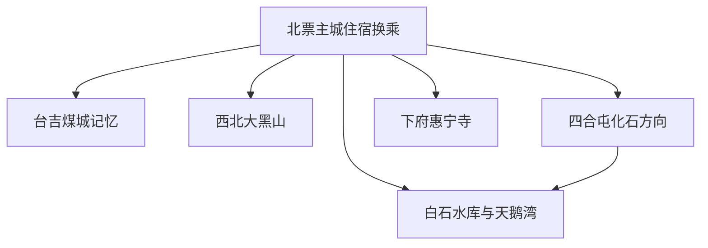
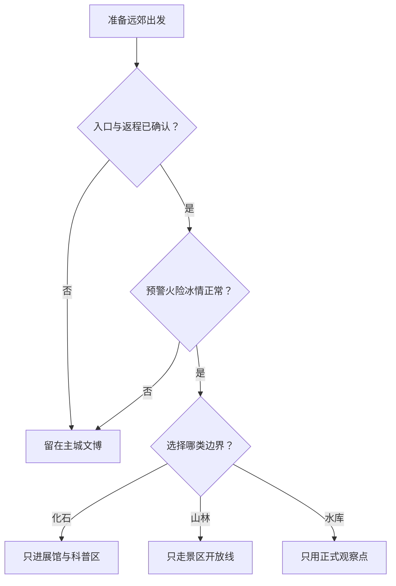

# 北票旅行指南

北票是朝阳市代管的独立县级市，城市名字来自近代煤矿“北四票”，旅行线索也从煤城工业史延伸到热河生物群化石、大黑山森林、白石水库湿地与蒙古族历史文化。北票站、主城区、台吉煤矿片区、四合屯、大黑山和白石水库分属不同方向；一座城市里有多个重量级主题，却没有一条公共交通可以把它们当天无缝串完。化石产地、自然保护区、生产矿区、水库工程和湿地保护地都只按正式开放边界活动。

> 建议停留：3–5 天；主城与台吉 2 天，大黑山、四合屯或白石水库方向各另留 1 天 
> 旅行关键词：古生物化石、煤矿工业史、大黑山、白石水库、惠宁寺、战国红玛瑙 
> 主要体力：主城低至中等；大黑山中高强度
> 最近研究：2026-08-12

## 城市速览

| 项目 | 旅行信息 |
|---|---|
| 主要旅行价值 | 在北票博物馆与四合屯理解热河生物群和古鸟类研究，在台吉历史空间认识煤城形成与矿工记忆，再用大黑山、惠宁寺和白石水库看到辽蒙交界的山林、民族文化与湿地水库体系 |
| 建议停留 | 1 天可看主城博物馆与城市公共空间；2 天加入台吉工业史；3 天增加大黑山；4–5 天再从四合屯、白石水库—天鹅湾、惠宁寺中择一至两条，远线不互相硬拼 |
| 较舒适季节 | 春末与秋季适合山地和主城，但春秋多风、森林草原火险较高；冬季可观察候鸟或体验冰雪项目，但物候、项目和冰面安全均需当期确认。夏季需防高温、雷暴、暴雨与山洪 |
| 预算特点 | 主城公共场馆可降低支出，远郊车辆、大黑山门票或索道、跨乡镇住宿与冬季项目增加成本；最贵的往往是同日跨多个方向的车辆而非场馆门票 |
| 步行强度 | 主城以低至中等步行为主；台吉街区需车辆接驳；大黑山有长栈道、台阶、坡道和索道候乘，索道不能消除全部步行；水库与化石方向的体力更多消耗在往返和户外环境 |
| 主要天气风险 | 春秋大风与高火险，夏季短时强降雨、雷暴、山洪、滑坡泥石流及水库河道涨水，冬季严寒、强风、积雪和结冰；矿山、尾矿库与边坡另有生产安全风险 |
| 独行旅行 | 主城场馆和普通餐饮适合独自安排；大黑山、四合屯、白石水库与乡镇返程不宜临时决定，夜间不进入矿区、林区、湿地或无照明岸线 |
| 亲子旅行 | 化石科普、博物馆和天鹅展馆主题明确；化石不可采挖，矿坑、山路、水边、冰面与索道需要持续近距看护，万人坑纪念内容需评估儿童心理承受 |
| 长者与低体力旅行 | 可用北票博物馆、战国红专题馆和天鹅湾服务区构成低强度路线；大黑山宣传中的无障碍步道不等于从停车、索道到卫生间全程连续可达 |
| 无障碍信息 | 铁路可预约重点旅客服务，大黑山公开资料提及无障碍游道；但坡度、衔接、维护、索道上下站、古建筑门槛和远郊返程仍需逐项向运营方确认 |

北票法定行政代码为 `211381`。GeoNames `2038342` 以 `PPL` 记录居民点，Wikidata `Q814826` 以 `P1566` 精确连接同一 ID 并对应北票市。本页按法定县级市及实际旅行网络组织，不把城市点与全市行政面混写，也不借朝阳市主城页面承接北票的路线、住宿和交通。

## 城市格局与游览区域

北票主城区承担住宿、餐饮、博物馆和换乘，北票站位于城区之外，抵达后仍需接驳。台吉与三宝煤矿历史片区在主城周边不同方向；大黑山位于西北部辽蒙交界；四合屯与白石水库在东南—南部方向；惠宁寺位于下府一带。几条远线之间缺少适合游客的连续环线，可靠做法是每天从主城选择一个方向。

| 区域 | 主要内容 | 游览特点 | 与其他区域的关系 |
|---|---|---|---|
| 北票主城 | 北票博物馆、战国红专题馆、城市生活、住宿与餐饮 | 室内文博和城市服务集中，适合作为抵离或恶劣天气日 | 所有远线最好由此组织；北票站到主城仍需接驳 |
| 台吉—三宝煤矿历史方向 | 日伪时期死难矿工纪念馆、历史文化街区、煤矿遗存 | 工业史与纪念主题浓重；公开纪念设施、历史街区和生产矿区边界必须分开 | 可从主城安排半天至一天，不继续进入矿井、采空区、尾矿库或专用铁路 |
| 大黑山 | 旅游景区、国家级森林公园及国家级自然保护区 | 正式景区提供山地游线，保护区尺度远大于游客路线；索道和栈道会因天气检修变化 | 独立一天，不能与四合屯或白石水库硬拼；只走运营方开放线路 |
| 上园—四合屯 | 鸟化石自然保护区、化石博物馆与科研保护空间 | 化石价值世界级，但展馆、保护区、科研地层和村庄不是同一开放边界 | 可与白石水库方向相邻理解，是否同日组合取决于两个入口、开放和返程 |
| 白石水库—天鹅湾 | 水库工程、湿地保护区、候鸟观察和正式旅游服务点 | 物候、水位、冰情和保护管理决定体验；大坝与水利设施不是自由步道 | 只在公告服务区观鸟休息，不沿岸搜索野点，不进入库区工程和养殖作业面 |
| 下府—惠宁寺 | 惠宁寺及蒙古族历史文化 | 宗教活动与文物建筑并存，礼仪、殿堂和摄影规则按现场执行 | 可单独半天，或在车辆和返程已确认时与主城组合，不临时跨去大黑山 |
| 城区外围矿业与新能源空间 | 矿山、尾矿库、厂区、风光电及专用交通 | 以生产和治理为主，不是工业旅游自动开放区 | 只有正式公告的场馆或街区可进入，不凭地图和历史照片寻找矿井 |

北票大黑山旅游景区、国家森林公园与国家级自然保护区名称相近，却不能互相替代。游客只使用景区公布的入口、栈道、索道与服务设施；保护区核心保护区原则上不属于普通旅游范围，一般控制区也只在依法划定的公共服务区域活动。白石水库兼有防洪、供水、灌溉、发电、湿地与候鸟栖息功能，观鸟区、天鹅展馆、水库大坝、饮用水水源保护区和整片岸线同样不是一个开放范围。

## 主要景点

优先级用于安排时间，不代表绝对排名：**A** 为首访核心，**B** 为按兴趣补充，**C** 为远郊、季节性或通常需要独立半天以上的目的地。车站、游客中心和公共公园只作为路线节点，不与正式景点并列；同一景区内部子点只作为一个项目。

### 主城文博与城市文化

| 景点 | 区域 | 类型 | 主要看点 | 建议用时 | 室内外 | 体力 | 预约风险 | 天气影响 | 优先级 |
|---|---|---|---|---:|---|---|---|---|---|
| 北票博物馆 | 主城区 | 地方综合博物馆 | 从地方考古、三燕历史到古生物化石科普；馆内多个展厅按一座场馆计算 | 2–3 小时 | 室内 | 低 | 中 | 低 | A |
| 北票战国红博物馆 | 主城区 | 玛瑙专题博物馆 | 战国红玛瑙纹理、赏石与当代工艺；参观与购买分开判断 | 1.5–2.5 小时 | 室内 | 低 | 中至高 | 低 | B |
| 主城公共空间与毓水街方向 | 主城区 | 城市公共空间 | 城市生活、化石与文创商业线索，只使用公开街道和正式商户 | 1–2 小时 | 混合 | 低 | 低 | 中 | 路线节点 |

北票博物馆可先建立化石、三燕与地方历史框架，再决定是否去四合屯；场馆展品来自依法收藏与研究，不表示旅行者可在野外挖掘。战国红专题馆可以学习材质和工艺，但展陈、鉴定、销售是不同服务，购买时仍需索要材质、处理方式、重量、价格与退换凭证，不以产地名称代替检测。

### 煤城工业史与纪念空间

| 景点 | 区域 | 类型 | 主要看点 | 建议用时 | 室内外 | 体力 | 预约风险 | 天气影响 | 优先级 |
|---|---|---|---|---:|---|---|---|---|---|
| 北票市日伪时期死难矿工纪念馆 | 台吉方向 | 纪念馆、工业史 | 日伪掠夺煤炭、矿工遭遇与遗址纪念；按正式展馆与遗址开放区整体安排 | 2–3 小时 | 混合 | 低至中 | 中 | 中 | A |
| 台吉煤矿历史文化街区公开段 | 台吉 | 工业遗产、历史街区 | 煤矿建筑、竖井与矿业城市形成线索，只在公共道路和公告开放设施观察 | 1.5–3 小时 | 以室外为主 | 中 | 高 | 高 | B |
| 三宝煤矿历史文化街区公开段 | 三宝方向 | 工业遗产、历史街区 | 日伪时期建筑及煤炭工业遗存，开放与活化项目需当期核对 | 1.5–3 小时 | 以室外为主 | 中 | 高 | 高 | C |

纪念馆涉及死亡、战争与强制劳动，亲子家庭应先了解展陈强度。台吉与三宝被认定为历史文化街区，不代表所有竖井、厂房、宿舍、地下空间和铁路设施都已向公众开放；在建的“两馆”或活化项目也不能按规划效果图提前列为可参观景点。围栏、门岗、塌陷警示和治理工地必须服从，不下矿井、不靠近边坡与尾矿库拍照。

### 化石与辽西生命史

| 景点 | 区域 | 类型 | 主要看点 | 建议用时 | 室内外 | 体力 | 预约风险 | 天气影响 | 优先级 |
|---|---|---|---|---:|---|---|---|---|---|
| 四合屯古生物化石博物馆及正式科普区 | 上园镇四合屯 | 化石博物馆、自然遗迹 | 中生代地层、孔子鸟、中华龙鸟和早期被子植物研究线索；按展馆与正式游线整体安排 | 2–4 小时，不含主城往返 | 混合 | 低至中 | 高 | 中至高 | A |
| 北票鸟化石国家级自然保护区公众开放内容 | 四合屯等区域 | 自然保护区、科研科普 | 热河生物群核心产地与原地保护；仅在管理机构明确开放的设施中参观 | 1–3 小时 | 混合 | 低至中 | 高 | 高 | C |

中国境内遗存的古生物化石依法属于国家所有，普通旅行者不得自行发掘、敲取或带走。四合屯的博物馆、保护区管理设施、科研现场、村庄和野外地层要逐一分开；只有当期公告的公众入口可以进入。不要购买来源不明的“原石化石”，不在岩层使用锤凿，不向村民索要私藏标本，也不把道路边坡当作采集点。

### 大黑山与山林

| 景点 | 区域 | 类型 | 主要看点 | 建议用时 | 室内外 | 体力 | 预约风险 | 天气影响 | 优先级 |
|---|---|---|---|---:|---|---|---|---|---|
| 北票大黑山旅游景区 | 大黑山特别管理区方向 | 山岳、森林景区 | 辽蒙交界山林、峰石、栈道与景区宗教建筑；索道、步道和内部节点合并计数 | 0.5–1 天 | 室外 | 中至高 | 高 | 高 | A |
| 大黑山冬季或季节活动 | 景区公告区域 | 季节体验 | 戏雪、冰瀑、花期或秋色，仅在正式运营和安全确认后加入 | 2–4 小时 | 室外 | 中 | 高 | 高 | C |

景区公开资料提到长距离栈道、无障碍游道和观光索道，但“无障碍”宣传不能替代完整路线核验：停车场到入口、坡度、休息点、索道上下站、卫生间和返程都可能中断。2025 年已有索道临时停运公告，说明设备状态必须当天查。火险、大风、雷暴、暴雨、冰雪或保护管理要求下，整段关闭便取消，不沿保护区边界绕行。

### 白石水库、湿地与人文远线

| 景点 | 区域 | 类型 | 主要看点 | 建议用时 | 室内外 | 体力 | 预约风险 | 天气影响 | 优先级 |
|---|---|---|---|---:|---|---|---|---|---|
| 天鹅湾景区公开服务区 | 白石水库周边 | 湿地科普、候鸟观察 | 游客中心、天鹅与化石展馆、经管理的观察空间；物候决定实际鸟况 | 2–4 小时 | 混合 | 低至中 | 中至高 | 高 | B |
| 白石水库正式旅游区 | 上园镇方向 | 水库、水利与自然景观 | 大凌河水库景观及经公告运营的项目；工程与旅游范围分开 | 2–4 小时 | 以室外为主 | 低至中 | 高 | 高 | B |
| 惠宁寺 | 下府方向 | 古建筑、宗教文化 | 藏传佛教建筑、壁画与蒙古族文化；殿堂和仪式按现场规则 | 1.5–3 小时 | 混合 | 低至中 | 中 | 中 | B |

白石水库是大型水利枢纽和饮用水水源地，湿地自然保护区还承担候鸟栖息保护。历史旅游资料不能证明漂流、码头或全岸线持续营业；只使用当前仍由运营方公告开放的项目。不上未确认安全的冰面，不下水、不追鸟、不投喂，不穿过芦苇、潮湿滩地、养殖区、隔离防护或工程道路。惠宁寺是持续宗教空间，拍摄壁画、佛像、僧众与仪式前先遵守许可和礼仪。

## 美食与餐饮

北票饮食属于辽西旱作农业与东北家常菜体系，杂粮、小米、荞麦、玉米、羊汤、饺子和炖菜都容易找到；天鹅大集等季节活动还会出现地瓜干、芥菜干和烤玉米。官方宣传对单一“北票名菜”的稳定证据有限，因此本页以食材、菜类和正规经营区域为主，不把一家店写成唯一答案。

| 菜品或餐饮类型 | 常见区域 | 一个人用餐与常见份量 | 风味、过敏原与饮食限制 | 排队风险与替代方法 |
|---|---|---|---|---|
| 小米粥与杂粮饭 | 主城、普通早餐店和家常菜馆 | 一人份方便，适合早出发前用餐 | 谷物本身清淡，但配菜可能高盐；杂粮混配或共用器具可能含小麦，严格无麸质需确认 | 早餐高峰后部分品类售罄，可换玉米粥、米饭或普通面食 |
| 荞麦面与荞麦制品 | 主城及乡镇餐馆 | 多为一人一碗 | 荞麦常与小麦混合制面，汤底可能含肉、大豆和芝麻；“荞麦”不等于无麸质 | 供应不稳定时用玉米面条、饺子或米饭替代，不为一碗面跨乡镇 |
| 羊汤与羊杂 | 主城、下府及辽西风味餐馆 | 一人一碗，常配饼；纯肉与羊杂份量不同 | 脂肪和盐可能较高，香菜、辣椒可询问；严格清真需核实资质和共厨 | 冬季与早餐时段较忙，可选正规普通羊汤馆，不必等待网红店 |
| 饺子、包子与馅饼类 | 主城与乡镇 | 可按两或按个点，独食方便 | 面皮含小麦，馅料常含猪牛羊肉、葱、大豆调味；热馅容易烫伤 | 客运前可作快速餐，但不购买储存温度不明、长时间裸露的熟食 |
| 东北炖菜与酸菜锅 | 全市普通餐馆 | 通常适合二至四人，独行者问小份或套餐 | 油盐较高，常见猪肉、粉条、大豆、小麦与共锅；“不辣”不代表素食或低盐 | 普通社区餐馆替代性强，减少菜数比等热门大锅更可控 |
| 烤玉米、烤地瓜与农家干菜 | 天鹅大集等正式活动、农产品店 | 小份便于单人尝试 | 看清糖、盐、油和包装日期；路边散装产品注意储存与灰尘 | 活动有季节与日期，不追摊；可用正规商店标签完整的同类产品替代 |
| 河鱼或水库鱼菜 | 正规餐馆 | 多为整鱼或多人份，独行者先问重量和小份 | 鱼类过敏风险，刺多；来源、禁捕期和冷链需合法合规，水库保护区不自行垂钓 | 来源或计量不清时改点禽肉、豆制品，不把“野生”当品质保证 |
| 烧烤与辽西串类 | 主城夜间餐饮区 | 按串点，单人可控份量 | 牛羊肉、海鲜、芝麻、孜然、辣椒与大豆调味常见，烤架交叉接触明显 | 夜间拥挤时选证照、通风和价格清楚的同类店，并预留返程 |
| 枣、杂粮与糕点 | 主城正规农产品店 | 适合伴手礼，先看净含量和保质期 | 糖含量和坚果、芝麻、乳蛋配料需看标签；散装食品交叉接触难判断 | 不为产地宣传购买无标签产品，以许可、包装和票据完整者替代 |

野生蘑菇、野菜和来源不明的野味不作为旅行体验。严重过敏、无麸质、素食、清真或低盐需求者，应把每项限制写给餐厅确认；杂粮面食常与小麦共线加工，羊汤和炖菜也可能共锅。山地和水库日带可密封的普通补给，垃圾带走，不在林区与保护地生火野炊。

## 经典行程

路线按半天和完整一天组织，不使用分钟级课表。远郊日先确认入口、天气与返程，再决定内容；保护区、矿区和水库工程的安全边界优先于景点数量。

### 一日经典路线

**路线**：北票博物馆 → 主城午餐 → 北票战国红博物馆 → 毓水街或城市公共空间短段

- **串联逻辑**：先用综合馆建立化石、三燕与煤城历史框架，午后转向玛瑙专题与当代城市生活；全日留在主城，适合首访或抵离日。
- **预约锚点**：北票博物馆和战国红专题馆的开放；若一馆临时关闭，延长另一馆或在正规公共空间休息，不用商业摊位替代文博。
- **休息安排**：主城餐馆完成午餐，馆内按允许区域短休；大风、严寒或高温时缩短室外段。
- **时间不足时**：保留北票博物馆，删除专题馆和街区长段；若只剩两小时，只看两个最感兴趣的展厅。

### 两日城市路线

**第 1 天**：北票博物馆 → 战国红专题馆 → 主城公共空间 
**第 2 天**：主城出发 → 日伪时期死难矿工纪念馆 → 台吉历史文化街区公开段 → 返回主城

- **串联逻辑**：第一天处理城市通史和化石，第二天完整面对煤矿工业史与矿工记忆；纪念馆先于街区，能减少只看工业外观而忽略历史的风险。
- **预约锚点**：第二天以纪念馆开放为锚点，并确认台吉哪些公共道路或设施可进入；生产矿区从不作为替补。
- **休息安排**：第二天先在主城或台吉正规餐饮点用餐，纪念馆后安排安静休息；情绪或体力不适可直接返回。
- **时间不足时**：删除街区，只参观纪念馆；不在闭馆后围绕矿井、铁路或治理工地寻找外观点。

### 三日深度路线

**第 1 天**：北票主城文博与城市生活 
**第 2 天**：台吉纪念馆与公开工业遗产 
**第 3 天**：主城出发 → 大黑山旅游景区单一开放游线 → 返回主城

- **串联逻辑**：主城、煤城历史和山林分日，第三天只处理大黑山的往返与山地体力；自然保护区背景在景区解释，不转入野线穿越。
- **预约锚点**：大黑山门票、入园时段、索道和开放游线；索道停运时按体力选择缩短步道或取消，不强行徒步替代。
- **休息安排**：入山前补足饮水和简餐，只在景区服务点休息；下午保留足够返程时间，冬季不摸黑下山。
- **时间不足时**：第三天整段删除或缩为主城，不把山地压进台吉日；入园后只缩短至低强度开放段。

### 雨天路线

**路线**：住宿地 → 北票博物馆 → 室内午餐 → 战国红专题馆 → 返回住宿地

- **适用条件**：普通降雨且城市交通正常时可执行；暴雨、雷暴大风、内涝、山洪或官方减少出行提示下，减少跨区移动并取消所有远郊。
- **预约锚点**：两馆的开放与恶劣天气公告；文博活动的节庆延时不推定为全年固定。
- **休息安排**：全程使用馆内明确开放休息区和正规餐馆，湿滑或积水时选择离住宿更近的一馆。
- **时间不足时**：只保留北票博物馆；不在雨天追加矿坑边坡、四合屯野外点、大黑山、白石水库或湿地。

### 亲子或低体力路线

**亲子路线**：北票博物馆化石科普展 → 午休 → 天鹅湾游客中心与正式展馆 → 返回主城 
**低体力路线**：车辆到北票博物馆最近入口 → 主城午餐 → 战国红专题馆 → 返回住宿地

- **减负方式**：亲子路线用场馆替代野外采集，只在游客中心和有护栏的正式观察点活动；低体力路线完全留在主城并逐点确认电梯、坡道、座椅和卫生间。两条路线都不把大黑山“无障碍游道”宣传推断为全程无障碍。
- **预约锚点**：亲子路线以天鹅湾展馆、候鸟管理和往返为锚点；低体力路线以两馆连续通行确认结果为锚点。
- **休息安排**：亲子路线在游客中心休息，不追鸟、不下岸；低体力路线每馆只选核心展厅，午餐后保留静态休息。
- **时间不足时**：亲子路线只保留北票博物馆，低体力路线删专题馆；天气或道路不合适时，两者均不出主城。

### 远郊一日路线

**路线**：主城出发 → 四合屯古生物化石博物馆或当期正式科普区 → 上园镇正规午餐 → 原路返回主城

- **适用条件**：适合已确认场馆、保护区公众入口、道路与返程的旅行者；暴雨、大风、积雪、科研管控或闭馆时取消，不将白石水库临时塞入。
- **预约锚点**：具体展馆名称、散客入口和开放时段；在建的新馆、规划项目与历史资料不能替代当前确认。
- **休息安排**：在展馆或镇区服务点休息，不在地层、保护区或村道野餐，不携工具进入野外。
- **时间不足时**：远郊整段删除，改为北票博物馆的化石展；若已抵达而入口关闭，返回镇区或主城，不寻找非正式侧门。

## 住宿区域

| 区域 | 优点 | 缺点 | 适合人群 | 交通特点 |
|---|---|---|---|---|
| 北票主城区 | 餐饮、场馆、城市服务与多方向车辆组织最方便 | 到北票站、大黑山、四合屯和白石水库均需接驳 | 首访、独行、公共交通旅行与连续住多晚者 | 适合作为所有远线基地；订房时核对夜间前台和到实际上车点距离 |
| 北票站周边 | 早晚高铁、行李多或过境时接驳压力小 | 不是主要旅游和餐饮中心，站外到主城仍需车辆 | 过境、车次时刻优先者 | 确认公交、出租车上客点与末班，不因“北票站”推定步行到场馆 |
| 台吉方向 | 便于工业史与纪念馆主题，减少主城往返 | 住宿与晚间餐饮选择可能少，周边生产和治理空间不适合夜游 | 煤矿工业史专题、次日继续台吉者 | 必须确认住宿合法运营及到纪念馆的公共道路，不进入矿区内部 |
| 大黑山景区服务区 | 便于早入山、分散山地体力，可结合季节活动 | 服务季节性、夜间选择少，保护区边界和返程需确认 | 以山地为核心、愿意住郊区者 | 订房时核对与正式山门的道路距离、接送和索道停运后的替代安排 |
| 上园或白石水库周边经营点 | 方便化石或湿地水库方向分两日 | 具体住宿、餐饮、供暖和夜间交通不如主城稳定，保护区内并非都可经营 | 已确认正规接待、专攻化石或候鸟者 | 不能仅凭地图住宿标记入住；先确认经营资质、开放边界和次日返程 |
| 朝阳市主城 | 跨城铁路、航空和城市服务更丰富 | 已是另一座城市，不能用朝阳住宿替代北票属地交通规划 | 辽西多城联程、班次衔接更合适者 | 把朝阳—北票视作跨城移动，按实际车站和班次另算时间 |

不推荐未经核验的具体酒店。远郊住宿须核对营业季、供暖或制冷、热水、消防、餐饮、前台值守、手机信号、接送和取消规则；自然保护区、湿地和水源保护区内的地图标记不当然拥有合法接待资格。冬季观鸟或冰雪活动不能以“住在水边”推定冰面可进入。

## 市内交通

| 场景 | 建议与取舍 | 行前需要重查的内容 |
|---|---|---|
| 从北票站抵达 | 北票站服务高铁方向，出站后用公交、出租车或预约车辆进入主城；先安置行李再游览 | 车次、站外上客点、夜间公交、道路天气、重点旅客服务和叫车能力 |
| 从北票南站或其他铁路站名查询 | 只以 12306 实际可售票面站名规划，不根据旧地图或地方铁路推定客运 | 是否有当日客运、准确站址、进出站、到主城接驳和末班 |
| 航空抵达 | 北票没有可据地名直接假定的定期运输机场，通常比较朝阳、锦州或沈阳等实际航班后再转铁路公路 | 可售航班、机场地面交通、跨城末班、延误备降与行李衔接 |
| 主城移动 | 场馆、餐饮和城市公共空间以公交、出租车及短段步行为主 | 公交线路、首末班、施工、活动管制、冬季结冰与上客点 |
| 前往台吉 | 使用城乡公交、正规出租车或预约车辆，只到纪念馆或明确公共街区入口 | 纪念馆开放、公交末班、下客点、生产道路、围挡和返程 |
| 前往大黑山 | 优先使用景区公布的直通或接驳信息，或正规包车；把正式山门设为目的地 | 营业、门票、索道、开放游线、火险、天气、停车和返程 |
| 前往四合屯 | 先确认博物馆或科普区全称与入口，再安排到上园镇的车辆及最后一段 | 展馆开放、保护区管理、城乡客运、最后一段、道路和返程 |
| 前往白石水库或天鹅湾 | 只前往正式游客中心、展馆或运营点，不把大坝、饮用水源保护区或任意岸线设为导航终点 | 水位、冰情、候鸟管理、项目运营、道路、停车、返程和是否施工 |
| 前往惠宁寺 | 按下府方向单独往返，提前核对宗教活动和返程 | 城乡客运、寺院开放、礼仪、下客点、法会与末班 |
| 自驾与包车 | 远线更灵活，但山路、矿区重车、火险检查、水库道路和疲劳驾驶增加风险 | 司机资质、合同、保险、停车、封路、天气、充电与饮酒后驾驶 |

实时班次和票价不写成永久事实。北票站到主城、主城到乡镇、乡镇到景点是三个不同问题；远郊日须同时落实去程、最后一段与返程。导航若把车辆引向矿山运输路、保护区内部、库区工程路或无护栏乡道，应返回正式入口，不因“距离更短”继续。

## 不同旅行者须知

| 旅行维度 | 可行条件 | 主要取舍 | 需额外核对 |
|---|---|---|---|
| 独行旅行 | 主城场馆、普通餐饮和铁路可独立完成 | 远郊末班少，林区、矿区、化石地层和水库岸线不宜独行或晚归 | 返程、正规车辆、手机信号、夜间照明和住宿前台 |
| 亲子旅行 | 化石科普、博物馆和天鹅展馆主题鲜明 | 不采挖化石；矿工纪念展需评估心理承受；水边、冰面、山路和索道持续看护 | 年龄身高、推车、护栏、互动项目、讲解、卫生间和儿童票 |
| 长者或低体力旅行 | 主城双馆、车辆接驳与游客中心可构成低强度路线 | 大黑山长栈道、台吉室外段和远郊往返负担高 | 最近下客点、坡度、座椅、电梯、索道上下站、午休和返程 |
| 无障碍需求 | 铁路可预约重点旅客服务，大黑山有单段无障碍游道资料 | 单段设施不证明停车、入口、索道、展馆、厕所和返程连续可达 | 轮椅通道、电梯、无障碍卫生间、设备停用、陪同与车辆容纳 |
| 摄影旅行 | 正式景区、主城街区和公开观察点有化石、工业、山林与候鸟题材 | 化石标本、纪念场所、宗教、矿区、科研、候鸟和无人机有严格边界 | 三脚架、闪光灯、商业拍摄、无人机、长焦干扰与人物同意 |
| 预算有限 | 主城公共场馆、公交与杂粮面食可降低支出 | 远郊车辆、索道、跨乡镇住宿和冬季项目增加预算 | 免费开放是否预约、交通总价、退改、优惠资格与寄存 |
| 晚出发或紧凑行程 | 只保留北票博物馆或战国红专题馆 | 不在午后临时去台吉、大黑山、四合屯、白石水库或惠宁寺 | 最晚入场、末班公交、夜间叫车、照明和行李寄存 |
| 大风、火险、暴雨或严寒 | 普通天气变化可转主城室内，预警解除后再评估远线 | 火险取消林区，暴雨取消山地与水库，严寒不进未经管理的冰面 | 气象预警、景区关闭、索道、火险、水位、冰情和道路结冰 |

在纪念馆保持安静，不对遗骨、遇难者资料和祭奠者进行娱乐化拍摄；在惠宁寺尊重宗教礼仪；观鸟使用距离合适的望远镜和长焦，不追逐、鸣笛、投喂或放飞无人机。化石文创和复制品应明确标识，不以“真化石”作为普通伴手礼卖点。

## 行前核对

| 核对事项 | 为什么需要重查 | 建议核对时间 | 官方入口 |
|---|---|---|---|
| 北票博物馆与战国红专题馆 | 闭馆日、馆址、展厅、预约和临时活动会调整 | 确定日期后及到访前一日 | [北票博物馆介绍](https://www.bp.gov.cn/html/BPSZF/202003/0163124711427197.html)；[战国红博物馆](https://www.bp.gov.cn/html/BPSZF/202507/0175198795246164.html) |
| 日伪时期死难矿工纪念馆 | 开放、消防改造、展陈与团队接待可能变化，旧开放时刻不能固化 | 到访前一周及前一日 | [纪念馆开放信息](https://www.bp.gov.cn/html/BPSZF/202302/0167530476740235.html)；北票市文旅部门 |
| 台吉与三宝历史文化街区 | 街区认定不等于厂房、竖井、矿井和在建项目开放 | 排入路线前及当天 | [北票市政府：两片街区认定](https://www.bp.gov.cn/html/BPSZF/202506/0174977431042154.html)；属地住建、文旅与矿山管理单位 |
| 四合屯场馆与保护区公众入口 | 历史展馆、新馆建设、科研现场和保护区分区可能并行，必须确认当前散客入口 | 出发前一周、前一日 | [四合屯保护区资料](https://www.bp.gov.cn/html/BPSZF/202003/0163124711427153.html)；保护区管理服务中心 |
| 化石保护规则 | 发掘、收藏、交易和进出境受法规约束，野外产地不是采集体验区 | 参观及购买前 | [国家行政法规库：古生物化石保护条例](https://xzfg.moj.gov.cn/front/law/detail?LawID=1117)；北票市自然资源部门 |
| 大黑山景区与索道 | 门票、索道、步道、季节项目、防火和恶劣天气会改变全日安排 | 购票前、出发前三日及当天 | [大黑山景区](https://www.bp.gov.cn/html/BPSZF/202003/0163124711427173.html)；[文旅公开入口](https://www.bp.gov.cn/bpszf/zwgk/zwgkbzhgfhzl/gkly/lyly/index.html) |
| 大黑山自然保护区边界 | 景区游线、森林公园和自然保护区不是同一范围，新条例及保护管理决定可活动区域 | 每次入山前 | [朝阳市自然资源局：保护区确权登记](https://zrzyj.chaoyang.gov.cn/html/ZRZYJ/202601/0176941127155274.html)；[自然保护区条例](https://www.forestry.gov.cn/c/www/gkxzfg/659973.jhtml) |
| 白石水库、天鹅湾与湿地 | 水位、冰情、候鸟、保护区管理、饮用水源和工程运行影响开放 | 出发前三日、前一日及当天 | [白石水库资料](https://www.bp.gov.cn/html/BPSZF/202003/0163124711427189.html)；[湿地保护政策解读](https://www.bp.gov.cn/html/BPSZF/202604/0177630106494164.html) |
| 惠宁寺 | 宗教活动、壁画保护、法会、摄影与停车可能调整 | 出发前一周及当天 | [北票 A 级景区名录](https://www.bp.gov.cn/html/BPSZF/202208/0166009177646243.html)；寺院与属地文旅部门 |
| 森林草原火险 | 大黑山及乡镇林草区会因火险加强巡查、禁火或关闭 | 出发前三日及当天 | [北票森林草原火灾应急预案](https://www.bp.gov.cn/html/BPSZF/202508/0175400818260735.html)；北票林草、应急部门 |
| 暴雨、山洪、水库与尾矿库风险 | 水库、河道、地灾点、矿山边坡、尾矿库和低洼道路受汛情影响 | 出发前三日、每天早晨及远郊前 | [北票市 2026 防汛部署](https://www.bp.gov.cn/html/BPSZF/202607/0178329704398069.html)；[中央气象台预警](https://www.nmc.cn/publish/alarm.html) |
| 铁路、公交与城乡客运 | 车次、线路、末班、景区运力和施工会变化 | 购票时、出发前一日及当天 | [中国铁路 12306](https://www.12306.cn/)；[北票交通运输局](https://www.bp.gov.cn/html/BPSZF/202604/0177690826184973.html) |
| 无障碍连续路线 | 站内协助、单座展馆或单段游道不等于全程连续通行 | 订票、订房及预约前 | [铁路重点旅客预约](https://kyfw.12306.cn/otn/view/icentre_qxyyInfo.html)；各场馆、景区和住宿客服 |
| 餐饮、玛瑙与文创购物 | 营业、过敏原、材质、计量、价格、真伪和退换规则变化频繁 | 点餐或付款前 | 商户正式渠道、票据与[全国 12315 平台](https://www.12315.cn/) |
| 入境、签证与证件规则 | 仅跨境旅行需要，适用条件随国籍和政策变化 | 购票前及出发前 | [国家移民管理局](https://www.nia.gov.cn/)；中国驻外使领馆与承运方 |

## 来源与更新记录

### 主要来源

| 来源 | 类型 | 支持内容 | 核验日期 |
|---|---|---|---|
| [北票市人民政府：北票概况](https://www.bp.gov.cn/html/BPSZF/202101/0162969663126711.html) | 县级市政府 | 法定县级市关系、市域格局、交通、煤矿、化石、大黑山、白石水库与四合屯等基本事实 | 2026-08-12 |
| [北票市政府：文史旅研学体验地](https://www.bp.gov.cn/html/BPSZF/202601/0176973227876747.html) | 县级市政府、文旅资料 | 2026 年北票博物馆、化石、煤城、大黑山、天鹅湾及正式线路的当前旅行语境 | 2026-08-12 |
| [北票市 A 级景区名录](https://www.bp.gov.cn/html/BPSZF/202208/0166009177646243.html) | 县级市政府、旅游目录 | 大黑山、天鹅湖、惠宁寺等正式旅游项目及其彼此独立的地址 | 2026-08-12 |
| [北票大黑山旅游景区](https://www.bp.gov.cn/html/BPSZF/202003/0163124711427173.html) | 县级市政府、景区资料 | 山地、森林、栈道、索道与景区整体去重；具体运营动态另查 | 2026-08-12 |
| [北票市政府：大黑山索道临时停运公告](https://www.bp.gov.cn/html/BPSZF/202511/0176422773473722.html) | 政府、运营动态 | 证明索道会临时停运，不把设备运营写成永久事实 | 2026-08-12 |
| [朝阳市自然资源局：大黑山国家级自然保护区确权登记](https://zrzyj.chaoyang.gov.cn/html/ZRZYJ/202601/0176941127155274.html) | 自然资源主管部门 | 自然保护区位置、范围与森林草原湿地等保护对象 | 2026-08-12 |
| [国家林草局：中华人民共和国自然保护区条例](https://www.forestry.gov.cn/c/www/gkxzfg/659973.jhtml) | 国家行政法规 | 核心保护区与一般控制区活动边界，不将景区开放外推至保护区全域 | 2026-08-12 |
| [四合屯古生物化石自然保护区](https://www.bp.gov.cn/html/BPSZF/202003/0163124711427153.html) | 县级市政府、保护区资料 | 四合屯化石、博物馆与国家地质公园背景；当前入口仍须确认 | 2026-08-12 |
| [国家行政法规库：古生物化石保护条例](https://xzfg.moj.gov.cn/front/law/detail?LawID=1117) | 国家行政法规 | 古生物化石国家所有、发掘与收藏管理边界 | 2026-08-12 |
| [北票博物馆](https://www.bp.gov.cn/html/BPSZF/202003/0163124711427197.html) | 县级市政府、场馆资料 | 地方史、尹湛纳希、古生物化石科普等展厅主题 | 2026-08-12 |
| [北票市政府：北票博物馆 2025 活动](https://www.bp.gov.cn/html/BPSZF/202505/0174760851147196.html) | 县级市政府、场馆动态 | 场馆在 2025 年仍开放展厅；活动时间不固化 | 2026-08-12 |
| [北票战国红博物馆](https://www.bp.gov.cn/html/BPSZF/202507/0175198795246164.html) | 县级市政府、专题馆资料 | 专题馆备案、展陈主题与玛瑙文化 | 2026-08-12 |
| [北票市日伪时期死难矿工纪念馆开放信息](https://www.bp.gov.cn/html/BPSZF/202302/0167530476740235.html) | 县级市政府、场馆资料 | 纪念馆正式机构、地址及历史开放资料；时刻需重查 | 2026-08-12 |
| [北票市政府：台吉、三宝历史文化街区](https://www.bp.gov.cn/html/BPSZF/202506/0174977431042154.html) | 县级市政府 | 两片煤矿历史文化街区及工业遗产价值，不据此推定厂矿全部开放 | 2026-08-12 |
| [白石水库风景区](https://www.bp.gov.cn/html/BPSZF/202003/0163124711427189.html) | 县级市政府、历史旅游资料 | 水库位置、防洪供水等水利功能及历史旅游属性；项目当前运营另查 | 2026-08-12 |
| [北票市林草局：白石水库湿地保护政策解读](https://www.bp.gov.cn/html/BPSZF/202604/0177630106494164.html) | 林草主管部门 | 湿地自然保护区、候鸟与人类活动管理，限制把全岸线当景区 | 2026-08-12 |
| [北票市森林草原火灾应急预案](https://www.bp.gov.cn/html/BPSZF/202508/0175400818260735.html) | 县级市政府、应急文件 | 林草区和旅游景区防火、预警与部门职责 | 2026-08-12 |
| [北票市 2026 年防汛与安全部署](https://www.bp.gov.cn/html/BPSZF/202607/0178329704398069.html) | 县级市政府 | 水库、河道、尾矿库、地灾、低洼点与旅游景区的动态汛期风险 | 2026-08-12 |
| [中国铁路 12306](https://www.12306.cn/) | 铁路运营服务 | 实时车次、票务、车站与重点旅客服务 | 2026-08-12 |
| [辽宁省民政厅：2025 年度行政区划代码公告](https://mzt.ln.gov.cn/mzt/zfxxgk/fdzdgknr/lzyj/mztgfxwj/gggs/2026012715312718674/index.shtml) | 省民政主管部门 | 北票市法定县级市代码 `211381` 及与朝阳市的代管关系 | 2026-08-12 |
| [GeoNames：Beipiao 2038342](https://www.geonames.org/2038342/beipiao.html) | 开放地名数据，CC BY 4.0 | 北票居民点记录、名称与 `PPL` 分类 | 2026-08-12 |
| [Wikidata：Q814826](https://www.wikidata.org/wiki/Q814826) | 开放结构化数据，CC0 | 北票市实体与 GeoNames `2038342` 的精确交叉核验 | 2026-08-12 |

GeoNames `2038342` 是 Beipiao 居民点记录，Wikidata `Q814826` 以 `P1566` 精确连接该 ID，并对应辽宁省朝阳市代管的北票市；法定行政代码为 `211381`。本页因此独立承接北票的景点、路线、住宿与属地交通，朝阳市指南只保留法定关系和跨城链接。

### 更新记录

| 日期 | 更新内容 |
|---|---|
| 2026-08-12 | 首次系统整理北票旅行资料；核对 GeoNames `2038342`、Wikidata `Q814826` 与行政代码 `211381`，建立主城—台吉煤城—大黑山—四合屯—白石水库多方向结构，并补充古生物化石、生产矿区、自然保护区、森林火险、水库湿地、防汛与无障碍边界 |
