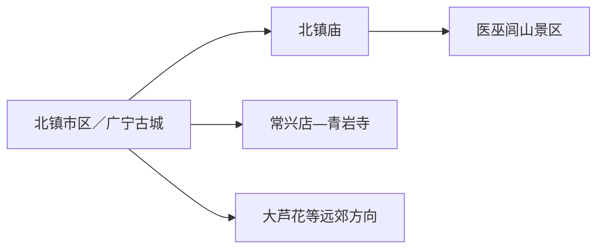
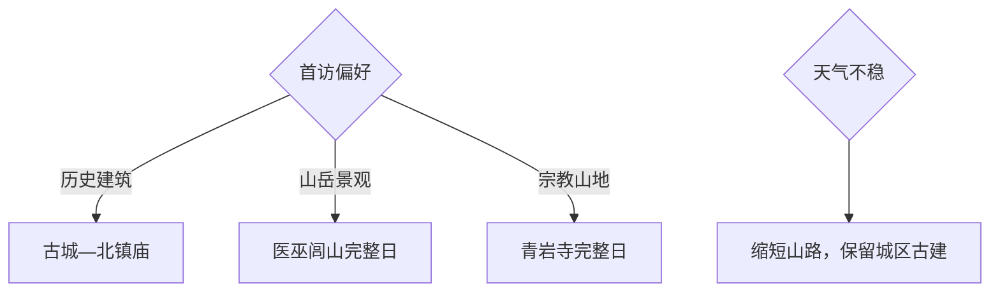

# 北镇旅行指南

北镇的旅行主线很清楚：在广宁古城一带看北镇庙、崇兴寺双塔和石坊，再把医巫闾山或青岩寺留作完整山地日。城区与山门距离不算远，但山路、宗教活动、花期和森林防火会显著改变节奏，适合先选一个核心山地目的地，再决定是否加第二天。

> 建议停留：1–2 天 
> 旅行关键词：医巫闾山、北镇庙、广宁古城、辽代遗存 
> 主要体力：城区低至中等；山地中等至较高 
> 最近研究：2026-08-12

## 城市速览

| 项目 | 旅行信息 |
|---|---|
| 主要旅行价值 | 以北方镇山医巫闾山为自然主线，以北镇庙、崇兴寺双塔和古城遗存理解辽西历史 |
| 建议停留 | 半天看城区古建；1天选城区或一处山地；2天组合城区与医巫闾山／青岩寺 |
| 较舒适季节 | 春季花期和秋季山色各有特点；夏季避开正午高温与强对流，冬季关注积雪结冰 |
| 预算特点 | 城区中低预算；山地门票、景交、往返车辆与可能的换宿是主要增量 |
| 步行强度 | 城区可分段步行；山地路线有台阶、坡道和较长上下行 |
| 主要天气风险 | 雷雨、大风、山洪、落石、森林火险和冬季结冰；以景区和气象公告选线 |
| 独行旅行 | 城区容易安排；山地以正式开放步道、日间往返和清晰返程为宜 |
| 亲子旅行 | 城区古建加短段山景较易控制；宗教场所、陡坡和拥挤节点需持续看护 |
| 长者与低体力旅行 | 选择北镇庙与城区古建，山地只走低段开放游线 |
| 无障碍信息 | 城区与景区单点设施可能不同，设施连续性需向官方确认 |

## 城市格局与游览区域

北镇市区延续“广宁”古城文脉，北镇庙位于城区西侧，医巫闾山山门继续向西。青岩寺在常兴店镇方向，是另一处完整山地宗教景区；大芦花等远点也各自需要半天以上，不适合与医巫闾山拼成同一短日。

| 区域 | 主要内容 | 游览特点 | 与其他区域的关系 |
|---|---|---|---|
| 广宁古城核心 | 崇兴寺双塔、李成梁石坊、街区公共空间 | 低至中等步行，适合半天 | 与北镇庙可同日车辆串联 |
| 北镇庙—闾山入口 | 北镇庙、医巫闾山 | 祭祀建筑与山岳景观相连 | 医巫闾山按完整半天至一天安排 |
| 常兴店方向 | 青岩寺景区 | 宗教建筑与山地步道结合 | 与城区往返需车辆，客流高峰更明显 |
| 远郊山地 | 大芦花等正式运营景区 | 距离与体力成本较高 | 作为第二个独立旅行日二选一 |

GeoNames `2037201` 沿用固定快照中的 `Beining` 名称，Wikidata `Q814966` 同时关联 `2037201` 与另一条北镇地名记录；本页以法定代码 `210782` 的县级北镇市为范围。“北宁”是历史名称，不另建第二座城市页。北镇由锦州市代管，锦州主城、义县和凌海属于跨城方向。

## 主要景点

### 城区与闾山北线

| 景点 | 区域 | 类型 | 主要看点 | 建议用时 | 室内外 | 体力 | 预约风险 | 天气影响 | 优先级 |
|---|---|---|---|---:|---|---|---|---|---|
| 医巫闾山风景区 | 市区西侧 | 山岳、国家级风景名胜区 | 北方镇山、黑油松林、山岳文化与正式步道 | 4–6小时 | 室外 | 中至高 | 中至高；门票、景交和开放线需核 | 高 | A |
| 北镇庙 | 城区西侧 | 全国重点文物保护单位、祭祀建筑 | 五镇祭祀体系中保存完整的镇山庙建筑群 | 1–1.5小时 | 室内外结合 | 低至中 | 中；开放、活动和维修需核 | 中 | A |
| 崇兴寺双塔 | 广宁古城 | 古塔、文物 | 辽代双塔与古城天际线 | 0.5–1小时 | 室外为主 | 低 | 中；保护范围和近距离开放需核 | 中 | B |
| 李成梁石坊 | 广宁古城 | 石刻、历史建筑 | 明代石坊雕刻与辽西人物史 | 0.5小时 | 室外 | 低 | 低至中；周边施工需核 | 中 | B |

### 南部与远郊山地

| 景点 | 区域 | 类型 | 主要看点 | 建议用时 | 室内外 | 体力 | 预约风险 | 天气影响 | 优先级 |
|---|---|---|---|---:|---|---|---|---|---|
| 青岩寺景区 | 常兴店镇 | 山地宗教景区 | 医巫闾山南端山谷、上中下院与季节景观 | 4–6小时 | 室外为主 | 中至高 | 高；宗教活动、客流和交通需核 | 高 | A |
| 大芦花景区 | 远郊山地 | 山谷、自然景区 | 山石、林地与季节景观 | 4–6小时 | 室外 | 中至高 | 高；运营、道路和入园需核 | 高 | C |
| 辽代帝陵相关遗址 | 医巫闾山周边 | 考古遗址、保护地 | 辽代陵寝与山地历史背景 | 以正式开放项目为准 | 室外 | 中 | 高；考古与保护范围优先 | 高 | C |

医巫闾山各景区、寺院、山门和内部景观应按运营方公布的父景区与入口组织，不把同一条登山线拆成多项。辽代陵址以博物馆、官方展览或明确开放遗址理解，保护范围和作业区按现场指引参观。

## 美食与餐饮

| 菜品或餐饮类型 | 常见区域 | 一个人用餐与常见份量 | 风味、过敏原与饮食限制 | 排队风险与替代方法 |
|---|---|---|---|---|
| 沟帮子熏鸡及熟食 | 城区与交通节点 | 可按份或重量购买，适合分享 | 含禽肉、盐、糖和香辛料，注意保存 | 选正规门店，小份试吃 |
| 北镇葡萄及季节水果 | 市区市场与正规采摘点 | 适合少量购买 | 注意糖分、农残清洗和个体过敏 | 采摘活动先核营业和采摘区 |
| 辽西烧烤 | 城区餐饮街区 | 多人共享更合适 | 常见羊肉、牛肉、海鲜、花生和芝麻 | 晚餐错峰，过敏原逐项询问 |
| 家常炖菜与面食 | 市区、景区入口镇 | 一人可选面食，小锅菜适合2人以上 | 常含肉类、小麦、大豆和较多盐 | 山地日前在城区解决正餐或自备简餐 |

## 经典行程

### 一日经典路线

**路线**：广宁古城 → 崇兴寺双塔 → 李成梁石坊 → 午餐 → 北镇庙 → 医巫闾山低段开放区

- **串联逻辑**：先看古城遗存，再沿城市西侧进入镇山祭祀与山岳文化主线。
- **预约锚点**：医巫闾山和北镇庙的开放、门票与景交。
- **休息安排**：城区午餐，北镇庙或景区游客中心补水。
- **时间不足时**：保留古城与北镇庙，删医巫闾山低段。

### 两日城市路线

**第1天**：古城核心 → 北镇庙。\
**第2天**：医巫闾山完整开放线路。

- **串联逻辑**：文化建筑与山地分日，第二天按天气和体力选择步道长度。
- **预约锚点**：山地门票、景交、开放线和返程车辆。
- **休息安排**：第一天城区休息；第二天用游客中心和正式服务点。
- **时间不足时**：第二天改走低段，不把全程压进半天。

### 三日深度路线

**第1天**：广宁古城与北镇庙。\
**第2天**：医巫闾山。\
**第3天**：青岩寺或大芦花二选一。

- **串联逻辑**：两处山地分别占一天，保留恢复和天气调整空间。
- **预约锚点**：第三天景区运营、宗教活动、车辆与返程。
- **休息安排**：山地日中途只在正式服务点休息。
- **时间不足时**：整段删除第三天。

### 雨天路线

**路线**：北镇庙开放建筑 → 城区午餐 → 古城短段与石坊外观

- **适用条件**：普通小雨可执行；雷暴、大风或山洪预警时转城区并缩短露天段。
- **预约锚点**：北镇庙当日开放和古建维修状态。
- **休息安排**：城区餐饮与室内公共空间。
- **时间不足时**：只保留北镇庙。

### 亲子或低体力路线

**亲子路线**：崇兴寺双塔外观 → 北镇庙 → 医巫闾山低段自然观察。\
**低体力路线**：车辆串联李成梁石坊 → 北镇庙 → 山门观景后返回。

- **减负方式**：亲子路线缩短连续爬升；低体力路线以古建与山门为主，不追求登高。
- **预约锚点**：景区低段开放、下客点、儿童规则和座椅。
- **休息安排**：北镇庙后回城区或游客中心充分休息。
- **时间不足时**：两类路线都保留北镇庙，删山地段。

### 远郊一日路线

**路线**：北镇市区 → 青岩寺或大芦花二选一 → 返回市区

- **适用条件**：天气稳定、景区开放且往返车辆明确时采用。
- **预约锚点**：门票、宗教活动、停车、景交和返程。
- **休息安排**：使用景区游客中心与正式餐饮点。
- **时间不足时**：整段改为北镇庙—古城半日。

## 住宿区域

| 区域 | 优点 | 缺点 | 适合人群 | 交通特点 |
|---|---|---|---|---|
| 北镇市区 | 餐饮、补给和前往各方向车辆较集中 | 到山门仍需接驳 | 首访、公共交通、两日游 | 适合每天从同一基地出发 |
| 闾山入口方向 | 清晨进入山地较方便 | 住宿与夜间服务选择需逐家核实 | 徒步、摄影、早出发 | 先确认正规登记与返程 |
| 沟帮子站方向 | 铁路抵离和跨城换乘更便利 | 与北镇市区及景区有距离 | 晚到早走、联程旅行 | 站名、接驳和末班需重查 |

## 市内交通

| 场景 | 建议与取舍 | 行前需要重查的内容 |
|---|---|---|
| 铁路抵达 | 沟帮子站等周边铁路节点需再转公路进入北镇市区 | 车次、站外接驳和末班 |
| 城区移动 | 古城点位可分段步行，北镇庙用公交或短途车辆衔接 | 公交、停车和施工 |
| 山地景区 | 正式公交、景区接驳或预约车辆比多次临时换乘稳定 | 景交、山门、返程和天气 |
| 自驾 | 适合医巫闾山、青岩寺和远郊二选一 | 山路、停车、火险和临时管制 |

## 不同旅行者须知

| 旅行维度 | 可行条件 | 主要取舍 | 需额外核对 |
|---|---|---|---|
| 独行旅行 | 城区与正规景区白天可独立完成 | 山地早出晚归需留足返程 | 手机信号、闭园和末班 |
| 亲子旅行 | 古建加短段自然观察 | 山坡、台阶和宗教高峰需减量 | 儿童票、推车、卫生间 |
| 长者或低体力旅行 | 以北镇庙和山门为核心 | 连续爬升不作默认安排 | 景交、下客点、座椅 |
| 无障碍需求 | 先确认单点入口和卫生间 | 古建、山路和车辆转移的连续性有限 | 设施连续性需向官方确认 |
| 摄影旅行 | 古塔、山林和秋色题材丰富 | 花期、云雾和红叶受天气影响 | 无人机、三脚架、宗教摄影 |
| 预算有限 | 住市区并只选一处山地 | 多景区车辆会增加成本 | 联票、优惠和总车费 |
| 山地与特殊天气 | 使用正式开放线路并留日照余量 | 强对流、火险、积雪时缩短或改城内 | 预警、闭园、道路和退改 |

## 行前核对

| 核对事项 | 为什么需要重查 | 建议核对时间 | 官方入口 |
|---|---|---|---|
| 医巫闾山 | 开放线路、景交、门票和防火管理会变化 | 购票前及当天 | [辽宁省人民政府·医巫闾山](https://www.ln.gov.cn/web/sqgk/whly/ajjq/jz/2025101410380383713/index.shtml) |
| 青岩寺 | 宗教活动、客流、交通和开放范围会变化 | 出发前一周及当天 | [辽宁省文化和旅游厅·青岩寺](https://whly.ln.gov.cn/whly/wlzt/sjly/ajjq/2025112415403322542/index.shtml) |
| 北镇庙与古城文物 | 维修、活动和文物保护边界会调整 | 到访前一日 | [辽宁省文化和旅游厅·北镇庙](https://whly.ln.gov.cn/whly/wlzt/lnww/zdwwbhdw/8DE8BA7A397F4130A33E20A2B72EC3D1/index.shtml) |
| 铁路与公路 | 班次、接驳和末班具有时效性 | 购票前及当天 | [中国铁路12306](https://www.12306.cn/) |
| 山地天气与火险 | 大风、雷雨、积雪和火险决定可走线路 | 出发前三日及当天 | [辽宁省气象局](http://ln.cma.gov.cn/) |

## 来源与更新记录

### 主要来源

| 来源 | 类型 | 支持内容 | 核验日期 |
|---|---|---|---|
| [辽宁省人民政府：医巫闾山风景区](https://www.ln.gov.cn/web/sqgk/whly/ajjq/jz/2025101410380383713/index.shtml) | 省政府文旅资料 | 医巫闾山属地、山岳文化和景区身份 | 2026-08-12 |
| [辽宁省文化和旅游厅：青岩寺景区](https://whly.ln.gov.cn/whly/wlzt/sjly/ajjq/2025112415403322542/index.shtml) | 省级文旅主管部门 | 青岩寺位置、景区等级与山地属性 | 2026-08-12 |
| [辽宁省文化和旅游厅：北镇庙](https://whly.ln.gov.cn/whly/wlzt/lnww/zdwwbhdw/8DE8BA7A397F4130A33E20A2B72EC3D1/index.shtml) | 省级文物资料 | 北镇庙位置、祭祀属性与保护价值 | 2026-08-12 |
| [Wikidata：Q814966](https://www.wikidata.org/wiki/Special:EntityData/Q814966.json) | 开放结构化数据 | 北镇实体与双GeoNames标识 | 2026-08-12 |
| [GeoNames：2037201](https://sws.geonames.org/2037201/about.rdf) | 开放地名数据 | 固定快照Beining记录 | 2026-08-12 |
| [民政部行政区划代码查询](https://dmfw.mca.gov.cn/xzqh/getList?code=210782&trimCode=false&maxLevel=3) | 国家行政区划数据 | 法定代码210782 | 2026-08-12 |

### 更新记录

| 日期 | 更新内容 |
|---|---|
| 2026-08-12 | 首次完成北镇指南，明确古城、医巫闾山与青岩寺的分日选择及Beining标识粒度 |
