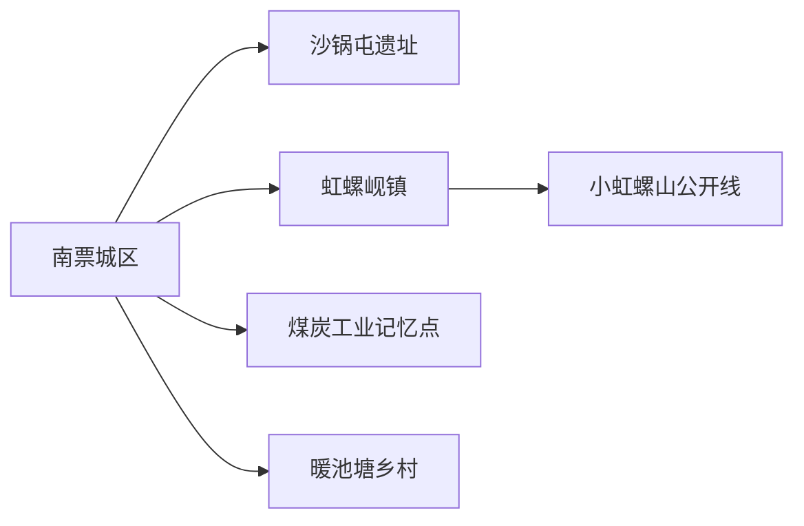
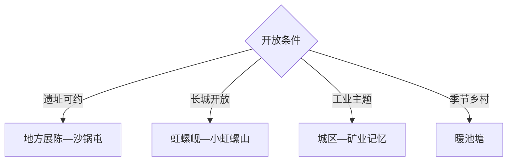

# 南票旅行指南

南票适合做辽西工业记忆、史前遗址与山地乡村的专题短途：沙锅屯遗址是考古主线，虹螺山及小虹螺山长城方向适合在正式开放信息明确时进入，南票煤炭矿山记忆和暖池塘乡村可作为预约补充。公共接待仍较分散，建议以葫芦岛城区为基地。

## 城市速览

| 项目 | 信息 |
|---|---|
| 主线 | 南票城区—沙锅屯遗址—虹螺岘—小虹螺山公开线—暖池塘乡村 |
| 停留 | 专题1天；增加乡村山地共2天 |
| 住宿 | 南票城区适合本地换线，葫芦岛主城住宿选择更集中 |
| 交通 | 从葫芦岛乘公路进入，区内远点以预约车或自驾为主 |
| 风险 | 矿区边界、山地林火、遗址洞穴封控、冬季冰雪和通信盲区 |
| 边界 | 生产矿区、塌陷治理区、遗址保护区、未开放长城与自然保护地按许可进入 |

## 城市格局与游览区域

固定 `Nanpiao / GeoNames 2035644` 对应南票区，本页以法定南票区 `Q1333179` 组织。区内点位跨度大且开放成熟度不同，应先锁定遗址或官方活动，再决定是否增加山地与乡村。

## 主要景点

| 景点 | 区域 | 类型 | 核心体验 | 用时 | 环境 | 体力 | 预约风险 | 天气影响 | 优先级 |
|---|---|---|---|---:|---|---|---|---|---|
| 沙锅屯遗址相关公开展陈 | 沙锅屯乡 | 考古遗址 | 洞穴遗址、辽西史前文化与考古史 | 2–4小时 | 室内外 | 中 | 极高 | 高 | A |
| 南票区地方展陈 | 城区 | 地方文博 | 区史、煤炭工业与社会变迁 | 1.5–3小时 | 室内 | 低 | 极高 | 低 | A |
| 小虹螺山长城当期开放段 | 虹螺岘方向 | 长城遗产 | 辽西长城、山体与聚落关系 | 半日至1天 | 室外 | 高 | 极高 | 极高 | B |
| 虹螺山自然保护地公开体验区 | 虹螺岘方向 | 山地生态 | 辽西山林与自然教育 | 半日至1天 | 室外 | 高 | 极高 | 极高 | B |
| 南票煤炭工业记忆公开点 | 城区及矿区外围 | 工业遗产 | 煤城发展、矿业社区与生态修复 | 2–4小时 | 室内外 | 低中 | 极高 | 中 | B |
| 虹螺岘镇公开街区 | 虹螺岘镇 | 地方生活 | 干豆腐饮食、辽西集镇与山地门户 | 2–3小时 | 室外 | 低 | 中 | 中 | B |
| 暖池塘镇正规乡村接待点 | 暖池塘镇 | 乡村农旅 | 山村、农产与季节活动 | 半日 | 室外 | 中 | 很高 | 很高 | C |
| 九龙街道或城区公共空间 | 城区 | 城市观察 | 矿业转型社区与日常生活 | 1–2小时 | 室外 | 低 | 低 | 中 | C |

## 美食与餐饮

可尝虹螺岘干豆腐、东北炖菜、酸菜、烧烤与辽西家常菜。乡镇餐饮提前确认营业和份量；山地日自备水与简餐，购买农产品按正规经营点和清晰计价选择。

## 经典行程

### 一日经典线
**路线**：地方展陈—沙锅屯遗址公开点—虹螺岘镇。**逻辑**：从区史到史前遗址，再用集镇补充现实地理。**预约锚点**：展陈、遗址管理与车辆。**休息**：虹螺岘镇。**删除条件**：遗址未开放时改工业记忆线。

### 两日专题线
**路线**：首日考古与城区；次日小虹螺山当期开放项目。**逻辑**：遗址和高强度长城山地分日。**预约锚点**：开放段、导览、天气与保险。**休息**：城区。**删除条件**：林火、雨雪或未正式开放时取消山地。

### 工业记忆线
**路线**：区级展陈—矿业社区公开空间—生态修复观察点。**逻辑**：用公开资料理解煤炭产业与转型。**预约锚点**：展馆与正规讲解。**休息**：城区。**删除条件**：接待未确认时只留公共展陈。

### 长城山地线
**路线**：虹螺岘镇—公布入口—开放长城段—原路返程。**逻辑**：以官方开放和导览为前提。**预约锚点**：入口、向导、轨迹与林火。**休息**：镇区。**删除条件**：无明确开放信息时取消。

### 乡村季节线
**路线**：暖池塘正规接待点—村落活动—乡镇午餐。**逻辑**：围绕已确认的季节项目慢游。**预约锚点**：活动、供餐与道路。**休息**：接待点。**删除条件**：季节或接待不匹配时改城区。

### 亲子考古线
**路线**：地方展陈—预约考古讲解—城区公园。**逻辑**：以资料和讲解替代洞穴探险。**预约锚点**：年龄、开放与讲解。**休息**：展馆。**删除条件**：遗址不接待时只留展陈。

### 低体力线
**路线**：地方展陈—车辆游矿业社区外围—虹螺岘午餐。**逻辑**：用平路和车辆观察控制强度。**预约锚点**：落客与餐饮。**休息**：城区。**删除条件**：道路结冰时留在城区。

## 住宿区域

南票城区适合专题访问与次日换线；葫芦岛主城区适合更多住宿餐饮并当日往返；虹螺岘和暖池塘只在正规接待确认后住宿。预订关注供暖、夜间交通、消防和天气退改。

## 市内交通

公共景点分散，先与管理单位确认开放，再预约合规车辆。矿区和生态修复区外围道路可能与生产运输交叉，按交通标识通行；山地保存离线地图、设置折返点并在天黑前返回。

## 不同旅行者须知

考古爱好者以展陈和预约讲解为主；工业爱好者只参观公开点；徒步者等待明确开放；亲子家庭不以洞穴探险替代科普。生产矿区、采空治理区、遗址洞穴、自然保护地核心区和未开放长城保留明确限制。

## 行前核对

- 核对地方展陈、沙锅屯遗址、长城段、乡村接待和正规讲解。
- 核对林火、雨雪、道路、通信、返程车辆和应急物资。
- 工业与遗址点按管理边界参观，山地无明确开放信息时选择城区方案。

## 来源与更新记录

| 来源 | 支持内容 | 核验日期 |
|---|---|---|
| [辽宁省文旅厅：沙锅屯遗址](https://whly.ln.gov.cn/whly/wlzt/lnww/zdwwbhdw/D443E49A570445BFB77DDC2FB0F377DE/index.shtml) | 遗址位置、发现与考古属性 | 2026-09-01 |
| [辽宁省政府：葫芦岛文旅](https://www.ln.gov.cn/web/ywdt/tpxx/2024101509320864177/index.shtml) | 南票煤炭矿山公园与虹螺古镇规划状态 | 2026-09-01 |
| [GeoNames 2035644](https://www.geonames.org/2035644/) | Nanpiao 固定城区点 | 2026-09-01 |
| [Wikidata Q1333179](https://www.wikidata.org/wiki/Q1333179) | 南票区实体与跨库标识 | 2026-09-01 |

| 日期 | 更新 |
|---|---|
| 2026-09-01 | 首次完成南票旅行研究，按考古、工业记忆、长城山地与乡村组织。 |
