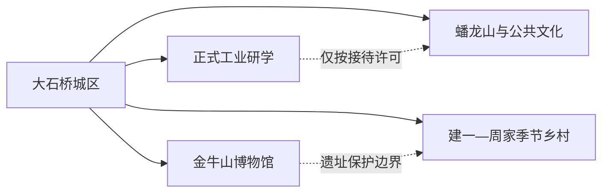
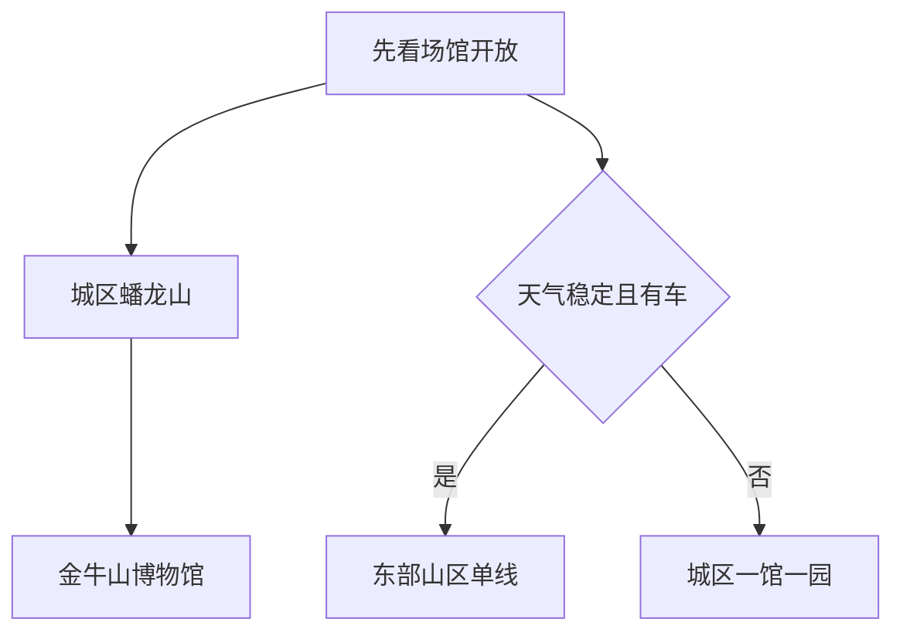

# 大石桥旅行指南

大石桥是营口代管的县级市，主城区适合用蟠龙山和城市公共文化认识地方生活，金牛山博物馆与古人类遗址提供史前主题，东部建一—周家山区则适合有车旅行者按季节选择乡村线。先住城区、再选“金牛山”或“东部山区”一个方向，最容易控制交通和体力。

> 建议停留：城区半日至 1 天；金牛山或东部山区各另留半日至 1 天  
> 旅行关键词：金牛山古人类、蟠龙山、辽南乡村、镁都工业背景  
> 主要体力：城区低至中等；山区为中高  
> 最近研究：2026-08-13

## 城市速览

| 项目 | 旅行信息 |
|---|---|
| 主要旅行价值 | 从金牛山博物馆理解辽南史前人类，从蟠龙山看县级城市公共生活，再按季节进入具名乡村接待点 |
| 建议停留 | 1 天可做城区与金牛山；2 天再选建一—周家山区。工业专题只在运营主体明确接待时加入 |
| 较舒适季节 | 春秋适合城市和乡村；夏季注意暴雨、山洪和高温；冬季注意道路结冰和寒风 |
| 预算特点 | 城区成本较低；远镇车辆、研学讲解和乡村接待是主要增量 |
| 步行强度 | 蟠龙山和金牛山短线为中等；东部山地随线路升高 |
| 主要天气风险 | 雷雨、暴雨、山洪、滑坡、森林火险、寒潮和结冰 |
| 独行旅行 | 城区可自行安排；远镇先锁返程与通信 |
| 亲子旅行 | 金牛山博物馆和蟠龙山短线较合适；遗址保护区和乡村研学服从现场边界 |
| 长者与低体力旅行 | 选择城区单馆、车辆落客和蟠龙山低强度公共段 |
| 无障碍信息 | 城区公共设施可优先咨询；遗址、山地和乡村的设施连续性需向官方确认 |

## 城市格局与游览区域

大石桥市法定代码为 `210882`。固定 GeoNames `2037823` 是主城居民点；Wikidata `Q1171889` 表达县级市，其 GeoNames 属性连接更广的行政记录 `2033368`。本页保留固定居民点作为覆盖锚点，以法定代码和县级市实体确定完整市域。

| 区域 | 主要内容 | 怎么安排 | 边界提示 |
|---|---|---|---|
| 主城区 | 蟠龙山、公共文化、餐饮住宿与铁路门户 | 首日或雨天底盘 | 城市公园与周边文化设施分别核开放 |
| 永安—金牛山 | 金牛山博物馆、遗址保护展示与西田纪念空间 | 半日至一日 | 博物馆开放不等于考古遗址全部开放 |
| 建一—周家山区 | 黄丫口、古松、赏花与具名乡村接待 | 季节性一日线 | 先确认接待点、道路和返程 |
| 汤池—东部乡村 | 农业、山地和当期活动 | 按官方活动择一 | 农田、林场和水库保持生产保护边界 |
| 南楼—官屯产业带 | 镁材料、矿山和工业城镇 | 只参加正式工业研学 | 厂区、矿山、专用铁路和堆场不开放 |

金牛山博物馆是面向公众理解古人类遗址的优先入口。考古洞穴、发掘区和保护工程按文物部门开放范围进入；生产中的镁矿、耐火材料企业、铁路专用线和采石道路则只在正式研学项目中参观。

## 主要景点

### 城区与史前主题

| 景点 | 区域 | 类型 | 主要看点 | 建议用时 | 室内外 | 体力 | 预约风险 | 天气影响 | 优先级 |
|---|---|---|---|---:|---|---|---|---|---|
| 蟠龙山公园 | 主城区 | 3A 城市公园 | 百年城市公园、纪念空间与城市眺望 | 2–4 小时 | 室外为主 | 中 | 低至中 | 高 | A |
| 金牛山博物馆 | 永安镇西田村 | 史前考古博物馆 | 金牛山古人类、旧石器和用火遗迹 | 2–3 小时 | 室内为主 | 低至中 | 高 | 低 | A |
| 金牛山遗址正式展示区 | 永安镇 | 全国重点文保、考古遗址 | 遗址环境与当期保护展示 | 1–2 小时 | 室外 | 中 | 很高 | 高 | B |
| 西田纪念馆等具名研学点 | 永安镇 | 红色与乡村展陈 | 地方历史和乡村研学 | 1–2 小时 | 室内 | 低 | 很高 | 低 | C |

### 东部山区与乡村

| 景点 | 区域 | 类型 | 主要看点 | 建议用时 | 室内外 | 体力 | 预约风险 | 天气影响 | 优先级 |
|---|---|---|---|---:|---|---|---|---|---|
| 黄丫口及周边具名开放点 | 建一镇 | 山地乡村 | 古松、山村与季节景观 | 4–7 小时 | 室外 | 中高 | 高 | 很高 | B |
| 建一镇季节赏花线路 | 建一镇 | 乡村与农业 | 当期花期、村庄与正式接待活动 | 3–6 小时 | 室外 | 中 | 很高 | 很高 | C |
| 正式工业文化接待点 | 南楼—官屯 | 工业研学 | 镁材料城市背景和合规展陈 | 2–4 小时 | 混合 | 低至中 | 很高 | 中 | C |

## 美食与餐饮

| 类型 | 适合区域 | 份量与选择 | 饮食提醒 | 怎么选 |
|---|---|---|---|---|
| 辽菜与炖菜 | 主城区 | 2–4 人分享更合适 | 油盐较高，炖菜可能含动物油 | 按人数点半份或小份 |
| 羊汤、烧烤与面食 | 城区、镇区 | 单人较方便 | 内脏、孜然、辣椒与酒精按需确认 | 选通风、明码标价门店 |
| 海鲜与河鲜 | 城区正规餐馆 | 先问计价单位 | 过敏、冷链、生食风险 | 优先熟制并确认来源 |
| 山野菜与农家菜 | 建一、周家具名接待点 | 多人桌餐常见 | 野生菌和来源不明植物风险较高 | 只吃经营者可说明来源的熟制菜 |

## 经典行程

### 一日经典路线

**路线**：蟠龙山公园 → 城区午餐 → 金牛山博物馆 → 按开放范围看遗址展示 → 返回城区。

- **串联逻辑**：先看现代城市，再用博物馆进入史前主题。
- **适用条件**：场馆开放且有可靠车辆。
- **预约锚点**：金牛山博物馆和遗址开放范围。
- **休息安排**：城区午休、博物馆服务区短休。
- **时间不足时**：保留博物馆，蟠龙山只走低强度短段。

### 两日城市路线

**第 1 天**：城区与金牛山。  
**第 2 天**：建一—周家具名乡村接待点或正式工业研学二选一。

- **串联逻辑**：第一天完成稳定核心，第二天按兴趣进入远线。
- **适用条件**：已确认第二天接待主体和车辆。
- **预约锚点**：乡村活动或工业接待许可。
- **休息安排**：镇区正规餐饮和明确服务点。
- **时间不足时**：第二天整段删除，留在城区。

### 三日深度路线

**第 1 天**：主城。  
**第 2 天**：金牛山专题。  
**第 3 天**：东部山区季节线。

- **串联逻辑**：把城市、考古和山地拆开，给讲解与交通留余量。
- **适用条件**：专题学习、摄影或自驾旅行者。
- **预约锚点**：博物馆讲解、乡村接待和天气。
- **休息安排**：每天只设一个主目的地并保留午休。
- **时间不足时**：删第三天。

### 雨天路线

**路线**：金牛山博物馆 → 城区午餐 → 当期公共展览。

- **串联逻辑**：以室内展陈替代山区活动。
- **适用条件**：普通降雨、道路正常；高等级预警减少移动。
- **预约锚点**：场馆开放。
- **休息安排**：馆内和城区商业区。
- **时间不足时**：只保留金牛山博物馆。

### 亲子或低体力路线

**亲子方案**：金牛山博物馆精选展 → 午餐 → 蟠龙山公共段。  
**低体力方案**：车辆落客博物馆 → 长休 → 城区短停。

- **串联逻辑**：把知识型场馆与可退出的城市公园组合。
- **适用条件**：先确认讲解、落客和座席。
- **预约锚点**：场馆和无障碍协助。
- **休息安排**：每 60–90 分钟休息。
- **时间不足时**：删除公园段。

### 远郊一日路线

**路线**：主城 → 建一镇具名开放点 → 镇区午餐 → 黄丫口或当期赏花线路 → 返程。

- **串联逻辑**：沿同一山区方向完成，不跨到工业片区。
- **适用条件**：道路、天气、接待和返程均已确认。
- **预约锚点**：属地接待点与车辆。
- **休息安排**：镇区和正式服务点。
- **时间不足时**：只保留一个具名接待点。

## 住宿区域

| 区域 | 优点 | 取舍 | 适合人群 | 交通提示 |
|---|---|---|---|---|
| 主城区 | 餐饮、铁路、公路和医疗集中 | 远线需车辆 | 首访、独行、多日者 | 核对到大石桥站/客运点距离 |
| 永安镇附近具名住宿 | 便于金牛山早入 | 选择和夜间服务较少 | 考古专题、研学团 | 先确认接送与晚餐 |
| 东部山区正规民宿 | 减少季节线往返 | 运营、供暖、通信和退改变化大 | 自驾、慢旅行 | 只订证照和地址清楚的住宿 |

## 市内交通

| 场景 | 建议方式 | 怎么做 | 动态核对 |
|---|---|---|---|
| 跨城抵达 | 铁路、道路客运、自驾 | 以票面站名和实际住宿为准 | 车次、站址、末班 |
| 金牛山 | 公交、出租/网约或自驾 | 先确认博物馆入口 | 开放、停车和返程 |
| 东部山区 | 合规包车或自驾 | 一天一个方向 | 山路、火险、通信和加油 |
| 工业研学 | 接待单位车辆或合规交通 | 服从名单和路线 | 许可、劳保、摄影和年龄规则 |

## 不同旅行者须知

| 旅行者 | 优先选择 | 需要确认 | 备选方案 |
|---|---|---|---|
| 独行者 | 主城和金牛山 | 返程、场馆开放 | 城区一园一馆 |
| 亲子家庭 | 金牛山博物馆 | 讲解、遗址边界、儿童设施 | 蟠龙山短线 |
| 长者与低体力者 | 车辆落客单馆 | 台阶、坡道、卫生间 | 主城公共文化 |
| 自驾者 | 东部山区一日 | 路况、火险、停车 | 改走城区 |
| 工业主题者 | 正式研学项目 | 接待许可、劳保、拍摄 | 用公共展览替代 |

## 行前核对

- 在[大石桥市人民政府](https://www.dsq.gov.cn/)和[营口市人民政府](https://www.yingkou.gov.cn/)查看文旅、交通和预警。
- 金牛山先确认博物馆开放、讲解和遗址展示范围。
- 东部山区核道路、山洪、火险、通信和返程。
- 工业主题只使用运营单位明确的接待路线。
- 通过 12306 和客运运营方核对到发。
- 无障碍旅行逐段确认车站、车辆、场馆和住宿。

## 来源与更新记录

### 主要来源

| 来源 | 机构 | 支持内容 | 核验日期 |
|---|---|---|---|
| [蟠龙山公园](https://www.yingkou.gov.cn/005/005002/005002002/20190513/46c395fd-6ad6-45d4-a80d-f667915bab2c.html) | 营口市人民政府 | 城市公园、3A 身份和公共文化设施 | 2026-08-13 |
| [金牛山遗址](https://whly.ln.gov.cn/whly/wlzt/lnww/zdwwbhdw/BB5FDB4E96AB4CCDA33CFD5B7D1BCD5B/index.shtml) | 辽宁省文化和旅游厅 | 遗址性质、位置和保护利用方向 | 2026-08-13 |
| [金牛山古人类遗址](https://wlgd.yingkou.gov.cn/005/20190526/fecc188c-3667-49e7-b790-550fee3f57c2.html) | 营口市文旅主管部门 | 发掘历史、博物馆与古人类主题 | 2026-08-13 |
| [大石桥“研学+农文旅”](https://www.yingkou.gov.cn/govxxgk/ykszf/2025-05-14/5a49f179-1316-4677-89b1-77c54f39b50d.html) | 营口市人民政府 | 金牛山博物馆、西田纪念馆和乡村研学 | 2026-08-13 |
| [建一镇乡村旅游资料](https://www.yingkou.gov.cn/001/001001/20250522/83b74d25-ccb1-47f4-a19d-5ac5dec72960.html) | 营口市人民政府 | 东部山区季节乡村线索 | 2026-08-13 |
| [GeoNames 2037823](https://sws.geonames.org/2037823/about.rdf) | GeoNames | 固定主城居民点 | 2026-08-13 |
| [Wikidata Q1171889](https://www.wikidata.org/wiki/Q1171889) | Wikidata | 大石桥市实体与行政记录关系 | 2026-08-13 |
| [民政部行政区划代码服务](https://dmfw.mca.gov.cn/xzqh/getList?code=210882&trimCode=false&maxLevel=3) | 民政部 | 法定代码和县级市层级 | 2026-08-13 |
| [辽宁省气象局](http://ln.cma.gov.cn/) | 气象主管部门 | 天气与灾害预警 | 2026-08-13 |

### 更新记录

| 日期 | 更新内容 |
|---|---|
| 2026-08-13 | 建立研究版；区分固定居民点与县级市行政实体；按主城、金牛山、东部山区和工业生产边界组织可执行路线。 |
