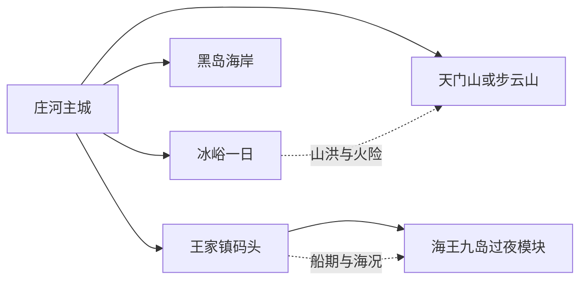
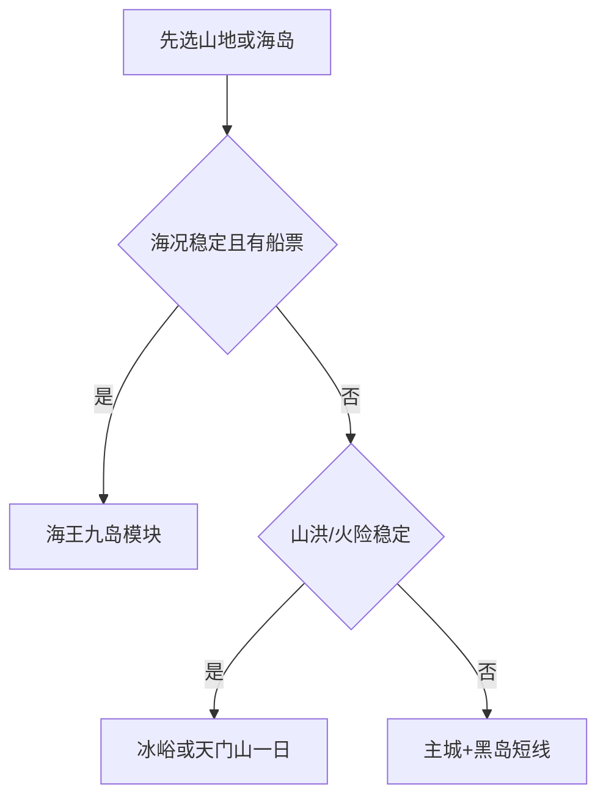

# 庄河旅行指南

庄河位于大连东北部，主城区、冰峪—仙人洞、天门山—步云山、黑岛海岸和海王九岛是五套不同交通系统。首访先选一条自然主题，再决定是否住在主城、山地或海岛；把每个远点都当作“一整日模块”，比从大连或庄河城区连续赶场更可靠。

> 建议停留：主城半日至 1 天；冰峪、天门山或海岛各另留 1–2 天  
> 旅行关键词：冰峪沟、海王九岛、天门山、步云山、黑岛、黄海海岸  
> 主要体力：主城低；山地、峡谷和海岛为中高  
> 最近研究：2026-08-13

## 城市速览

| 项目 | 旅行信息 |
|---|---|
| 主要旅行价值 | 在冰峪和天门山看辽南山水，在步云山体验温泉与山地，在黑岛和海王九岛认识黄海海岸与岛屿生活 |
| 建议停留 | 1 天只选主城或一个近郊方向；2–3 天可完成一条山地线；海王九岛需把船期和岛上住宿单列 |
| 较舒适季节 | 春秋适合山地，夏季适合海岸但受台风、雷雨和海况影响，冬季按道路、冰雪和景区运营选择 |
| 预算特点 | 城区成本较稳；峡谷门票、山地车辆、海岛船票与旺季住宿是主要增量 |
| 步行强度 | 城区低；冰峪、天门山和岛屿步道为中高，乘船本身也需上下码头 |
| 主要天气风险 | 暴雨、山洪、滑坡、雷电、大风、浓雾、海浪、台风、冬季结冰和森林火险 |
| 独行旅行 | 主城方便补给；山地与海岛把返程、通信和住宿提前锁定 |
| 亲子旅行 | 黑岛公共海滨、博物馆和正式景区短线较易安排；船艇、峡谷与攀爬项目逐项核规则 |
| 长者与低体力旅行 | 选择主城、车辆接驳的单一景区或海滨短段；岛屿码头和山地连续无障碍需逐点确认 |
| 无障碍信息 | 城区新设施可优先询问；山地、峡谷、沙滩、码头和船舶的设施连续性需向官方确认 |

## 城市格局与游览区域

庄河市是大连市代管的法定县级市，代码 `210283`。GeoNames `1784055` 为庄河城市点，Wikidata `Q198159` 的 GeoNames 属性与之精确对应。城市点帮助识别主城区，法定代码和属地政府资料用于界定包含乡镇、山地和海岛的完整市域。

| 区域 | 主要内容 | 怎么安排 | 交通关系 |
|---|---|---|---|
| 庄河主城区 | 城市公共文化、市场、住宿与铁路公路门户 | 抵离、补给和雨天底盘 | 远景区仍需车辆 |
| 冰峪—仙人洞 | 冰峪山水、峡谷和正式游船/步道 | 单列一日，旺季可近景区住一晚 | 与主城往返时间较长 |
| 天门山—步云山 | 山岳、森林、温泉与乡村 | 两者按兴趣择一或分两天 | 山路和冬季状态影响明显 |
| 黑岛—南部海岸 | 海滨、纪念空间与当期开放滨海项目 | 半日至一日 | 潮汐、海风和浴场管理决定活动 |
| 王家镇—海王九岛 | 海岛景观、渔业社区与海上交通 | 至少一整日，常需过夜 | 船期、码头、实名和海况是核心 |
| 北部乡村与生产空间 | 林业、农业、采石矿产、水库和乡村接待 | 只加入具名开放项目 | 生产道路和保护地保持边界 |

海王九岛是由多座岛屿和海域组成的完整度假区，本页按一个海岛目的地核算，不把每座小岛重复列为“景点”。冰峪、天门山和步云山也各有自己的入口与运营范围；沿正式景区、公共海岸和具名接待空间游览即可，海洋保护、养殖作业、林业生产和封闭矿区维持明确边界。

## 主要景点

### 城区、山地与峡谷

| 景点 | 区域 | 类型 | 主要看点 | 建议用时 | 室内外 | 体力 | 预约风险 | 天气影响 | 优先级 |
|---|---|---|---|---:|---|---|---|---|---|
| 庄河市博物馆或当期公共展览 | 主城区 | 公共文化 | 地方历史、海洋与山地县域背景 | 1.5–2.5 小时 | 室内 | 低 | 中 | 低 | A |
| 冰峪省级旅游度假区正式开放单元 | 仙人洞镇 | 峡谷、山水 | 辽南山水、河谷、正式步道与当期游船 | 6–9 小时 | 室外 | 中高 | 高 | 很高 | A |
| 大连天门山国家森林公园 | 仙人洞—北部山地 | 森林、山岳 | 森林景观、山地步道与季节景色 | 6–9 小时 | 室外 | 高 | 高 | 很高 | A |
| 步云山温泉与正式山地接待点 | 步云山乡 | 温泉、山地 | 辽南高海拔乡村、温泉与正式开放项目 | 5–8 小时 | 混合 | 中 | 高 | 高 | B |
| 城山古城等具名文保开放点 | 城山方向 | 历史遗址 | 地方历史与遗址环境；开放范围随保护安排 | 2–4 小时 | 室外 | 中 | 高 | 高 | C |

### 海岸与海岛

| 景点 | 区域 | 类型 | 主要看点 | 建议用时 | 室内外 | 体力 | 预约风险 | 天气影响 | 优先级 |
|---|---|---|---|---:|---|---|---|---|---|
| 大连海王九岛旅游度假区 | 王家镇海域 | 4A 海岛度假区 | 多岛海岸、渔业社区与正式海上活动 | 1–2 天 | 室外为主 | 中高 | 很高 | 很高 | A |
| 黑岛旅游度假区当期开放单元 | 黑岛镇 | 海滨、历史 | 公共海滨、海岸景观与纪念主题 | 4–7 小时 | 室外为主 | 中 | 高 | 很高 | B |
| 蛤蜊岛或主城近海正式开放点 | 南部海岸 | 海滨、湿地 | 海湾、潮间带与候鸟观察条件 | 3–6 小时 | 室外 | 中 | 很高 | 很高 | C |
| 石城岛等具名客运海岛 | 石城乡 | 海岛与社区 | 岛屿生活、海岸和正式客运可达空间 | 1–2 天 | 室外为主 | 中高 | 很高 | 很高 | C |

进入海岛先完成船票、住宿和返程闭环。海上养殖区、军港和作业码头不作为观景捷径；赶海只在允许时段和区域进行，并遵守禁渔、保护物种和工具限制。

## 美食与餐饮

| 类型 | 适合区域 | 份量与选择 | 饮食提醒 | 怎么选 |
|---|---|---|---|---|
| 黄海海鲜 | 主城、黑岛、海岛正规餐馆 | 多人拼盘常见，单人按只数或小份点 | 先问时价、计量、加工费、可食重量与熟度 | 选择明码标价、冷链和后厨信息清楚的店 |
| 庄河大骨鸡等地方禽肉 | 主城与乡镇家常菜馆 | 适合 2–4 人分享 | 骨多、炖制时间长，汤底可能高盐 | 提前问份量，搭配蔬菜和主食 |
| 羊汤、炖菜与农家菜 | 山地镇区 | 单碗至多人锅 | 汤底、内脏、动物油和香菜按需确认 | 远线用餐以镇区和具名接待点为主 |
| 草莓、蓝莓等时令农产 | 城区市场、具名采摘园 | 按斤购买 | 花期不等于采收期，采摘区有生产边界 | 查看当期农业或经营方公告 |
| 海岛渔家餐 | 海王九岛、石城岛正规住宿 | 常与住宿套餐绑定 | 鱼获、餐标、饮水和过敏原提前问清 | 书面确认餐次、价格、退改和停航处理 |

## 经典行程

### 一日经典路线

**路线**：庄河主城出发 → 冰峪正式入口 → 核心步道或当期游船 → 景区服务区午休 → 原路返回。

- **串联逻辑**：全天只处理一个大型山水景区。
- **适用条件**：天气、道路和景区运营稳定，已锁定去返车辆。
- **预约锚点**：门票、游船/内部交通与最后离园。
- **休息安排**：游客中心和正式服务区。
- **时间不足时**：缩短内部线路，不追加天门山或步云山。

### 两日城市路线

**第 1 天**：主城公共文化 → 市场或生活街区 → 早休。  
**第 2 天**：冰峪、天门山或黑岛三选一。

- **串联逻辑**：第一天完成抵达和补给，第二天把完整时段交给远线。
- **适用条件**：铁路/公路抵达、住在主城者。
- **预约锚点**：第二天景区和车辆。
- **休息安排**：主城午休，远线使用正式服务点。
- **时间不足时**：首日缩成晚餐与补给，第二天仍只保留一个方向。

### 三日深度路线

**第 1 天**：主城。  
**第 2 天**：冰峪完整日。  
**第 3 天**：天门山、步云山或黑岛三选一。

- **串联逻辑**：峡谷、山岳/温泉、海岸分日体验。
- **适用条件**：自驾、包车或已确认景区接驳。
- **预约锚点**：两条远线的入口和天气。
- **休息安排**：每天中段安排完整午休。
- **时间不足时**：删除第三天，不把两座山压成一天。

### 雨天路线

**路线**：主城公共展览 → 午餐 → 市区市场与咖啡/茶空间 → 提前返店。

- **串联逻辑**：活动集中在城区，避免进入峡谷和海岸。
- **适用条件**：普通降雨且城区交通正常；高等级预警按官方指引调整。
- **预约锚点**：公共场馆开放。
- **休息安排**：馆内座席和城区商业空间。
- **时间不足时**：只留一座场馆和一顿正餐。

### 亲子或低体力路线

**亲子方案**：主城展览 → 午餐 → 黑岛正式开放短段或具名农业体验。  
**低体力方案**：车辆抵达单一主景点 → 服务区休息 → 原路返回。

- **串联逻辑**：减少跨区和连续登高，把体验放在可随时退出的空间。
- **适用条件**：亲子核水域与船艇规则；低体力者核落客和卫生间。
- **预约锚点**：场馆、浴场/海滨管理和农业接待。
- **休息安排**：每段之间安排 60 分钟以上休息。
- **时间不足时**：删除户外段。

### 远郊一日路线

**天门山线**：主城 → 天门山正式入口 → 核心步道 → 返程。  
**步云山线**：主城 → 具名温泉或山地接待点 → 镇区午休 → 返程。  
**海岛线**：王家镇正式码头 → 海王九岛 → 岛上过夜或按票面返航。

- **串联逻辑**：三条线分别处理森林、温泉和海岛，一次只选一条。
- **适用条件**：山地线看预警与火险；海岛线有实名船票、住宿和备选停航方案。
- **预约锚点**：景区、温泉、船票、住宿与返程。
- **休息安排**：游客中心、镇区或岛上正规住宿。
- **时间不足时**：山地缩短步道；海岛线整段顺延，不改成临时私船。

## 住宿区域

| 区域 | 优点 | 取舍 | 适合人群 | 交通提示 |
|---|---|---|---|---|
| 庄河主城区 | 交通、餐饮、补给和医疗最集中 | 远景区需早出晚归 | 首访、独行、多方向行程 | 先核到庄河北站/客运点的距离 |
| 冰峪—仙人洞镇 | 便于景区早入和慢游 | 餐饮、叫车和淡季营业有限 | 冰峪深度、山地摄影 | 书面确认接送与退改 |
| 步云山方向 | 温泉和山地体验集中 | 夜间交通和医疗距离增加 | 温泉休闲、自驾 | 核实道路、供暖和餐食 |
| 海王九岛 | 可看岛屿晨昏并减少同日赶船 | 船期、天气、住宿条件和饮水约束明显 | 海岛专题 | 住宿与往返船票一起锁定 |

## 市内交通

| 场景 | 建议方式 | 怎么做 | 动态核对 |
|---|---|---|---|
| 跨城抵达 | 铁路、道路客运、自驾 | 以庄河北站和实际客运点为准 | 车次、站址、末班与行李 |
| 冰峪/天门山 | 合规包车、自驾或运营接驳 | 一天只跑一个景区 | 道路、停车、门区和返程 |
| 黑岛 | 公交、车辆或自驾 | 核对具体海滨入口 | 潮汐、浴场开放和停车 |
| 海王九岛 | 正式客船 | 只使用公告码头和票面船次 | 实名、安检、海况、停航和退改 |
| 乡村体验 | 自驾或具名接待方车辆 | 到访前联系经营主体 | 接待时间、生产边界和返程 |

## 不同旅行者须知

| 旅行者 | 优先选择 | 需要确认 | 备选方案 |
|---|---|---|---|
| 独行者 | 主城住宿、单一成熟景区 | 返程、通信、夜间叫车 | 主城加黑岛短线 |
| 亲子家庭 | 公共展览、正式海滨和短步道 | 水深、船艇、救生、儿童票与看护 | 主城室内半日 |
| 长者与低体力者 | 车辆接驳的单景点 | 台阶、码头、船舶、卫生间 | 主城一馆一餐 |
| 海岛旅行者 | 正式客船和正规住宿 | 海况、停航、饮水、医疗和退改 | 顺延日期或改黑岛 |
| 徒步旅行者 | 正式景区步道 | 山洪、火险、日落、通信和救援 | 缩短为游客中心周边 |
| 自驾旅行者 | 一天一个方向 | 疲劳、山路、停车、充电 | 主城住宿后使用合规接驳 |

安全和法律边界保持明确：高等级海浪、台风、暴雨、山洪与森林火险预警时暂停对应活动；海上只乘正式客运船，林区只走开放步道，养殖区、军港、矿山、采石场和作业码头不作为游览区。

## 行前核对

- 在[庄河市人民政府](https://www.dlzh.gov.cn/)和[辽宁省文化和旅游厅](https://whly.ln.gov.cn/)查看景区与活动公告。
- 冰峪、天门山、步云山、黑岛分别确认门区、内部交通和最后离园。
- 海王九岛同时确认码头、船票、住宿、餐食、停航和退改。
- 查看辽宁气象、海洋预警、森林火险、山洪和道路公告。
- 通过 12306 和客运运营方核对到发，不沿用旧班次。
- 海鲜和海岛餐食确认计价、过敏原、饮水与冷链。
- 无障碍旅行逐段确认车站、码头、船舶、住宿和景区接驳。

## 来源与更新记录

### 主要来源

| 来源 | 机构 | 支持内容 | 核验日期 |
|---|---|---|---|
| [海王九岛旅游度假区](https://www.ln.gov.cn/web/sqgk/whly/ajjq/4ajq/2025101516262642333/index.shtml) | 辽宁省文化和旅游厅 | 海岛组成、区位与 4A 身份 | 2026-08-13 |
| [冰峪旅游度假区](https://whly.ln.gov.cn/whly/wlzt/sjly/ajjq/2026012815580987937/index.shtml) | 辽宁省文化和旅游厅 | 冰峪景区身份与山水主题 | 2026-08-13 |
| [辽宁省山水旅游线路](https://whly.ln.gov.cn/whly/wlzt/sjly/jpxl/2024013114480869868/index.shtml) | 辽宁省文化和旅游厅 | 冰峪、天门山与乡村方向 | 2026-08-13 |
| [大连文旅项目规划](https://fgw.ln.gov.cn/fgw/attachDir/2022/04/2022041816420355151.pdf) | 辽宁省发展改革委 | 冰峪—天门山、步云山与海王九岛空间关系 | 2026-08-13 |
| [辽宁省旅游景区名单](https://wsb.ln.gov.cn/wsb/xxgk/zxdt/2025042309320555687/2025042314182554818.pdf) | 辽宁省相关部门 | 海王九岛、冰峪、天门山等正式资源 | 2026-08-13 |
| [GeoNames 1784055](https://sws.geonames.org/1784055/about.rdf) | GeoNames | 庄河固定城市点 | 2026-08-13 |
| [Wikidata Q198159](https://www.wikidata.org/wiki/Q198159) | Wikidata | 庄河市实体与 P1566 | 2026-08-13 |
| [民政部行政区划代码服务](https://dmfw.mca.gov.cn/xzqh/getList?code=210283&trimCode=false&maxLevel=3) | 民政部 | 庄河市法定代码和层级 | 2026-08-13 |
| [辽宁省气象局](http://ln.cma.gov.cn/) | 气象主管部门 | 天气与灾害预警入口 | 2026-08-13 |
| [中国海事局](https://www.msa.gov.cn/) | 海事主管部门 | 海上安全与航行公告入口 | 2026-08-13 |

### 更新记录

| 日期 | 更新内容 |
|---|---|
| 2026-08-13 | 建立研究版；确认庄河县级市身份与精确 GeoNames 映射；按主城、峡谷、山地、海岸和海岛分模块，并补充船期、山洪、火险与生产海域边界。 |
