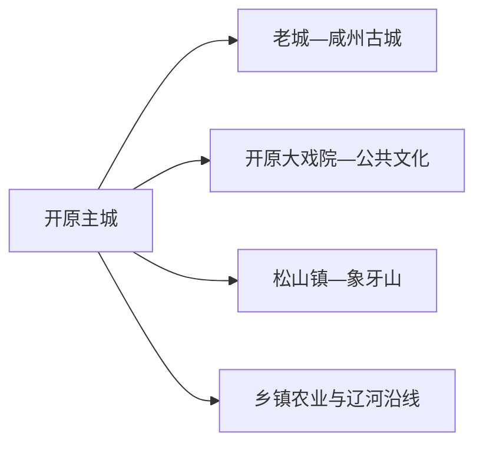
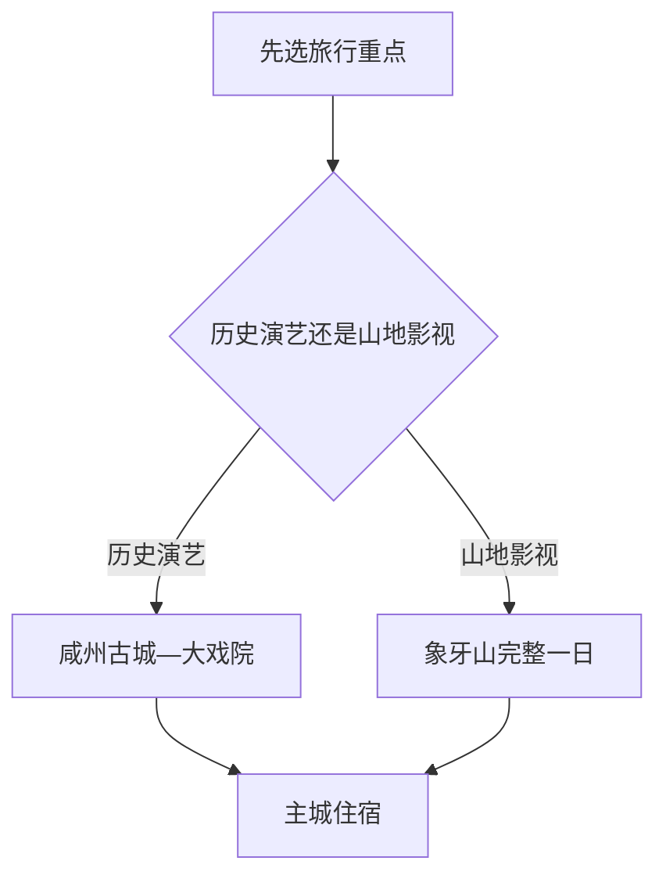

# 开原旅行指南

开原适合用“古城—演艺—山地影视”三条线来选：先在老城认识咸州古城与崇寿寺塔，再按演出计划进入开原大戏院，想看辽北山地和影视场景则为象牙山单独留一天。主城与象牙山之间依赖车辆，住一晚会比从铁岭或沈阳当天往返更从容。

> 建议停留：主城 1 天；象牙山另留 1 天 
> 旅行关键词：咸州古城、崇寿寺塔、开原大戏院、象牙山、辽北饮食 
> 主要体力：主城低至中等；象牙山中高 
> 最近研究：2026-08-13

## 城市速览

| 项目 | 旅行信息 |
|---|---|
| 主要旅行价值 | 在咸州古城读辽金以来的城市史，以二人转等舞台演出理解辽北大众文化，再到象牙山体验火山岩地貌与影视场景 |
| 建议停留 | 1 天主城；2 天加入象牙山；乡村节庆只在正式接待日期替换进入 |
| 较舒适季节 | 春秋适合古城与山地；夏季注意雷雨和高温；冬季适合室内演出与雪后景观但道路结冰风险上升 |
| 预算特点 | 主城中低；象牙山车辆、门票、温泉或住宿是主要增量 |
| 步行强度 | 古城可分段慢走；象牙山有坡道、石阶和不规则山路 |
| 主要天气风险 | 强对流、暴雨、山洪、森林火险、寒潮、积雪与道路结冰 |
| 独行旅行 | 主城方便；山地日先锁定正规往返车辆 |
| 亲子旅行 | 古塔外观、古城和正式演出较易安排；山地按儿童年龄与天气缩短 |
| 长者与低体力旅行 | 选择古城平缓段、文化场馆和车辆观景，象牙山只走游客中心附近开放段 |
| 无障碍信息 | 现代场馆可逐处咨询，古塔周边与山地设施连续性需向官方确认 |

## 城市格局与游览区域

开原市是铁岭市代管的县级市，法定代码为 `211282`。固定 GeoNames `2036337` 是开原主城居民点；法定城市实体 Wikidata `Q1000918` 当前连接另一条 GeoNames 行政记录 `2036335`，两者共同用于核对名称和位置，市域边界以法定区划为准。

| 区域 | 主要内容 | 怎么安排 | 与其他区域的关系 |
|---|---|---|---|
| 主城生活区 | 铁路到达、住宿、餐饮与公共文化 | 作为两日行程基地 | 到老城和象牙山均需地面接驳 |
| 咸州古城—老城 | 崇寿寺塔、古城格局与历史街巷 | 半日慢走 | 可与当日晚间演出组合 |
| 象牙山—松山镇 | 火山岩山地、影视拍摄场景、温泉度假设施 | 独立一日 | 先确认景区入口、游线与返程 |
| 乡镇农业与辽河沿线 | 苗木、果园、村落与湿地生产景观 | 只选正式节庆或明确接待项目 | 农田、苗圃、河滩和作业道路按生产与生态边界使用 |

## 主要景点

### 历史与城市文化

| 景点 | 区域 | 类型 | 主要看点 | 建议用时 | 室内外 | 体力 | 预约风险 | 天气影响 | 优先级 |
|---|---|---|---|---:|---|---|---|---|---|
| 咸州古城—崇寿寺塔 | 老城街道 | 古城与全国重点文物 | 辽金古城沿革、密檐砖塔与老城空间；古城内部项目统一理解 | 2–3 小时 | 室外为主 | 中 | 中 | 中 | A |
| 开原大戏院 | 主城 | 演艺 | 二人转、小戏、小品与地方舞台文化，以当期节目单为准 | 2–3 小时 | 室内 | 低 | 很高 | 低 | A |
| 开原市公共文化场馆 | 主城 | 博物馆与文化馆 | 地方历史、非遗和临时展览，按当天开放场馆选择 | 1–2 小时 | 室内 | 低 | 高 | 低 | B |
| 主城滨水与城市公园 | 主城 | 公共空间 | 日常生活、河岸绿地和休息节点 | 1–2 小时 | 室外 | 低 | 低 | 中 | B |

### 山地与乡村

| 景点 | 区域 | 类型 | 主要看点 | 建议用时 | 室内外 | 体力 | 预约风险 | 天气影响 | 优先级 |
|---|---|---|---|---:|---|---|---|---|---|
| 象牙山风景区 | 松山镇 | 山地与影视文化 | 火山岩地貌、怪石山路、新旧影视基地和乡村场景 | 5–7 小时 | 室外为主 | 高 | 高 | 很高 | A |
| 象牙山温泉度假设施 | 象牙山方向 | 温泉与住宿 | 在山地日之后休息，具体泉池和接待范围按运营方确认 | 2–4 小时 | 室内外 | 低 | 很高 | 中 | B |
| 增家寨等正式乡村体验 | 乡镇 | 民俗与乡村 | 朝鲜族生活文化或节庆活动，以接待主体公布项目为准 | 半日 | 混合 | 中 | 很高 | 高 | C |

咸州古城与崇寿寺塔按同一历史片区安排；象牙山的新旧影视基地属于同一景区内部节点。这样可把时间留给真正需要换乘和完整游览的目的地。

## 美食与餐饮

开原的用餐重点是东北家常菜、面食、烧烤和山野菜。主城适合解决稳定的一日三餐；象牙山方向优先使用景区或住宿地明码标价的正式餐饮。

| 菜品或餐饮类型 | 常见区域 | 一个人用餐与常见份量 | 风味、过敏原与饮食限制 | 排队风险与替代方法 |
|---|---|---|---|---|
| 东北炖菜 | 主城家常菜馆 | 多为合菜，独行先问半份 | 常含猪肉、鸡肉、大豆酱和葱蒜；素食需确认汤底 | 在居民区选同类小馆，避开团队餐高峰 |
| 酸菜白肉或锅物 | 主城与度假住宿区 | 通常适合 2 人以上 | 含猪肉，汤底盐分较高；锅具可能共用 | 独行改选酸菜饺子或小份炖菜 |
| 烧烤与鸡架 | 主城夜间商业区 | 可按串点单 | 腌料可能含小麦、大豆、芝麻和花生；注意生熟分开 | 选择菜单清楚、通风和翻台稳定的店 |
| 山野菜与菌菇 | 象牙山和乡镇餐馆 | 时令菜多为一盘 | 来源和加工必须由正规餐饮确认，不自行采食 | 非产季改选普通蔬菜和家常菜 |
| 水饺、面条与米饭套餐 | 车站、主城商业区 | 最适合单人和赶车 | 面食含小麦，馅料可能含肉、蛋和虾皮 | 在车站外生活区寻找同类快餐 |

## 经典行程

### 一日经典路线

**路线**：开原主城 → 咸州古城—崇寿寺塔 → 老城午餐 → 公共文化场馆 → 开原大戏院当期演出

- **串联逻辑**：白天集中处理历史和公共文化，晚间用演出补足地方生活体验，换乘次数少。
- **预约锚点**：先确认大戏院节目与票务，再核对场馆开放。
- **休息安排**：午餐和下午休息放在主城或老城生活街区。
- **时间不足时**：保留古城—古塔，演出无合适场次时改为主城晚餐。

### 两日城市路线

**第 1 天**：咸州古城—崇寿寺塔 → 主城公共文化 → 开原大戏院。  
**第 2 天**：主城 → 象牙山游客入口 → 正式山地游线与影视场景 → 原路返回或景区住宿。

- **串联逻辑**：城市历史和山地影视分别占一天，第二天无需在闭园前赶回古城。
- **预约锚点**：演出票、象牙山门票/接驳和住宿。
- **休息安排**：第一天在主城；第二天使用游客中心和正式服务点。
- **时间不足时**：保留城区线，把象牙山改到另一个完整白天。

### 三日深度路线

**第 1 天**：老城历史线。  
**第 2 天**：象牙山完整一日。  
**第 3 天**：主城公园 → 当期公共文化或正式乡村体验 → 返程。

- **串联逻辑**：第三天作为季节性选择日，可吸收天气或演出变化。
- **预约锚点**：乡村活动接待、演出与景区开放。
- **休息安排**：连续两晚住主城，若象牙山住宿已确认可第二晚换宿。
- **时间不足时**：先删第三天，再删非核心演出。

### 雨雪天路线

**路线**：公共文化场馆 → 主城午餐 → 开原大戏院或室内活动

- **适用条件**：普通降雨降雪且城区交通正常；强对流、暴雪或结冰时缩短为住宿附近活动。
- **预约锚点**：当天场馆公告和演出状态。
- **休息安排**：选择同一片区室内场馆，减少露天候车。
- **时间不足时**：只保留一座场馆和一顿正餐。

### 亲子与低体力路线

**亲子路线**：咸州古城短段 → 公共文化场馆 → 早场或适龄演出。  
**低体力路线**：车辆到崇寿寺塔附近 → 平缓外部观察 → 主城午餐 → 室内演出。

- **减负方式**：亲子路线减少山地台阶；低体力路线用车辆连接片区并增加午休。
- **预约锚点**：儿童入场规则、演出时长和场馆电梯信息。
- **休息安排**：老城生活区和主城商业区。
- **时间不足时**：两类路线都先删演出后的附加公园。

### 远郊一日路线

**路线**：主城 → 象牙山游客入口 → 正式开放山地游线 → 景区服务区休息 → 返回

- **适用条件**：天气稳定、景区游线开放且往返车辆已确认。
- **预约锚点**：景区门票、接驳、温泉或住宿。
- **休息安排**：游客中心、正式餐饮和度假设施。
- **时间不足时**：整段改为老城一日，山地游留到能保留完整安全余量的一天。

## 住宿区域

| 区域 | 优点 | 缺点 | 适合人群 | 交通特点 |
|---|---|---|---|---|
| 开原站—主城商业区 | 到达、餐饮和第二天出发方便 | 夜间可能较热闹 | 首访、公共交通旅行和只住一晚者 | 去老城与象牙山均需地面接驳 |
| 老城方向 | 靠近咸州古城，早晚氛围安静 | 住宿选择与夜间服务需核对 | 历史文化优先者 | 到主城车站另计时间 |
| 象牙山度假区 | 便于山地早入和游后休息 | 价格、餐饮和返程依赖运营状态 | 自驾、温泉和两日慢游者 | 先确认正规车辆与退房后返程 |

## 市内交通

| 场景 | 建议与取舍 | 行前需要重查的内容 |
|---|---|---|
| 铁路抵达 | 开原站适合作为主城入口；高铁到铁岭后换乘也可，但应按跨城交通计算 | 12306 车次、到站名、末班接驳和施工 |
| 主城—老城 | 公交、出租车或网约车连接，抵达后以短步行为主 | 公交线路、上客点、古城周边停车 |
| 主城—象牙山 | 自驾、正规包车或当期旅游接驳更稳妥 | 景区接驳、返程时间、山路天气和车辆资质 |
| 乡镇活动 | 只围绕已确认接待点规划往返 | 活动日期、地址、返程和保险 |

## 不同旅行者须知

| 旅行维度 | 可行条件 | 主要取舍 | 需额外核对 |
|---|---|---|---|
| 独行旅行 | 主城与老城容易安排 | 象牙山优先正规往返 | 夜间上客点、景区返程 |
| 亲子旅行 | 古城、文化场馆与适龄演出 | 山地按年龄缩短 | 儿童票、台阶和卫生间 |
| 长者或低体力旅行 | 车辆连接古城和场馆 | 山地只选低处开放段 | 电梯、座椅、入口距离 |
| 无障碍需求 | 现代场馆可提前咨询 | 古塔和山地连续通行资料有限 | 设施连续性需向官方确认 |
| 摄影旅行 | 古塔、老城和山地公开观景点 | 影视基地和演出有拍摄规则 | 三脚架、无人机和商业拍摄许可 |
| 特殊天气 | 主城室内活动可替换 | 山地日整体顺延 | 预警、火险、道路结冰和闭园 |

## 行前核对

| 核对事项 | 为什么需要重查 | 建议核对时间 | 官方入口 |
|---|---|---|---|
| 象牙山开放、票务与接驳 | 山地游线、影视区域和温泉项目会调整 | 订房前及到访前一日 | [辽宁省文化和旅游厅景区资料](https://whly.ln.gov.cn/whly/wlzt/sjly/ajjq/2025111114382365577/index.shtml) |
| 开原大戏院节目 | 演出日期、时长和入场规则变化快 | 确定日期后 | [辽宁省文旅厅影视文旅线路](https://whly.ln.gov.cn/whly/tpxw/2025071814105984080/index.shtml) |
| 铁路 | 车次和停站随日期调整 | 出发前一周及当天 | [中国铁路 12306](https://www.12306.cn/) |
| 天气与山地风险 | 雷雨、火险、积雪和结冰影响山路 | 出发前三日及当天 | [辽宁省气象局](https://ln.cma.gov.cn/) |

## 来源与更新记录

### 主要来源

| 来源 | 类型 | 支持内容 | 核验日期 |
|---|---|---|---|
| [民政部行政区划代码服务](https://dmfw.mca.gov.cn/xzqh/getList?code=210000&trimCode=false&maxLevel=3) | 政府开放接口 | 开原市代码 `211282` 与铁岭代管关系 | 2026-08-13 |
| [辽宁省文旅厅：开原象牙山风景区](https://whly.ln.gov.cn/whly/wlzt/sjly/ajjq/2025111114382365577/index.shtml) | 省级文旅主管部门 | 象牙山位置、地貌、影视基地和景区等级 | 2026-08-13 |
| [辽宁省文旅厅：崇寿寺塔](https://whly.ln.gov.cn/whly/wlzt/lnww/zdwwbhdw/A676CB9D1B3B47B5AB99E044B72A7118/index.shtml) | 文物主管部门 | 古塔、咸州古城关系及文保身份 | 2026-08-13 |
| [辽宁省文旅厅：影视文旅线路](https://whly.ln.gov.cn/whly/tpxw/2025071814105984080/index.shtml) | 省级文旅主管部门 | 咸州古城、象牙山与开原大戏院旅行线索 | 2026-08-13 |
| [辽宁省民政厅行政区划公告](https://mzt.ln.gov.cn/mzt/zfxxgk/fdzdgknr/lzyj/mztgfxwj/gggs/2026012715312718674/index.shtml) | 民政部门 | 县级市层级 | 2026-08-13 |
| [GeoNames 2036337](https://www.geonames.org/2036337/) | 开放地名库 | 固定居民点记录与坐标 | 2026-08-13 |
| [Wikidata Q1000918](https://www.wikidata.org/wiki/Q1000918) | 开放知识库 | 法定城市实体及另一 GeoNames 行政记录 | 2026-08-13 |

### 更新记录

| 日期 | 更新内容 |
|---|---|
| 2026-08-13 | 首次建立独立开原指南；按主城、咸州古城和象牙山分配时间，明确居民点与法定城市粒度，并把山地、林地、湿地和农业空间的限制放在对应选择旁。 |
