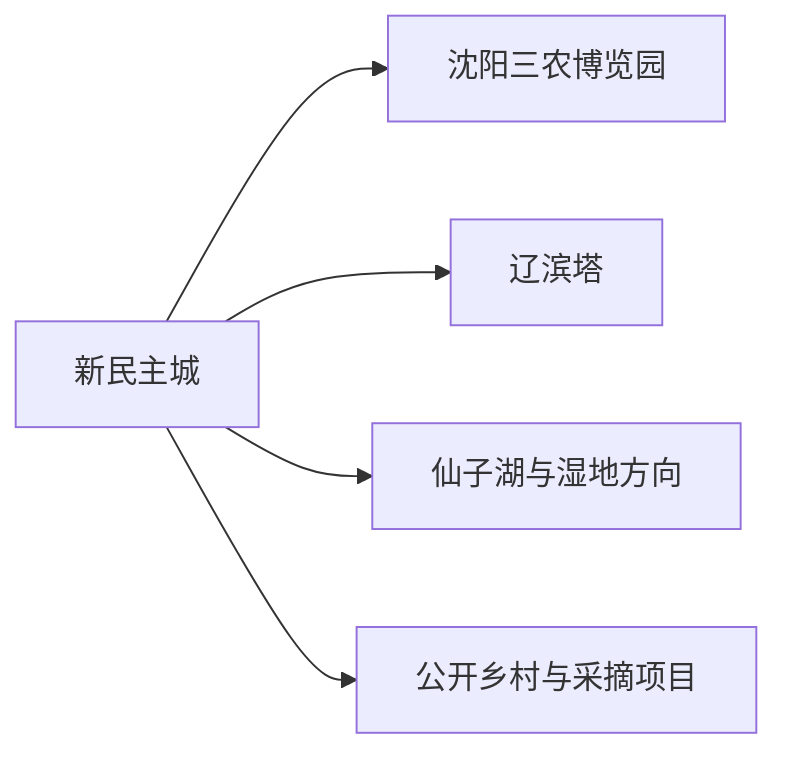
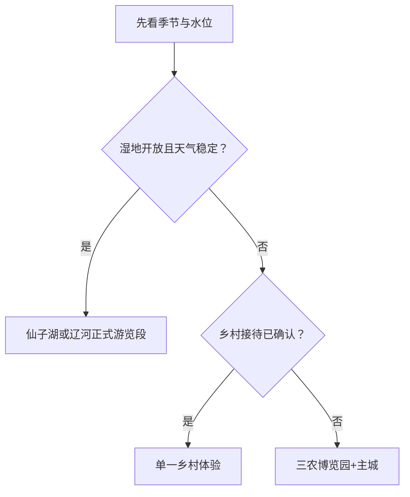

# 新民旅行指南

新民位于沈阳西部辽河平原，旅行适合围绕农耕文化、辽滨塔、辽河湿地与季节乡村展开。主城承担铁路、公路、住宿和餐饮；三农博览园可用半日至一日，辽滨塔与仙子湖等远点则按道路、季节和公开接待选择。

## 城市速览

| 项目 | 信息 |
|---|---|
| 旅行主线 | 三农文化、辽代遗存、辽河湿地、乡村与时令农产品 |
| 建议停留 | 1 天三农博览园；2 天增加辽滨塔或湿地；3 天再选季节乡村 |
| 住宿基地 | 新民主城 |
| 步行强度 | 主城低，园区中等，湿地与乡村中至高 |
| 主要天气 | 夏季强降雨和辽河汛情，冬季严寒结冰，春秋大风与森林草原火险 |
| 季节选择 | 荷花、采摘、稻田和冰雪活动按当年公告 |
| 亲子 | 三农博览园、公共场馆和公开农事活动较合适 |
| 低体力 | 园区选观光交通与核心展馆，远点用车辆串联 |
| 生产边界 | 农田、果园、养殖、水利与温泉设施按经营和生产规则体验 |
| 无障碍 | 设施连续性需向官方确认，并核对园区交通、湿地栈道和卫生间 |

## 城市格局与游览区域

新民市是沈阳市代管县级市，代码 `210181`。GeoNames `2033675` 与法定实体 Wikidata `Q1362055` 的 `P1566` 精确对应。主城位于市域交通中心，三农博览园、辽滨塔、仙子湖及各乡镇季节项目分散在辽河平原上。

| 区域 | 旅行价值 | 怎么安排 |
|---|---|---|
| 主城 | 住宿、餐饮、铁路与公共文化 | 抵达日、多日基地 |
| 三农博览园方向 | 农耕、民俗、园林与展馆 | 独立半日至一日 |
| 辽滨塔方向 | 辽代古塔与乡村历史 | 与一个邻近公开项目组合半日 |
| 仙子湖与辽河方向 | 湿地、荷花、观鸟与水域生态 | 按季节、水位和开放选择完整一天 |
| 乡村方向 | 采摘、温泉、农事和村落活动 | 只选经营主体清楚的接待点 |

## 主要景点

### 农耕与历史

| 景点 | 所在区域 | 类型 | 核心看点 | 建议用时 | 室内/室外 | 体力 | 预约难度 | 天气敏感度 | 适合旅程 |
|---|---|---|---|---|---|---|---|---|---|
| 沈阳三农博览园 | 新民市域 | 农耕文化与综合园区 | 农业、民俗、园林及当期开放展馆 | 4–7 小时 | 混合 | 中 | 中 | 高 | A |
| 辽滨塔 | 公主屯方向 | 古塔与历史遗存 | 辽代密檐砖塔及周边乡村历史环境 | 1–2 小时 | 室外为主 | 中 | 中 | 高 | B |
| 新民市公共文化场馆 | 主城 | 地方史与公共文化 | 城市沿革、辽河平原与当期展览 | 1–2 小时 | 室内 | 低 | 中 | 低 | B |

### 湿地与乡村

| 景点 | 所在区域 | 类型 | 核心看点 | 建议用时 | 室内/室外 | 体力 | 预约难度 | 天气敏感度 | 适合旅程 |
|---|---|---|---|---|---|---|---|---|---|
| 仙子湖正式开放区 | 前当堡方向 | 湿地与荷花 | 水域、荷花、鸟类与季节景观 | 4–6 小时 | 室外 | 中 | 高 | 极高 | B |
| 辽河生态公开游览段 | 市域 | 河流与湿地 | 河流地貌、生态修复与正式步道 | 2–4 小时 | 室外 | 中 | 高 | 极高 | C |
| 公开乡村采摘与农事项目 | 各乡镇 | 农业体验 | 苹果、草莓、稻田或当期农事 | 2–4 小时 | 室外为主 | 中 | 高 | 很高 | C |

湿地和辽河滩地具有防洪、生态与生产功能。观鸟、赏荷和骑行选择正式开放区，汛期与冰期按水利、应急和景区公告调整。农事体验以公开接待为入口，避免进入正在喷药、收割或使用农机的地块。

## 美食与餐饮

| 类型 | 适合场景 | 份量 | 过敏与饮食提示 | 选择方法 |
|---|---|---|---|---|
| 辽河鱼与东北炖菜 | 正餐 | 整鱼和炖菜适合分享 | 鱼刺、大豆、花生、共锅 | 询问鱼种来源、时价和小份 |
| 酸菜、血肠与杀猪菜 | 秋冬正餐 | 份量较大 | 猪肉、血制品、高盐与大豆 | 确认食材与半份选择 |
| 玉米、稻米与乡村主食 | 早餐、农家餐 | 一人份或共享 | 粗粮、糖、乳和小麦混用 | 选正规接待、看配料 |
| 苹果与时令果蔬 | 加餐、采摘 | 按食量购买 | 加工品可能高糖 | 核对采摘区、称重和储存 |

## 经典行程

### 一日经典路线

**路线**：新民主城 → 沈阳三农博览园 → 园区午餐与休息 → 核心展馆与园林 → 返回

- **串联逻辑**：用一个综合园区完成农耕、民俗和园林主题。
- **预约锚点**：开园、展馆、观光交通和当期活动。
- **休息安排**：午餐长休，优先使用园区正式休息点。
- **时间不足时**：只保留核心展馆，不绕完整园区。

### 两日城市路线

**第 1 天**：三农博览园完整日 
**第 2 天**：新民公共文化场馆 → 午餐 → 辽滨塔 → 返回

- **串联逻辑**：农业民俗与城市历史分日完成。
- **预约锚点**：场馆、古塔周边开放和返程车辆。
- **休息安排**：第二天午餐后再去辽滨塔。
- **时间不足时**：第二天只留主城场馆或辽滨塔之一。

### 三日深度路线

**路线**：三农博览园 → 主城与辽滨塔 → 仙子湖或一个公开乡村项目

- **串联逻辑**：农耕展示、历史遗存与生态季节主题分开。
- **预约锚点**：第三天水位、花期、开放、接待和车辆。
- **休息安排**：湿地或乡村日避开正午暴晒。
- **时间不足时**：按季节删除第三天。

### 雨雪天气路线

**路线**：主城公共文化场馆 → 室内午餐 → 三农博览园当期开放室内展馆

- **适用条件**：普通降雨或小雪且道路与展馆正常。
- **串联逻辑**：用车辆连接室内项目，减少湿地与乡村暴露。
- **预约锚点**：闭馆、园区交通和道路结冰。
- **休息安排**：午餐与展馆座椅。
- **时间不足时**：只留主城场馆。

### 亲子与低体力路线

**亲子路线**：三农博览园适龄展馆 → 午餐 → 园区近入口户外短段 
**低体力路线**：车辆到达主城场馆 → 长休 → 辽滨塔外部短停或返回

- **适用条件**：亲子活动按年龄和天气，低体力路线保持车辆可达。
- **串联逻辑**：把长距离园区压缩为一馆一段，保留学习主题。
- **预约锚点**：园区车、卫生间、轮椅、座椅和落客。
- **休息安排**：每个项目后安排室内或车辆休息。
- **时间不足时**：只留一座场馆。

### 湿地或乡村主题路线

**路线**：主城 → 仙子湖正式开放区或一个公开乡村项目二选一 → 午餐与休息 → 返回

- **适用条件**：水位、花期、天气、接待和返程都已确认。
- **串联逻辑**：一次只选一个远点，使季节体验完整。
- **预约锚点**：入园、停车、采摘规则、救生与返程。
- **休息安排**：正午进入游客中心或车辆休息。
- **时间不足时**：改回主城和三农博览园核心线。

## 住宿区域

| 区域 | 优点 | 取舍 | 适合人群 | 核对项 |
|---|---|---|---|---|
| 新民主城 | 交通、餐饮、叫车和生活服务完整 | 去远点需公路往返 | 首访、无车、多日 | 站点、停车、早餐、夜间入住 |
| 三农博览园周边正规住宿 | 便于早入园 | 晚间餐饮和交通选择少 | 园区慢游、自驾 | 营业、接驳、消防与退订 |
| 乡村正规民宿或温泉住宿 | 便于季节项目 | 依赖经营状态与车辆 | 已确认活动者 | 证照、实际项目、供暖、返程 |

## 市内交通

新民站及公路客运承担主要到发，主城可用公交、出租车和网约车。三农博览园、辽滨塔、仙子湖与乡村项目分散，适合城乡客运、合规包车或自驾。

| 场景 | 怎么做 | 核对项 |
|---|---|---|
| 从沈阳到达 | 按铁路或公路班次选择 | 到发站、末班、行李 |
| 主城移动 | 公交结合叫车 | 首末班、夜间服务 |
| 园区与古塔 | 预留往返车辆 | 入口、停车、返程 |
| 湿地和乡村 | 白天完成，留出天气缓冲 | 水位、道路、通信、救援 |

## 不同旅行者须知

| 旅行者 | 推荐做法 | 重点核对 |
|---|---|---|
| 独行 | 住主城，每天一个远点 | 返程、通信、末班 |
| 亲子 | 三农博览园核心区加公开农事 | 农机、水边、食品、卫生间 |
| 长者与低体力 | 观光交通和车辆连接 | 坡道、座椅、轮椅与落客 |
| 摄影 | 湿地与乡村按公开路线错峰 | 花期、水位、肖像、无人机 |
| 冬季旅行 | 主城和室内展馆优先 | 低温、结冰、供暖、车辆 |

## 行前核对

- 新民市政府和文旅部门：园区、场馆、节庆、乡村活动与开放。
- 水利、应急和气象部门：辽河汛情、湿地水位、雷电、暴雪与结冰。
- 三农博览园、仙子湖与接待单位：门票、交通、适龄项目、返程和无障碍。
- 12306与公路客运：沈阳—新民的车次、到发站和末班。

## 来源与更新记录

| 来源 | 支持内容 | 核验日期 |
|---|---|---|
| [新民市人民政府](https://www.xinmin.gov.cn/) | 市情、活动、场馆和动态核对入口 | 2026-08-13 |
| [辽宁省文化和旅游厅](https://whly.ln.gov.cn/) | 省级景区、活动与行业动态入口 | 2026-08-13 |
| [Wikidata Q1362055](https://www.wikidata.org/wiki/Q1362055) | 法定新民市与 `P1566=2033675` | 2026-08-13 |
| [GeoNames 2033675](https://www.geonames.org/2033675/) | 固定城市点与坐标 | 2026-08-13 |
| [辽宁省气象局](http://ln.cma.gov.cn/) | 天气与预警入口 | 2026-08-13 |
| [中国铁路12306](https://www.12306.cn/) | 铁路车次动态入口 | 2026-08-13 |

| 日期 | 更新 |
|---|---|
| 2026-08-13 | 首次完成新民主城、三农博览园、辽滨塔、湿地与乡村旅行研究。 |
