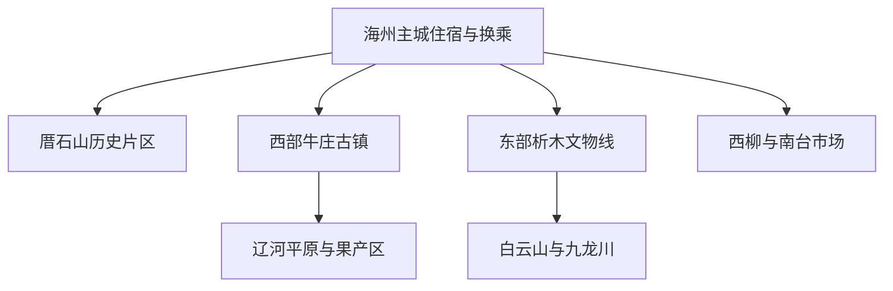
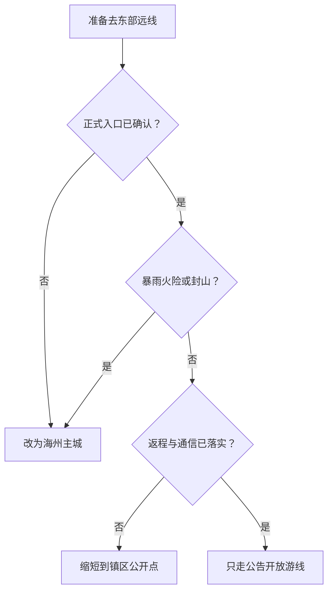

# 海城旅行指南

海城是鞍山市代管的独立县级市，旅行空间从海州主城向西延伸到辽河平原上的牛庄古镇，向东进入析木的青铜时代石棚、古塔与东部山林。这里最适合用“主城历史—牛庄商埠—析木考古—白云山森林”四条线理解，而不是把所有地名压成鞍山市区的一条远郊公交线。海城还是菱镁矿、专业市场和南果梨产区；矿山、尾矿库、批发市场作业区与果园生产地都不是看到道路便可自由进入的景点。

> 建议停留：2–4 天；只看主城与牛庄可安排 2 天 
> 旅行关键词：厝石山、牛庄古镇、析木石棚、辽南非遗、白云山、南果梨 
> 主要体力：主城低至中等；东部山地中高强度 
> 最近研究：2026-08-12

## 城市速览

| 项目 | 旅行信息 |
|---|---|
| 主要旅行价值 | 在县级市尺度内同时看到辽南古城与地方生活、辽河商埠史、青铜时代巨石遗存、东部山林和当代专业市场；牛庄馅饼、海城高跷与喇叭戏把历史空间和仍在延续的地方文化连接起来 |
| 建议停留 | 1 天可完成海州主城；2 天加入牛庄；3 天可把析木单列一天；4 天再在白云山、九龙川或季节性果园中择一，不把东部山地与西部牛庄硬拼 |
| 较舒适季节 | 春末和秋季通常适合主城、古镇及山地；梨花和采收都受物候与经营安排影响。盛夏需防高温、雷暴、暴雨和山洪，冬季需应对严寒、积雪与道路结冰 |
| 预算特点 | 主城和公共街区花费较低；跨镇车辆、山地景区、温泉或商业体验会提高预算。牛庄、析木与白云山分属不同方向，车辆成本通常比单张门票更影响总支出 |
| 步行强度 | 厝石山与主城公共空间可分段低强度游览；牛庄街区以平路为主但公共设施分散；析木文物点与白云山有乡镇道路、土石路、坡道和台阶，不能依据直线距离估算体力 |
| 主要天气风险 | 春季大风和森林火险，夏季高温、短时强降雨、雷暴、河流涨水与东部山区地质灾害，冬季低温和结冰；矿山及尾矿库周边还受生产与治理边界限制 |
| 独行旅行 | 海州主城、海城站周边与正规场馆便于独自安排；牛庄、析木和山地返程选择较少，晚间不临时进入乡村、矿区或林区 |
| 亲子旅行 | 主城公园、地方文博和非遗活动可按年龄选取；石棚、古塔周边、山路、水边、果园农机和批发市场车辆需要持续近距看护 |
| 长者与低体力旅行 | 可用车辆串联厝石山片区、经确认开放的公共文化场馆和海城河短段；牛庄宜只走一个完整街区，东部山地与分散文物点应删除或另配车辆 |
| 无障碍信息 | 铁路可申请重点旅客服务，现代公共建筑可能有坡道或电梯；公开资料不足以证明古镇街巷、文物遗址、山地景区、乡镇交通与卫生间全程连续可达，需逐点向运营方确认 |

海城法定行政代码为 `210381`。GeoNames `2037086` 与 Wikidata `Q1011073` 精确对应海城市实体；本页按县级市行政与真实旅行网络组织，不把该地名点的坐标当作整个市域边界，也不把鞍山市主城的住宿和公交直接套用到海城。

## 城市格局与游览区域

海城地势总体东南高、西北低。海州主城位于市域中部，是海城站、住宿、餐饮和城市服务最集中的地方；海城西站在主城西北方向，适合高铁抵离，却不等于已到厝石山或牛庄。牛庄位于西部辽河平原，析木和孤山在东部山前，白云山、九龙川等山林继续向东南展开。西柳、南台是专业市场方向，适合有采购目的的旅行者，不是传统景点密集区。

| 区域 | 主要内容 | 游览特点 | 与其他区域的关系 |
|---|---|---|---|
| 海州主城—厝石山 | 厝石山公园与历史片区、地方公共文化空间、海城河公共岸线、餐饮和城市生活 | 适合用半天至一天建立城市印象，点位相对集中；历史建筑、宗教空间和场馆仍各有独立入口 | 海城站到此最方便；可作为前往牛庄、析木或山地前后的住宿与补给基地 |
| 海城西站—开发区方向 | 高铁到发、城市西北部道路与产业空间 | 以交通和产业为主，站外到主城仍需接驳；货运、厂区和仓储道路不能作为观光捷径 | 适合早晚高铁，不宜因为站名带“海城”便把牛庄或主城理解为步行可达 |
| 牛庄 | 国家级历史文化名镇、辽河商贸与开埠记忆、传统饮食和民俗线索 | 街巷、文保点与生活空间交织，完整游览约半天至一天；具体建筑开放度不一 | 位于主城西部，与析木、白云山方向相反，最好独立一天或结合当地住宿 |
| 析木 | 析木城石棚、金银塔等文物线索及镇区服务 | 重点是考古与文物保护，点位不一定具备成熟景区服务；进入前应确认正式入口和接待 | 可与一个经核验的镇内点组合，不能继续硬拼牛庄或东部深山 |
| 孤山—白云山 | 白云山风景区、孤山仙人洞遗址线索、山地村镇 | 山地游览、季节变化和道路条件占主导，历史遗址不等于开放景点 | 宜从主城或析木方向专车往返；森林火险、暴雨和积雪时整段取消 |
| 九龙川方向 | 九龙川自然保护地与依法开放的旅游区 | 景区游线与自然保护区不是同一边界，只能走公告开放入口和道路 | 不因地图上有林道便与白云山穿越；开放、停车和返程要分别核对 |
| 西柳—南台专业市场 | 服装、箱包等专业市场及商贸服务 | 适合明确采购、行业考察或商务旅行；营业时间、楼栋和物流车流变化快 | 与传统文博路线目的不同，通常从主城单独往返，不为购物削减返程时间 |
| 腾鳌与温泉方向 | 城镇服务、产业与经确认运营的温泉项目 | 温泉、住宿、康养和普通观光可能属于不同经营主体；健康条件优先于打卡 | 与海州主城、牛庄均需车辆连接，不能把“温泉片区”当成自动开放的一体化景区 |

海城的矿产与工业规模很大，尤其是东部菱镁矿山及加工、物流空间。矿坑、爆破区、尾矿库、堆场、厂区、专用铁路和运输道路均按生产或治理空间处理；即使废弃矿山正在生态修复，也不能未经许可进入拍摄。海城河、大辽河、湿地、水库和灌排设施同样有防洪、供水、农业和生态功能，公共滨水段不代表整条岸线开放。

## 主要景点

优先级用于安排时间，不代表绝对排名：**A** 为首访核心，**B** 为按兴趣补充，**C** 为远郊、季节性或通常需要独立半天以上的目的地。车站、市场和公共岸线只作为路线节点，不与正式景点并列；同一历史片区或景区内部子点只作为一个项目记录。

### 海州主城与城市生活

| 景点 | 区域 | 类型 | 主要看点 | 建议用时 | 室内外 | 体力 | 预约风险 | 天气影响 | 优先级 |
|---|---|---|---|---:|---|---|---|---|---|
| 厝石山公园与历史文化片区 | 海州主城 | 城市公园、历史片区 | 城中山体、城市公共生活与海州历史空间；按公园和相邻公共街区整体安排 | 2–3 小时 | 以室外为主 | 低至中 | 低 | 高 | A |
| 海城市博物馆或当期地方史展陈 | 海州主城 | 地方文博 | 海城考古、地方史与民俗；只在确认现址、开放日和散客入口后排入 | 1.5–3 小时 | 室内 | 低 | 高 | 低 | B |
| 海城三学寺 | 海州主城 | 古建筑、宗教文化 | 辽南古建筑与持续宗教空间；殿堂、法会和修缮区按现场边界参观 | 1–2 小时 | 混合 | 低至中 | 中至高 | 中 | B |
| 海城河公共滨水段 | 主城 | 城市公共空间 | 城市河流、居民休闲与主城尺度，只使用照明、护栏和出入口明确的开放段 | 1–2 小时 | 室外 | 低 | 低 | 高 | 路线节点 |

厝石山适合用作主城路线的空间锚点，但“历史文化片区”不表示周边每一座建筑都可进入。遇到修缮、活动搭建或宗教活动，应绕开封闭区。地方文博设施的馆名、馆址和常设展可能调整；没有当期开放公告时，可保留公园、公共街区和餐饮，不以门外拍照伪装完成参观。

### 牛庄商埠与辽南非遗

| 景点 | 区域 | 类型 | 主要看点 | 建议用时 | 室内外 | 体力 | 预约风险 | 天气影响 | 优先级 |
|---|---|---|---|---:|---|---|---|---|---|
| 牛庄历史文化名镇 | 牛庄镇 | 历史城镇、商贸史 | 辽河商埠与交通变迁、传统街巷、古桥及地方饮食；按整个镇内公开游览范围计一个项目 | 3–5 小时 | 混合 | 中 | 中 | 中至高 | A |
| 牛庄非遗与民俗活动 | 牛庄镇 | 非遗、节庆 | 牛庄馅饼、海城高跷与喇叭戏等地方文化在正式活动中的呈现 | 1–3 小时 | 视活动而定 | 低至中 | 高 | 中 | C |

牛庄曾因辽河航运和商贸形成重要历史地位，今天仍是有人居住、经营和通行的城镇，不是封闭式仿古景区。古港河道的历史位置、现存街巷和现代河流不能简单重叠；不要沿旧地图进入耕地、堤防、作业码头或无护栏水边寻找“港口遗址”。非遗演出具有日期和场地依赖，未发布活动时，以历史街区和地方饮食为主，不要求居民临时表演。

### 析木考古与东部文物

| 景点 | 区域 | 类型 | 主要看点 | 建议用时 | 室内外 | 体力 | 预约风险 | 天气影响 | 优先级 |
|---|---|---|---|---:|---|---|---|---|---|
| 析木城石棚 | 析木镇方向 | 青铜时代遗址、全国重点文物保护单位 | 由大型花岗岩石板构成的石棚及辽东半岛巨石遗存背景 | 1–2 小时，不含主城往返 | 室外 | 中 | 高 | 高 | A |
| 析木金塔与银塔等文物点 | 析木镇方向 | 古塔、文物遗存 | 镇域历史层次与古塔形制；只按文物主管部门确认的公开点位活动 | 1–3 小时 | 室外为主 | 中 | 高 | 高 | C |
| 孤山仙人洞遗址 | 孤山镇方向 | 史前遗址、文物保护 | 古人类活动线索；当前是否设有稳定散客入口和展示须重新确认 | 1–2 小时，不含往返 | 室外 | 中 | 高 | 高 | C |

析木城石棚是受保护的不可移动文物，不是可以攀爬、触摸、拓印或露营的巨石装置。公开资料能支持其文物价值，却不能自动证明每天都有售票、讲解、停车和无障碍设施；若属地无法确认入口，应把当日改为析木镇公共空间或返回主城。金塔、银塔和仙人洞同样只在正式开放、道路与接待条件明确时进入，不根据野外轨迹穿过果园、矿地或村民院落。

### 东部山林与季节体验

| 景点 | 区域 | 类型 | 主要看点 | 建议用时 | 室内外 | 体力 | 预约风险 | 天气影响 | 优先级 |
|---|---|---|---|---:|---|---|---|---|---|
| 白云山风景区 | 东部山地 | 森林、山岳景区 | 辽南山林、峰谷与季节景观；按正式景区开放游线整体安排 | 0.5–1 天 | 室外 | 中至高 | 中至高 | 高 | A |
| 九龙川风景旅游区公开游线 | 东南山地 | 森林、自然景观 | 山林、溪谷与保护地周边景观；景区开放段和自然保护区严格区分 | 0.5–1 天 | 室外 | 中至高 | 高 | 高 | B |
| 经公告开放的南果梨果园体验 | 王石等产区 | 农业、季节体验 | 梨花、果实与农事文化；只选择明确接待、停车和食品卫生规则的经营点 | 2–4 小时 | 室外 | 低至中 | 高 | 高 | C |

白云山与九龙川不是一条可自由穿越的林道。森林火险、大风、雷暴、暴雨、积雪和道路施工都会改变开放线路；自然保护区核心区、缓冲区、科研监测区及无正式入口的山林不进入。果园首先是农业生产空间，花期和采摘期由物候决定；未取得经营者同意时不入园、不摘果，不把无人机飞行、明火野餐和机动车驶入田间当作默认服务。

## 美食与餐饮

海城饮食以辽南面食、牛羊肉和东北家常菜为基础，最有辨识度的是牛庄馅饼、海城烧鸡、三里烧烤与南果梨。主城适合单人面食和普通餐馆，牛庄更适合把馅饼与古镇路线放在同一天；季节性果品只在成熟、来源和储存条件清楚时购买。

| 菜品或餐饮类型 | 常见区域 | 一个人用餐与常见份量 | 风味、过敏原与饮食限制 | 排队风险与替代方法 |
|---|---|---|---|---|
| 牛庄馅饼 | 牛庄、海州主城及地方餐饮 | 通常可按个或按份点，一人方便；现烙馅饼温度高、油脂较足 | 面皮含小麦，馅料常见牛羊肉、猪肉、葱和大豆类调味；名称不自动代表清真，严格需求需核实资质与共厨 | 饭点和节庆可能排队，可选明码标价、现做和卫生条件清楚的同类店，不必只等一家老字号 |
| 海城烧鸡及酱卤 | 主城、牛庄与熟食销售点 | 可按重量购买，适合多人分享；独行者先问最小份和冷藏条件 | 含禽肉，卤汁可能含大豆、小麦、糖和较高钠；熟食离开冷链后不宜久放 | 节前可能售罄，以有标签、有许可和储存温度清楚的正规熟食替代 |
| 三里烧烤与辽南串类 | 主城夜间餐饮区 | 可按串点，单人也能控制份量 | 常见牛羊肉、海鲜、芝麻、孜然、辣椒和大豆调味，烤架交叉接触明显 | 夜间拥挤时换到通风、证照与价格明示的普通烧烤店，并先确认返程交通 |
| 南果梨及梨制品 | 王石等产区、主城农产品销售点 | 鲜果可少量购买；梨汁、梨膏与梨酒规格不同 | 鲜果成熟后质地软、含天然糖；加工品看添加糖、防腐剂和酒精，梨酒不适合儿童、驾驶者与需禁酒者 | 鲜果有明显季节性，非产季选标签完整的正规加工品，不用路边无来源产品替代 |
| 辽南酸汤子与玉米面食 | 主城与乡镇地方餐馆 | 常为一人一碗，适合快速用餐 | 发酵玉米面为主，但汤底、配菜与共用器具可能含肉、小麦、大豆或蛋；选择正规经营与现制卫生条件清楚的店 | 供应时间不一，没有时可用普通玉米面条、荞麦面或饺子替代 |
| 东北炖菜与酸菜白肉 | 全市普通餐馆 | 多为二至四人分享，独行者问小份或盖饭 | 油盐较高，常含猪肉、粉条、大豆、小麦和动物油；“不辣”不等于低盐或素食 | 普通社区餐馆替代性高，减少菜数比排队等网红大锅更可控 |
| 海鲜与河鲜 | 主城及辽南餐馆 | 多按份或按重量，一人点餐前问净重和做法 | 甲壳类、鱼类过敏风险高；河湖禁捕、季节和来源影响合法供应，生食另有卫生风险 | 只选价格、计量和来源明示的店；来源不清或天气炎热时改点熟制禽肉、豆制品或蔬菜 |
| 市场简餐 | 西柳、南台专业市场周边 | 盒饭、面食和快餐适合单人，但用餐高峰集中 | 油盐、过敏原和共厨情况需要逐项询问；不要在仓储装卸通道席地用餐 | 错开采购高峰，到固定餐饮区或返回主城，不追随非正规流动摊点 |

严重过敏、无麸质、纯素、清真或低盐饮食者，应把限制逐项写给餐厅确认。牛庄馅饼、烧烤、卤味和炖菜常共锅、共油或共烤架，口头说“不放某样”不能完全排除交叉接触。温泉后、登山后和夏季长途乘车时先补水休息，不用酒类“驱寒”后继续驾驶。

## 经典行程

路线以片区和半天为单位，不使用分钟级课表。场馆开放、文物点接待、山地天气和返程交通优先于景点数量；任何远线只要“正式入口、去程、返程”中有一项不确定，就改为主城路线。

### 一日经典路线

**路线**：厝石山公园与历史文化片区 → 经确认开放的地方史展陈或三学寺 → 主城午餐 → 海城河公共滨水短段

- **串联逻辑**：全日留在海州主城，先从城市地形与历史街区建立空间感，再用地方史或古建筑补充历史，最后用公共河岸观察当代城市生活；各站之间以短途车辆或分段步行连接。
- **预约锚点**：地方史展陈或三学寺的当日开放；若无法确认，则主线缩为厝石山、午餐和公共河岸，不把关闭建筑当作外观打卡。
- **休息安排**：厝石山公共座椅、主城正规餐馆和住宿地均可休息；夏季午后缩短无遮阴河岸，冬季不在风口久留。
- **时间不足时**：先删海城河长段，再在场馆与三学寺中二选一；保留厝石山和一顿地方餐饮即可形成完整城市印象。

### 两日城市路线

**第 1 天**：厝石山历史片区 → 地方史展陈或三学寺 → 海城河短段 
**第 2 天**：海州主城出发 → 牛庄历史文化名镇 → 牛庄午餐 → 返回主城

- **串联逻辑**：第一天处理海州主城，第二天单独给牛庄的商埠史、生活街巷和饮食，避免跨到城市东端。牛庄只走公开道路与明确开放的文保点，不追旧港河道。
- **预约锚点**：第一天以场馆为锚点，第二天以牛庄具体开放点和返程为锚点；若有正式非遗活动，再以其时间调整街区顺序。
- **休息安排**：第一天在主城，第二天把午餐和午休都留在牛庄镇区，返程前补水并再次确认车辆。
- **时间不足时**：第一天删滨水段；第二天只保留一个连续街区和馅饼午餐，不绕行堤防、果园或析木。

### 三日深度路线

**第 1 天**：海州主城历史与公共文化 
**第 2 天**：牛庄历史文化名镇完整一天 
**第 3 天**：析木镇公开文物点 → 析木城石棚 → 返回海州主城

- **串联逻辑**：主城、辽河平原和东部山前分日，第三天把石棚放在已有历史框架之后，重点理解史前遗存及文物保护，而不是搜集野外坐标。
- **预约锚点**：析木城石棚的属地接待、正式入口和道路是第三天的硬锚点；未获确认时，第三天改为主城公共文化或西柳、南台的明确采购行程。
- **休息安排**：每天回到服务较完整的镇区或主城用餐；析木日自带适量饮水，但不在文物保护范围内野餐、露营或生火。
- **时间不足时**：完整删除第三天，不把石棚压到牛庄日；若只剩两天，优先保留主城和牛庄。

### 雨天路线

**路线**：住宿地 → 经确认开放的海城市公共文化场馆 → 主城正规午餐 → 商圈或室内休息 → 返回住宿地

- **适用条件**：普通降雨且城市道路、铁路正常时可执行；暴雨、雷暴、河流涨水、地质灾害预警或官方减少出行提示下，应取消跨镇与滨水移动。
- **预约锚点**：公共文化场馆的开放、入馆和临时活动；没有稳定室内点时宁可缩为用餐与休息，不把市场仓储区当雨棚路线。
- **休息安排**：全程使用正式场馆、餐馆和商场的公共休息空间，鞋袜湿透或道路积水时提前结束。
- **时间不足时**：只保留一座已确认开放的室内场馆；不在雨天追加厝石山坡道、牛庄水边、析木文物点、果园或东部山地。

### 亲子或低体力路线

**亲子路线**：厝石山公园平缓短段 → 经确认开放的地方史展陈 → 午休 → 海城河有护栏的公共短段 
**低体力路线**：车辆抵达地方史展陈最近入口 → 主城午餐 → 车辆接驳至厝石山公园平缓入口 → 返回住宿地

- **减负方式**：亲子路线控制每个单元时长，避开水边、车道和陡坡并持续看护；低体力路线取消牛庄和析木，提前确认上下客点、坡道、电梯、座椅及无障碍卫生间，两条路线均不以“公园”二字推定全程适合推车或轮椅。
- **预约锚点**：亲子路线以场馆年龄与活动规则为锚点；低体力路线以入口到展厅的连续通行确认结果为锚点。
- **休息安排**：每完成一个主题便短休，午餐后留出完整静态休息；儿童在河岸和道路口始终由成人近距看护。
- **时间不足时**：亲子路线删河岸，低体力路线只保留一处室内点；无障碍连续性无法确认时改为铁路协助加住宿地周边短行。

### 远郊一日路线

**路线**：海州主城出发 → 白云山风景区正式入口 → 单一开放游线 → 景区服务点休息 → 原路返回主城

- **适用条件**：适合已确认景区营业、森林火险等级、天气、道路和返程的旅行者；普通登山也需要防滑鞋、饮水与保暖，雷暴、暴雨、大风、火险管控或积雪封路时取消。
- **预约锚点**：白云山当日入口、开放游线、停车或景区交通；不要把九龙川、仙人洞或矿山道路临时加入同一天。
- **休息安排**：只在景区明确允许的服务点休息，不在林地吸烟、生火、野炊或进入封闭支路；返程前至少保留一段不赶夜路的缓冲。
- **时间不足时**：远郊整段删除，改走海州主城；进入景区后体力下降则沿已知开放路线原路返回，不为完成环线继续爬升。

## 住宿区域

| 区域 | 优点 | 缺点 | 适合人群 | 交通特点 |
|---|---|---|---|---|
| 海城站—海州主城 | 餐饮、城市服务和普通列车到发方便，去厝石山及多条县域公路较均衡 | 商业和车流可能带来噪声；到海城西站、牛庄与东部山地仍需乘车 | 首访、独行、公共交通旅行、安排多方向日游者 | 适合作为全程基地；订房时核对到海城站的实际步行路与夜间前台 |
| 厝石山与主城东部 | 靠近主城历史片区，早晚散步较方便 | 离海城西站和西部牛庄更远，坡度与活动噪声因具体位置不同 | 城市历史、低节奏、连续住两晚以上者 | 去析木方向相对顺路，仍需正规车辆；不把公园附近等同于景区接驳 |
| 海城西站周边 | 早晚高铁和大件行李接驳压力较小 | 不是传统主城中心，餐饮密度、夜间服务与景点距离需逐项核对 | 过境、高铁时刻优先、次日离开海城者 | 进主城、牛庄和析木都要另乘车，站名不能代替住宿位置判断 |
| 牛庄镇区 | 方便从容观察历史街区、早晚用餐并减少当天往返 | 住宿选择和夜间交通少于主城，具体服务连续性需确认 | 牛庄深度、非遗活动或继续辽河平原方向者 | 次日返回海州或接续其他城市前先锁定车辆，不依赖深夜临时叫车 |
| 析木镇区 | 便于把石棚及一个公开文物点分开安排 | 场馆、餐饮、住宿与叫车能力有限；不代表住下便可进入所有遗址 | 考古文物专题、已经联系属地接待者 | 到石棚、孤山或山地仍有最后一段，需同时确认去程与返程 |
| 西柳或南台 | 靠近专业市场，采购、装样和商务活动方便 | 与主城历史、牛庄和东部山地均有距离，早间货运车流可能明显 | 采购、展会、行业考察 | 核对市场楼栋、装卸时段、停车与跨区车辆，不携大件货物乘普通观光路线 |
| 白云山或温泉经营区 | 可减少早进山或泡汤后的长距离移动 | 经营季节性、晚间餐饮和医疗条件可能有限；地点名称容易与行政片区混淆 | 山地度假、经健康评估的温泉旅行 | 只订已确认营业、可到正式入口且有返程方案的住宿，不把民宿宣传距离当道路距离 |

不推荐未经核验的具体酒店。县域或山地住宿要核对前台值守、供暖或制冷、热水、消防、餐饮、夜间交通、无障碍客房和取消规则。温泉住宿还需区分房费、泡池、医疗康复与接送是否分别收费；饮酒、疲劳或有基础疾病时不以泡汤替代休息或诊疗。

## 市内交通

| 场景 | 建议与取舍 | 行前需要重查的内容 |
|---|---|---|
| 从海城站抵达 | 海城站靠近主城，适合先入住或寄存行李再走厝石山方向；普通列车到发与城市道路衔接较直接 | 实际车次、进出站口、寄存、站前施工、公交末班和重点旅客服务 |
| 从海城西站抵达 | 海城西站服务高铁方向，需另乘公交、出租车或预约车辆进主城 | 车次、站外上客点、公交运营时间、夜间叫车、道路施工与无障碍协助 |
| 航空抵达 | 腾鳌机场与海城有地理关系，但航线和地面接驳变化快；只有承运航司已售票时才作为锚点，也可比较沈阳等机场转铁路 | 实际可售航班、机场到海州主城的正规交通、延误备降、末班铁路和行李衔接 |
| 主城移动 | 厝石山、海城站、公共文化点和河岸之间可用公交、出租车或分段步行 | 公交线路、末班、道路围挡、活动管制、冬季结冰与共享交通服务范围 |
| 前往牛庄 | 先解决海州主城到牛庄镇区，再在公开街区步行；多人可比较正规包车 | 城乡客运、发车点、末班、返程、活动交通管制、汛期道路及正规车辆资质 |
| 前往析木 | 按镇域远线处理，石棚、古塔和孤山不是一个连续下车点 | 到镇班次、正式入口、最后一段车辆、文物点开放、手机信号和返程 |
| 前往白云山或九龙川 | 景区营业和天气确认后，使用运营方公布的接驳、正规出租车或包车；不沿矿山或林区小路抄近道 | 景区入口、停车、道路、火险、封山、返程、司机资质和保险 |
| 前往西柳或南台 | 商务采购先锁定市场全称、楼栋与营业日，再组织车辆；大件样品和行李与普通观光乘车分开考虑 | 市场营业、展会、货运限制、停车、寄存、物流收货与消费凭证 |
| 自驾 | 主城不必自驾，牛庄、析木和山地可提高灵活性；矿区重车、乡村道路、疲劳和冬季结冰是主要代价 | 限行、停车、施工、积水、林区防火检查、充电、正规道路与饮酒后驾驶 |

海城站、海城西站不是同一车站；订票后应以票面站名核对住宿和接驳。铁路规划中出现的线路或站点不等于当前有适用客运班次，海岫铁路等也不能仅凭地图推定可作为旅游通勤。前往乡镇时把“去程、最后一段、返程”写在同一张行程单上，不能只确认到镇客运。

## 不同旅行者须知

| 旅行维度 | 可行条件 | 主要取舍 | 需额外核对 |
|---|---|---|---|
| 独行旅行 | 海州主城、铁路和单人面食易安排 | 析木、山地和乡村末班有限，夜间不在矿区、河岸和林区临时行动 | 返程、正规车辆、住宿前台、手机信号和夜间照明 |
| 亲子旅行 | 公园、地方史、非遗和经确认的果园体验主题清楚 | 石棚和古塔不能攀爬，山路、水边、农机、货运车辆与温泉需持续看护 | 年龄身高、推车、护栏、卫生间、食品过敏、体验工具和儿童票 |
| 长者或低体力旅行 | 采用“一个室内点＋车辆接驳＋短段公园”可保留主城主题 | 牛庄长街、析木分散点和山地会迅速累积步行与乘车疲劳 | 最近下客点、坡度、台阶、电梯、座椅、午休和站内协助 |
| 无障碍需求 | 铁路重点旅客服务可提前预约，现代场馆可逐点确认 | 单点有坡道不等于站外道路、展厅、古镇、遗址、厕所和返程连续可达 | 轮椅入口、电梯尺寸、无障碍卫生间、借用设备、陪同和临时停用 |
| 摄影旅行 | 主城公园、公开古镇街道和正式景区提供城市、民俗与山林题材 | 宗教、文物、居民生活、果园、矿区、厂区、铁路和无人机各有边界 | 三脚架、闪光灯、商业拍摄、无人机、人物同意与森林防火 |
| 预算有限 | 主城公共空间、公交和社区餐饮可控制成本 | 远线车辆、山地、温泉和跨镇住宿常比门票更贵 | 免费场馆预约、交通总价、停车、退改、优惠资格与市场寄存 |
| 晚出发或紧凑行程 | 只走厝石山或一个已确认室内点 | 不在午后临时出发去牛庄、析木、白云山或九龙川 | 最晚入场、末班交通、照明、行李寄存和住宿登记 |
| 暴雨、火险或冰雪 | 普通天气变化可转主城室内；预警解除后再评估户外 | 暴雨下取消河岸、山地和文物土路，火险下取消林区，冰雪下不走未维护坡道 | 气象预警、景区关闭、河流水位、地灾、森林防火与道路结冰 |

海城高跷、喇叭戏、宗教活动和村镇生活都属于持续存在的地方文化。拍摄表演者、居民、宗教仪式、私人院落或果园劳动前先取得同意；不要求陌生人表演，也不把商业采购中的产地宣传当作材质、食品或文物鉴定。

## 行前核对

| 核对事项 | 为什么需要重查 | 建议核对时间 | 官方入口 |
|---|---|---|---|
| 海城市公共文化场馆 | 馆名、馆址、闭馆日、展陈、实名入馆和活动占用可能调整 | 排入路线前及到访前一日 | [海城市人民政府](https://www.haicheng.gov.cn/)及海城市文旅广电部门正式发布 |
| 厝石山片区与三学寺 | 活动、修缮、宗教仪式和冬季道路会改变可进入范围 | 到访前三日及当天 | [海城市人民政府：海城概况](https://www.haicheng.gov.cn/html/HCS/202001/0157922713115369.html)；现场管理方 |
| 牛庄历史文化名镇 | 具体文保点、非遗活动、停车和城乡客运各自变化 | 确定日期后、出发前一日 | [辽宁省文旅厅：辽宁文物资源概况](https://whly.ln.gov.cn/whly/wlzt/lnww/lnwwgk/B6183E917BAB475697BFB1BE19F225D7/index.shtml)；海城市文旅部门 |
| 析木城石棚与东部文物点 | 文物价值已有官方资料，但散客入口、讲解、道路和修缮不能由历史资料推断 | 出发前一周及前一日 | [辽宁省文旅厅：析木城石棚](https://whly.ln.gov.cn/whly/wlzt/lnww/zdwwbhdw/781DE2A3CFFA4EF4B194CCD0DE854E67/index.shtml)；海城市文物主管部门 |
| 白云山与九龙川 | 旅游区、森林公园和自然保护地边界不同，火险、暴雨、积雪与维护会改变游线 | 购票前、出发前三日及当天 | [海城市人民政府：海城概况](https://www.haicheng.gov.cn/html/HCS/202001/0157922713115369.html)；景区与林草部门 |
| 南果梨果园与节庆 | 花期、成熟期、采摘、停车、食品卫生和活动日期均有时效性 | 排入路线前及当天 | [海城市“十四五”规划](https://www.haicheng.gov.cn/html/HCS/202201/0164800050351651.html)；具体经营者和活动主办方 |
| 温泉项目 | 住宿、普通泡汤、康养与医疗服务可能分属不同产品，健康限制因人而异 | 预约及付款前、入场当天 | 海城市文旅部门、所选运营主体和必要时医疗专业人员 |
| 矿区、尾矿库、厂区与专用交通 | 生产、爆破、运输和生态修复边界不会因地图可达而开放 | 每次东部远线前 | [海城市“十四五”规划](https://www.haicheng.gov.cn/html/HCS/202201/0164800050351651.html)；海城市自然资源、应急部门 |
| 河流、水库与汛期道路 | 河岸、漫水路、堤防、灌排设施和地灾点受雨情水情影响 | 出发前三日、每天早晨及跨镇前 | [中央气象台预警](https://www.nmc.cn/publish/alarm.html)；海城市应急、水务与交通部门 |
| 海城站、海城西站与重点旅客服务 | 车次、进出站、末班接驳和协助安排会变，两站不可混用 | 购票时、出发前一日及乘车当天 | [中国铁路 12306](https://www.12306.cn/)；[重点旅客预约说明](https://kyfw.12306.cn/otn/view/icentre_qxyyInfo.html) |
| 航空与机场接驳 | 航线、承运人、到达时刻和地面交通变化快 | 购票前及起飞前一日 | 承运航空公司、出发机场与[海城市人民政府](https://www.haicheng.gov.cn/)交通信息 |
| 城乡公交与包车 | 到镇不等于到景点，末班、最后一段、司机资质和价格会变化 | 出发前一周、前一日及当天 | 海城市交通运输部门、客运站与正规运输经营者 |
| 无障碍连续路线 | 车站协助或单点坡道不能证明古镇、遗址、景区和住宿全程可达 | 订票、订房和预约前 | 各交通、场馆、景区与住宿官方客服；资料不足处按“需向官方确认”处理 |
| 餐饮、市场与购物 | 营业、过敏原、计量、材质、退换和物流规则变化频繁 | 点餐、付款或发货前 | 商户正式渠道、现场票据及[全国 12315 平台](https://www.12315.cn/) |
| 入境、签证与证件规则 | 仅跨境旅行需要，适用条件随国籍、口岸与政策变化 | 购票前及出发前 | [国家移民管理局](https://www.nia.gov.cn/)；中国驻外使领馆与承运方 |

## 来源与更新记录

### 主要来源

| 来源 | 类型 | 支持内容 | 核验日期 |
|---|---|---|---|
| [海城市人民政府：海城概况](https://www.haicheng.gov.cn/html/HCS/202001/0157922713115369.html) | 县级市政府 | 海城地理、交通、产业、白云山与九龙川等基本格局 | 2026-08-12 |
| [海城市国民经济和社会发展“十四五”规划](https://www.haicheng.gov.cn/html/HCS/202201/0164800050351651.html) | 县级市政府规划 | 海州主城、牛庄、析木、白云山、九龙川、专业市场、温泉、矿山修复及水安全等空间关系 | 2026-08-12 |
| [鞍山市国土空间总体规划（2021—2035年）](https://files.anshan.gov.cn/files/ueditor/ASSZF/jsp/upload/file/20241224/1735005422954027553.pdf) | 地级市政府规划 | 厝石山、牛庄与析木历史文化体系，以及海城和鞍山主城的独立旅行尺度 | 2026-08-12 |
| [辽宁省文旅厅：析木城石棚](https://whly.ln.gov.cn/whly/wlzt/lnww/zdwwbhdw/781DE2A3CFFA4EF4B194CCD0DE854E67/index.shtml) | 省文物主管部门 | 析木城石棚的全国重点文物保护单位身份、构造与年代背景 | 2026-08-12 |
| [辽宁省文旅厅：辽宁文物资源概况](https://whly.ln.gov.cn/whly/wlzt/lnww/lnwwgk/B6183E917BAB475697BFB1BE19F225D7/index.shtml) | 省文物主管部门 | 牛庄为国家级历史文化名镇，以及文物遗址与公众游览边界的区分 | 2026-08-12 |
| [辽宁省文旅厅：海城非遗活动](https://whly.ln.gov.cn/whly/mtjj/2025091808520474074/index.shtml) | 省文旅主管部门 | 厝石山公共文化活动、海城高跷、地方手工艺与牛庄馅饼的当代旅行语境 | 2026-08-12 |
| [辽宁省文旅厅：海城喇叭戏《牛庄港》](https://whly.ln.gov.cn/whly/mtjj/2026072413451346504/index.shtml) | 省文旅主管部门 | 海城喇叭戏、辽河商埠记忆与牛庄地方文化；演出时空不固化 | 2026-08-12 |
| [辽宁省商务厅：辽宁地标美食评审结果](https://swt.ln.gov.cn/swt/ywxx/tzgg/2024102916531538698/index.shtml) | 省商务主管部门 | 牛庄馅饼、海城烧烤等餐饮品类 | 2026-08-12 |
| [辽宁省农业农村厅：海城南果梨](https://nync.ln.gov.cn/nync/index/lnsnyfzfwzx/zxdt/2023111411004339933/index.shtml) | 省农业主管部门 | 南果梨产地、产业与季节性果品背景 | 2026-08-12 |
| [鞍山市综合交通运输发展“十四五”规划](https://files.anshan.gov.cn/files/ueditor/FGW/jsp/upload/file/20220630/1656568932342040436.pdf) | 交通规划 | 海城站、海城西站及市域铁路结构；不用于推定实时客运班次 | 2026-08-12 |
| [中国铁路 12306](https://www.12306.cn/) | 铁路运营服务 | 实时车次、车站、票务与重点旅客服务核对入口 | 2026-08-12 |
| [辽宁省民政厅：2025 年度行政区划代码公告](https://mzt.ln.gov.cn/mzt/zfxxgk/fdzdgknr/lzyj/mztgfxwj/gggs/2026012715312718674/index.shtml) | 省民政主管部门 | 海城市法定县级市代码 `210381` 及与鞍山市的代管关系 | 2026-08-12 |
| [中央气象台预警](https://www.nmc.cn/publish/alarm.html) | 国家气象服务 | 暴雨、雷暴大风、高温、寒潮与其他动态预警入口 | 2026-08-12 |
| [GeoNames：Haicheng 2037086](https://www.geonames.org/2037086/haicheng.html) | 开放地名数据，CC BY 4.0 | 海城记录、名称与 `PPLA3` 要素分类 | 2026-08-12 |
| [Wikidata：Q1011073](https://www.wikidata.org/wiki/Q1011073) | 开放结构化数据，CC0 | 海城市实体、GeoNames `2037086` 与法定县级市身份的精确交叉核验 | 2026-08-12 |

GeoNames `2037086` 的名称为 Haicheng，Wikidata `Q1011073` 以 `P1566` 精确连接该记录，并对应辽宁省鞍山市代管的海城市；法定行政代码为 `210381`。本页因此独立承接海城的景点、路线、住宿与属地交通，鞍山市指南只保留代管关系和跨城链接。

### 更新记录

| 日期 | 更新内容 |
|---|---|
| 2026-08-12 | 首次系统整理海城旅行资料；核对 GeoNames `2037086`、Wikidata `Q1011073` 与行政代码 `210381`，建立海州主城—牛庄—析木—东部山林四向结构，把海城景点、路线、住宿、餐饮与交通集中到本页，并补充矿区、尾矿库、文物、自然保护地、森林火险、河库防汛与无障碍边界 |
