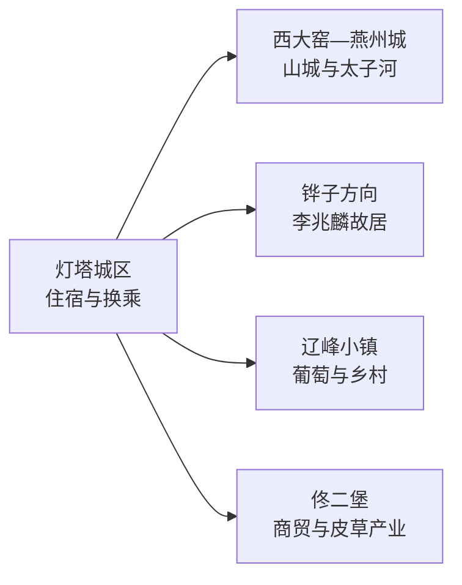
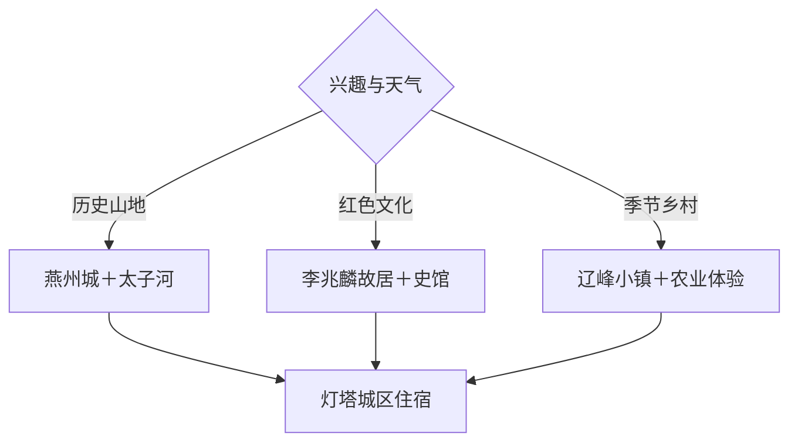

# 灯塔旅行指南

灯塔位于沈阳与辽阳之间，适合把燕州城山城、李兆麟红色记忆、太子河山水和辽峰葡萄等乡村体验组合成 1–2 天。城区承担住宿与换乘，燕州城—鸡冠山位于东南山地，李兆麟故居、辽峰小镇和佟二堡分属其他方向；一天选一条主题线，移动更从容。

本页绑定法定灯塔市的 GeoNames 行政记录 **2037704**。该记录位于项目固定 `cities500` 快照外，只计入法定县级市覆盖，不改变固定 GeoNames 候选进度。

## 城市速览

| 项目 | 信息 |
|---|---|
| 主线 | 燕州城山城—李兆麟故居—太子河山水—葡萄与乡村 |
| 停留 | 1 天选历史或乡村线；2 天加入红色文化与城区休息 |
| 住宿 | 灯塔城区便于铁路、公路和餐饮；远点住宿以当期营业为准 |
| 交通 | 铁路抵达后，以公交、出租或预约车辆串联乡镇景点 |
| 季节 | 春秋适合遗址步行；夏季核对强降雨和河流水情；冬季按冰雪缩短山地段 |
| 预算 | 城区消费平实，远点车辆、讲解和采摘体验形成主要增量 |

## 城市格局与游览区域

燕州城依山临河，是历史和地貌主线；李兆麟故居及相关纪念展陈适合独立半日；辽峰小镇、葡萄园和柳河子方向偏向季节性农业体验。佟二堡是市域西部商贸片区，适合明确购物或产业观察需求时加入，不与燕州城硬拼同日。

## 主要景点

| 景点 | 区域 | 类型 | 核心体验 | 用时 | 环境 | 体力 | 预约风险 | 天气影响 | 优先级 |
|---|---|---|---|---:|---|---|---|---|---|
| 燕州城山城 | 西大窑镇官屯村方向 | 考古遗址 | 高句丽晚期山城、石砌城墙和太子河地势 | 2–4小时 | 室外 | 中高 | 高 | 很高 | A |
| 燕州历史文化风景区公开游线 | 燕州城周边 | 山水与历史 | 山、河、崖壁与历史遗址的整体关系 | 半天 | 室外 | 中 | 高 | 很高 | A |
| 李兆麟故居及纪念展陈 | 铧子镇方向 | 红色纪念地 | 抗联将领生平、故居环境与地方记忆 | 1.5–2.5小时 | 混合 | 低 | 高 | 中 | A |
| 灯塔市党史美术馆 | 城区或官方公布场址 | 公共文化 | 地方党史、美术和主题展览 | 1–2小时 | 室内 | 低 | 高 | 低 | B |
| 灯塔市抗日史馆 | 官方公布场址 | 历史展馆 | 地方抗日史与红色教育 | 1–2小时 | 室内 | 低 | 高 | 低 | B |
| 辽峰小镇 | 乡村葡萄产区 | 农业与乡村 | 葡萄产业、温室与当季采摘体验 | 2–3小时 | 混合 | 低 | 季节时高 | 中高 | B |
| 太子河公开滨河节点 | 燕州方向 | 河流与生态 | 河谷地貌、滨河景观和低强度休闲 | 1–2小时 | 室外 | 低 | 低 | 很高 | B |
| 鸡冠山—胡巴什正式开放段 | 东部山地 | 山地与乡村 | 山林、村落和燕州城延伸景观 | 半天 | 室外 | 中高 | 很高 | 很高 | C |
| 佟二堡商贸公开区 | 佟二堡镇 | 产业与购物 | 皮草商贸、产业城市观察和购物 | 2–4小时 | 室内为主 | 低 | 低 | 低 | C |
| 柳河子农业或冰酒体验 | 柳河子镇方向 | 产业体验 | 葡萄种植、冰酒文化或当期开放园区 | 2–3小时 | 混合 | 低 | 很高 | 中 | C |

## 美食与餐饮

灯塔适合寻找辽菜、炖鱼、农家菜、玉米与东北面食。城区便于一人点饺子、面食或小份家常菜；乡村线的炖鱼和合菜通常适合共享，先确认份量。淡水鱼注意鱼刺，葡萄和酒类体验按个人健康、年龄及驾驶安排取舍。

## 经典行程

### 燕州城一日线
**路线**：城区—燕州城山城—午餐—太子河公开节点—返城。**逻辑**：遗址与河谷地形在同一方向。**预约锚点**：遗址开放和车辆。**休息**：正式服务区。**删除条件**：降雨、结冰或体力不足时缩短登高段。

### 红色文化一日线
**路线**：李兆麟故居—午餐—党史或抗日史展馆。**逻辑**：从人物经历进入地方抗战史。**预约锚点**：故居与展馆开放。**休息**：城区。**删除条件**：一处临时关闭时保留已确认场馆。

### 葡萄乡村线
**路线**：辽峰小镇—葡萄产业体验—乡村午餐。**逻辑**：围绕当季农业和乡村生活展开。**预约锚点**：采摘期、接待与价格。**休息**：园区服务点。**删除条件**：非产季或天气欠佳时改城区文化线。

### 佟二堡产业线
**路线**：佟二堡商贸公开区—午餐—产业公共展陈或街区。**逻辑**：以明确购物和产业观察为目标。**预约锚点**：无。**休息**：商贸区。**删除条件**：没有购物需求时整段替换为燕州城。

### 雨天场馆线
**路线**：党史美术馆—抗日史馆—城区餐饮。**逻辑**：室内完成地方历史主线。**预约锚点**：两馆开放。**休息**：城区。**删除条件**：极端天气预警时按属地安排暂停出行。

### 亲子低体力线
**路线**：李兆麟故居短线—午餐—辽峰小镇平缓开放区。**逻辑**：文化和农业体验相间。**预约锚点**：儿童活动与采摘。**休息**：园区和城区。**删除条件**：疲劳时只保留一处。

### 两日完整线
**路线**：首日燕州城—太子河，次日李兆麟故居—辽峰小镇。**逻辑**：山地历史与红色乡村分日。**预约锚点**：两日开放及车辆。**休息**：连续住城区。**删除条件**：压缩为一天时优先保留燕州城线。

## 住宿区域

灯塔城区适合多数旅行者，铁路抵离、餐饮和临时调整更方便。佟二堡住宿适合明确的商贸行程，选择时比较与历史景点的距离；乡村住宿适合已有车辆、已确认接待和次日活动的旅行者。

## 市内交通

通过 12306 核对灯塔站及其他票面站名。城区到西大窑、铧子、辽峰和佟二堡均需公路移动，按方向分日可减少折返。燕州城和鸡冠山沿正式步道进入；太子河行洪区、考古工作区、采石或工业生产区执行明确边界。

## 不同旅行者须知

历史爱好者优先燕州城与讲解；亲子家庭选择纪念展陈和当季农业体验；低体力旅行者以故居、场馆和太子河车辆近达段为主；摄影旅行者在遗址和公开河岸按晨昏调整。山城临崖、河流水情、文保修缮与农业生产规则按现场执行。

## 行前核对

- 通过辽宁省文旅、辽阳市和灯塔市官方渠道核对燕州城、故居与场馆开放。
- 通过 12306 核对铁路站点，并落实乡镇方向返程。
- 山地和河流线路核对降雨、雷电、水情、冰雪与森林火险。
- 采摘、冰酒和工业体验先确认产季、接待、价格、年龄与驾驶安排。

## 来源与更新记录

| 来源 | 支持内容 | 核验日期 |
|---|---|---|
| [辽宁省文旅厅：灯塔全域旅游](https://whly.ln.gov.cn/whly/mtjj/7AC41C3BFED7436E9ECF42D205C802C4/) | 燕州城、李兆麟、辽峰小镇、佟二堡与市域旅游格局 | 2026-09-04 |
| [辽宁省文旅厅：燕州城山城](https://whly.ln.gov.cn/whly/wlzt/lnww/zdwwbhdw/B4CA9EA94F8D4060883F2FFE968B8030/index.shtml) | 山城位置、考古和文物属性 | 2026-09-04 |
| [GeoNames 2037704](https://www.geonames.org/2037704/) | 灯塔市行政记录与空间范围 | 2026-09-04 |

