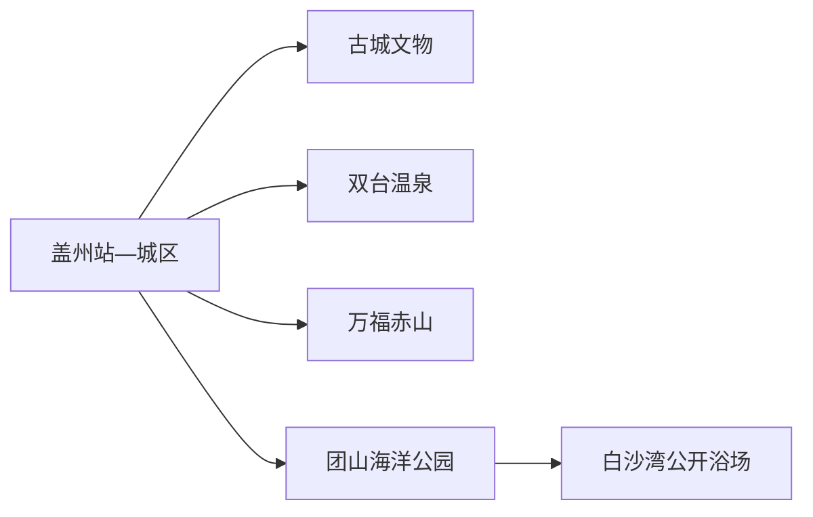
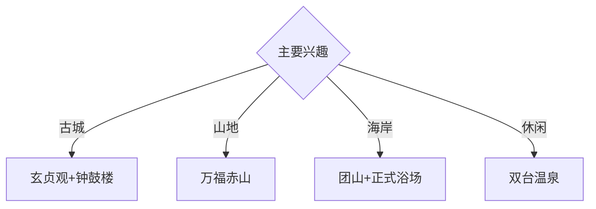

# 盖州旅行指南

盖州位于辽东半岛西北部，旅行空间从盖州古城延伸到东南山地、双台温泉和西部海岸。固定快照中的 **Gaizhou / GeoNames 2037325** 对应现行盖州市；首访适合以城区为基地，把古城、赤山和滨海各安排一个主题日。

## 城市速览

| 项目 | 信息 |
|---|---|
| 主线 | 古城文物—万福赤山—团山与白沙湾公开海岸 |
| 停留 | 城区1天；山地、温泉或海岸各另加1天 |
| 住宿 | 盖州城区便于综合换乘；双台适合温泉；海岸住宿按季节选择 |
| 交通 | 铁路、公路抵达；远端山海点位宜约车或自驾 |
| 风险 | 山洪林火、海况、浴场开放、港区与自然保护地边界 |

## 城市格局与游览区域

玄贞观、钟鼓楼等古城文物集中在城区；万福赤山位于东南山地，往返占用完整一天。双台温泉、团山海洋公园和白沙湾分属不同方向，住宿、返程与季节开放应分别核对。熊岳古城和山海广场属于营口市其他行政区域，跨界组合时另算交通。

## 主要景点

| 景点 | 区域 | 类型 | 核心体验 | 用时 | 环境 | 体力 | 研究价值 | 拥挤 | 优先级 |
|---|---|---|---|---:|---|---|---|---|---|
| 玄贞观 | 盖州古城 | 古建筑 | 道教建筑、古城历史与修缮观察 | 1–2小时 | 混合 | 低 | 很高 | 节假日中 | A |
| 钟鼓楼及古城公开街区 | 城区 | 城市遗产 | 城市轴线、传统街巷与地方生活 | 2小时 | 室外 | 低 | 高 | 傍晚中 | A |
| 盖州市博物馆或地方展陈 | 城区 | 博物馆 | 城市史、文物与非遗 | 2小时 | 室内 | 低 | 高 | 团体时中 | A |
| 万福赤山旅游景区 | 万福镇 | 山地景区 | 花岗岩山峰、森林与寺观文化 | 1天 | 室外 | 高 | 很高 | 旺季中高 | A |
| 辽宁团山国家级海洋公园公开区 | 北海方向 | 海岸地质 | 海蚀地貌、滨海景观与科普 | 半天 | 室外 | 中 | 很高 | 旺季高 | A |
| 白沙湾正式浴场 | 西南海岸 | 海滨 | 沙滩、日落与季节性亲水 | 半天 | 室外 | 低中 | 中 | 夏季高 | B |
| 双台镇正规温泉接待点 | 双台镇 | 温泉 | 温泉休闲与辽南乡镇生活 | 半天至1天 | 室内 | 低 | 中 | 周末中 | B |

## 美食与餐饮

海蜇、海鲜、苹果和辽南家常菜最有地方辨识度。海鲜按明码标价和实际重量点单；果园采摘进入经营者公布的接待区。温泉和海岸日适合提前确认餐饮营业季节与返城交通。

## 经典行程

### 一日古城线
**路线**：玄贞观—钟鼓楼—午餐—地方展陈—古城公开街区。**逻辑**：用文物与街巷建立盖州历史框架。**预约锚点**：馆舍和文物开放。**休息**：城区商业街。**删除条件**：馆舍闭馆时增加古城慢行。

### 赤山山地线
**路线**：城区—万福赤山游客入口—景区开放游线—返城。**逻辑**：给辽南山地完整一天。**预约锚点**：门票、接驳和返程。**休息**：游客服务区。**删除条件**：雷雨、山洪、结冰或林火预警时取消。

### 团山海岸线
**路线**：城区—团山海洋公园公开区—滨海科普—返城。**逻辑**：集中观察海岸地质。**预约锚点**：潮汐、开放入口和交通。**休息**：公园服务点。**删除条件**：大风、浓雾或封闭管理时改古城线。

### 白沙湾休闲线
**路线**：城区—白沙湾正式浴场—海岸步行—日落前返程。**逻辑**：把亲水限定在有人管理的海滨空间。**预约锚点**：浴场季节和救生服务。**休息**：正规商业区。**删除条件**：离岸风、雷电、赤潮或浴场关闭时取消亲水。

### 双台温泉线
**路线**：城区—双台镇—正规温泉接待点—返城或住宿。**逻辑**：以低体力方式体验温泉镇。**预约锚点**：营业、住宿和水质公示。**休息**：温泉接待区。**删除条件**：身体状况不适合泡浴时改古城线。

### 亲子科普线
**路线**：地方展陈—午休—团山海洋公园近入口公开段。**逻辑**：室内历史配海岸地质。**预约锚点**：展馆和公园开放。**休息**：城区与游客中心。**删除条件**：恶劣海况时只留城区。

### 雨天线
**路线**：地方展陈—午餐—古城可进入建筑—正规温泉。**逻辑**：以室内点位减少天气影响。**预约锚点**：馆舍与温泉营业。**休息**：城区。**删除条件**：道路积水或强对流时提前返宿。

## 住宿区域

盖州站—城区适合首次到访和多方向换乘；双台镇适合温泉主题；海岸住宿适合夏季慢游。海边与山地住宿按营业资质、消防、夜间交通和极端天气响应能力选择。

## 市内交通

盖州站、盖州西站承担铁路抵离，城区用公交、出租车和网约车。赤山、双台和海岸跨距较大，提前确认城乡公交末班或预约车辆；自驾沿公开道路通行，仙人岛港区、临港工业区、渔港作业面和矿区按门禁管理。

## 不同旅行者须知

历史兴趣者优先古城文物；地貌旅行者安排赤山与团山两个完整日；亲子家庭选择博物馆和海岸科普；行动不便者逐站确认古建台阶、景区接驳、无障碍卫生间与温泉设施。

## 行前核对

- 核对玄贞观、钟鼓楼、博物馆和赤山的当期开放。
- 核对海洋公园、浴场、潮汐、海况、救生服务和返程。
- 海洋公园保护区、林地、港池、渔港、矿区和临港生产区沿正式开放路线进入。

## 来源与更新记录

| 来源 | 支持内容 | 核验日期 |
|---|---|---|
| [盖州市政府：十五五规划建议](https://gaizhou.gov.cn/003/003003/20260108/def872c4-371b-49e6-80ae-7c3399496d77.html) | 古城文物、山海林泉格局与保护生产边界 | 2026-09-01 |
| [辽宁省文旅厅：万福赤山](https://whly.ln.gov.cn/whly/wlzt/sjly/ajjq/2025112415290813331/index.shtml) | 赤山位置、级别和游览主题 | 2026-09-01 |
| [GeoNames 2037325](https://www.geonames.org/2037325/) | Gaizhou 固定人口点与位置 | 2026-09-01 |

| 日期 | 更新 |
|---|---|
| 2026-09-01 | 首次完成盖州旅行研究；建立古城、山地、温泉与海岸路线。 |
