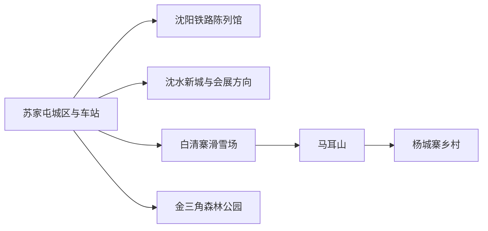
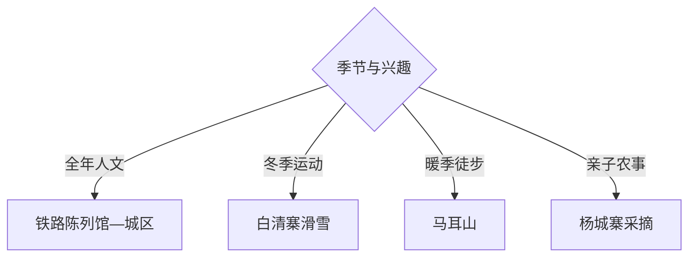

# 苏家屯旅行指南

苏家屯位于沈阳南部，适合围绕铁路工业、白清寨冰雪、马耳山乡村和杨城寨采摘组织短途。铁路陈列馆是全年人文核心；山地、滑雪和采摘依季节分别成日，住宿可在苏家屯城区与沈阳主城之间选择。

## 城市速览

| 项目 | 信息 |
|---|---|
| 主线 | 苏家屯城区—铁路陈列馆—白清寨—马耳山—杨城寨 |
| 停留 | 铁路主题1天；山地、冰雪或采摘另加1天 |
| 住宿 | 苏家屯城区适合早出与铁路抵离，沈阳主城选择更丰富 |
| 交通 | 铁路、地铁和公路接入，东南部乡村以预约车或自驾更合适 |
| 风险 | 冬季冰雪、山地林火、采摘季道路、展馆预约和运动项目规则 |
| 边界 | 铁路作业区、采石矿区、农田果园和山林按开放与生产边界进入 |

## 城市格局与游览区域

固定 `Sujiatun / GeoNames 2034638` 对应苏家屯城区，本页以法定苏家屯区 `Q1363539` 组织。铁路陈列馆靠近城区，白清寨、马耳山与杨城寨位于东南方向，适合一次只选择一个季节主题。

## 主要景点

| 景点 | 区域 | 类型 | 核心体验 | 用时 | 环境 | 体力 | 预约风险 | 天气影响 | 优先级 |
|---|---|---|---|---:|---|---|---|---|---|
| 沈阳铁路陈列馆 | 山丹街 | 工业文博 | 机车车辆、铁路史料与东北铁路发展 | 3–5小时 | 室内外 | 中 | 极高 | 中 | A |
| 白清寨滑雪场 | 白清寨 | 冰雪运动 | 分级雪道、滑雪教学与冬季山地 | 1天 | 室外 | 高 | 极高 | 极高 | A |
| 马耳山景区开放区 | 姚千方向 | 山地乡村 | 低山步道、林地与辽南乡村视野 | 半日至1天 | 室外 | 中高 | 很高 | 极高 | A |
| 杨城寨正规采摘与乡村接待点 | 大沟方向 | 农业体验 | 草莓等季节果蔬与乡村餐饮 | 半日 | 室内外 | 低中 | 很高 | 很高 | B |
| 金三角森林公园 | 城区南部 | 城市森林 | 林地散步、休闲和低强度活动 | 2–4小时 | 室外 | 低中 | 中 | 高 | B |
| 华彩儿童乐园 | 区内 | 亲子娱乐 | 儿童游乐与家庭活动 | 半日 | 室内外 | 低中 | 很高 | 中 | B |
| 苏家屯区公共文化场馆 | 城区 | 公共文化 | 地方活动、阅读与临时展览 | 1–3小时 | 室内 | 低 | 很高 | 低 | B |
| 沈阳国际展览中心当期展会 | 沈水方向 | 会展 | 专业展会、消费展与大型活动 | 半日至1天 | 室内 | 中 | 极高 | 低 | C |

## 美食与餐饮

可在城区找东北家常菜、饺子、烧烤、铁锅炖和清真餐饮，乡村线补充当季果蔬。多人共享更适合铁锅炖；点单先确认份量、辣度、花生芝麻和酒精。采摘按公布品种、称重价格和可进入棚区参与。

## 经典行程

### 一日经典线
**路线**：沈阳铁路陈列馆—苏家屯城区午餐—金三角森林公园。**逻辑**：工业文博与低强度绿地在城区附近组合。**预约锚点**：铁路陈列馆。**休息**：城区。**删除条件**：天气不佳时删除森林公园。

### 两日四季线
**路线**：首日铁路陈列馆；次日按季节选白清寨、马耳山或杨城寨。**逻辑**：全年核心与季节项目分日。**预约锚点**：场馆、景区、装备或采摘。**休息**：苏家屯城区。**删除条件**：第二日项目条件不匹配时保留公共文化线。

### 三日乡村线
**路线**：前两日基础线；第三日马耳山—杨城寨正规接待点。**逻辑**：徒步与乡村体验放在同一东南方向。**预约锚点**：山林开放、采摘与车辆。**休息**：乡村接待点。**删除条件**：林火或强降雨时整段删除。

### 雨雪天场馆线
**路线**：铁路陈列馆室内展区—区级公共文化场馆—城区用餐。**逻辑**：减少山路和户外停留。**预约锚点**：两馆开放。**休息**：城区。**删除条件**：暴雪预警时按交通公告留在住宿地附近。

### 亲子铁路线
**路线**：铁路陈列馆—午休—华彩儿童乐园或正规采摘。**逻辑**：大型装备与动手活动相互补充。**预约锚点**：儿童票、讲解、年龄与采摘。**休息**：场馆服务区。**删除条件**：年龄不适配时只留铁路馆。

### 冬季滑雪线
**路线**：城区—白清寨雪场—返程。**逻辑**：装备、教学和雪道活动需要完整一天。**预约锚点**：雪票、教练、装备、保险和雪况。**休息**：雪场服务区。**删除条件**：大风、极寒或雪道关闭时取消。

### 低体力线
**路线**：铁路陈列馆重点展区—城区午休—金三角森林公园短段。**逻辑**：用室内展馆和可折返平路控制强度。**预约锚点**：轮椅、座椅与落客。**休息**：城区。**删除条件**：户外地面湿滑时只留展馆。

## 住宿区域

苏家屯城区适合铁路陈列馆、白清寨早出和实用型住宿；沈阳南站或浑南方向适合会展及跨区联程；沈阳中心城区适合更多夜间活动。冬季预订同时确认供暖、装备寄存与天气退改。

## 市内交通

苏家屯站、沈阳南站与桃仙机场服务不同方向，按实际到达点规划。城区可地铁、公交和出租车组合，白清寨、马耳山及杨城寨更适合预约车或自驾。冬季给结冰路面和返程预留缓冲。

## 不同旅行者须知

铁路爱好者给陈列馆完整半日；滑雪者按能力选雪道和课程；亲子家庭在铁路馆、儿童乐园与采摘中组合；低体力旅行者保留城区。铁路作业线、矿业生产区、农田大棚和山林防火区保留明确限制。

## 行前核对

- 核对铁路陈列馆、白清寨、马耳山、儿童乐园、展会与采摘接待。
- 核对雪况、林火、雷雨、乡村道路、地铁公交和返程车辆。
- 滑雪按场馆分级与防护要求参加，采摘沿经营者指定棚区活动。

## 来源与更新记录

| 来源 | 支持内容 | 核验日期 |
|---|---|---|
| [辽宁省文旅厅：沈阳铁路陈列馆](https://whly.ln.gov.cn/whly/wlzt/sjly/ajjq/2026032314013126605/index.shtml) | 场馆位置、规模、展陈和4A级景区属性 | 2026-09-01 |
| [沈阳市文旅局：苏家屯A级景区](https://wlgd.shenyang.gov.cn/bsfw/bmfw/202604/t20260403_5011097.html) | 白清寨、马耳山、杨城寨、儿童乐园与森林公园 | 2026-09-01 |
| [GeoNames 2034638](https://www.geonames.org/2034638/) | Sujiatun 固定城市点 | 2026-09-01 |
| [Wikidata Q1363539](https://www.wikidata.org/wiki/Q1363539) | 苏家屯区实体与跨库标识 | 2026-09-01 |

| 日期 | 更新 |
|---|---|
| 2026-09-01 | 首次完成苏家屯旅行研究，按铁路、冰雪、山地与乡村分线。 |
