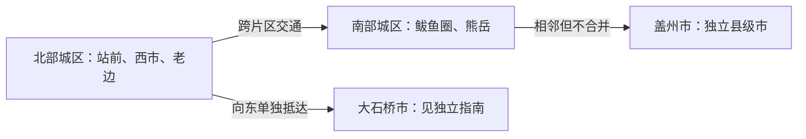

# 营口旅行指南

营口位于大辽河入海口与辽东湾北岸，旅行内容横跨百年商埠、近代海防、候鸟湿地、港城海滨和温泉。市域分为不同交通尺度：站前—西市组成北部主城，鲅鱼圈—熊岳构成南部滨海城区，盖州和[大石桥](./大石桥市.md)则是各自拥有城区与交通网络的县级市。安排行程时，先确定住宿在北部主城还是鲅鱼圈，再选择海滨、温泉或县级市换城段。

> 建议停留：2–4 天 
> 旅行关键词：百年商埠、辽河口湿地、海防遗址、海滨、温泉 
> 主要体力：中等步行；山地、沙滩与潮间带路面可升高 
> 最近研究：2026-08-13

## 城市速览

| 项目 | 旅行信息 |
|---|---|
| 主要旅行价值 | 在同一地级市内对照辽河老港的商埠史、近代海防遗址、候鸟湿地，以及鲅鱼圈—熊岳的港城、海滨和温泉生活 |
| 建议停留 | 2 天可看北部主城与鲅鱼圈各一日；3–4 天可增加熊岳温泉、盖州海岸或山地 |
| 较舒适季节 | 春秋适合观鸟与城市步行，夏季适合海滨但客流、雷雨和潮汐风险上升；冬季以温泉和室内内容为主 |
| 预算特点 | 老街、公园和公共岸线可控制支出；温泉、海滨旺季住宿、跨片区车辆和远郊交通会明显抬高预算 |
| 步行强度 | 北部老街与部分河岸可连续步行；西炮台、湿地观测点、鲅鱼圈海岸和熊岳之间需要车辆接驳 |
| 主要天气风险 | 沿海大风、海雾、雷暴、潮位变化与冬季海冰；夏季强降雨还会影响河岸、山路和跨片区道路 |
| 独行旅行 | 主城与鲅鱼圈白天移动较方便；夜间湿地、陌生海岸、港区外围和县域返程不宜临时探索 |
| 亲子旅行 | 博物馆、老街短段、月亮湖与正式海滨设施便于组合；海水、潮滩、温泉和山地需要持续看护 |
| 长者与低体力旅行 | 每天保留一个核心片区，使用车辆连接短段游览；不要把北部主城、鲅鱼圈和盖州海岸压进同一天 |
| 无障碍信息 | 大型公共场馆和公园可能提供单点设施，但历史街区、夯土遗址、沙滩、栈桥与温泉更衣区的连续通行需向官方确认 |

## 城市格局与游览区域

营口市规划将中心城区分成南北两核。北部城区以站前区、西市区及老边区部分城区为主，营口站、辽河老街、辽河文化产业带、西炮台和大辽河口公共观鸟空间都在这一旅行系统内；其中老街、老港地段和渡口相互邻近，但西炮台、鸟浪观测点与市博物馆仍需要公交或短途车辆连接。营口东站位于老边方向，兰旗机场也不在老街步行圈内。

南部城区以鲅鱼圈区为核心，港城生活区、月亮湖、山海广场与熊岳方向分布在更长的南北轴线上。鲅鱼圈港区首先是货运与工业生产空间，公共海滨景区不等于港池、堆场、钢厂、铁路专用线或防波堤开放。熊岳镇属于鲅鱼圈区，望儿山、温泉片区和熊岳历史地段彼此可以用车辆组合，却不是从鲅鱼圈中心连续步行可达的一组景点。

盖州市和[大石桥市](./大石桥市.md)均为营口代管的独立县级市。盖州城区、北海—团山、白沙湾—仙人岛与赤山分属不同方向；大石桥城区及其镁质材料、矿山相关区域也有独立的城市和生产边界。前往两座县级市时，按跨行政单元交通、当地住宿和返程重新排线。

| 区域 | 主要内容 | 游览特点 | 与其他区域的关系 |
|---|---|---|---|
| 站前—西市北部主城 | 营口市博物馆、辽河老街、楞严寺公园、公共河岸 | 老街与部分河岸适合步行，场馆与西端景点需短途接驳 | 适合住 1–2 晚；营口东站、机场和湿地观测点不在老街步行圈 |
| 辽河老港—渡口—西炮台 | 老港历史地段、渡口节点、辽河文化产业带、西炮台 | 可串成近代商埠与海防主题线；渡船是否运营必须另查 | 继续向西才到永远角、鸟浪观测带，不应沿生产岸线自行穿行 |
| 大辽河口湿地 | 鸟浪广场、永远角及公告开放的观鸟位置 | 受候鸟物候、潮位、大风和保护边界影响明显 | 只从公共道路和正式观察点进入，不下潮滩追鸟 |
| 鲅鱼圈港城与海滨 | 月亮湖、山海广场、新月牙湾及港城餐饮 | 城市公园与海滨可同日组合，夏季客流较集中 | 港区生产设施与公共海滨严格分开；北部主城往返需预留交通时间 |
| 熊岳与温泉片区 | 望儿山、熊岳历史地段、温泉设施 | 温泉多为独立经营场所，望儿山含坡道和台阶 | 可与鲅鱼圈同住组合；不要把所有温泉项目视为同一景区 |
| 盖州方向 | 盖州城区、团山海洋公园、白沙湾、赤山 | 海岸与山地分散，通常每次选择一个方向 | 盖州是独立县级市；赤山不能与白沙湾压缩成顺路短停 |
| [大石桥方向](./大石桥市.md) | 大石桥城区、农业平原与镁产业空间 | 普通旅行服务集中在城区，工业主题需事先确认接待 | 换城后按独立指南选择城区、金牛山或东部山区；矿山、厂区和专用铁路以正式接待范围为准 |

## 主要景点

优先级用于安排时间，不代表绝对排名：**A** 为首访核心，**B** 为按兴趣补充，**C** 为远郊、季节性或通常需要独立半天以上的目的地。车站、渡口和公共观测节点可标记为“路线节点”，不单独计入景点数量。同一景区内部的广场、栈桥、浴场和展厅只按一个项目处理。

### 北部主城与辽河岸

| 景点 | 区域 | 类型 | 主要看点 | 建议用时 | 室内外 | 体力 | 预约风险 | 天气影响 | 优先级 |
|---|---|---|---|---:|---|---|---|---|---|
| 营口市博物馆 | 北部主城 | 博物馆 | 营口地域历史、考古、开埠与馆藏专题；具体常设展和临展以当期公告为准 | 1.5–2.5 小时 | 室内 | 低 | 中 | 低 | A |
| 辽河老街 | 西市区 | 历史街区 | 开埠商埠格局、中西合璧历史建筑、街巷与夜间公共活动 | 1.5–3 小时 | 混合 | 低至中 | 低 | 中 | A |
| 营口西炮台遗址 | 西市区西端 | 海防遗址 | 清末夯土海防工程、近代战争史与遗址陈列 | 1–2 小时 | 混合 | 低至中 | 中 | 中 | A |
| 楞严寺公园 | 站前区 | 寺院与城市公园 | 寺院建筑、荷塘、城市公共园林与季节活动 | 1–1.5 小时 | 混合 | 低 | 低 | 中 | B |
| 营口渡口与辽河文化产业带公共岸线 | 老港—辽河岸 | 交通与历史节点 | 渡口、老港地段和河岸城市景观；只使用公告开放岸线和持证渡运 | 0.5–1.5 小时 | 室外 | 低 | 高 | 高 | 路线节点 |
| 大辽河口鸟浪观测带 | 西海岸与河口湿地 | 湿地观鸟 | 春秋迁徙水鸟、潮汐推动的鸟群活动与河海落日 | 1–2 小时 | 室外 | 低 | 低 | 高 | B |

辽河老街是历史街区，西炮台是独立的海防遗址，鸟浪广场和永远角则是湿地公共观察方向；三者不能拆分内部建筑或观景点重复计数。营口渡口既有历史意义，也可能承担现实运输功能，但码头改造、船舶、班次与停航会变化，不能把旧攻略中的渡船体验当作永久项目。

### 鲅鱼圈与熊岳

| 景点 | 区域 | 类型 | 主要看点 | 建议用时 | 室内外 | 体力 | 预约风险 | 天气影响 | 优先级 |
|---|---|---|---|---:|---|---|---|---|---|
| 山海广场—新月牙湾海滨 | 鲅鱼圈南部 | 海滨景区 | 广场、观海平台、栈桥和正式海滨浴场；内部设施按一个项目处理 | 2–4 小时 | 室外 | 中 | 低 | 高 | A |
| 月亮湖公园 | 鲅鱼圈南部 | 城市公园 | 海水湖、平缓步道与海洋主题公共空间 | 1–2 小时 | 室外 | 低 | 低 | 中至高 | B |
| 望儿山景区 | 熊岳镇东侧 | 山地与文化景区 | 独立山体、古塔与母爱文化主题 | 2–3 小时 | 室外 | 中至高 | 中 | 高 | B |
| 熊岳温泉片区 | 熊岳及周边 | 温泉康养 | 多家独立经营的温泉设施与辽南温泉传统 | 半天 | 室内或混合 | 低 | 中至高 | 低至中 | B |

山海广场的广场、新月牙湾浴场、观海堤与观景平台属于同一景区内部构成，不应拆成四个景点。月亮湖是另一座城市公园，可与山海广场同日组合。温泉片区不是一家店的别名，应按水质公示、设施维护、客流和健康提示比较同类型经营场所。

### 盖州海岸与山地

| 景点 | 区域 | 类型 | 主要看点 | 建议用时 | 室内外 | 体力 | 预约风险 | 天气影响 | 优先级 |
|---|---|---|---|---:|---|---|---|---|---|
| 辽宁团山国家级海洋公园景区 | 盖州北海方向 | 海岸地貌 | 滨海地貌、海洋主题游览与正式开放海岸 | 3–5 小时 | 室外 | 中 | 中 | 高 | B |
| 仙人岛白沙湾黄金海岸景区 | 盖州归州—九垄地方向 | 海滨景区 | 较长沙质海岸、海滨与周边果园季节景观 | 半天至 1 天 | 室外 | 中 | 中 | 高 | B |
| 盖州万福赤山景区 | 盖州万福镇 | 山地景区 | 辽南山地、森林、奇石与宗教文化景观 | 1 天 | 室外 | 高 | 中 | 高 | C |

团山、白沙湾和赤山分属不同方向。短行程在团山与白沙湾之间选择一个海岸项目即可；赤山需要单独一天，不与返程受限的海滨路线硬拼。海岸、森林公园和自然保护空间只按正式入口与开放步道活动。

## 美食与餐饮

营口饮食以辽菜、渤海海鲜、鲅鱼与海蜇制品见长，主城老街与生活商业区、鲅鱼圈港城餐饮区、盖州和大石桥城区各有不同侧重。海鲜价格和供应随季节变化，点单前确认计价单位、加工费、可食重量和做法；生腌水产对食材与冷链要求较高，不能接受生食风险时应选熟制。寻找同类型餐馆比追逐单一热门店更可靠。

| 菜品或餐饮类型 | 常见区域 | 一个人用餐与常见份量 | 风味、过敏原与饮食限制 | 排队风险与替代方法 |
|---|---|---|---|---|
| 鲅鱼馅水饺 | 老边、站前及全市饺子馆 | 通常可按盘点，独行用餐方便 | 鱼类、小麦，馅料可能含蛋；有鱼刺处理差异 | 饭点可能等位，可改选其他现包海鱼水饺并询问每份数量 |
| 鲅鱼、刀鱼等熟制海鱼 | 鲅鱼圈、主城与盖州海岸 | 整鱼常适合 2 人以上，小份鱼段较适合独行 | 鱼类过敏原与细刺；红烧、酱焖常含较多盐和酱油 | 海滨旺季价格波动，先问重量和时价；可选清蒸或鱼段小份 |
| 海蜇菜 | 鲅鱼圈及海鲜餐饮区 | 凉拌或爆炒常为共享盘，可询问半份 | 海产品、高盐；酱汁可能含芝麻、花生或大豆 | 热门海鲜店晚餐排队，可在非高峰寻找熟制海蜇菜替代 |
| 熟制海鲜与海鲜烧烤 | 鲅鱼圈、老街周边与盖州海岸 | 多人共享更容易控制品类，独行宜少量单点 | 甲壳类、贝类、鱼类及烧烤交叉接触风险 | 旺季先看明码标价；不把生腌或所谓“野生现捞”当作唯一选择 |
| 盖州线边、过油肉等地方菜 | 盖州城区 | 主食类较适合独行，过油肉多为共享盘 | 线边具体配料、肉类和小麦成分应现场确认；过油肉油脂较高 | 在盖州生活区寻找多家同类店，避免只为一店跨区往返 |
| 辽菜与酸菜锅 | 主城、鲅鱼圈及县级市城区 | 锅类多为 2 人以上，独行可选小锅或单点 | 肉类、盐分和汤底差异大；素食者需确认是否用骨汤 | 冬季与周末较热门，可改选锅包肉、熘炒或炖菜小份 |

## 经典行程

### 一日经典路线

**路线**：营口市博物馆 → 辽河老街午餐与街区步行 → 营口渡口及开放河岸 → 西炮台遗址 → 鸟浪广场或河口公共观测点

- **串联逻辑**：前半日用博物馆建立营口历史脉络，午后沿开埠商埠、渡口与海防主题向西推进；最后一段只在候鸟季、潮位和天气合适时保留。
- **预约锚点**：先确认博物馆和西炮台的开放时段；若以观鸟为主，潮位与官方观察点开放情况成为当天锚点。
- **休息安排**：辽河老街适合午餐；渡口或文化产业带公共服务区可短休，湿地段不要指望随处有室内设施。
- **时间不足时**：先删鸟浪观测段，再在博物馆与西炮台之间按兴趣二选一，不压缩老街步行和返程时间。

### 两日城市路线

**第 1 天**：营口市博物馆 → 辽河老街 → 西炮台 → 公开河岸看落日 
**第 2 天**：鲅鱼圈港城生活区 → 月亮湖公园 → 山海广场—新月牙湾海滨

- **串联逻辑**：两天分别使用北部历史主城和南部滨海城区，避免同一天长距离南北折返；第二天的月亮湖与山海广场位于鲅鱼圈南部，可用短途车辆衔接。
- **预约锚点**：第一天以场馆开放为锚点；第二天以海洋预报、浴场水质和景区当日管理为锚点。
- **休息安排**：第一天在老街，第二天在鲅鱼圈城市生活区用餐休息；海滨只在开放服务区停留。
- **时间不足时**：第二天删月亮湖，保留山海广场；若天气不适合海滨，则整段换成熊岳温泉或北部主城室内内容。

### 三日深度路线

**第 1 天**：营口市博物馆 → 辽河老街 → 渡口与辽河文化产业带 → 西炮台 
**第 2 天**：望儿山 → 熊岳午餐 → 经核验的温泉设施 
**第 3 天**：月亮湖 → 山海广场—新月牙湾；或改为盖州团山海洋公园、白沙湾二选一

- **串联逻辑**：历史主城、熊岳山泉、鲅鱼圈或盖州海岸各占一天，片区边界清楚；盖州海岸方案不再叠加鲅鱼圈完整海滨日。
- **预约锚点**：望儿山与温泉设施的开放和预约，第三天的海况、潮位、浴场公告与返程交通。
- **休息安排**：熊岳镇区、鲅鱼圈生活区或盖州海岸正式游客服务区承担午餐和避雨，不在港区道路或潮滩临时停靠。
- **时间不足时**：先删第三天远海岸方案；第二天再在望儿山和温泉之间二选一。

### 雨天路线

**路线**：营口市博物馆 → 主城熟制辽菜午餐 → 轻雨时短走辽河老街有遮蔽路段；持续降雨时改为经核验的温泉设施

- **适用条件**：普通小雨可保留短街区步行；暴雨、雷电、大风或内涝预警下取消河岸、湿地、海滨与山地，不为温泉跨区赶路。
- **预约锚点**：博物馆开放和温泉设施预约、维护公告。
- **休息安排**：以场馆、餐饮区和住宿地为主，不把车站或商场过道当成长期等候点。
- **时间不足时**：只保留博物馆和一顿地方餐；老街及跨区温泉可全部删除。

### 亲子或低体力路线

**亲子路线**：营口市博物馆 → 辽河老街短段 → 开放河岸；另一天在鲅鱼圈选择月亮湖 → 山海广场正式服务区。 
**低体力路线**：北部主城以博物馆 → 车辆接驳辽河老街短段 → 西炮台入口附近可达区域；或整天只在鲅鱼圈月亮湖与海滨平台活动。

- **减负方式**：亲子路线把水边和沙滩放在白天并保持持续看护；低体力路线不登望儿山、不走长沙滩，也不在同一天跨北部主城与鲅鱼圈。
- **预约锚点**：确认场馆儿童规则、推车存放，以及公园、遗址和海滨的无障碍入口；设施连续性需向官方确认。
- **休息安排**：老街生活区、博物馆和鲅鱼圈城市公园服务区较容易安排休息；湿地观测带应自带饮水和保暖防风用品。
- **时间不足时**：亲子路线删河岸，低体力路线删西炮台户外段，各自保留一个室内或平缓核心点。

### 远郊一日路线

**路线**：北部主城或鲅鱼圈出发 → 盖州北海—团山海洋公园，或白沙湾黄金海岸二选一 → 原路返回

- **适用条件**：只在海洋预报、浴场或景区公告、道路与返程都已确认时出发；若选择赤山，应改成完整山地一日，不再增加海滨。
- **预约锚点**：正式景区入口、当日开放、潮位和返程交通；自驾还需核对停车和施工。
- **休息安排**：使用景区游客中心或盖州、沿线镇区的正规服务设施，不进入仙人岛港区、养殖作业路或未开放防波堤。
- **时间不足时**：整段远郊取消，改游鲅鱼圈山海广场；不要以压缩安全等待和返程缓冲换取多看一个海岸点。

## 住宿区域

| 区域 | 优点 | 缺点 | 适合人群 | 交通特点 |
|---|---|---|---|---|
| 营口站—站前生活区 | 餐饮和城市服务集中，进入老街、博物馆与辽河岸较方便 | 距鲅鱼圈、熊岳和盖州海岸较远 | 首访、铁路抵达、以城市历史为主 | 营口站与城市公交较方便；营口东站抵达仍需接驳 |
| 辽河老街—西市区 | 夜间街区氛围较完整，靠近老港、西炮台方向 | 活动夜可能有噪声，前往机场和南部城区不占优势 | 喜欢历史街区、夜间散步和摄影 | 老街内可步行，去西炮台、湿地和其他城区需要车辆 |
| 鲅鱼圈中心生活区 | 海鲜餐饮和城市服务较全，适合串联月亮湖、海滨与熊岳 | 与北部主城分离，夏季周末价格和客流可能上升 | 海滨、温泉、亲子与较长停留 | 鲅鱼圈站仍需地面接驳；区内景点也不是全部步行相连 |
| 熊岳镇与温泉片区 | 靠近望儿山、熊岳历史地段和温泉设施 | 夜间选择和跨区公共交通需逐项核对 | 温泉、低节奏停留、冬季旅行 | 适合以单一温泉设施为锚点，不宜每天往返北部主城 |
| 盖州城区 | 进入盖州古城和县域公路方向较直接 | 团山、白沙湾、赤山仍在不同方向 | 盖州海岸或山地的前后住宿 | 盖州西站、普通铁路站与各景区入口并非同一地点 |

不推荐未经核验的具体酒店。预订时应确认到站接驳、夜间前台、取消条款、海滨旺季价格、供暖或空调、温泉是否包含在房费中，以及所谓“海景”是否面对港区或生产岸线。

## 市内交通

| 场景 | 建议与取舍 | 行前需要重查的内容 |
|---|---|---|
| 铁路抵达北部主城 | 营口站更接近传统城区；高铁营口东站位于老边方向，需要公交、出租车或网约车接入住宿地 | 车次实际停站、到达站名、末班接驳与夜间候车区 |
| 铁路抵达鲅鱼圈、熊岳或盖州 | 鲅鱼圈站服务南部城区与熊岳方向，盖州西站服务盖州方向；不能只按“营口”搜索后默认同站 | 车站出口、景区接驳、返程车次和旺季出租车供应 |
| 航空抵达 | 营口兰旗机场是市域航空门户，抵达后仍需道路接驳北部主城或鲅鱼圈 | 当期航班、机场巴士、出租车规则与夜间落地安排 |
| 北部主城内移动 | 辽河老街与局部河岸适合步行，博物馆、西炮台、湿地观测带之间宜用公交或短途车辆 | 公交调整、活动封路、渡口改造和河岸施工 |
| 北部主城往鲅鱼圈 | 这是南北城区之间的跨片区移动，应按公路客运、铁路或合法车辆单独计算，不视为城市地铁短程 | 班次、上下车点、道路施工和港区货车高峰 |
| 鲅鱼圈—熊岳—盖州 | 公交、道路客运和短途车辆承担主要接驳；住宿在鲅鱼圈可减少海滨日折返 | 末班车、景区最后入场、温泉结束时间和返程车辆 |
| 渡口与水上活动 | 只乘公告运营、证照和救生设备齐全的渡船或游船；历史渡口不等于每天有客运 | 码头位置、改造进度、班次、载客规则、停航与救生衣 |
| 自驾 | 对盖州海岸、赤山与多个分散片区较实用，但港区重型车辆、海滨停车和山路天气会增加负担 | 停车、施工、限行、充电、酒后替代驾驶、风浪与防汛管控 |

营口港的鲅鱼圈港区、仙人岛港区以货运生产为主。普通旅行者只能在公共道路、正式景区和明确开放的观景设施活动，不进入港池、码头、堆场、钢厂、油气设施、铁路专用线、渔港作业区和防波堤，也不以无人机越过生产或管制边界。

## 不同旅行者须知

| 旅行维度 | 可行条件 | 主要取舍 | 需额外核对 |
|---|---|---|---|
| 独行旅行 | 博物馆、老街、城市公园和白天公共海滨便于独自安排 | 县域返程、夜间湿地和陌生海岸选择少，不宜临时搭乘无资质车辆或船只 | 末班交通、住宿前台、观鸟点开放与潮位 |
| 亲子旅行 | 博物馆、月亮湖与正式海滨服务区可按年龄组合 | 渡口、潮滩、栈桥、海水、温泉池和山地需持续看护 | 儿童票、身高年龄规则、救生设施、亲子卫生间和推车存放 |
| 长者或低体力旅行 | 每天只保留一个片区，用车辆替代跨点步行 | 西炮台夯土遗址、沙滩、望儿山和赤山难以完全消除体力负担 | 最近下客点、座椅、电梯、坡度、温泉健康提示和返程缓冲 |
| 无障碍需求 | 大型场馆和城市公园可能具备单点无障碍设施 | 老街路面、遗址门槛、栈桥、沙滩、渡船和温泉湿区缺少可靠的连续通行资料 | 向场馆逐段确认入口坡道、门宽、电梯、卫生间、轮椅租借和接驳 |
| 摄影旅行 | 河海落日、历史街区与正式观鸟点主题鲜明 | 海风、盐雾、潮水和低温消耗器材；港口与工业设施存在摄影限制 | 潮位、候鸟物候、三脚架、无人机与商业拍摄规则；观鸟不开闪光灯、不逼近鸟群 |
| 预算有限 | 主城公共街区、公园与河岸可组成低门票城市日 | 远郊车辆、旺季海滨住宿、温泉和海鲜会显著增加支出 | 景区基础票与二次消费、海鲜时价、公交末班和住宿取消条款 |
| 晚出发或紧凑行程 | 北部主城只选老街—河岸，鲅鱼圈只选月亮湖—山海广场 | 下午抵达后不再增加盖州海岸、赤山或跨南北城区往返 | 最晚入场、夜间交通、海滨关闭与返程站点 |
| 雨季、高温或寒冷 | 普通降雨可转入博物馆或温泉，高温日把海滨步行移到早晚 | 雷暴、大风、暴雨、海冰和森林火险可能同时关闭户外项目 | 气象预警、海洋预报、浴场水质、道路积水、景区停复开和森林防火 |

湿地观鸟应使用官方公布的公共观察点，服从林草部门与现场管理要求，保持距离、不追鸟、不投喂、不下滩涂。海滨游泳只在正式开放浴场和管理时段内进行；旧潮汐表、目测海况和他人下水都不能替代当天海洋预报、浴场水质与现场警示。

## 行前核对

| 核对事项 | 为什么需要重查 | 建议核对时间 | 官方入口 |
|---|---|---|---|
| 营口市博物馆、西炮台与楞严寺 | 展览、闭馆安排、文物维护、宗教活动和临时活动会改变开放范围 | 排入路线前及到访前一日 | [营口市文旅广电局](https://wlgd.yingkou.gov.cn/)、[营口西炮台遗址](https://whly.ln.gov.cn/whly/wlzt/lnww/zdwwbhdw/CABD233271D84A77AC39044BCAA789F4/index.shtml) |
| 辽河老街、文化产业带与渡口 | 市集活动、道路管制、岸线施工、码头改造、渡船班次和停航变化较快 | 到访前一周及当天 | [营口市政府](https://www.yingkou.gov.cn/)、[营口市交通运输局](https://jtj.yingkou.gov.cn/) |
| 鸟浪与湿地观测 | 候鸟抵达、潮位、公共观察点、保护边界和活动组织具有季节性 | 出发前一周滚动查看，观鸟当天再查 | [营口市林业和草原局](https://lycyj.yingkou.gov.cn/)、[营口市自然资源局海洋预报](https://zrzyj.yingkou.gov.cn/) |
| 山海广场、月亮湖和海滨浴场 | 大风、海雾、雷暴、潮位、客流、水质与设备维护影响进入和下水 | 出发前三日及当天 | [国家海洋环境预报中心](https://www.nmefc.cn/)、[辽宁省海水浴场水质周报](https://sthj.ln.gov.cn/sthj/hjzl/hjzlbg/hsyczb/) |
| 望儿山与熊岳温泉 | 景区入场、温泉预约、场馆维护、儿童规则和健康提示可能调整 | 订房或购票前及到访前一日 | [辽宁省政府营口 A 级景区目录](https://www.ln.gov.cn/web/sqgk/whly/ajjq/yk/index.shtml)，并以具体经营场所官方公告为准 |
| 团山、白沙湾与赤山 | 海岸潮汐、山路、防汛、防火、停车、景交与最后入场会变化 | 出发前三日及当天 | [辽宁省政府营口 A 级景区目录](https://www.ln.gov.cn/web/sqgk/whly/ajjq/yk/index.shtml)、[营口市气象局](http://ln.cma.gov.cn/dsxx/yks/) |
| 铁路、航空与跨片区交通 | 车次、航班、到站、票价、道路施工和末班接驳变化频繁 | 购票时、出发前一日及当天 | [中国铁路 12306](https://www.12306.cn/)、[营口市交通运输局](https://jtj.yingkou.gov.cn/)、[中国民用航空局辽宁运输机场](https://www.caac.gov.cn/GYMH/MHGK/MYJC/DBDQ/LN/) |
| 港区、工业设施与无人机 | 生产作业、危险品运输、施工、门禁、摄影和空域规则会调整 | 安排港城自驾或摄影前 | [营口市交通运输局](https://jtj.yingkou.gov.cn/)，并服从现场围挡、警示与管理单位要求 |
| 餐厅、海鲜市场与节庆活动 | 营业状态、时价、计价方式、食品供应和活动日期变化快 | 排入路线前及点单前 | 经营者官方账号、市场监管公示与现场明码标价；不以旧攻略作为营业证明 |

## 来源与更新记录

### 主要来源

| 来源 | 类型 | 支持内容 | 核验日期 |
|---|---|---|---|
| [辽宁省政府：营口城市名片](https://www.ln.gov.cn/web/sqgk/csmp/2025101310551539487/index.shtml) | 政府 | 四个市辖区、盖州与大石桥两座县级市、开埠商埠、交通、河海湿地、温泉与饮食物产概况 | 2026-07-31 |
| [营口市国土空间总体规划（2021—2035年）](https://www.yingkou.gov.cn/govxxgk/ykszf/2024-11-07/dae03eb6-980f-4c84-8e2e-ab077cd206c8.html) | 政府规划 | 南北两核、北部与南部城区、盖州和大石桥副中心、历史地段、港口与客运枢纽、保护和生产边界 | 2026-07-31 |
| [辽宁省政府：营口 A 级景区目录](https://www.ln.gov.cn/web/sqgk/whly/ajjq/yk/index.shtml) | 政府旅游机构 | 团山、白沙湾、虹溪谷、赤山、月亮湖与望儿山的 A 级景区身份 | 2026-07-31 |
| [辽宁省文旅厅：营口西炮台遗址](https://whly.ln.gov.cn/whly/wlzt/lnww/zdwwbhdw/CABD233271D84A77AC39044BCAA789F4/index.shtml) | 政府文物机构 | 清末海防工程、夯土遗存、保护级别与遗址主题 | 2026-07-31 |
| [营口市政府：百年商埠焕新颜](https://www.yingkou.gov.cn/001/001001/20250725/44282b8c-fece-40f1-b1c3-4a1e9940191d.html) | 政府、专业报道 | 辽河老街的开埠建筑与历史街区属性 | 2026-07-31 |
| [营口市文旅广电局：市直博物馆发展措施](https://wlgd.yingkou.gov.cn/002/20251226/0d0bfb52-5ce7-4e2c-8f68-06ddec2d024c.html) | 政府文博机构 | 营口市博物馆的地域历史、开埠与河海主题，活动和开放可能动态调整 | 2026-07-31 |
| [营口市交通运输局：渡口运输站码头改造](https://jtj.yingkou.gov.cn/002/20250306/af72518d-96a6-4c76-96f0-8f516ed05e48.html) | 政府交通机构 | 渡口码头改造与渡运设施具有动态工程状态 | 2026-07-31 |
| [营口市政府：大辽河口候鸟数量与文明观鸟](https://www.yingkou.gov.cn/001/001001/20260429/d9536486-270a-4969-9809-a4ffcb36c38a.html) | 政府、林草监测 | 春季候鸟、潮位相关观测、观鸟距离与不惊扰原则 | 2026-07-31 |
| [营口市林草局：湿地与生物多样性保护](https://lycyj.yingkou.gov.cn/bszn/20240813/84824b89-0b32-4a3e-b5c6-c0e6c433f737.html) | 政府林草机构 | 大辽河口迁徙通道、永远角保护与湿地边界 | 2026-07-31 |
| [营口市政府：山海广场—月亮湖公园](https://www.yingkou.gov.cn/005/005002/005002002/20190513/786027e1-32ac-4cdd-b4e5-fe448ba77f5a.html) | 政府旅游资料 | 山海广场、新月牙湾、观海堤与月亮湖的构成和去重关系 | 2026-07-31 |
| [辽宁省政府：望儿山景区](https://www.ln.gov.cn/web/sqgk/whly/ajjq/yk/2025101410391657854/index.shtml) | 政府旅游机构 | 望儿山位置、山体、古塔与文化主题 | 2026-07-31 |
| [辽宁省政府：团山国家级海洋公园景区](https://www.ln.gov.cn/web/sqgk/whly/ajjq/yk/2025101410391726665/index.shtml) | 政府旅游机构 | 盖州北海方向的滨海地貌与景区身份 | 2026-07-31 |
| [辽宁省政府：仙人岛白沙湾黄金海岸](https://www.ln.gov.cn/web/sqgk/whly/ajjq/yk/2025101410391772325/index.shtml) | 政府旅游机构 | 盖州归州—九垄地方向、海岸尺度与滨海属性 | 2026-07-31 |
| [辽宁省政府：盖州万福赤山景区](https://www.ln.gov.cn/web/sqgk/whly/ajjq/yk/2025101410391712135/index.shtml) | 政府旅游机构 | 赤山位于盖州万福镇、森林与山地属性 | 2026-07-31 |
| [营口市交通运输局：交通概况](https://jtj.yingkou.gov.cn/012/012001/20260408/7c651b81-84d6-444a-87cc-4e8cb63d04bf.html) | 政府交通机构 | 兰旗机场、营口东站、铁路公路骨架，以及鲅鱼圈和仙人岛生产港区 | 2026-07-31 |
| [营口市政府：市域高铁站关系](https://www.yingkou.gov.cn/govxxgk/zfb/2017-08-29/d4be5b22-1c0b-4415-9c79-65c5c291663a.html) | 政府交通规划 | 营口东、盖州西与鲅鱼圈三座高铁站的片区关系 | 2026-07-31 |
| [营口市自然资源局：海洋预报示例](https://zrzyj.yingkou.gov.cn/govxxgk/zrzyj/2026-06-05/ebaf5830-1d6c-4943-b457-87cc2dd9fbfa.html) | 政府海洋机构 | 海浪、潮位、水温等需按日核验，不可使用固定旧值 | 2026-07-31 |
| [辽宁省生态环境厅：海水浴场水质周报](https://sthj.ln.gov.cn/sthj/hjzl/hjzlbg/hsyczb/2025071015491581518/2025071015485489190.pdf) | 政府生态环境机构 | 月牙湾浴场水质与游泳适宜度属于动态信息 | 2026-07-31 |
| [辽宁省商务厅：2024 辽宁地标美食](https://swt.ln.gov.cn/swt/ywxx/tzgg/2024102916531538698/index.shtml) | 政府商务机构 | 鲅鱼、海蜇、盖州线边、过油肉、鲅鱼馅水饺等营口菜品 | 2026-07-31 |
| [辽宁省民政厅：2025 年度行政区划代码公告](https://mzt.ln.gov.cn/mzt/zfxxgk/fdzdgknr/lzyj/mztgfxwj/gggs/2026012715312718674/index.shtml) | 政府民政机构 | 营口市法定代码 `210800` 及所属县级行政单位类型 | 2026-07-31 |
| [GeoNames：Yingkou 2033370](https://www.geonames.org/2033370/yingkou.html) | 开放地名数据，CC BY 4.0 | 固定清单采用的营口居民点记录与坐标标识 | 2026-07-31 |
| [GeoNames：Yingkou Shi 2033369](https://www.geonames.org/2033369/yingkou-shi.html) | 开放地名数据，CC BY 4.0 | 营口行政记录；与居民点 `2033370` 用途不同 | 2026-07-31 |
| [Wikidata：Q75150](https://www.wikidata.org/wiki/Q75150) | 开放结构化数据，CC0 | 营口实体交叉核验；其 GeoNames 属性指向行政记录 `2033369` | 2026-07-31 |

### 更新记录

| 日期 | 更新内容 |
|---|---|
| 2026-08-13 | 增加大石桥独立指南入口；营口页保留法定代管、区域关系与跨城衔接。 |
| 2026-07-31 | 首次完成资料研究与路线整理；核对法定代码 `210800`、Wikidata `Q75150` 与 GeoNames 标识。固定清单采用居民点 `2033370`；Wikidata 的 GeoNames 属性所连 `2033369` 是行政记录，二者分别承担聚落定位与行政实体用途，不互相替换。明确站前—西市北部主城、辽河老街—渡口—西炮台、鲅鱼圈—熊岳南部城区，以及盖州、大石桥两座独立县级市的旅行边界；建立港区生产设施、湿地保护、潮汐海滨和跨片区交通的安全规则。 |
