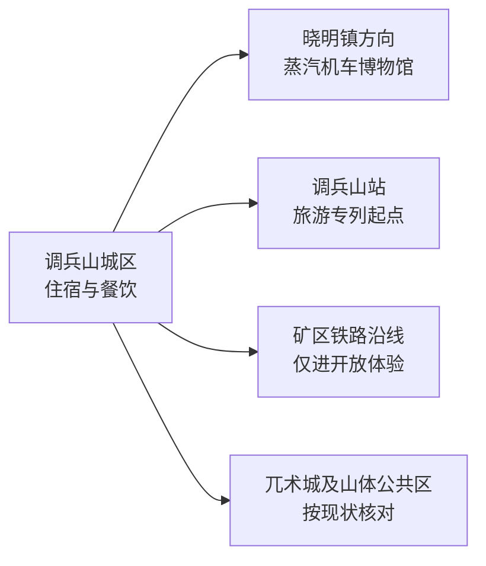
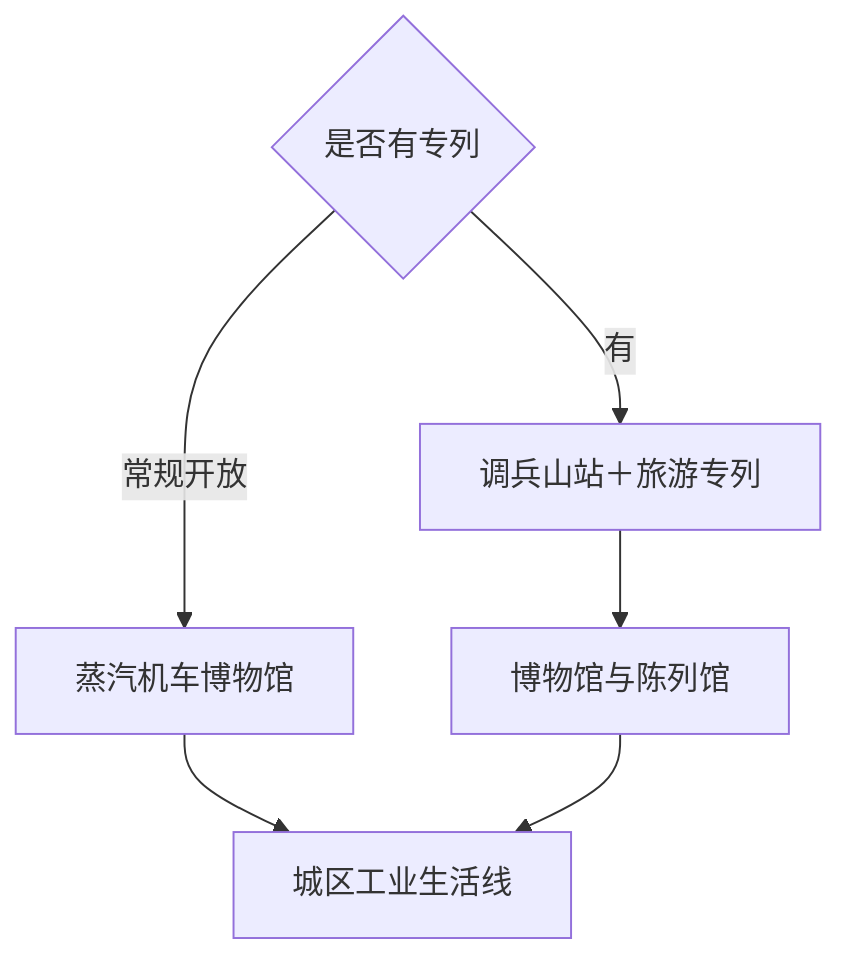

# 调兵山旅行指南

调兵山是一座由煤矿铁路塑造的辽北城市，首访重点是铁煤蒸汽机车博物馆及当期运行的旅游专列。城市体量不大，工业遗产、矿区生活、金文化地名与辽北平原共同构成背景；安排 1 天可以完成核心，遇到蒸汽机车推广季可延长到 2 天。

本页绑定法定调兵山市的 GeoNames 行政记录 **2034444**。该记录位于项目固定 `cities500` 快照外，只计入法定县级市覆盖，不改变固定 GeoNames 候选进度。

## 城市速览

| 项目 | 信息 |
|---|---|
| 主线 | 蒸汽机车—矿区铁路—工业城市—金文化地名 |
| 停留 | 常规 1 天；推广季、摄影或专题活动可安排 2 天 |
| 住宿 | 调兵山城区便于车站、餐饮和博物馆接驳 |
| 交通 | 铁路与公路抵离，专列和工业参观以运营方公告为准 |
| 季节 | 常规场馆全年可核对；冬季蒸汽与雪景突出，但严寒增加户外负担 |
| 预算 | 城区消费平实，专列、专题摄影、讲解和活动票是主要增量 |

## 城市格局与游览区域

蒸汽机车博物馆位于晓明镇方向，旅游专列通常从调兵山站按活动线路运行，两者的到达方式和开放时段需分别核对。矿井、编组场、机务作业区和企业专用线仍是生产空间，工业遗产体验只进入运营方发布的博物馆、专列、摄影点或参观单元。

## 主要景点

| 景点 | 区域 | 类型 | 核心体验 | 用时 | 环境 | 体力 | 预约风险 | 天气影响 | 优先级 |
|---|---|---|---|---:|---|---|---|---|---|
| 铁煤蒸汽机车博物馆 | 晓明镇方向 | 工业博物馆 | 蒸汽机车实物、铁路技术与矿区运输史 | 2–3小时 | 混合 | 低中 | 高 | 中 | A |
| 蒸汽机车陈列馆与博览园 | 博物馆景区内 | 工业展陈 | 多型号机车、零部件、模型和工作原理 | 1–2小时 | 室内为主 | 低 | 高 | 低 | A |
| 蒸汽机车旅游专列 | 调兵山站起讫 | 体验线路 | 运行机车、辽北铁路景观与活动车厢 | 半天 | 混合 | 低 | 很高 | 高 | A |
| 推广季正式摄影点 | 运营方公布位置 | 工业摄影 | 蒸汽、日出日落与列车运行场景 | 2–4小时 | 室外 | 中 | 很高 | 很高 | B |
| 调兵山城区工业生活线 | 主城区 | 城市街区 | 矿业城市空间、公共文化与居民生活 | 2小时 | 混合 | 低 | 低 | 中 | B |
| 兀术城公开区域 | 城区山体方向 | 历史主题景区 | 金文化地名、主题建筑与城市山景 | 1–2小时 | 室外为主 | 中 | 很高 | 高 | C |
| 调兵山公共山体步道 | 城区近郊 | 山体与公园 | 辽北平原远眺和城市休闲 | 1.5–2.5小时 | 室外 | 中 | 中 | 高 | B |
| 当期开放工业旅游单元 | 铁法能源相关区域 | 工业体验 | 矿业、铁路或影视拍摄场景的正式讲解 | 2–3小时 | 混合 | 中 | 很高 | 中 | C |
| 明月湖等城市公共空间 | 主城区 | 湖泊与公园 | 低强度散步和城市日常 | 1–2小时 | 室外 | 低 | 低 | 高 | C |
| 铁岭银州跨城联动 | 铁岭市区 | 跨城文博 | 银冈书院、地方历史与辽北城市比较 | 半天至1天 | 混合 | 低中 | 中 | 中 | C |

## 美食与餐饮

调兵山可寻找东北炖菜、烧烤、饺子、冷面和矿区家常菜。城区一人用餐较方便，烧烤和炖菜更适合共享；冬季活动日可提前安排午餐，避免与专列时段冲突。点餐时说明肉类、辣度、花生芝麻、麸质和油盐需求。

## 经典行程

### 蒸汽机车经典线
**路线**：调兵山站—旅游专列—蒸汽机车博物馆—城区。**逻辑**：先体验运行，再看技术与历史展陈。**预约锚点**：专列车票。**休息**：博物馆服务区。**删除条件**：专列停开时改博物馆常规线。

### 博物馆半日线
**路线**：蒸汽机车博物馆—陈列馆—博览园。**逻辑**：在一个正式景区内完整理解工业遗产。**预约锚点**：开馆与讲解。**休息**：馆区。**删除条件**：部分场馆维护时按开放顺序参观。

### 工业城市线
**路线**：博物馆—城区公共文化—矿区生活街区公共道路。**逻辑**：把技术史放回城市生活。**预约锚点**：公共场馆。**休息**：城区餐饮区。**删除条件**：时间不足时保留博物馆。

### 推广季摄影线
**路线**：运营方集合点—正式摄影点—专列或陈列馆。**逻辑**：机位、运行和安全由活动统一组织。**预约锚点**：摄影票与集合时间。**休息**：活动服务点。**删除条件**：能见度、风雪或运行调整时服从活动变更。

### 雨雪室内线
**路线**：陈列馆—博览园室内单元—城区餐饮。**逻辑**：减少露天停留。**预约锚点**：场馆开放。**休息**：馆区和城区。**删除条件**：道路预警或停运时按属地安排暂停出行。

### 亲子低体力线
**路线**：蒸汽机车陈列馆—短段室外机车展示—午餐。**逻辑**：机械实物直观，步行可控。**预约锚点**：儿童票和安全规则。**休息**：馆区。**删除条件**：低温或疲劳时只保留室内展陈。

### 两日专题线
**路线**：首日专列—博物馆，次日城市工业生活线—当期开放活动。**逻辑**：核心体验与城市背景分日。**预约锚点**：两日活动时刻。**休息**：连续住城区。**删除条件**：常规日压缩为首日即可。

## 住宿区域

调兵山城区适合多数行程，能兼顾车站、餐饮和博物馆接驳。推广季选择住宿时先锁定集合点和专列时刻，再比较距离；矿区外围住宿只有在运营方活动明确时才有必要。

## 市内交通

通过 12306 和活动公告核对调兵山站的车次及专列集合。城区到晓明镇博物馆以公交、出租或活动接驳为主。铁路股道、机务段、矿井、煤场、编组站和企业道路属于生产区域；摄影和参观沿运营方标示的游客路线进行。

## 不同旅行者须知

铁路爱好者优先锁定专列和讲解；摄影旅行者按官方机位、时刻与反光衣等装备规则准备；亲子家庭以陈列馆和短段户外展示为主；低体力旅行者跳过山体步道。蒸汽、高温设备、运行股道和冬季冰雪带来真实风险，现场隔离线和工作人员指令具有优先级。

## 行前核对

- 通过辽宁省文旅和铁法能源相关官方渠道核对博物馆、专列、摄影季及票务。
- 通过 12306 核对抵离车站，并确认车站—博物馆接驳。
- 冬季核对严寒、风雪、道路结冰和室外活动时长；夏季核对雷雨。
- 兀术城、山体步道和其他工业体验以当期明确开放为准。

## 来源与更新记录

| 来源 | 支持内容 | 核验日期 |
|---|---|---|
| [辽宁省文旅厅：铁煤蒸汽机车博物馆](https://whly.ln.gov.cn/whly/wlzt/sjly/ajjq/2025111415201655580/) | 景区等级、位置、机车馆藏与工业遗产价值 | 2026-09-04 |
| [辽宁省发展改革委：调兵山旅游季](https://fgw.ln.gov.cn/fgw/index/gsdt/2025052613403871710/index.shtml) | 蒸汽专列、博物馆与活动体验 | 2026-09-04 |
| [辽宁省文旅厅：铁马光影活动](https://whly.ln.gov.cn/whly/mtjj/2026020314395024339/index.shtml) | 专列、摄影点、影视文化和运营组织 | 2026-09-04 |
| [GeoNames 2034444](https://www.geonames.org/2034444/) | 调兵山市行政记录与空间范围 | 2026-09-04 |

