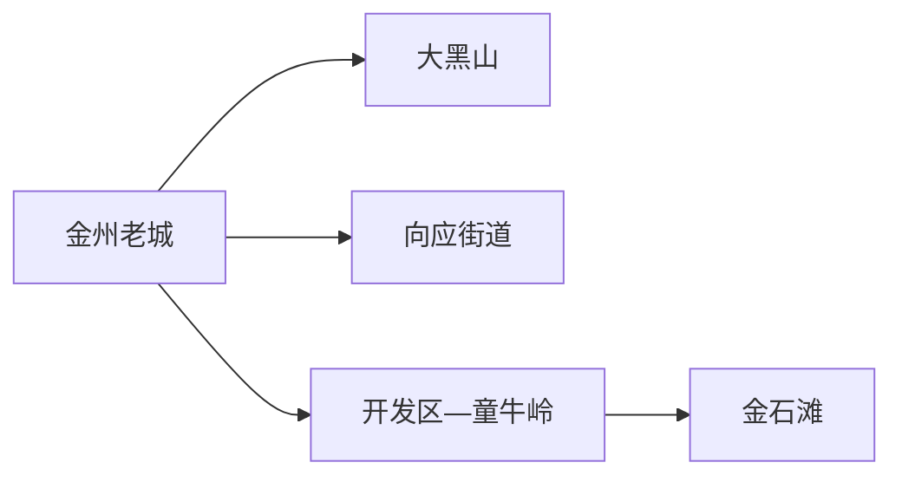
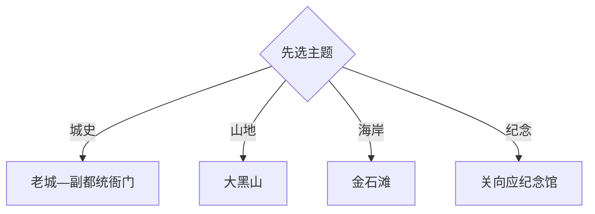

# 金州旅行指南

大连金州适合把金州老城、大黑山、关向应纪念文化和金石滩海岸分日安排。区内同时包含成熟度假区、历史城区、山地和开发区，跨度明显；两天抓老城与海岸，三天再增加大黑山或向应街道。

## 城市速览

| 项目 | 信息 |
|---|---|
| 主线 | 金州老城—大黑山—关向应纪念馆—金石滩—童牛岭 |
| 停留 | 核心2天；增加山地或红色文化共3天 |
| 住宿 | 金州老城交通方便，开发区适合商务与商圈，金石滩适合度假 |
| 交通 | 从大连主城乘轨道、公路进入，跨片区用轨道、公交、网约车或自驾 |
| 风险 | 海风海况、冬季冰雪、山地火险与结冰、节假日海岸客流 |
| 边界 | 金州区与金普新区为行政及功能区不同口径；军事、港口、保护地和山林封控区有明确限制 |

## 城市格局与游览区域

固定 `Jinzhou / GeoNames 1805298` 对应大连市金州区，本页以 `Q1362024` 确定法定区级实体。金普新区是管理与功能区口径，旅行资料常同时覆盖金州区和开发区；本页以实际片区、轨道和景点关系解释，不把“金州”“金普”当作完全相同名称。

## 主要景点

| 景点 | 区域 | 类型 | 核心体验 | 用时 | 环境 | 体力 | 预约风险 | 天气影响 | 优先级 |
|---|---|---|---|---:|---|---|---|---|---|
| 金州副都统衙门博物馆 | 金州老城 | 历史建筑与博物馆 | 清代地方治理、建筑与城市史 | 1.5–3小时 | 混合 | 低 | 中 | 低 | A |
| 金州博物馆或区级展陈 | 金州老城 | 地方文博 | 区域考古、城史与辽南文化 | 1.5–3小时 | 室内 | 低 | 中 | 低 | A |
| 大黑山风景区 | 老城东侧 | 山岳与遗迹 | 辽南山地、古城遗址和宗教建筑 | 半日至1天 | 室外 | 高 | 高 | 很高 | A |
| 关向应纪念馆 | 向应街道 | 纪念馆 | 关向应生平、故居与革命史 | 2–4小时 | 混合 | 低中 | 高 | 中 | A |
| 金石滩国家旅游度假区 | 东部海岸 | 海岸与地质 | 海岸地貌、博物馆群与度假设施 | 1天 | 混合 | 中 | 高 | 很高 | A |
| 童牛岭风景区 | 开发区 | 城市山海公园 | 山海视野、步道与开发区景观 | 3–5小时 | 室外 | 中高 | 中 | 很高 | B |
| 金州古城公共空间 | 金州老城 | 历史街区 | 街巷、城址线索与地方生活 | 2–4小时 | 室外为主 | 中 | 中 | 高 | B |
| 紫云花汐或季节花园 | 金州北部 | 季节园林 | 花田、乡村休闲与摄影 | 半日 | 室外 | 低中 | 高 | 很高 | C |

## 美食与餐饮

金州老城、开发区与金石滩均可选海鲜、焖子、海菜包子、烧烤和东北家常菜。海鲜先确认时价、重量和加工费，贝类过敏者主动说明；海岸和爬山日自备饮水，正规经营点比临时摊点更便于追溯。

## 经典行程

### 两日基础线
**路线**：金州老城—副都统衙门—次日金石滩。**逻辑**：历史城区与成熟海岸分日。**预约锚点**：博物馆、金石滩场馆。**休息**：老城和度假区。**删除条件**：海况差时次日改室内馆。

### 老城历史线
**路线**：金州博物馆—副都统衙门—古城公共街巷。**逻辑**：先看展陈，再辨认城市空间。**预约锚点**：两馆开放和讲解。**休息**：老城商业区。**删除条件**：闭馆时保留公共街巷短线。

### 大黑山登山线
**路线**：正式入口—核心山路—遗迹公开点—原路或指定出口。**逻辑**：完整半日至一日处理爬升。**预约锚点**：票务、入口、天气与防火。**休息**：游客服务点。**删除条件**：结冰、雷雨、大风或封山时取消。

### 金石滩海岸线
**路线**：轨道终点—游客中心—地质海岸或博物馆群—度假区晚餐。**逻辑**：以一个成熟度假区覆盖整日。**预约锚点**：场馆、观光交通和海岸开放。**休息**：游客中心。**删除条件**：海岸关闭时转室内馆群。

### 关向应纪念线
**路线**：向应街道—纪念馆—故居公开区—乡镇返程。**逻辑**：围绕单一人物完整理解。**预约锚点**：开馆、讲解和车辆。**休息**：向应街道。**删除条件**：场馆维护时取消远线。

### 山海公园线
**路线**：开发区—童牛岭—商圈午餐—滨海公共空间。**逻辑**：以城市近山和开发区生活组合。**预约锚点**：公园开放和天气。**休息**：开发区商圈。**删除条件**：大风或结冰时改室内商业文化空间。

### 低体力线
**路线**：副都统衙门—金州博物馆—车辆前往金石滩游客中心。**逻辑**：以平地和室内替代大黑山。**预约锚点**：无障碍、落客与馆群接驳。**休息**：场馆。**删除条件**：时间不足时保留老城两馆。

## 住宿区域

金州老城适合历史线、铁路和日常餐饮；开发区适合轨道、商圈与商务；金石滩适合海岸日和早晚散步，但离老城较远；大连主城适合把金州作为一日往返。选房时按次日第一站减少跨区通勤。

## 市内交通

大连轨道交通连接主城、开发区和金石滩，金州老城还需结合公交或短途打车。大黑山和向应方向先核对入口与返程；自驾关注景区停车、冬季路况和节假日管制。港口、军用设施和封闭海岸不作为通行捷径。

## 不同旅行者须知

历史兴趣者选老城；山地旅行者选大黑山；亲子和海岸旅行者用金石滩完整日；低体力者以两馆和度假区接驳为主。军事管理区、港口作业区、海岸保护段、林区封控段与未开放遗址保留明确限制。

## 行前核对

- 核对副都统衙门、区级展陈、大黑山、关向应纪念馆与金石滩开放。
- 核对轨道公交、山地防火和结冰、海风海况、场馆预约与节假日交通。
- 登山走正式入口，海岸遵守警戒与潮汐提示，港口和军事设施按法规与管理边界通行。

## 来源与更新记录

| 来源 | 支持内容 | 核验日期 |
|---|---|---|
| [金普新区旅游景点](https://www.dljp.gov.cn/zjjp/016001/016001006/016001006001/secpage.html) | 金石滩、副都统衙门、大黑山、童牛岭与季节景区 | 2026-09-01 |
| [金普新区地名文化保护名录](https://www.dljp.gov.cn/uploadfile/06e1685c-8382-421a-9795-48b68368cc10/%E9%99%84%E4%BB%B6%E9%87%91%E6%99%AE%E6%96%B0%E5%8C%BA%E5%9C%B0%E5%90%8D%E4%BF%9D%E6%8A%A4%E5%90%8D%E5%BD%95.pdf) | 大黑山、向应街道与地名文化 | 2026-09-01 |
| [大连市公务员教育基地](https://gbzx.dl.gov.cn/portal/index%21educationBase.action) | 关向应纪念馆属性 | 2026-09-01 |
| [GeoNames 1805298](https://www.geonames.org/1805298/) | Jinzhou 固定人口点 | 2026-09-01 |
| [Wikidata Q1362024](https://www.wikidata.org/wiki/Q1362024) | 金州区实体与跨库标识 | 2026-09-01 |

| 日期 | 更新 |
|---|---|
| 2026-09-01 | 首次完成金州旅行研究，按老城、大黑山、关向应与金石滩组织。 |
