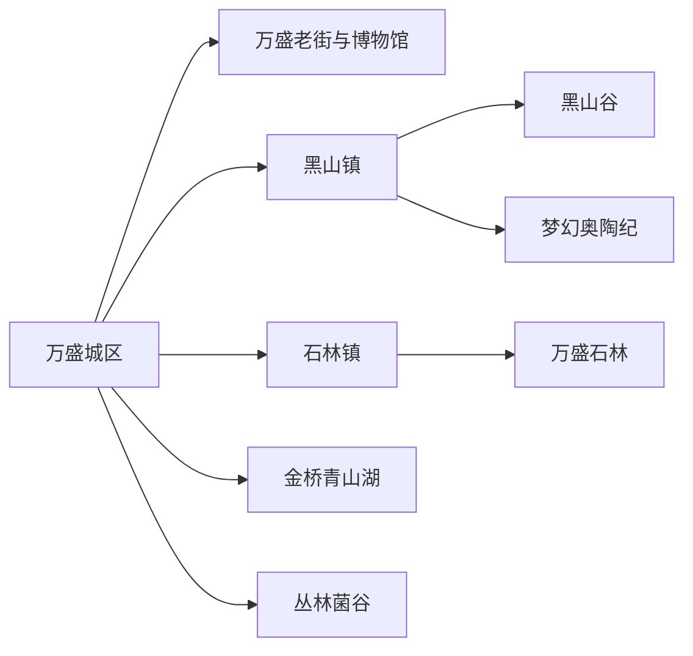
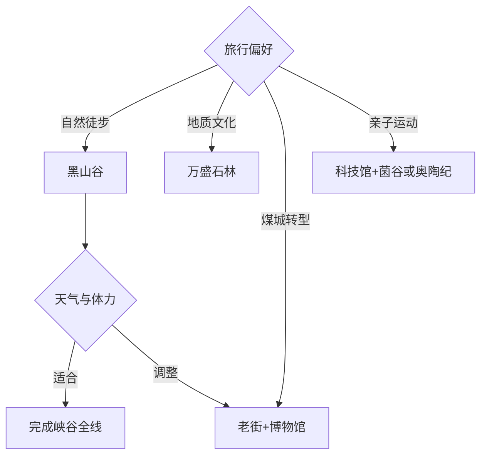

# 万盛旅行指南

万盛是一座由煤矿城市转向山地旅游与运动休闲的旅行目的地，城区、黑山谷、万盛石林和奥陶纪构成最清楚的四个落点。固定清单中的 **Wansheng / GeoNames 1791765** 对应万盛城区；第一次到访可住城区，用三天分别完成煤城文博、峡谷森林和喀斯特石林。山地景区跨度大、项目多，先选每天唯一核心，再用同方向的小型景点补足。

## 城市速览

| 项目 | 信息 |
|---|---|
| 主线 | 万盛城区—黑山谷—万盛石林—奥陶纪；金桥与丛林方向另选 |
| 停留 | 城区1天；黑山谷与石林各1天；游乐或康养再加1天 |
| 住宿 | 城区适合换线；黑山适合峡谷和度假；石林与板辽方向适合早出 |
| 交通 | 重庆中心城区或綦江方向经公路进入，区内以公交、景交或合规车辆衔接 |
| 季节 | 春秋适合徒步；夏季避暑，雨季关注山洪；冬季关注低温和结冰 |
| 边界 | 法定行政、经开区管理、景区运营、保护地、矿业生产和水域分别核对 |

## 城市格局与游览区域

现行行政区划中，万盛经开区范围归属于重庆市綦江区；旅行运营、公共服务与统计又常把万盛经开区和“綦江区（不含万盛）”分列。本页采用万盛经开区实际管理的两街八镇组织旅行，綦江古南、古剑山、东溪等方向继续由[綦江指南](./綦江区.md)承接。城市点坐标用于定位万盛城区，行政与管理边界以重庆市民政和万盛经开区官方资料为准。

城区适合了解南桐矿区、工业转型与当代生活；黑山镇集中黑山谷、奥陶纪和度假住宿；石林镇承接万盛石林及板辽方向；金桥镇有青山湖湿地，丛林镇连接菌谷和旅游公路。各方向之间多为山地公路，把黑山谷与石林压进同一天会明显牺牲步行与返程余量。

## 主要景点

| 景点 | 区域 | 类型 | 核心体验 | 用时 | 环境 | 体力 | 预约风险 | 天气影响 | 优先级 |
|---|---|---|---|---:|---|---|---|---|---|
| 黑山谷景区 | 黑山镇 | 峡谷与森林 | 溪谷、瀑布、浮桥、峡壁与生物多样性 | 1天 | 室外 | 高 | 很高 | 极高 | A |
| 万盛石林（龙鳞石海） | 石林镇 | 喀斯特地质 | 古老石林、溶蚀地貌与地质科普 | 半日至1天 | 室外 | 中高 | 很高 | 极高 | A |
| 梦幻奥陶纪 | 黑山方向 | 山地游乐 | 悬崖观景与运营型高空项目 | 半日至1天 | 室外 | 中 | 极高 | 极高 | B |
| 万盛老街 | 城区 | 历史街区 | 万盛场地名、煤城生活与非遗消费 | 2–4小时 | 混合 | 低 | 中 | 中 | A |
| 万盛博物馆 | 城区 | 地方文博 | 矿区建制、移民城市与地方历史 | 1.5–3小时 | 室内 | 低 | 很高 | 低 | A |
| 万盛科技馆 | 城区 | 科普场馆 | 资源型城市、工业与互动科普 | 1–2小时 | 室内 | 低 | 很高 | 低 | B |
| 金蝶湖文化公园 | 城区 | 城市公园 | 城区公共空间与转型后的城市景观 | 1–2小时 | 室外 | 低 | 中 | 高 | C |
| 青山湖国家湿地公园开放区 | 金桥镇 | 湖泊湿地 | 湖湾、低山丘陵与湿地观察 | 半日 | 室外 | 低中 | 极高 | 极高 | B |
| 板辽湖金沙滩及运营项目 | 石林方向 | 湖区休闲 | 湖岸休闲与季节水上活动 | 半日 | 室外 | 低中 | 极高 | 极高 | C |
| 丛林菌谷·蘑菇总动员 | 丛林镇 | 农业与科普 | 食用菌产业、亲子科普与乡村休闲 | 半日 | 混合 | 低中 | 极高 | 中 | B |

万盛石林与龙鳞石海指向同一景区，按一处计算。高空游乐、水上项目和森林峡谷分别核对年龄、身高、健康条件、装备与天气；湿地、湖库和喀斯特洞隙使用正式游线。矿业转型内容优先在场馆和获准开放的遗产项目理解。

## 美食与餐饮

城区适合尝八零一田螺、黑山谷方竹笋、豆花、烤鱼、辣子鸡和重庆小面，乡镇可选正规山珍、农家菜与食用菌主题餐饮。点方竹笋、菌类和山野食材时确认来源与充分加工；共享火锅说明花生、芝麻、大豆、菌菇和动物内脏过敏。山地日提前带水和能量补给，驾驶与饮酒分开安排。

## 经典行程

### 三日经典线
**路线**：首日万盛老街—博物馆—金蝶湖；次日黑山谷；第三日万盛石林。**逻辑**：先读煤城转型，再用两天分别完成峡谷和地质。**预约锚点**：两座核心景区、场馆与区内车辆。**休息**：城区、黑山游客中心和石林服务区。**删除条件**：山地闭园时以城区场馆替换当天远线。

### 两日自然线
**路线**：黑山谷—万盛石林。**逻辑**：分别观察森林峡谷与喀斯特石林，两晚可住城区或按接驳换到黑山。**预约锚点**：门票、景交、索道或接驳和返程。**休息**：两景区游客中心。**删除条件**：暴雨、山洪、雷电或道路管制时保留一个开放景区。

### 煤城转型线
**路线**：万盛博物馆—万盛老街—科技馆—金蝶湖。**逻辑**：从矿区建制、移民记忆读到当代公共空间。**预约锚点**：博物馆、科技馆与非遗活动。**休息**：老街。**删除条件**：场馆闭馆时以老街和公共文化活动为主。

### 黑山运动线
**路线**：黑山度假片区—梦幻奥陶纪当日开放项目—黑山镇住宿。**逻辑**：给高空游乐、排队和健康评估留出整日。**预约锚点**：项目清单、年龄身高、保险、天气和返程。**休息**：景区室内服务区。**删除条件**：强风、雷电、设备维护或健康条件不适时改黑山度假慢游。

### 金桥湿地线
**路线**：城区—青山湖湿地公园开放区—金桥镇公共接待—返程。**逻辑**：用低强度湖湾路线观察资源型地区生态修复。**预约锚点**：湿地开放、步道、车辆和返程。**休息**：正式服务点。**删除条件**：强降雨、水位异常或生态管护时取消湖岸。

### 丛林亲子线
**路线**：万盛科技馆—丛林菌谷·蘑菇总动员—旅游公路正式观景点。**逻辑**：工业科普与农业科普相接，活动强度较低。**预约锚点**：场馆、菌谷项目、适龄范围和车辆。**休息**：菌谷接待区。**删除条件**：项目停运或公路天气较差时只留城区场馆。

### 低体力线
**路线**：车辆到万盛博物馆—老街午餐—金蝶湖短段；或选择景区内有明确代步方案的一处。**逻辑**：用室内场馆、平缓街区和短接驳控制步数。**预约锚点**：落客、座椅、卫生间、景交和无障碍。**休息**：博物馆与老街。**删除条件**：高温、拥挤或湿滑时减少户外段。

## 住宿区域

万盛城区适合首次到访和多方向换线，餐饮、公共交通与医疗更集中；黑山镇及度假片区适合黑山谷、奥陶纪和避暑；石林、板辽方向适合已确认次日景区接驳的旅行者。山地住宿核对准确位置、海拔、空调或供暖、停车、夜间餐饮、通信、接送和退改。

## 市内交通

重庆中心城区到万盛以公路客运和自驾为主，綦江与万盛也按两套旅行落点理解；具体车站和班次在出发前确认。城区到黑山、石林、金桥和丛林分属不同方向，公交、景区专线与预约车辆按当期运营选择。丛黑公路连接多个景区和观景点，沿线停车只使用正式停车区。

## 不同旅行者须知

徒步者优先黑山谷，地质爱好者选万盛石林，亲子家庭选场馆与菌谷，运动旅行者按健康条件选择运营项目，工业史旅行者以博物馆和正式遗产展示为主。悬崖边缘、洞隙、湿地核心、饮用水源保护区、生产矿井、煤场、铁路专用线、塌陷修复区和废弃设施保留明确限制。

## 行前核对

- 核对黑山谷、万盛石林、奥陶纪、板辽湖、青山湖和菌谷的当日运营。
- 核对博物馆、科技馆、景交、区内公交、山地住宿和返程车辆。
- 核对暴雨、山洪、雷电、大雾、强风、结冰、高温与森林火险。
- 行政服务按万盛经开区当期口径查询，跨到綦江其他镇街时切换属地信息。

## 来源与更新记录

| 来源 | 支持内容 | 核验日期 |
|---|---|---|
| [重庆市民政局：万盛经开区地名与沿革](https://mzj.cq.gov.cn/sy_218/bmdt/mzyw/202405/t20240524_13232351.html) | 万盛行政归属、矿区沿革、旅行规模与资源型城市转型 | 2026-09-04 |
| [重庆市政府：万盛黑山谷景区](https://www.cq.gov.cn/zjcq/cycq/zmjd/zqaaaaajjq/202606/t20260604_15729059.html) | 黑山谷位置、峡谷森林与生物多样性 | 2026-09-04 |
| [万盛经开区：A级旅游景区名单](https://ws.cq.gov.cn/bm/lfw/bmgkml/jczwgk/lyly/ggfw_390205/lyfw/Ajjbqk/202512/t20251217_15251052.html) | 核心景区等级、地址、预约和动态票务入口 | 2026-09-04 |
| [重庆市政府：万盛旅游转型](https://www.cq.gov.cn/zwgk/zfxxgkml/zdlyxxgk/ggwh/ly/zxdt/202409/t20240912_13622820.html) | 老街、博物馆、科技馆、金蝶湖、核心景区与项目更新 | 2026-09-04 |
| [万盛经开区：文旅融合研究](https://ws.cq.gov.cn/ztlm_165/skyd/202409/t20240914_13630842.html) | 青山湖、板辽湖、菌谷、奥陶纪及生态康养线路 | 2026-09-04 |
| [万盛经开区：万盛石林名称说明](https://ws.cq.gov.cn/zwgk_165/fdzdgknr/jytablqk/zxta/202003/t20200301_5537609.html) | 万盛石林与龙鳞石海为同一景区 | 2026-09-04 |
| [重庆市政府：丛黑旅游公路](https://www.cq.gov.cn/zwgk/zfxxgkml/zdlyxxgk/ggwh/ly/zxdt/202409/t20240914_13634171.html) | 黑山、石林、奥陶纪、菌谷之间的公路联系与正式观景点 | 2026-09-04 |
| [GeoNames 1791765](https://www.geonames.org/1791765/) | Wansheng 固定人口点 | 2026-09-04 |

| 日期 | 更新 |
|---|---|
| 2026-09-04 | 首次完成万盛旅行研究；明确行政归属与经开区旅行管理口径，拆分城区、黑山、石林、金桥和丛林线路。 |
