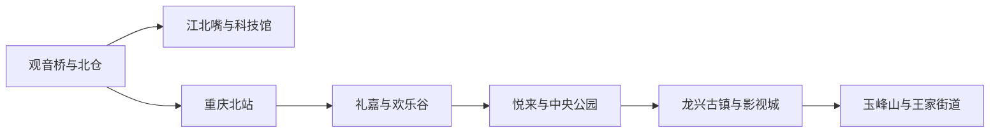
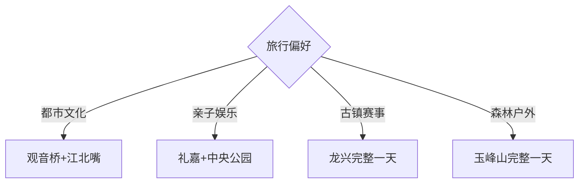

# 两江新区旅行指南

两江新区覆盖重庆中心城区北部、空港、龙盛、水土和两江沿岸多个片区，旅行重点从观音桥与江北嘴的都市生活，延伸到中央公园、悦来会展、龙兴古镇和玉峰山。片区跨度大，按轨道可达的都市日与需要专车的东部生态日分开安排更顺畅。

## 城市速览

| 项目 | 信息 |
|---|---|
| 主线 | 观音桥—江北嘴—礼嘉悦来—中央公园—龙兴玉峰山 |
| 停留 | 都市核心2天；龙兴或玉峰山另留1天 |
| 住宿 | 观音桥适合夜间生活；重庆北站周边便于跨城；悦来、中央公园适合会展与空港 |
| 交通 | 轨道交通承担主轴，龙兴古镇与山地用公交、出租车或包车补足 |
| 风险 | 山城坡道、夏季高温、强对流、滨江水位与大型活动散场客流 |
| 边界 | 滨江消落带、机场与保税港区、工业园、施工区和森林防火区分别管理 |

## 城市格局与游览区域

观音桥—江北嘴是成熟都市轴，礼嘉—悦来—中央公园沿轨道展开，龙兴与玉峰山位于东部远线。固定清单以王家街道记录 **GeoNames 8416968** 建页；现行官方页面确认王家街道属于2025年设立的两江新区。固定 **Shuanglonghu / GeoNames 12450887** 对应双龙湖街道，可由老两路生活区、碧津公园和机场轨道门户承接。Wikidata `Q6540045` 对应现行区级实体，法定代码为 `500157`；两条固定居民点用于定位不同旅行入口。

## 主要景点

| 景点 | 区域 | 类型 | 核心体验 | 用时 | 环境 | 体力 | 研究价值 | 拥挤 | 优先级 |
|---|---|---|---|---:|---|---|---|---|---|
| 观音桥商圈与北仓文创街区 | 观音桥 | 都市街区 | 山城商业、社区更新与夜间生活 | 3–5小时 | 混合 | 中 | 高 | 高 | A |
| 江北嘴—重庆大剧院—重庆科技馆 | 江北城 | 城市文博 | 两江交汇、公共建筑与科技展陈 | 半日至1天 | 混合 | 中 | 很高 | 高 | A |
| 重庆中央公园 | 空港新城 | 城市公园 | 大尺度公园、公共艺术与开阔步道 | 3–5小时 | 室外 | 中 | 中 | 中 | B |
| 碧津公园—巴渝古床博物馆公开区 | 双龙湖街道 | 城市公园与民俗 | 山水园林、古床展陈、七十二行雕塑与老两路生活 | 2–4小时 | 混合 | 低中 | 高 | 周末中 | B |
| 悦来会展与滨江公共空间 | 悦来 | 会展滨江 | 展会、建筑与嘉陵江岸线 | 3–6小时 | 混合 | 中 | 中 | 活动时高 | B |
| 重庆欢乐谷 | 礼嘉 | 主题乐园 | 大型游乐与亲子项目 | 1天 | 混合 | 高 | 中 | 高 | B |
| 龙兴古镇—龙兴足球场开放区域 | 龙兴 | 古镇体育 | 场镇历史、赛事空间与新城变化 | 半日至1天 | 混合 | 中 | 高 | 赛事时高 | B |
| 两江国际影视城正式开放区 | 龙兴 | 影视街区 | 近现代城市布景与影视产业 | 3–5小时 | 混合 | 中 | 中 | 中 | B |
| 玉峰山森林公园正式步道 | 玉峰山 | 山地生态 | 城郊森林、步道与山城东部地貌 | 1天含往返 | 室外 | 高 | 高 | 中 | B |

江北嘴滨江、会展场馆、足球场和影视城按当日活动与开放入口进入；机场运行区、港区、汽车制造与保税生产区按作业边界通行。

## 美食与餐饮

观音桥、北仓、江北嘴和礼嘉适合火锅、小面、江湖菜与多样餐饮；龙兴和王家方向更适合提前确认营业时段。点火锅说明辣度、牛油、内脏、花生芝麻和共享锅底；大型赛事或展会散场时，可步行离开核心入口后再选同类餐馆。

## 经典行程

### 两日基础线
**路线**：观音桥北仓—江北嘴文博—礼嘉或中央公园。**逻辑**：先完成成熟轨道轴。**预约锚点**：科技馆、展览和主题乐园。**休息**：观音桥或江北嘴商业体。**删除条件**：时间不足时删礼嘉远段。

### 两江都市线
**路线**：北仓—观音桥—重庆科技馆—大剧院外部—江北嘴滨江。**逻辑**：连续理解商业、社区与两江景观。**预约锚点**：场馆。**休息**：江北嘴。**删除条件**：高温时压缩滨江步行。

### 空港公园线
**路线**：中央公园—空港城市公共空间—悦来滨江。**逻辑**：串联新城规划与开阔绿地。**预约锚点**：展会和活动。**休息**：中央公园周边。**删除条件**：雷雨时保留室内场馆。

双龙湖可作为机场抵离日替代：轨道或公交到老两路—碧津公园正式入口—巴渝古床博物馆当期开放区—双龙湖街道生活区。以馆舍开放、航班余量和返程末班为预约锚点，在暴雨、公园封闭或时间不足时只保留室内展陈并在老两路坐休。

### 礼嘉亲子线
**路线**：欢乐谷完整游览—礼嘉滨水公共空间。**逻辑**：把高强度乐园单独成日。**预约锚点**：门票、项目开放与儿童身高规则。**休息**：园内服务区。**删除条件**：高温或客流过大时缩短夜场。

### 龙兴文体线
**路线**：龙兴古镇—足球场外部与赛事—影视城开放区。**逻辑**：古镇、新城和文体场景集中在同一方向。**预约锚点**：赛事、影视城和接驳。**休息**：龙兴镇。**删除条件**：无赛事时保留古镇与影视城。

### 玉峰山户外线
**路线**：王家街道—玉峰山正式入口—开放步道—返程。**逻辑**：山地线需要完整天气窗口。**预约锚点**：森林开放、防火公告与车辆。**休息**：入口服务点。**删除条件**：雷雨、大风或火险预警时取消。

### 低体力线
**路线**：观音桥室内商业—车辆到江北嘴—科技馆—中央公园短步行。**逻辑**：以电梯、车辆和室内休息替代长坡。**预约锚点**：场馆无障碍入口。**休息**：每个片区商业体。**删除条件**：大型活动拥挤时只留一个片区。

## 住宿区域

观音桥适合餐饮与夜间活动；重庆北站周边适合铁路抵离；江北嘴适合滨江和商务；礼嘉、悦来适合乐园与会展；中央公园和空港片区便于机场；双龙湖—老两路适合早晚航班、碧津公园和日常餐饮；龙兴住宿适合连续参加赛事或东部远线。订房时核对轨道末班、具体航站楼、展会房价、隔音与山城步行坡度。

## 市内交通

轨道交通覆盖观音桥、江北嘴、重庆北站、礼嘉、悦来、双龙湖和空港主轴。双龙湖街道以轨道或骨干公交接入老两路，再分段步行到碧津公园；龙兴、影视城、玉峰山与王家街道之间仍需公交、出租车或包车组合。赛事日按官方接驳和临时管制安排，跨片区预留换乘和步行时间，机场、重庆北站与目的地名称分别核对。

## 不同旅行者须知

都市观察者优先江北嘴、观音桥和新城公园；亲子家庭选科技馆、欢乐谷与中央公园；赛事旅行者住龙兴或轨道沿线；徒步者按天气进入玉峰山；长者和低体力旅行者以轨道、电梯和单片区慢游减少坡道。

## 行前核对

- 核对科技馆、欢乐谷、影视城、会展与赛事开放和预约。
- 核对轨道末班、赛事接驳、道路施工、高温、雷雨和森林火险。
- 滨江消落带、森林防火区、机场港区、工业园和施工区按正式边界进入。

## 来源与更新记录

| 来源 | 支持内容 | 核验日期 |
|---|---|---|
| [两江新区政府：走进两江](https://www.ljxq.gov.cn/zjlj/) | 现行区级身份、范围、街镇和都市资源 | 2026-09-01 |
| [两江新区政府：王家街道机关简介](https://www.ljxq.gov.cn/jz/wjjd_504282/zwgk/fdzdgknr/jgjj/) | 固定记录所在街道与现行归属 | 2026-09-01 |
| [两江新区政府：文旅发展与龙兴片区](https://www.ljxq.gov.cn/zwgk/zfxxgkml/jytabl/rddbjybl/202607/t20260717_15831066.html) | 龙兴古镇、足球场、影视城和玉峰山组合 | 2026-09-01 |
| [两江新区政府：2025年统计公报](https://www.ljxq.gov.cn/bm/qtjj/zwgk/fdzdgknr/tjxx_130843/sjfb_373048/tjnj_346633/202604/t20260429_15645518.html) | A级景区、文博、公园与都市片区 | 2026-09-01 |
| [两江新区政府：双龙湖街道](https://www.ljxq.gov.cn/jz/slhjd_504279/) | 固定记录所在街道与现行归属 | 2026-09-01 |
| [重庆市城市管理局：碧津公园](https://cgj.cq.gov.cn/rdzt/zxsp/dckj/202104/t20210415_9172670.html) | 双龙湖街道内的碧津公园及一园三馆结构 | 2026-09-01 |
| [GeoNames 8416968](https://www.geonames.org/8416968/) | Wangjia 固定城市点 | 2026-09-01 |
| [Wikidata Q6540045](https://www.wikidata.org/wiki/Q6540045) | 两江新区实体与代码 | 2026-09-01 |

| 日期 | 更新 |
|---|---|
| 2026-09-01 | 首次完成两江新区旅行研究；按现行行政区划承接王家街道记录 |
