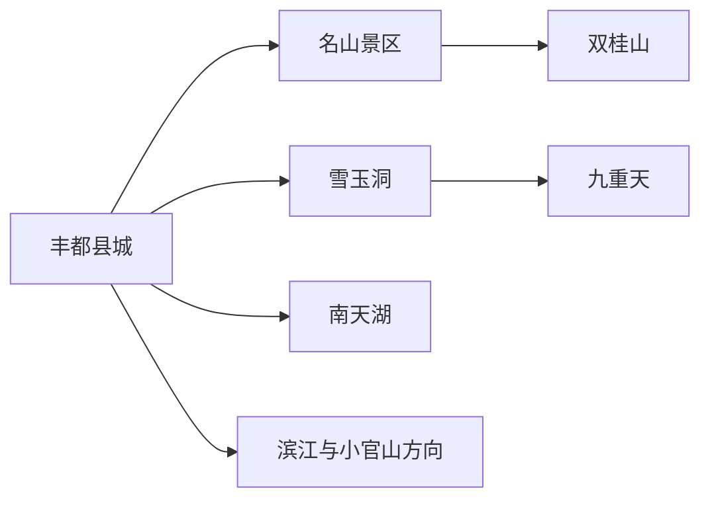
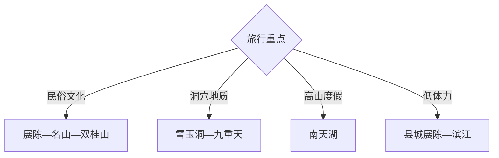

# 丰都旅行指南

丰都适合把长江岸边的名山民俗、龙河洞穴和南天湖高山度假拆成三条线：名山与县城可做一日，雪玉洞和九重天合并为龙河方向，南天湖单留完整一天。两到三天能兼顾文化、地质与高山气候。

## 城市速览

| 项目 | 信息 |
|---|---|
| 主线 | 三合街道—名山—双桂山—雪玉洞—九重天—南天湖 |
| 停留 | 名山县城1天；增加龙河或南天湖共2–3天 |
| 住宿 | 县城适合交通和名山，南天湖适合避暑冰雪，龙河方向按景区接驳 |
| 交通 | 从重庆乘铁路、公路或合适的长江航线抵达，远景区用专线、预约车或自驾 |
| 风险 | 长江水情、洞穴湿滑、高山低温冰雪、节会客流和山路 |
| 边界 | 民俗宗教空间、文物建筑、洞穴科研区、湿地林地和码头作业区按开放范围进入 |

## 城市格局与游览区域

固定 `Fengcheng / GeoNames 8416626` 对应丰都主城片区，本页以法定丰都县 `Q737865` 组织。名山在长江对岸旅游片区，雪玉洞与九重天在龙河走廊，南天湖位于更高海拔的南部，适合各自成日。

## 主要景点

| 景点 | 区域 | 类型 | 核心体验 | 用时 | 环境 | 体力 | 预约风险 | 天气影响 | 优先级 |
|---|---|---|---|---:|---|---|---|---|---|
| 丰都名山景区 | 名山街道 | 民俗与古建 | 地方信俗、古建筑与山地游线 | 4–7小时 | 室内外 | 中高 | 很高 | 高 | A |
| 双桂山国家森林公园公开区 | 名山片区 | 山林文化 | 林地、古迹与名山联游 | 2–4小时 | 室外 | 中 | 高 | 很高 | B |
| 小官山古民居公开区 | 县城滨江方向 | 民俗建筑 | 三峡移民搬迁建筑与街巷 | 1–3小时 | 室内外 | 低中 | 高 | 中 | B |
| 丰都博物馆或县级展陈 | 县城 | 地方文博 | 巴文化、县史与三峡文物 | 1.5–3小时 | 室内 | 低 | 很高 | 低 | A |
| 雪玉洞景区 | 龙河镇方向 | 洞穴地质 | 洁白钟乳石、洞穴科普与峡谷 | 3–5小时 | 洞穴 | 中 | 很高 | 中 | A |
| 九重天景区 | 双路镇方向 | 山地峡谷 | 喀斯特、山地步道与观景项目 | 4–7小时 | 室外 | 高 | 很高 | 极高 | B |
| 南天湖国家级旅游度假区 | 南天湖镇 | 高山湖泊 | 湖滨、森林、避暑与冰雪 | 1天 | 室外 | 中 | 极高 | 极高 | A |
| 长江滨江公开空间 | 县城 | 水岸城市 | 江景、城市夜色与移民城市观察 | 1–3小时 | 室外 | 低 | 低 | 高 | B |

## 美食与餐饮

县城可选丰都麻辣鸡、仙家豆腐乳、红心柚、龙眼、栗子大米和重庆江湖菜，南天湖与龙河方向以景区或乡镇正规餐饮为主。辣度、份量和时价先确认，高山日带热饮并留意酒后山路交通。

## 经典行程

### 一日经典线
**路线**：县级展陈—名山景区—滨江晚餐。**逻辑**：先补地方历史，再进入民俗主题空间。**预约锚点**：名山票务、索道或景区交通。**休息**：名山游客中心。**删除条件**：高温或设备停运时缩短山体段。

### 三日全景线
**路线**：首日名山；次日雪玉洞—九重天择优；三日南天湖。**逻辑**：文化、地质、高山三线分日。**预约锚点**：三处景区、车辆和住宿。**休息**：县城与南天湖。**删除条件**：天气不稳时优先删除九重天。

### 洞穴地质线
**路线**：雪玉洞讲解—龙河乡镇午餐—九重天短线。**逻辑**：洞穴科普为核心，户外峡谷按体力追加。**预约锚点**：洞内批次、景区接驳和装备。**休息**：雪玉洞游客中心。**删除条件**：强降雨时只保留确认开放的洞穴项目。

### 南天湖度假线
**路线**：湖滨公开区—森林步道—当季正规项目—度假区住宿。**逻辑**：围绕高山气候慢游，减少当天往返。**预约锚点**：门票、住宿、冰雪项目和道路。**休息**：度假区。**删除条件**：大雾、冰雪封路或雷雨时取消户外。

### 民俗文化线
**路线**：博物馆—名山—小官山公开区。**逻辑**：区分历史资料、景区叙事与民居观察。**预约锚点**：展馆、名山活动和小官山开放。**休息**：县城。**删除条件**：节会限流时只留预约点。

### 亲子科普线
**路线**：县级展陈—雪玉洞讲解—县城返程。**逻辑**：用室内历史与洞穴科学形成双主题。**预约锚点**：儿童身高、洞内温度和讲解。**休息**：洞口服务区。**删除条件**：儿童不适应洞穴时改滨江。

### 低体力线
**路线**：县级展陈—车辆到名山低位开放区—滨江短段。**逻辑**：利用景区交通和城市平路降低爬升。**预约锚点**：索道、观光车和无障碍。**休息**：游客中心。**删除条件**：辅助交通停运时只留县城。

## 住宿区域

丰都县城适合铁路、港口、公路与三条旅游线换乘；名山周边适合早入园；南天湖适合避暑、冰雪与高山慢住；龙河方向住宿用于雪玉洞、九重天联游。高山住宿确认供暖、停车、医疗距离和天气退改。

## 市内交通

名山、龙河景区和南天湖分属三条方向，先锁定一日一线。铁路站、汽车站、港口与景区入口之间按实际接驳换乘；自驾南天湖冬季准备适用轮胎或防滑装备，洞穴与峡谷日避免夜间山路。

## 不同旅行者须知

文化旅行者先看县级展陈再游名山；地质爱好者预约雪玉洞讲解；亲子家庭选择洞穴或湖滨单主题；低体力者使用景区交通。洞穴未开放支洞、科研监测点、长江航道、码头作业区、湿地林地和民俗仪式非开放区保留明确限制。

## 行前核对

- 核对名山、雪玉洞、九重天、南天湖和博物馆的预约、运营时间及设施状态。
- 核对江面水情、洞内温度、高山大雾冰雪、道路、索道观光车和返程。
- 洞穴按导览线行走，高山项目配齐装备，民俗展示与现实信仰保持区分和尊重。

## 来源与更新记录

| 来源 | 支持内容 | 核验日期 |
|---|---|---|
| [丰都县旅游](https://www.cqfd.gov.cn/zjfd/fdly/) | 名山、雪玉洞、九重天与南天湖官方入口 | 2026-09-01 |
| [丰都县A级景区名录](https://www.cqfd.gov.cn/bm/whhlyfzwyh/zwgk_36090/zfxxgkml/jczwgk/ggwhfwly/ggfw_273610/ggwljgml/202605/t20260526_15705366.html) | 景区等级、预约、开放与地址 | 2026-09-01 |
| [GeoNames 8416626](https://www.geonames.org/8416626/) | Fengcheng 固定主城点 | 2026-09-01 |
| [Wikidata Q737865](https://www.wikidata.org/wiki/Q737865) | 丰都县实体与跨库标识 | 2026-09-01 |

| 日期 | 更新 |
|---|---|
| 2026-09-01 | 首次完成丰都旅行研究，按名山民俗、龙河地质与南天湖度假组织。 |
