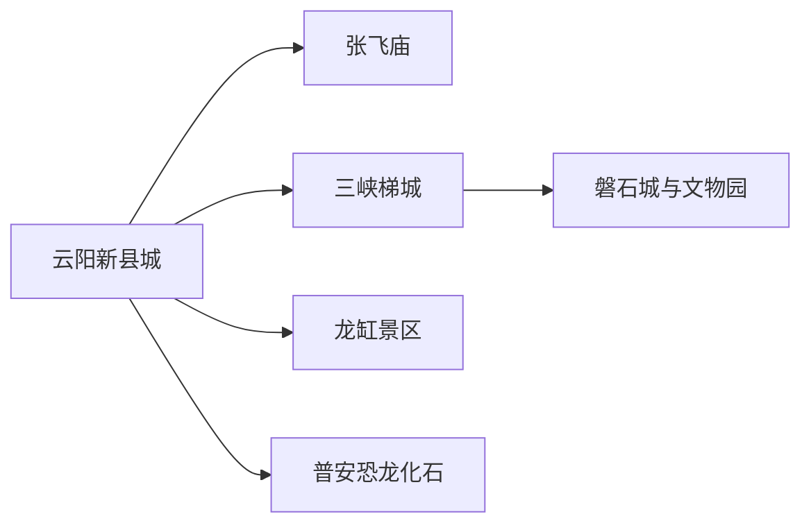
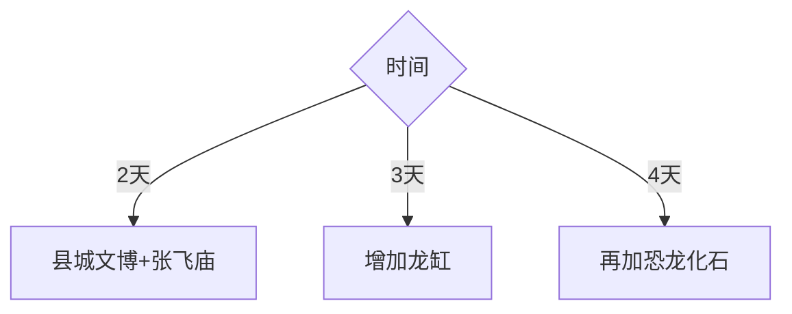

# 云阳旅行指南

云阳新县城沿长江和彭溪河展开，张飞庙、三峡梯城、磐石城与城市文博组成一至两日基础线；龙缸和普安恐龙化石遗址位于南部远线，适合各留完整一天。先用城市线理解三峡移民与峡江文化，再进入地质主题。

## 城市速览

| 项目 | 信息 |
|---|---|
| 主线 | 新县城—张飞庙—三峡梯城—龙缸或恐龙化石 |
| 停留 | 城区1–2天；每条南部远线另留1天 |
| 住宿 | 新县城便于交通；清水方向适合龙缸专程 |
| 交通 | 高铁、公路、区内公交与景区接驳 |
| 风险 | 山城阶梯、悬崖景区、雾雨、落石、山洪与长江水位 |
| 边界 | 文物园、遗址、地质公园、消落带、航道与施工区分别管理 |

## 城市格局与游览区域

新县城承担高铁接驳、住宿与城市文博，龙缸和普安位于南部不同方向。固定清单以镇安镇记录 **GeoNames 8400139** 建页并承接云阳县；Wikidata `Q14447` 的 P1566 指向县级行政记录 `1785653`，镇安是县域内部节点。

## 主要景点

| 景点 | 区域 | 类型 | 核心体验 | 用时 | 环境 | 体力 | 研究价值 | 拥挤 | 优先级 |
|---|---|---|---|---:|---|---|---|---|---|
| 张飞庙景区 | 县城对岸方向 | 历史文物 | 三国纪念、碑刻与迁建保护 | 3–4小时 | 混合 | 中 | 很高 | 中 | A |
| 三峡梯城景区 | 新县城 | 城市山地 | 云梯、山城高差与移民新城景观 | 3–5小时 | 室外 | 高 | 高 | 中 | A |
| 磐石城与三峡文物园开放区 | 梯城片区 | 遗址文博 | 古军寨、迁建文物与峡江历史 | 2–3小时 | 混合 | 中高 | 高 | 低 | B |
| 云阳县博物馆 | 新县城 | 文博 | 三峡考古、移民与县域历史 | 2–3小时 | 室内 | 低 | 很高 | 低 | A |
| 云阳龙缸景区 | 清水方向 | 地质山地 | 岩溶天坑、悬崖栈道与峡谷 | 1天 | 室外 | 高 | 高 | 高 | A |
| 普安恐龙化石遗址馆 | 普安方向 | 古生物 | 恐龙化石、地层与科学研究 | 1天含往返 | 混合 | 中 | 很高 | 中 | B |

张飞庙按迁建后的正式景区参观；三峡梯城内部云梯、磐石城与文物园按独立入口和体力组合。龙缸悬崖项目、恐龙化石保护区、长江航道与消落带按公告边界进入。

## 美食与餐饮

云阳桃片糕、包面、羊脚、面食和长江沿线家常菜适合县城体验。点鱼先确认合法来源和重量；山地远线准备饮水与路餐；说明辣度、内脏、花生芝麻和共享锅具。

## 经典行程

### 两日基础线
**路线**：县博物馆—三峡梯城—张飞庙。**逻辑**：先建立移民城市与峡江历史框架。**预约锚点**：场馆、景区和跨江交通。**休息**：县城午后。**删除条件**：雨天缩短云梯。

### 张飞庙文博线
**路线**：县博物馆—张飞庙—滨江公共空间。**逻辑**：把文物、迁建和三国记忆连续阅读。**预约锚点**：开放和讲解。**休息**：县城餐饮。**删除条件**：水位或交通调整时保留博物馆。

### 三峡梯城线
**路线**：三峡云梯—磐石城—三峡文物园。**逻辑**：沿高差理解山城与古军寨。**预约锚点**：开放、步道和天气。**休息**：分段平台。**删除条件**：高温、雷雨或膝踝不适时缩短。

### 龙缸地质线
**路线**：清水方向住宿或县城—龙缸—返程。**逻辑**：悬崖地质景区独立成日。**预约锚点**：门票、接驳、项目和能见度。**休息**：游客中心。**删除条件**：雷雨、大风或设施停运时取消高空段。

### 恐龙化石线
**路线**：县城—普安恐龙化石遗址馆—返程。**逻辑**：用完整一天处理远线和讲解。**预约锚点**：场馆、研究保护开放和车辆。**休息**：乡镇服务点。**删除条件**：遗址馆关闭时改城市文博。

### 亲子研学线
**路线**：县博物馆—恐龙化石遗址馆或梯城短线。**逻辑**：以考古与古生物科普为主。**预约锚点**：讲解、儿童活动和交通。**休息**：每90分钟一次。**删除条件**：远线晕车时只留县城。

### 低体力线
**路线**：县博物馆—车辆到张飞庙主要开放区—滨江观景。**逻辑**：减少云梯和悬崖步道。**预约锚点**：落客、座椅和无障碍。**休息**：午后酒店。**删除条件**：跨江接驳不便时保留县城场馆。

## 住宿区域

新县城适合高铁、餐饮和城市线；清水方向适合龙缸早进晚出；南部乡镇住宿按正规运营和下一日路线选择。确认坡道、电梯、停车、早餐、景区接驳和天气退改。

## 市内交通

云阳站到新县城需接驳，张飞庙、龙缸与普安分处不同方向。城市公交适合城区，南部远线提前约车；龙缸日预留山路、景区接驳与高铁返程缓冲。

## 不同旅行者须知

历史爱好者优先县博物馆与张飞庙；地质爱好者分别安排龙缸和恐龙馆；亲子选择讲解场馆；长者减少云梯；自驾者关注雾、落石和弯道；摄影者遵守悬崖、水域与文物拍摄规则。

## 行前核对

- 核对张飞庙、县博物馆、梯城、龙缸和恐龙化石遗址馆开放。
- 核对高铁接驳、跨江交通、雷雨雾、山洪落石与景区项目。
- 文物、化石、地质保护、航道、消落带和施工空间按管理边界进入。

## 来源与更新记录

| 来源 | 支持内容 | 核验日期 |
|---|---|---|
| [重庆市政府：云阳四大景区](https://www.cq.gov.cn/zwgk/zfxxgkml/zdlyxxgk/ggwh/ly/zxdt/202606/t20260610_15744841.html) | 龙缸、张飞庙、恐龙化石与三峡梯城 | 2026-09-01 |
| [重庆市政府：云阳长江文化公园](https://www.cq.gov.cn/zwgk/zfxxgkml/zdlyxxgk/ggwh/wh/zxdt/202409/t20240925_13658746.html) | 文物保护、博物馆、环湖绿道与县域文旅 | 2026-09-01 |
| [民政部行政区划代码查询](https://dmfw.mca.gov.cn/xzqh/getList?code=50&trimCode=true&maxLevel=3) | 云阳县行政层级与代码 | 2026-09-01 |
| [GeoNames 8400139](https://www.geonames.org/8400139/) | Zhen’an 固定城市点 | 2026-09-01 |
| [Wikidata Q14447](https://www.wikidata.org/wiki/Q14447) | 云阳县实体与行政记录关系 | 2026-09-01 |

| 日期 | 更新 |
|---|---|
| 2026-09-01 | 首次完成云阳旅行研究；建立梯城张飞庙、龙缸与恐龙化石路线 |
