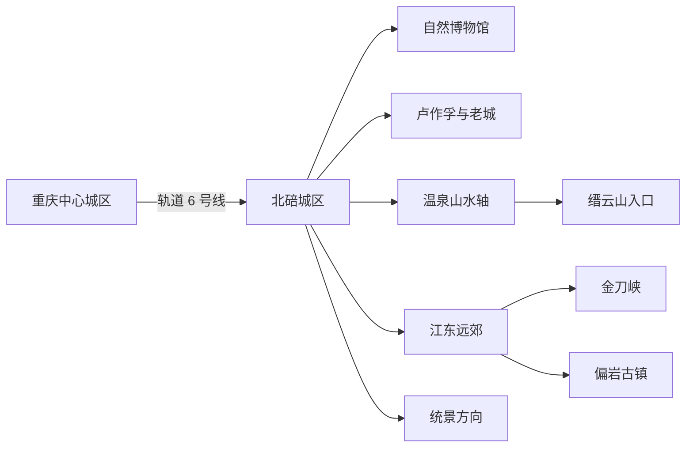
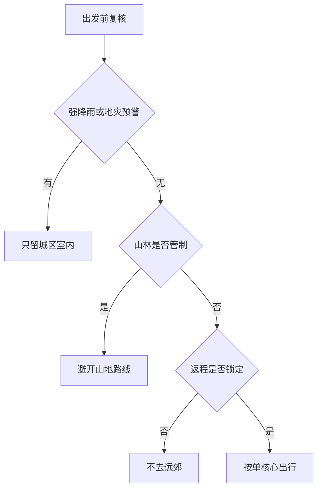

# 北碚旅行指南

北碚是重庆市辖区，不是法定城市；但它有轨道门户、成熟住宿、缙云山—北温泉山水轴、北碚老城文博群，以及需要整日往返的金刀峡、偏岩和统景方向，因此按独立旅行目的地组织。首访者最容易理解的三条线索，是重庆自然博物馆的西部自然史、卢作孚与北碚乡村建设史，以及缙云山—嘉陵江—温泉共同塑造的山水格局。

> 建议停留：2–4 天；只看城区文博可用 1 天，缙云山、金刀峡或统景方向各宜另留完整时段
> 旅行关键词：重庆自然博物馆、卢作孚、缙云山、北温泉、金刚碑、金刀峡
> 主要体力：城区低至中等；山地、峡谷和跨片区远郊为中高至高
> 最近研究：2026-08-12

## 城市速览

| 项目 | 旅行信息 |
|---|---|
| 主要旅行价值 | 以重庆自然博物馆认识西部自然史，从卢作孚纪念馆和北碚老城理解近代乡建与科教文化，再在缙云山、北泉风景区和金刚碑体验名山、名泉与嘉陵江峡谷关系 |
| 建议停留 | 1 天安排城区文博；2 天增加金刚碑—北泉；3–4 天再选缙云山、金刀峡、偏岩或统景。金刀峡与统景不宜在公共交通未确认时拼成一天 |
| 较舒适季节 | 春秋通常更适合山地和古街步行；冬季静观腊梅、统景与北温泉产品各有季节主题；夏季高温、雷雨、山洪和森林火险显著上升 |
| 预算特点 | 轨道和公共场馆便于控制支出；温泉产品、金刀峡门票与景区交通、远郊车辆及山地住宿是主要变量，须按出发日重查 |
| 步行强度 | 自然博物馆为低至中等；老城、金刚碑和北泉有坡道或湿滑石路；缙云山与金刀峡含连续爬升、台阶或峡谷栈道 |
| 主要天气风险 | 5—9 月强降雨、雷电、高温、嘉陵江及中小河流水位变化；山地还需防滑坡、落石、山洪、浓雾和森林火险 |
| 独行旅行 | 城区轨道、公交和叫车较易组合；金刀峡、偏岩、统景及赏花乡镇的末班、最后一段接驳和夜间运力要提前锁定 |
| 亲子旅行 | 重庆自然博物馆主题清晰；峡谷、临水古镇、温泉池和林区需要持续看护，儿童身高、健康和设备规则逐项核对 |
| 长者与低体力旅行 | 优先“一座博物馆 + 车辆移动 + 一段有座椅的公共空间”；缙云山、金刚碑老街和金刀峡不宜仅凭有接驳车判断体力负担 |
| 无障碍信息 | 轨道可申请预约帮扶，较新的博物馆可优先询问电梯、轮椅和卫生间；历史街区、温泉池、山地和峡谷的连续通行仍须向运营方逐段确认 |

## 城市格局与游览区域

北碚区法定行政代码为 `500109`。本页以 GeoNames 居民点 `1816790` 定位主要旅行门户，以 Wikidata 法定区实体 `Q713547` 和民政区划确定行政边界；该法定实体的 `P1566=1909732` 指向 GeoNames 行政记录，不能与居民点坐标互换。Wikidata 另有信息很薄的居民点 `Q28804420`，只宜用于名称消歧，不能取代法定区实体。

2025 年 11 月重庆行政区划调整后，原北碚区的水土、复兴、蔡家岗、施家梁、童家溪划入两江新区，原渝北区的大湾、统景、大盛、兴隆、茨竹划入北碚区。旧地图、旧攻略和旧公交说明可能仍沿用调整前边界；本页将统景温泉、印盒李花和放牛坪归入当前北碚，不把蔡家、三溪口等现属两江新区的地点写成北碚片区。

| 区域 | 主要内容 | 游览特点 | 与其他区域的关系 |
|---|---|---|---|
| 状元碑—云清路 | 重庆自然博物馆、区级公共服务、商业和住宿 | 轨道接近、室内场馆集中，适合抵达日和雨天 | 可与北碚老城同日；到缙云山、金刚碑仍需公交或车辆 |
| 天生—朝阳—北碚老城 | 卢作孚纪念馆、四世同堂纪念馆、公共江岸和老城生活 | 场馆密度较高，但道路高差、老街和江岸入口会拉长步行 | 适合作为住宿与餐饮基点，不与金刀峡远线同日硬拼 |
| 金刚碑—北泉—澄江 | 金刚碑·温泉老村、重庆北泉风景区、嘉陵江温汤峡和温泉产品 | 历史街区、公共景区与商业泡池是不同运营边界；临水、石路和坡道较多 | 可组合成慢节奏一日；付费温泉须另订，不等同于免费游园 |
| 缙云山方向 | 重庆缙云山景区、缙云寺及景区内依法开放的自然教育和人文单元 | 景区外围与国家级自然保护区空间交叠，森林防火和保护分区优先于游览愿望 | 单独留大半日至一日；不进入未开放林道、核心保护区或村民生产空间 |
| 静观—柳荫—金刀峡—偏岩 | 静观花木、金刀峡景区、偏岩古镇及乡村服务 | 片区纵深大，景点间仍有车程；峡谷、古镇溪流和乡道受汛情影响明显 | 每天只设一个核心，金刀峡与偏岩只有在返程和住宿均锁定时才组合 |
| 统景—茨竹—大湾等新划入乡镇 | 统景温泉风景区、印盒李花、放牛坪和季节性乡村景观 | 距北碚老城较远，花期、温泉、峡江项目和道路运营高度动态 | 作为独立远郊日；旧资料若标作渝北，应以 2025 年后官方公告为准 |

图中的“城区”指状元碑、天生、朝阳一带；“温泉山水轴”指金刚碑、北泉与缙云山的相邻旅行片区；“江东远郊”指静观、柳荫、金刀峡和偏岩方向。它们不是一条可以连续步行的短线。

缙云山国家级自然保护区横跨北碚、沙坪坝和璧山，本页只承接北碚境内官方景区入口和公布游线，不把跨区保护地整体算作北碚景点。嘉陵江岸、温泉水源地、林区、乡村农田和文物修缮区都可能包含保护或生产空间；围栏、告示和运营方公布范围优先于地图上的可达小路。

## 主要景点

优先级用于安排时间：**A** 为首访核心，**B** 为按兴趣补充，**C** 为远郊、季节性或通常需要独立半天以上的目的地。同一景区内部的展厅、山峰、栈道、泡池、演出和商业项目按一个完整运营单元安排。

### 城区文博与温泉人文

| 景点 | 区域 | 类型 | 主要看点 | 建议用时 | 室内外 | 体力 | 预约风险 | 天气影响 | 优先级 |
|---|---|---|---|---:|---|---|---|---|---|
| 重庆自然博物馆 | 状元碑—云清路 | 自然科学博物馆、4A 景区 | 地球、生命、恐龙、生物多样性与西部资源等常设展；七个常设板块仍是一座博物馆 | 3–5 小时 | 室内为主 | 低至中 | 中至高 | 低 | A |
| 卢作孚纪念馆（峡防局旧址） | 朝阳—北碚老城 | 纪念馆、全国重点文保单位组成部分 | 卢作孚的实业、民生公司、北碚乡村建设与抗战运输史；以当日开放展厅为准 | 2–3 小时 | 混合 | 低至中 | 中 | 中 | A |
| 四世同堂纪念馆（老舍旧居） | 天生街道 | 名人故居、文学纪念馆 | 老舍在北碚的生活与抗战文学背景；院落和展厅按一处场馆理解 | 1.5–2.5 小时 | 混合 | 低至中 | 中 | 中 | B |
| 金刚碑·温泉老村 | 金刚碑—北泉 | 历史文化街区、商业休闲 | 山水肌理、老街巷与当期开放的文创、餐饮和温泉小院；居民、民宿和修缮空间不默认开放 | 2.5–4 小时 | 室外为主 | 中高 | 中至高 | 高 | A |
| 重庆北泉风景区（北温泉） | 北泉—澄江 | 4A 景区、园林与温泉文化 | 温泉寺、园林和温汤峡关系；公共景区游览与酒店、泡池、疗养产品分开核对 | 2–4 小时 | 混合 | 中 | 高 | 中高 | A |

### 山地、峡谷与新辖远郊

| 景点 | 区域 | 类型 | 主要看点 | 建议用时 | 室内外 | 体力 | 预约风险 | 天气影响 | 优先级 |
|---|---|---|---|---:|---|---|---|---|---|
| 重庆缙云山景区 | 澄江—缙云山 | 4A 景区、风景名胜区与保护地开放单元 | 依法开放的山林、缙云寺、自然教育和人文景观；黛湖、山峰与寺观不拆成多个目的地 | 5–7 小时，不含往返 | 室外为主 | 中高至高 | 高 | 高 | A |
| 重庆北碚金刀峡景区 | 金刀峡镇 | 4A 峡谷景区 | 喀斯特峡谷、瀑布潭水和正式栈道；上下峡、索道、观光车与出入口共同构成一个景区系统 | 6–8 小时，不含往返 | 室外 | 高 | 高 | 高 | A |
| 偏岩古镇 | 金刀峡镇 | 历史古镇、临水街区 | 古戏楼、古民居、古树和修缮后开放的老街业态；河道、亲水段和活动按现场管控 | 3–5 小时，不含往返 | 室外为主 | 中 | 中至高 | 高 | B |
| 重庆统景温泉风景区 | 统景镇 | 4A 温泉、峡江与洞穴景区 | 正式开放的温泉、峡江步道、游船和溶洞产品；各子项目有独立票务与天气条件但按同一景区安排 | 5–8 小时，不含往返 | 混合 | 中 | 高 | 高 | B |
| 重庆北碚静观花木生态旅游区 | 静观镇 | 3A 花木、腊梅与乡村景观 | 花木产业、腊梅和当季园艺活动；花期、展区、门票与接待随季节变化 | 3–5 小时，不含往返 | 室外为主 | 中 | 高 | 高 | C |
| 重庆北碚印盒李花生态旅游区 | 统景镇印盒村 | 3A 乡村、季节花景 | 李花及当期乡村活动；农业生产地、村道和临时摊点不是无限开放的景区空间 | 3–5 小时，不含往返 | 室外 | 中 | 高 | 高 | C |
| 重庆北碚放牛坪景区 | 茨竹镇 | 3A 山地乡村、季节花景 | 梨花、果园和公布开放的乡村游览单元；采摘、停车和活动需按当季规则 | 3–5 小时，不含往返 | 室外 | 中 | 高 | 高 | C |

北泉风景区的免费公共游览信息不能推导出商业泡池免费或随到随用；地热水属于受许可管理的资源，只使用有明确经营主体、票务和卫生管理的温泉产品。金刚碑整条街区、重庆自然博物馆全部常设展、金刀峡上下峡和统景各子项目分别只作一个目的地。缙云山景区的门票也不意味着游客可进入自然保护区所有区域。

## 美食与餐饮

北碚饮食与重庆共同具有麻辣、鲜香的底色，地方线索集中在豆花、北泉面、缙云竹笋和山地家常菜。城区成熟生活区更适合早餐与一人用餐；缙云山、金刀峡、偏岩、统景和赏花乡镇的餐饮时段与供给受季节影响。以下以菜品和区域为线索，不把单家店写成唯一答案。

| 菜品或餐饮类型 | 常见区域 | 一个人用餐与常见份量 | 风味、过敏原与饮食限制 | 排队风险与替代方法 |
|---|---|---|---|---|
| 北碚豆花、豆花饭 | 北碚老城、天生与成熟居民区 | 豆花配饭较适合一人，蘸碟可另放 | 含大豆，蘸料常有辣椒、花椒、芝麻、花生；素食者还需确认汤底和猪油 | 午餐高峰可能满座；改找配料说明清楚、可做清淡蘸料的普通豆花店 |
| 北泉面 | 北碚老城、北泉方向 | 一碗可成餐，先点小份再加浇头 | 含小麦，浇头可能含猪肉、大豆、花生、芝麻和辣椒；清汤不等于素食 | 早餐和景区高峰翻台快；在生活区选择明码标价的面馆即可 |
| 缙云醉鸡 | 城区与缙云山方向的正规餐馆 | 多为合菜，独行先问小份或半份 | 含鸡肉，做法可能使用酒料、辣椒和复合香料；驾驶、孕期、儿童和忌酒者先问 | 热门时段可能排队；改选普通清炖或家常鸡，不追逐单一店名 |
| 缙云竹笋与竹笋宴 | 缙云山、澄江及城区地方菜馆 | 单炒适合一至两人，宴席更适合多人 | 可能与腊肉、鸡汤、辣椒同烹；纯素、低盐和过敏者逐项确认 | 鲜笋有季节性；非产季改选正规餐馆的时蔬，不购买来源不明野生食材 |
| 怪味胡豆等地方小食 | 城区正规特产店与小吃点 | 小包装适合少量尝试和携带 | 含蚕豆，调味可能含小麦、大豆、芝麻、花生、糖和辣椒；蚕豆病患者避免 | 节庆市集可能拥挤；选生产者、配料、日期和保存条件清楚的包装产品 |
| 火锅、小面与山城家常菜 | 城区成熟餐饮区 | 火锅适合多人，独行可选小锅、冒菜或单份家常菜 | 牛油、辣椒、花椒、大豆、芝麻、花生及共用锅具常见；“微辣”仍可能明显刺激 | 晚餐高峰避开热门商圈，改选明码标价的小锅、汤菜和米饭 |

旧资料常把三溪口豆腐鱼列为北碚代表，但三溪口所在的蔡家岗街道已在 2025 年划入两江新区。本页不把三溪口当作当前北碚用餐片区；若专程前往，应按两江新区的交通与行政边界另行规划。

严重食物过敏、乳糜泻、纯素、清真或不能摄入酒料的人，应把禁忌与交叉接触要求写成简短中文交给餐厅。“不辣”“不放猪油”“无酒精”“无麸质”和“素食”是不同条件，景区小吃与包装特产也要分别核对配料。

## 经典行程

山林或峡谷是否可行，先看强降雨和地灾预警，再看森林禁火、景区开闭与返程。任一条件不满足，就缩回城区室内路线，不以过去开放记录替代当天公告。

### 一日经典路线

**路线**：重庆自然博物馆 → 状元碑或北碚老城午餐与坐休 → 卢作孚纪念馆 → 附近正式开放的老城公共空间短段

- **适用条件**：两馆开放日能够衔接，城区道路和公共交通正常；公共空间只是可删除的收尾段。
- **串联逻辑**：先从自然史建立重庆西部环境背景，再转向卢作孚和北碚乡建史，全天不跨到缙云山或金刀峡。
- **预约锚点**：重庆自然博物馆的实名预约、入馆时段和临展规则；卢作孚纪念馆闭馆日、最晚入馆同时核对。
- **休息安排**：午餐放在成熟城区并保留完整坐休；第二馆前补水，不把江岸短段当必须项目。
- **时间不足时**：先删公共空间，再缩短自然博物馆非核心展厅；不要压缩午休后追加金刚碑。

### 两日城市路线

**第 1 天**：重庆自然博物馆 → 城区午休 → 卢作孚纪念馆 → 北碚老城住宿
**第 2 天**：金刚碑·温泉老村 → 正式服务区午餐与坐休 → 重庆北泉风景区 → 原住宿地

- **适用条件**：场馆、街区和北泉风景区均正常开放，金刚碑石路与临水段天气安全；泡温泉不自动包含在路线中。
- **串联逻辑**：第一天理解自然与近代乡建，第二天沿嘉陵江处理历史街区、园林和温泉文化，避免同时爬缙云山。
- **预约锚点**：第一天两馆入场；第二天北泉风景区入口、金刚碑活动，以及任何另购温泉产品的时段、健康限制和退改。
- **休息安排**：两天午间都留完整坐休；第二天在正规游客服务区补水，泡池前后不安排长坡赶路。
- **时间不足时**：第二天先删金刚碑非核心商业段；若另订温泉产品，则删北泉外围游园或提前返店，不再加缙云山。

### 三日深度路线

**第 1 天**：自然博物馆—卢作孚纪念馆城区文博线
**第 2 天**：北碚城区 → 重庆缙云山景区正式入口 → 当日开放主游线 → 城区或已核验的澄江住宿
**第 3 天**：北碚城区或已核验住宿 → 重庆北碚金刀峡景区 → 按公布的南北门接驳返回原交通门户

- **适用条件**：第二、三日分别锁定景区开放、正规往返车辆和住宿；遇暴雨、雷电、地灾预警、森林火险管制或峡谷闭园即取消对应日。
- **串联逻辑**：三天依次处理城市文博、名山保护地开放单元和峡谷地貌；两座山地景区各占一日，不在远郊之间赶夜路。
- **预约锚点**：缙云山入园与防火要求、金刀峡门票、出入口、索道或观光车、末班与返程车辆共同优先。
- **休息安排**：缙云山使用游客中心和公布休息点；金刀峡在正式服务区分段补水，离园后留一段坐休再返程。
- **时间不足时**：整段删除第三天；第二天只保留缙云山主游线，不为增加数量转去金刚碑或北泉。

### 雨天路线

**路线**：重庆自然博物馆核心展厅 → 馆内或附近室内午餐与长休息 → 四世同堂纪念馆或直接返回住宿地二选一

- **适用条件**：仅适用于普通降雨、道路正常且场馆开放；暴雨、雷电、积水、山洪或地灾预警时只留离住宿最近的一馆。
- **串联逻辑**：用一座大型室内馆和一个可删除的小型纪念馆替代金刚碑、北泉、缙云山、金刀峡、偏岩与赏花乡镇。
- **预约锚点**：自然博物馆预约与临时闭馆；第二馆的开放、落客位置和最晚入场在午休时再查。
- **休息安排**：使用馆内固定座位和正规室内餐饮，换馆前复核道路与上客点。
- **时间不足时**：删除第二馆；不以雨具、自驾经验或历史开放时间替代预警和闭馆决定。

### 亲子或低体力路线

**亲子路线**：重庆自然博物馆精选常设展 → 馆内午餐与午休 → 一项当期教育活动或直接返店
**低体力路线**：车辆直达重庆自然博物馆最近落客点 → 核心展厅 → 完整坐休 → 车辆返回住宿地

- **适用条件**：亲子路线按儿童年龄、注意力和活动规则删减；低体力路线先确认落客点、电梯、座椅、卫生间和轮椅服务。
- **串联逻辑**：以同一座场馆降低换乘和山城高差，不用“顺路”名义追加历史街区或山地。
- **预约锚点**：儿童证件、预约名额、婴儿车和寄存规则，以及无障碍入口、轮椅借用和陪同政策。
- **休息安排**：每个主题展后坐休，午间不压缩；出现疲劳、感官过载或不适即提前离馆。
- **时间不足时**：只保留最感兴趣的一至两个常设板块；不转去金刚碑、北泉或缙云山补点。

### 远郊一日路线

**高体力路线**：北碚城区 → 金刀峡景区官方游客入口 → 当日开放主游线 → 按景区接驳返回原交通门户
**中低体力替代**：北碚城区 → 偏岩古镇正式开放老街 → 室内午餐与坐休 → 原路早返

- **适用条件**：两条路线只选一条；往返、景区或古镇开放、天气和最后车辆均已确认。金刀峡路线要求同行者能承担峡谷栈道和台阶。
- **串联逻辑**：高体力者把完整白天交给峡谷；中低体力者改看古镇，不把偏岩当金刀峡结束后的附赠夜游。
- **预约锚点**：金刀峡门票、出入口、索道或观光车、末班；偏岩则核对活动、停车或公交、临水管制和返程。
- **休息安排**：只在游客中心、古镇正规商户和公布休息点停留；午餐后保留坐休，返程前再次核对道路。
- **时间不足时**：金刀峡删去次要支线并服从出口指引；偏岩删去活动和亲水段。若无法赶上正规返程，整日改为城区路线。

## 住宿区域

| 区域 | 优点 | 缺点 | 适合人群 | 交通特点 |
|---|---|---|---|---|
| 状元碑—云清路 | 靠近轨道、自然博物馆、商业和城市服务，房型选择通常较多 | 与老城江岸、金刚碑和北泉仍有道路距离 | 首次到访、公共交通旅行、亲子和带大件行李者 | 适合作为全程基点；订房时核对到轨道出入口的坡度和过街方式 |
| 天生—北碚老城 | 靠近名人纪念馆、居民餐饮和老城生活 | 老楼电梯、隔音、停车和山城坡度差异较大 | 以文博、饮食和城市漫步为主的人 | 轨道与公交较方便，但到远郊仍需换乘或车辆 |
| 金刚碑—北泉—澄江 | 便于慢游温泉山水轴，可减少早出晚返 | 酒店、民宿、公共景区和商业泡池名称容易混淆；夜间餐饮与叫车需确认 | 温泉康养、度假和准备次日上缙云山的人 | 预订前核对实际入口、落客点、是否含温泉及到景区车程 |
| 金刀峡—偏岩 | 可降低峡谷早出和晚返压力，适合古镇慢游 | 住宿、夜间餐饮、医疗、网络和末班运力不如城区稳定 | 自驾、摄影或愿意留宿远郊的人 | 不默认从偏岩能直接接统景或缙云山；下一段车辆需另约 |
| 统景方向 | 便于温泉、峡江和新划入乡镇的季节活动 | 距北碚老城较远，产品套餐、道路和淡季运营变化大 | 以统景单一度假产品为核心的人 | 按当前北碚区交通信息核对，旧平台仍可能标作渝北 |

不推荐未经核验的具体酒店。需要无障碍客房、电梯、安静房、儿童床、深夜入住、温泉入室或车辆到门时，应直接向住宿方确认从道路落客点到客房和公共设施的连续路线；“北温泉”“缙云山”“金刀峡”只写在名称里，不能证明靠近实际游客入口。

## 市内交通

从重庆中心城区进入北碚，轨道交通 6 号线是最稳定的公共交通骨架，北碚区政府现行资料列出龙凤溪、状元碑、西南大学和北碚等区内站点。北碚城区内部仍有明显高差；缙云山、北泉、金刚碑、金刀峡、偏岩和统景不能仅按地图直线距离估算。

| 场景或枢纽 | 建议与取舍 | 行前需要重查的内容 |
|---|---|---|
| 重庆中心城区—北碚城区 | 优先轨道 6 号线，减少节假日公路拥堵；跨市域核心片区的时间要按实际出发站计算 | 首末班、运营调整、换乘距离、电梯和无障碍预约 |
| 重庆自然博物馆 | 场馆官网给出状元碑站转公交的方式，也列有多条到馆公交；轨道站与馆门并非同一点 | 官网当前推荐线路、公交改线、站口、落客点、返程和停车 |
| 北碚站与重庆主要铁路枢纽 | 北碚站、重庆北站、重庆西站不是同一车站；是否有适用列车只按 12306 票面判断 | 票面站名、停靠车次、进出站、夜间接驳和携带行李的换乘成本 |
| 城区—金刚碑—北泉—缙云山 | 使用当期公交、景区接驳、出租或网约车；山脚、街区入口和山上景区入口要分别定位 | 道路管制、森林防火检查、末班、叫车上客点、停车和最后入园 |
| 城区—金刀峡—偏岩 | 预留完整白天，使用正规道路客运、景区交通、合规包车或自驾；不要依赖临时拼车 | 客运班次、景区南北门、观光车或索道、停车、末班与返程 |
| 城区—统景及季节乡村景区 | 以独立远郊日估算；2025 年区划变化不等于公交、地图和平台标签已同步更新 | 线路归属、首末班、景区入口、花期交通管制、活动与夜间运力 |
| 水上与沿江移动 | 只有公告明确的客运、景区游船或持证产品才可使用；码头、消落带和温泉取水设施不是游客捷径 | 航线、码头、票务、水位、救生、停航与岸线封闭 |
| 自驾 | 对多人、低体力与远郊最灵活，但山路、雾、落石、停车和节庆管制会抵消便利 | 缙云路、碚金路等道路公告，停车、充电或加油、地灾、火险和景区交通换乘 |

2026 年缙云山道路仍出现过边坡治理与临时交通管控；金刀峡旺季也曾对社会车辆进入部分路段作临时管理。历史通告只能说明风险类型，不能当作出发日规则。规划中的北碚南站、轨道线路、旅游环线或新接驳只有在主管部门和运营方明确投运后才可写进行程。

## 不同旅行者须知

| 旅行维度 | 可行条件 | 主要取舍 | 需额外核对 |
|---|---|---|---|
| 独行旅行 | 城区轨道、博物馆、早餐和叫车容易组合 | 远郊散场、古镇夜间和山地返程不稳定 | 正规车辆、末班、住宿前台时间、离线地图和紧急联络 |
| 亲子旅行 | 自然博物馆可提供清晰的自然史主题 | 峡谷临水临崖、温泉池、高温和拥挤街区需要持续看护 | 儿童证件、身高健康限制、婴儿车、母婴室、救生与紧急出口 |
| 长者或低体力旅行 | 一馆半日、车辆接驳和城区坐休较可行 | 金刚碑石路、缙云山与金刀峡即使有交通工具仍含站立、台阶和坡道 | 最近落客点、坡道、电梯、座椅、轮椅、陪同政策和医疗点 |
| 无障碍需求 | 优先轨道帮扶和较新的公共场馆，并在预约时确认入口至展厅路线 | 老城、历史建筑、温泉池、山林和峡谷可能在任一环节中断连续通行 | 设施连续性需向官方确认，包括停车、坡道、电梯、轮椅、景区车与卫生间 |
| 摄影旅行 | 自然展陈、老城人文、嘉陵江峡谷和山林主题差异明显 | 文物、临展、无人机、保护区、居民院落和水源地均有拍摄边界 | 禁拍区、三脚架、商业拍摄、无人机空域、江岸安全和设备防潮 |
| 预算有限 | 住轨道沿线、选择公共博物馆与城区餐饮，远郊只留一个核心 | 省去正规接驳可能导致错过末班或临时叫车成本更高 | 免费是否预约、优惠资格、景区车是否必选、退改和返程 |
| 晚出发或紧凑行程 | 只选仍有完整开放时段的一馆，或住宿地附近有管理的公共空间 | 缙云山、金刀峡、偏岩、统景和赏花乡镇都不是晚出发备选 | 最晚入场、闭园、照明、末班与入住时间 |
| 高温、暴雨或冬季旅行 | 高温日把户外移到早晚，普通雨天改室内；冬季按花期或温泉产品择一 | 暴雨影响嘉陵江、中小河流、峡谷、古镇和山路，高温又叠加森林火险 | 气象、地灾、水情、森林禁火、景区开闭、道路和交通退改 |
| 保护地与水源边界 | 只走缙云山、北泉和金刀峡公布入口、步道和服务区 | 保护区核心区域、未开放林道、温泉取水设施、农田和生产岸线不开放 | 现场围栏、分区标识、防火码、取水许可、修缮与临时封闭公告 |
| 严格饮食限制 | 选择能说明原料与锅具的正规餐馆，携带书面需求 | 豆花、面食、醉鸡、竹笋宴和火锅的动物油、酒料与交叉接触常见 | 小麦、大豆、蚕豆、芝麻、花生、酒料、猪油和复合调味料 |

## 行前核对

| 核对事项 | 为什么需要重查 | 建议核对时间 | 官方入口 |
|---|---|---|---|
| 2025 年后行政边界与地图 | 五镇划入、五个镇街划出后，旧地图、平台地址和公交归属可能滞后 | 选远郊点时、订车前 | [重庆市政府行政区划调整公告](https://www.cq.gov.cn/ywdt/tzgg/202511/t20251110_15152219.html) |
| 重庆自然博物馆开放与预约 | 闭馆日、实名、限流、临展、教育活动和最晚入馆会变化 | 排路线时、前一日及当天 | [重庆自然博物馆参观服务](https://www.cmnh.org.cn/web/column/col5005098.html) |
| 卢作孚与其他名人纪念馆 | 场馆可能因周一、修缮、团队活动或展陈调整改变开放 | 排路线时、前一日及当天 | [北碚区博物馆名录](https://www.beibei.gov.cn/bm/qwhlyw/zwgk_58246/zfxxgk_bm/jczfxxgk/ggwhfwly_134095/ggfw/ggwljgml/202112/t20211203_10078287.html) |
| 缙云山景区与保护区 | 景区门票、入园时段、森林禁火、承载量和保护分区共同决定可达范围 | 订车前、前一日及当天 | [北碚区 A 级景区信息](https://www.beibei.gov.cn/bm/qwhlyw/zwgk_58246/zfxxgk_bm/jczfxxgk/lyly/ggfw/gglyjgml/202312/t20231205_12655980.html)；[重庆市林业局](https://lyj.cq.gov.cn/) |
| 北泉、金刚碑与温泉产品 | 公共景区、历史街区、民宿、泡池和酒店并非一套票务或一个入口 | 付款前、前一日及当天 | [北碚区文化旅游委](https://www.beibei.gov.cn/bm/qwhlyw/)及各运营方 |
| 金刀峡与偏岩 | 峡谷出入口、景区交通、古镇活动、道路和临水管制会变化 | 订车前、前三日及当天 | [北碚区 A 级景区信息](https://www.beibei.gov.cn/bm/qwhlyw/zwgk_58246/zfxxgk_bm/jczfxxgk/lyly/ggfw/gglyjgml/202312/t20231205_12655980.html)及金刀峡镇公告 |
| 统景与季节乡村景区 | 温泉、峡江、游船、溶洞、花期、采摘和活动分别受天气与运营影响 | 订远郊路线前、前三日及当天 | [北碚区 A 级景区信息](https://www.beibei.gov.cn/bm/qwhlyw/zwgk_58246/zfxxgk_bm/jczfxxgk/lyly/ggfw/gglyjgml/202312/t20231205_12655980.html) |
| 轨道、铁路与远郊交通 | 首末班、站名、道路施工、节庆管制和乡镇返程变化快 | 购票时、前一日及当天 | [重庆轨道交通](https://www.cqmetro.cn/)；[中国铁路 12306](https://www.12306.cn/)；[北碚区交通运输](https://www.beibei.gov.cn/zjbb/jtys/) |
| 暴雨、地灾、水位与森林火险 | 嘉陵江、峡谷、临水古镇、山地和乡村道路的风险不同，预警可触发闭园或停运 | 出发前三日起每日核对，当天再查 | [重庆市气象局](http://cq.cma.gov.cn/)；北碚应急、规划自然资源、林业及景区公告 |
| 无障碍连续路线 | 单点电梯或优惠政策不能证明车站、道路、场馆、景区车、泡池和卫生间全程可达 | 订票、订房和订交通前逐点联系 | 轨道、场馆、景区、住宿官方客服及 12306 重点旅客服务 |
| 入境、证件与实名规则 | 签证、免签、住宿登记和场馆实名要求会变 | 订票前、出发前一周及抵达前 | [国家移民管理局](https://www.nia.gov.cn/) |

## 来源与更新记录

### 主要来源

| 来源 | 类型 | 支持内容 | 核验日期 |
|---|---|---|---|
| [北碚区人民政府：北碚概况](https://www.beibei.gov.cn/zjbb/bbgk/) | 区政府 | 北碚气候、缙云山—嘉陵江—温泉自然格局、文博资源与当前旅行主题 | 2026-08-12 |
| [重庆市政府行政区划调整公告](https://www.cq.gov.cn/ywdt/tzgg/202511/t20251110_15152219.html) | 市政府 | 2025 年北碚与两江新区之间五镇划入、五个镇街划出的现行边界 | 2026-08-12 |
| [民政部行政区划代码服务：500109](https://dmfw.mca.gov.cn/xzqh/getList?code=500109&trimCode=false&maxLevel=3) | 中央政府开放接口 | 北碚区法定层级与行政代码 | 2026-08-12 |
| [北碚区 A 级旅游景区基本信息表](https://www.beibei.gov.cn/bm/qwhlyw/zwgk_58246/zfxxgk_bm/jczfxxgk/lyly/ggfw/gglyjgml/202312/t20231205_12655980.html) | 区文旅部门 | 缙云山、北泉、金刀峡、自然博物馆、统景、静观、印盒和放牛坪的现行等级、地址、咨询及动态服务入口 | 2026-08-12 |
| [北碚区博物馆名录](https://www.beibei.gov.cn/bm/qwhlyw/zwgk_58246/zfxxgk_bm/jczfxxgk/ggwhfwly_134095/ggfw/ggwljgml/202112/t20211203_10078287.html) | 区文旅部门 | 卢作孚、四世同堂、晏阳初等纪念馆的场馆身份、地址与开放服务 | 2026-08-12 |
| [重庆自然博物馆：参观服务](https://www.cmnh.org.cn/web/column/col5005098.html) | 公共博物馆 | 免费常设展、交通、停车、餐饮、参观规则及动态服务入口 | 2026-08-12 |
| [重庆市政府：缙云山国家级自然保护区](https://www.cq.gov.cn/zjcq/lszq/stpz/gjjzrbhq/202606/t20260603_15725676.html) | 市政府与保护地信息 | 保护区跨北碚、沙坪坝、璧山，景区与保护区外围关系及生态价值 | 2026-08-12 |
| [北碚区 2026 年森林禁火令](https://www.beibei.gov.cn/zwxx_239/gzdt/bmdt/202607/t20260707_15803052.html) | 区政府 | 林区、自然保护区、风景名胜区和森林公园的禁火时段、范围及入林要求 | 2026-08-12 |
| [北碚区政府：金刚碑·温泉老村](https://www.beibei.gov.cn/bm/qsthjj/zwxx_58244/dt_58245/202607/t20260707_15803128.html) | 区政府 | 金刚碑的历史文化街区身份、山水肌理与当前开放运营属性 | 2026-08-12 |
| [北碚区文化旅游委：偏岩古镇保护修缮与开放](https://www.beibei.gov.cn/zwxx_239/gzdt/bmdt/202404/t20240430_13174221.html) | 区文旅部门 | 偏岩古镇文物、民居、亲水步道及开放业态边界 | 2026-08-12 |
| [北碚区政府：乡建文化与北温泉公园](https://www.beibei.gov.cn/zwgk_239/jytablqk/zxwytabl/202307/t20230718_12158861.html) | 区政府 | 北温泉公园与卢作孚乡村建设运动的历史关系 | 2026-08-12 |
| [北碚区交通运输](https://www.beibei.gov.cn/zjbb/jtys/) | 区政府 | 轨道 6 号线区内站点、道路客运与城乡交通结构 | 2026-08-12 |
| [北碚区本土特色美食发展文件](https://www.beibei.gov.cn/zwgk_239/zcwj/xzgfxwj/202203/t20220302_10452515.html) | 区政府政策文件 | 北碚豆花宴、缙云竹笋宴、缙云醉鸡等饮食线索；行政边界按 2025 年公告校正 | 2026-08-12 |
| [北碚区 2025 年取水许可证公示](https://www.beibei.gov.cn/bm/qslj/zwgk_58246/zfxxgk_bm/jczfxxgk/sl/szyglbh/qys/202601/t20260113_15315601.html) | 区水利部门 | 地热与温泉取水属于许可管理资源，公共游园与经营性温泉产品应分开理解 | 2026-08-12 |
| [北碚区防汛抗旱应急预案](https://www.beibei.gov.cn/zwgk_239/fdzdgknr/yjgl/yjyazz/202407/t20240704_13348052.html) | 区政府 | 嘉陵江、中小河流、暴雨与洪水预警机制 | 2026-08-12 |
| [北碚区 2026 年强降雨应对记录](https://www.beibei.gov.cn/bm/qyjj/zwxx_58244/dt_58245/202606/t20260618_15764335.html) | 区应急部门 | 强降雨可造成河道涨水、积水、边坡溜塌、落石和乡村道路风险 | 2026-08-12 |
| [GeoNames：Beibei](https://www.geonames.org/1816790/) | 开放地名数据 | 居民点 `1816790` 与北碚名称、坐标交叉核验 | 2026-08-12 |
| [Wikidata：Q713547](https://www.wikidata.org/wiki/Q713547) | 开放结构化数据 | 北碚区法定实体、行政代码 `500109` 与 `P1566=1909732` 行政记录 | 2026-08-12 |
| [Wikidata：Q28804420](https://www.wikidata.org/wiki/Q28804420) | 开放结构化数据 | 北碚居民点的薄记录，用于与法定区实体消歧 | 2026-08-12 |

### 更新记录

| 日期 | 更新内容 |
|---|---|
| 2026-08-12 | 建立北碚城区、金刚碑—北泉—缙云山、金刀峡—偏岩与统景等新辖乡镇的旅行边界；补充文博、饮食、六组路线、住宿、交通、保护地、温泉水源、汛期、森林火险和无障碍核对入口；明确市辖区身份及居民点、法定实体和行政记录的分工 |
