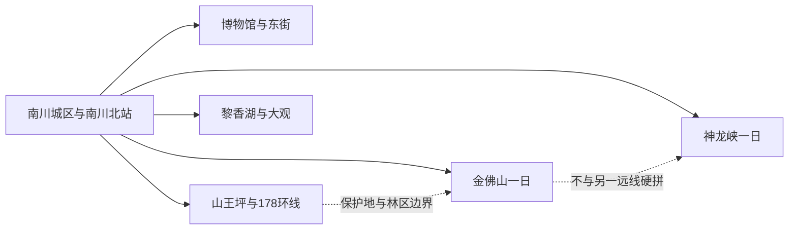
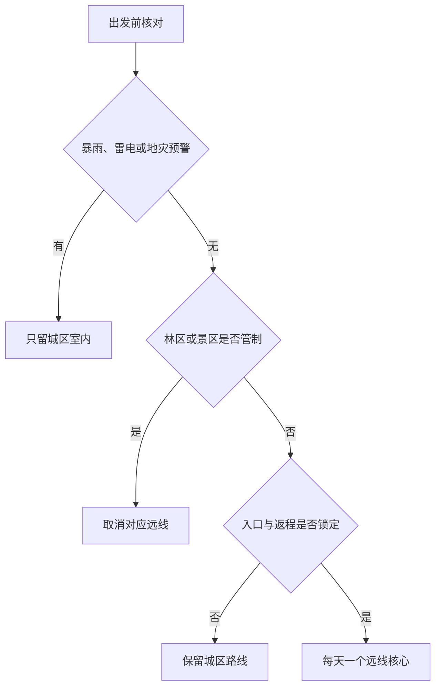

# 南川旅行指南

南川是重庆市辖区，不是法定城市，但它有独立高铁门户、成熟城区住宿、世界自然遗产金佛山，以及神龙峡、山王坪和黎香湖等相距较远的完整旅行片区，因此按独立目的地组织。最稳妥的规划方式，是把东街—博物馆作为抵达与雨天底盘，把金佛山交给一整天，再从峡谷、喀斯特森林或湖区乡村中选择一个远线；地图上的“南川”并不等于所有景点能从城区连续游览。

> 建议停留：城区 1 天；金佛山另留 1 天；神龙峡、山王坪或黎香湖方向各另留完整时段 
> 旅行关键词：金佛山世界遗产、喀斯特桌山、东街、方竹笋、神龙峡、山王坪 
> 主要体力：城区低至中等；索道换乘、山地步道、峡谷和高海拔户外为中高至高 
> 最近研究：2026-08-12

## 城市速览

| 项目 | 旅行信息 |
|---|---|
| 主要旅行价值 | 以南川博物馆和东街认识城区历史，再从金佛山理解中国南方喀斯特世界自然遗产、生物多样性与山地生活；神龙峡、山王坪和黎香湖提供彼此不同的峡谷、森林和湖区体验 |
| 建议停留 | 1 天只看城区；2 天加入金佛山；3–4 天再选神龙峡、山王坪或黎香湖。金佛山与任何另一条远线都不宜在同一天硬拼 |
| 较舒适季节 | 春秋通常更适合城区和山地步行；夏季可避暑但强对流、暴雨和山洪风险上升；冬季冰雪体验依赖当期开放、道路和防滑条件 |
| 预算特点 | 城区餐饮住宿较易控制；金佛山门票、索道、景区交通、远郊车辆和旺季住宿是主要变量，套票名称与适用入口必须重查 |
| 步行强度 | 东街和博物馆为低至中等；金佛山即使使用索道仍有站立、坡道和台阶；神龙峡、山王坪与环线活动受地形和天气放大 |
| 主要天气风险 | 暴雨、雷电、浓雾、山洪、滑坡、落石、冬季结冰和森林火险；山区天气可能与城区明显不同 |
| 独行旅行 | 城区和高铁接驳较方便；远线返程、最后一段车辆、通信和夜间叫车需预先锁定，不独自进入未开放林道或峡谷支沟 |
| 亲子旅行 | 博物馆和东街可短时组合；山地、漂流、飞拉达、洞穴及临水项目有年龄、身高、健康和看护规则，不能由“亲子项目”名称推定适合所有儿童 |
| 长者与低体力旅行 | 优先城区一馆、车辆接驳和金佛山单一入口短线；索道只能减少部分爬升，不能证明从停车场到观景点全程无台阶 |
| 无障碍信息 | 南川北站和较新场馆可优先申请协助；历史街区、索道换乘、山地、峡谷和乡村道路的连续无障碍资料不足，须逐段向运营方确认 |

## 城市格局与游览区域

南川区法定行政代码为 `500119`，现辖东城、南城、西城 3 个街道和 29 镇、2 乡。GeoNames `8544703` 是以东城一带为锚点的 `PPLA3` 居民点，别名同时包含“Dongcheng”和“南川区”；Wikidata `Q10869906` 表达东城街道，并以 `P1566=8544703` 连接这个主城锚点。Wikidata `Q714170` 则表达现行南川区并记录法定代码，但目前没有可核验的 `P1566` 直接连接。三者用途不同：固定点与街道实体定位主要旅行门户，法定区实体确定整个市辖区的行政边界。

| 区域 | 主要内容 | 游览特点 | 与其他区域的关系 |
|---|---|---|---|
| 东城—南城—西城连续城区 | 南川区博物馆、东街文旅小镇、城市商业、南川北站接驳 | 室内外可组合，餐饮和住宿最集中；高铁站与东街仍需地面交通 | 适合作为所有远线的住宿底盘，但不能步行直达金佛山或神龙峡 |
| 金佛山公开游览片区 | 金佛山景区、索道与景区交通、当期开放的步道和自然人文节点 | 世界遗产、风景名胜区、森林公园、自然保护区和售票景区范围并不完全重合 | 单独安排一日；各入口、索道和停车场不可凭名称互换 |
| 神龙峡方向 | 神龙峡景区及当期开放的峡谷、漂流和户外项目 | 临水、栈道和峡谷活动对降雨、水位、年龄和运营要求敏感 | 作为独立一日；不与金佛山、山王坪同日赶场 |
| 山王坪—金佛山 178 环线 | 山王坪喀斯特生态公园、正式观景与服务节点、乡村住宿 | 片区纵深大，森林防火、道路管制和季节色彩显著影响体验 | 适合自驾或已锁定正规车辆者；环线不是随意进入保护地的通行证 |
| 大观—黎香湖—北部乡村 | 黎香湖湿地与度假片区、大观生态农业和当期开放乡村项目 | 湖区、农田、果园、民宿和建设项目各有运营边界 | 可作低至中等体力远线；与南部山地不是同一方向 |
| 水江、南平及矿业工业片区 | 区域交通、产业和部分历史生产空间 | 车站、矿山、沉陷区、厂区、水库和专用道路不因地图可见而开放 | 只按正式开放场馆或活动进入，不把生产设施当捷径或观景台 |

金佛山的世界遗产组成部分、国家级自然保护区、国家级风景名胜区、森林公园和 5A 景区具有不同的法定或运营边界。本页把游客通过正式入口进入的金佛山完整景区作为一个目的地，不把古杜鹃、药池坝、洞穴、寺院、峰顶、索道和季节项目拆成多个“已完成景点”。自然保护区核心区域、科研监测地、未开放林道、野生动植物栖息地和森林防火封控区不属于普通游线。

## 主要景点

优先级用于安排时间：**A** 为首访核心，**B** 为按兴趣补充，**C** 为远郊、季节性或需要额外交通条件的目的地。同一景区的门票、索道、观光车、步道、漂流和活动项目只按一个完整运营单元理解。

### 城区与城市历史

| 景点 | 区域 | 类型 | 主要看点 | 建议用时 | 室内外 | 体力 | 预约风险 | 天气影响 | 优先级 |
|---|---|---|---|---:|---|---|---|---|---|
| 南川区博物馆 | 东街文旅小镇 | 公共博物馆 | 南川历史、地方文物与区域文化展陈；以当期开放常设和临展为准 | 2–3 小时 | 室内 | 低 | 中 | 低 | A |
| 南川东街文旅小镇 | 东城街道 | 城市更新街区、公共休闲 | 老城生活记忆、开放街巷、餐饮和当期文化活动；商业空间与博物馆分别核对 | 2–4 小时 | 混合 | 低至中 | 中 | 中 | B |

### 山地、峡谷与湖区

| 景点 | 区域 | 类型 | 主要看点 | 建议用时 | 室内外 | 体力 | 预约风险 | 天气影响 | 优先级 |
|---|---|---|---|---:|---|---|---|---|---|
| 南川金佛山景区 | 三泉、南城及金佛山周边正式入口 | 世界自然遗产、5A 景区、山地自然与人文 | 喀斯特桌山、生物多样性、季节杜鹃与冰雪、公开步道和人文节点；景区内部只计一次 | 7–10 小时，含城区往返 | 混合 | 中高至高 | 很高 | 很高 | A |
| 神龙峡景区 | 金佛山西侧方向 | 峡谷、溪流与户外体验 | 峡谷地貌、正式栈道及当期运营的漂流或户外项目；不同项目有独立规则 | 6–9 小时，含往返 | 室外 | 中高至高 | 很高 | 很高 | B |
| 山王坪喀斯特生态公园 | 山王坪镇 | 喀斯特森林与季节景观 | 公开道路和步道内的森林、喀斯特地貌与季节色彩；保护、林业和康养建设空间不默认开放 | 6–9 小时，含往返 | 室外 | 中至高 | 高 | 很高 | B |
| 黎香湖湿地公园与公开湖区 | 黎香湖镇 | 湖区、湿地与度假片区 | 正式公共岸线、湖景和当期运营的休闲项目；水库岸线、物业区和水上项目分别核对 | 4–7 小时，含往返 | 室外为主 | 低至中 | 高 | 高 | C |
| 大观生态农业公开游览单元 | 大观镇及周边 | 乡村、农业与季节活动 | 正式开放的农旅园区、果蔬花木和乡村服务；农田、温室与采摘区均以经营方许可为准 | 4–7 小时，含往返 | 室外为主 | 中 | 高 | 高 | C |

金佛山与山王坪空间相邻，但不是一张票、一套入口或一条可随意穿越的林道。神龙峡的漂流、飞拉达、洞穴等项目也不能由景区开放推导为全部同步运营；项目停运时，是否仍可进行普通峡谷游览要看运营方当日公告。黎香湖和农业片区包含居民生活、农业生产、水利设施和商业项目，公共岸线或道路不等于所有临水地块都可进入。

## 美食与餐饮

南川餐饮以重庆味型为底盘，地方辨识度较高的线索是金佛山方竹笋、小河米粉、灰粑、油茶和山地家常菜。城区最适合一人用餐与比较价格；山地和乡镇餐饮受季节、客流与营业日影响，不把某一家店设为不可替代的路线锚点。

| 菜品或餐饮类型 | 常见区域 | 一个人用餐与常见份量 | 风味、过敏原与饮食限制 | 排队风险与替代方法 |
|---|---|---|---|---|
| 小河米粉 | 南川城区早餐店与粉馆 | 通常一人一碗，可先点小份并将浇头分开 | 米粉本体不等于整碗无麸质；汤底、酱油、肉臊、花生和辣椒需询问 | 早餐高峰翻台快；在居民区寻找配料和价格清楚的同类粉馆 |
| 金佛山方竹笋、方竹笋宴 | 城区、金佛山周边与正规地方菜馆 | 单炒适合一至两人，宴席菜更适合多人共享 | 常与腊肉、鸡汤、猪油、辣椒同烹；纯素、低盐与过敏者逐项确认 | 鲜笋有季节性；非产季选来源和加工说明清楚的笋菜，不采食野生植物 |
| 灰粑与米制小食 | 城区、东街及节庆市集 | 小份适合步行间歇，可先买一份分享 | 配方可能含米、糖、油、豆类或复合馅料；共用蒸具与油具需询问 | 活动日热门摊位排队；选择制作、价格和储存条件清楚的同类摊点 |
| 油茶、干劲汤与山地早餐 | 城区和乡镇早餐店 | 多为一碗，可配米制或面制小食 | 可能含茶、油、花生、芝麻、坚果、葱蒜或动物油；咖啡因与坚果过敏者先问 | 早市后可能售罄；改选米粉、稀饭或蛋类早餐，不为单一店绕路 |
| 烤茄皮、老盐菜与家常小炒 | 城区与乡镇家常菜馆 | 小份菜适合一至两人，多人再组合笋菜和肉类 | 腌菜盐分高，烤制和炒制可能含辣椒、猪油、大豆、芝麻和花生 | 晚餐高峰避开景区核心，改在住宿片区找明码标价的家常菜 |
| 火锅、豆花与重庆常见餐饮 | 城区成熟商业与居民区 | 火锅更适合多人；独行可选小锅、冒菜、豆花饭或单份小面 | 牛油、动物内脏、小麦、大豆、芝麻、花生和共锅常见；微辣仍可能刺激 | 不追逐唯一热门店；比较锅底、份量、最低消费和排队时间后就近替代 |

方竹笋来自山地资源，但“当地特产”不等于可以自行采挖；保护地内采集野生植物、进入繁育或科研区域、购买来源不明野味均不属于旅行体验。严重过敏、乳糜泻、严格素食或不能摄入酒料者，应把禁忌与交叉接触要求写成简短中文交给餐厅。

## 经典行程

南川远线先看天气和景区公告，再看入口交通与返程。任何暴雨、雷电、地灾、森林禁火、道路结冰或项目停运公告都优先于既定路线。

### 一日经典路线

**路线**：南川区博物馆 → 东街或城区午餐与坐休 → 东街公开街巷和当期开放文化空间 → 原住宿地

- **适用条件**：博物馆和东街正常开放，城区道路与公共交通正常；晚到时只保留一馆或一段街区。
- **串联逻辑**：全天集中在连续城区，以博物馆建立历史框架，再用东街观察老城生活与城市更新，不跨入山地。
- **预约锚点**：博物馆开放日、入馆时段和临展；东街活动、展馆及施工范围在午休前复核。
- **休息安排**：午餐留在城区成熟餐饮区并坐休；东街只走一段，随时可回住宿地。
- **时间不足时**：先删东街非核心商业段，再缩短博物馆临展；不追加金佛山入口打卡。

### 两日城市路线

**第 1 天**：南川区博物馆 → 城区午休 → 东街文旅小镇 → 城区住宿 
**第 2 天**：城区 → 金佛山当日确认的公开入口 → 索道或景区交通 → 开放主游线 → 原入口返回

- **适用条件**：第二天景区、索道、景区交通和道路均正常，同行者能承担高海拔、换乘、坡道与较长站立。
- **串联逻辑**：第一天完成城市历史与补给，第二天把完整白天交给世界遗产山地，避免到达日直接赶末班索道。
- **预约锚点**：金佛山实名、入园时段、入口、索道、景区车、冰雪或季节项目和返程共同优先；博物馆其次。
- **休息安排**：第一天午间坐休；第二天只在景区公布服务点补水、用餐和分段休息，不进入林地寻找捷径。
- **时间不足时**：删除第一天东街延伸；第二天只保留景区主游线，绝不再转神龙峡或山王坪。

### 三日深度路线

**第 1 天**：博物馆—东街城区线 
**第 2 天**：金佛山完整一日 
**第 3 天**：神龙峡普通峡谷游线或山王坪公开游览单元二选一 → 原住宿或交通门户

- **适用条件**：第三天只选一个方向，并已确认景区运营、道路、正规车辆和返程；漂流及高风险项目另按年龄、健康和天气判断。
- **串联逻辑**：三天依次处理城市人文、世界遗产桌山和一种补充地貌；用二选一控制跨片区车程与体力。
- **预约锚点**：金佛山全套入口交通；第三天神龙峡项目或山王坪开放、停车、接驳和防火要求。
- **休息安排**：每天午间保留坐休；第三天完成核心游线后直接返程，不把 178 环线当夜间兜风线路。
- **时间不足时**：整段删除第三天；第二天因天气取消时改城区室内，不把第三天远线提前硬塞。

### 雨天路线

**路线**：南川区博物馆核心展陈 → 附近室内午餐与长休 → 东街当期开放室内文化空间或直接返店

- **适用条件**：仅适用于普通降雨、无积水和地灾预警；暴雨、雷电或道路管制时只留离住宿最近的室内点。
- **串联逻辑**：用城区一座公共博物馆和一个可删室内节点替代金佛山、神龙峡、山王坪、黎香湖及乡村道路。
- **预约锚点**：博物馆临时闭馆、最晚入馆和东街室内项目开放情况。
- **休息安排**：在馆内固定座椅和正规室内餐饮区休息，换点前重新查看道路预警。
- **时间不足时**：删除第二个节点；不因自驾、雨具或旧开放记录进入山地和峡谷。

### 亲子或低体力路线

**亲子路线**：南川区博物馆精选展厅 → 午餐与午休 → 东街一项当期适龄文化活动或返回住宿 
**低体力路线**：车辆直达博物馆最近落客点 → 核心展厅 → 完整坐休 → 车辆返回住宿地

- **适用条件**：亲子路线按儿童注意力、活动年龄和婴儿车规则删减；低体力路线先确认落客点、电梯、轮椅、座椅和卫生间。
- **串联逻辑**：两条路线都以同一城区为核心，减少跨区换乘和山地高差；不把索道宣传等同于低体力条件。
- **预约锚点**：儿童证件和活动名额、婴儿车或寄存规则，以及无障碍入口与轮椅服务。
- **休息安排**：每个展览主题后坐休，午间不压缩；出现疲劳、感官过载或不适就提前返回。
- **时间不足时**：只看最感兴趣的一至两个展厅；不转金佛山、神龙峡或湖区补点。

### 远郊一日路线

**山地路线**：城区 → 山王坪正式入口或服务节点 → 当日开放森林与喀斯特游线 → 原路返程 
**低强度替代**：城区 → 黎香湖正式公共入口 → 湖区短段 → 正规室内午餐与坐休 → 早返

- **适用条件**：两条路线只选一条；山王坪需道路、森林防火和天气正常，黎香湖需公共岸线、水上项目和停车规则明确。
- **串联逻辑**：山地路线把完整白天交给喀斯特森林；替代线减少爬升，但不把湖岸、水库设施和物业道路当成连续公共步道。
- **预约锚点**：山王坪开放、车辆、停车与环线管制；黎香湖公共入口、项目运营和水情。
- **休息安排**：只使用正式服务区，驾驶者在返程前留完整坐休；不在无护栏路肩和生产岸线停车。
- **时间不足时**：远郊整段删除，改走博物馆—东街；不只为拍照赶到入口后立即夜返。

## 住宿区域

| 区域 | 优点 | 缺点 | 适合人群 | 交通特点 |
|---|---|---|---|---|
| 东城—南城—西城连续城区 | 餐饮、商业、医院和叫车选择最稳定，便于用同一住宿组织多条远线 | 去金佛山、神龙峡、山王坪仍需专门接驳；高铁站并非所有酒店可步行 | 首访、独行、雨天、重视餐饮和连续住宿者 | 以公交、出租车或网约车接南川北站和各景区道路 |
| 南川北站方向 | 早晚高铁和行李接驳方便 | 与东街、成熟餐饮和景区入口有距离；站前新住宿的周边服务需核实 | 晚到早走、铁路中转和行李较多者 | 108 路等历史发布班次不能长期固化，按出发日公交公告核对 |
| 金佛山正式入口周边 | 便于早入园、避开城区往返，可拆分山地行程 | “金佛山附近”可能对应不同入口、索道和乡镇，淡旺季运营差异大 | 山地专题、摄影、冰雪或愿意住一晚者 | 订房前把住宿与实际游客入口、停车、索道和退改逐一匹配 |
| 山王坪—178 环线正规住宿 | 可降低长距离驾驶，适合森林与乡村慢游 | 餐饮、医疗、夜间交通、通信和临时退改少于城区 | 自驾或已约正规车辆、只做一个片区者 | 山路与环线受天气、防火和活动管制，不能依赖临时叫车 |
| 黎香湖—大观方向 | 适合低节奏湖区、乡村和度假产品 | 项目、物业、公共岸线与农田边界容易混淆，去南部山地很远 | 以一个湖区或农业项目为核心者 | 公路为主；确认最后一段道路、停车、充电和返程 |

不推荐仅凭“金佛山”“湖景”“森林”“高铁站”字样选择未经核验的住宿。需要无障碍客房、电梯、儿童床、夜间入住、供暖、防潮或车辆到门时，应直接向住宿方确认从落客点到客房的连续路线；民宿位于村落不等于可进入周边农田、林地和水岸。

## 市内交通

2025 年 6 月，渝厦高铁重庆东至黔江段开通，南川北站投入运营；重庆市交通主管部门同时公布过连接高铁站、万达、客运西站等节点的 108 路公交。站点和线路身份可以作为空间依据，具体班次、首末班和停靠点仍按出发日重查。南川城区没有覆盖金佛山、神龙峡、山王坪和黎香湖的一体化城市轨道网络。

| 场景 | 建议与取舍 | 行前需要重查的内容 |
|---|---|---|
| 高铁抵达南川北站 | 适合从重庆东及沿线城市抵达，再用公交、出租车或预约接送进入城区 | 12306 票面站名、车次、出站口、公交首末班、叫车点与住宿接站 |
| 重庆中心城区公路抵达 | 公路客运或自驾仍可作为补充，出发枢纽和终到站不能仅凭旧攻略判断 | 客运站、班次、道路施工、节假日拥堵、退改与夜间到店 |
| 城区移动 | 东街、博物馆、商业与住宿可用公交、出租车、网约车和分段步行组合 | 线路调整、活动封路、最晚入馆、站前施工与无障碍车辆 |
| 城区—金佛山 | 先确定实际入口，再选择景区直通、正规客运、合规包车或自驾；入口间不默认互通 | 门票对应入口、索道、景区车、末班、停车、道路结冰和返程 |
| 城区—神龙峡 | 作为独立一日，以正式游客入口和当天运营项目为终点 | 景区开放、漂流或户外项目、道路、水位、儿童规则和返程 |
| 城区—山王坪与 178 环线 | 自驾或正规车辆较灵活，但环线长、弯道多，司机体力和天气是硬条件 | 防火检查、施工、观景点停车、充电加油、雾、落石和夜间管制 |
| 城区—黎香湖与大观 | 公路到达后仍需末端接驳，低体力者优先车辆直达正式入口 | 公共岸线、项目营业、停车、公交或农村客运、返程和活动日期 |
| 自驾与租车 | 多人或远线旅行更灵活，但不熟山路、浓雾、强降雨和停车会抵消便利 | 驾照与租车规则、保险、异地还车、道路预警、充电加油和疲劳驾驶 |

水江西站与南川北站是不同车站，票面站名不可互换；“到南川”也不代表已到金佛山游客入口。规划交通时按“跨城抵达—城区接驳—景区末端—返程”四段分别核验，只查到景区方向的去程而没有末班或返程，不构成可执行路线。

## 不同旅行者须知

| 旅行维度 | 可行条件 | 主要取舍 | 需额外核对 |
|---|---|---|---|
| 独行旅行 | 城区高铁、住宿、博物馆和一人餐饮容易组合 | 远郊车辆分摊、山区通信和夜间返程容错低 | 正规车辆、末班、离线地图、住宿前台时间和紧急联系人 |
| 亲子旅行 | 博物馆、东街短段和正式游客中心可按年龄安排 | 漂流、飞拉达、洞穴、索道、临崖栈道和湖岸需要持续看护 | 年龄身高、健康限制、救生装备、儿童票、婴儿车和活动免责条款 |
| 长者或低体力旅行 | 一馆半日、车辆接驳和单一景区短线可行 | 索道前后仍可能有排队、台阶、长坡与高海拔站立 | 最近落客点、轮椅、电梯、座椅、景区车、卫生间和医疗点 |
| 无障碍需求 | 优先南川北站预约协助、较新场馆和城区住宿 | 历史街区、索道、山地、峡谷、湖岸和乡村道路可能中断连续通行 | 设施连续性需向官方确认，包括停车、检票、换乘、卫生间与客房 |
| 摄影旅行 | 东街城市人文、金佛山云雾杜鹃、山王坪森林和湖区题材差异明显 | 云雾和季节不保证出现，追逐多个机位会增加夜间山路风险 | 三脚架、无人机空域、保护区禁拍、商业拍摄、日出前入园和设备防潮 |
| 预算有限 | 住城区、使用高铁与公共交通、保留博物馆和一条远线最可控 | 索道、景区车、包车、旺季住宿与退改不能同时压缩 | 套票边界、优惠资格、必选交通、停车、发票和退改 |
| 晚出发或紧凑行程 | 只保留仍有完整开放时段的博物馆或东街短段 | 金佛山、神龙峡、山王坪和黎香湖都不是到达日顺路项 | 最晚入馆、夜间照明、末班公交、叫车和入住时间 |
| 暴雨、雷电与冬季 | 普通降雨改城区室内；冬季只有道路、索道和项目明确开放时才进山 | 峡谷山洪、落石、滑坡、浓雾、结冰和低温会使整条远线失效 | 气象、地灾、景区、交通、防火和保险退改公告 |
| 保护地与生产空间 | 只进入售票景区、公开步道、游客中心和获准活动范围 | 自然保护区、科研区、未开放林道、矿区、沉陷区、水库设施和农田不开放 | 现场围栏、保护分区、森林禁火、项目许可、道路封闭和安全员要求 |
| 严格饮食限制 | 城区正规餐馆较易说明原料，可携带书面需求 | 方竹笋宴、米粉、油茶、灰粑、腌菜和火锅的复合配料与共锅常见 | 小麦、大豆、花生、芝麻、坚果、动物油、酒料和交叉接触 |

## 行前核对

| 核对事项 | 为什么需要重查 | 建议核对时间 | 官方入口 |
|---|---|---|---|
| 金佛山入口、门票与索道 | 景区有多个交通节点，票务、索道、景交、冰雪和花季安排会调整 | 订住宿前、前一日及入园当天 | [重庆市文化和旅游发展委员会](https://whlyw.cq.gov.cn/)；景区当期官方公告 |
| 金佛山保护地与森林防火 | 游客景区与保护区边界不同，火险可触发入林检查或封控 | 排路线时、前三日及当天 | [重庆市林业局](https://lyj.cq.gov.cn/) |
| 神龙峡普通游览与户外项目 | 漂流、飞拉达、洞穴等可能与景区普通开放不同步 | 购票前、前三日及当天 | [重庆市文化和旅游发展委员会](https://whlyw.cq.gov.cn/)；运营方公告 |
| 山王坪与 178 环线 | 道路、防火、停车、康养项目和季节活动持续变化 | 订车前、前三日及当天 | 南川区政府、交通和景区公告；[重庆市林业局](https://lyj.cq.gov.cn/) |
| 黎香湖与大观项目 | 公共空间、水上项目、民宿、农业活动和施工并非同步开放 | 订住宿前、前一日及当天 | 南川区政府与各合法运营方公告 |
| 博物馆与东街活动 | 闭馆日、团队活动、临展、商业演出和修缮会改变路线 | 排路线时及到访前一日 | [重庆市文化和旅游发展委员会](https://whlyw.cq.gov.cn/) |
| 高铁与城区公交 | 车次、公交首末班、站点和节假日运力具有时效性 | 开售时、前一日及抵达当天 | [中国铁路 12306](https://www.12306.cn/)；[重庆市交通运输委员会](https://jtj.cq.gov.cn/) |
| 暴雨、雷电、地灾与道路 | 山地、峡谷、湖区和旧矿区面对不同风险，雨停后仍可能封闭 | 出发前三日起每日核对，当天再查 | [重庆市气象局](http://cq.cma.gov.cn/)；[重庆市规划和自然资源局](https://ghzrzyj.cq.gov.cn/) |
| 无障碍连续路线 | 单点电梯、索道或优惠不能证明全程可达 | 订票、订房和订交通前逐点联系 | 车站、场馆、景区、住宿官方客服及 12306 重点旅客服务 |
| 入境、实名与证件规则 | 国际旅行者和实名票务规则会随证件、口岸与活动变化 | 订票前及出发前一周 | [国家移民管理局](https://www.nia.gov.cn/)；承运人和景区官方 |

## 来源与更新记录

### 主要来源

| 来源 | 类型 | 支持内容 | 核验日期 |
|---|---|---|---|
| [重庆市民政局：2025 年 12 月行政区划及代码](https://mzj.cq.gov.cn/zwgk_218/zfxxgkml/tzgg/202601/t20260119_15332641.html) | 市民政部门 | 南川区代码 `500119`、3 街道 29 镇 2 乡及现行乡镇边界 | 2026-08-12 |
| [重庆市政府：南川区城乡总体规划批复](https://www.cq.gov.cn/zwgk/zfxxgkzl/fdzdgknr/ghxx/qygh/201812/t20181207_8614146.html) | 市政府规划 | 东城、南城、西城城市中心区与金佛山、山王坪、大观等城镇空间关系 | 2026-08-12 |
| [重庆市政府：南川之旅](https://www.cq.gov.cn/zjcq/cycq/jplyxl/zby/qwn/202408/t20240808_13482535.html) | 市政府文旅资料 | 金佛山、神龙峡和山王坪的属地、地貌与独立旅行方向 | 2026-08-12 |
| [重庆市政府：南川金佛山景区](https://www.cq.gov.cn/zjcq/cycq/zmjd/zqaaaaajjq/202606/t20260604_15729058.html) | 市政府、文旅主管信息 | 5A 景区身份、地址、喀斯特桌山、生物多样性和季节体验 | 2026-08-12 |
| [UNESCO：中国南方喀斯特](https://whc.unesco.org/en/list/1248/) | 世界遗产机构 | 金佛山作为中国南方喀斯特世界自然遗产组成部分的国际身份 | 2026-08-12 |
| [重庆市政府：金佛山—中国南方喀斯特](https://cq.gov.cn/zjcq/cycq/sjzryc/202506/t20250612_14707646.html) | 市政府世界遗产资料 | 世界遗产、风景名胜区、自然保护区和景区多重身份 | 2026-08-12 |
| [重庆市政府：金佛山国家级自然保护区](https://cq.gov.cn/zjcq/lszq/stpz/gjjzrbhq/202606/t20260603_15725706.html) | 市政府保护地资料 | 保护区生物多样性、珍稀物种和保护优先边界 | 2026-08-12 |
| [重庆市林业局：南川森林防火巡查](https://lyj.cq.gov.cn/zwxx_237/lydt/202604/t20260409_15601547_wap.html) | 市林业部门 | 金佛山、山王坪森林防火、火源管控和林业生产边界 | 2026-08-12 |
| [重庆市政府：南川三个片区](https://www.cq.gov.cn/ywdt/zwhd/qxdt/202601/t20260127_15356191.html) | 市政府、属地资料 | 南川城区、南部金佛山—山王坪及北部大观—黎香湖的空间层级 | 2026-08-12 |
| [重庆市政府：南川文旅康养布局](https://cq.gov.cn/zwgk/zfxxgkml/zdlyxxgk/ggwh/ly/zxdt/202606/t20260630_15787939.html) | 市政府文旅信息 | 金佛山、黎香湖、山王坪和 178 环线的当期功能方向及安全治理 | 2026-08-12 |
| [重庆市文旅委：2025 年度博物馆名录](https://whlyw.cq.gov.cn/zwxx_221/bmdt/tzgg/202601/t20260115_15320690.html) | 市文物主管部门 | 南川区博物馆与蝶语昆虫博物馆的备案、地址及服务信息 | 2026-08-12 |
| [重庆市住房城乡建委：南川东街项目](https://zfcxjw.cq.gov.cn/ztzl_166/srtdcsgxts/zdxm/202211/t20221128_11340476.html) | 市级住房城乡建设部门 | 东街位置、城市更新、文化体验与商业业态；项目资料不等于每日活动承诺 | 2026-08-12 |
| [重庆市交通运输委：南川北站与 108 路公交](https://jtj.cq.gov.cn/sy_240/bmdt/202506/t20250627_14756467.html) | 市交通主管部门 | 南川北站投入运营及其与城区交通节点的接驳关系 | 2026-08-12 |
| [南川区规划自然资源局：重庆市地质灾害防治条例](https://ghzrzyj.cq.gov.cn/zz/ncq/zwgk/fdzdgknr/zcwj_151427/xzgfxwj_151429/202305/t20230525_11999519.html) | 规划自然资源部门 | 滑坡、崩塌、泥石流、地面塌陷和地面沉降等风险类型及属地防治原则 | 2026-08-12 |
| [南川区规划自然资源局：历史遗留矿山生态修复](https://ghzrzyj.cq.gov.cn/zz/ncq/zwgk/jczwgk/stxf/202503/t20250304_14368253.html) | 规划自然资源部门 | 废弃矿山属于治理与修复空间，不因停止生产而自动开放 | 2026-08-12 |
| [重庆市政府：南川旅游与地方风味](https://www.cq.gov.cn/gzh/csts/202408/t20240807_13475325.html) | 市政府、属地资料 | 金佛山、山王坪、神龙峡与方竹笋等山地旅行和饮食背景 | 2026-08-12 |
| [重庆市政府：乡村度假研学旅游点](https://www.cq.gov.cn/zjcq/cycq/jplyxl/xcy/202208/t20220804_13482596.html) | 市政府文旅资料 | 金佛山方竹笋及小河米粉、油茶等地方饮食线索 | 2026-08-12 |
| [GeoNames：Nanchuan](https://www.geonames.org/8544703/nanchuan.html) | 开放地名数据 | 固定居民点 `8544703`、东城别名、坐标和 `PPLA3` 类型 | 2026-08-12 |
| [Wikidata：东城街道 Q10869906](https://www.wikidata.org/wiki/Q10869906) | 开放结构化数据 | 东城街道实体及其 `P1566=8544703`；只用于解释主城锚点，不替代南川区界 | 2026-08-12 |
| [Wikidata：南川区 Q714170](https://www.wikidata.org/wiki/Q714170) | 开放结构化数据 | 南川区法定实体与行政代码 `500119`；当前未见可核验 `P1566` | 2026-08-12 |

### 更新记录

| 日期 | 更新内容 |
|---|---|
| 2026-08-12 | 建立南川城区、金佛山、神龙峡、山王坪—178 环线和黎香湖—大观的独立旅行尺度；核对居民点与法定市辖区粒度，补充文博、饮食、六组路线、住宿、交通、世界遗产、保护地、森林火险、地灾、矿区、水域与无障碍边界 |
