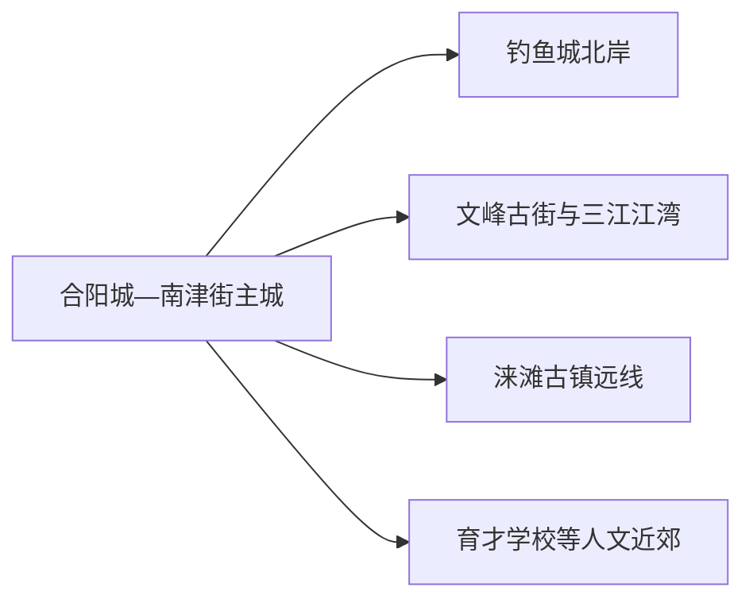
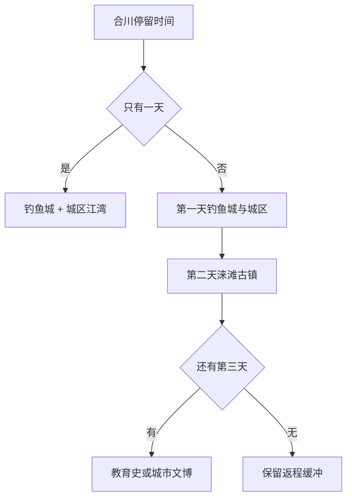

# 合川旅行指南

合川的主线很清楚：先在嘉陵江、涪江与渠江交汇的城区认识三江城市，再用完整半天走钓鱼城，增加一天前往涞滩古镇和二佛寺。历史遗址、江湾生活与地方饮食彼此距离合适，适合做成两到三天的主题旅行。

> 建议停留：2–3 天 
> 旅行关键词：钓鱼城、三江汇流、涞滩古镇、二佛寺、文峰古街 
> 主要体力：城区低至中等；钓鱼城与涞滩为中等 
> 最近研究：2026-08-12

## 城市速览

| 项目 | 旅行信息 |
|---|---|
| 主要旅行价值 | 钓鱼城提供完整的山城防御遗址阅读，涞滩把古镇和摩崖造像连接起来，城区三江与文峰古街适合补足地方生活。 |
| 建议停留 | 1 天看钓鱼城与城区；2 天增加涞滩；3 天加入陶行知纪念馆、卢作孚相关场馆或江湾慢行。 |
| 较舒适季节 | 春秋适合遗址和古镇；夏季早出晚归并安排午休；冬季适合文博和古镇，湿冷时减少山路。 |
| 预算特点 | 城区开放空间成本低，钓鱼城、二佛寺、跨镇车辆和主题住宿构成主要增量。 |
| 步行强度 | 钓鱼城有坡道、台阶和遗址路面；涞滩有石板与高差，城区可分段减负。 |
| 主要天气风险 | 高温、强降雨、江河水位、山路湿滑和冬季雾；水上项目按运营公告选择。 |
| 独行旅行 | 城区和钓鱼城较易安排，涞滩返程与末班车提前落实。 |
| 亲子旅行 | 钓鱼城故事、陶行知主题和古镇适合分龄讲解，临崖、江岸与石阶需持续看护。 |
| 长者与低体力旅行 | 以城区文博、文峰古街和钓鱼城短线为主，涞滩只走古镇核心或二佛寺二选一。 |
| 无障碍信息 | 新建公共空间可能具备无障碍设施，遗址与古镇连续动线受地形影响；设施连续性需向官方确认。 |

### 地名记录与现行边界

本页处理重庆市辖区 **500117**。固定 **GeoNames 8417605** 名为 `Yangcheng`，坐标落在合阳城街道主城；法定合川区实体 **Wikidata Q714045** 的 `P1566=1808212` 指向较广行政记录。页面用固定点承接本批人口清单，以法定代码覆盖全区，钓鱼城、南津街、涞滩等按实际镇街组织。

## 城市格局与游览区域

| 区域 | 主要内容 | 游览特点 | 与其他区域的关系 |
|---|---|---|---|
| 合阳城—南津街主城 | 城市文博、餐饮、车站与住宿 | 公共服务集中，可安排抵达日 | 文峰古街和江湾可同日，前往钓鱼城需过江或绕行 |
| 钓鱼城片区 | 钓鱼城遗址、历史解说与山地游线 | 需要完整半日，坡道和日晒明显 | 与城区同日可行，结束后回城休息 |
| 文峰古街—三江江湾 | 文峰塔、开放街区、江景和夜间餐饮 | 步行可拆段，适合傍晚 | 与主城连贯，不替代钓鱼城遗址主题 |
| 涞滩镇 | 涞滩古镇、二佛寺摩崖造像 | 古镇与寺院组成一个完整目的地 | 适合独立一日，返程前留道路缓冲 |
| 草街—育才学校方向 | 陶行知纪念馆、育才学校旧址等 | 以教育史与近现代人物为主 | 适合作为第三天兴趣线 |

## 主要景点

| 景点 | 区域 | 类型 | 主要看点 | 建议用时 | 室内外 | 体力 | 预约风险 | 天气影响 | 优先级 |
|---|---|---|---|---:|---|---|---|---|---|
| 钓鱼城景区 | 钓鱼城街道 | 遗址与山地景区 | 山城防御格局、遗址、三江地势和历史展陈 | 4–6 小时 | 混合 | 中高 | 中至高 | 高 | A |
| 涞滩古镇（二佛寺） | 涞滩镇 | 古镇与石刻 | 瓮城、老街、二佛寺摩崖造像及渠江环境 | 4–6 小时 | 混合 | 中 | 中至高 | 中高 | A |
| 文峰古街 | 南津街 | 开放街区 | 文峰塔、滨江街区、餐饮与夜间活动 | 1.5–3 小时 | 混合 | 低至中 | 低 | 中 | B |
| 合川城市文博场馆 | 主城 | 博物馆与公共文化 | 地方历史、三江城市与临展 | 1.5–3 小时 | 室内 | 低 | 中 | 低 | B |
| 陶行知先生纪念馆（育才学校旧址） | 草街方向 | 纪念馆与旧址 | 教育史、人物生平与旧址环境 | 2–3 小时 | 混合 | 低至中 | 中 | 中 | B |
| 卢作孚相关纪念空间 | 主城及相关镇街 | 近现代人物 | 实业、教育和乡村建设线索 | 1–2 小时 | 室内为主 | 低 | 高 | 低 | C |
| 三江滨水开放短段 | 主城 | 城市滨水 | 嘉陵江、涪江、渠江交汇的城市空间 | 1–2 小时 | 室外 | 低 | 低 | 高 | B |

钓鱼城内部遗址按一个完整景区理解，涞滩古镇与二佛寺按同一远郊目的地规划。江面游船、节庆演出与夜间灯光属于动态项目，确认运营后再排入。

## 美食与餐饮

合川饮食属于重庆小河帮语境，官方当期以“五香十味”、合川鱼和本地畜禽食材组织地方风味。点菜时先说明辣度、花椒麻度和份量，再按人数选择。

| 菜品或餐饮类型 | 常见区域 | 一个人用餐与常见份量 | 风味、过敏原与饮食限制 | 排队风险与替代方法 |
|---|---|---|---|---|
| 合川桃片 | 主城与正规特产店 | 适合作点心或伴手礼 | 糯米制品，常含核桃、芝麻或糖 | 看配料与日期，选择小包装 |
| 合川米粉与面食 | 主城、车站周边 | 单人友好 | 汤底可能含骨汤、辣椒、花椒和大豆 | 早餐高峰可换社区同类店 |
| 合川鱼与江鲜做法 | 主城、文峰古街 | 多人共享更合适，单人问小份 | 鱼类过敏，高油高辣；来源和计价需确认 | 先问重量、做法与总价，改选普通熟食亦可 |
| 小河帮家常菜 | 主城与乡镇 | 2–4 人更易搭配 | 肉类、内脏、豆制品和辣椒常见 | 选明码菜单，控制辣度和份量 |
| 古镇小吃与茶饮 | 涞滩 | 适合分次少量品尝 | 油炸、糯米、坚果和共锅风险 | 正餐仍选择证照清楚的餐馆 |

## 经典行程

### 一日经典路线

**路线**：钓鱼城 → 主城午餐 → 城市文博或文峰古街 → 三江江湾

- **串联逻辑**：上午完成高体力遗址，下午回到主城用室内和滨江短段收尾。
- **预约锚点**：钓鱼城实名与开放时间，城市场馆闭馆日。
- **休息安排**：钓鱼城游客中心和主城午餐各安排一次长休。
- **时间不足时**：保留钓鱼城，文博与古街二选一。

### 两日城市路线

**第 1 天**：钓鱼城 → 文峰古街  
**第 2 天**：涞滩古镇 → 二佛寺 → 返回主城

- **串联逻辑**：一日一处完整历史目的地，避免跨片区赶路。
- **预约锚点**：两景区预约、涞滩返程车和二佛寺开放。
- **休息安排**：第一天回城休息，第二天午餐放在涞滩镇。
- **时间不足时**：只剩一天时在钓鱼城与涞滩中二选一。

### 三日深度路线

**第 1 天**：钓鱼城与三江江湾  
**第 2 天**：涞滩古镇完整日  
**第 3 天**：陶行知纪念馆 → 城市文博 → 文峰古街

- **串联逻辑**：按古代防御、古镇石刻、近现代教育与城市生活分日。
- **预约锚点**：第三天纪念馆和场馆开放。
- **休息安排**：每天午后保留室内或返程缓冲。
- **时间不足时**：第三天保留一个纪念馆，取消重复滨水。

### 雨天路线

**路线**：城市文博 → 午餐 → 陶行知纪念馆或卢作孚相关纪念空间

- **适用条件**：普通降雨；暴雨、江河预警或道路管制时留在主城。
- **串联逻辑**：以室内展陈替代遗址坡道和古镇石板路。
- **预约锚点**：两个场馆的开放与车辆。
- **休息安排**：主城午餐和馆内座位分段使用。
- **时间不足时**：只保留城市文博一馆。

### 亲子或低体力路线

**亲子路线**：钓鱼城游客中心与精华短线 → 午餐 → 城市文博 → 文峰古街短段  
**低体力路线**：车辆到城市文博 → 主城午餐 → 文峰古街平缓短段 → 江湾观景

- **减负方式**：亲子路线控制遗址长度并持续看护；低体力路线避开长台阶和古镇完整坡道。
- **预约锚点**：钓鱼城短线建议、场馆电梯和落客点。
- **休息安排**：上午、午餐、下午各安排坐休。
- **时间不足时**：保留一个历史展陈和一段江湾。

### 远郊一日路线

**路线**：主城 → 涞滩古镇 → 午餐 → 二佛寺 → 返回

- **适用条件**：道路、景区和返程车稳定。
- **串联逻辑**：古镇与二佛寺空间和主题相连，可组成完整一日。
- **预约锚点**：线上实名、二佛寺开放和返程车。
- **休息安排**：古镇午餐，寺院参观前后各休息一次。
- **时间不足时**：只走古镇核心与二佛寺精华，提前返程。

## 住宿区域

| 区域 | 优点 | 代价 | 适合人群 | 交通提示 |
|---|---|---|---|---|
| 合阳城—南津街主城 | 餐饮、车站、文博与车辆集中 | 到涞滩仍是远线 | 首访、公共交通、两日以上 | 核对距合川站和第二天上车点 |
| 文峰古街附近 | 傍晚江景和餐饮方便 | 活动日噪声与停车压力 | 夜间街区、短住 | 预订时看具体街道与隔音 |
| 涞滩镇 | 可体验清晨与夜间古镇 | 住宿与返程选择较少 | 古镇慢旅行、自驾 | 确认接待资质、热水、餐饮和次日车辆 |

## 市内交通

合川站是主要铁路门户，具体车次以 12306 为准。主城到钓鱼城可用公交、出租或网约车；涞滩、草街等远线先核对班次和返程。江河相隔会放大直线距离，住宿与景点优先按桥梁、轨道和道路实际行程选择。

| 方式 | 适用场景 | 核对重点 |
|---|---|---|
| 铁路 | 重庆中心城区、成都等方向 | 合川站车次、末班与到站接驳 |
| 公交 | 主城、钓鱼城及部分镇街 | 班次、站点、节庆改线 |
| 出租与网约车 | 钓鱼城、低体力和多人出行 | 景区上客点、涞滩返程接单 |
| 自驾 | 涞滩与第三天远线 | 停车、雨雾、酒后驾驶和乡道 |

## 不同旅行者须知

- **独行者**：涞滩先确认返程，夜间江边活动以人流和照明稳定的开放区域为主。
- **亲子家庭**：用故事和场馆降低纯爬坡比例，遗址临崖、江岸和古镇台阶持续看护。
- **长者与低体力旅行者**：车辆落客、单馆慢看和文峰短段更舒适；钓鱼城向游客中心询问精华短线。
- **无障碍旅行者**：逐点确认停车、坡道、电梯、卫生间和轮椅服务，遗址与古镇准备替代观景点。
- **水域与文保**：沿正式步道、开放街区和景区路线活动；江面项目、摩崖造像和遗址按管理要求参观。
- **饮食限制**：鱼类、坚果、糯米、辣椒、花椒和共锅风险提前说明。

## 行前核对

| 核对事项 | 建议时间 | 官方入口 |
|---|---|---|
| A级景区开放、预约和票务 | 订行程前及前一日 | [合川区 2026 年 A 级景区名录](https://www.hc.gov.cn/bmjd/bm_100475/whlyw/zwgk_101411/jczwgk/lylyxxgk/ggfw/gglyjgml/202605/t20260526_15703196.html) |
| 涞滩返程与远线道路 | 前一日和当天 | 合川区政府、客运与导航实时信息 |
| 场馆与纪念馆开放 | 前一日 | 场馆正式渠道 |
| 铁路 | 购票前及当天 | [中国铁路 12306](https://www.12306.cn/) |
| 高温、暴雨、江河和雾 | 出发前三日及当天 | [重庆市气象局](https://cq.cma.gov.cn/) |

## 来源与更新记录

### 主要来源

| 来源 | 支持内容 | 核验日期 |
|---|---|---|
| [民政部行政区划代码查询](https://dmfw.mca.gov.cn/) | 合川区代码 500117 | 2026-08-12 |
| [Wikidata Q714045](https://www.wikidata.org/wiki/Q714045) | 合川区法定实体与 P1566 行政记录 | 2026-08-12 |
| [GeoNames 8417605](https://www.geonames.org/8417605/yangcheng.html) | 固定合阳城主城点 | 2026-08-12 |
| [合川区 2026 年 A 级景区名录](https://www.hc.gov.cn/bmjd/bm_100475/whlyw/zwgk_101411/jczwgk/lylyxxgk/ggfw/gglyjgml/202605/t20260526_15703196.html) | 钓鱼城、涞滩、文峰古街开放、预约与地址 | 2026-08-12 |
| [合川区资源概况](https://www.hc.gov.cn/zjhc/hcgk/zrzy/202602/t20260224_15449582.html) | 三处国保、景区与浅丘河流背景 | 2026-08-12 |
| [2026 钓鱼城旅游文化节发布](https://www.hc.gov.cn/xxgk/zfxxgkmlrk/zcjd/xwfb/202605/t20260521_15693665.html) | 城区、景区、饮食与当期活动空间 | 2026-08-12 |
| [合川文旅规划](https://www.hc.gov.cn/xxgk/zfxxgkmlrk/zdsxjcygk101/jcwj/jcwj2023/202312/t20231228_12758836.html) | 钓鱼城、文峰、涞滩、育才学校等线路关系 | 2026-08-12 |
| [中国铁路 12306](https://www.12306.cn/) | 铁路时刻与票务动态 | 2026-08-12 |

### 更新记录

| 日期 | 更新内容 |
|---|---|
| 2026-08-12 | 首次系统整理固定合阳城点与合川区边界、钓鱼城、涞滩、三江城区、路线、住宿交通和江河文保边界。 |
