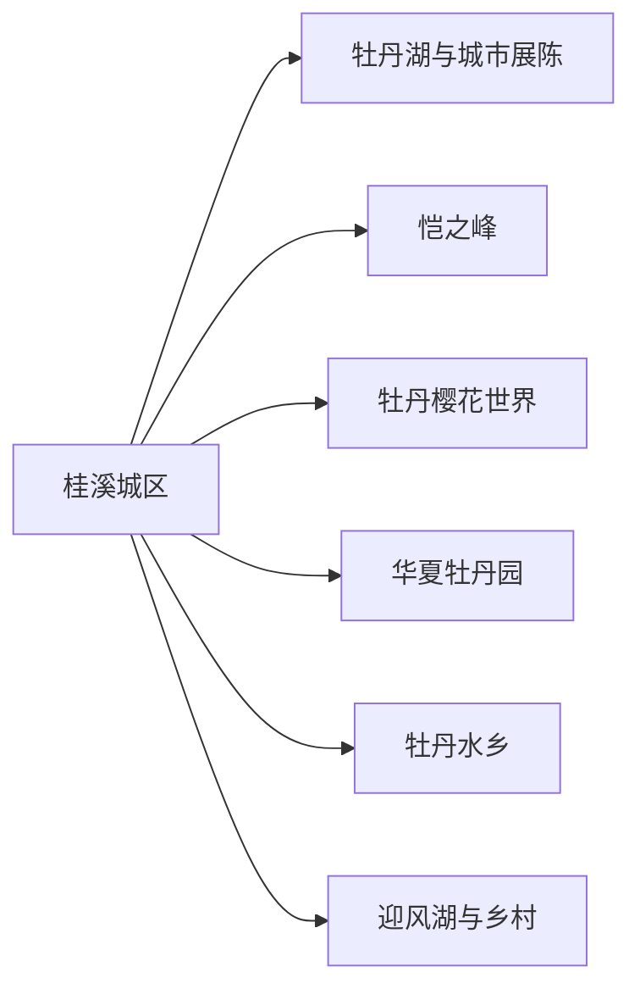
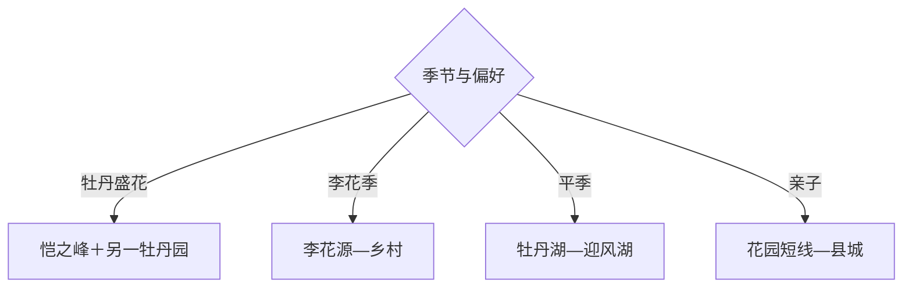

# 垫江旅行指南

垫江最适合围绕牡丹花期与渝东北丘陵乡村安排：县城承担住宿和换线，恺之峰、牡丹樱花世界、华夏牡丹园与牡丹水乡各有不同园区体验，迎风湖和李花源适合补充水岸或季节花木。花期之外，以县城、湿地和乡村慢游为主。

## 城市速览

| 项目 | 信息 |
|---|---|
| 主线 | 桂溪县城—牡丹湖—恺之峰—牡丹樱花世界—华夏牡丹园—迎风湖 |
| 停留 | 花季1–2天；平季县城与湖区1天 |
| 住宿 | 桂溪城区最稳妥，花园周边民宿适合早赏花 |
| 交通 | 从重庆或万州方向乘铁路、公路进入，县内远点用公交、预约车或自驾 |
| 风险 | 花期拥堵、春季降雨泥泞、夏季高温、湖岸和乡道 |
| 边界 | 花田生产区、未开放山林、湿地保育区和农业机耕路按开放范围进入 |

## 城市格局与游览区域

固定 `Guixi / GeoNames 1809467` 是垫江县城桂溪片区，本页以法定垫江县 `Q1209039` 组织。牡丹园点位分散，花季优先按当年官方线路选择相邻两处；迎风湖等远点另留半日。

## 主要景点

| 景点 | 区域 | 类型 | 核心体验 | 用时 | 环境 | 体力 | 预约风险 | 天气影响 | 优先级 |
|---|---|---|---|---:|---|---|---|---|---|
| 恺之峰旅游区 | 太平镇方向 | 牡丹园区 | 山水牡丹、步道与观景 | 3–6小时 | 室外 | 中高 | 很高 | 很高 | A |
| 垫江牡丹樱花世界 | 新民镇方向 | 花卉园区 | 牡丹、樱花与季节游乐 | 3–6小时 | 室外 | 中 | 很高 | 很高 | A |
| 华夏牡丹园 | 澄溪镇方向 | 牡丹园区 | 品种观察、花田与农旅 | 2–5小时 | 室外 | 中 | 高 | 很高 | A |
| 垫江牡丹水乡 | 高峰镇方向 | 乡村花景 | 水田、牡丹与乡村景观 | 3–5小时 | 室外 | 中 | 高 | 很高 | B |
| 牡丹湖湿地公园 | 县城 | 城市湿地 | 湖岸、城市休闲与夜景 | 2–4小时 | 室外 | 低中 | 低 | 高 | B |
| 迎风湖国家湿地公园公开区 | 普顺镇方向 | 湿地 | 湖泊、湿地科普与观鸟 | 半日 | 室外 | 中 | 高 | 极高 | B |
| 李花源公开接待区 | 五洞镇方向 | 季节花景 | 李花、果园与乡村慢游 | 2–4小时 | 室外 | 中 | 高 | 很高 | B |
| 乐天花谷或仙草园当期开放区 | 乡镇 | 农旅园区 | 时令花木与轻休闲 | 2–4小时 | 室外 | 低中 | 很高 | 很高 | C |

## 美食与餐饮

县城可选石磨豆花、咂酒风味菜、垫江酱瓜、牛肉和重庆家常菜。赏花日客流集中，正餐可错峰并先问套餐份量；乡村点在预约时一并确认供餐、饮水和停车。

## 经典行程

### 一日经典线
**路线**：县城—恺之峰—牡丹湖晚间短游。**逻辑**：一处主园深游，县城收尾。**预约锚点**：花期、票务与接驳。**休息**：园区游客中心。**删除条件**：花期偏差时改迎风湖。

### 两日花乡线
**路线**：首日恺之峰—牡丹湖；次日牡丹樱花世界或华夏牡丹园。**逻辑**：两个不同园区分日，减少拥堵转场。**预约锚点**：官方花情、停车和活动。**休息**：桂溪城区。**删除条件**：降雨时第二园缩短。

### 牡丹专题线
**路线**：官方推荐主园—品种观察—乡村牡丹点。**逻辑**：以当年盛花期替代固定园区堆叠。**预约锚点**：花情直播、讲解和园区开放。**休息**：主园。**删除条件**：花期结束时改湿地线。

### 湖泊湿地线
**路线**：牡丹湖—迎风湖公开区—县城。**逻辑**：用城市湖与郊野湿地形成平季方案。**预约锚点**：湿地开放、水情与交通。**休息**：迎风湖服务点。**删除条件**：大风雷雨时只留城区。

### 亲子线
**路线**：牡丹樱花世界短段—午休—牡丹湖。**逻辑**：把互动园区与平缓湖岸组合。**预约锚点**：儿童项目、身高和天气。**休息**：园区。**删除条件**：高温时取消午后户外。

### 乡村花木线
**路线**：李花源或牡丹水乡二选一—乡镇午餐—农产品正规门店。**逻辑**：跟随物候选择成熟接待点。**预约锚点**：花果期、道路与供餐。**休息**：乡镇。**删除条件**：季节不符时返回县城。

### 低体力线
**路线**：车辆进入主园核心区—午休—牡丹湖短段。**逻辑**：控制坡道与跨园转场。**预约锚点**：观光车、无障碍和座椅。**休息**：游客中心。**删除条件**：园内交通停运时只留县城。

## 住宿区域

桂溪城区适合铁路公路接驳、餐饮和多园换线；主花园周边适合盛花期早入园，但需确认乡村道路与经营条件；迎风湖周边住宿只用于明确的湿地慢游安排。花季预订关注停车、早餐和取消政策。

## 市内交通

各牡丹园并非步行相连，县城往返更清晰。花季先参考官方分流线路，再比较公交、旅游专线、预约车和自驾；自驾为停车排队留余量。乡道会车慢，夜间返程优先走干线。

## 不同旅行者须知

花卉爱好者按实时花情选园；摄影者清晨入园并避开花田生产线；亲子家庭一次选一园；低体力者使用观光车。花田种植区、果园作业区、湿地核心区、水库岸线和未开放林地保留明确限制。

## 行前核对

- 核对牡丹、樱花和李花物候，园区票务、观光车、活动与临时限流。
- 核对降雨、高温、乡道、停车、湿地水情和返程交通。
- 赏花沿公开步道，采摘按经营者规则，湖岸活动遵守护栏与水域管理。

## 来源与更新记录

| 来源 | 支持内容 | 核验日期 |
|---|---|---|
| [重庆市文旅委：2026垫江牡丹节](https://whlyw.cq.gov.cn/zwxx_221/bmdt/qxfc/202604/t20260410_15603952.html) | 牡丹园区、花期活动与一两日线路 | 2026-09-01 |
| [文化和旅游部：垫江赏花线路](https://zhuanti.mct.gov.cn/cq_detail/283.html) | 恺之峰、华夏牡丹园、李花源、花谷与迎风湖 | 2026-09-01 |
| [GeoNames 1809467](https://www.geonames.org/1809467/) | Guixi 固定主城点 | 2026-09-01 |
| [Wikidata Q1209039](https://www.wikidata.org/wiki/Q1209039) | 垫江县实体与跨库标识 | 2026-09-01 |

| 日期 | 更新 |
|---|---|
| 2026-09-01 | 首次完成垫江旅行研究，按实时花情、县城、湿地与乡村组织。 |
