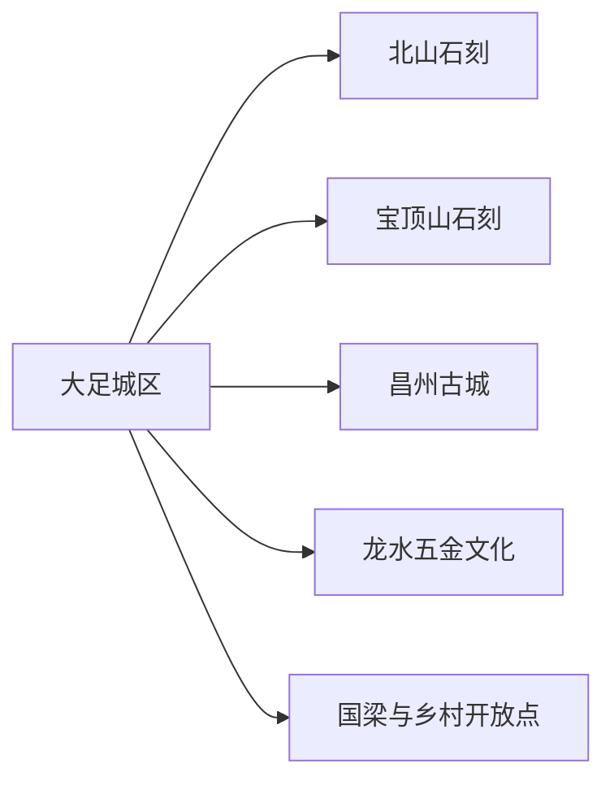
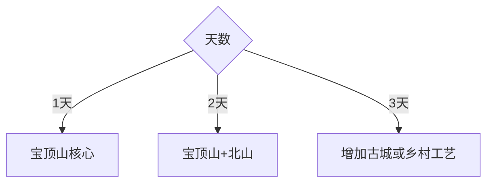

# 大足旅行指南

大足位于重庆西部，旅行核心是宝顶山与北山石刻，城区承担住宿、餐饮和文博，昌州古城、安岳方向联游与龙水五金文化按兴趣补充。石刻内容密度高，给讲解、洞窟观察和交通各留余量，比快速打卡更能理解其宗教艺术与社会生活价值。

## 城市速览

| 项目 | 信息 |
|---|---|
| 主线 | 大足城区—北山石刻—宝顶山石刻—昌州古城—乡村与工艺线 |
| 停留 | 石刻核心2天；乡村或工艺方向另留半日至1天 |
| 住宿 | 大足城区便于双山石刻；宝顶镇适合早入园；龙水适合工业文化线 |
| 交通 | 高铁、公路、公交、出租车和景区接驳组合 |
| 风险 | 石阶、湿滑、夏季高温、强降雨、文物保护与节假日客流 |
| 边界 | 世界遗产洞窟、寺院、文物保护范围、村落和生产工场分别管理 |

## 城市格局与游览区域

北山邻近城区，宝顶山需要单独往返，龙水和乡村点位分属其他方向。固定清单的 **GeoNames 1904046 Yongxi** 对应大足区雍溪镇，本页按区级旅行尺度承接；Wikidata `Q714314` 与法定代码 `500111` 确定现行区界。固定镇点用于定位清单记录，不替代完整行政面。

## 主要景点

| 景点 | 区域 | 类型 | 核心体验 | 用时 | 环境 | 体力 | 研究价值 | 拥挤 | 优先级 |
|---|---|---|---|---:|---|---|---|---|---|
| 宝顶山石刻景区 | 宝顶 | 世界文化遗产 | 大佛湾造像群、宗教叙事与宋代社会生活 | 5–7小时 | 混合 | 中高 | 很高 | 高 | A |
| 北山石刻景区 | 城区北部 | 世界文化遗产 | 晚唐至宋代造像与艺术风格演变 | 3–5小时 | 混合 | 中高 | 很高 | 中高 | A |
| 大足石刻博物馆 | 宝顶 | 专题博物馆 | 石窟保护、考古与艺术背景 | 2–3小时 | 室内 | 低 | 很高 | 中 | A |
| 昌州古城历史文化风情城 | 城区 | 历史街区 | 昌州记忆、城市休闲与地方餐饮 | 2–4小时 | 混合 | 低中 | 中 | 中 | B |
| 香国公园 | 城区 | 城市公园 | 城市绿地、石刻主题与休息空间 | 2–3小时 | 室外 | 低 | 中 | 低 | B |
| 大有田园—国梁故里开放区 | 国梁方向 | 乡村历史 | 乡村景观与人物历史 | 半日至1天 | 混合 | 中 | 高 | 中 | B |
| 雍溪里景区 | 雍溪 | 古镇乡村 | 固定记录所在镇、乡村街巷与地方生活 | 半日 | 混合 | 中 | 中 | 中 | B |
| 龙水五金文化开放点 | 龙水 | 工业文化 | 五金产业、工艺传统与市场观察 | 半日 | 混合 | 中 | 高 | 低 | B |

石刻洞窟、造像、碑刻与寺院按文物保护规则参观，拍摄、照明、触摸和商业使用以现场公告为准；工场和市场通过正式接待或公共区域了解生产工艺。

## 美食与餐饮

大足邮亭鲫鱼、丁家坡洋芋、冬菜、荷叶糯米与川渝家常菜常见。城区和昌州古城适合集中用餐；点鱼确认重量、辣度和做法，说明花生芝麻、鱼刺、动物油和共享份量。景区日随身备水，把正餐放在城区或游客服务区。

## 经典行程

### 两日基础线
**路线**：宝顶山石刻与博物馆—北山石刻与城区。**逻辑**：两大核心分开，保持观察质量。**预约锚点**：石刻门票、讲解和场馆。**休息**：宝顶游客中心与城区。**删除条件**：只有一天时保留宝顶山。

### 宝顶山深读线
**路线**：博物馆—宝顶山主要洞窟—圣寿寺开放区。**逻辑**：先建立背景，再看完整叙事。**预约锚点**：入场、讲解和寺院开放。**休息**：游客中心。**删除条件**：体力不足时减少外围步道。

### 北山城区线
**路线**：北山石刻—香国公园—昌州古城。**逻辑**：石刻艺术与现代城区连续安排。**预约锚点**：北山开放。**休息**：城区。**删除条件**：雨天删公园。

### 雍溪乡村线
**路线**：城区—雍溪里正式景区—乡村餐饮—返程。**逻辑**：承接固定记录并观察乡镇生活。**预约锚点**：开放、活动和车辆。**休息**：雍溪镇。**删除条件**：无活动时缩为半日。

### 国梁田园线
**路线**：大有田园—人物文化开放点—乡村景观。**逻辑**：历史主题与田园同向。**预约锚点**：场馆、活动和车辆。**休息**：景区服务点。**删除条件**：强降雨时改城区文博。

### 龙水工艺线
**路线**：龙水公共文化空间—正规五金展示或市场公共区—城区。**逻辑**：从产业史理解地方城市。**预约锚点**：展示接待。**休息**：龙水镇。**删除条件**：无正式接待时保留公共展陈。

### 低体力线
**路线**：大足石刻博物馆—景区接驳到宝顶山主要开放点—昌州古城短步行。**逻辑**：减少北山台阶和跨区折返。**预约锚点**：无障碍入口、接驳和座椅。**休息**：午后酒店。**删除条件**：洞窟步道不适时以博物馆为主。

## 住宿区域

大足城区适合北山、餐饮和多方向分流；宝顶镇适合早入宝顶山；龙水适合工艺和区域公路联程；雍溪与乡村住宿按正式营业和活动选择。核对停车、景区接驳、隔音、早餐与行李寄存。

## 市内交通

大足南站、大足东站及汽车客运点服务不同线路，订票时核对站名和到城区的接驳。城区到宝顶山、北山、龙水、雍溪和国梁方向分别安排；石刻核心日以景区公交、出租车或包车减少停车压力。

## 不同旅行者须知

艺术与历史爱好者为宝顶山和北山各留半日至一天并预约讲解；亲子家庭先博物馆再选一处石刻；摄影者遵守洞窟光线与设备规则；产业观察者增加龙水；长者和低体力旅行者以博物馆、宝顶主要开放点和城区慢游为主。

## 行前核对

- 核对宝顶山、北山、博物馆、昌州古城和乡村景区开放。
- 核对实名预约、讲解、拍摄规则、接驳、强降雨和高温。
- 世界遗产洞窟、寺院、文物保护范围、村落和生产工场按管理边界进入。

## 来源与更新记录

| 来源 | 支持内容 | 核验日期 |
|---|---|---|
| [大足区政府：2026年A级景区名录](https://www.dazu.gov.cn/qzfjz/smz/zwgk_53321/zfxxgkml/jczwgk_218260/ggwhfwlyjczwgk_1/ggfw/ggeljgml/202601/t20260105_15291915.html) | 石刻、昌州古城、雍溪里与乡村景区 | 2026-09-01 |
| [大足区政府：大足石刻景区](https://www.dazu.gov.cn/qzfjz/bxz/zwgk_53321/zfxxgkml/jczwgk_218260/ggwhfwlyjczwgk_1/ggfw/ggeljgml/202112/t20211204_10080262.html) | 宝顶山、北山、博物馆与预约结构 | 2026-09-01 |
| [GeoNames 1904046](https://www.geonames.org/1904046/) | Yongxi 固定城市点 | 2026-09-01 |
| [Wikidata Q714314](https://www.wikidata.org/wiki/Q714314) | 大足区实体与法定代码 | 2026-09-01 |

| 日期 | 更新 |
|---|---|
| 2026-09-01 | 首次完成大足旅行研究；建立双山石刻、城区、乡村与工艺路线 |
