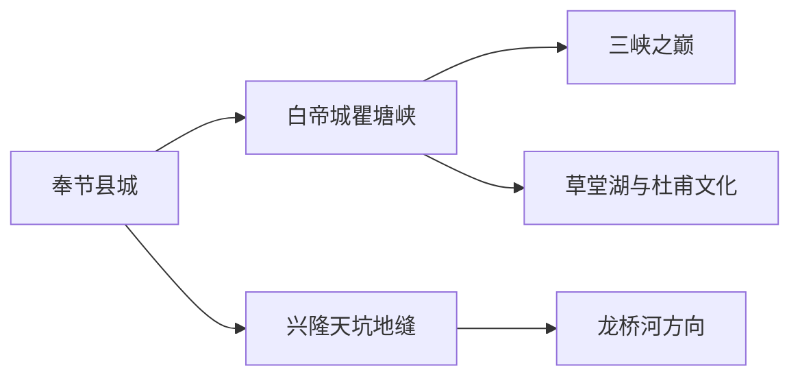
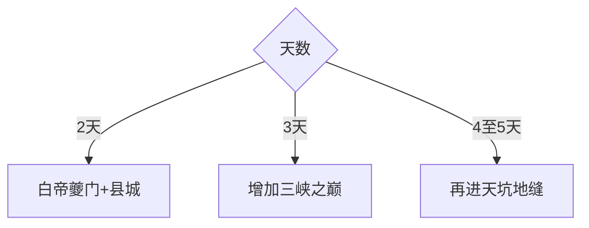

# 奉节旅行指南

奉节位于长江三峡西入口，县城承担交通和住宿，白帝城—瞿塘峡是人文山水核心，三峡之巅、草堂湖与南部天坑地缝则需要各自完整时段。把沿江和山地分开安排，能更从容地处理船班、爬升、雾雨和长距离公路。

## 城市速览

| 项目 | 信息 |
|---|---|
| 主线 | 县城—白帝城瞿塘峡—三峡之巅或天坑地缝 |
| 停留 | 沿江2天；南部地质远线另留1–2天 |
| 住宿 | 县城便于交通；兴隆镇适合天坑地缝方向 |
| 交通 | 高铁、公路、景区接驳与正规游船 |
| 风险 | 峡谷爬升、雾雨、落石、山洪、冬季结冰和船班变化 |
| 边界 | 文物景区、地质公园、消落带、航道与果园分别管理 |

## 城市格局与游览区域

县城与白帝城相距十余公里，三峡之巅有明显爬升，兴隆镇的天坑地缝属于南部远线。固定清单以枫岭镇记录 **GeoNames 8397878** 建页；同窗 `Fengping` 记录 `8399052` 由本页承接县域南部关系。Wikidata `Q1362044` 的 P1566 指向县级行政记录 `1811310`。

## 主要景点

| 景点 | 区域 | 类型 | 核心体验 | 用时 | 环境 | 体力 | 研究价值 | 拥挤 | 优先级 |
|---|---|---|---|---:|---|---|---|---|---|
| 白帝城·瞿塘峡景区 | 白帝方向 | 历史山水 | 白帝城、夔门与三峡诗史 | 5–7小时 | 混合 | 中高 | 很高 | 高 | A |
| 三峡之巅景区 | 赤甲山方向 | 山地观景 | 俯瞰夔门、长江与峡谷地形 | 4–6小时 | 室外 | 高 | 高 | 中 | A |
| 奉节县博物馆及城市文博 | 县城 | 文博 | 移民城市、诗城与地方考古 | 2–3小时 | 室内 | 低 | 高 | 低 | B |
| 草堂湖—杜甫文化开放点 | 草堂方向 | 人文生态 | 诗歌、湖岸与峡江聚落 | 半日至1天 | 混合 | 中 | 高 | 中 | B |
| 小寨天坑与天井峡地缝开放区 | 兴隆方向 | 地质景观 | 岩溶天坑、地缝与地质科普 | 1天 | 室外 | 高 | 很高 | 中 | A |
| 龙桥河正式景区 | 龙桥方向 | 峡谷河流 | 岩溶河谷、步道与生态 | 1天含往返 | 室外 | 高 | 高 | 低 | B |

白帝城内部殿宇、碑林和夔门观景按同一景区连续游览。地质公园分级保护区、未开放洞穴、长江航道与消落带按公告边界进入。

## 美食与餐饮

奉节脐橙、盬子鸡、搭搭面、格格和长江鱼鲜构成地方风味。购买脐橙按产季与正规渠道；点鱼先确认来源和重量；说明辣度、内脏、花生芝麻和共享蒸笼。

## 经典行程

### 两日基础线
**路线**：县城文博—白帝城瞿塘峡。**逻辑**：先读城市背景，再进入核心峡江。**预约锚点**：高铁、景区和游船。**休息**：白帝城游客中心。**删除条件**：船班取消时保留陆路景区。

### 白帝夔门线
**路线**：白帝城—瞿塘峡观景—草堂方向。**逻辑**：用完整一天理解诗史与三峡入口。**预约锚点**：门票、讲解和返程。**休息**：景区餐饮区。**删除条件**：强降雨时缩短临江步道。

### 三峡之巅线
**路线**：县城—景区入口—山顶观景—返程。**逻辑**：给爬升和天气留足时间。**预约锚点**：接驳、索道或步道、云雾。**休息**：分段平台。**删除条件**：雷雨、大风或能见度过低时取消。

### 草堂诗歌线
**路线**：草堂湖—杜甫文化点—瞿塘关相关开放点。**逻辑**：连接诗歌、考古与湖岸。**预约锚点**：场馆和绿道开放。**休息**：草堂镇。**删除条件**：施工或岸线管制时保留场馆。

### 天坑地缝线
**路线**：兴隆住宿—小寨天坑—天井峡地缝。**逻辑**：南部地质线独立成日。**预约锚点**：入口、接驳和天气。**休息**：游客中心。**删除条件**：山洪、结冰或地质风险预警时取消。

### 龙桥河线
**路线**：兴隆—龙桥河正式景区—返程。**逻辑**：与天坑地缝分成两个户外日。**预约锚点**：开放和车辆。**休息**：景区服务区。**删除条件**：雨后水位异常时改文博。

### 低体力线
**路线**：县城博物馆—车辆到白帝城主要开放区—夔门观景。**逻辑**：减少山顶长线。**预约锚点**：接驳、座椅和无障碍。**休息**：午后酒店。**删除条件**：白帝城台阶不适时只留县城与车辆观景。

## 住宿区域

奉节县城便于高铁、餐饮和白帝城方向；草堂适合沿江慢游；兴隆镇适合天坑地缝和龙桥河连续两日。确认景区接驳、山地供暖、早餐、行李寄存和天气退改。

## 市内交通

奉节站到县城需接驳，白帝城、三峡之巅和兴隆方向不是同一公交游线。沿江日与南部山地日分别订车；游船需核对码头、终点和回程，高铁末班前留足山路缓冲。

## 不同旅行者须知

历史爱好者优先白帝城讲解与县博物馆；徒步者按天气选择三峡之巅；地质爱好者住兴隆；亲子与长者用白帝城加草堂湖；自驾者关注雾、落石和连续弯道。

## 行前核对

- 核对白帝城、三峡之巅、草堂湖、天坑地缝与龙桥河开放。
- 核对游船、接驳、能见度、雷雨山洪、落石与冬季结冰。
- 文物、地质保护、消落带、航道和果园按管理边界进入。

## 来源与更新记录

| 来源 | 支持内容 | 核验日期 |
|---|---|---|
| [重庆市政府：白帝城·瞿塘峡景区](https://cq.gov.cn/zjcq/cycq/zmjd/zqaaaaajjq/202606/t20260604_15729050.html) | 景区位置、范围、夔门与核心遗产 | 2026-09-01 |
| [重庆市政府：奉节文旅格局](https://www.cq.gov.cn/ywdt/zwhd/qxdt/202305/t20230529_12005403.html) | 县城集散、白帝瞿塘与天坑地缝结构 | 2026-09-01 |
| [民政部行政区划代码查询](https://dmfw.mca.gov.cn/xzqh/getList?code=50&trimCode=true&maxLevel=3) | 奉节县行政层级与代码 | 2026-09-01 |
| [GeoNames 8397878](https://www.geonames.org/8397878/) | Fengling 固定城市点 | 2026-09-01 |
| [Wikidata Q1362044](https://www.wikidata.org/wiki/Q1362044) | 奉节县实体与行政记录关系 | 2026-09-01 |

| 日期 | 更新 |
|---|---|
| 2026-09-01 | 首次完成奉节旅行研究；建立白帝夔门、三峡之巅与天坑地缝路线 |
