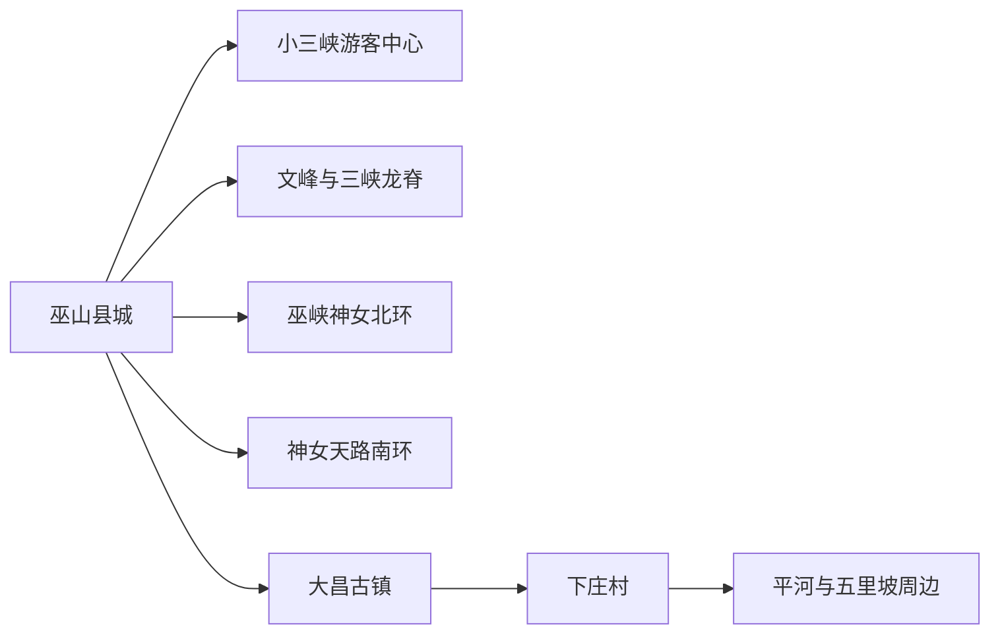
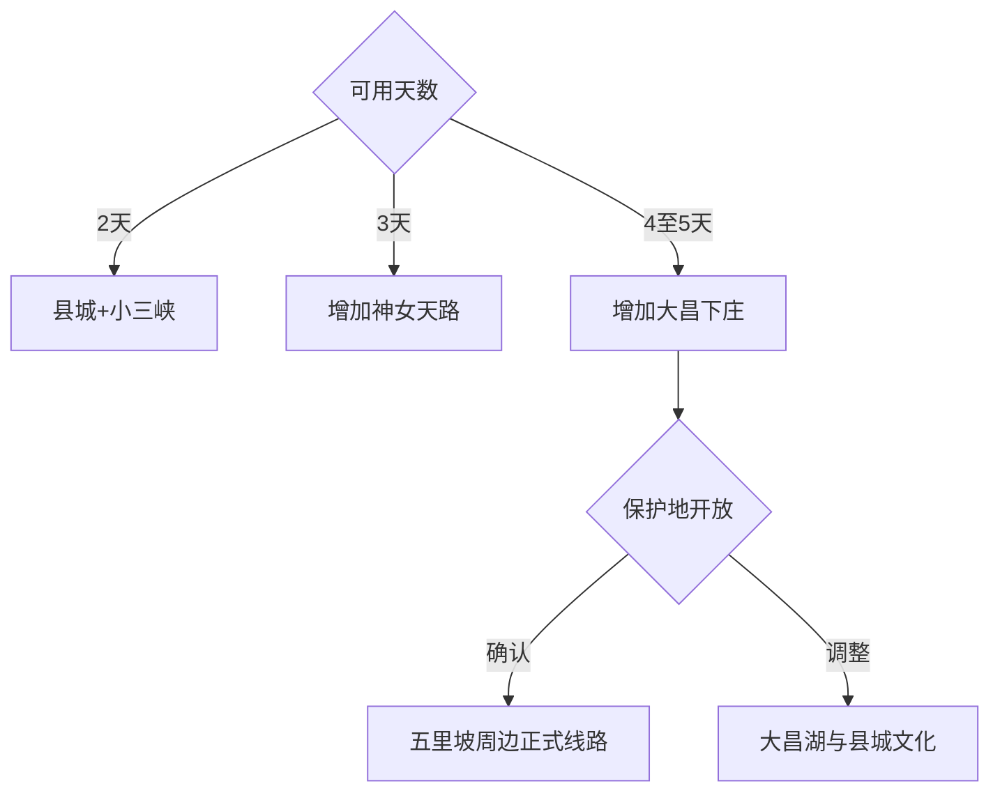

# 巫山旅行指南

巫山的核心是县城、小三峡水路与巫峡神女景区，北部大昌—下庄—五里坡又形成一条更深的山地线。首次到访可用三天分别认识峡江县城、小三峡和神女天路；大昌古镇、下庄村及五里坡周边适合再加一至两天。游船、索道、观光车和山路都受水位、雾、风、冰雪与地质条件影响，先锁定当天运营项目再排顺序。

## 城市速览

| 项目 | 信息 |
|---|---|
| 主线 | 巫山县城—小三峡—巫峡神女；北部另选大昌—下庄—五里坡 |
| 停留 | 核心3天；加入北部山地共4–5天 |
| 住宿 | 县城适合游船与高铁；神女天路周边适合山景；大昌或平河适合北部远线 |
| 交通 | 高铁、公路、持证游船、景区观光车与合规车辆 |
| 季节 | 秋冬红叶突出；春夏云雾与山水丰富，强降雨风险也更高 |
| 边界 | 长江航道、库岸消落带、自然保护区、世界遗产地与普通乡村分别管理 |

## 城市格局与游览区域

固定 **Wushan / GeoNames 1790920** 对应巫山县城，本页按巫山县现行范围承接完整旅行。县城沿长江展开，是高铁、住宿、小三峡游船和多条公路的共同基地；神女景区分水路、北环和南环产品，票种与入口分别核对。大昌、下庄、平河和五里坡位于北部深山，适合换宿或完整公路日。

长江与大宁河承担通航、行洪和水资源功能，游览使用公布码头与航线。五里坡同时是国家级自然保护区和世界自然遗产组成部分，生态旅游以管理机构划定的实验区、村镇项目和正式线路为准，核心区、科研监测区及野生动物栖息地保留严格保护。

## 主要景点

| 景点 | 区域 | 类型 | 核心体验 | 用时 | 环境 | 体力 | 研究价值 | 拥挤 | 优先级 |
|---|---|---|---|---:|---|---|---|---|---|
| 小三峡·小小三峡 | 大宁河 | 峡谷游船 | 龙门峡、巴雾峡、滴翠峡与支流峡谷 | 4–6小时 | 船上与室外 | 低至中 | 很高 | 高 | A |
| 巫峡·神女景区 | 长江巫峡 | 峡江与文化 | 神女峰、神女溪及巫峡十二峰语境 | 半日至1天 | 混合 | 中 | 很高 | 高 | A |
| 神女天路与黄岩方向 | 建平—两坪 | 山地观景 | 高位公路、观景台、索道与峡江俯瞰 | 半日至1天 | 室外 | 中高 | 高 | 高 | A |
| 巫山博物馆 | 县城 | 综合博物馆 | 巫山历史、三峡考古与移民文化 | 2–3小时 | 室内 | 低 | 很高 | 中 | A |
| 文峰景区与三峡龙脊 | 县城近郊 | 山脊步道 | 县城、长江和峡口的高位观察 | 3–5小时 | 室外 | 高 | 高 | 中高 | B |
| 大昌古镇 | 大昌镇 | 古镇与库区文化 | 古镇街巷、大昌湖与移民历史 | 半日至1天 | 混合 | 中 | 高 | 中 | B |
| 下庄村与下庄天路 | 竹贤乡 | 乡村与红色精神 | 山地筑路史、传统村落与研学 | 半日至1天 | 室外 | 中高 | 高 | 中 | B |
| 五里坡大峡谷平河段 | 平河乡 | 峡谷与自然教育 | 溪谷、瀑布和世遗周边乡村 | 1天 | 室外 | 高 | 很高 | 中 | B |
| 大昌湖国家湿地公园开放区 | 大昌方向 | 湿地与观鸟 | 库区湿地、候鸟与生态修复 | 2–4小时 | 室外 | 低至中 | 高 | 低 | C |
| 三峡之光等正式夜游产品 | 县城码头 | 夜游与演艺 | 峡江县城、灯光和神女文化叙事 | 1.5–2.5小时 | 船上 | 低 | 中 | 高 | C |

小三峡和神女景区按船票、观光车、索道与游览方向分别选购，名称相近的产品也可能使用不同码头。红叶线路随年度水位、叶色和交通调整。山脊、峡谷与湿地使用正式步道和观景点，临崖边缘、消落带和施工便道按现场管理通行。

## 美食与餐饮

县城适合品尝巫山烤鱼、翡翠凉粉、卷卷和腊味，北部乡镇可选本地家常菜与季节农产品。烤鱼先确认鱼种、合法来源、重量、辣度和配菜计价；共享锅具注意花生、芝麻、大豆与鱼类过敏。山地日提前准备饮水和常温补给，野生菌类选择正规餐厅并彻底烹熟。

## 经典行程

### 两日基础线
**路线**：巫山博物馆—县城江岸—小三峡·小小三峡。**逻辑**：先建立峡江历史，再完成核心水路线。**预约锚点**：博物馆、游船班次与码头。**休息**：县城与船上固定座位。**删除条件**：水路停航时改文峰短线和室内场馆。

### 三日神女线
**路线**：前两日基础线—神女天路或巫峡神女当期产品。**逻辑**：用独立一天处理高差、索道与观光车。**预约锚点**：具体入口、票种、索道和返程。**休息**：游客中心。**删除条件**：大雾、强风、冰雪或景区闭园时留在县城。

### 大昌古镇线
**路线**：县城—大昌古镇—大昌湖开放区—住宿或返程。**逻辑**：集中理解北部古镇与库区湿地。**预约锚点**：公路、馆舍与返程车辆。**休息**：大昌镇。**删除条件**：道路管制或湿地临时保护时缩为古镇文化线。

### 下庄研学线
**路线**：大昌或县城—下庄村—下庄天路公开点—乡村住宿。**逻辑**：把筑路史放回真实山地环境。**预约锚点**：讲解、村内接待和用车。**休息**：村内正式服务点。**删除条件**：落石、强降雨或山路管制时改博物馆。

### 五里坡周边线
**路线**：平河乡—五里坡大峡谷正式项目—当阳或原住宿地。**逻辑**：从开放乡镇项目认识世界遗产生态价值。**预约锚点**：保护地开放、项目资质、天气和返程。**休息**：平河游客服务点。**删除条件**：保护管制、山洪预警或项目停运时取消。

### 红叶季线路
**路线**：按当年官方线路在小三峡、神女景区或县城周边三选一。**逻辑**：叶色、水位与运力共同决定路线。**预约锚点**：红叶指数、船班、景交和住宿。**休息**：游客中心或船舱。**删除条件**：叶色不足、客流超载或天气突变时改常规文化线。

### 低体力线
**路线**：巫山博物馆—车辆到县城江岸—有固定座位的小三峡游船。**逻辑**：以室内、车辆和坐席观景控制步行。**预约锚点**：码头无障碍、登船坡度与陪同服务。**休息**：博物馆和船舱。**删除条件**：登船条件不适时只留县城场馆。

## 住宿区域

巫山县城适合高铁抵离、小三峡游船、博物馆和夜间餐饮；神女天路方向适合已确认接驳的山景住宿；大昌、平河或当阳适合连续北部山地日。订房时核对完整乡镇、海拔、取暖空调、热水、餐饮、停车、接送、通信与退改，红叶季提前锁定可取消房型。

## 市内交通

巫山高铁站到县城仍需接驳，县城码头、游客中心和酒店按票面入口分别前往。小三峡主要依赖游船，神女景区依赖公路、景交、索道或船舶组合；大昌、下庄、平河和五里坡方向以山地公路为主。每天只安排一个远线，为雾、落石、施工和返程留出余量。

## 不同旅行者须知

摄影者优先查看红叶、云雾和船班；亲子可选博物馆、小三峡及正规研学项目；长者选择县城住宿和坐席游船；徒步者在文峰、三峡龙脊及保护地外围使用开放线路。自然保护区核心区、野生动物栖息地、航道、消落带、采石矿区和未开放栈道保留明确限制。

## 行前核对

- 核对小三峡、神女景区、索道、观光车、夜游和游船码头。
- 核对高铁接驳、山路、红叶季交通、住宿和县域返程。
- 核对强降雨、山洪、落石、大雾、强风、冰雪和长江水位。
- 五里坡、大昌湖与长江岸线按保护区、湿地和航道管理边界进入。

## 来源与更新记录

| 来源 | 支持内容 | 核验日期 |
|---|---|---|
| [重庆市政府：巫山主要景区](https://www.cq.gov.cn/ywdt/bmts/202409/t20240904_13592809.html) | 巫峡神女、小三峡、文峰与夜游产品 | 2026-09-04 |
| [重庆市政府：小三峡与神女景区游览信息](https://www.cq.gov.cn/ywdt/zwhd/qxdt/202604/t20260402_15585978.html) | 小三峡游船、神女天路、黄岩索道与文峰景区 | 2026-09-04 |
| [重庆市林业局：五里坡纳入世界自然遗产地](https://lyj.cq.gov.cn/zwxx_237/mtbd/202206/t20220613_10808323.html) | 五里坡保护属性与世界自然遗产边界 | 2026-09-04 |
| [重庆市政府：巫山生态与乡村旅行](https://www.cq.gov.cn/zwgk/zfxxgkzl/fdzdgknr/zdmsxx/fp/fplyzyxxgk/202312/t20231229_12769437.html) | 下庄村、大昌湖、巫山博物馆及保护地发展方向 | 2026-09-04 |
| [重庆市文旅委：全市博物馆名录](https://whlyw.cq.gov.cn/zwxx_221/bmdt/tzgg/202502/t20250220_14324640.html) | 巫山博物馆等备案场馆及动态核对入口 | 2026-09-04 |
| [GeoNames 1790920](https://www.geonames.org/1790920/) | Wushan 固定人口点 | 2026-09-04 |

| 日期 | 更新 |
|---|---|
| 2026-09-04 | 首次完成巫山旅行研究；拆分县城、小三峡、神女景区、大昌下庄与五里坡周边路线。 |
