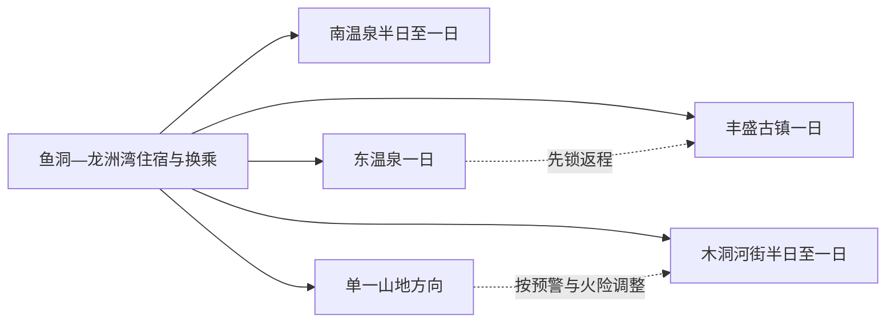
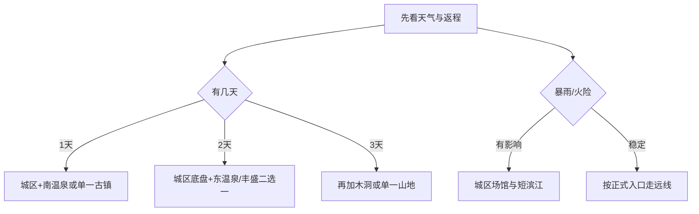

# 巴南旅行指南

巴南位于重庆中心城区南部，适合把鱼洞—龙洲湾作为住宿和换乘底盘，再从南温泉、东温泉、丰盛古镇、木洞或山地森林中选择一个方向。最省力的做法是“一天一个远线”：城区滨江和场馆可以半日组合，温泉、古镇和山地则按各自入口、返程与天气单独安排。

> 建议停留：城区半日至 1 天；东温泉、丰盛古镇或山地各另留 1 天  
> 旅行关键词：长江滨水、巴渝古镇、温泉、木洞河街、山地森林  
> 主要体力：城区低至中等；古镇坡道和山地步道为中高  
> 最近研究：2026-08-13

## 城市速览

| 项目 | 旅行信息 |
|---|---|
| 主要旅行价值 | 以鱼洞—龙洲湾认识重庆南部城市生活，再从南温泉、东温泉、丰盛古镇、木洞和圣灯山等方向选择温泉、古镇或山地主题 |
| 建议停留 | 1 天可做城区与南温泉；2 天加入东温泉或丰盛古镇；3 天再选木洞或山地。远线之间按车辆和天气取舍 |
| 较舒适季节 | 春秋适合古镇与山地；夏季滨水和森林需防高温、雷雨与山洪；冬季温泉更受欢迎，雾、湿滑和道路结冰仍需核对 |
| 预算特点 | 城区餐饮住宿较易控制；温泉产品、景区交通、远线车辆和周末住宿是主要变量 |
| 步行强度 | 龙洲湾、鱼洞公共空间较平缓；古镇石阶、温泉内部换区、圣灯山与云篆山步道增加体力 |
| 主要天气风险 | 高温、暴雨、雷电、山洪、滑坡、浓雾、冬季湿滑与森林火险 |
| 独行旅行 | 城区轨道和常规叫车方便；远镇返程、末班公交与夜间叫车先锁定 |
| 亲子旅行 | 博物馆、滨江短线和具名室内项目较易安排；温泉与水上项目逐项核年龄、身高、水深和看护规则 |
| 长者与低体力旅行 | 优先城区一馆一段滨江，温泉只选接驳明确的单一运营点；古镇和山地使用车辆缩短步行 |
| 无障碍信息 | 轨道站和较新公共场馆可优先申请协助；古镇坡道、温泉湿区和山地的设施连续性需向官方确认 |

## 城市格局与游览区域

巴南区法定行政代码为 `500113`。固定 GeoNames `1785964` 是鱼洞主城居民点，Wikidata `Q11172932` 表达鱼洞街道并以同一 GeoNames ID 关联；本页采用的 Wikidata `Q554491` 表达现行巴南区。居民点用于识别抵达核心，区实体和行政代码用于确定整页范围，两者不互相替代。

| 区域 | 主要内容 | 怎么安排 | 交通关系 |
|---|---|---|---|
| 鱼洞—龙洲湾 | 区级公共文化、商业、滨江与轨道换乘 | 适合首日、雨天和住宿底盘 | 可用轨道与地面交通衔接，具体入口仍按地图复核 |
| 南泉—界石方向 | 南温泉、近郊山水与正式运营项目 | 与城区组合成半日至一日 | 周末按拥堵和停车预留时间 |
| 东温泉—五布河 | 东温泉完整景区与镇区服务 | 单列一日或过夜 | 先锁定去返车辆和具体温泉运营点 |
| 丰盛古镇—羊鹿山 | 古镇、巴渝建筑与季节乡村活动 | 选古镇核心，季节点作为补充 | 公交班次有限，返程优先于加点 |
| 木洞—长江东岸 | 木洞河街、江岸历史与当期活动 | 适合半日至一日专题 | 与丰盛、东温泉并非连续步行区 |
| 圣灯山—云篆山等山地 | 正式开放森林、步道与观景单元 | 只选一个山地方向 | 预警、火险和道路状态决定是否成行 |

巴南的温泉、古镇和山地是彼此分离的运营与自然单元。选择正式景区、公共街巷和明确接待的项目即可形成完整体验；自然保护、林业作业、水利设施、采石矿山、铁路和临江生产岸线保持明确边界。

## 主要景点

优先级用于排时间：**A** 为首访核心，**B** 为按兴趣补充，**C** 为远线或季节候选。

### 城区与近郊

| 景点 | 区域 | 类型 | 主要看点 | 建议用时 | 室内外 | 体力 | 预约风险 | 天气影响 | 优先级 |
|---|---|---|---|---:|---|---|---|---|---|
| 巴南区博物馆或当期区级展览 | 龙洲湾—鱼洞 | 公共文化 | 巴县历史、地方文化与临展；以当期馆址和开放公告为准 | 1.5–2.5 小时 | 室内 | 低 | 中 | 低 | A |
| 鱼洞—龙洲湾滨江公共段 | 主城区 | 城市滨水 | 长江南岸城市生活与公共空间 | 1.5–3 小时 | 室外 | 低至中 | 低 | 高 | B |
| 南温泉旅游风景区当期开放单元 | 南泉街道 | 温泉与近郊山水 | 温泉历史、河谷与运营方开放项目 | 3–6 小时 | 混合 | 中 | 高 | 中至高 | B |
| 汉海海洋公园 | 龙洲湾片区 | 室内主题场馆 | 海洋生物展示和当期表演活动 | 3–6 小时 | 室内为主 | 低至中 | 高 | 低 | B |

### 古镇、温泉与山地

| 景点 | 区域 | 类型 | 主要看点 | 建议用时 | 室内外 | 体力 | 预约风险 | 天气影响 | 优先级 |
|---|---|---|---|---:|---|---|---|---|---|
| 东温泉风景区 | 东温泉镇 | 4A 温泉景区 | 五布河、喀斯特热洞与正式温泉服务 | 5–8 小时 | 混合 | 中 | 高 | 中至高 | A |
| 丰盛古镇 | 丰盛镇 | 4A 古镇 | 巴渝传统街巷、碉楼与地方生活 | 3–5 小时 | 混合 | 中 | 中 | 高 | A |
| 木洞河街公共开放段 | 木洞镇 | 历史街区、滨江 | 木洞商埠、江岸与当期文化活动 | 2–4 小时 | 混合 | 中 | 中 | 高 | B |
| 圣灯山森林公园正式开放线 | 跳石方向 | 森林与山地 | 山地森林、岩体和正式步道 | 5–8 小时 | 室外 | 高 | 高 | 很高 | B |
| 云篆山正式开放线 | 鱼洞西南 | 城郊山地 | 近郊森林与观景步道 | 3–6 小时 | 室外 | 中高 | 中 | 很高 | C |
| 羊鹿山或双寨山具名接待点 | 丰盛周边 | 乡村与季节景观 | 花果、村落和当期农业文旅活动 | 2–5 小时 | 室外为主 | 中 | 很高 | 很高 | C |

温泉景区的温泉池、热洞、住宿和公共山水分别核对；“东温泉”这个地名不等于镇内所有泉眼都可进入。古镇居民院落和乡村生产地以公共街巷、正式展陈和具名接待点为游览范围。

## 美食与餐饮

| 类型 | 适合区域 | 份量与选择 | 饮食提醒 | 怎么选 |
|---|---|---|---|---|
| 重庆火锅、串串与江湖菜 | 鱼洞、龙洲湾、各镇区 | 2–4 人更易分享，单人可选小锅或冒菜 | 牛油、花椒、辣椒、内脏与高盐明显 | 先说明辣度、油脂和禁忌，按人数点菜 |
| 木洞豆花、豆制品与镇区家常菜 | 木洞及巴南生活街区 | 单人可点豆花饭，多人加时蔬和肉菜 | 蘸水可能含花生、芝麻、大豆和辣椒 | 选择明码标价、现做家常店，不追单一网红店 |
| 汤锅与山地腊味 | 东温泉、丰盛及山地镇区 | 多人锅更常见 | 汤底、腌腊肉、菌菇与药膳原料需询问 | 远线先确认营业时间和返程，再决定用餐点 |
| 温泉酒店餐饮 | 东温泉、南温泉 | 套餐和自助差异大 | 住宿、温泉、餐食可能分开计费 | 订前拆分核对包含项目和取消政策 |
| 米酒、糕点与乡镇小吃 | 丰盛、木洞 | 小份试吃适合独行 | 酒精、猪油、坚果和麸质需询问 | 在正规门店购买，驾车者避开酒精饮品 |

## 经典行程

### 一日经典路线

**路线**：鱼洞或龙洲湾 → 区级展览/博物馆 → 午餐与长休 → 鱼洞滨江短段或南温泉当期开放单元 → 返回住宿区。

- **串联逻辑**：先用城区建立地方背景，再选一个近郊体验，减少跨镇折返。
- **适用条件**：首次到访、当日抵离或公共交通旅行者。
- **预约锚点**：公共场馆和南温泉具体运营点。
- **休息安排**：龙洲湾商业区或正式游客服务区。
- **时间不足时**：保留一馆和一顿正餐，滨江只走就近短段。

### 两日城市路线

**第 1 天**：城区文化与滨江短线。  
**第 2 天**：东温泉或丰盛古镇二选一，原路返回或当地过夜。

- **串联逻辑**：第一天解决城市认识与补给，第二天只处理一个远镇。
- **适用条件**：希望兼顾城市与温泉/古镇者。
- **预约锚点**：第二天的门票、温泉项目与去返车辆。
- **休息安排**：镇区正规餐饮和景区服务点。
- **时间不足时**：第二天只保留核心景区，不加羊鹿山等季节点。

### 三日深度路线

**第 1 天**：鱼洞—龙洲湾。  
**第 2 天**：东温泉完整日。  
**第 3 天**：丰盛古镇、木洞河街或单一山地三选一。

- **串联逻辑**：三天分别对应城区、温泉和第三种主题，避免同日跨越巴南东西两端。
- **适用条件**：自驾、包车或已锁定区内接驳者。
- **预约锚点**：东温泉与第三天具体入口、返程和天气。
- **休息安排**：每个远线都在镇区安排午餐与完整休息。
- **时间不足时**：第三天改为木洞或城区半日，不压缩东温泉。

### 雨天路线

**路线**：龙洲湾室内场馆 → 商业区午餐 → 汉海海洋公园或另一处当期开放室内项目。

- **串联逻辑**：把活动留在轨道与城市服务密集区。
- **适用条件**：普通降雨且城市交通正常；高等级暴雨预警时按官方建议减少出行。
- **预约锚点**：两个室内场馆的开放与最后入场。
- **休息安排**：商业区和馆内座席。
- **时间不足时**：只留一座主场馆。

### 亲子或低体力路线

**亲子方案**：区级展览 → 午餐 → 汉海海洋公园精选单元。  
**低体力方案**：车辆抵达一座场馆 → 龙洲湾短休 → 就近滨江无台阶短段。

- **串联逻辑**：两套方案都围绕主城，减少长距离换乘。
- **适用条件**：亲子先核项目年龄；低体力者先核落客、座席和卫生间。
- **预约锚点**：场馆时段、无障碍协助和儿童项目规则。
- **休息安排**：每 60–90 分钟安排室内休息。
- **时间不足时**：删除户外段，保留单一场馆。

### 远郊一日路线

**古镇线**：主城 → 丰盛古镇 → 镇区午餐 → 返程。  
**木洞线**：主城 → 木洞河街公共段 → 午餐 → 当期开放文化点 → 返程。  
**山地线**：主城 → 圣灯山或云篆山单一正式入口 → 原路返回。

- **串联逻辑**：古镇、滨江和山地各自成线，一天只选一种。
- **适用条件**：已锁定车辆、返程和天气；山地还需火险与步道开放稳定。
- **预约锚点**：古镇展陈、山地入口、停车和末班交通。
- **休息安排**：镇区或正式服务点补给，山地自带饮水。
- **时间不足时**：古镇只走核心街巷；山地整段改为城区短线。

## 住宿区域

| 区域 | 优点 | 取舍 | 适合人群 | 交通提示 |
|---|---|---|---|---|
| 龙洲湾—鱼洞 | 轨道、餐饮、商业和跨区交通集中 | 到东温泉、丰盛仍需专程车辆 | 首访、独行、只住一地者 | 核对实际轨道站和夜间返程 |
| 南泉周边 | 方便南温泉与近郊休闲 | 与主城晚间活动分离 | 温泉或周末短住 | 拆分核对住宿与温泉权益 |
| 东温泉镇 | 减少温泉完整日往返 | 住宿品质、餐饮和夜间交通差异大 | 温泉主题、慢行程 | 先确认具体运营方、到店和退改 |
| 丰盛或木洞镇区 | 便于古镇晨晚和乡镇专题 | 班次与夜间叫车少于主城 | 已锁定当地住宿者 | 返程车辆和次日离开方式先确认 |

## 市内交通

| 场景 | 建议方式 | 怎么做 | 动态核对 |
|---|---|---|---|
| 主城抵达 | 轨道交通、公交、出租或网约车 | 以鱼洞、龙洲湾及实际住宿站点换乘 | 运营时段、出入口和大件行李 |
| 东温泉 | 公交、合规包车或自驾 | 先锁返程，再决定是否过夜 | 班次、道路、停车与温泉入口 |
| 丰盛古镇 | 9310 等当期公交、合规车辆或自驾 | 官方资料显示线路班次有限，按当天时刻执行 | 首末班、站点、节假日加班车 |
| 木洞 | 公交或车辆往返 | 将河街入口与镇区上下车点分开核对 | 施工、活动管制和末班 |
| 山地方向 | 自驾、合规包车或运营方接驳 | 一车一方向，预留返程冗余 | 火险、山洪、道路与通信 |

## 不同旅行者须知

| 旅行者 | 优先选择 | 需要确认 | 更稳妥的替代 |
|---|---|---|---|
| 独行者 | 主城轨道、场馆和单一古镇 | 远镇末班、夜间叫车、通信 | 当地过夜或缩成主城半日 |
| 亲子家庭 | 场馆、滨江短线和正式温泉亲子区 | 水深、身高、年龄、救生与过敏 | 城区单馆加正餐 |
| 长者与低体力者 | 车辆接驳的一馆一景 | 坡道、湿滑、座席、卫生间 | 龙洲湾室内路线 |
| 自驾旅行者 | 一天一个镇或山地入口 | 山路、停车、充电、酒后驾驶 | 主城停车后换公交/叫车 |
| 温泉旅行者 | 具名运营点和明确套餐 | 健康禁忌、水温、时长、儿童规则 | 只做公共山水和镇区休闲 |
| 山地旅行者 | 正式开放步道和服务点 | 雷雨、山洪、火险、落石和日落 | 改为古镇或城区场馆 |

安全、法律和生产边界保持明确：高等级预警时暂停受影响的山地、河谷和临江活动；林区只走开放步道；铁路、码头作业区、水利设施、矿山、厂区与封闭岸线不作为游览捷径。

## 行前核对

- 在[巴南区人民政府](https://www.cqbn.gov.cn/)查看景区、道路、活动与预警公告。
- 东温泉、南温泉、汉海、丰盛古镇分别确认开放、门票、项目、最后入场与退改。
- 远镇先确认去返班次、上下车点和夜间叫车，再订活动。
- 山地逐项查看雷雨、山洪、地灾、森林火险和步道状态。
- 温泉旅行者按个人健康状况咨询医生或运营方，并遵守水区规则。
- 通过中国铁路 12306 与承运方核对跨城到发，不沿用旧班次。
- 无障碍旅行逐段确认落客、坡道、电梯、卫生间、轮椅与陪同服务。

## 来源与更新记录

### 主要来源

| 来源 | 机构 | 支持内容 | 核验日期 |
|---|---|---|---|
| [巴南区 A 级景区信息](https://www.cqbn.gov.cn/bmjz/bm/whlyw/zwgk_88881/zfxxgkml/jczwgk/ly/ggfw/gglyjgml/202411/t20241118_13805875.html) | 巴南区文化旅游委 | 东温泉、丰盛古镇、汉海等景区身份、地址和服务入口 | 2026-08-13 |
| [东温泉](https://www.cqbn.gov.cn/zjbn/yybn/ajjq/202509/t20250904_14966728.html) | 巴南区人民政府 | 温泉景区组成、五布河和咨询入口 | 2026-08-13 |
| [丰盛古镇](https://www.cqbn.gov.cn/zjbn/yybn/ajjq/202509/t20250904_14966792.html) | 巴南区人民政府 | 古镇身份、建筑与游览主题 | 2026-08-13 |
| [巴南区文化旅游发展规划](https://www.cqbn.gov.cn/zwgk_252/zfxxgkml/zcwj/qtwj/202203/t20220328_10562199.html) | 巴南区人民政府 | 鱼洞、木洞、温泉、古镇和山地空间关系 | 2026-08-13 |
| [巴南区“十五五”规划纲要](https://www.cqbn.gov.cn/zwgk_252/zfxxgkml/zcwj/qtwj/202604/t20260416_15617117.html) | 巴南区人民政府 | 近期交通、文旅与公共服务方向 | 2026-08-13 |
| [丰盛公交线路答复](https://www.cqbn.gov.cn/zwgk_252/zfxxgkml/jytabl/rddbjytabl/202606/t20260617_15761314.html) | 巴南区人民政府 | 9310 公交与丰盛方向班次属性 | 2026-08-13 |
| [GeoNames 1785964](https://sws.geonames.org/1785964/about.rdf) | GeoNames | 鱼洞固定居民点与坐标 | 2026-08-13 |
| [Wikidata Q554491](https://www.wikidata.org/wiki/Q554491) | Wikidata | 巴南区实体与跨库标识 | 2026-08-13 |
| [民政部行政区划代码服务](https://dmfw.mca.gov.cn/xzqh/getList?code=500113&trimCode=false&maxLevel=3) | 民政部 | 巴南区法定代码与层级 | 2026-08-13 |
| [重庆市气象局](http://cq.cma.gov.cn/) | 气象主管部门 | 天气预警与风险核对入口 | 2026-08-13 |

### 更新记录

| 日期 | 更新内容 |
|---|---|
| 2026-08-13 | 建立研究版；区分鱼洞居民点、鱼洞街道与巴南区实体；按主城、温泉、古镇、木洞和山地组织路线，并明确森林、水域、生产空间和行政边界。 |
