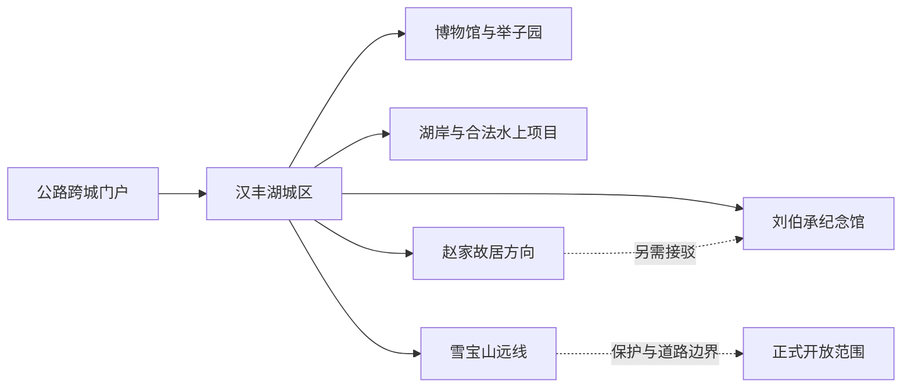
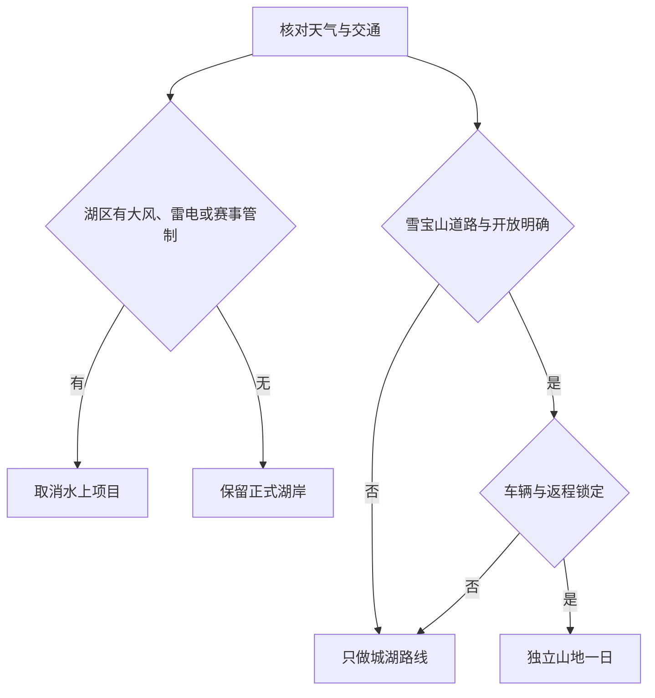

# 开州旅行指南

开州是重庆市辖区，不是法定城市。它的旅行核心围绕汉丰湖展开：湖岸串起开州博物馆、举子园、刘伯承同志纪念馆、开州故城与城市住宿，赵家街道的刘伯承同志故居需要单独接驳，东北部雪宝山又是距离城区很远、保护边界严格的山地远线。因此，开州不适合被写成“重庆主城顺路一站”，也不能把整个雪宝山自然保护区当作景区；最稳妥的安排是用一至两天完成城湖文博，再在道路、天气和正式开放范围明确时追加一条远郊线。

> 建议停留：汉丰湖城区 1–2 天；刘伯承故居另留半日至一日；雪宝山方向至少另留完整一日并优先考虑当地住宿 
> 旅行关键词：汉丰湖、三峡移民新城、开州博物馆、举子文化、刘伯承、雪宝山与崖柏保护 
> 主要体力：环湖城区低至中等；纪念馆与故居中等；雪宝山长车程、高海拔和山地步行为中高至高 
> 最近研究：2026-08-12

## 城市速览

| 项目 | 旅行信息 |
|---|---|
| 主要旅行价值 | 在汉丰湖理解三峡工程、水位调节与移民新城形成的城湖关系，以博物馆、举子园和开州故城阅读地方历史与教育传统，再通过刘伯承纪念馆、故居建立红色人物史框架；雪宝山则呈现大巴山森林、亚高山草甸和崖柏保护主题 |
| 建议停留 | 1 天完成汉丰湖文化环线的精选节点；2 天加入刘伯承纪念馆与故居；3 天以上才考虑雪宝山。湖区水上项目、故居和雪宝山不宜压成同一天 |
| 较舒适季节 | 春秋通常适合环湖步行和文博；冬季候鸟观察需遵守湿地边界；夏季山区可避暑，但强降雨、雷暴、山洪、塌方和高温都会改变路线 |
| 预算特点 | 城区公共场馆、环湖公园和日常餐饮较易控制；水上项目、演艺、雪宝山车辆、乡镇住宿和跨城公路交通是主要变量 |
| 步行强度 | 博物馆和湖岸短段为低至中等；举子园、故城与纪念馆包含园林、坡道和站立；雪宝山方向以长车程、山路和高海拔户外为主 |
| 主要天气风险 | 汛期暴雨、雷电、短时大风、山洪、滑坡、崩塌和临水风险；雪宝山另有浓雾、低温、森林火险和冬季道路结冰 |
| 独行旅行 | 城区住宿、公交、叫车和一人餐饮可组合；刘伯承故居与雪宝山返程、最后一段车辆、通信和夜间服务必须提前锁定 |
| 亲子旅行 | 博物馆、举子园和湖岸湿地教育可按注意力组合；水上运动、游船、临水岸线和山地活动有年龄、身高、救生与天气规则 |
| 长者与低体力旅行 | 优先“一馆 + 车辆移动 + 湖岸一小段”；不要用环湖距离、观光车或景区宣传推定全程无台阶、无长坡 |
| 无障碍信息 | 较新公共场馆和城区酒店可优先询问无障碍设施；历史园林、码头、湖岸、故居和雪宝山连续无障碍资料不足，须逐段确认 |

## 城市格局与游览区域

开州区法定行政代码为 `500154`。GeoNames `1808950` 是 `Hanfeng`（汉丰）的 `PPLA3` 居民点，历史别名包含开县与汉丰，适合定位开州旧行政驻地和主要旅行门户，但不是现行开州区行政面的直接编号。Wikidata `Q1371311` 表达法定开州区，其 `P1566=1804855` 指向 GeoNames 的行政区记录。三者分工不同：`1808950` 定位汉丰主城，`Q1371311`、`500154` 与行政记录 `1804855` 确定现行区界，不能互换。

| 区域 | 主要内容 | 游览特点 | 与其他区域的关系 |
|---|---|---|---|
| 汉丰—文峰—云枫环湖城区 | 汉丰湖、开州博物馆、举子园、开州故城、纪念馆、住宿与餐饮 | 城湖相邻但湖岸周长大，桥梁、园区入口和水上码头会拉长实际移动 | 适合作为连续住宿底盘；不需每天换酒店，但不能默认所有点都可步行串联 |
| 盛山—纪念馆方向 | 刘伯承同志纪念馆、盛山公园及当期开放公共文化空间 | 纪念馆与周边公园可组合，团队活动和纪念日可能影响开放 | 可接博物馆或湖岸，但需要预留馆内完整参观时间 |
| 赵家—浦里方向 | 刘伯承同志故居、乡村和正式公共服务节点 | 与城区纪念馆不是同址，需地面交通；故居、村落与农田边界不同 | 单独半日至一日；不把“纪念馆及故居”理解为一个步行园区 |
| 汉丰湖水域与湿地 | 正式湖岸、湿地公园、合法游船和水上运动经营单元 | 水位、风力、水质、赛事、禁渔禁钓与救生要求共同决定可用范围 | 与城区文化线同处环湖，但水上项目不能作为必然开放节点 |
| 雪宝山—满月—大进北部山地 | 正式开放的森林、乡镇服务和旅游项目；雪宝山自然保护区外围 | 距城区远，保护区、森林公园、乡镇和道路不是同一边界；山地天气变化快 | 独立远郊一日至两日，不与汉丰湖全天线硬拼 |
| 温泉、临江及其他乡镇 | 盐业、古镇、乡村和当期合法开放项目 | 公路纵深大，活动和营业受季节影响，普通生产生活空间不等于景区 | 仅在具体项目、车辆与返程明确时安排，不为“全域游”强行串镇 |

汉丰湖是三峡工程与水位调节共同塑造的城市湖泊，也是国家湿地公园、水利风景与公共生活空间。湖岸可游览不等于全部水域可游泳、垂钓、下水或停船；游船、水上运动、观光车和夜游均是有独立经营、票务、气象与救生条件的动态产品。雪宝山国家级自然保护区核心区禁止普通进入，缓冲区禁止旅游和生产经营，实验区的参观旅游也必须依管理方案开展；“雪宝山旅游”只能承接正式公布的游客入口、道路和经营项目。

## 主要景点

优先级用于安排时间：**A** 为首访核心，**B** 为按兴趣补充，**C** 为远郊、季节性或需要额外交通条件的目的地。同一湖区经营单元、园区内部建筑群或保护地公开单元只按一个目的地记录。

### 汉丰湖城区与文化场馆

| 景点 | 区域 | 类型 | 主要看点 | 建议用时 | 室内外 | 体力 | 预约风险 | 天气影响 | 优先级 |
|---|---|---|---|---:|---|---|---|---|---|
| 汉丰湖国家湿地公园与正式湖岸 | 环湖城区 | 城市湖泊、国家湿地公园、4A 景区 | 城湖关系、湿地生态、候鸟与正式公共岸线；水域、消落带和运营项目分别管理 | 3–6 小时，可分段 | 室外 | 低至中 | 中 | 高 | A |
| 开州博物馆 | 汉丰街道滨湖中路 | 地方综合博物馆 | 开州历史遗存、移民与地方文化文物，是理解后续湖区和古城叙事的基础 | 2–3 小时 | 室内 | 低 | 中至高 | 低 | A |
| 开州举子园 | 文峰半岛 | 科举与儒学文化主题园 | 文庙、考院、盛山书院、文峰塔和园林共同构成一个文化园区 | 2.5–4 小时 | 混合 | 中 | 高 | 中至高 | A |
| 刘伯承同志纪念馆 | 汉丰街道盛山公园 | 人物纪念馆、红色教育基地 | 刘伯承生平、军事与革命历史展线；兵器园、广场与主馆按一体安排 | 2.5–4 小时 | 混合 | 中 | 高 | 中 | A |
| 开州故城 | 汉丰湖畔 | 移民文化与城市记忆街区 | 老城记忆、移民叙事、公开街巷与当期演艺；商业、演出和码头各有规则 | 2–4 小时 | 混合 | 低至中 | 高 | 中至高 | B |
| 汉丰湖合法水上运动或游船单元 | 正式码头与水上运动中心 | 水上休闲、观光与运动 | 只选择有经营主体、票务、救生装备和当日公告的项目；全部项目合计为一个可选单元 | 1–3 小时 | 室外 | 中 | 很高 | 很高 | B |

### 红色故居、园林与北部山地

| 景点 | 区域 | 类型 | 主要看点 | 建议用时 | 室内外 | 体力 | 预约风险 | 天气影响 | 优先级 |
|---|---|---|---|---:|---|---|---|---|---|
| 刘伯承同志故居 | 赵家街道周都村 | 全国重点文物保护单位、名人故居、4A 景区组成 | 出生居所、乡村环境与人物早年生活；与城区纪念馆分址 | 4–6 小时，含往返 | 混合 | 中 | 高 | 高 | A |
| 盛山植物园公开游览区 | 城区盛山方向 | 城市园林、季节植物与公共休闲 | 正式开放园路、季节花木和城市山体；活动与展区以当期公告为准 | 2–3 小时 | 室外为主 | 中 | 中 | 高 | B |
| 雪宝山正式开放旅游单元 | 雪宝山镇及管理方公布入口 | 大巴山森林、草甸与自然教育 | 正式道路和公开服务范围内的高山景观；自然保护区核心、缓冲及科研空间不属于普通游线 | 8–12 小时，宜留宿 | 室外 | 中高至高 | 很高 | 很高 | B |
| 温泉古镇或盐业文化当期开放单元 | 温泉镇方向 | 历史聚落、盐业文化与乡镇生活 | 只承接正式开放街巷、场馆和活动，不把普通居民区与生产设施列为景点 | 5–8 小时，含往返 | 混合 | 中 | 高 | 高 | C |

汉丰湖、开州故城和举子园空间接近，但不是一张票、一个开放日历或一套演艺时段。刘伯承纪念馆与故居也不能只因名称并列就按步行连续处理。雪宝山有国家级自然保护区、森林公园、乡镇和旅游规划等多重空间，本页不列“无人区探险”、野生崖柏寻找、未开放草甸穿越或保护区自驾为旅行项目。

## 美食与餐饮

开州餐饮延续川渝麻辣与蒸煮传统，地方线索集中在开州十大碗、大混蒸、包面、香肠腊肉、紫水豆干、冰薄月饼、南门红糖和春橙。汉丰湖城区适合一人用餐与比较价格；乡镇宴席和山地餐饮需把营业日、份量、交通与返程一起核对。

| 菜品或餐饮类型 | 常见区域 | 一个人用餐与常见份量 | 风味、过敏原与饮食限制 | 排队风险与替代方法 |
|---|---|---|---|---|
| 开州包面 | 汉丰湖城区早餐与小吃店 | 一人一碗，可先点小份 | 小麦面皮、猪肉或其他肉馅、汤底、芝麻和辣椒常见；清汤不等于素食 | 早餐和夜宵高峰翻台快；在居民区选择馅料与价格清楚的同类店 |
| 开州十大碗 | 城区宴席、乡镇节庆和正规地方菜馆 | 传统上适合多人，独行不建议为“全套”点满 | 猪肉、禽肉、蛋、动物油、酒料与多道共用汤汁常见 | 节庆与团队宴席需预约；人数少时按代表菜点单或改家常菜 |
| 临江大混蒸等蒸菜 | 临江及城区地方菜馆 | 多为多人共享，可询问小笼、小份或单品 | 肉类、糯米或淀粉、酱油、豆豉、辣椒与共蒸交叉接触常见 | 热门时段等待蒸制；改选能说明原料、份量与出餐时间的同类餐馆 |
| 开州香肠与腊肉 | 城区、乡镇和正规特产渠道 | 餐馆多作合菜，包装产品适合少量购买 | 多为猪肉，盐、糖、酒料、辣椒和亚硝酸盐相关保存工艺需留意 | 年节前需求高；选择生产者、配料、日期和冷藏条件清楚的产品 |
| 紫水豆干与豆制品 | 紫水方向、城区小吃和商超 | 小包装适合分享，豆花饭可一人用餐 | 含大豆，调味可能含小麦、芝麻、花生和辣椒；素食者仍需确认汤汁 | 不为单一门店绕远；正规商超或固定店可替代临时摊点 |
| 冰薄月饼、南门红糖与地方糕点 | 城区特产店与节庆活动 | 小包装适合尝试，不以“特产”代替正餐 | 小麦、糖、油、芝麻、花生、坚果和乳制品可能存在 | 节庆排队时改选标签完整产品；购买前看保质期和运输储存条件 |
| 开州春橙与季节水果 | 城区市场、正规果园销售点 | 一人容易购买，先少量尝味 | 柑橘酸度与糖分需按健康条件控制；采摘园不等于任意进入果园 | 产季和品质波动；选择明码标价、可说明产地和采摘规则的渠道 |
| 火锅、烤鱼与重庆常见餐饮 | 汉丰湖城区成熟商圈 | 独行可选小锅、冒菜、小面或单份鱼；烤鱼通常适合多人 | 牛油、鱼、内脏、小麦、大豆、芝麻、花生和共锅常见 | 避开湖区活动散场高峰，按份量、锅底和最低消费就近替代 |

汉丰湖是湿地与重要水域，游客不能把自行捕捞、禁钓区垂钓或来源不明野生鱼作为“本地体验”。严格素食、清真、低钠、不能摄入酒料或严重过敏者，应在城区选择能逐项说明原料和锅具的餐馆，并把需求书面化。

## 经典行程

开州路线的第一道判断不是“是否有车”，而是湖区风浪与活动公告、山地道路和保护地边界是否允许。若西渝高铁或开州站仍处于建设阶段，只能把它视为规划与施工背景，不得写进当天到达步骤。

### 一日经典路线

**路线**：开州博物馆 → 午餐与坐休 → 刘伯承同志纪念馆 → 汉丰湖一段正式公共岸线或开州故城短段 → 原住宿地

- **适用条件**：两馆正常开放，环湖道路无赛事或严重天气管制；晚到时只保留一馆。
- **串联逻辑**：先用地方博物馆建立开州历史与移民背景，再进入人物馆，最后用短湖岸把历史叙事落回当代城湖空间。
- **预约锚点**：开州博物馆公众号预约、纪念馆开放和实名或团队规则；湖岸短段不替代场馆预约。
- **休息安排**：午餐留完整坐休；纪念馆后只选择有照明、护栏和明确出口的一段湖岸。
- **时间不足时**：先删故城或湖岸延伸，再在两馆中按兴趣保留一个；不追加故居或雪宝山入口。

### 两日城市路线

**第 1 天**：开州博物馆 → 举子园 → 午休 → 开州故城或汉丰湖公开岸线 
**第 2 天**：刘伯承同志纪念馆 → 午餐与坐休 → 赵家街道刘伯承同志故居 → 城区住宿

- **适用条件**：举子园、两馆与故居均正常开放，第二天已锁定城区—赵家的车辆和返程；水上项目仅作可删选项。
- **串联逻辑**：第一天处理地方史、科举教育与移民城湖，第二天把纪念馆和故居按人物生平串联，但承认两者分址、需公路接驳。
- **预约锚点**：博物馆、纪念馆、故居与举子园的开放和实名规则；第二天车辆早于任何演艺或夜游安排。
- **休息安排**：两天午间都长休；故居只走公开展区和村内正式通道，不借道农田缩短路线。
- **时间不足时**：第一天删故城，第二天整段删除故居只留纪念馆；不以晚归换取“两个馆都到门口”。

### 三日深度路线

**第 1 天**：博物馆—举子园—汉丰湖文化线 
**第 2 天**：刘伯承纪念馆—故居红色人物线 
**第 3 天**：城区 → 雪宝山镇方向正式游客入口或公开服务单元 → 原路返程或已确认山地住宿

- **适用条件**：第三天山地道路、天气、管理方开放、正规车辆、住宿和返程全部明确；自然保护区核心与缓冲区不进入。
- **串联逻辑**：三天分别处理城湖历史、人物史和大巴山自然保护，用独立一日避免把雪宝山变成环湖路线的“下午加点”。
- **预约锚点**：第三天正式入口、车辆、住宿、森林防火和退改为最高优先；前两天场馆时段其次。
- **休息安排**：山地日每到公开服务点即补水和坐休，司机返程前留完整休息；不在无服务林道停留到天黑。
- **时间不足时**：整段删除第三天；若山地取消，改为城区第二场馆和湖岸短段，不临时寻找未经核验的“替代秘境”。

### 雨天路线

**路线**：开州博物馆核心展厅 → 室内午餐与长休 → 刘伯承同志纪念馆核心展线 → 原住宿地

- **适用条件**：仅适用于普通降雨且城区道路、两馆正常；暴雨、雷电、积水或地灾预警时只留离住宿最近的一馆。
- **串联逻辑**：用两座室内公共场馆替代湖岸、水上项目、故居乡村道路与雪宝山，换点前再次查看交通公告。
- **预约锚点**：闭馆日、团队活动、实名、最晚入馆与临展；不要依赖旧的一日游时刻。
- **休息安排**：在馆内固定座椅和正规室内餐饮区休息，车辆点到点移动。
- **时间不足时**：只保留博物馆或纪念馆；不为夜游、候鸟或湖面照片进入风雨岸线。

### 亲子或低体力路线

**亲子路线**：开州博物馆精选展厅 → 午餐与午休 → 举子园一段适龄文化体验或汉丰湖湿地教育短段 → 返回住宿 
**低体力路线**：车辆直达开州博物馆最近落客点 → 核心展厅 → 完整坐休 → 车辆到刘伯承同志纪念馆核心展线 → 返回住宿

- **适用条件**：亲子路线按活动年龄、婴儿车、水边看护和天气删减；低体力路线先确认两馆落客点、电梯、轮椅、座椅和卫生间。
- **串联逻辑**：亲子保留一个可动可静的文化补充，低体力只在两座可控场馆间用车辆移动；不把两类需求压成同一条路线。
- **预约锚点**：博物馆预约、举子园活动名额、儿童证件和推车规则，以及纪念馆无障碍入口与陪同服务。
- **休息安排**：每个主题后坐休，午间不压缩；感官过载、疲劳或天气变化时直接返回。
- **时间不足时**：亲子只留博物馆，低体力只留一馆；不转故居、水上项目或雪宝山补点。

### 远郊一日路线

**红色故居路线**：城区 → 刘伯承同志故居 → 正规乡镇午餐与坐休 → 原路返程 
**山地路线**：雪宝山方向住宿地或清晨城区出发 → 正式开放游客单元 → 原入口返回

- **适用条件**：两条路线只选一条；故居需场馆与车辆正常，雪宝山需天气、道路、保护管理、森林防火和返程全部明确。
- **串联逻辑**：故居线以人物早年生活为单一主题；山地线只在批准的公开单元体验森林与大巴山景观，不追逐无人区和崖柏原生群落。
- **预约锚点**：故居开放与讲解、或雪宝山入口、车辆、住宿、道路和管理公告；临时活动不得替代返程确认。
- **休息安排**：故居线在乡镇正规餐饮坐休；山地线只用正式服务点，司机返程前长休。
- **时间不足时**：故居只保留核心展区；雪宝山整段删除而不是缩成入口拍照夜返，改走城区湖岸或博物馆。

## 住宿区域

| 区域 | 优点 | 缺点 | 适合人群 | 交通特点 |
|---|---|---|---|---|
| 汉丰—文峰—云枫环湖城区 | 餐饮、酒店、医院、叫车和主要文博最集中，可连续住宿 | 湖岸跨度大，酒店名含“湖景”不代表靠近目标码头或场馆 | 首访、独行、家庭、雨天和多日停留者 | 公交、出租车、网约车与分段步行组合 |
| 博物馆—故城—举子园方向 | 便于城湖文化线和夜间公共空间 | 活动、演艺和临湖客流可能带来噪声；去纪念馆仍需移动 | 重视湖景、文化园区与慢游者 | 订房前定位实际入口、桥梁和落客点，不只看直线距离 |
| 盛山—纪念馆方向 | 方便人物馆和城市公园，较易安排半日 | 与举子园、故城和跨城客运节点不一定步行连续 | 红色文化专题、低体力且愿意叫车者 | 以地面交通连接湖区其他片区 |
| 赵家或浦里正规住宿 | 可减少故居或次日公路接驳 | 夜间餐饮、医疗、叫车与退改少于城区 | 已锁定故居和后续车辆、愿意单点留宿者 | 不默认能临时前往雪宝山或跨城枢纽 |
| 雪宝山镇及北部山地正规住宿 | 降低清晨长途与夜间返城压力，适合山地慢游 | 服务季节性强，医疗、通信、餐饮和道路容错低 | 已确认开放、车辆和天气的山地专题者 | 订房前确认到正式游客入口的实际车程、接送、晚餐和退改 |

需要无障碍客房、电梯、儿童床、安静房、夜间入住或车辆到门时，应直接向住宿方确认从落客点到客房、餐厅和卫生间的连续路线。“临湖”“雪宝山”“高铁新区”等名称可能是营销或规划方位，不能证明紧邻目标入口或已有铁路客运。

## 市内交通

截至 2026 年 8 月，西渝高铁在开州仍有建设和线路迁改项目，不能把规划中的开州站、竹溪枢纽或未来接驳写成已售票服务。执行行程时，先用 12306 确认实际到达万州、达州或其他可售票站点，再用当期公路客运、合规网约车或包车进入开州；机场同样以万州、达州等实际航班与地面接驳为准。

| 场景或枢纽 | 建议与取舍 | 行前需要重查的内容 |
|---|---|---|
| 重庆中心城区—开州 | 公路客运、自驾或组合铁路至周边枢纽后再转公路；总时间按实际出发点估算 | 客运站、班次、道路施工、服务区、退改与夜间到店 |
| 万州北站或万州五桥机场—开州 | 可作为常见区域门户，但并非开州本地车站或机场，仍有跨区公路段 | 实际车次航班、合法接驳、上客点、行李、末班与返程 |
| 达州方向—开州 | 适合部分川东北来源地，是否优于万州取决于票面和公路情况 | 车次、机场、城际或班线客运、跨省道路与夜间运力 |
| 汉丰湖城区移动 | 公交、出租车、网约车和分段步行组合，湖岸长、跨桥和入口位置要单独计算 | 线路调整、赛事封路、演艺散场、叫车点和无障碍车辆 |
| 城区—刘伯承同志故居 | 以正式场馆地址为终点，选择公交、正规客运、合规包车或自驾 | 开放、道路、停车、最后一段步行、返程和最晚入馆 |
| 城区—雪宝山方向 | 作为独立远郊，优先正规车辆或自驾；不依赖临时拼车和夜返 | 环线排危、强降雨、雾、结冰、防火、通信、停车和住宿 |
| 汉丰湖游船与水上项目 | 只使用合法码头和有救生、票务、天气公告的经营项目 | 风力、雷电、水位、水质、赛事、年龄健康限制与停航 |
| 自驾 | 对家庭与远线较灵活，但长山路、临水临崖和司机疲劳是硬边界 | 驾照租车、保险、停车、充电加油、道路预警与夜间驾驶 |

规划中的高铁、旅游公路、环湖项目和观光产品只有在主管部门或运营方明确投运后才可进入行程。地图显示道路贯通，也不能证明雪宝山保护区可穿越、乡镇客运当天运行或水上码头对散客开放。

## 不同旅行者须知

| 旅行维度 | 可行条件 | 主要取舍 | 需额外核对 |
|---|---|---|---|
| 独行旅行 | 城区场馆、住宿和一人餐饮较容易组合 | 跨城公路、故居和雪宝山返程容错低 | 正规车辆、末班、离线地图、住宿前台与紧急联系人 |
| 亲子旅行 | 博物馆、举子园和湿地教育可组成短线 | 湖岸、水上项目、拥挤活动和山地需要持续看护 | 年龄身高、救生装备、儿童票、推车、卫生间与紧急出口 |
| 长者或低体力旅行 | 一馆半日、车辆移动和短湖岸可行 | 园林坡道、环湖距离、故居乡道与山地长车程增加负担 | 落客点、轮椅、电梯、座椅、卫生间、陪同和医疗点 |
| 无障碍需求 | 优先较新场馆、城区酒店与预约车辆 | 历史园林、码头、湖岸、故居和雪宝山可能中断连续通行 | 从停车、检票、展厅、景交到卫生间的全程确认 |
| 摄影旅行 | 湖城日夜、候鸟、人物建筑和大巴山题材差异明显 | 候鸟、雾和日落不保证出现，追机位增加临水与夜路风险 | 无人机空域、馆内禁拍、保护区、三脚架、商业拍摄和设备防潮 |
| 预算有限 | 住城区、保留公共场馆和湖岸短段最可控 | 跨城接驳、水上项目和雪宝山车辆难同时压缩 | 免费预约、优惠资格、交通分段、退改和发票 |
| 晚出发或紧凑行程 | 只保留仍有完整时段的一馆或一段正式湖岸 | 故居、雪宝山和水上项目都不适合作为晚到补点 | 最晚入馆、照明、天气、末班和入住时间 |
| 暴雨、雷电或冬季旅行 | 普通降雨改室内；山地只在道路和开放明确时进入 | 水上停航、塌方、山洪、浓雾、结冰和低温可使整线失效 | 气象、交通、地灾、林业、景区与保险退改公告 |
| 湿地与自然保护地 | 只走正式岸线、合法码头和批准的公开游线 | 禁钓区、鸟类栖息地、保护区核心缓冲区和科研空间不开放 | 围栏、分区、观鸟距离、防火、项目许可与临时封闭 |
| 严格饮食限制 | 城区正规餐馆较易说明原料，可携带书面需求 | 十大碗、混蒸、包面、腊味和豆制品的共锅与复合调味常见 | 小麦、大豆、花生、芝麻、动物油、酒料和交叉接触 |

## 行前核对

| 核对事项 | 为什么需要重查 | 建议核对时间 | 官方入口 |
|---|---|---|---|
| 开州博物馆开放与预约 | 周一、法定节假日、团队活动、放号和最晚入馆会变化 | 排路线时、前一日及当天 | [开州区博物馆官方信息](https://www.cqkz.gov.cn/zwgk_238/zfxxgkml/ggqsydwxxgk/whly/202411/t20241125_13828023.html) |
| 举子园、开州故城与演艺 | 园区、商业、演出、码头和夜游不是同一开放日历 | 购票前、前一日及当天 | [开州区文旅委一日游信息](https://www.cqkz.gov.cn/kz/fzhggwyh_80934/zwxx/dt/202507/t20250731_14862576.html) |
| 刘伯承纪念馆与故居 | 两处相距较远，开放、预约、讲解与团队规则可能不同 | 排路线时、前一日及当天 | [开州区人民政府](https://www.cqkz.gov.cn/)；场馆当期官方公告 |
| 汉丰湖水上项目、游船与观光车 | 风力、雷电、水位、赛事、经营和救生条件会改变运营 | 付款前、前一日及登乘当天 | [汉丰湖旅游度假区信息](https://www.cqkz.gov.cn/kz/fzhggwyh_80934/zwxx/dt/202403/t20240301_12980405.html) |
| 汉丰湖湿地、禁钓与候鸟边界 | 公共岸线不等于水域可自由进入，季节栖息与管理范围变化 | 观鸟、垂钓或水上活动前 | [汉丰湖垂钓管理通告](https://www.cqkz.gov.cn/kz/fzhggwyh_80768/zwgk_72016/zfxxgkml/zcwj/fzxzgfxwj/202402/t20240204_12902318.html) |
| 雪宝山道路、开放与住宿 | 远线长、道路仍可能排危施工，山地服务和返程受季节影响 | 订车订房前、前三日及当天 | [雪宝山镇 2026 年简介](https://www.cqkz.gov.cn/qzfjz_238/hfjdbsc_81655/zwgk_73112/fdzdgknr_73114/jgjj_73117/zjjj_73118/202605/t20260514_15676180.html) |
| 雪宝山保护区边界 | 核心区、缓冲区与实验区规则不同，旅游需按管理方案 | 排路线时及进入前 | [开州区自然保护地管理办法](https://www.cqkz.gov.cn/zwgk_238/zfxxgkml/zcwj/fzhsxwj/202211/t20221115_11302250.html) |
| 西渝高铁与跨城交通 | 在建线路、规划车站和未来接驳不能替代当前票面 | 购票时、前一日及当天 | [中国铁路 12306](https://www.12306.cn/)；[开州区政府：西渝高铁开州段 2026 年复工进展](https://www.cqkz.gov.cn/kz/fzhggwyh_2/zwxx/dt/202603/t20260302_15479286.html) |
| 暴雨、雷电、地灾与道路 | 山地和临水临崖路段在雨停后仍可能管制 | 出发前三日起每日核对，当天再查 | [重庆市气象局](http://cq.cma.gov.cn/)；[开州区政府预警信息](https://www.cqkz.gov.cn/kz/fzhggwyh_80662/zwgk_72016/fdzdgknr/yjgl/yjxx/) |
| 无障碍连续路线 | 单点电梯、观光车或优惠不能证明全程可达 | 订票、订房和订交通前逐点联系 | 车站、场馆、景区、住宿官方客服及 12306 重点旅客服务 |
| 入境、实名与证件规则 | 国际旅行者和实名票务会随证件、口岸与活动变化 | 订票前及出发前一周 | [国家移民管理局](https://www.nia.gov.cn/)；承运人和场馆官方 |

## 来源与更新记录

### 主要来源

| 来源 | 类型 | 支持内容 | 核验日期 |
|---|---|---|---|
| [重庆市民政局：2025 年 12 月行政区划及代码](https://mzj.cq.gov.cn/zwgk_218/zfxxgkml/tzgg/202601/t20260119_15332641.html) | 市民政部门 | 开州区法定层级、现行名称与行政代码 `500154` | 2026-08-12 |
| [开州区文化和旅游发展“十四五”规划](https://www.cqkz.gov.cn/zwgk_238/zfxxgkml/zdjcygk/jcjg/202212/t20221219_11402317.html) | 区政府规划 | 汉丰湖、红色旅游、湿地、举子文化、雪宝山与乡村旅游的功能关系；规划不等于常态开放 | 2026-08-12 |
| [开州区政府：汉丰湖旅游度假区](https://www.cqkz.gov.cn/kz/fzhggwyh_80934/zwxx/dt/202403/t20240301_12980405.html) | 区政府文旅信息 | 湖区内纪念馆、博物馆、举子园、故城、水上与夜间产品的空间关系 | 2026-08-12 |
| [开州区政府：开州博物馆](https://www.cqkz.gov.cn/zwgk_238/zfxxgkml/ggqsydwxxgk/whly/202411/t20241125_13828023.html) | 公共场馆 | 场馆职责、地址、开放时间和联系入口 | 2026-08-12 |
| [开州区文旅委：汉丰湖文化一日路线](https://www.cqkz.gov.cn/kz/fzhggwyh_80934/zwxx/dt/202507/t20250731_14862576.html) | 区文旅部门 | 举子园、博物馆、纪念馆、故城和湖区的实际旅行关系；动态时间需重查 | 2026-08-12 |
| [开州区政府：刘伯承纪念馆与故居三日游资料](https://www.cqkz.gov.cn/kz/fzhggwyh_80934/zwxx/dt/202504/t20250429_14570576.html) | 区政府文旅信息 | 纪念馆、故居、博物馆、举子园和汉丰湖的分址与旅行主题 | 2026-08-12 |
| [重庆市民政局：刘伯承同志纪念馆](https://mzj.cq.gov.cn/sy_218/bmdt/mzyw/202409/t20240912_13618993.html) | 市民政部门、地名文化 | 纪念馆位于汉丰街道盛山公园及其人物纪念属性 | 2026-08-12 |
| [重庆市政府：汉丰湖湿地公园](https://www.cq.gov.cn/zjcq/cycq/jplyxl/mbsdyzrxy/2026nzqsdgyml/202606/t20260604_15727864.html) | 市政府湿地名录 | 汉丰湖国家湿地公园身份与湿地生态主题 | 2026-08-12 |
| [开州区政府：汉丰湖垂钓管理通告](https://www.cqkz.gov.cn/kz/fzhggwyh_80768/zwgk_72016/zfxxgkml/zcwj/fzxzgfxwj/202402/t20240204_12902318.html) | 多部门规范性通告 | 禁钓区、水资源与湿地保护边界 | 2026-08-12 |
| [重庆市政府：雪宝山国家级自然保护区](https://www.cq.gov.cn/zjcq/lszq/stpz/gjjzrbhq/202606/t20260603_15725731.html) | 市政府、保护地资料 | 保护区位置、森林生态、亚高山草甸、崖柏与生物多样性 | 2026-08-12 |
| [开州区自然保护地管理办法](https://www.cqkz.gov.cn/zwgk_238/zfxxgkml/zcwj/fzhsxwj/202211/t20221115_11302250.html) | 区政府管理制度 | 核心区、缓冲区、实验区进入与旅游边界 | 2026-08-12 |
| [雪宝山镇 2026 年简介](https://www.cqkz.gov.cn/qzfjz_238/hfjdbsc_81655/zwgk_73112/fdzdgknr_73114/jgjj_73117/zjjj_73118/202605/t20260514_15676180.html) | 镇政府 | 雪宝山镇公路、森林公园、自然保护区、民宿与正式旅游服务背景 | 2026-08-12 |
| [开州区综合交通运输“十四五”规划](https://www.cqkz.gov.cn/zwgk_238/zfxxgkml/zcwj/qtwj/202205/t20220519_10735151.html) | 区政府交通规划 | 当前公路体系与未来高铁、枢纽和接驳规划；未来项目不当成现状 | 2026-08-12 |
| [开州区政府：西渝高铁开州段 2026 年复工进展](https://www.cqkz.gov.cn/kz/fzhggwyh_2/zwxx/dt/202603/t20260302_15479286.html) | 区政府建设动态 | 2026 年开州段仍处施工阶段，规划车站尚不能作为已售票抵达点 | 2026-08-12 |
| [开州区政府：2026 年雪宝山环线排危项目](https://www.cqkz.gov.cn/kz/fzhggwyh_740181/zwgk_72016/jczwgk_1/xmqd/202605/t20260512_15671037.html) | 区政府项目清单 | 雪宝山道路排危施工与行前重查必要性 | 2026-08-12 |
| [开州区政府：2026 年公路防汛保畅演练](https://www.cqkz.gov.cn/zwxx_238/zwdt/202607/t20260702_15793098_wap.html) | 区交通与应急信息 | 强降雨可触发滑坡、断道、交通管制和边坡排危 | 2026-08-12 |
| [开州区政府：地方文旅产品](https://www.cqkz.gov.cn/kz/fzhggwyh_80934/zwxx/dt/202009/t20200908_7861451.html) | 区文旅信息 | 包面、十大碗、冰薄月饼、香肠、紫水豆干与地方物产线索 | 2026-08-12 |
| [GeoNames：Hanfeng](https://www.geonames.org/1808950/hanfeng.html) | 开放地名数据 | 固定居民点 `1808950`、汉丰名称、坐标与 `PPLA3` 类型 | 2026-08-12 |
| [Wikidata：开州区 Q1371311](https://www.wikidata.org/wiki/Q1371311) | 开放结构化数据 | 法定开州区、代码 `500154` 与 `P1566=1804855` 行政记录 | 2026-08-12 |

### 更新记录

| 日期 | 更新内容 |
|---|---|
| 2026-08-12 | 建立汉丰湖城区、刘伯承纪念馆—故居与雪宝山远线的独立旅行尺度；明确固定汉丰居民点、法定开州区及行政 GeoNames 记录的粒度差异，补充文博、饮食、六组路线、住宿、公路交通、湿地水域、自然保护地、山地道路、灾害和无障碍边界 |
