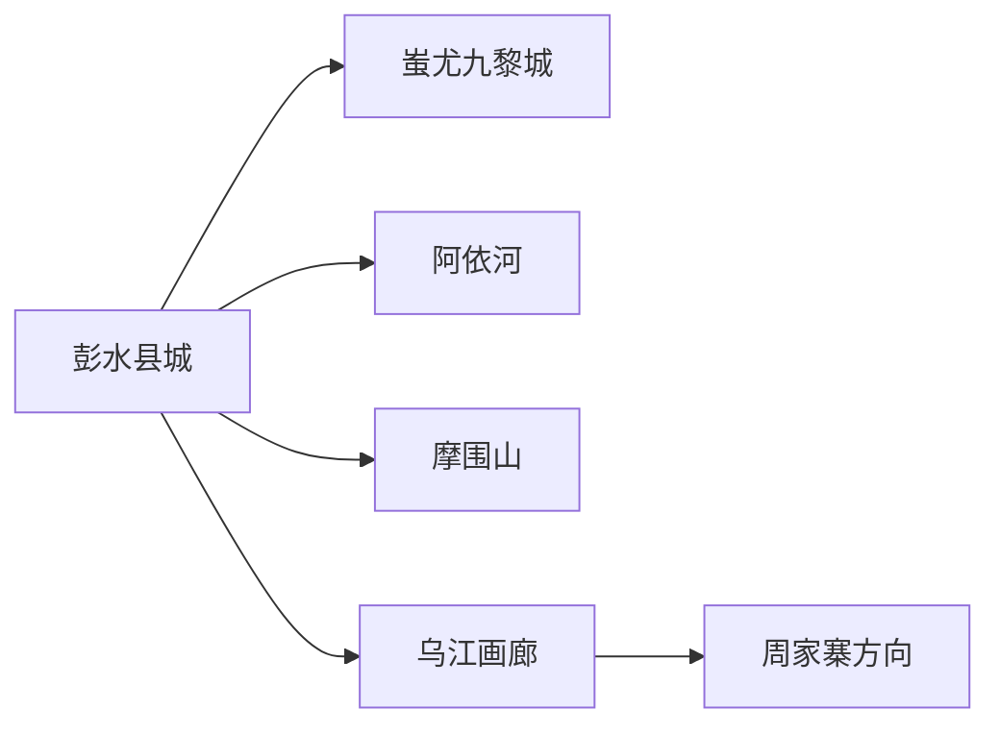
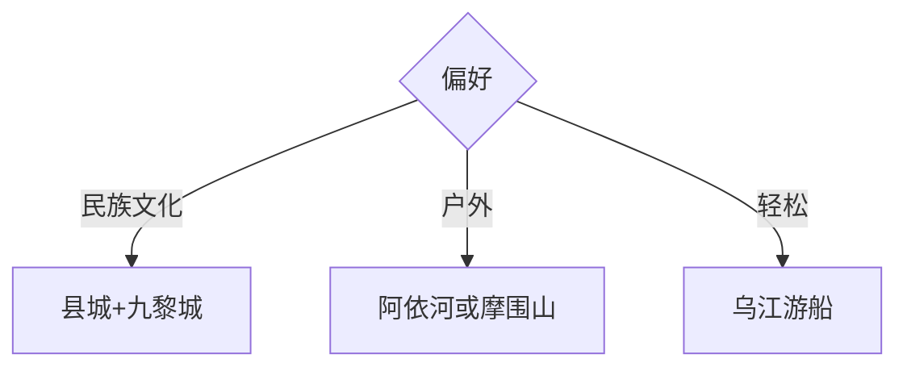

# 彭水旅行指南

彭水沿乌江河谷展开，县城与蚩尤九黎城构成文化入口，阿依河、摩围山、乌江画廊和周家寨分别代表漂流、森林康养、峡江与乡村方向。远点跨越山地公路，先选一条主线，再决定是否住宿转场。

## 城市速览

| 项目 | 信息 |
|---|---|
| 主线 | 县城九黎文化—阿依河—摩围山或乌江画廊 |
| 停留 | 县城1天；每条山水远线另留1天 |
| 住宿 | 县城交通便利；摩围山和乡村按季节选择 |
| 交通 | 渝厦高铁、县城接驳、景区专车与包车 |
| 风险 | 漂流安全、山洪、落石、雾天、冬季结冰与高差 |
| 边界 | 苗寨生活、河道、水库、森林保护和景区项目分别管理 |

## 城市格局与游览区域

县城是高铁、公路和住宿基地，九黎城靠近城市服务带；阿依河、摩围山和乌江水上线路需要分别核对入口。固定清单以高谷镇记录 **GeoNames 1810552** 建页并承接彭水县；Wikidata `Q1378017` 的 P1566 指向县级行政记录 `1798914`。

## 主要景点

| 景点 | 区域 | 类型 | 核心体验 | 用时 | 环境 | 体力 | 研究价值 | 拥挤 | 优先级 |
|---|---|---|---|---:|---|---|---|---|---|
| 蚩尤九黎城 | 县城近郊 | 民族文化景区 | 苗族建筑、非遗与演艺 | 4–6小时 | 混合 | 中 | 高 | 高 | A |
| 阿依河景区 | 绍庆方向 | 峡谷水域 | 峡谷步行、漂流与苗乡生态 | 1天 | 室外 | 高 | 高 | 高 | A |
| 摩围山景区 | 南部山地 | 森林康养 | 高山森林、避暑与观景 | 1天 | 室外 | 中高 | 中高 | 中 | A |
| 乌江画廊正规游船线 | 乌江 | 峡江水上 | 乌江峡谷与沿岸聚落 | 半日至1天 | 混合 | 低中 | 高 | 中 | B |
| 周家寨旅游区 | 善感方向 | 乡村山水 | 山水村寨与土家苗乡体验 | 1天含往返 | 室外 | 中 | 中 | 低 | B |
| 彭水县城公共文化场馆 | 县城 | 文博 | 盐丹文化、乌江与民族历史 | 2–3小时 | 室内 | 低 | 高 | 低 | B |

阿依河漂流、步道和观光交通按同一景区统筹；水量、年龄、健康和装备决定参与方式。民族村寨首先是居民生活空间，演艺与节庆按正式活动进入。

## 美食与餐饮

郁山擀酥饼、苗家酸汤、荞面、都卷子、土家腊肉和乌江鱼适合县城及正规餐馆体验。点鱼和腊味先确认重量、盐度与来源；说明辣度、发酵酸味、花生和共享锅具。

## 经典行程

### 两日基础线
**路线**：县城与九黎城—阿依河或摩围山。**逻辑**：文化日加一条山水线。**预约锚点**：高铁、景区和车辆。**休息**：县城午后。**删除条件**：恶劣天气时保留城市文化。

### 苗乡文化线
**路线**：县城场馆—蚩尤九黎城日场—夜间演艺。**逻辑**：先文博后情境体验。**预约锚点**：演出、节庆和返程。**休息**：景区室内段。**删除条件**：停演时改县城夜游。

### 阿依河户外线
**路线**：县城—阿依河—返程或附近住宿。**逻辑**：峡谷与漂流独占一天。**预约锚点**：水情、装备、年龄和车辆。**休息**：游客中心。**删除条件**：暴雨、停漂或身体条件不符时改观光段。

### 摩围山森林线
**路线**：县城—摩围山—山地住宿或返程。**逻辑**：用整日适应高差与山路。**预约锚点**：开放、住宿和雾雪。**休息**：山地服务区。**删除条件**：结冰、浓雾或道路管制时取消。

### 乌江画廊线
**路线**：县城—正规码头—游船—返程。**逻辑**：从水面理解乌江地理。**预约锚点**：船班、码头和水位。**休息**：船舱与码头。**删除条件**：停航时改县城文博。

### 周家寨乡村线
**路线**：县城—周家寨正式游线—返程。**逻辑**：以山水村寨和正规接待为核心。**预约锚点**：车辆、活动和餐饮。**休息**：乡村接待点。**删除条件**：山路预警或未确认接待时取消。

### 低体力线
**路线**：县城场馆—九黎城可落客区—乌江岸线。**逻辑**：减少峡谷和山地步行。**预约锚点**：电瓶车、座椅和无障碍。**休息**：午后酒店。**删除条件**：夜间演艺过晚时只留日场。

## 住宿区域

县城适合高铁、餐饮和多线换乘；九黎城附近适合演艺；摩围山适合避暑与清晨景色。确认景区接驳、山地供暖、停车、早餐、湿滑路面和退改政策。

## 市内交通

彭水站、县城、九黎城和各山地景区需要分段接驳。高铁到站后确认进入县城的交通，远线提前约正规车辆；漂流结束点、游船码头和出发入口可能不同，订票时核对回程。

## 不同旅行者须知

民族文化爱好者优先讲解与正式非遗活动；户外旅行者按水情和天气选择阿依河；长者与亲子用九黎城加游船；自驾者关注落石、雾和弯道；摄影者尊重居民、祭祀与演出规则。

## 行前核对

- 核对九黎城演艺、阿依河项目、摩围山道路和乌江船班。
- 核对高铁接驳、暴雨山洪、雾雪、年龄与健康要求。
- 河道、森林、村寨、水电设施和未开放山路按管理边界进入。

## 来源与更新记录

| 来源 | 支持内容 | 核验日期 |
|---|---|---|
| [重庆市民政局：彭水地名与文化](https://mzj.cq.gov.cn/sy_218/bmdt/mzyw/202410/t20241023_13729649.html) | 县域格局、苗族文化、九黎城与山水资源 | 2026-09-01 |
| [重庆市政府：彭水文旅发展](https://cq.gov.cn/zwgk/zfxxgkzl/fdzdgknr/zdmsxx/fp/fplyzyxxgk/202504/t20250422_14545408.html) | 阿依河、摩围山、乌江画廊与九黎城 | 2026-09-01 |
| [民政部行政区划代码查询](https://dmfw.mca.gov.cn/xzqh/getList?code=50&trimCode=true&maxLevel=3) | 彭水县行政层级与代码 | 2026-09-01 |
| [GeoNames 1810552](https://www.geonames.org/1810552/) | Gaogu 固定城市点 | 2026-09-01 |
| [Wikidata Q1378017](https://www.wikidata.org/wiki/Q1378017) | 彭水县实体与行政记录关系 | 2026-09-01 |

| 日期 | 更新 |
|---|---|
| 2026-09-01 | 首次完成彭水旅行研究；建立九黎文化、阿依河、摩围山与乌江路线 |
