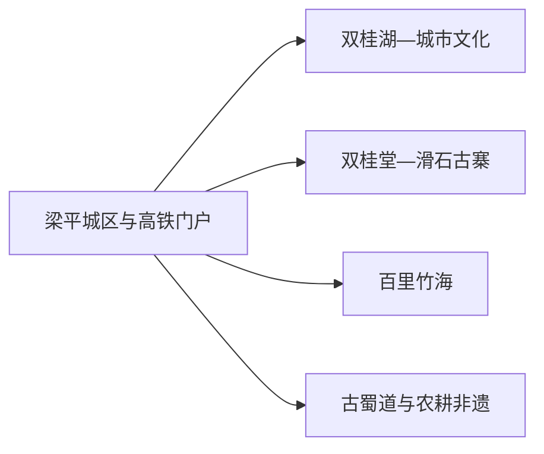
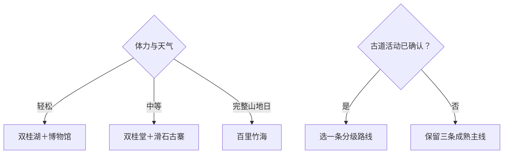

# 梁平旅行指南

梁平的旅行骨架很清楚：双桂湖与城区公共文化适合轻松到达，双桂堂—滑石古寨构成历史和山地组合，百里竹海则单独占据一整天。想走得从容，可以先住城区两晚，再在古寨、竹海、古蜀道或农耕非遗中选择一条远线。

> 建议停留：2–3 天；百里竹海或古蜀道各留完整一天 
> 旅行关键词：双桂湖、双桂堂、滑石古寨、百里竹海、梁平非遗、古蜀道 
> 主要体力：城区低；古寨、竹海和徒步中高 
> 最近研究：2026-08-13

## 城市速览

| 项目 | 旅行信息 |
|---|---|
| 主要旅行价值 | 在平坝湿地、禅宗建筑、古寨、竹海和五项国家级非遗之间形成层次鲜明的重庆郊区旅行 |
| 建议停留 | 1 天城区与双桂湖；2 天加入双桂堂—滑石古寨；3 天再走百里竹海 |
| 较舒适季节 | 春秋适合户外；夏季避暑但防强对流；冬季关注低温、雾和山路 |
| 预算特点 | 城区平实，远线车辆、景区项目和民宿是主要变量 |
| 步行强度 | 双桂湖可缩短，滑石古寨与竹海中高，古蜀道按线路分级 |
| 主要天气风险 | 暴雨、山洪、雷电、高温、大雾、山地滑坡和森林火险 |
| 独行旅行 | 城区与高铁接驳方便，远线先定返程 |
| 亲子旅行 | 湿地、非遗与入门古道可按活动年龄选择 |
| 长者与低体力旅行 | 以双桂湖短线、博物馆和双桂堂为主，古寨登高减量 |
| 无障碍信息 | 新场馆和城市公园可先询问；古建、古寨、竹海和古道设施连续性需向官方确认 |

## 城市格局与游览区域

梁平区是重庆市辖区，行政代码 `500155`，不计入项目法定城市清单，但其高铁门户、城区住宿和多个完整远线足以形成独立旅行尺度。固定 GeoNames `12489673` 是梁平城区驻地点；法定区实体 Wikidata `Q1362558` 当前以 `P1566=1803986` 连接另一条行政记录。页面以固定点定位主城，以法定区实体和代码确定边界。

| 区域 | 主要内容 | 游览特点 | 与其他区域的关系 |
|---|---|---|---|
| 梁平城区—双桂湖 | 区博物馆、双桂湖、都梁大剧院及城市服务 | 平缓、室内外可组合 | 适合作住宿和雨天底盘 |
| 金带方向 | 双桂堂、滑石古寨、双桂田园 | 历史、古建与登高组合 | 可安排完整一日，按体力删减 |
| 百里竹海方向 | 竹海、观音洞等正式运营单元 | 山地、森林和度假项目 | 单独一日，先选实际入口 |
| 古蜀道与古寨 | 当期公布的分级徒步线路 | 线路长度和路面差异大 | 按官方路线挑一条 |
| 农耕与非遗乡村 | 木版年画、竹帘、梁山灯戏等活动 | 以展演、工坊或正式活动进入 | 季节和接待决定行程 |

双桂湖是国家湿地公园，百里竹海包含森林、村落和经营项目，古蜀道也穿行于居民与山地环境。观鸟、徒步、采摘和非遗体验均从公开入口开始；湿地保育区、林业作业区、农田和无人机试飞等专业空间依管理规则使用。

## 主要景点

### 城区与湿地

| 景点 | 区域 | 类型 | 主要看点 | 建议用时 | 室内外 | 体力 | 预约风险 | 天气影响 | 优先级 |
|---|---|---|---|---:|---|---|---|---|---|
| 双桂湖国家湿地公园公开游线 | 城区 | 湿地、自然教育 | 城中湿地、观鸟平台和生态文化线路 | 2–4 小时 | 室外 | 低至中 | 中 | 高 | A |
| 梁平区博物馆 | 城区 | 地方文博、非遗 | 地方历史、非遗与当期展览 | 1.5–2.5 小时 | 室内 | 低 | 中 | 低 | A |
| 都梁大剧院及公共文化空间 | 双桂湖畔 | 演艺、公共文化 | 当期演出、文化馆与非遗活动 | 1–3 小时 | 室内为主 | 低 | 很高 | 低 | B |

### 古建、古寨与竹海

| 景点 | 区域 | 类型 | 主要看点 | 建议用时 | 室内外 | 体力 | 预约风险 | 天气影响 | 优先级 |
|---|---|---|---|---:|---|---|---|---|---|
| 双桂堂 | 金带街道 | 全国重点文保、寺院建筑 | 清代建筑格局、禅宗历史与石柱院落 | 2–3 小时 | 混合 | 低至中 | 高 | 中 | A |
| 滑石古寨景区 | 金带方向 | 古寨、登高、非遗展示 | 巨石古寨、山地视野与正式游乐项目 | 3–5 小时 | 室外为主 | 中高 | 高 | 很高 | A |
| 百里竹海旅游度假区公开单元 | 竹山等方向 | 竹海、森林、度假 | 竹林景观、正式步道及当期开放项目；内部节点合计一次 | 6–9 小时 | 室外为主 | 中高 | 很高 | 很高 | A |
| 双桂田园等正式农旅项目 | 金带方向 | 农耕、乡村 | 平坝农业、季节活动和公开接待 | 2–4 小时 | 混合 | 低至中 | 高 | 高 | B |
| 梁平古蜀道当期公布线路 | 区内多方向 | 历史道路、徒步 | 古道、古寨和红色文脉；从六条线路中按能力选择 | 4–8 小时 | 室外 | 中至高 | 很高 | 很高 | C |

双桂堂与滑石古寨距离较近，但古建参观和登高体力不同；适合先看双桂堂，再决定滑石古寨走到哪一段。百里竹海的观音洞、竹海之门等内部项目按一个度假区理解，预订时确认所购产品对应的入口和接驳。

## 美食与餐饮

| 菜品或餐饮类型 | 常见区域 | 一个人用餐与常见份量 | 风味、过敏原与饮食限制 | 排队风险与替代方法 |
|---|---|---|---|---|
| 梁平张鸭子等卤味 | 城区、正规门店 | 可按重量购买，适合分享 | 禽肉、盐、香辛料和可能的糖 | 先问重量、真空与保存条件 |
| 梁平烂肥肠 | 城区家常菜馆 | 通常适合一至两人 | 猪内脏、辣椒、油脂和大豆 | 选择小份或改点清淡家常菜 |
| 竹笋与乡村菜 | 竹海、城区正规餐馆 | 适合共享 | 腊肉、动物油、辣椒和时令来源 | 只选可说明来源的笋菜 |
| 重庆小面、米粉与豆花 | 主城区 | 一人份方便 | 小麦、大豆、花生、芝麻和辣椒 | 调整辣度或选清汤 |

## 经典行程

### 一日经典路线

**路线**：梁平区博物馆 → 午餐 → 双桂湖公开生态文化短线 → 城区住宿

- **串联逻辑**：地方历史与城中湿地相邻组合，适合抵达日。
- **预约锚点**：博物馆开放、双桂湖活动与观鸟区域。
- **休息安排**：午餐长休，湖边只走一个入口附近环段。
- **时间不足时**：保留博物馆和湖边短段之一。

### 两日城市路线

**路线**：第 1 天城区博物馆—双桂湖。 
**第 2 天**：双桂堂 → 午餐 → 滑石古寨按体力游览。

- **串联逻辑**：第一天认识平坝与城市，第二天集中在金带方向的历史和山地。
- **预约锚点**：双桂堂、滑石古寨项目和返程。
- **休息安排**：双桂堂后完整午休，再决定古寨登高长度。
- **时间不足时**：第二天保留双桂堂，古寨只走入口短线。

### 三日深度路线

**路线**：第 1 天城区。 
**第 2 天**：双桂堂—滑石古寨。 
**第 3 天**：百里竹海完整一日。

- **串联逻辑**：湿地、古建和竹海分日，避免将三个大尺度区域压缩。
- **预约锚点**：百里竹海入口、景区交通和项目。
- **休息安排**：第三天在正式服务点午休并早返。
- **时间不足时**：删除第三天或改双桂田园半日。

### 雨天路线

**路线**：梁平区博物馆 → 室内午餐 → 都梁大剧院当期公共文化活动或返回住宿

- **适用条件**：普通降雨且城区交通正常；暴雨或地灾预警时就近安排。
- **串联逻辑**：两个室内公共文化点替代古寨、竹海和古道。
- **预约锚点**：场馆开放和演出活动。
- **休息安排**：馆内与餐饮区。
- **时间不足时**：只留博物馆。

### 亲子或低体力路线

**亲子路线**：博物馆非遗展 → 午餐 → 双桂湖自然教育短线。 
**低体力路线**：车辆到博物馆 → 核心展厅 → 午餐长休 → 双桂堂院落核心或返回住宿。

- **减负方式**：亲子线减少讲解长度；低体力线用车辆连接并省略古寨登高。
- **预约锚点**：儿童活动、电梯、轮椅、座椅和落客点。
- **休息安排**：每个主点后坐休。
- **时间不足时**：两线均保留单一场馆。

### 远郊一日路线

**路线**：城区 → 百里竹海实际游客入口 → 当日开放主游线 → 原路返回

- **适用条件**：入口、景区交通、天气、森林管理和返程明确。
- **串联逻辑**：完整白天只服务一个竹海运营单元。
- **预约锚点**：门票对应入口、停车、内部交通和末班。
- **休息安排**：正式服务区午休，驾驶者返程前坐休。
- **时间不足时**：改为双桂田园或城区湿地半日。

## 住宿区域

| 区域 | 优点 | 缺点 | 适合人群 | 交通特点 |
|---|---|---|---|---|
| 梁平城区 | 高铁、餐饮、医疗和叫车方便 | 远线每天往返 | 首访、公共交通、雨天 | 适合作统一基地 |
| 梁平南站方向 | 高铁到离方便 | 与成熟城区服务有距离 | 晚到早走 | 订房前确认接站与餐饮 |
| 百里竹海正规住宿 | 便于森林慢游 | 淡旺季服务和道路差异大 | 自驾、竹海专题 | 匹配实际入口和次日路线 |
| 金带方向正规民宿 | 靠近双桂堂和古寨 | 夜间交通与餐饮选择有限 | 两日慢游、乡村体验 | 先确认到店道路和返程 |

## 市内交通

| 场景 | 建议与取舍 | 行前需要重查的内容 |
|---|---|---|
| 高铁抵达 | 梁平南站到城区使用公交、出租或预约接送 | 车次、出站口、公交和末班 |
| 城区移动 | 公交、出租或网约车连接双桂湖与住宿 | 线路、活动改道和叫车范围 |
| 金带方向 | 公交、正规车辆或自驾组合 | 双桂堂与古寨入口、停车和返程 |
| 百里竹海与古道 | 自驾或正规预约车辆更灵活 | 实际入口、道路、防火、活动和末班 |

## 不同旅行者须知

| 旅行维度 | 可行条件 | 主要取舍 | 需额外核对 |
|---|---|---|---|
| 独行旅行 | 高铁与城区服务方便 | 竹海和古道返程需提前锁定 | 车辆、信号和末班 |
| 亲子旅行 | 湿地、非遗和入门古道易理解 | 古寨游乐与低空活动按年龄选择 | 儿童规则、保险和看护 |
| 长者或低体力旅行 | 场馆、湿地短线和古建核心可行 | 古寨登高与竹海长线减量 | 座椅、轮椅和落客点 |
| 无障碍需求 | 新场馆与城区公园优先咨询 | 古建门槛、古寨和山路存在中断 | 设施连续性需向官方确认 |
| 摄影旅行 | 湿地、竹海、古寨和非遗题材丰富 | 观鸟、文保和无人机规则优先 | 禁飞、三脚架和商业拍摄 |
| 生态与生产空间 | 公开步道、工坊和活动入口可行 | 湿地、林区、农田与试飞空间按管理使用 | 准入、防火、拍摄和活动资质 |

## 行前核对

| 核对事项 | 为什么需要重查 | 建议核对时间 | 官方入口 |
|---|---|---|---|
| 城区、双桂堂与滑石古寨 | 场馆、项目、票务和活动会调整 | 排路线前及前一日 | [重庆市政府：梁平之旅](https://www.cq.gov.cn/zjcq/cycq/jplyxl/jjy/sxkq/202409/t20240911_13616773.html) |
| 古蜀道线路 | 六条路线的活动、集合和路况不同 | 报名前及当天 | [重庆市政府：梁平古蜀道活动](https://cq.gov.cn/ywdt/bmts/202601/t20260128_15361911.html) |
| 铁路 | 车次、停站和接驳变化 | 购票前及当天 | [中国铁路12306](https://www.12306.cn/) |
| 天气、湿地与森林 | 暴雨、山洪、火险和大雾影响户外 | 出发前三日及当天 | [重庆市气象局](http://cq.cma.gov.cn/) |

## 来源与更新记录

### 主要来源

| 来源 | 类型 | 支持内容 | 核验日期 |
|---|---|---|---|
| [重庆市政府：梁平之旅](https://www.cq.gov.cn/zjcq/cycq/jplyxl/jjy/sxkq/202409/t20240911_13616773.html) | 直辖市政府 | 双桂堂、滑石古寨、百里竹海与空间关系 | 2026-08-13 |
| [重庆市政府：梁平古蜀道六条线路](https://cq.gov.cn/ywdt/bmts/202601/t20260128_15361911.html) | 直辖市政府 | 古道、古寨、亲子徒步和分线选择 | 2026-08-13 |
| [重庆市政府：梁平文旅产业](https://www.cq.gov.cn/zwgk/zfxxgkml/zdlyxxgk/ggwh/wh/zxdt/202408/t20240826_13557266.html) | 直辖市政府 | 双桂湖、农耕非遗、百里竹海和住宿方向 | 2026-08-13 |
| [重庆市民政局：梁平地名与双桂堂](https://mzj.cq.gov.cn/sy_218/bmdt/mzyw/202404/t20240429_13166770.html) | 民政部门 | 梁平区、双桂堂、古寨与非遗背景 | 2026-08-13 |
| [Wikidata Q1362558](https://www.wikidata.org/wiki/Special:EntityData/Q1362558.json) | 开放结构化数据 | 梁平区实体与行政记录粒度 | 2026-08-13 |
| [GeoNames 12489673](https://sws.geonames.org/12489673/about.rdf) | 开放地名数据 | 固定梁平驻地点 | 2026-08-13 |

### 更新记录

| 日期 | 更新内容 |
|---|---|
| 2026-08-13 | 首次完成梁平指南，核验湿地、古建、古寨、竹海、古道和市辖区粒度 |
