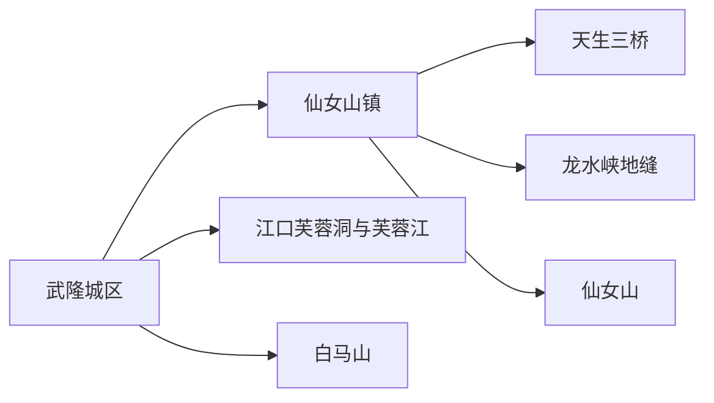
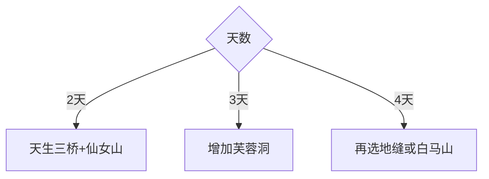

# 武隆旅行指南

武隆位于乌江峡谷与喀斯特山地之间，核心旅行结构是城区交通底盘、仙女山—天生三桥高地、江口芙蓉洞水洞系统和白马山远线。景点分散且高差明显，按片区各给完整一天，体验会比从重庆中心城区当天往返更完整。

## 城市速览

| 项目 | 信息 |
|---|---|
| 主线 | 武隆城区—仙女山镇—天生三桥—仙女山—芙蓉洞—白马山 |
| 停留 | 核心喀斯特2–3天；芙蓉江或白马山另留1天 |
| 住宿 | 城区便于铁路和江口；仙女山镇便于天生三桥与高地；白马山适合独立远线 |
| 交通 | 铁路、公路、景区接驳与正规游船 |
| 风险 | 峡谷台阶、洞穴湿滑、浓雾、雷雨山洪、落石、冬季结冰 |
| 边界 | 世界遗产地、地质保护区、洞穴、航道和水电生产区分别管理 |

## 城市格局与游览区域

城区位于乌江河谷，仙女山镇承担核心景区住宿，江口和白马山分属两个远线方向。固定清单的 **GeoNames 1815797 Changba** 对应武隆区长坝镇，本页按区级旅行尺度承接；Wikidata `Q1331251` 与法定代码 `500156` 确定现行区界，其 P1566 为行政记录 `1791088`。

## 主要景点

| 景点 | 区域 | 类型 | 核心体验 | 用时 | 环境 | 体力 | 研究价值 | 拥挤 | 优先级 |
|---|---|---|---|---:|---|---|---|---|---|
| 天生三桥景区 | 仙女山镇方向 | 世界遗产地貌 | 天生桥群、天坑与喀斯特峡谷 | 4–6小时 | 室外 | 高 | 很高 | 高 | A |
| 仙女山国家森林公园 | 仙女山 | 高山森林 | 草原、森林、避暑与冬季冰雪 | 半日至1天 | 室外 | 中 | 高 | 旺季高 | A |
| 芙蓉洞景区 | 江口 | 洞穴地质 | 大型洞穴沉积与地下地貌 | 3–5小时 | 洞内 | 中 | 很高 | 高 | A |
| 龙水峡地缝景区 | 仙女山镇方向 | 峡谷地质 | 地缝、瀑布与深切峡谷步道 | 3–5小时 | 室外 | 高 | 高 | 中高 | B |
| 芙蓉江正式游览区 | 江口 | 峡江水域 | 喀斯特峡谷与正规游船 | 半日 | 室外 | 中 | 高 | 中 | B |
| 白马山天尺情缘景区 | 白马山 | 高山度假 | 山地观景、茶园与度假设施 | 1天含往返 | 混合 | 中 | 中 | 旺季中高 | B |
| 武隆博物馆及城区乌江公共空间 | 城区 | 地方文博 | 区域历史、乌江城市与旅行背景 | 2–4小时 | 混合 | 低中 | 高 | 低 | B |

世界遗产地和地质公园按景区栈道与开放洞段游览；未开放洞穴、峡谷河道、攀爬岩壁、航道与水电设施按保护和生产边界进入。

## 美食与餐饮

碗碗羊肉、豆花、乌江鱼、苕粉、腊肉和高山蔬菜常见。城区与仙女山镇选择较多，江口和远线提前安排正餐；点鱼先确认来源、重量与做法，说明辣度、内脏、花生芝麻和动物油需求。

## 经典行程

### 两日基础线
**路线**：天生三桥—仙女山。**逻辑**：核心地质与高山景观各占半日至一天。**预约锚点**：门票、接驳和住宿。**休息**：仙女山镇。**删除条件**：雾雨时保留地貌主线。

### 三桥地缝线
**路线**：天生三桥—仙女山镇休息—龙水峡地缝。**逻辑**：同方向但台阶量大，按体力分配。**预约锚点**：两景区入场时段。**休息**：游客中心。**删除条件**：体力不足先删地缝。

### 仙女山高地线
**路线**：仙女山镇—森林公园开放区—高山观景—返程。**逻辑**：给天气和内部接驳完整时段。**预约锚点**：项目、接驳、冰雪或防火公告。**休息**：景区服务区。**删除条件**：雷雨、大风或结冰时缩短户外。

### 芙蓉洞江口线
**路线**：城区—芙蓉洞—芙蓉江正规游览区—返程。**逻辑**：地下洞穴与峡江同属江口方向。**预约锚点**：洞穴入场与船班。**休息**：江口。**删除条件**：船班取消时保留芙蓉洞。

### 白马山线
**路线**：城区—白马山正式景区—茶园与山地开放区—返程。**逻辑**：南部远线独立成日。**预约锚点**：道路、景区和车辆。**休息**：景区服务区。**删除条件**：浓雾或道路预警时取消。

### 城区雨天线
**路线**：武隆博物馆—城区餐饮—天气转稳后短段乌江公共空间。**逻辑**：以室内内容替代高风险峡谷。**预约锚点**：场馆开放。**休息**：城区。**删除条件**：极端天气时按应急公告减少移动。

### 低体力线
**路线**：车辆到仙女山主要开放区—景区接驳观景—城区文博。**逻辑**：避开三桥和地缝连续台阶。**预约锚点**：接驳和无障碍设施。**休息**：午后酒店。**删除条件**：高地天气不佳时只留城区。

## 住宿区域

武隆城区便于铁路、餐饮、江口和白马山分流；仙女山镇便于天生三桥、地缝与仙女山；江口适合芙蓉洞慢游；白马山住宿适合度假远线。确认接驳位置、供暖空调、停车、早餐与天气退改。

## 市内交通

武隆站、武隆南站与各住宿片区的距离和接驳方式需分别核对。城区到仙女山镇、江口和白马山不是同一路线；景区内部按官方接驳。山路行车预留雾雨、节假日排队和回程缓冲，游船核对起讫码头。

## 不同旅行者须知

地质爱好者优先三桥、地缝和芙蓉洞；亲子家庭选仙女山与芙蓉洞；摄影者按云雾和光线安排高地；徒步者管理连续台阶负荷；长者和低体力旅行者用仙女山车辆观景加城区文博。

## 行前核对

- 核对天生三桥、仙女山、芙蓉洞、地缝、芙蓉江和白马山开放。
- 核对景区接驳、游船、雾雨山洪、落石、冰雪和森林火险。
- 世界遗产地、地质保护区、洞穴、航道和水电设施按正式边界进入。

## 来源与更新记录

| 来源 | 支持内容 | 核验日期 |
|---|---|---|
| [武隆区政府：2026年A级景区名录](https://cqwl.gov.cn/bmjz_sites/bm/wlw/zwgk_98942/zfxxgkml/jczwgkzl/ggwhfwly/ggfw/ggwljgmd/202601/t20260104_15286062.html) | 核心景区、预约与开放结构 | 2026-09-01 |
| [武隆区政府：喀斯特地貌介绍](https://cqwl.gov.cn/bmjz_sites/bm/wlw/zwxx_98939/jqjd/ywtj/202101/t20210107_8743923.html) | 三桥、芙蓉洞、芙蓉江和仙女山地貌 | 2026-09-01 |
| [武隆区政府：旅行攻略](https://cqwl.gov.cn/bmjz_sites/bm/wlw/zwxx_98939/jqjd/ywtj/202209/t20220929_11155995.html) | 住宿片区与景点组合 | 2026-09-01 |
| [GeoNames 1815797](https://www.geonames.org/1815797/) | Changba 固定城市点 | 2026-09-01 |
| [Wikidata Q1331251](https://www.wikidata.org/wiki/Q1331251) | 武隆区实体、代码与行政记录 | 2026-09-01 |

| 日期 | 更新 |
|---|---|
| 2026-09-01 | 首次完成武隆旅行研究；建立核心喀斯特、高地、江口与白马山路线 |
