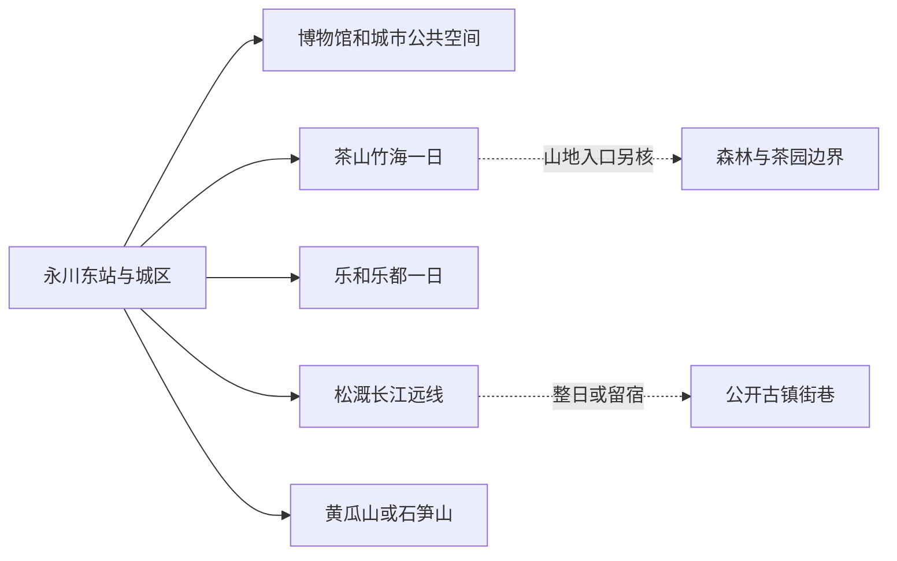
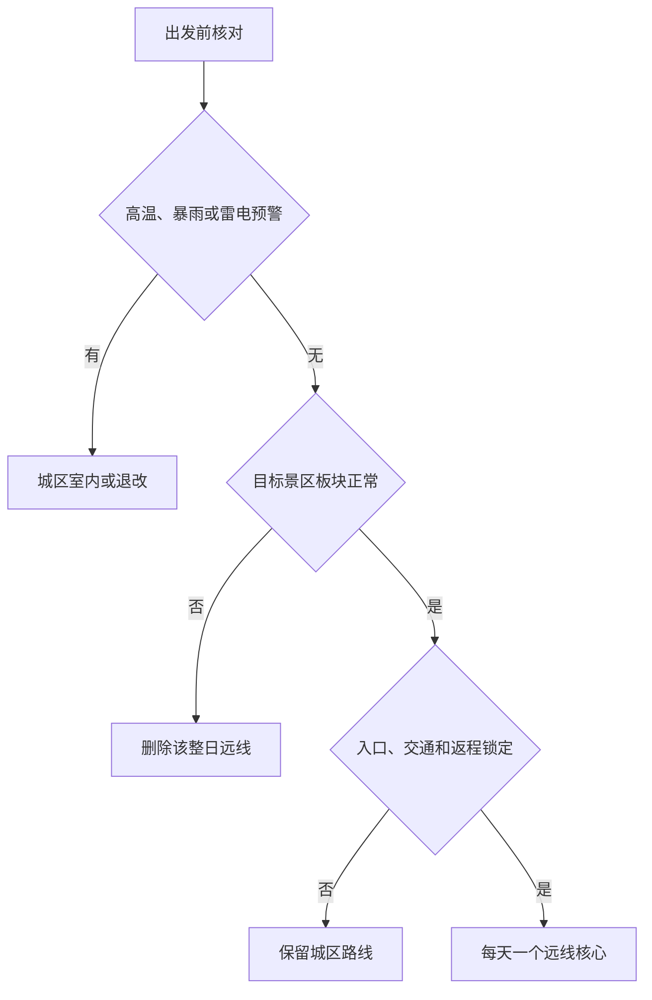

# 永川旅行指南

永川是重庆市辖区，不是法定城市，却拥有成渝高铁门户、完整城区住宿、茶山竹海森林茶园、乐和乐都大型主题公园，以及位于长江岸边且需要专程接驳的松溉古镇，因此适合按独立目的地组织。首访者最需要先拆开的，是“永川东站—城区—茶山竹海”“乐和乐都—卫星湖”和“松溉—长江岸线”三种不同旅行尺度：前两者也不能只凭地图距离无缝串联，松溉更不适合作为下午临时加点。

> 建议停留：城区与文博 1 天；茶山竹海或乐和乐都各另留 1 天；松溉、黄瓜山或石笋山方向各另留完整时段 
> 旅行关键词：永川博物馆、茶山竹海、永川秀芽、乐和乐都、松溉古镇、长江入渝 
> 主要体力：城区低至中等；主题公园长距离站立为中高；茶竹山地、古镇石板路和远郊为中高至高 
> 最近研究：2026-08-12

## 城市速览

| 项目 | 旅行信息 |
|---|---|
| 主要旅行价值 | 以永川博物馆和三河汇碧一带认识城市形成，从茶山竹海理解茶竹共生、森林与永川秀芽，再在乐和乐都体验动物科普与主题游乐，或到松溉阅读长江码头、县治和古镇生活 |
| 建议停留 | 1 天看城区文博；2 天加入茶山竹海或乐和乐都；3–4 天才适合再选松溉、黄瓜山或石笋山。大型主题公园与任何另一条远线都不宜同日硬拼 |
| 较舒适季节 | 春秋通常更适合茶园、竹林和古镇步行；夏季高温、雷雨和森林火险显著，水上乐园只按当期运营；冬季山地低温、浓雾和湿滑需重查 |
| 预算特点 | 城区高铁和日常餐饮易控制；主题公园门票与园内产品、茶山竹海交通和住宿、松溉远线车辆是主要变量 |
| 步行强度 | 博物馆、图书馆和兴龙湖短段为低至中等；主题公园面积大且排队站立久；茶山竹海、石笋山和松溉古镇含坡道、石板、山路与长车程 |
| 主要天气风险 | 高温、强降雨、雷电、城市积水、山洪、滑坡、落石、浓雾和森林火险；长江岸线另受水位与航运管制影响 |
| 独行旅行 | 铁路抵达、城区住宿和一人餐饮方便；远线返程与最后一段车辆需锁定，主题公园单人游还需接受排队和部分项目组队规则 |
| 亲子旅行 | 博物馆、图书馆、动物科普和部分主题项目可组合；游乐设备、动物互动、水上项目和山地有年龄、身高、健康及监护规则 |
| 长者与低体力旅行 | 优先城区单馆、车辆接驳和湖区短段；景区车不能消除乐园长距离站立、竹林台阶或古镇石板路 |
| 无障碍信息 | 永川东站和较新场馆可优先申请或确认服务；主题公园、古镇、山地、乡村住宿和车站至景点的连续无障碍需逐段核实 |

## 城市格局与游览区域

永川区法定行政代码为 `500118`。本页固定的 GeoNames `1786378` 是永川 `PPLA3` 城市居民点，Wikidata 的薄居民点 `Q28795620` 以 `P1566=1786378` 连接该点；法定区实体则是 `Q713989`，其 `P1566=1786371` 指向 GeoNames 行政区记录。居民点用于定位城市旅行门户，法定实体、代码和行政记录用于锁定包含松溉、朱沱等广阔乡镇的区界，不能将两个 GeoNames 编号或两个 Wikidata 实体互换。

| 区域 | 主要内容 | 游览特点 | 与其他区域的关系 |
|---|---|---|---|
| 中山路—胜利路—南大街城区 | 永川博物馆、三河汇碧城市记忆、商业、住宿和公共文化 | 城市服务最集中，街区与高铁站仍需公交或车辆接驳 | 适合抵达日和连续住宿，是茶山竹海、乐和乐都及远线的底盘 |
| 兴龙湖—永川东站新城 | 永川东站、兴龙湖、图书馆及新城公共空间 | 现代道路较宽，场馆和湖区适合雨天或低强度补充；施工与活动动态变化 | 可接城区和茶山竹海方向，不等于已到景区游客入口 |
| 茶山竹海—箕山 | 茶山竹海国家森林公园、茶园、竹林及正式服务单元 | 景区、森林公园、茶园生产和居民空间边界不同；山路与天气影响显著 | 单独安排一日，或留宿后分段体验；不与松溉同日 |
| 卫星湖—乐和乐都 | 乐和乐都主题公园度假群及当期开放板块 | 动物世界、器械游乐、水上乐园、演艺与酒店不是一套固定全开产品 | 作为完整一日，儿童与低体力者按开放板块删减 |
| 松溉—朱沱长江方向 | 松溉古镇、公开码头文化与长江沿岸乡镇 | 距城区较远，古镇街巷、长江岸线、居民和生产港区边界并存 | 独立一日或留宿；不把货运岸线、铁路专线和旧码头当公共游线 |
| 黄瓜山—石笋山与乡村方向 | 黄瓜山乡村旅游、石笋山当期开放单元、果园和村落 | 季节水果、道路、项目建设与经营日变化明显 | 每天只选一个核心，规划建设项目未投运前不进入路线 |

茶山竹海既有国家森林公园和 4A 景区身份，也包含茶园、竹林、村落、经营性住宿与林业生产空间。游客只进入景区公布的道路、步道和服务点，不因电影取景或社交平台轨迹进入防火封控区、采茶生产地和未开放林道。松溉临长江，但公共古镇街巷与码头、航道、滩地、港区和铁路货运设施不是同一种空间；只有正式开放岸线和合法客运或游览产品可用。

## 主要景点

优先级用于安排时间：**A** 为首访核心，**B** 为按兴趣补充，**C** 为远郊、季节性或需要额外交通条件的目的地。同一主题公园的动物、游乐、水上、演出和酒店板块按一个运营目的地理解；同一森林景区的茶园、竹海和取景地也不拆分计数。

### 城区文博与公共空间

| 景点 | 区域 | 类型 | 主要看点 | 建议用时 | 室内外 | 体力 | 预约风险 | 天气影响 | 优先级 |
|---|---|---|---|---:|---|---|---|---|---|
| 永川博物馆 | 兴龙湖—神女湖方向 | 地方综合博物馆 | 永川建置、地方历史、物产和文化展陈；作为理解茶、豆豉、古镇与城市的入口 | 2–3 小时 | 室内 | 低 | 中至高 | 低 | A |
| 兴龙湖公园正式公共空间 | 新城 | 城市湖区、公园与慢行 | 城市新城景观、短程步行和公共休闲；水岸、活动场地和夜间照明按现场 | 1.5–3 小时 | 室外 | 低至中 | 低 | 高 | B |
| 永川图书馆 | 新城 | 公共文化场馆 | 茶竹主题公共阅读空间、少儿与视障阅览等服务；活动和借阅规则另查 | 1.5–3 小时 | 室内 | 低 | 中 | 低 | B |
| 三河汇碧与公开城市记忆节点 | 老城区 | 城市水系、公共空间与地名文化 | 永川得名与城市水系关系；只走有护栏、照明和正式开放的公共段 | 1–2 小时 | 室外 | 低至中 | 低 | 高 | B |

### 茶竹、主题公园与长江远线

| 景点 | 区域 | 类型 | 主要看点 | 建议用时 | 室内外 | 体力 | 预约风险 | 天气影响 | 优先级 |
|---|---|---|---|---:|---|---|---|---|---|
| 茶山竹海国家森林公园 | 茶山竹海街道、箕山 | 4A 景区、国家森林公园、茶竹景观 | 茶园与竹林共生、森林步道、永川茶文化及正式开放取景地；内部只计一次 | 7–10 小时，含城区往返 | 室外为主 | 中高至高 | 高 | 很高 | A |
| 乐和乐都主题公园度假群 | 卫星湖街道 | 4A 景区、动物科普与主题游乐 | 野生动物世界、欢乐世界及当期开放板块；设备、水上和演艺分别核对但合计一个目的地 | 8–11 小时 | 混合 | 中高 | 很高 | 很高 | A |
| 松溉古镇 | 松溉镇 | 中国历史文化名镇、长江码头聚落 | 古县治、传统院落、祠堂、青石板街与川江生活；居民宅和修缮区不默认开放 | 6–9 小时，含往返 | 室外为主 | 中 | 高 | 高 | A |
| 黄瓜山乡村旅游公开单元 | 南大街—吉安方向 | 乡村、果园与季节农业 | 正式开放农旅园区、梨园和乡村服务；农田、果树和民宿院落均以经营许可为准 | 4–7 小时，含往返 | 室外 | 中 | 高 | 高 | B |
| 石笋山景区当期开放单元 | 何埂方向 | 山地景区、自然与乡村景观 | 只承接已正式开放游客中心、道路和游线；2025—2026 年仍有建设项目，规划部分不计入 | 6–9 小时，含往返 | 室外 | 中高 | 很高 | 很高 | C |

乐和乐都的动物世界、器械游乐、水上乐园、演出和住宿会因季节、设备检修、动物福利、天气与客流使用不同日历。购买“景区票”不等于所有板块、快速服务或互动项目都包含在内；游客应遵守禁止投喂、敲打展窗、越过围栏和强光惊扰等规则。茶山竹海的生产茶园和竹林也不是采摘许可，参加采茶制茶必须进入有经营主体和讲解的正式活动。

## 美食与餐饮

永川饮食的辨识度来自永川豆豉、永川秀芽、松溉盐白菜与九大碗、黄瓜山脆梨、来苏香肠、皮蛋及茶竹菜。城区最适合一人用餐和比较价格；景区与古镇餐饮受营业日和客流影响，产品名和产地名不能替代配料、份量与卫生信息。

| 菜品或餐饮类型 | 常见区域 | 一个人用餐与常见份量 | 风味、过敏原与饮食限制 | 排队风险与替代方法 |
|---|---|---|---|---|
| 永川豆豉及豆豉入菜 | 城区地方菜馆、正规特产店 | 调味菜可配一人餐，包装豆豉适合少量购买 | 含大豆，部分产品含小麦、盐、辣椒、油或酒料；低钠与过敏者看标签 | 不为单店绕路；选生产者、配料、日期和保存清楚的产品 |
| 永川秀芽与茶饮 | 城区茶馆、茶山竹海正规体验点 | 一壶适合分享，独行先问杯泡或小规格 | 含咖啡因；调味茶饮可能加奶、糖、坚果或香精 | 茶旅节和景区高峰时改选正规茶馆，不购买来源不明散装“野茶” |
| 茶水豆花、竹笋与茶竹菜 | 茶山竹海周边和城区地方菜馆 | 豆花适合一人，竹笋肉菜多为合菜 | 大豆、猪油、腊肉、辣椒、花椒和季节笋常见；不自行采食竹笋或菌类 | 景区午餐拥挤时提前错峰，或回城区找同类家常菜 |
| 松溉九大碗 | 松溉古镇及正规宴席 | 适合多人，独行不为“全套”点满 | 猪肉、禽肉、蛋、动物油、酒料与多道共锅常见 | 活动宴席需预约；人数少时选一两道代表菜或普通家常餐 |
| 松溉盐白菜及古镇小菜 | 松溉与城区正规渠道 | 小份佐餐或包装携带 | 盐分高，可能含辣椒、糖和防腐工艺；看配料与保存条件 | 节庆摊位拥挤时选固定门店或商超，避免无标签长途携带 |
| 黄瓜山脆梨与季节水果 | 黄瓜山、城区市场和正规果园 | 一人可少量购买 | 水果糖分与酸度按健康条件控制；采摘不等于任意进入果园 | 产季和活动波动；选择明码标价、说明采摘范围与称重规则的经营点 |
| 来苏香肠、永川皮蛋 | 城区、来苏和正规特产渠道 | 餐馆多为共享菜，包装产品适合少量购买 | 猪肉、蛋、盐、酒料、复合香辛料和腌制成分常见 | 看生产许可、配料、日期和冷藏条件，不购买无法判断储存的散装产品 |
| 火锅、小面与重庆常见餐饮 | 城区成熟商圈 | 独行可选小面、抄手、豆花饭或小锅，火锅更适合多人 | 牛油、小麦、大豆、芝麻、花生、内脏和共锅常见 | 避开活动散场高峰，按锅底、份量和最低消费选择同类替代 |

茶山竹海、黄瓜山和松溉周边既有旅游经营，也有真实农业与居民生活。游客不自行采茶、挖笋、摘果、取酒或进入灶房；严格素食、清真、不能摄入酒料、低钠或严重过敏者，应在城区或正规景区餐饮点逐项确认原料和共用锅具。

## 经典行程

永川远线先判断景区开放与天气，再核入口交通和返程。主题公园设备、水上板块或演出暂停时，不等于动物世界或全部园区同样停运；反之，一项活动开放也不证明整园所有板块可用。

### 一日经典路线

**路线**：永川博物馆 → 城区午餐与坐休 → 永川图书馆或兴龙湖短段二选一 → 三河汇碧一段正式公共空间 → 原住宿地

- **适用条件**：博物馆正常开放，城区无严重高温、暴雨、积水或活动管制；晚到时只保留博物馆。
- **串联逻辑**：先用地方史建立城市、物产与乡镇关系，再用公共文化或湖区观察当代城市，不跨入山地和主题公园。
- **预约锚点**：博物馆开放、预约、临展与最晚入馆；图书馆活动和兴龙湖大型活动作为次级核对。
- **休息安排**：午餐留完整坐休，湖区只走一小段有座椅、照明和明确出口的公共空间。
- **时间不足时**：先删三河汇碧，再在图书馆与兴龙湖中只留一个；不追加茶山竹海山门或松溉入口。

### 两日城市路线

**第 1 天**：永川博物馆 → 午休 → 兴龙湖或图书馆 → 城区住宿 
**第 2 天**：城区 → 茶山竹海正式游客入口 → 当日开放茶园与竹林主游线 → 原入口返回

- **适用条件**：第二天道路、景区、森林防火与主游线正常，同行者能承担山地步行和较长站立。
- **串联逻辑**：第一天建立永川历史和城市服务，第二天把完整白天交给茶竹共生景观，不在抵达日追赶山上末班。
- **预约锚点**：茶山竹海入口、门票、景区交通、活动、停车与返程为最高优先；博物馆其次。
- **休息安排**：第一天午休；第二天只在景区公布服务点补水、用餐和分段休息，不离开正式游线。
- **时间不足时**：第一天只留博物馆；第二天缩短景区主线，不转乐和乐都、黄瓜山或松溉。

### 三日深度路线

**第 1 天**：博物馆—兴龙湖城区线 
**第 2 天**：茶山竹海或乐和乐都完整一日二选一 
**第 3 天**：松溉古镇正式开放街巷与场馆 → 午餐和坐休 → 原路返程

- **适用条件**：第二天只选一个大型目的地；第三天古镇开放、道路、车辆与返程明确，长江水位或活动无严重限制。
- **串联逻辑**：三天依次处理城市史、一个代表性茶竹或主题游乐体验、长江古镇，避免在景区之间消耗白天。
- **预约锚点**：第二天景区全套票务与交通；第三天松溉场馆、活动、停车、正规车辆和最晚返程。
- **休息安排**：每天午间长休；乐园日设置室内或遮阴坐休，古镇只走连续核心街段。
- **时间不足时**：整段删除第三天；第二天若景区取消则改城区公共文化，不把松溉临时前置成雨天路线。

### 雨天路线

**路线**：永川博物馆核心展厅 → 室内午餐与长休 → 永川图书馆当期开放阅览或展览空间 → 原住宿地

- **适用条件**：仅适用于普通降雨且城区道路、两馆正常；暴雨、雷电或积水时只留离住宿最近的室内场馆。
- **串联逻辑**：以两个公共文化场馆替代茶山竹海、松溉石板路、兴龙湖岸线和主题公园户外板块。
- **预约锚点**：博物馆闭馆、预约和最晚入馆；图书馆活动、开放区域和证件要求。
- **休息安排**：使用馆内座椅和正规室内餐饮区，车辆点到点移动，换点前重查道路。
- **时间不足时**：只保留博物馆；不因雨具、自驾或单一设备开放进入山地、古镇和主题公园。

### 亲子或低体力路线

**亲子路线**：永川博物馆精选展厅 → 午餐与午休 → 永川图书馆当期开放的少儿空间或展览 → 返回住宿地 
**低体力路线**：车辆直达永川博物馆最近落客点 → 核心展厅 → 完整坐休 → 兴龙湖有座椅短段或直接返店

- **适用条件**：亲子路线先确认博物馆与图书馆的儿童活动、开放空间和证件要求；低体力路线先确认落客点、电梯、轮椅与卫生间。乐和乐都是完整一日大型目的地，若选择它，应改用前述整日路线，不与城区两馆同日拼接。
- **串联逻辑**：亲子以两处城区公共文化空间加完整午休为主，低体力以一馆和可随时结束的短段为主；两类需求不同，不合并成同一条路线。
- **预约锚点**：博物馆和图书馆的开放、活动与最晚入场；低体力者另确认无障碍连续路线。
- **休息安排**：午间不压缩；两馆之间用车辆移动并在馆内坐休，低体力路线出现疲劳即直接返回。
- **时间不足时**：亲子只留博物馆或图书馆，低体力只留一馆；不转茶山竹海或松溉补点。

### 远郊一日路线

**古镇路线**：城区 → 松溉古镇正式入口 → 核心街巷与当期开放场馆 → 午餐和长休 → 原路返程 
**乡村替代**：城区 → 黄瓜山正规农旅入口 → 当季公开游览或采摘单元 → 午餐与坐休 → 早返

- **适用条件**：两条路线只选一条；松溉需道路、修缮、活动和返程正常，黄瓜山需产季、经营、采摘范围和天气明确。
- **串联逻辑**：古镇线集中阅读长江码头与县治历史，乡村线集中在一个合法农旅单元，不把多个果园、村落或山头串成穿越。
- **预约锚点**：古镇场馆、活动与车辆，或果园经营、称重、停车和退改；返程优先于临时体验。
- **休息安排**：只使用正规餐饮和服务点；驾驶者返程前长休，不在长江滩地、果园路肩或生产道路临停。
- **时间不足时**：缩短核心段或整段删除，改走城区博物馆；不只为拍照赶到入口后夜返。

## 住宿区域

| 区域 | 优点 | 缺点 | 适合人群 | 交通特点 |
|---|---|---|---|---|
| 中山路—胜利路—南大街城区 | 餐饮、医院、商业和叫车最稳定，可连续组织多条远线 | 到永川东站、主题公园和松溉都需接驳 | 首访、独行、雨天、重视一人餐饮与连续住宿者 | 公交、出租车和网约车为主，按实际出发点估算高铁接驳 |
| 永川东站—兴龙湖新城 | 高铁早晚到发、博物馆和较新住宿较方便 | 与老城餐饮和部分景点有距离，站前建设和活动会改变动线 | 晚到早走、铁路中转、行李多和低体力者 | 订房前定位站口、酒店落客点和博物馆实际入口 |
| 茶山竹海正式入口周边 | 便于早入园、避开城区往返和体验山地早晚 | 名称可能对应山脚、山上或不同村落；淡旺季餐饮、医疗和交通差异大 | 茶竹专题、摄影、愿意留宿一晚者 | 订房前匹配游客入口、停车、景交、晚餐、供暖防潮与退改 |
| 乐和乐都—卫星湖方向 | 方便早入园、亲子午休和大型景区连续体验 | 主题公园之外的餐饮、夜间活动和交通随产品变化 | 家庭、主题乐园专题和不想当天往返者 | 核对酒店与景区入口、是否含票、接驳、退改和闭园后用车 |
| 松溉古镇方向 | 适合古镇慢游与清晨傍晚公共街巷，减少夜间返城 | 医疗、叫车、餐饮和临时退改少于城区；居民安静边界重要 | 古镇、川江文化和摄影专题者 | 不默认能从古镇临时叫车去茶山竹海或永川东站，下一段另约 |

不推荐只凭“高铁站”“茶山竹海”“动物园”“古镇”字样选择住宿。需要无障碍客房、电梯、儿童床、安静房、夜间入住、供暖防潮或车辆到门时，应向住宿方确认从落客点到客房、餐厅与景区入口的连续路线；门票套餐名称也要逐项确认包含日期、板块和退改。

## 市内交通

永川东站是成渝高铁旅客门户，永川站等既有铁路站点具有不同线路与停靠，票面站名不能互换。重庆中心城区到永川可用铁路或公路，永川没有一条覆盖茶山竹海、乐和乐都、松溉和石笋山的城市轨道网络；到站后仍需公交、出租车、网约车、正规景区接驳、合规包车或自驾完成末端。

| 场景或枢纽 | 建议与取舍 | 行前需要重查的内容 |
|---|---|---|
| 高铁抵达永川东站 | 适合从重庆、成都及沿线城市抵达，再转地面交通去城区或景区 | 12306 票面站名、车次、站口、公交、叫车点、末班与住宿接站 |
| 既有铁路永川站与其他站点 | 只按具体车次使用，不能因都含“永川”而互换 | 停靠车次、进出站、行李、夜间接驳与到目标住宿的实际距离 |
| 公路客运或自驾抵达 | 适合周边区县与多人出行，但枢纽和高速施工可能变化 | 客运站、班次、成渝高速改扩建、节假日拥堵、退改和停车 |
| 城区—茶山竹海 | 先定位实际游客入口，再选公交、正规接驳、合规包车或自驾 | 景区开放、道路、防火、停车、景交、末班与返程 |
| 城区—乐和乐都 | 以当天开放入口与板块为终点，预留散场叫车与亲子行李时间 | 门票日期、入口、公交或专线、停车、闭园、演出与夜间返程 |
| 城区—松溉古镇 | 作为独立远郊，使用当期客运、正规车辆或自驾 | 班次、古镇入口、修缮、停车、长江水位、末班和住宿 |
| 城区—黄瓜山或石笋山 | 每天只选一个方向，石笋山尤其要确认建设与正式开放范围 | 经营日、产季、游客中心、道路施工、停车、返程与天气 |
| 自驾 | 家庭与多远线更灵活，但山路、乐园散场、古镇停车和司机疲劳是代价 | 驾照租车、保险、停车、充电加油、道路预警和夜间驾驶 |

官方规划曾提出逐步开通永川东站至主要景区及跨区旅游直通车；“逐步开通”不是每日固定班次承诺。只有当期运营方售票、站牌或官方交通公告才能进入具体行程。自动驾驶示范运营也不等同于覆盖所有游客目的地的常规出租服务，不应预设可随叫随到。

## 不同旅行者须知

| 旅行维度 | 可行条件 | 主要取舍 | 需额外核对 |
|---|---|---|---|
| 独行旅行 | 高铁、城区住宿、博物馆和一人餐饮容易组合 | 远线车辆分摊、景区散场和古镇夜返容错低 | 正规车辆、末班、离线地图、住宿前台与紧急联系人 |
| 亲子旅行 | 博物馆、图书馆和乐和乐都适龄板块可组合 | 乐园面积大，动物、水上、设备和高温需要持续看护 | 年龄身高、健康限制、救生、推车、寄存、休息室与退改 |
| 长者或低体力旅行 | 一馆半日、车辆接驳和兴龙湖短段可行 | 主题公园长站立、竹林台阶、古镇石板和山路会放大负担 | 落客点、轮椅、电梯、座椅、景区车、卫生间和医疗点 |
| 无障碍需求 | 优先永川东站帮扶、较新场馆和城区酒店 | 森林、古镇、主题公园设备和乡村道路可能中断连续通行 | 从停车、检票、换乘、展厅到卫生间和客房的全程确认 |
| 摄影旅行 | 茶竹、古镇、长江、动物与城市湖区题材丰富 | 云雾、动物行为和日落不保证出现，追多个机位增加夜路风险 | 无人机空域、动物闪光、馆内禁拍、三脚架、商业拍摄与设备防潮 |
| 预算有限 | 住城区、铁路早订、保留博物馆和一条远线最可控 | 景区套票、接驳、旺季住宿和退改不能同时压缩 | 免费预约、优惠资格、必选交通、套餐边界、发票和退改 |
| 晚出发或紧凑行程 | 只保留仍有完整时段的一馆或一段城市公共空间 | 茶山竹海、乐和乐都、松溉和石笋山都不是到达日顺路项 | 最晚入馆、闭园、照明、公交末班、叫车与入住时间 |
| 高温、暴雨或冬季旅行 | 普通降雨改室内；山地和乐园按当期公告删减 | 设备停运、山洪、滑坡、浓雾、结冰和森林火险可使整线失效 | 气象、景区、交通、林业、地灾和保险退改公告 |
| 动物、森林与生产空间 | 只使用正式游客入口、围栏内参观区和公开步道 | 禁止投喂惊扰，林区、茶园、果园、港区和铁路设施不自由进入 | 动物互动规则、防火、采摘许可、围栏、道路封闭与安全员要求 |
| 严格饮食限制 | 城区正规餐馆较易说明原料，可携带书面需求 | 豆豉、茶竹菜、九大碗、腌制品和火锅共锅配料复杂 | 大豆、小麦、花生、芝麻、蛋、动物油、酒料与交叉接触 |

## 行前核对

| 核对事项 | 为什么需要重查 | 建议核对时间 | 官方入口 |
|---|---|---|---|
| 茶山竹海开放、入口与森林防火 | 景区、森林公园、茶园和林业空间不同，火险或道路可触发封控 | 订车订房前、前三日及当天 | [重庆市政府：茶山竹海国家森林公园](https://www.cq.gov.cn/zjcq/lszq/stpz/gjslgy/202606/t20260604_15727467.html)；[重庆市林业局](https://lyj.cq.gov.cn/) |
| 乐和乐都门票与开放板块 | 动物、游乐、水上、演出、酒店和设备检修使用不同日历 | 付款前、前一日及入园当天 | 景区当期官方售票与公告；[重庆市文化和旅游发展委员会](https://whlyw.cq.gov.cn/) |
| 松溉古镇场馆、修缮与交通 | 古镇街巷、展馆、活动、码头和居民空间不会同步开放 | 排路线时、前一日及当天 | [重庆市地方志办公室：松溉古镇](https://dfz.cq.gov.cn/zqlswh/rwby_417819/202606/t20260615_15754241.html)；永川区政府公告 |
| 永川博物馆与图书馆 | 闭馆日、活动、临展、证件和最晚入馆会变化 | 排路线时及到访前一日 | [永川区人民政府](https://www.cqyc.gov.cn/)；场馆当期官方公告 |
| 黄瓜山采摘与石笋山开放 | 产季、经营范围、项目建设、游客中心和道路状态变化快 | 付款或订车前、前三日及当天 | 永川区政府、镇街和合法经营方公告 |
| 永川东站、永川站和公路客运 | 车次、站名、班次、施工与末端接驳具有时效性 | 购票时、前一日及当天 | [中国铁路 12306](https://www.12306.cn/)；[重庆市交通运输委员会](https://jtj.cq.gov.cn/) |
| 长江水位、古镇岸线与水上产品 | 水位、航道、合法码头、救生和停航共同决定可用范围 | 购票前、前三日及当天 | 交通海事、属地政府与合法运营方公告 |
| 高温、暴雨、雷电与地灾 | 山地、主题公园、乡村和长江岸线面对不同风险 | 出发前三日起每日核对，当天再查 | [重庆市气象局](http://cq.cma.gov.cn/)；[重庆市规划和自然资源局](https://ghzrzyj.cq.gov.cn/) |
| 无障碍连续路线 | 单点电梯、景区车或优惠不能证明全程可达 | 订票、订房和订交通前逐点联系 | 车站、场馆、景区、住宿官方客服及 12306 重点旅客服务 |
| 入境、实名与证件规则 | 国际旅行者和实名票务会随证件、口岸与活动变化 | 订票前及出发前一周 | [国家移民管理局](https://www.nia.gov.cn/)；承运人和景区官方 |

## 来源与更新记录

### 主要来源

| 来源 | 类型 | 支持内容 | 核验日期 |
|---|---|---|---|
| [重庆市民政局：2025 年 12 月行政区划及代码](https://mzj.cq.gov.cn/zwgk_218/zfxxgkml/tzgg/202601/t20260119_15332641.html) | 市民政部门 | 永川区法定层级、现行名称与行政代码 `500118` | 2026-08-12 |
| [重庆市政府：永川之旅](https://www.cq.gov.cn/zjcq/cycq/jplyxl/zby/bjydr/202408/t20240808_13482541.html) | 市政府旅游信息 | 松溉、乐和乐都与茶山竹海三条代表性旅行主线 | 2026-08-12 |
| [重庆市政府：茶山竹海国家森林公园](https://www.cq.gov.cn/zjcq/lszq/stpz/gjslgy/202606/t20260604_15727467.html) | 市政府、林业资料 | 国家森林公园、4A 景区、茶竹共生、森林生态和地形气候 | 2026-08-12 |
| [永川区全域旅游发展规划](https://yc.cq.gov.cn/zwgk_204/zfxxgkmls/zcwj_147152/qtwj_1/202012/W020201209575368279593.pdf) | 区政府规划 | 城区、茶山竹海、乐和乐都、松溉、黄瓜山、石笋山空间与交通规划；规划不等于常态开放 | 2026-08-12 |
| [重庆市政府：2025 永川国际茶文化旅游节](https://cq.gov.cn/zwgk/zfxxgkml/zdlyxxgk/ggwh/ly/zxdt/202504/t20250427_14562836.html) | 市政府文旅信息 | 茶山竹海、松溉、茶文化与区域旅游线路的当期关系 | 2026-08-12 |
| [重庆市农业农村委：永川茶旅资源](https://nyncw.cq.gov.cn/zwxx_161/mtbb/202304/t20230421_11899323.html) | 市农业农村部门 | 茶山竹海、乐和乐都、石笋山、松溉的景区身份和永川秀芽茶旅主题 | 2026-08-12 |
| [重庆市地方志办公室：松溉古镇](https://dfz.cq.gov.cn/zqlswh/rwby_417819/202606/t20260615_15754241.html) | 市地方志机构 | 松溉中国历史文化名镇、古县治、长江码头和传统街巷 | 2026-08-12 |
| [重庆市民政局：永川地名与物产](https://mzj.cq.gov.cn/sy_218/bmdt/mzyw/202402/t20240205_12904954.html) | 市民政部门、地名文化 | 三河汇碧、茶山竹海、黄瓜山、豆豉、秀芽、皮蛋、盐白菜等线索 | 2026-08-12 |
| [永川区政府：永川图书馆](https://www.cqyc.gov.cn/sy_204/qxdt/202302/t20230203_11564877.html) | 区政府、公共文化场馆 | 图书馆位置功能、少儿、老年和视障阅览等服务基础 | 2026-08-12 |
| [重庆市政府：永川城市与景区](https://www.cq.gov.cn/ywdt/tpxw/202007/t20200708_8647523.html) | 市政府资料 | 永川博物馆、茶山竹海、乐和乐都和城区空间背景；动态运营另查 | 2026-08-12 |
| [重庆市文旅委：永川文旅项目答复](https://whlyw.cq.gov.cn/zwgk_221/zfxxgkml/jyta/zxta/202507/t20250717_14824117.html) | 市文旅主管部门 | 乐和乐都提档、茶山竹海服务、松溉运营和夜间产品的动态建设边界 | 2026-08-12 |
| [永川区政府：2025 年重点项目](https://www.cqyc.gov.cn/zwgk_204/zfxxgkmls/zcwj_147152/qtwj_1/202502/t20250220_14323289.html) | 区政府项目清单 | 石笋山、乐和乐都及交通项目仍有建设内容，不能将规划项目写为既成开放 | 2026-08-12 |
| [重庆市交通运输委员会](https://jtj.cq.gov.cn/) | 交通主管部门 | 铁路、公路、施工与动态交通入口 | 2026-08-12 |
| [重庆市气象局](http://cq.cma.gov.cn/) | 气象主管部门 | 高温、暴雨、雷电、强对流和临近预警入口 | 2026-08-12 |
| [GeoNames：Yongchuan](https://www.geonames.org/1786378/yongchuan.html) | 开放地名数据 | 固定城市居民点 `1786378`、坐标和 `PPLA3` 类型 | 2026-08-12 |
| [Wikidata：永川居民点 Q28795620](https://www.wikidata.org/wiki/Q28795620) | 开放结构化数据 | 薄居民点及 `P1566=1786378`，只用于点实体消歧 | 2026-08-12 |
| [Wikidata：永川区 Q713989](https://www.wikidata.org/wiki/Q713989) | 开放结构化数据 | 法定永川区、代码 `500118` 与 `P1566=1786371` 行政记录 | 2026-08-12 |

### 更新记录

| 日期 | 更新内容 |
|---|---|
| 2026-08-12 | 建立永川城区、茶山竹海、乐和乐都、松溉与乡村山地的独立旅行尺度；明确固定城市点、薄居民点、法定市辖区与行政 GeoNames 记录的粒度差异，补充文博、饮食、六组路线、住宿、铁路与末端交通、动物福利、森林防火、生产空间、水域、地灾和无障碍边界 |
