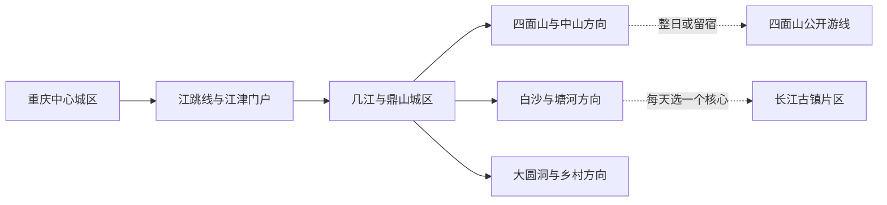
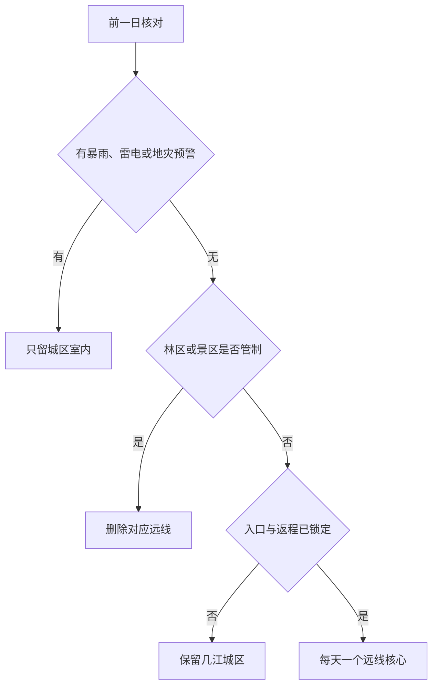

# 江津旅行指南

江津是重庆市辖区，不是法定城市，但几江半岛已有独立的博物馆、纪念馆、住宿和长江岸线，南部四面山—中山古镇与西部白沙—塘河又各自形成需要完整一天甚至留宿的旅行片区，因此按独立目的地组织。首访最容易失误的不是“景点不够”，而是把江跳线终点、几江城区、白沙古镇和四面山看成一条近距离城市线路；更稳妥的做法，是先用城区一日建立长江要津与近现代历史框架，再把山地和古镇分别交给完整白天。

> 建议停留：几江—鼎山城区 1 天；四面山 1–2 天；中山或白沙—塘河方向各另留 1 天 
> 旅行关键词：长江要津、聂荣臻、陈独秀、四面山丹霞瀑布、中山古镇、白沙抗战文化 
> 主要体力：城区低至中等；古镇石板路与滨江坡道中等；四面山、森林和长距离换乘为中高至高 
> 最近研究：2026-08-12

## 城市速览

| 项目 | 旅行信息 |
|---|---|
| 主要旅行价值 | 在几江—鼎山认识江津作为长江水陆节点的城市历史，以聂荣臻元帅陈列馆和陈独秀旧居陈列馆阅读近现代人物史，再从四面山的丹霞赤壁、湖泊瀑布与常绿阔叶林，以及中山、白沙、塘河等古镇理解山地商路、川江航运和地方生活 |
| 建议停留 | 1 天只看城区文博；2 天加入四面山或一条古镇线；3–4 天才适合把城区、四面山和津西古镇拆开。四面山、中山—爱情天梯与白沙—塘河不宜在同一天硬拼 |
| 较舒适季节 | 春秋通常更适合城区、古镇和山地步行；夏季瀑布与森林体验鲜明，但高温、强对流、山洪和雷电风险上升；冬季山地低温、浓雾和结冰需按当期公告判断 |
| 预算特点 | 城区公共场馆和日常餐饮较易控制；四面山门票、景区交通、山地住宿、古镇间车辆和节假日退改是主要变量，不能用中心城区公共交通预算推算远线成本 |
| 步行强度 | 博物馆和陈列馆为低至中等；几江滨江、古镇老街含坡道、台阶和湿滑石板；四面山即使使用景区车辆也有较长站立、换乘和户外步行 |
| 主要天气风险 | 汛期强降雨、雷电、山洪、滑坡、落石、长江及支流水位变化；林区另有高温伏旱、森林火险、浓雾和冬季道路结冰 |
| 独行旅行 | 城区轨道接驳、公交、叫车与一人餐饮较方便；四面山、爱情天梯、大圆洞和古镇间末端车辆、返程与夜间入住必须预先锁定 |
| 亲子旅行 | 江津博物馆、科技馆和人物场馆可按注意力分段；山地、临水、游船、露营和户外项目有年龄、身高、健康与看护规则，不能由“亲子”宣传推定普遍适用 |
| 长者与低体力旅行 | 优先“单馆半日 + 车辆接驳 + 一段有座椅的滨江公共空间”；古镇石板路、四面山瀑布游线和跨片区一日会明显增加负担 |
| 无障碍信息 | 较新公共场馆和轨道车站可优先询问电梯、轮椅与帮扶；历史建筑、古镇、山地景区、码头和乡村住宿的连续无障碍资料不足，需逐段向运营方确认 |

## 城市格局与游览区域

江津区法定行政代码为 `500116`。本页固定的 GeoNames `1805798` 是以几江城区为定位锚点的 `PPLA3` 居民点；Wikidata `Q201723` 表达江津区法定行政实体，并同样记录 `P1566=1805798`。共享一个 GeoNames 编号不表示“几江坐标点”等于整个江津区：居民点用于锁定主要旅行门户，法定实体和民政区划用于确定包含四面山、白沙、塘河及其他乡镇的广阔区界，具体景区仍按属地与运营公告判断。

| 区域 | 主要内容 | 游览特点 | 与其他区域的关系 |
|---|---|---|---|
| 几江—鼎山母城 | 江津博物馆、聂荣臻元帅陈列馆、滨江公共空间、相府路一带城市文脉 | 公共场馆、住宿和餐饮最集中，但滨江高差与道路分层仍会拉长步行 | 适合作为抵达日和所有远线的住宿底盘；与江跳线圣泉寺站仍需地面接驳 |
| 滨江新城—圣泉—德感 | 江跳线门户、江津北站方向、科技馆与新城公共服务 | 交通入口分散，站名相近但功能不同；规划或施工设施不能当成已运营服务 | 可接几江城区，不等于已经到四面山、白沙或中山古镇 |
| 津南四面山片区 | 四面山景区、四屏度假方向及正式开放的山地服务单元 | 5A 景区、自然保护地、林区、村落和经营性住宿边界交错，需一至两天 | 与中山古镇可在留宿且道路明确时顺序组合，不与津西古镇同日赶场 |
| 中山—蔡家—李市方向 | 中山古镇、爱情天梯、会龙庄及当期开放的 1314 环线节点 | 山地公路纵深大，古镇老街、村道和景点入口并非连续步行 | 可作为独立一日或四面山前后半程；整条环线只适合道路、车辆和返程均锁定者 |
| 白沙—塘河—石蟆津西线 | 白沙古镇与抗战文化、塘河古镇、石蟆历史建筑及乡镇生活 | 依长江与古商路展开，点位间仍有明显车程；影视拍摄区和修缮区动态变化 | 白沙可独立一日，塘河或石蟆只在交通清楚时择一追加 |
| 大圆洞—永兴及其他乡村林区 | 大圆洞国家森林公园、季节农业和正式开放乡村项目 | 森林、农田、生产道路和居民空间不是无边界景区 | 作为独立远郊日；不把林场、果园、矿区、港区或水利设施当作自由穿越空间 |

江津的“长江岸线”同时包含城市公共空间、航道、码头、港区、取排水设施、消落带和生产岸线。只有正式公园、开放街巷、合法码头或景区入口属于普通游线；专用码头、货运港区、无护栏滩地和施工岸线不能因地图上有路就进入。四面山景区与四面山市级自然保护区、森林资源管理空间也不是同一张边界图，核心保护、科研监测、未开放林道和防火封控区不属于游客范围。

## 主要景点

优先级用于安排时间：**A** 为首访核心，**B** 为按兴趣补充，**C** 为远郊、季节性或通常需要额外交通条件的目的地。同一景区内部的瀑布、湖泊、索道、观光车、步道和活动项目按一个完整运营单元理解，不拆成多个“已完成景点”。

### 城区文博与近现代人物史

| 景点 | 区域 | 类型 | 主要看点 | 建议用时 | 室内外 | 体力 | 预约风险 | 天气影响 | 优先级 |
|---|---|---|---|---:|---|---|---|---|---|
| 江津博物馆 | 滨江新城 | 地方综合博物馆 | 从远古记忆、汉唐古城、长江要津到近现代变革的地方史框架；以当期开放常设与临展为准 | 2–3 小时 | 室内 | 低 | 中 | 低 | A |
| 聂荣臻元帅陈列馆 | 几江—鼎山 | 人物纪念馆、4A 景区 | 聂荣臻生平、国防科技与相关文物文献；广场、主馆和临展仍按一个场馆安排 | 2.5–4 小时 | 混合 | 低至中 | 中至高 | 中 | A |
| 陈独秀旧居陈列馆 | 几江街道石墙村 | 名人旧居、纪念馆 | 2026 年焕新的基本陈列、旧居环境与陈独秀在江津的晚年生活；开放与领票须重查 | 2–3 小时 | 混合 | 中 | 高 | 中 | A |
| 南京内学院旧址 | 鼎山滨江方向 | 近现代教育文化遗址、陈列空间 | 佛学教育与近现代文化史线索；独立开放时段和修缮状态不与陈独秀旧居自动同步 | 1–2 小时 | 混合 | 中 | 中至高 | 中 | B |
| 江津科技馆 | 滨江新城 | 公益科普场馆 | 基础科学、生命、人防与儿童互动展项；实际开放楼层和团体活动按公告 | 2–3 小时 | 室内 | 低 | 中 | 低 | B |

### 山地、古镇与川江文化

| 景点 | 区域 | 类型 | 主要看点 | 建议用时 | 室内外 | 体力 | 预约风险 | 天气影响 | 优先级 |
|---|---|---|---|---:|---|---|---|---|---|
| 江津四面山景区 | 四面山镇及正式游客入口 | 5A 景区、丹霞山水与森林 | 赤壁丹霞、高山湖泊、瀑布群、常绿阔叶林及公开人文节点；望乡台等内部点只计一次 | 8–12 小时，适合留宿 | 室外为主 | 中高至高 | 很高 | 很高 | A |
| 中山古镇 | 中山镇笋溪河畔 | 中国历史文化名镇、山地商贸老街 | 沿河吊脚楼、青石板老街、商德文化和当期开放民俗；居民院落不默认开放 | 4–6 小时，含接驳 | 室外为主 | 中 | 高 | 高 | A |
| 白沙古镇与公开抗战文化场馆 | 白沙镇 | 中国历史文化名镇、川江码头与抗战文化 | 明清至民国街巷、抗战时期学校机构遗存与正式开放展馆；影视城、拍摄区另行核对 | 5–8 小时，含往返 | 混合 | 中 | 高 | 高 | A |
| 爱情天梯公开游览区 | 中山镇高滩方向 | 山地步道与人物故事 | 正式入口、公开步道及爱情故事纪念内容；长台阶、湿滑和返程车辆是主要门槛 | 5–8 小时，含往返 | 室外 | 高 | 高 | 很高 | B |
| 塘河古镇 | 塘河镇 | 历史文化名镇、传统建筑与河谷聚落 | 传统街巷、庄园和当期开放文化空间；修缮区、居民宅与河岸分别判断 | 4–7 小时，含往返 | 室外为主 | 中 | 高 | 高 | B |
| 会龙庄 | 蔡家—四面山方向 | 传统庄园、历史建筑 | 庄园建筑与地方家族、商路和乡村社会线索；只进入正式开放区域 | 3–5 小时，含接驳 | 混合 | 中 | 高 | 高 | B |
| 大圆洞国家森林公园公开单元 | 永兴镇方向 | 国家森林公园、常绿阔叶林 | 正式道路、步道和服务点内的森林体验；林场、原始林、科研与防火区不默认开放 | 6–9 小时，含往返 | 室外 | 中高 | 高 | 很高 | C |

四面山官方资料所列望乡台、土地岩、龙潭湖、洪海和珍珠湖等是同一景区内部单元，不应拆成多张门票假设或多日“打卡数”。同样，中山古镇、爱情天梯、会龙庄和四面山 1314 环线存在品牌串联，但仍有不同入口、道路、票务和体力要求；“环线”不是进入未开放林道、村民院坝或自然保护地的许可。

## 美食与餐饮

江津饮食以重庆麻辣、酸香和江湖菜为底盘，辨识度较高的线索包括酸菜鱼、尖椒鸡、米花糖、芝麻丸子、白沙臊子面与古镇石板糍粑。城区最适合一人用餐和比较价格；四面山、中山、白沙及乡镇餐饮受季节、客流和营业日影响，不把单家老字号写成不可替代的路线锚点。

| 菜品或餐饮类型 | 常见区域 | 一个人用餐与常见份量 | 风味、过敏原与饮食限制 | 排队风险与替代方法 |
|---|---|---|---|---|
| 江津酸菜鱼 | 几江城区、蔡家及正规川菜馆 | 多为合菜，独行先问小份、半份或单人鱼片套餐 | 鱼、酸菜、泡椒、花椒、鸡蛋、淀粉、酒料和复合汤底常见；鱼刺与高钠需留意 | 晚餐高峰可能等位；按鱼种、净重、锅底和最低消费比较同类店 |
| 江津尖椒鸡 | 双福、城区及江湖菜馆 | 通常适合两人以上，独行先问小份 | 鸡肉、鲜椒、花椒、油和复合调味突出；“微辣”仍可能很刺激 | 不必专程追单店；选择能说明份量、辣度和配料的正规家常菜馆 |
| 江津米花糖及米制点心 | 城区特产店、白沙和正规商超 | 小包装适合分享或携带 | 常含糯米、糖、油、花生、芝麻或坚果；糖尿病与过敏者看配料表 | 节庆店铺拥挤时改在商超购买生产者、日期和储存条件清楚的产品 |
| 芝麻丸子 | 几江城区和地方小吃店 | 可按个购买，适合少量尝试 | 糯米、芝麻、糖和油常见，可能与花生或坚果共线制作 | 刚出锅时等待较久；选择明码标价、制作和保存条件清楚的摊点 |
| 白沙臊子面与古镇面食 | 白沙、塘河、中山及城区面馆 | 一人一碗，先点小份再加浇头 | 小麦、猪肉或其他肉臊、酱油、花生、芝麻和辣椒常见；清汤不等于素食 | 午餐高峰翻台快；在生活区找配料说明清楚的同类面馆 |
| 石板糍粑、烟熏豆腐等古镇小食 | 中山古镇及节庆活动 | 小份适合分享，不用为凑路线大量购买 | 糯米、大豆、烟熏、糖、油和辣椒可能涉及过敏或高盐；摊位交叉接触难确认 | 活动日热门摊位排队；改选有固定经营场所、卫生和价格信息清楚的商户 |
| 九大碗与乡镇宴席 | 中山、白沙、塘河及乡村活动 | 适合多人，不适合独行临时点全套 | 猪肉、禽肉、动物油、酒料和多道共用汤底常见；严格素食和宗教饮食需逐项确认 | 节庆宴席需预约；人数不足时改选普通家常菜，不为“全套”增加浪费 |
| 火锅、小面与重庆常见餐饮 | 几江—鼎山成熟生活区 | 独行可选小面、抄手、豆花饭或小锅，火锅更适合多人 | 牛油、小麦、大豆、芝麻、花生、内脏与共锅常见 | 避开热门商圈高峰，选择明码标价且能说明锅底和份量的同类型餐馆 |

严重食物过敏、乳糜泻、严格素食、清真或不能摄入酒料者，应把原料与交叉接触要求写成简短中文交给餐厅。“不辣”“不放猪油”“无酒精”“无麸质”和“素食”是不同条件；山地农家乐和古镇摊点若不能说明配料，就选包装标识清楚或烹饪流程更简单的替代品。

## 经典行程

江津远线是否可执行，依次取决于天气与灾害预警、景区或场馆开放、实际入口、末端车辆和返程。下面的选择关系适用于所有路线：

### 一日经典路线

**路线**：江津博物馆 → 城区午餐与坐休 → 聂荣臻元帅陈列馆 → 几江或鼎山一段正式滨江公共空间 → 原住宿地

- **适用条件**：两馆正常开放，城区无严重高温、暴雨、积水或大型活动管制；晚到时只保留一馆。
- **串联逻辑**：先用地方综合史建立“长江要津”框架，再在人物馆处理现代国防科技与个人生平，全天不跨入山地和古镇远线。
- **预约锚点**：聂荣臻元帅陈列馆和江津博物馆的开放日、实名或团队规则、讲解及最晚入馆；滨江段不作为预约替代品。
- **休息安排**：午餐留出完整坐休；人物馆后只走一小段有照明、有护栏的公共岸线，体力不足直接返店。
- **时间不足时**：先删滨江延伸，再按兴趣在两馆中保留一个；不追加白沙入口或四面山“打卡”。

### 两日城市路线

**第 1 天**：江津博物馆 → 午休 → 聂荣臻元帅陈列馆或陈独秀旧居陈列馆二选一 → 城区住宿 
**第 2 天**：城区 → 四面山已确认游客入口 → 景区交通与当日开放主游线 → 景区或城区住宿

- **适用条件**：第二天道路、景区、景区交通与主要游线均正常，同行者能承担换乘、坡道和长时间户外；人物馆只选一个以避免赶场。
- **串联逻辑**：第一天完成城市历史和补给，第二天把完整白天交给丹霞、瀑布、湖泊与森林，不在抵达日追赶景区末班。
- **预约锚点**：四面山门票对应入口、景区车辆、住宿、退改和返程为最高优先；人物场馆开放和领票其次。
- **休息安排**：第一天午间长休；第二天只在景区公布服务点补水、用餐和分段坐休，不离开公开步道找捷径。
- **时间不足时**：第一天删除第二座人物场馆；第二天只保留一条主游线，不转中山古镇、爱情天梯或大圆洞。

### 三日深度路线

**第 1 天**：江津博物馆—人物场馆—城区线 
**第 2 天**：四面山完整一日或景区留宿 
**第 3 天**：中山古镇与正式开放邻近节点，或白沙古镇与公开抗战文化场馆二选一

- **适用条件**：第三天只选津南或津西一个方向，并已确认车辆、开放、修缮范围与返程；四面山留宿时还要核对行李和换酒店成本。
- **串联逻辑**：三天依次处理城市史、自然山地和一种古镇文化，用二选一避免跨越江津南西两端。
- **预约锚点**：四面山全套入口与住宿；第三天中山或白沙的场馆、活动、正规车辆和最晚返程。
- **休息安排**：每天下午前安排一次长休；古镇只走连续核心街段，不为凑足所有庄园和展馆反复上下坡。
- **时间不足时**：整段删除第三天；四面山因天气取消则改为城区第二人物馆与科技馆，不把古镇线提前塞入雨天。

### 雨天路线

**路线**：江津博物馆核心展厅 → 正规室内午餐与长休 → 聂荣臻元帅陈列馆或江津科技馆二选一 → 原住宿地

- **适用条件**：仅适用于普通降雨且城区道路、场馆正常；暴雨、雷电、积水或地灾预警时只留离住宿最近的一馆。
- **串联逻辑**：以两座独立室内公共场馆替代四面山、古镇石板路、森林和滨江岸线，换点前再次查看道路与闭馆公告。
- **预约锚点**：两馆开放日、团队活动、临展、最晚入馆和实名规则；陈独秀旧居若需跨入乡村道路则不作为默认雨天备选。
- **休息安排**：馆内固定座椅和室内餐厅长休，使用车辆点到点移动，不在雨中补走滨江段。
- **时间不足时**：只保留一馆；不因自驾、雨具或旧照片证明“路能走”而进入山地和古镇临水段。

### 亲子或低体力路线

**亲子路线**：江津博物馆精选展厅 → 午餐与午休 → 江津科技馆当期适龄展项 → 返回住宿 
**低体力路线**：车辆直达聂荣臻元帅陈列馆最近落客点 → 核心展线 → 完整坐休 → 车辆返回住宿

- **适用条件**：亲子路线按儿童注意力、互动项目年龄和场馆规则删减；低体力路线先确认落客点、电梯、轮椅、座椅、卫生间和陪同政策。
- **串联逻辑**：两条路线都限制在城区，以一个核心场馆配一个可删节点，避免古镇石板路和山地换乘；两类需求不同，因此不合并成同一条假想“轻松路线”。
- **预约锚点**：儿童证件、团队活动、科技馆互动名额、婴儿车或寄存规则，以及人物馆无障碍入口与轮椅服务。
- **休息安排**：每个展览主题后坐休，午间不压缩；出现疲劳、感官过载或不适就提前返回。
- **时间不足时**：亲子只留博物馆或科技馆，低体力只看人物馆核心展线；不转古镇、爱情天梯或四面山补点。

### 远郊一日路线

**津西路线**：城区 → 白沙古镇正式游客区 → 公开抗战文化场馆 → 午餐与坐休 → 原路返程 
**津南替代**：城区 → 中山古镇正式入口 → 老街核心段 → 午餐与长休 → 原路返程

- **适用条件**：两条路线只选一条；古镇开放、修缮范围、道路与返程均明确，强降雨、水位异常或临时交通管制时取消。
- **串联逻辑**：津西路线集中阅读长江码头和抗战时期文化机构，津南路线集中观察笋溪河山地商街；不把相距较远的古镇串成集章线路。
- **预约锚点**：白沙公开场馆和影视拍摄区边界，或中山当期开放街段、活动与车辆；住宿和返程早于临时体验项目。
- **休息安排**：使用古镇正规餐饮和游客服务点，石板路每一段后坐休；驾驶者返程前留完整休息，不在路肩临停。
- **时间不足时**：缩短古镇外缘并删除第二场馆；若出发已晚，整段删除改城区，不只为拍照赶到入口后夜返。

## 住宿区域

| 区域 | 优点 | 缺点 | 适合人群 | 交通特点 |
|---|---|---|---|---|
| 几江—鼎山城区 | 餐饮、医院、叫车和人物场馆最集中，适合连续住宿组织不同远线 | 与江跳线、江津北站及多数山地古镇仍需接驳；滨江和主城有高差 | 首访、独行、雨天、重视城市服务和不想频繁换房者 | 公交、出租车和网约车为主，按实际车站与酒店落客点核对 |
| 滨江新城—圣泉方向 | 接江跳线和部分新城公共场馆较方便，较新住宿可能有电梯与停车 | 与几江老城并非全程步行连续，晚间餐饮密度随具体位置变化 | 从中心城区轨道抵达、早走或重视新城设施者 | 江跳线终点不是几江所有场馆门口，仍需地面交通 |
| 四面山正式入口或度假区 | 便于早入园、分解山地游线和减少夜间返城 | “四面山附近”可能对应不同入口、乡镇或民宿，淡旺季服务差异大 | 山地专题、摄影、亲近森林或计划两日者 | 订房前匹配实际景区入口、停车、景交、晚餐和退改 |
| 中山古镇方向 | 便于古镇慢游、避开当日往返和早晚拍摄 | 医疗、夜间交通、网络与餐饮选择少于城区；居民空间安静边界更重要 | 愿意留宿古镇且已锁定车辆者 | 不默认能临时叫车到四面山或白沙，下一段需另约 |
| 白沙古镇方向 | 适合川江古镇与抗战文化专题，可减少回城车程 | 距四面山和几江城区较远，活动与拍摄可能改变局部开放 | 以白沙为单一核心、次日继续津西者 | 先确认客运、停车、夜间入住和返回几江或铁路门户的方式 |

不推荐仅凭“江津站”“四面山”“古镇”“江景”字样订房。需要无障碍客房、电梯、儿童床、安静房、夜间入住、车辆到门或景区接送时，应直接向住宿方确认从落客点到客房和公共设施的连续路线；位于村落或景区外缘的民宿不自动获得进入林地、农田和水岸的权利。

## 市内交通

江津的跨城门户至少包括江跳线、江津北站、珞璜东站及公路客运节点，几者名称和位置不能互换。江跳线连接重庆轨道交通 5 号线跳磴站与江津圣泉寺方向，主要解决中心城区到江津北部新城的轨道接入；到几江母城、白沙、中山和四面山仍要继续地面接驳。成渝铁路重庆至江津段改造的建设或工程通车信息，也不能自动推导为某一旅客列车已售票停靠，只有 12306 票面才构成可执行铁路行程。

| 场景或枢纽 | 建议与取舍 | 行前需要重查的内容 |
|---|---|---|
| 重庆中心城区—江跳线圣泉寺方向 | 适合从轨道 5 号线网络接入江津北部，再转公交、出租车或网约车 | 贯通运营或换乘方式、首末班、站口、电梯、行李和夜间接驳 |
| 铁路抵达江津北站、珞璜东站或其他站点 | 只按 12306 票面站名和当天停靠判断，不把工程建设新闻当客运时刻表 | 车次、进出站口、公交或叫车点、末班与住宿接站 |
| 几江—鼎山城区移动 | 公交、出租车、网约车与分段步行组合，滨江高差按实际道路判断 | 活动封路、站点调整、最晚入馆、落客点和无障碍车辆 |
| 城区—四面山 | 先确定实际游客入口，再选择正规客运、景区接驳、合规包车或自驾 | 门票对应入口、景交、停车、末班、道路、雾、结冰与返程 |
| 城区—中山—爱情天梯方向 | 作为独立远郊日，古镇、天梯和环线节点分别定位；不依赖临时拼车 | 客运班次、入口、环线施工、停车、最晚入场、住宿与返程 |
| 城区—白沙—塘河方向 | 白沙可作一日核心，塘河只在时刻与返程有余量时追加 | 客运终点、古镇修缮、影视拍摄、道路、水位和夜间运力 |
| 城区—大圆洞及乡村林区 | 优先正规车辆或自驾，出发前取得明确入口和运营确认 | 森林防火、道路施工、停车、通信、服务点与天黑前返程 |
| 自驾 | 多人和远线较灵活，但山路、古镇停车、长距离驾驶和雨雾会抵消便利 | 驾照租车、保险、限行、停车、充电加油、道路预警与疲劳驾驶 |

水上移动只采用有明确经营主体、合法码头、票务、救生与停航公告的客运或游览产品。长江岸边、古镇旧码头和水库岸线不等于仍有公共轮渡；只查到去程而没有返程、只查到“旅游直通”规划而没有当期售票入口，都不构成可执行交通。

## 不同旅行者须知

| 旅行维度 | 可行条件 | 主要取舍 | 需额外核对 |
|---|---|---|---|
| 独行旅行 | 城区轨道接入、住宿、场馆和一人餐饮较易组合 | 远线车辆分摊、山地通信与夜间返程容错低 | 正规车辆、末班、离线地图、住宿前台时间与紧急联系人 |
| 亲子旅行 | 博物馆、科技馆和人物馆可按年龄选择主题 | 山地、临水、长台阶、露营和户外项目需要持续看护 | 年龄身高、健康限制、救生装备、儿童票、婴儿车与紧急出口 |
| 长者或低体力旅行 | 一馆半日、车辆接驳和城区坐休可行 | 古镇石板路、滨江坡道和四面山换乘仍有站立与台阶 | 最近落客点、轮椅、电梯、座椅、卫生间、陪同政策和医疗点 |
| 无障碍需求 | 优先江跳线车站帮扶、较新公共场馆和城区住宿 | 历史建筑、古镇、林区、景交和乡村道路可能中断连续通行 | 设施连续性需向官方确认，包括停车、检票、换乘、卫生间与客房 |
| 摄影旅行 | 长江母城、人物建筑、丹霞瀑布、古镇与森林题材差异明显 | 日出日落、云雾和水量不保证出现，追逐多个机位会增加夜间山路风险 | 三脚架、无人机空域、馆内禁拍、保护地、商业拍摄和设备防潮 |
| 预算有限 | 住城区、保留公共场馆和一条远线最可控 | 省去正规接驳可能导致错过末班或临时叫车更贵 | 免费是否预约、景交是否必选、优惠资格、退改与发票 |
| 晚出发或紧凑行程 | 只保留仍有完整开放时段的一座城区场馆 | 四面山、中山、白沙、爱情天梯和大圆洞都不是到达日顺路项 | 最晚入馆、夜间照明、末班公交、叫车与入住时间 |
| 高温、暴雨或冬季旅行 | 普通降雨改城区室内；山地仅在道路和景区明确开放时进入 | 山洪、滑坡、落石、浓雾、结冰和火险可使整条远线失效 | 气象、地灾、林业、景区、交通与保险退改公告 |
| 保护地、港区与生产空间 | 只进入正式景区、开放场馆、公共街巷和合法码头 | 自然保护区、未开放林道、货运港区、矿区、农田和取水设施不开放 | 围栏、保护分区、防火检查、项目许可、道路封闭与安全员要求 |
| 严格饮食限制 | 城区正规餐馆较易说明原料，可携带书面需求 | 酸菜鱼、尖椒鸡、古镇宴席和米制小食的复合调味与共锅常见 | 鱼、蛋、小麦、大豆、花生、芝麻、动物油、酒料与交叉接触 |

## 行前核对

| 核对事项 | 为什么需要重查 | 建议核对时间 | 官方入口 |
|---|---|---|---|
| 四面山入口、门票、景交与住宿 | 景区内部单元多，入口、道路、交通、项目和退改共同决定可行路线 | 订房或订车前、前三日及当天 | [重庆市政府：江津四面山景区](https://www.cq.gov.cn/zjcq/cycq/zmjd/zqaaaaajjq/202606/t20260604_15729056.html)；景区当期公告 |
| 四面山保护地、森林防火与地灾 | 售票景区与自然保护、林业和封控边界不同，雨后或火险期仍可能关闭 | 排路线时、前三日及每天早晨 | [重庆市林业局](https://lyj.cq.gov.cn/)；江津区政府和属地公告 |
| 中山、爱情天梯与 1314 环线 | 古镇、山地步道和公路环线有不同入口、运营和体力门槛 | 订车前、前一日及当天 | [江津区政府旅游路线](https://www.jiangjin.gov.cn/jrjj/lylx/202208/t20220809_10988384.html) |
| 白沙、塘河与公开文化场馆 | 修缮、拍摄、活动和场馆开放不会同步 | 排路线时、前一日及当天 | [江津区政府津西旅游路线](https://www.jiangjin.gov.cn/jrjj/lylx/202208/t20220809_10988390.html) |
| 江津博物馆、聂帅馆与科技馆 | 闭馆日、团队接待、临展和最晚入馆会变化 | 排路线时及到访前一日 | [江津区政府走进江津](https://www.jiangjin.gov.cn/jrjj/) |
| 陈独秀旧居陈列馆与南京内学院旧址 | 两处并非同一开放日历，2025—2026 年曾有闭馆焕新 | 预约前、前一日及当天 | [陈独秀旧居陈列馆 2026 年开放信息](https://www.jiangjin.gov.cn/bm/qwhlyw_69018/ztzl/cdxjjclg/xwdt/202605/t20260520_15689289.html) |
| 江跳线、铁路与区内客运 | 首末班、贯通方式、票面站名、施工和远线客运具有时效性 | 购票时、前一日及当天 | [重庆轨道交通](https://www.cqmetro.cn/)；[中国铁路 12306](https://www.12306.cn/)；[重庆市交通运输委员会](https://jtj.cq.gov.cn/) |
| 长江水位、合法码头与水上项目 | 水位、航道、救生、码头和停航共同决定是否可用 | 购票前、前三日及当天 | 交通海事、属地政府与合法运营方公告 |
| 高温、暴雨、雷电与道路地灾 | 山地、古镇、森林和滨江面对不同风险，雨停后仍可能封闭 | 出发前三日起每日核对，当天再查 | [重庆市气象局](http://cq.cma.gov.cn/)；[重庆市规划和自然资源局](https://ghzrzyj.cq.gov.cn/) |
| 无障碍连续路线 | 单点电梯或景区车不能证明从车站到展厅、步道和客房全程可达 | 订票、订房和订交通前逐点联系 | 车站、场馆、景区和住宿官方客服及 12306 重点旅客服务 |
| 入境、实名与证件规则 | 国际旅行者和实名票务规则会随证件、口岸与活动变化 | 订票前及出发前一周 | [国家移民管理局](https://www.nia.gov.cn/)；承运人和景区官方 |

## 来源与更新记录

### 主要来源

| 来源 | 类型 | 支持内容 | 核验日期 |
|---|---|---|---|
| [重庆市民政局：2025 年 12 月行政区划及代码](https://mzj.cq.gov.cn/zwgk_218/zfxxgkml/tzgg/202601/t20260119_15332641.html) | 市民政部门 | 江津区法定层级、现行名称与行政代码 `500116` | 2026-08-12 |
| [江津区政府：走进江津](https://www.jiangjin.gov.cn/jrjj/) | 区政府 | 几江母城、江津博物馆、人物场馆、古镇与全域旅行资源概览 | 2026-08-12 |
| [重庆市政府：江津四面山景区](https://www.cq.gov.cn/zjcq/cycq/zmjd/zqaaaaajjq/202606/t20260604_15729056.html) | 市政府与文旅主管信息 | 四面山 5A 景区身份、丹霞、湖泊、瀑布、森林和正式地址 | 2026-08-12 |
| [江津区政府：大四面山生态旅游区](https://www.jiangjin.gov.cn/jrjj/lylx/202208/t20220809_10988384.html) | 区政府旅游路线 | 四面山、中山、爱情天梯、会龙庄与津南片区关系；动态项目仍需重查 | 2026-08-12 |
| [江津区文旅委：中山古镇简介](https://www.jiangjin.gov.cn/bm/qwhlyw_69018/zwgk_81474/zfxxgkml/jczwgk/ly/ggfw/lyxx/202409/t20240904_13593901.html) | 区文旅部门 | 中山古镇历史文化名镇、沿笋溪河老街、建筑和民俗属性 | 2026-08-12 |
| [江津区政府：津西古镇民俗文化旅游区](https://www.jiangjin.gov.cn/jrjj/lylx/202208/t20220809_10988390.html) | 区政府旅游路线 | 白沙、塘河、石蟆等津西古镇与抗战、码头和民俗主题 | 2026-08-12 |
| [江津区文旅委：聂荣臻元帅陈列馆](https://www.jiangjin.gov.cn/bm/qwhlyw_69018/zwgk_81474/zfxxgkml/jczwgk/ly/ggfw/lyxx/202409/t20240904_13593848.html) | 区文旅部门、场馆 | 场馆地址、4A 身份、人物生平与国防科技展陈 | 2026-08-12 |
| [陈独秀旧居陈列馆：2026 年基本陈列焕新开放](https://www.jiangjin.gov.cn/bm/qwhlyw_69018/ztzl/cdxjjclg/xwdt/202605/t20260520_15689289.html) | 公共场馆 | 2026 年重新开放、基本陈列和动态参观入口 | 2026-08-12 |
| [江津区政府：陈独秀旧居参观服务](https://www.jiangjin.gov.cn/bm/qwhlyw_69018/ztzl/cdxjjclg/cgfw/202212/t20221227_11425666.html) | 公共场馆 | 旧居位置、预约、证件、陪同与交通基线；具体时间以最新公告为准 | 2026-08-12 |
| [重庆市交通运输委：江跳线](https://jtj.cq.gov.cn/sy_240/jdtp/202208/t20220803_10973383.html) | 交通主管部门 | 江跳线从跳磴至圣泉寺及与轨道 5 号线的接入关系 | 2026-08-12 |
| [重庆市交通运输委：成渝铁路江津段改造](https://jtj.cq.gov.cn/ztzl/cydqscjjq/202607/t20260701_15792010.html) | 交通主管部门 | 江津至铜罐驿工程双线通车；不能替代 12306 旅客列车票面 | 2026-08-12 |
| [江津区政府：江津酸菜鱼传统制作技艺](https://www.jiangjin.gov.cn/jrjj/fycp/202208/t20220809_10988856.html) | 区政府非遗资料 | 酸菜鱼原料、麻辣酸香风味和传统制作线索 | 2026-08-12 |
| [江津区政府：特色美食发展资料](https://www.jiangjin.gov.cn/bm/qsww_69016/zwgk_81474/zfxxgkml/jytabl/rddbjybl/202505/t20250527_14659789.html) | 区政府公开答复 | 酸菜鱼、尖椒鸡、芝麻丸子、米花糖等地方饮食线索 | 2026-08-12 |
| [重庆市气象局](http://cq.cma.gov.cn/) | 气象主管部门 | 高温、强降雨、雷电和临近预警入口 | 2026-08-12 |
| [GeoNames：Jijiang](https://www.geonames.org/1805798/jijiang.html) | 开放地名数据 | 固定居民点 `1805798`、几江名称与坐标锚点 | 2026-08-12 |
| [Wikidata：江津区 Q201723](https://www.wikidata.org/wiki/Q201723) | 开放结构化数据 | 江津区法定实体、代码 `500116` 与 `P1566=1805798`；行政面不等于点坐标 | 2026-08-12 |

### 更新记录

| 日期 | 更新内容 |
|---|---|
| 2026-08-12 | 建立几江—鼎山城区、津南四面山—中山、津西白沙—塘河和森林乡村方向的独立旅行尺度；核对居民点与法定市辖区粒度，补充文博、饮食、六组路线、住宿、交通、保护地、港区、水域、森林火险、地灾和无障碍边界 |
