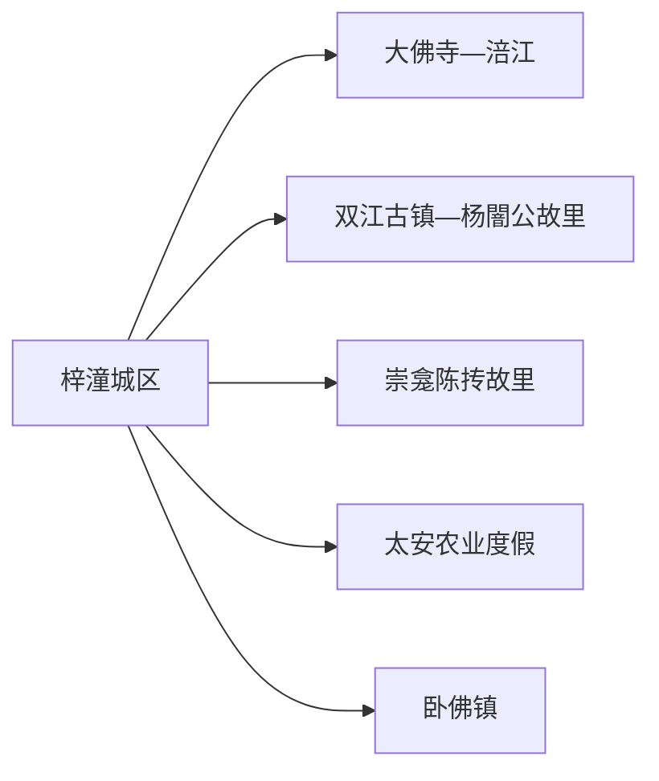
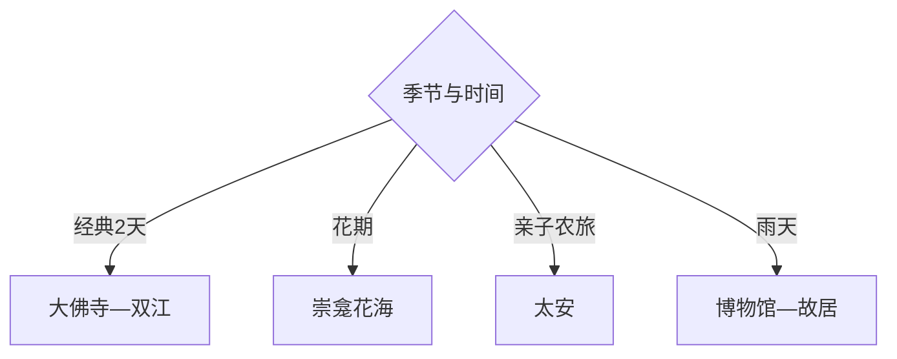

# 潼南旅行指南

潼南最适合沿涪江组织：大佛寺与城区看石刻和江岸，双江古镇与杨闇公故里看近现代史，崇龛陈抟故里则依油菜花季节决定。两天可覆盖人文核心，花期或农业度假再增加一天。

## 城市速览

| 项目 | 信息 |
|---|---|
| 主线 | 梓潼城区—大佛寺—双江古镇—杨闇公故里—陈抟故里 |
| 停留 | 人文核心2天；花田或农业度假另加1天 |
| 住宿 | 城区换线方便，双江适合古镇夜宿，崇龛只在花期考虑 |
| 交通 | 从重庆或成都方向铁路、公路进入，远端镇街用公交、正规包车或自驾 |
| 风险 | 涪江水情、夏季高温暴雨、花期客流、古镇石板与乡道 |
| 边界 | 摩崖文物、江岸行洪区、农业生产区、宗教空间和旧居按开放范围进入 |

## 城市格局与游览区域

固定 `Zitong / GeoNames 1783700` 对应潼南区梓潼街道人口点，本页以法定区级实体 `Q1363494` 组织。梓潼是主城入口，不代表完整区名；双江、崇龛、太安和卧佛均需单独公路移动。

## 主要景点

| 景点 | 区域 | 类型 | 核心体验 | 用时 | 环境 | 体力 | 预约风险 | 天气影响 | 优先级 |
|---|---|---|---|---:|---|---|---|---|---|
| 潼南大佛寺 | 大佛街道 | 石刻与寺院 | 摩崖造像、涪江崖壁与宗教文化 | 3–5小时 | 混合 | 中 | 高 | 中 | A |
| 双江古镇 | 双江镇 | 历史古镇 | 巴渝街巷、民居与涪江支流聚落 | 3–6小时 | 混合 | 中 | 中 | 中 | A |
| 杨闇公故里 | 双江镇 | 纪念地 | 人物生平、近现代史与故居 | 2–4小时 | 混合 | 低中 | 高 | 中 | A |
| 陈抟故里·崇龛花海 | 崇龛镇 | 人文与农旅 | 陈抟文化、油菜花田与乡村景观 | 半日至1天 | 室外为主 | 中 | 很高 | 很高 | A |
| 潼南博物馆或区级展陈 | 城区 | 地方文博 | 区域历史、石刻与涪江文化 | 1.5–3小时 | 室内 | 低 | 中 | 低 | B |
| 涪江旅游度假区公开段 | 城区沿江 | 滨水休闲 | 江岸、运动与城市夜景 | 2–5小时 | 室外 | 低中 | 中 | 很高 | B |
| 太安休闲农业公开点 | 太安镇 | 农业旅游 | 蔬菜、农事体验与乡村餐饮 | 半日 | 混合 | 低中 | 高 | 高 | B |
| 马龙山卧佛公开点 | 卧佛镇 | 摩崖与宗教 | 卧佛造像与乡镇历史 | 2–4小时 | 混合 | 中 | 高 | 高 | C |

## 美食与餐饮

城区和双江可找太安鱼、凉粉、豆花、蔬菜宴与重庆家常菜。鱼类先确认计价和做法，花期乡村餐饮提前订位；农田体验尊重作业秩序，从正规接待点购买农产。

## 经典行程

### 两日基础线
**路线**：城区—大佛寺—次日双江古镇—杨闇公故里。**逻辑**：涪江石刻和近现代人文分日。**预约锚点**：大佛寺、故里场馆。**休息**：城区和双江。**删除条件**：水情异常时缩短江岸。

### 大佛寺城区线
**路线**：区级展陈—大佛寺—涪江公开岸线。**逻辑**：先建背景，再读石刻与地理。**预约锚点**：展馆和大佛寺。**休息**：城区。**删除条件**：高温或暴雨时只留室内与寺院核心。

### 双江人文线
**路线**：双江古镇—午餐—杨闇公故里—古镇夜景。**逻辑**：同镇完成古镇与人物史。**预约锚点**：纪念馆和讲解。**休息**：双江。**删除条件**：故居闭馆时保留古镇公共街巷。

### 崇龛花田线
**路线**：城区—陈抟故里—正式花田游线—返城。**逻辑**：按实时花情完整留一天。**预约锚点**：花期、接驳与停车。**休息**：景区服务区。**删除条件**：花期偏差或雨天泥泞时取消。

### 太安农旅线
**路线**：太安农业公开点—农事体验—乡村午餐—返城。**逻辑**：用成熟接待理解现代农业。**预约锚点**：活动、供餐和采摘。**休息**：太安镇。**删除条件**：农忙或接待暂停时改城区。

### 雨天线
**路线**：潼南博物馆—杨闇公故里室内展陈—城区餐饮。**逻辑**：避开花田、江岸和乡道。**预约锚点**：两馆。**休息**：城区。**删除条件**：只保留已确认开放的单馆。

### 低体力线
**路线**：区级展陈—车辆到大佛寺核心区—双江短段。**逻辑**：减少江岸长走和古镇石板。**预约锚点**：落客与无障碍。**休息**：场馆。**删除条件**：高温时保留室内展陈。

## 住宿区域

潼南城区适合铁路、公路、餐饮和多方向换线；双江古镇适合早晚街巷与人文主题；崇龛和太安乡村住宿适合花期或农旅活动，需确认供餐、热水、消防、停车和退改。

## 市内交通

潼南由铁路和高速连接重庆、成都方向。城区到双江、崇龛、太安与卧佛需核对公交及返程，花期可能启用临时交通。自驾遵守花田停车与单行组织，江岸水位变化时走官方开放道路。

## 不同旅行者须知

石刻兴趣者优先大佛寺；近现代史兴趣者选双江与杨闇公故里；亲子可选太安农业和花田正式游线；低体力者集中城区。摩崖文物、宗教活动区、行洪岸线、农田和私人院落保留明确限制。

## 行前核对

- 核对大佛寺、双江、杨闇公故里、陈抟故里、博物馆和马龙山开放。
- 核对铁路公交、涪江水情、花期接驳、暴雨高温及乡道返程。
- 摩崖造像依文保规则参观，花田走指定通道，古镇住宅与农田拍摄先沟通。

## 来源与更新记录

| 来源 | 支持内容 | 核验日期 |
|---|---|---|
| [潼南区A级旅游景区名录](https://www.cqtn.gov.cn/bm/qwhlyw/zwgk_25192/zfxxgkml_bm/jczwgk/lyly/ggfw/lyml/202603/t20260305_15496563.html) | 大佛寺、双江、杨闇公、陈抟故里与卧佛 | 2026-09-01 |
| [重庆市政府：潼南文旅](https://www.cq.gov.cn/zwgk/zfxxgkml/zdlyxxgk/ggwh/ly/zxdt/202408/t20240826_13556705.html) | 石刻、古镇、花海与农业度假结构 | 2026-09-01 |
| [潼南大佛寺至双江旅游带答复](https://www.cqtn.gov.cn/zwgk_184/jytablqkgk/wyta/202607/t20260714_15820398.html) | 大佛寺与双江的线路关系 | 2026-09-01 |
| [GeoNames 1783700](https://www.geonames.org/1783700/) | Zitong 固定主城点 | 2026-09-01 |
| [Wikidata Q1363494](https://www.wikidata.org/wiki/Q1363494) | 潼南区实体与跨库标识 | 2026-09-01 |

| 日期 | 更新 |
|---|---|
| 2026-09-01 | 首次完成潼南旅行研究，以区级结构承接梓潼街道固定记录。 |
