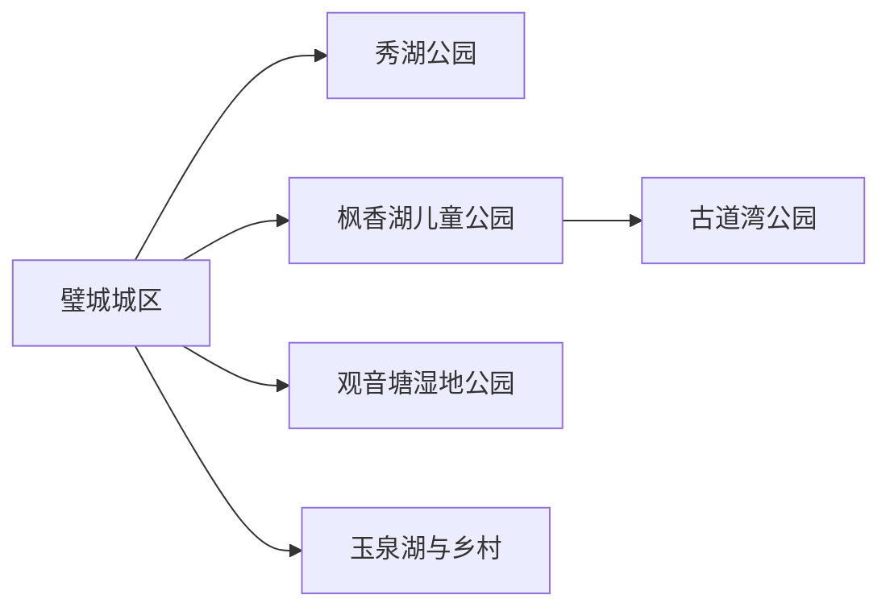
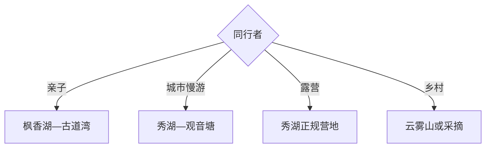

# 璧山旅行指南

璧山适合做重庆主城西侧的公园与古道短途旅行：秀湖看城市文脉与非遗，枫香湖和古道湾适合亲子与古道主题，观音塘和玉泉湖用于轻松慢游。一天可走两座相邻公园，两天再增加乡村或云雾山方向。

## 城市速览

| 项目 | 信息 |
|---|---|
| 主线 | 璧城—秀湖—枫香湖—古道湾—观音塘—玉泉湖 |
| 停留 | 城区公园1天；增加乡村与山地共2天 |
| 住宿 | 璧城轨道和餐饮方便，公园周边适合亲子，乡村住宿需预订 |
| 交通 | 从重庆主城乘轨道、公路进入，城区公园用公交、网约车与分段步行 |
| 风险 | 夏季高温雷雨、湖岸水域、儿童设施规则、露营消防和乡道 |
| 边界 | 湖库水域、湿地保育区、儿童设施、古道遗迹与农业生产区按开放范围进入 |

## 城市格局与游览区域

固定 `Bishan / GeoNames 1816329` 对应璧山区主城，本页以法定区级实体 `Q596229` 组织。核心公园环绕城区但面积较大，枫香湖与古道湾适合相连，秀湖和观音塘宜分别用短途交通衔接。

## 主要景点

| 景点 | 区域 | 类型 | 核心体验 | 用时 | 环境 | 体力 | 预约风险 | 天气影响 | 优先级 |
|---|---|---|---|---:|---|---|---|---|---|
| 秀湖公园 | 璧城 | 城市公园 | 湖岸、园林、非遗与城市夜景 | 3–6小时 | 室外为主 | 中 | 中 | 高 | A |
| 璧山区博物馆或非遗展陈 | 秀湖周边 | 地方文博 | 区域历史、古道与地方技艺 | 1.5–3小时 | 室内 | 低 | 高 | 低 | A |
| 枫香湖儿童公园 | 城区西部 | 亲子公园 | 儿童设施、湖景与家庭活动 | 3–6小时 | 室外 | 中 | 高 | 很高 | A |
| 古道湾公园 | 枫香湖以北 | 古道主题公园 | 成渝古道、耕读文化与梯田水景 | 3–5小时 | 室外 | 中 | 中 | 高 | A |
| 观音塘湿地公园 | 城区 | 湿地公园 | 水岸生态与轻步行 | 2–4小时 | 室外 | 低中 | 低 | 高 | B |
| 玉泉湖公园 | 城区周边 | 湖泊公园 | 亲水空间与城市休闲 | 2–4小时 | 室外 | 低中 | 低 | 高 | B |
| 秀湖汽车露营公园正规区 | 秀湖周边 | 露营 | 房车、帐篷与家庭休闲 | 半日至1天 | 室外 | 低中 | 高 | 很高 | B |
| 云雾山或乡村公开游线 | 区域乡镇 | 山地农旅 | 季节花果、山景与乡村慢游 | 半日至1天 | 室外 | 中 | 高 | 很高 | C |

## 美食与餐饮

璧城可找来凤鱼、璧山兔、豆花、重庆小面与家常菜，公园日优先在城区解决正餐。鱼兔类共享菜先问份量、辣度和计价；露营只在正规经营区用火，乡村采摘按当期品种与接待选择。

## 经典行程

### 一日经典线
**路线**：区级展陈—秀湖公园—城区晚餐。**逻辑**：先理解地方，再用完整半日走湖岸。**预约锚点**：展馆与当期活动。**休息**：秀湖服务点。**删除条件**：高温时缩短公园段。

### 两日公园线
**路线**：首日秀湖—观音塘；次日枫香湖—古道湾。**逻辑**：东侧慢游与西侧亲子古道分日。**预约锚点**：儿童设施和展馆。**休息**：两片区商业点。**删除条件**：雨天只留室内展陈。

### 亲子线
**路线**：枫香湖儿童公园—午休—古道湾短段。**逻辑**：先玩设施，再用古道文化收尾。**预约锚点**：儿童项目年龄和开放。**休息**：枫香湖。**删除条件**：高温或雷雨时只留短时设施。

### 古道文化线
**路线**：区级展陈—古道湾公园—耕读场景—城区。**逻辑**：从史料到情景化公园。**预约锚点**：展馆和讲解。**休息**：枫香里。**删除条件**：步道湿滑时缩短水岸段。

### 露营休闲线
**路线**：秀湖公园—正规汽车露营区—城区返程或住宿。**逻辑**：把营地作为独立经营项目。**预约锚点**：营位、消防、天气和退改。**休息**：营地。**删除条件**：大风雷雨或火险时取消。

### 乡村季节线
**路线**：官方公布乡村点—采摘或花果观察—乡镇午餐。**逻辑**：按季节选择一处成熟接待。**预约锚点**：花果期、道路与供餐。**休息**：乡镇。**删除条件**：季节偏差时改城区公园。

### 低体力线
**路线**：区级展陈—车辆游秀湖核心区—观音塘短段。**逻辑**：用平路与落客点减少长走。**预约锚点**：无障碍和休息点。**休息**：场馆。**删除条件**：高温时只留室内。

## 住宿区域

璧城轨道站与中心城区适合重庆联程、餐饮和多公园换线；秀湖周边适合城市慢住；枫香湖周边适合亲子；乡村和露营住宿只为特定活动，确认消防、卫生、餐饮、交通和退改。

## 市内交通

重庆轨道交通可到璧山，城区公园之间用公交或网约车衔接。公园面积大，入口选择比直线距离更重要；共享骑行按停车范围使用。乡村远线先锁定返程，不把水库巡查路和农业便道当作游览道路。

## 不同旅行者须知

亲子家庭优先枫香湖；古道兴趣者选古道湾；低体力者用展馆与秀湖短段；露营者选择正规营地。湖库水域、湿地保育区、儿童设施后台、农业作业区和未开放古道遗迹保留明确限制。

## 行前核对

- 核对区级展陈、各公园、儿童设施、露营区和乡村活动开放。
- 核对轨道公交、入口停车、雷雨高温、水情、消防与返程。
- 亲水活动按护栏和水域规则，露营依经营区管理，采摘走正规接待点。

## 来源与更新记录

| 来源 | 支持内容 | 核验日期 |
|---|---|---|
| [璧山公园景区旅游高峰](https://www.bishan.gov.cn/sy_241/ywdt/202505/t20250504_14578345.html) | 秀湖、枫香湖、古道湾、玉泉湖、观音塘与露营 | 2026-09-01 |
| [璧山区公园出行攻略](https://www.bishan.gov.cn/zjbs/rmjd/202301/t20230117_11512668_wap.html) | 古道湾历史主题、面积与交通 | 2026-09-01 |
| [GeoNames 1816329](https://www.geonames.org/1816329/) | Bishan 固定主城点 | 2026-09-01 |
| [Wikidata Q596229](https://www.wikidata.org/wiki/Q596229) | 璧山区实体与跨库标识 | 2026-09-01 |

| 日期 | 更新 |
|---|---|
| 2026-09-01 | 首次完成璧山旅行研究，按城市公园、古道、亲子与乡村组织。 |
