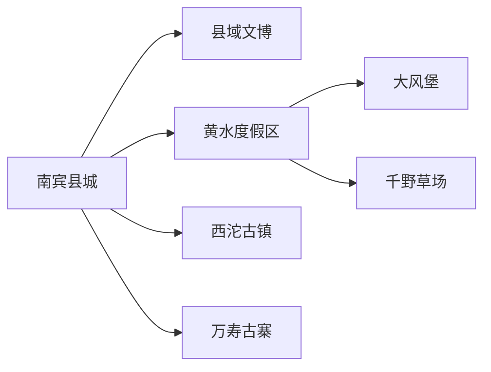
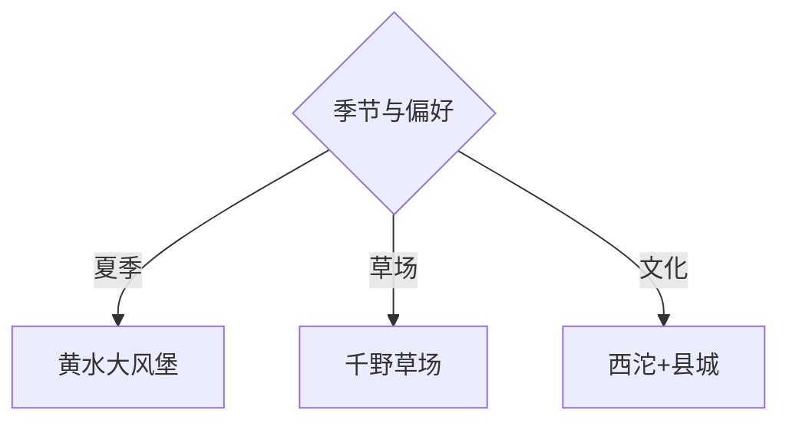

# 石柱旅行指南

石柱以南宾县城为交通和补给基地，黄水—大风堡是高山森林与避暑核心，千野草场、西沱古镇和万寿古寨分属不同方向。夏季住宿需求集中，冬季冰雪项目和山地道路变化快；先选择黄水高山线或西沱长江线，再组合县城文化。

## 城市速览

| 项目 | 信息 |
|---|---|
| 主线 | 南宾县城—黄水大风堡—千野草场或西沱 |
| 停留 | 县城1天；每条高山或古镇远线另留1天 |
| 住宿 | 南宾便于交通；黄水适合避暑；西沱适合长江古镇 |
| 交通 | 高铁、公路、景区接驳与合规包车 |
| 风险 | 山雾、雷雨、冬季结冰、森林防火、草场天气与长江岸线 |
| 边界 | 森林公园、湿地、草场生产、古镇居民区和水域分别管理 |

## 城市格局与游览区域

南宾承担高铁和住宿，黄水位于东北高海拔片区，西沱靠长江，千野草场和万寿古寨另需公路接驳。固定清单以大歇镇记录 **GeoNames 1813315** 建页并承接石柱县；固定 **Nanbin / GeoNames 1800175** 对应南宾街道及县城连续建成区，由本页的交通、住宿、文博和多方向补给模块完整承接。Wikidata `Q1378010` 暂无 P1566，页面用实体、行政代码与固定城市点共同说明粒度。

## 主要景点

| 景点 | 区域 | 类型 | 核心体验 | 用时 | 环境 | 体力 | 研究价值 | 拥挤 | 优先级 |
|---|---|---|---|---:|---|---|---|---|---|
| 黄水国家森林公园与大风堡 | 黄水 | 森林山地 | 原始森林、登高与避暑 | 1天 | 室外 | 高 | 高 | 高 | A |
| 千野草场正式景区 | 鱼池方向 | 高山草场 | 草地、石芽、森林与季节景观 | 1天含往返 | 室外 | 中高 | 高 | 高 | A |
| 西沱古镇 | 长江沿岸 | 历史古镇 | 巴盐古道、云梯街与土家风味 | 1天含往返 | 混合 | 中高 | 很高 | 中 | A |
| 万寿古寨 | 县城近郊 | 民族文化 | 秦良玉文化、土家建筑与演艺 | 3–5小时 | 混合 | 中 | 中高 | 中 | B |
| 石柱县城公共文化场馆 | 南宾 | 文博 | 土家历史、非遗与县域地理 | 2–3小时 | 室内 | 低 | 高 | 低 | B |
| 广寒宫等正式岩溶景区 | 县域山地 | 溶洞地质 | 洞穴地貌与地质科普 | 半日至1天 | 室内 | 中 | 中高 | 中 | C |

大风堡与黄水森林按景区公开步道通行；千野草场仍包含牧业和生态空间，使用正式道路、营地与体验项目。西沱古镇尊重居民日常和文物保护范围。

## 美食与餐饮

土家腊肉、莼菜、米米茶、油绞绞、都巴和菌菇汤适合县城、黄水与西沱正规餐馆体验。腊味先问盐度，菌菇选择可追溯食材并彻底烹熟；说明辣度、花生芝麻和共享锅具。

## 经典行程

### 三日基础线
**路线**：南宾县城—黄水大风堡—千野草场或西沱。**逻辑**：县城加两条不同方向。**预约锚点**：高铁、住宿和景区车辆。**休息**：黄水午后。**删除条件**：山地天气不佳时改西沱文化线。

### 黄水森林线
**路线**：黄水—大风堡—森林公园公开步道。**逻辑**：用完整一天处理海拔和步行。**预约锚点**：门票、接驳和天气。**休息**：景区服务点。**删除条件**：雷雨、结冰或防火管制时取消。

### 千野草场线
**路线**：住宿—千野草场正规入口—返程。**逻辑**：草场独立成日。**预约锚点**：开放、营地和道路。**休息**：游客中心。**删除条件**：大雾、雷雨或草场管制时改县城。

### 西沱巴盐古道线
**路线**：南宾—西沱古镇—云梯街—返程或住宿。**逻辑**：沿长江理解盐运与古镇商业。**预约锚点**：交通、演出和文保开放。**休息**：古镇餐饮。**删除条件**：岸线或街区施工时缩短线路。

### 土家文化线
**路线**：县城场馆—万寿古寨—正规非遗活动。**逻辑**：先文博后体验。**预约锚点**：演出、讲解和返程。**休息**：县城。**删除条件**：停演时保留场馆。

### 冬季冰雪线
**路线**：黄水或冷水正规冰雪项目—山地住宿。**逻辑**：围绕当期运营项目安排行程。**预约锚点**：雪况、装备、保险和道路。**休息**：室内暖区。**删除条件**：道路结冰、停运或装备不适时取消。

### 低体力线
**路线**：县城场馆—车辆到万寿古寨—黄水短线。**逻辑**：减少森林爬升和古镇长阶梯。**预约锚点**：落客、电瓶车和座椅。**休息**：午后酒店。**删除条件**：长途山路不适时只留县城。

## 住宿区域

南宾县城适合高铁、餐饮和多方向出发；黄水适合夏季避暑与连续山地日；西沱适合古镇夜晚。旺季提前确认空调供暖、停车、早餐、景区接驳、潮湿和退改。

## 市内交通

石柱县城、黄水、千野草场与西沱之间距离明显。高铁到站后先进入住宿地，远线按日约车；夏季周末和冬季冰雪期预留拥堵、雾和结冰缓冲。

## 不同旅行者须知

徒步者优先大风堡正式步道；文化爱好者选择西沱和县城场馆；亲子进入正规草场与冰雪项目；长者住黄水并选择短步道；摄影者尊重居民、牧业和非遗表演规则。

## 行前核对

- 核对大风堡、千野草场、西沱、万寿古寨和冰雪项目开放。
- 核对高铁接驳、山雾雷雨、森林防火、冬季结冰和旺季住宿。
- 森林、湿地、草场生产、古镇居民区和长江岸线按管理边界进入。

## 来源与更新记录

| 来源 | 支持内容 | 核验日期 |
|---|---|---|
| [重庆市政府：风情土家·康养石柱](https://www.cq.gov.cn/ywdt/zwhd/qxdt/202007/t20200724_8627819.html) | 黄水、大风堡、千野草场、西沱与土家美食 | 2026-09-01 |
| [重庆市政府：石柱山地景区](https://www.cq.gov.cn/zwgk/zfxxgkml/zdlyxxgk/ggwh/ly/zxdt/202502/t20250219_14321289.html) | 大风堡、千野草场和西沱古镇 | 2026-09-01 |
| [民政部行政区划代码查询](https://dmfw.mca.gov.cn/xzqh/getList?code=50&trimCode=true&maxLevel=3) | 石柱县行政层级与代码 | 2026-09-01 |
| [重庆市政府：石柱县设置南宾街道的批复](https://www.cq.gov.cn/zwgk/zfxxgkml/szfwj/qtgw/201510/t20151014_8613740.html) | 南宾镇撤镇设立南宾街道及其石柱县归属 | 2026-09-04 |
| [GeoNames 1813315](https://www.geonames.org/1813315/) | Daxie 固定城市点 | 2026-09-01 |
| [Wikidata Q1378010](https://www.wikidata.org/wiki/Q1378010) | 石柱县实体 | 2026-09-01 |

| 日期 | 更新 |
|---|---|
| 2026-09-04 | 补充 Nanbin / GeoNames 1800175 与南宾街道、石柱县城的对应关系。 |
| 2026-09-01 | 首次完成石柱旅行研究；建立黄水森林、千野草场、西沱与土家文化路线 |
