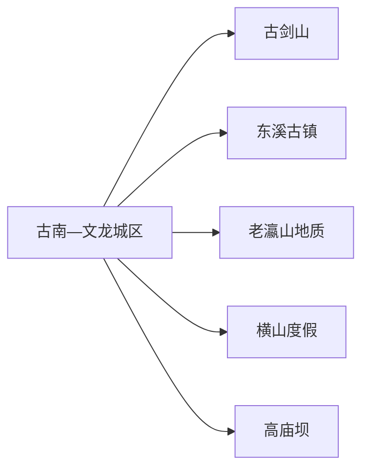
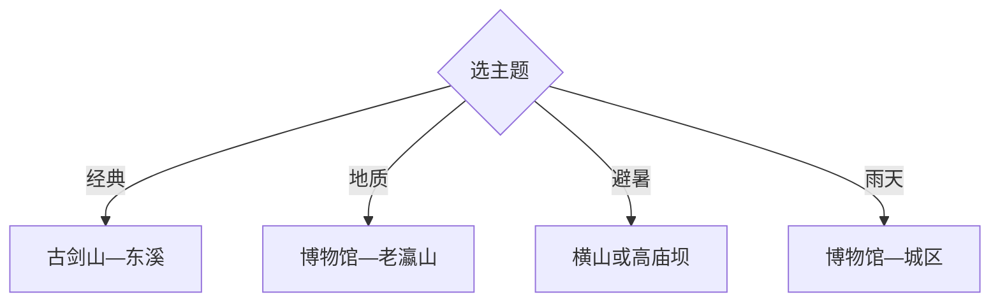

# 綦江旅行指南

綦江适合用“三山一镇”理解：古剑山近城区，老瀛山看恐龙足迹与丹霞，横山和高庙坝偏避暑度假，东溪古镇则串起盐马古道与码头历史。两天选古剑山和东溪，三天再补一条地质或避暑线。

## 城市速览

| 项目 | 信息 |
|---|---|
| 主线 | 古南城区—綦江博物馆—古剑山—东溪古镇—老瀛山 |
| 停留 | 核心2天；增加地质或避暑方向共3天 |
| 住宿 | 城区换线方便，古剑山和横山适合度假，东溪适合古镇早晚 |
| 交通 | 从重庆主城铁路或公路进入，远端镇街用公交、正规包车或自驾 |
| 风险 | 山地雷雨雾霾、丹霞湿滑、防火、古镇坡道与乡道夜行 |
| 边界 | 綦江区与万盛经开区管理口径需区分；化石遗迹、林地、宗教空间和矿业区有明确限制 |

## 城市格局与游览区域

固定 `Gunan / GeoNames 1809380` 对应綦江区古南街道人口点，本页以法定区级实体 `Q714216` 组织。万盛经开区与綦江存在历史和行政联系，但黑山谷等由万盛经开区管理，本页不把其作为綦江区内核心景点。

## 主要景点

| 景点 | 区域 | 类型 | 核心体验 | 用时 | 环境 | 体力 | 预约风险 | 天气影响 | 优先级 |
|---|---|---|---|---:|---|---|---|---|---|
| 綦江博物馆 | 城区 | 地方文博 | 地方史、版画与地质背景 | 1.5–3小时 | 室内 | 低 | 中 | 低 | A |
| 古剑山景区 | 城区西北 | 山地与宗教 | 丹霞、净音寺、云海与度假 | 半日至1天 | 混合 | 中高 | 高 | 很高 | A |
| 东溪古镇 | 东溪镇 | 历史古镇 | 盐马古道、黄桷树、太平桥与清代建筑 | 半日至1天 | 混合 | 中 | 中 | 中 | A |
| 老瀛山景区公开区 | 三角方向 | 地质与山地 | 恐龙足迹、木化石与丹霞 | 半日至1天 | 室外为主 | 高 | 高 | 很高 | A |
| 横山旅游度假区 | 横山镇 | 山地度假 | 避暑、乡村与慢生活 | 半日至1天 | 混合 | 中 | 高 | 高 | B |
| 高庙坝旅游度假区 | 郭扶镇 | 森林与乡村 | 高海拔避暑、峡谷与露营 | 1天 | 室外 | 中高 | 高 | 很高 | B |
| 石壕红军烈士墓 | 石壕镇 | 纪念地 | 长征历史与纪念空间 | 2–4小时 | 混合 | 中 | 高 | 中 | B |
| 綦河城区公开岸线 | 城区 | 滨水空间 | 河谷城市、桥梁与日常休闲 | 1–3小时 | 室外 | 低 | 低 | 高 | B |

## 美食与餐饮

城区和东溪可找北渡鱼、东溪豆腐乳、黄荆豆花、黑鸭子、清泉鱼与重庆小面。鱼类和共享菜先问份量、辣度及计价；避暑村镇提前确认供餐，农产从正规经营点购买。

## 经典行程

### 两日基础线
**路线**：城区—古剑山—次日东溪古镇。**逻辑**：近城山地和南部古镇分日。**预约锚点**：古剑山和古镇场馆。**休息**：城区与东溪。**删除条件**：雨雾时缩短山路。

### 古剑山线
**路线**：正式入口—核心步道—净音寺公开区—度假区休息。**逻辑**：完整半日至一日处理爬升。**预约锚点**：入口、防火和天气。**休息**：服务区。**删除条件**：雷雨、结冰或封山时取消。

### 东溪古镇线
**路线**：太平桥—古街—公开会馆—午餐—盐马古道短段。**逻辑**：建筑、码头史与饮食在同镇展开。**预约锚点**：场馆与讲解。**休息**：古镇。**删除条件**：湿滑时取消古道段。

### 地质研学线
**路线**：綦江博物馆—老瀛山正式入口—地质科普区。**逻辑**：先看展陈，再观察化石与丹霞。**预约锚点**：景区、讲解与保护要求。**休息**：游客中心。**删除条件**：强降雨或地质点管控时改博物馆。

### 避暑度假线
**路线**：横山或高庙坝二选一—乡村午餐—短步道。**逻辑**：按住宿和路况选择单一高地。**预约锚点**：住宿、道路和活动。**休息**：度假区。**删除条件**：浓雾或道路预警时取消。

### 红色文化线
**路线**：城区展陈—石壕红军烈士墓—镇区返程。**逻辑**：从史实展陈到纪念地。**预约锚点**：接待、讲解和车辆。**休息**：石壕镇。**删除条件**：纪念地维护时只留城区。

### 低体力线
**路线**：綦江博物馆—车辆游綦河岸线—东溪古镇平缓短段。**逻辑**：减少山地与古道。**预约锚点**：落客和无障碍。**休息**：场馆与古镇。**删除条件**：高温时只留室内。

## 住宿区域

古南—文龙城区适合铁路、公路和多方向换线；古剑山适合山地度假；东溪适合古镇早晚；横山、高庙坝适合避暑慢住。远端住宿核对供餐、热水、消防、道路和退改。

## 市内交通

綦江通过铁路和高速连接重庆主城，古剑山较近，东溪、老瀛山、横山和高庙坝需分别核对公交与返程。山路受雾、雨和冬季结冰影响。前往万盛经开区另查其交通和管理公告，不以行政邻近代替景区接驳。

## 不同旅行者须知

古镇兴趣者选东溪；地质兴趣者选老瀛山；避暑旅行者选横山或高庙坝；低体力者集中城区和东溪短段。化石遗迹、林区封控段、宗教活动区、矿业生产区和万盛管理边界保留明确限制。

## 行前核对

- 核对博物馆、古剑山、东溪、老瀛山、横山、高庙坝和石壕开放。
- 核对铁路公交、山路雾雨、地灾防火、冬季结冰与远线返程。
- 地质遗迹按科普线路参观，古镇住宅与宗教空间尊重现场秩序，跨万盛行程另查属地公告。

## 来源与更新记录

| 来源 | 支持内容 | 核验日期 |
|---|---|---|
| [綦江旅游资源](https://cqqj.gov.cn/zjqj_159/lyzy/lyzyzs/202003/t20200318_5739679.html) | 三山一镇、博物馆、地质、红色与度假资源 | 2026-09-01 |
| [綦江文旅“十四五”规划](https://www.cqqj.gov.cn/zwgk_159/zfxxgkml/zdjcygk/jcx/202212/t20221230_11440990.html) | 地质研学、乡村度假与集散结构 | 2026-09-01 |
| [GeoNames 1809380](https://www.geonames.org/1809380/) | Gunan 固定主城点 | 2026-09-01 |
| [Wikidata Q714216](https://www.wikidata.org/wiki/Q714216) | 綦江区实体与跨库标识 | 2026-09-01 |

| 日期 | 更新 |
|---|---|
| 2026-09-01 | 首次完成綦江旅行研究，以区级结构承接古南固定记录。 |
