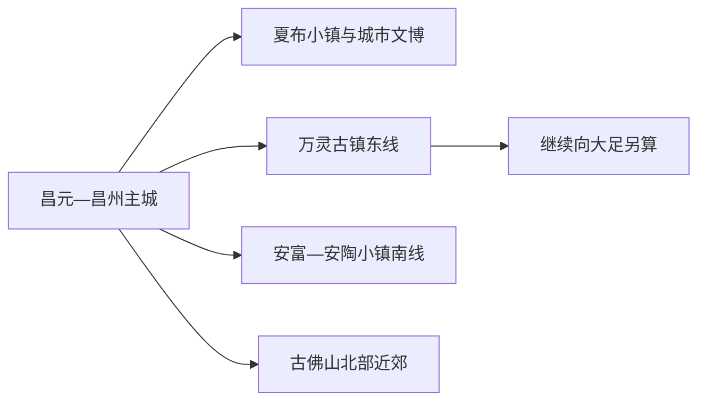
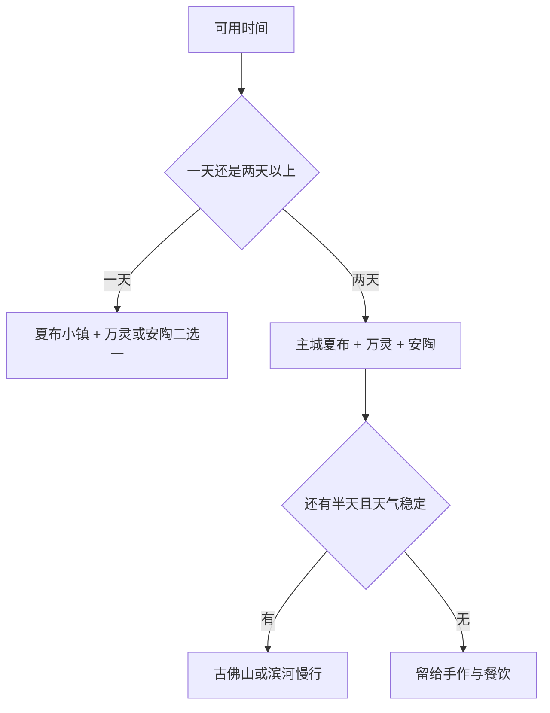

# 荣昌旅行指南

荣昌位于成渝主轴之间，最鲜明的旅行线索是夏布、荣昌陶、折扇三项非遗，以及万灵古镇的濑溪河生活。主城适合先看夏布和城市文博，再把万灵古镇或安陶小镇安排成半日远线；这样既能看到技艺，也给制陶、织布体验和地方餐饮留出从容时间。

> 建议停留：2 天；增加古佛山或深度手作体验可安排 3 天 
> 旅行关键词：夏布、荣昌陶、万灵古镇、濑溪河、荣昌卤鹅 
> 主要体力：低至中等；古镇坡道与古佛山为中等 
> 最近研究：2026-08-12

## 城市速览

| 项目 | 旅行信息 |
|---|---|
| 主要旅行价值 | 用夏布小镇、安陶小镇和万灵古镇串起材料、手艺、商贸与河岸生活，比只买一件文创更容易理解荣昌非遗。 |
| 建议停留 | 1 天可选主城加一个小镇；2 天覆盖夏布、安陶与万灵；3 天增加古佛山、滨河慢行或完整手作课程。 |
| 较舒适季节 | 春秋适合古镇和滨水步行；夏季把室内博物馆、午休与傍晚街区组合；冬季适合非遗体验和热食。 |
| 预算特点 | 开放街区与公共文化空间成本较低，主要增量来自手作课程、跨镇车辆、住宿和节庆消费。 |
| 步行强度 | 夏布小镇和主城可分段平缓步行；万灵石板路、临河台阶与古佛山游线更考验膝踝。 |
| 主要天气风险 | 夏季高温与强对流、汛期河岸水位、冬季低温湿滑；山地和古镇游线按现场开放调整。 |
| 独行旅行 | 主城与三个成熟小镇较易安排，远线返程宜提前确认；手作体验先锁定开课时间。 |
| 亲子旅行 | 夏布、陶艺和博物馆适合做主题日；临河、窑火、工具和山路段需持续看护。 |
| 长者与低体力旅行 | 以夏布小镇、博物馆和车辆落客为主，万灵只走河街短段，安陶保留博物馆与一项体验。 |
| 无障碍信息 | 新建场馆与部分街区有平缓入口，古镇和山地仍有台阶、石板与坡道；设施连续性需向官方确认。 |

### 地名记录与现行边界

本页以重庆市辖区 **500153** 为旅行边界。固定记录 **GeoNames 1815477** 名为 `Changyuan`，对应荣昌主城昌元街道一带的居民点；法定荣昌区实体是 **Wikidata Q1331275**，其 `P1566=1797123` 指向较广的行政记录。页面保留固定城市点作为覆盖键，以法定代码界定整个荣昌区，不把昌元街道等同于全区。

## 城市格局与游览区域

荣昌可按“昌元—昌州主城、万灵东线、安富南线、古佛山北部”理解。夏布小镇位于城区滨水带，适合抵达日；万灵和安陶分处不同方向，各自都值得半天。大足、永川和泸州已经是跨区或跨市行程。

| 区域 | 主要内容 | 游览特点 | 与其他区域的关系 |
|---|---|---|---|
| 昌元—昌州主城 | 夏布小镇、城市公共文化、濑溪河滨水 | 室内外容易切换，餐饮和住宿集中 | 适合抵达日，也可作为三个远线的换宿基地 |
| 万灵镇 | 万灵古镇、寨门、会馆与河岸 | 古镇石板路和临河空间并存，节庆时人流较大 | 距主城约半日尺度，与安陶分开安排更从容 |
| 安富街道 | 安陶小镇、荣昌陶博物馆与制陶体验 | 以陶器生产、展陈和手作为主 | 体验课程决定停留时长，可与主城同日 |
| 古佛山方向 | 茶竹景观、乡村休闲与正式开放步道 | 季节和天气影响明显 | 适合作为第三天选项，返程车辆需预留 |

## 主要景点

| 景点 | 区域 | 类型 | 主要看点 | 建议用时 | 室内外 | 体力 | 预约风险 | 天气影响 | 优先级 |
|---|---|---|---|---:|---|---|---|---|---|
| 夏布小镇（含中国夏布博物馆） | 主城 | 非遗街区与博物馆 | 苎麻到夏布的工艺、作坊、廊桥与滨水空间 | 2–4 小时 | 混合 | 低 | 中 | 低至中 | A |
| 万灵古镇 | 万灵镇 | 历史古镇 | 寨门、会馆、宗祠、河街与地方生活 | 3–5 小时 | 室外为主 | 中 | 中 | 中至高 | A |
| 安陶小镇（含荣昌陶博物馆） | 安富街道 | 非遗小镇与博物馆 | 荣昌陶历史、陶宝古街、窑业空间和制陶体验 | 3–5 小时 | 混合 | 低至中 | 高 | 低 | A |
| 荣昌城市公共文化场馆 | 主城 | 博物馆与公共文化 | 地方历史、非遗专题与临时展览 | 1.5–3 小时 | 室内 | 低 | 中 | 低 | B |
| 濑溪河—荣峰河滨水短段 | 主城 | 城市滨水 | 河岸、桥梁与日常休闲 | 1–2 小时 | 室外 | 低 | 低 | 高 | B |
| 古佛山正式开放游线 | 北部近郊 | 山地与茶竹景观 | 茶竹、浅丘和乡村景观 | 3–5 小时 | 室外 | 中 | 中 | 高 | C |

同一小镇内部的博物馆、古街和体验作坊按一个完整目的地安排。手作课程、临展和节庆属于动态内容，先确认开课与开放，再决定是否延长停留。

## 美食与餐饮

| 菜品或餐饮类型 | 常见区域 | 一个人用餐与常见份量 | 风味、过敏原与饮食限制 | 排队风险与替代方法 |
|---|---|---|---|---|
| 荣昌卤鹅 | 主城、万灵及正规熟食店 | 可按小份或称重购买，适合配饭面 | 含禽肉，卤汁可能含大豆、小麦和香辛料 | 先确认单价与重量，售罄时选同类正规熟食店 |
| 黄凉粉 | 主城与小镇餐馆 | 一碗适合单人加餐 | 辣椒、花椒、豆制调味和花生碎需询问 | 午餐高峰可换普通面馆 |
| 铺盖面与地方面食 | 主城 | 单人友好，可加卤味或小菜 | 面食含小麦，汤底可能含猪油或骨汤 | 选择菜单清楚的社区店即可 |
| 猪儿粑、艾粑 | 市场与节庆集市 | 适合作为点心，馅料份量小 | 糯米黏性高，馅料可能含猪肉、芝麻或花生 | 现做数量有限，改选蒸糕类点心 |
| 羊肉汤与乡镇热食 | 主城、安富等 | 常按碗或锅，单人先问小份 | 含羊肉和动物脂肪，蘸料可能辛辣 | 冬季高峰提前就餐，或选清汤面饭 |

## 经典行程

### 一日经典路线

**路线**：夏布小镇 → 午餐 → 万灵古镇或安陶小镇二选一

- **串联逻辑**：先在主城理解夏布，再用一个远线深入古镇生活或陶艺，换乘次数可控。
- **预约锚点**：夏布博物馆、陶博物馆和手作课程；选择万灵时核对古建筑开放与返程车。
- **休息安排**：午餐放在主城，远线抵达后先找游客中心或茶饮座位。
- **时间不足时**：保留夏布小镇，远线只选一个核心街区。

### 两日城市路线

**第 1 天**：夏布小镇 → 城市文博 → 濑溪河滨水短段  
**第 2 天**：万灵古镇 → 午餐 → 安陶小镇

- **串联逻辑**：第一天步行和室内结合，第二天用车辆连接两个文化小镇。
- **预约锚点**：第二天手作课程和两段车辆；万灵节庆日同步核停车与入场。
- **休息安排**：两天都把正午留给室内或餐馆，安陶体验前安排坐休。
- **时间不足时**：第二天取消其中一个小镇，不压缩两个体验。

### 三日深度路线

**第 1 天**：主城夏布与文博  
**第 2 天**：万灵古镇完整半日—一日  
**第 3 天**：安陶小镇深度手作，或天气稳定时选择古佛山

- **串联逻辑**：按非遗材料、古镇商贸、陶艺或山地主题分日，体验更完整。
- **预约锚点**：第三天手作或古佛山运营信息。
- **休息安排**：每天只设一个高投入主题，下午保留返城和用餐缓冲。
- **时间不足时**：第三天优先保留安陶，古佛山留待下次。

### 雨天路线

**路线**：夏布博物馆 → 城市公共文化场馆 → 安陶博物馆与室内体验

- **适用条件**：普通降雨可执行；暴雨、河流预警或道路管制时以主城单馆为主。
- **串联逻辑**：三个室内节点按主城到安富方向组合，减少古镇石板和山路停留。
- **预约锚点**：场馆开放与陶艺课程。
- **休息安排**：午间在主城，下午体验过程中分段坐休。
- **时间不足时**：保留夏布与安陶二选一。

### 亲子或低体力路线

**亲子路线**：夏布小镇短展 → 午餐 → 安陶小镇单项手作  
**低体力路线**：车辆落客夏布博物馆 → 主城午餐 → 万灵入口河街短段或荣昌陶博物馆

- **减负方式**：亲子只安排一项动手体验；低体力路线用车辆连接，古镇遇坡即折返。
- **预约锚点**：课程年龄、时长、工具和场馆无障碍入口。
- **休息安排**：每 60–90 分钟安排室内座位，午后避开高温。
- **时间不足时**：两类路线都保留一个博物馆和一顿地方餐。

### 远郊一日路线

**路线**：主城 → 万灵古镇完整游览 → 返回主城；或主城 → 古佛山开放游线 → 返回

- **适用条件**：车辆和天气稳定；两个远郊方向分别成行。
- **串联逻辑**：每条线只处理一个远端主题，避免把跨镇车程挤进体验时间。
- **预约锚点**：古镇活动、古佛山入口和返程车辆。
- **休息安排**：在游客服务区或乡镇餐馆完成午休。
- **时间不足时**：万灵只走核心河街；古佛山改为主城滨水。

## 住宿区域

| 区域 | 优点 | 代价 | 适合人群 | 交通提示 |
|---|---|---|---|---|
| 昌元—昌州主城 | 餐饮、车站和公共服务集中 | 前往万灵、安富仍需乘车 | 首访、公共交通旅行、两日以上 | 预订时核对距荣昌北站或市内上车点 |
| 夏布小镇周边 | 夜间散步和非遗街区便利 | 活动日可能较热闹 | 喜欢滨水与夜间街区 | 选择正规住宿并确认停车、隔音 |
| 万灵或安陶主题住宿 | 可延长古镇或陶艺体验 | 班次、夜间餐饮和返程选择较少 | 自驾、手作与慢旅行 | 先确认实际地址、接待资质和次日车辆 |

## 市内交通

荣昌北站承担主要铁路到发，具体车次以 12306 为准；抵达后前往万灵、安富和古佛山需要公交、出租或预约车辆。小镇之间并非连续步行范围，两日路线可把主城作为中转，减少携带行李跨镇移动。

| 方式 | 适用场景 | 核对重点 |
|---|---|---|
| 铁路 | 成都、重庆等方向抵达 | 荣昌北站车次、实名、末班接驳 |
| 公交 | 主城与部分镇街 | 站名、班次、末班、节庆绕行 |
| 出租与网约车 | 主城到小镇、低体力路线 | 单程价格、返程接单和上客点 |
| 自驾 | 万灵、安陶、古佛山组合 | 停车、酒后驾驶、雨雾与乡道 |

## 不同旅行者须知

- **独行者**：先锁返程，再决定是否停留到古镇夜间活动；体验课程保留订单和联系方式。
- **亲子家庭**：把陶艺、织布和博物馆组合成一个主题日，窑火、工具、河岸和台阶持续看护。
- **长者与低体力旅行者**：主城住宿、车辆落客、单馆慢看更舒适；古镇按入口短段往返。
- **无障碍旅行者**：逐馆确认坡道、电梯、卫生间和停车落客点，古镇石板路准备替代方案。
- **过敏与饮食限制**：卤汁、面食、花生芝麻和肉汤逐项询问，优先选择能说明配料的正规餐馆。
- **生产与保护空间**：陶器、夏布和畜牧生产场所按正式接待项目参观；河岸、窑场、茶园和山林沿开放路线活动。

## 行前核对

| 核对事项 | 建议时间 | 官方入口 |
|---|---|---|
| 三个文化小镇开放、活动与体验 | 订行程前及前一日 | [重庆市政府荣昌之旅](https://www.cq.gov.cn/zjcq/cycq/jplyxl/zby/bjydr/202408/t20240808_13482553.html)、各景区正式渠道 |
| 场馆闭馆日与课程 | 前一日 | 荣昌区政府、场馆正式账号 |
| 铁路与跨镇交通 | 购票前、出发当天 | [中国铁路 12306](https://www.12306.cn/) |
| 高温、暴雨、河流和山地风险 | 出发前三日及当天 | [重庆市气象局](https://cq.cma.gov.cn/) |
| 无障碍、儿童与长者服务 | 预订前 | 场馆或景区服务电话 |

## 来源与更新记录

### 主要来源

| 来源 | 支持内容 | 核验日期 |
|---|---|---|
| [民政部行政区划代码查询](https://dmfw.mca.gov.cn/) | 荣昌区代码 500153 与市辖区身份 | 2026-08-12 |
| [Wikidata Q1331275](https://www.wikidata.org/wiki/Q1331275) | 荣昌区实体及 P1566 行政记录 | 2026-08-12 |
| [GeoNames 1815477](https://www.geonames.org/1815477/changyuan.html) | 固定昌元主城点 | 2026-08-12 |
| [重庆市政府：荣昌之旅](https://www.cq.gov.cn/zjcq/cycq/jplyxl/zby/bjydr/202408/t20240808_13482553.html) | 万灵、夏布、安陶三条主线 | 2026-08-12 |
| [重庆市政府：荣昌文化](https://cq.gov.cn/ywdt/zwhd/qxdt/202308/t20230823_12265448.html) | 古镇、非遗场馆与饮食背景 | 2026-08-12 |
| [重庆市文旅委：荣昌文旅项目](https://whlyw.cq.gov.cn/zwxx_221/ztzl/wlcy/zcxq/202601/t20260122_15344325.html) | 2026 年非遗与景区服务现状 | 2026-08-12 |
| [重庆市政府：2026 春节文旅](https://cq.gov.cn/ywdt/zwhd/qxdt/202602/t20260227_15460580.html) | 夏布、安陶、万灵、古佛山当期活动 | 2026-08-12 |
| [重庆市文旅委建议答复](https://whlyw.cq.gov.cn/zwgk_221/zfxxgkml/jyta/rdjy/202406/t20240628_13334805.html) | 荣昌陶博物馆与非遗体验业态 | 2026-08-12 |
| [荣昌水美乡村资料](https://www.cq.gov.cn/ywdt/zwhd/qxdt/202404/t20240430_13170796.html) | 河岸、安富陶艺和乡村生产边界 | 2026-08-12 |
| [中国铁路 12306](https://www.12306.cn/) | 铁路时刻与票务动态入口 | 2026-08-12 |

### 更新记录

| 日期 | 更新内容 |
|---|---|
| 2026-08-12 | 首次系统整理固定昌元点与荣昌区边界、三大非遗小镇、路线、饮食、交通、天气和生产保护边界。 |
