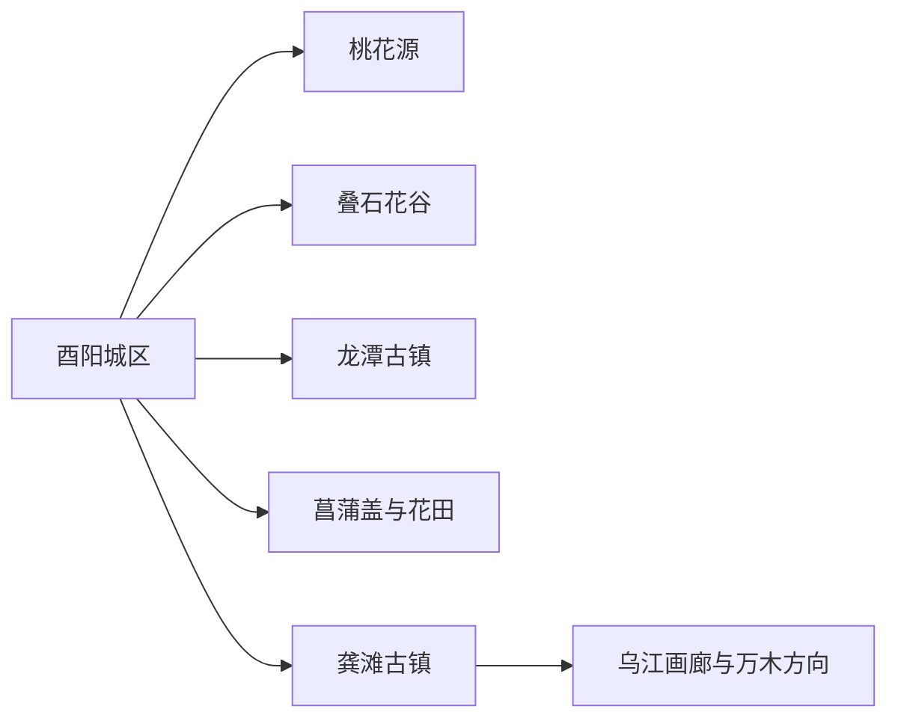
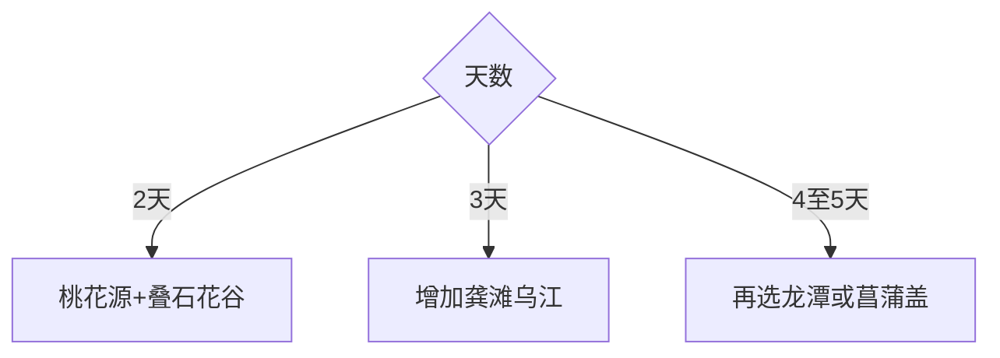

# 酉阳旅行指南

酉阳位于武陵山区腹地，县城桃花源、龚滩古镇—乌江画廊、叠石花谷—菖蒲盖与龙潭古镇构成多方向旅行。山路距离明显，县城与龚滩分别住宿，可以减少折返并给游船、古镇和民俗体验留出完整时段。

## 城市速览

| 项目 | 信息 |
|---|---|
| 主线 | 县城桃花源—叠石花谷—龚滩古镇乌江画廊—龙潭古镇—菖蒲盖 |
| 停留 | 县城2天；龚滩与乌江另留1–2天 |
| 住宿 | 县城便于桃花源与铁路；龚滩适合古镇夜间与游船；菖蒲盖方向适合山地慢游 |
| 交通 | 铁路到站后转公路，县域远线以客运、景区车和包车为主 |
| 风险 | 山路、强降雨、山洪落石、乌江水位、冬季结冰与节庆客流 |
| 边界 | 地质公园、洞穴、航道、文物建筑、村寨与农田分别管理 |

## 城市格局与游览区域

桃花源贴近县城，龚滩位于乌江远线，龙潭与菖蒲盖又是不同方向。固定清单的 **GeoNames 8407506 Wanmu** 对应酉阳县万木镇，本页以县域尺度承接万木至龚滩的乌江关系；Wikidata `Q1331332` 与法定代码 `500242` 锁定自治县边界，其 P1566 为行政记录 `1786135`。

## 主要景点

| 景点 | 区域 | 类型 | 核心体验 | 用时 | 环境 | 体力 | 研究价值 | 拥挤 | 优先级 |
|---|---|---|---|---:|---|---|---|---|---|
| 酉阳桃花源景区 | 县城 | 岩溶文化 | 洞穴、山水与桃源文化表达 | 半日至1天 | 混合 | 中高 | 高 | 高 | A |
| 龚滩古镇 | 乌江 | 历史古镇 | 石板街、吊脚楼与峡江聚落 | 1天 | 混合 | 中高 | 很高 | 旺季高 | A |
| 乌江画廊正规游船 | 龚滩—万木方向 | 峡江水域 | 乌江峡谷、古镇与山地地貌 | 半日 | 室外 | 中 | 很高 | 旺季高 | A |
| 叠石花谷景区 | 县城近郊 | 地质研学 | 叠石艺术、花谷与地质科普 | 3–5小时 | 室外 | 中 | 中 | 花期中高 | B |
| 龙潭古镇及赵世炎故居开放区 | 龙潭 | 古镇文物 | 会馆街巷、红色历史与地方建筑 | 半日至1天 | 混合 | 中 | 高 | 中 | B |
| 菖蒲盖与花田梯田开放区 | 东部山地 | 高山乡村 | 草场、梯田与武陵山景观 | 1天含往返 | 室外 | 中高 | 高 | 季节中 | B |
| 河湾山寨正式接待区 | 酉水河方向 | 民族村寨 | 土家村落、民俗与河谷生活 | 1天含往返 | 混合 | 中 | 高 | 活动时中 | B |

龚滩历史建筑、龙潭文物点和村寨按开放区域参观；乌江以正规游船开展水上游览，地质公园洞穴、陡崖、航道和万木黑石林规划区域按公告边界进入。

## 美食与餐饮

油茶汤、绿豆粉、土家腊肉、米豆腐、龚滩酿豆腐和乌江鱼常见。县城与龚滩适合集中用餐，远线提前确认营业；说明辣度、腊味、动物油、花生芝麻和鱼类需求，点鱼先确认来源与计价。

## 经典行程

### 两日基础线
**路线**：桃花源—县城文化—叠石花谷。**逻辑**：先完成县城核心和近郊。**预约锚点**：景区门票与演出。**休息**：县城。**删除条件**：雨天删花谷户外段。

### 龚滩乌江线
**路线**：龚滩古镇—正规游船—古镇夜间慢游。**逻辑**：古镇与画廊共享住宿和码头。**预约锚点**：住宿、船班与返程。**休息**：龚滩。**删除条件**：停航时完整游古镇。

### 桃源地质线
**路线**：桃花源—叠石花谷—县城餐饮。**逻辑**：岩溶与地质科普组成同日主题。**预约锚点**：两景区开放。**休息**：午后县城。**删除条件**：体力不足时只留桃花源主要开放区。

### 龙潭历史线
**路线**：县城—龙潭古镇—赵世炎故居相关开放点—返程。**逻辑**：古镇建筑与近现代史集中。**预约锚点**：场馆开放和车辆。**休息**：龙潭镇。**删除条件**：闭馆时保留古镇公共街巷。

### 菖蒲花田线
**路线**：菖蒲盖—花田梯田开放区—返程。**逻辑**：把高山天气和摄影时段独立成日。**预约锚点**：道路、花期和民宿。**休息**：山地接待点。**删除条件**：雷雨、浓雾或结冰时取消。

### 河湾民俗线
**路线**：县城—河湾山寨正式接待区—酉水河公共景观—返程。**逻辑**：以社区接待理解土家文化。**预约锚点**：村寨活动、车辆和餐食。**休息**：接待点。**删除条件**：无接待时改龙潭线。

### 低体力线
**路线**：车辆到桃花源主要入口—县城休息—龚滩上段短步行或正规游船。**逻辑**：用车辆和船替代连续石板台阶。**预约锚点**：无障碍、船班和入口。**休息**：午后酒店。**删除条件**：古镇坡路不适时只留县城。

## 住宿区域

酉阳城区适合桃花源、铁路和多方向分流；龚滩适合乌江船游与古镇夜景；龙潭适合历史线；菖蒲盖与花田正式民宿适合高山慢游。核对停车、行李搬运、古镇台阶、供暖、早餐和天气退改。

## 市内交通

酉阳站到县城和桃花源需接驳，龚滩、龙潭、菖蒲盖与河湾山寨分属不同公路方向。连续县域行程可在龚滩换宿；包车明确码头、古镇入口、等待和返程。雨季及冬季给山路和铁路衔接留缓冲。

## 不同旅行者须知

古镇爱好者住龚滩；地质爱好者选桃花源与叠石花谷；文化旅行者增加龙潭和河湾山寨；摄影者按花期选菖蒲盖；亲子与长者用县城核心加一条车船远线控制体力。

## 行前核对

- 核对桃花源、龚滩、游船、叠石花谷、龙潭和山地项目开放。
- 核对水位、船班、山洪落石、结冰、道路与铁路接驳。
- 地质公园、洞穴、航道、文物建筑、村寨和农田按管理边界进入。

## 来源与更新记录

| 来源 | 支持内容 | 核验日期 |
|---|---|---|
| [酉阳县政府：2026年A级景区名录](https://www.youyang.gov.cn/bmjz_sites/bm/whlyw/zwgk_104134/zfxxgkml/lylyjczwgk/ggfw/gglyjgml/202601/t20260109_15304103.html) | 桃花源、龚滩及预约开放信息 | 2026-09-01 |
| [酉阳县政府：龚滩古镇](https://www.youyang.gov.cn/zjyy/yymp/4Ajq/202310/t20231030_12490666.html) | 古镇、乌江画廊与万木段关系 | 2026-09-01 |
| [酉阳县政府：特色主题游线](https://www.youyang.gov.cn/bmjz_sites/bm/whlyw/zwgk_104134/zfxxgkml/zczxwdk_fgw/202401/t20240129_12876055.html) | 桃花源、叠石花谷、龙潭、河湾和花田组合 | 2026-09-01 |
| [酉阳县政府：国家地质公园](https://www.youyang.gov.cn/zjyy/yymp/gjgy/202310/t20231017_12437492.html) | 园区范围、洞穴与乌江—万木地质关系 | 2026-09-01 |
| [GeoNames 8407506](https://www.geonames.org/8407506/) | Wanmu 固定城市点 | 2026-09-01 |
| [Wikidata Q1331332](https://www.wikidata.org/wiki/Q1331332) | 酉阳县实体、代码与行政记录 | 2026-09-01 |

| 日期 | 更新 |
|---|---|
| 2026-09-01 | 首次完成酉阳旅行研究；建立桃源、龚滩乌江、龙潭和山地路线 |
