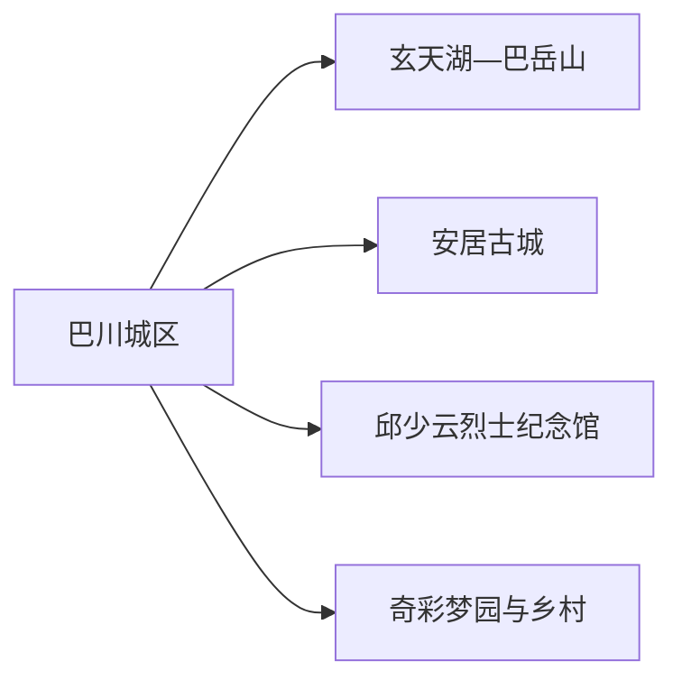
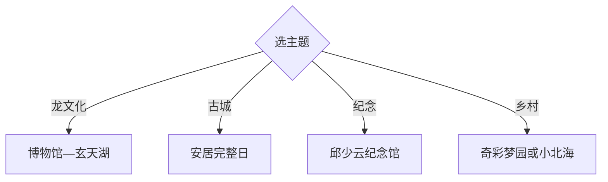

# 铜梁旅行指南

铜梁适合围绕“龙文化”安排：城区看博物馆、龙灯龙舞和玄天湖，安居古城留完整一日，邱少云纪念文化与乡村花田按兴趣增加。两天可覆盖核心，活动日则把演出时间作为行程锚点。

## 城市速览

| 项目 | 信息 |
|---|---|
| 主线 | 巴川城区—玄天湖—铜梁博物馆—安居古城—邱少云纪念馆 |
| 停留 | 城区与安居2天；增加乡村或活动共3天 |
| 住宿 | 巴川城区交通餐饮方便，安居适合古城早晚，玄天湖适合度假 |
| 交通 | 从重庆主城公路或当期铁路进入，远端镇街用公交、正规包车或自驾 |
| 风险 | 夏季高温雷雨、古城坡道、山地防火、节庆人流与演出变动 |
| 边界 | 古建筑、宗教空间、表演安全区、湖岸水域和农业生产区按开放范围进入 |

## 城市格局与游览区域

固定 `Bachuan / GeoNames 1817848` 是铜梁区巴川街道人口点，本页以法定区级实体 `Q1331358` 组织。巴川是主城入口，安居、巴岳山和少云方向需要分别安排交通。

## 主要景点

| 景点 | 区域 | 类型 | 核心体验 | 用时 | 环境 | 体力 | 预约风险 | 天气影响 | 优先级 |
|---|---|---|---|---:|---|---|---|---|---|
| 铜梁博物馆 | 巴川城区 | 地方文博 | 区域历史、龙文化与文物展陈 | 1.5–3小时 | 室内 | 低 | 中 | 低 | A |
| 玄天湖景区 | 城区近郊 | 湖泊与演艺 | 环湖休闲、龙文化景观与当期演出 | 3–6小时 | 混合 | 中 | 高 | 高 | A |
| 巴岳山公开游线 | 城区近郊 | 山地 | 山林、古道与度假景观 | 半日 | 室外 | 中高 | 高 | 很高 | B |
| 安居古城 | 安居镇 | 历史古城 | 九宫十八庙线索、滨水街巷与民俗 | 半日至1天 | 混合 | 中 | 高 | 中 | A |
| 邱少云烈士纪念馆 | 少云方向 | 纪念馆 | 人物生平、革命史与纪念空间 | 2–4小时 | 混合 | 低 | 高 | 中 | A |
| 铜梁龙灯龙舞公开展演 | 城区或景区 | 非遗表演 | 龙舞、龙灯与节庆文化 | 1–2小时 | 混合 | 低 | 很高 | 中 | A |
| 奇彩梦园 | 南城方向 | 花卉与演艺 | 季节花田、非遗展演与亲子活动 | 3–6小时 | 室外为主 | 中 | 高 | 很高 | B |
| 西郊或小北海公开农旅点 | 城区周边 | 乡村休闲 | 田园、露营与农事体验 | 半日 | 混合 | 低中 | 高 | 高 | C |

## 美食与餐饮

城区和安居可找铜梁泡椒凤爪、油烧兔、炝炒鱼、豆花与重庆家常菜。兔、鱼和共享菜先问份量、辣度与计价；活动日提前订位，乡村农产从正规经营点购买。

## 经典行程

### 两日基础线
**路线**：铜梁博物馆—玄天湖—次日安居古城。**逻辑**：龙文化与古城分日。**预约锚点**：博物馆、演出和古城活动。**休息**：城区与安居。**删除条件**：天气不稳时取消环湖长段。

### 龙文化线
**路线**：铜梁博物馆—城区午餐—玄天湖—当期龙舞。**逻辑**：先理解非遗，再看活态表演。**预约锚点**：展演时间。**休息**：玄天湖服务区。**删除条件**：无演出时保留博物馆与湖岸。

### 安居古城线
**路线**：古城入口—文庙县衙等开放点—滨水街巷—夜间活动。**逻辑**：完整一天减少往返。**预约锚点**：场馆、演出与返程。**休息**：古城餐饮区。**删除条件**：暴雨时缩短滨水段。

### 巴岳山玄天湖线
**路线**：巴岳山正式入口—核心步道—玄天湖休息。**逻辑**：先爬升后湖岸放松。**预约锚点**：山路、防火与交通。**休息**：玄天湖。**删除条件**：雷雨、火险或结冰时取消山段。

### 邱少云纪念线
**路线**：城区—邱少云烈士纪念馆—少云镇公共空间—返城。**逻辑**：围绕人物主题完整参访。**预约锚点**：开馆、讲解与车辆。**休息**：少云镇。**删除条件**：闭馆时取消远线。

### 乡村活动线
**路线**：奇彩梦园或小北海二选一—乡村午餐—返城。**逻辑**：按花期与活动选择成熟点。**预约锚点**：花情、演出与接待。**休息**：园区。**删除条件**：季节不匹配时改城区。

### 低体力线
**路线**：铜梁博物馆—车辆游玄天湖—城区商圈。**逻辑**：减少古城坡路和山地爬升。**预约锚点**：无障碍和落客。**休息**：场馆。**删除条件**：高温时保留室内与短段湖岸。

## 住宿区域

巴川城区适合交通、餐饮和多方向换线；玄天湖周边适合演出与度假；安居古城适合清晨傍晚慢游；乡村住宿适合花期或露营主题，重点确认消防、供餐、卫生、交通和退改。

## 市内交通

铜梁与重庆主城以公路和当期公共交通衔接，安居、少云及乡村点需核对公交末班。自驾在节庆日关注临时停车和分流；演出散场提前锁定返程。山地入口和古城落客点可能分离。

## 不同旅行者须知

非遗兴趣者按龙舞活动倒排行程；历史兴趣者选安居；亲子可用博物馆、玄天湖和花园组合；低体力者集中城区。古建筑、宗教活动区、演出安全线、湖岸水域和农业生产区保留明确限制。

## 行前核对

- 核对博物馆、玄天湖演出、巴岳山、安居古城、纪念馆和乡村活动开放。
- 核对重庆联程、区内公交、节庆分流、雷雨防火与返程。
- 非遗表演遵守安全隔离，古城住宅和宗教空间按礼仪参观，湖岸走公开步道。

## 来源与更新记录

| 来源 | 支持内容 | 核验日期 |
|---|---|---|
| [铜梁文旅“十四五”规划](https://www.cqstl.gov.cn/zwgk_171/zfxxgkml/zdjcygk/zdjccajd/202211/t20221113_11295780.html) | 安居古城、玄天湖、巴岳山、龙文化与少云故里 | 2026-09-01 |
| [重庆市政府：铜梁文体旅场景](https://cq.gov.cn/ywdt/zwhd/qxdt/202604/t20260424_15633182.html) | 景区、非遗表演、美食与乡村路线 | 2026-09-01 |
| [GeoNames 1817848](https://www.geonames.org/1817848/) | Bachuan 固定主城点 | 2026-09-01 |
| [Wikidata Q1331358](https://www.wikidata.org/wiki/Q1331358) | 铜梁区实体与跨库标识 | 2026-09-01 |

| 日期 | 更新 |
|---|---|
| 2026-09-01 | 首次完成铜梁旅行研究，以区级结构承接巴川固定记录。 |
