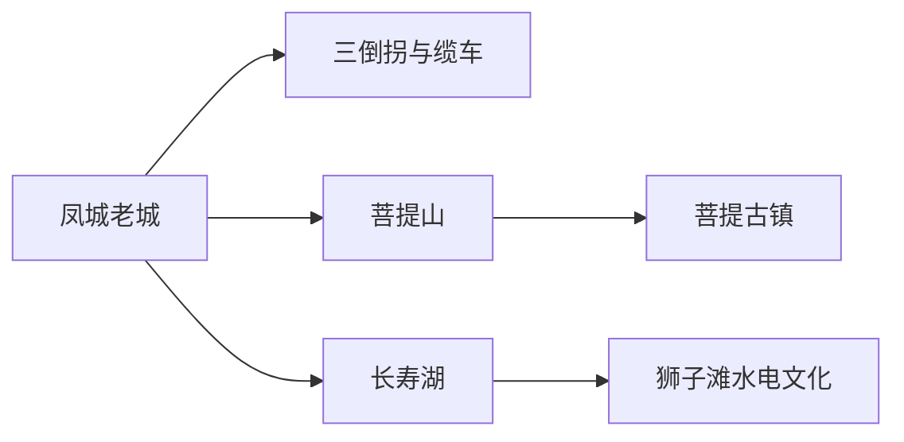
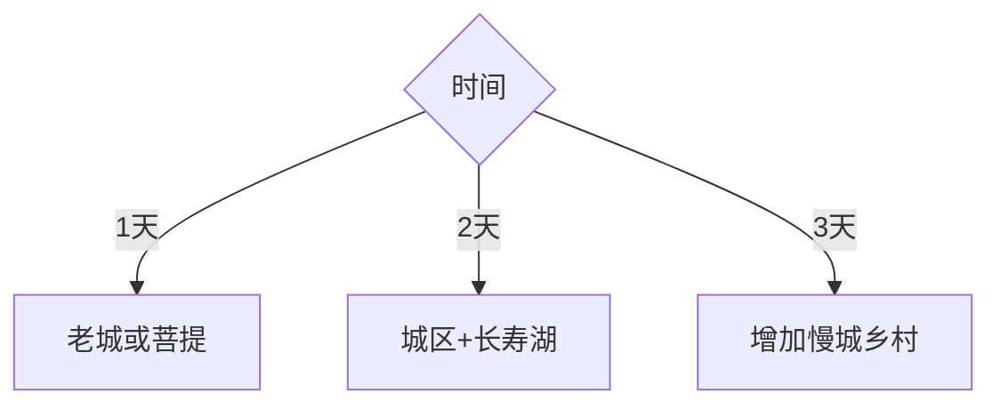

# 长寿旅行指南

长寿区把长江老城、菩提山—菩提古镇、长寿湖和工业水电记忆放在同一县级尺度内。城区可用一天串联，长寿湖适合独立一天；三倒拐历史街区处于保护修缮与活化过程中，按当期开放路段安排。

## 城市速览

| 项目 | 信息 |
|---|---|
| 主线 | 凤城老城—菩提山古镇—长寿湖 |
| 停留 | 城区1–2天；长寿湖另留1天 |
| 住宿 | 凤城与菩提片区便于城市线；湖区适合度假 |
| 交通 | 重庆铁路联程、区内公交与远线车辆 |
| 风险 | 山城坡道、盛夏高温、强降雨、临水活动与大坝管理 |
| 边界 | 历史街区、居民巷道、水电工程、湖区和工业园分别管理 |

## 城市格局与游览区域

凤城承接老城与长江岸线，菩提片区适合城市休闲，长寿湖位于区内远线。固定清单以增福街道记录 **GeoNames 8416213** 建页并承接长寿区旅行结构；Wikidata `Q713691` 的 P1566 指向区级行政记录 `1815538`，增福是区内片区之一。

## 主要景点

| 景点 | 区域 | 类型 | 核心体验 | 用时 | 环境 | 体力 | 研究价值 | 拥挤 | 优先级 |
|---|---|---|---|---:|---|---|---|---|---|
| 三倒拐历史文化街区开放段 | 凤城 | 历史街区 | 山地街巷、巴渝民居与城市记忆 | 2–3小时 | 室外 | 中高 | 高 | 中 | A |
| 长寿缆车及沿线开放空间 | 凤城 | 城市交通遗产 | 山城高差与长江老城视角 | 1–2小时 | 混合 | 中 | 中高 | 中 | B |
| 菩提山文化旅游景区 | 菩提片区 | 山地人文 | 城市登高与长寿文化 | 2–4小时 | 室外 | 中高 | 中 | 中 | A |
| 菩提古镇 | 菩提片区 | 休闲街区 | 夜间消费、节庆与巴渝风格空间 | 2–4小时 | 混合 | 低中 | 中 | 高 | B |
| 长寿湖旅游景区 | 长寿湖 | 湖泊度假 | 湖岛、步道与水上休闲 | 1天 | 室外 | 中 | 高 | 高 | A |
| 狮子滩大坝公众观景区 | 长寿湖 | 工业水电 | 人工湖形成与“一五”水电史 | 1–2小时 | 室外 | 低中 | 高 | 中 | B |
| 三洞沟等正式城市步道 | 城区 | 城市生态 | 山地沟谷与生态修复 | 1–2小时 | 室外 | 中 | 中 | 低 | C |

三倒拐按保护修缮范围通行；狮子滩大坝、水电设施和泄洪空间只在公众观景区停留。湖面活动使用正规运营项目。

## 美食与餐饮

长寿米粉、肥肠饭、鱼鲜、沙田柚及重庆小面适合城区体验。湖鱼先确认来源、重量和做法；火锅与汤锅说明辣度、内脏、花生芝麻和共享锅具。

## 经典行程

### 两日基础线
**路线**：三倒拐—菩提片区—长寿湖。**逻辑**：城市历史与湖区各占一天。**预约锚点**：缆车、湖区项目和车辆。**休息**：古镇与湖区游客中心。**删除条件**：强降雨时缩短坡道。

### 老城记忆线
**路线**：三倒拐开放段—长寿缆车—滨江公共空间。**逻辑**：沿高差理解老城。**预约锚点**：街区修缮、缆车运营。**休息**：凤城餐饮。**删除条件**：道路封闭时改菩提片区。

### 菩提休闲线
**路线**：菩提山—菩提古镇—夜间活动。**逻辑**：白天登高、晚间休闲。**预约锚点**：景区和节庆。**休息**：古镇室内。**删除条件**：高温时减山地段。

### 长寿湖水电线
**路线**：长寿湖—狮子滩公众观景区—湖区住宿或返程。**逻辑**：自然休闲与水电史同日理解。**预约锚点**：船班、演艺和水情。**休息**：湖区服务点。**删除条件**：大风、雷雨或停航时只走岸线。

### 城市生态线
**路线**：三洞沟—桃花溪公共绿道—城市公园。**逻辑**：观察山地城市生态修复。**预约锚点**：步道开放和天气。**休息**：每小时补水。**删除条件**：暴雨预警时转室内。

### 亲子研学线
**路线**：狮子滩水电主题—长寿湖短线—菩提古镇。**逻辑**：工程科普和轻松体验结合。**预约锚点**：讲解、船只与儿童安全。**休息**：湖区午休。**删除条件**：临水条件不佳时改城市线。

### 低体力线
**路线**：菩提古镇—车辆到湖区观景点—城区。**逻辑**：优先平缓、可落客区域。**预约锚点**：落客、座椅和无障碍。**休息**：午后酒店。**删除条件**：远线车程不适时只留古镇。

## 住宿区域

凤城便于老城和公共交通，菩提片区适合餐饮与夜间休闲，长寿湖适合度假和清晨活动。确认湖区交通、周末价格、停车、电梯、临水安全和取消政策。

## 市内交通

长寿北站、长寿湖站、凤城与湖区分属不同节点。按住宿地选择到发站，城市公交适合城区，湖区和乡村远线提前核对接驳；重庆中心城区当天往返需预留晚高峰。

## 不同旅行者须知

城市史爱好者优先三倒拐和缆车；亲子家庭选择湖区正规项目；长者住菩提片区并减少坡道；自驾者按景区停车引导；工业爱好者只在水电工程公众区域参观。

## 行前核对

- 核对三倒拐修缮、长寿缆车、菩提山和长寿湖运营。
- 核对铁路到发站、湖区船班、雷雨高温和周末住宿。
- 大坝、水电、工业园、居民巷道和临水区域按管理边界进入。

## 来源与更新记录

| 来源 | 支持内容 | 核验日期 |
|---|---|---|
| [重庆市政府：长寿生态文化精品线路](https://www.cq.gov.cn/zwgk/zfxxgkml/zdlyxxgk/ggwh/ly/zxdt/202606/t20260603_15725724.html) | 长寿湖、狮子滩、菩提山、三洞沟与三倒拐 | 2026-09-01 |
| [重庆市政府：长寿生态与人文旅游](https://www.cq.gov.cn/ywdt/zwhd/qxdt/202106/t20210609_9384424.html) | 湖区、菩提片区、三倒拐与乡村方向 | 2026-09-01 |
| [民政部行政区划代码查询](https://dmfw.mca.gov.cn/xzqh/getList?code=50&trimCode=true&maxLevel=3) | 长寿区行政层级与代码 | 2026-09-01 |
| [GeoNames 8416213](https://www.geonames.org/8416213/) | Zengfu 固定城市点 | 2026-09-01 |
| [Wikidata Q713691](https://www.wikidata.org/wiki/Q713691) | 长寿区实体与行政记录关系 | 2026-09-01 |

| 日期 | 更新 |
|---|---|
| 2026-09-01 | 首次完成长寿旅行研究；建立老城、菩提与长寿湖水电路线 |
